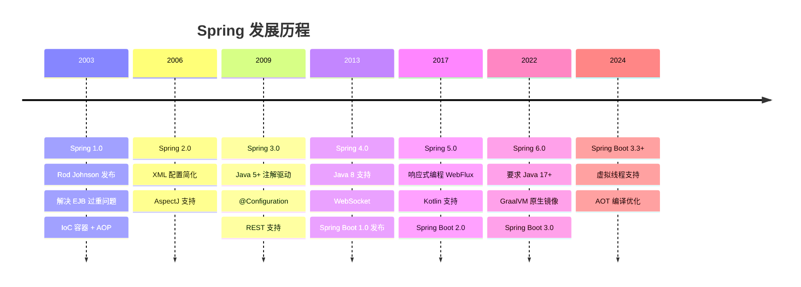
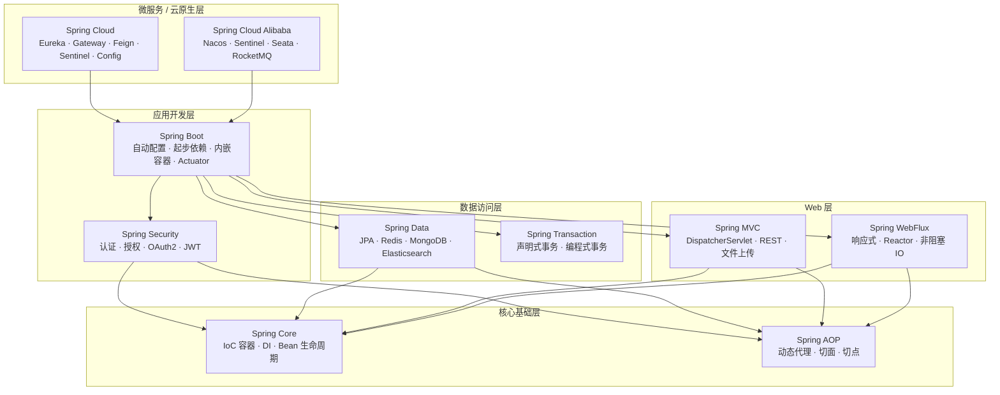
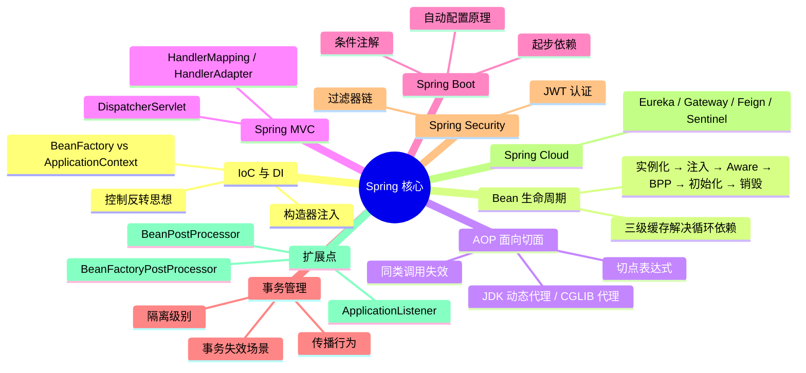

# Spring / Spring Boot 核心原理

---

## Spring 是什么？

Spring 是 Java 生态中**最主流的企业级应用开发框架**，由 Rod Johnson 于 2003 年创建，核心思想是通过 **IoC（控制反转）** 和 **AOP（面向切面编程）** 解耦应用组件，让开发者专注于业务逻辑而非基础设施。

> 一句话：Spring 是"Java 企业开发的基础设施"，就像盖楼的钢筋框架，业务代码是砖块，Spring 把它们组装在一起。

---

## 发展历程

> 📌 **当前主流**：企业新项目普遍使用 **Spring Boot 3.x + Java 17/21**；存量项目多为 Spring Boot 2.x + Java 8/11。

---

## Spring 框架版图

---

## 知识地图

---

## 知识点导航

| # | 知识点 | 核心一句话 | 详细文档 |
|---|--------|-----------|---------|
| 1 | **IoC 与 DI** | IoC 是"容器管对象"，DI 是"容器送依赖"，推荐构造器注入 | [IoC与DI](@spring-核心基础-IoC与DI) |
| 2 | **Bean 生命周期与循环依赖** | 实例化→注入→Aware→BPP前→初始化→BPP后→使用→销毁；三级缓存解决循环依赖 | [Bean生命周期与循环依赖](@spring-核心基础-Bean生命周期与循环依赖) |
| 3 | **容器启动流程** | refresh() 12 步：BeanDefinition 加载→BPP 注册→单例实例化→事件发布 | [Spring容器启动流程深度解析](@spring-核心基础-Spring容器启动流程深度解析) |
| 4 | **Spring 扩展点** | BPP 干预初始化，BFPP 修改 Bean 定义，ApplicationListener 监听事件 | [Spring扩展点详解](@spring-核心基础-Spring扩展点详解) |
| 5 | **AOP 面向切面** | 基于代理拦截，`this` 调用绕过代理，Spring Boot 2.x 后默认 CGLIB | [AOP面向切面编程](@spring-核心基础-AOP面向切面编程) |
| 6 | **事务管理** | 事务是 AOP 特例，`this` 调用不生效，异常要抛出，注意传播行为 | [Spring事务管理](@spring-核心基础-Spring事务管理) |
| 7 | **自动配置原理** | `@EnableAutoConfiguration` 读列表，条件注解按需过滤，允许用户覆盖 | [SpringBoot自动配置原理](@spring-核心基础-SpringBoot自动配置原理) |
| 8 | **常用注解全解** | `@Conditional`、`@ConfigurationProperties`、`@Profile`、`@Import` 等高频注解 | [Spring常用注解全解](@spring-核心基础-Spring常用注解全解) |
| 9 | **Spring MVC** | DispatcherServlet 总调度，HandlerMapping 找处理器，HandlerAdapter 适配调用 | [SpringMVC请求处理流程](@spring-Web与通信-SpringMVC请求处理流程) |
| 10 | **Feign 声明式 HTTP** | 声明式 HTTP 客户端，注解定义接口即可调用远程服务 | [Feign声明式HTTP客户端](@spring-Web与通信-Feign声明式HTTP客户端) |
| 11 | **gRPC 详解** | 高性能 RPC 框架，基于 Protobuf 序列化 + HTTP/2 传输 | [gRPC详解](@spring-Web与通信-gRPC详解) |
| 12 | **Spring Security** | 过滤器链拦截请求，JWT 无状态认证，方法级权限控制 | [Spring-Security认证与授权](@spring-微服务与安全-Spring-Security认证与授权) |
| 13 | **Spring Cloud** | Eureka 服务发现 + Gateway 网关 + Feign 调用 + Sentinel 熔断 | [Spring-Cloud核心组件](@spring-微服务与安全-Spring-Cloud核心组件) |
| 14 | **微服务架构实践** | 服务拆分、通信、治理、部署的完整微服务落地方案 | [微服务架构深度实践](@spring-微服务与安全-微服务架构深度实践) |
| 15 | **安全架构深度** | OAuth2、RBAC、ABAC、安全漏洞防护等企业级安全方案 | [Spring安全架构深度解析](@spring-微服务与安全-Spring安全架构深度解析) |
| 16 | **数据访问高级** | JPA 优化、多数据源、读写分离、MyBatis 高级用法 | [Spring数据访问高级技巧](@spring-数据与消息-Spring数据访问高级技巧) |
| 17 | **响应式编程** | WebFlux + Reactor，非阻塞 IO，适合高并发低延迟场景 | [Spring响应式编程深度解析](@spring-数据与消息-Spring响应式编程深度解析) |
| 18 | **消息驱动架构** | Spring Kafka/RabbitMQ 集成，事件驱动、CQRS、Saga 模式 | [Spring消息驱动架构深度解析](@spring-数据与消息-Spring消息驱动架构深度解析) |
| 19 | **性能优化** | 监控→内存→启动→并发→数据库→缓存→网络，全方位优化指南 | [监控与内存优化](@spring-进阶与调优-监控与内存优化) |
| 20 | **Spring 6 / Boot 3** | Java 17+、Jakarta EE、GraalVM Native Image、虚拟线程、AOT 编译 | [Spring6-Boot3新特性深度解析](@spring-进阶与调优-Spring6-Boot3新特性深度解析) |
| 21 | **源码阅读技巧** | 从入口到核心，掌握 Spring 源码阅读与调试的方法论 | [Spring源码阅读与调试技巧](@spring-进阶与调优-Spring源码阅读与调试技巧) |
| 22 | **生产环境运维** | Actuator 监控、日志管理、优雅停机、灰度发布等运维实践 | [生产环境Spring应用运维](@spring-进阶与调优-生产环境Spring应用运维) |
| 23 | **测试框架** | 单元测试、集成测试、MockMvc、TestContainers 等测试最佳实践 | [Spring测试框架深度使用](@spring-测试与实战-Spring测试框架深度使用) |
| 24 | **实战应用题** | 事务排查、长事务优化、AOP失效、Bean泄漏等 12 道实战题 | [Spring实战应用题](@spring-测试与实战-Spring实战应用题) |

---

## 高频问题索引

| 问题 | 详见 |
|------|------|
| IoC 和 DI 的区别？BeanFactory vs ApplicationContext？ | [IoC与DI](@spring-核心基础-IoC与DI) |
| Bean 单例线程安全吗？循环依赖如何解决？ | [Bean生命周期与循环依赖](@spring-核心基础-Bean生命周期与循环依赖) |
| AOP 不生效怎么排查？为什么默认用 CGLIB？ | [AOP面向切面编程](@spring-核心基础-AOP面向切面编程) |
| 事务不回滚的原因？REQUIRED vs REQUIRES_NEW？ | [Spring事务管理](@spring-核心基础-Spring事务管理) |
| 自动配置原理？如何自定义 Starter？ | [SpringBoot自动配置原理](@spring-核心基础-SpringBoot自动配置原理) |
| 认证和授权的区别？JWT vs Session？ | [Spring-Security认证与授权](@spring-微服务与安全-Spring-Security认证与授权) |
| Eureka 自我保护是什么？服务雪崩如何防止？ | [Spring-Cloud核心组件](@spring-微服务与安全-Spring-Cloud核心组件) |
| 线上 OOM / Bean 泄漏怎么排查？ | [Spring实战应用题](@spring-测试与实战-Spring实战应用题) |
