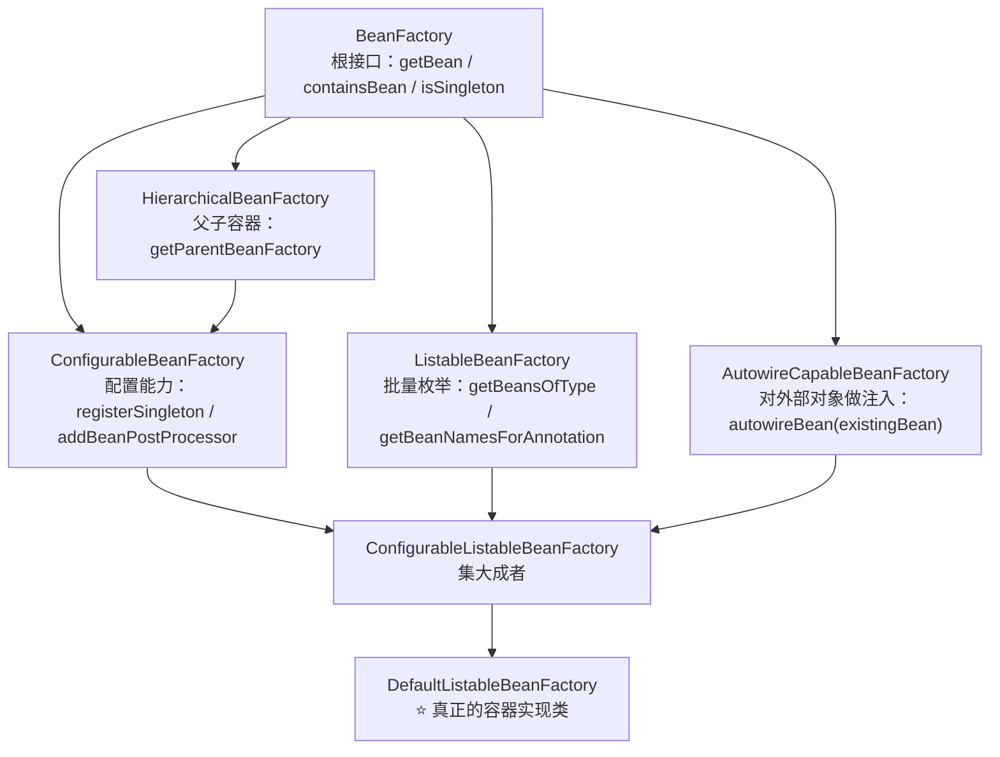
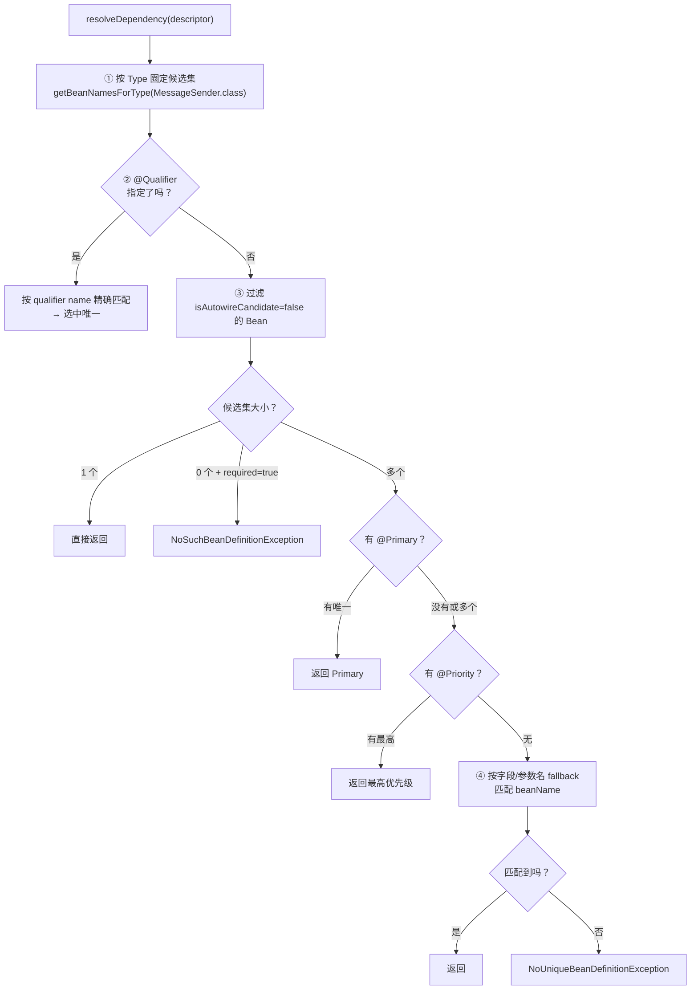
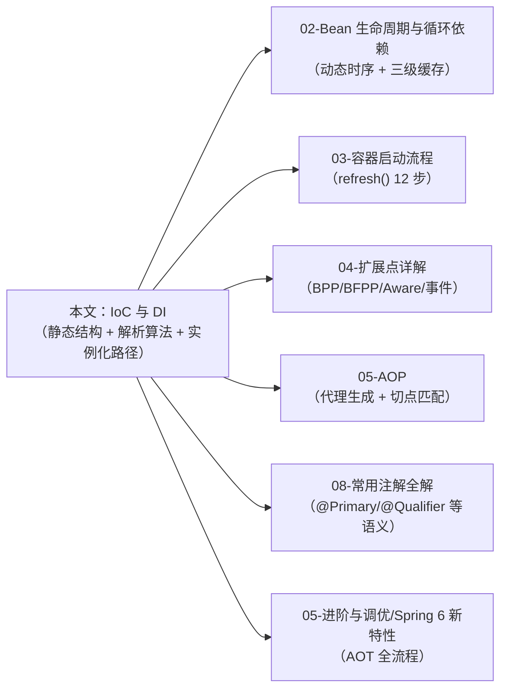

# IoC 与 DI —— 控制反转与依赖注入

> **一句话记忆口诀**：  
> IoC 容器的底层是 `DefaultListableBeanFactory`，元数据是 `BeanDefinition`，注入是按 `DependencyDescriptor` 解析（类型 → `@Qualifier`/`@Primary` → 泛型 → 名字 fallback）；  
> Bean 实例化有三条路径（反射构造器 / `@Bean` 工厂方法 / `FactoryBean`）；  
> Spring 6 默认禁用循环依赖自动解决，AOT 下 `BeanDefinition` 在构建期固化。

> 📖 **边界声明**：本文聚焦"IoC 容器的**静态结构、元数据抽象、依赖解析算法、实例化路径**"，以下主题请见对应专题：
>
> - 循环依赖的三级缓存机制、`@Lazy` 破解方案 → [Bean 生命周期与循环依赖](@spring-核心基础-Bean生命周期与循环依赖)
> - `refresh()` 12 步启动流程、Context 初始化时序 → [Spring 容器启动流程深度解析](@spring-核心基础-Spring容器启动流程深度解析)
> - `BeanPostProcessor` / `BeanFactoryPostProcessor` / `*Aware` 接口的完整使用 → [Spring 扩展点详解](@spring-核心基础-Spring扩展点详解)
> - `@Primary` / `@Qualifier` / `@Scope` / `@Lazy` 等注解的完整语义 → [Spring 常用注解全解](@spring-核心基础-Spring常用注解全解)
> - AOT 构建流程、GraalVM 原生镜像完整实践 → [Spring 6 / Boot 3 新特性深度解析](@spring-进阶与调优-Spring6-Boot3新特性深度解析)

---

## 1. 引入：IoC 到底"反转"了什么？

"控制反转"这个名字常让人困惑——反转的到底是什么？高级开发者需要一个精确定义，而不是停留在"容器帮我们 new 对象"这种朴素理解。

### 1.1 被反转的三件事

| 控制权 | 传统方式 | IoC 下 |
| :-- | :-- | :-- |
| **对象创建** | `new XxxImpl()` 由调用方决定 | 容器依据 `BeanDefinition` 决定 |
| **依赖查找** | 调用方主动 `ServiceLocator.lookup()` | 容器通过 `DependencyDescriptor` 反向注入 |
| **生命周期** | 调用方持有引用直到 GC | 容器按 scope 管理创建与销毁 |

!!! note "IoC vs DI 的精确关系"
    **IoC 是一种设计原则**，反转了"对象图构建"的控制权；**DI 是 IoC 的实现手段之一**（另一种是 Service Locator）。Spring 选择 DI 是因为：① 依赖显式出现在构造器/字段签名上，利于静态分析；② 对象无需感知容器存在，可脱离容器独立测试。

### 1.2 不理解底层会踩的坑

- 不知道 `BeanDefinition` 与 Bean 实例的二分 → 读不懂 `BeanFactoryPostProcessor` 在修改什么
- 不知道依赖解析算法 → 多实现类时无法预测 `@Autowired` 到底选了哪一个
- 不知道 Full/Lite `@Configuration` 的区别 → `@Bean` 方法互调出现"同一个 Bean 被创建两次"
- 不知道 Spring 6 默认禁用循环依赖 → 从 Boot 2 升级到 Boot 3 后启动报错不知所措

---

## 2. 类比：Bean 容器 = 物业公司

```txt
物业公司（IoC 容器）
    ├─ 住户档案卡（BeanDefinition）← 还不是住户本人，只是登记表
    │    ├─ 姓名（beanClassName）
    │    ├─ 房型（scope）
    │    ├─ 入住时间（lazy-init）
    │    └─ 要接的水电网（propertyValues / constructorArgs）
    ├─ 住户本人（Bean 实例）     ← 按档案卡"实例化"出来的真实对象
    └─ 水电对接（DI）             ← 物业主动把水电接到户内，而不是住户自己去找
```

**关键直觉**：容器启动的**前半段只有档案卡，没有住户**；后半段才按档案卡把住户一个个"造出来"。这是理解一切扩展点的前提——`BeanFactoryPostProcessor` 改的是档案卡，`BeanPostProcessor` 改的是已入住的住户。

---

## 3. IoC 容器的静态结构：接口家族与底层实现

大多数文档只对比 `BeanFactory` 与 `ApplicationContext` 两个接口，但高级开发者必须掌握完整的接口继承体系，才能理解为什么 Spring MVC 有父子容器、为什么 `@Autowired` 能装配外部对象。

### 3.1 `BeanFactory` 家族继承图



!!! note "📖 术语家族：`*Factory` 工厂家族"
    **字面义**：Factory = 工厂，制造东西的地方

    **在 Spring 中的含义**：凡名字含 `Factory` 的接口/类，都与"**造 Bean**"这件事相关——但具体是"造 Bean 的容器"还是"本身是 Bean 的工厂"有微妙区分（见命名规律）。

    **同家族成员**：

    | 成员 | 作用 | 源码位置 |
    | :-- | :-- | :-- |
    | `BeanFactory` | IoC 容器的根接口，定义"取 Bean"契约 | `org.springframework.beans.factory.BeanFactory` |
    | `FactoryBean<T>` | **反例**：自身是 Bean，但对外暴露 `getObject()` 的结果 | `org.springframework.beans.factory.FactoryBean` |
    | `ObjectFactory<T>` | 延迟取 Bean 的 0 参工厂（单方法 `getObject()`） | `org.springframework.beans.factory.ObjectFactory` |
    | `ObjectProvider<T>` | `ObjectFactory` 的增强版，支持 stream / getIfAvailable | `org.springframework.beans.factory.ObjectProvider` |
    | `AutowireCapableBeanFactory` | 支持对容器外对象做注入的 BeanFactory | `org.springframework.beans.factory.config.AutowireCapableBeanFactory` |

    **命名规律**：

    - `<Xxx>BeanFactory` = "一种 BeanFactory"（继承链上的容器接口，如 `ConfigurableListableBeanFactory`）
    - `<Xxx>Factory<T>` = "造 T 的工厂"（如 `ObjectFactory<T>` 造出 T）
    - **`FactoryBean<T>` 是反直觉特例**：它不是"一种 Factory"，而是"**把 Factory 包装成 Bean**"——容器实例化 `FactoryBean` 本身，但 `getBean()` 返回 `getObject()` 的结果（详见 §7.3）

!!! tip "ApplicationContext 只是个壳"
    我们平时说的"Spring 容器"指 `ApplicationContext`，但真正持有 Bean 的容器是它内部的 `DefaultListableBeanFactory`。`AnnotationConfigApplicationContext` 的 `getBean()` 最终都会委托到 `beanFactory.getBean()`，`beanFactory` 就是一个 `DefaultListableBeanFactory` 类型的字段。

### 3.2 每个接口解决什么问题

| 接口 | 存在的理由 | 典型使用方 | 源码依据 |
| :-- | :-- | :-- | :-- |
| `BeanFactory` | 最小可用容器，定义"按名/按类型取 Bean"的契约 | 所有容器使用方 | `BeanFactory#getBean(String)` |
| `HierarchicalBeanFactory` | 暴露父容器引用（`getParentBeanFactory`）并提供"仅查本地"的判断（`containsLocalBean`）——构成 Spring MVC 父子容器遮蔽查找的基础（真正"找不到就向上委托"的实现在 `AbstractBeanFactory#doGetBean`） | Spring MVC：Root Context 装 Service/DAO，DispatcherServlet 的 WebApplicationContext 装 Controller | `HierarchicalBeanFactory#getParentBeanFactory()` / `containsLocalBean(String)` |
| `ListableBeanFactory` | 支持批量操作（`getBeansOfType(Xxx.class)`），是 `@Autowired List<T>` 的基础 | `@Autowired Map<String, MessageSender>` 的实现依赖此接口 | `ListableBeanFactory#getBeansOfType(Class)` |
| `AutowireCapableBeanFactory` | 对**容器外**的对象（如手动 `new` 出来的）执行依赖注入 | Spring 与其他框架整合：`ctx.getAutowireCapableBeanFactory().autowireBean(obj)` | `AutowireCapableBeanFactory#autowireBean(Object)` |
| `ConfigurableBeanFactory` | 允许运行时注册单例、添加 `BeanPostProcessor` | 框架二次开发 | `ConfigurableBeanFactory#addBeanPostProcessor` |

!!! warning "父子容器的常见陷阱"
    Spring MVC 经典错误：在 Root Context 扫描了 `@Controller` → 事务生效但拦截器不生效；或在 Child Context（Web Context）扫描了 `@Service` → 导致全局事务配置失效。**规则**：Controller 只由 Web Context 扫描，Service/Repository 只由 Root Context 扫描，避免双扫描。Spring Boot 因为只有**单一** `ApplicationContext`，彻底回避了这个问题。

### 3.3 `BeanFactory` 与 `ApplicationContext` 的正确对比

| 对比项 | `BeanFactory` | `ApplicationContext` |
| :-- | :-- | :-- |
| 接口层级 | 根接口 | 继承 `ListableBeanFactory` + `HierarchicalBeanFactory` + 新增 `MessageSource` / `ApplicationEventPublisher` / `ResourceLoader` |
| 单例加载 | 懒加载（首次 `getBean` 时创建） | 启动时预初始化所有非 lazy 单例（`preInstantiateSingletons()`） |
| 扩展能力 | 无事件、无国际化 | 事件发布、`@Value` 资源解析、消息国际化 |
| 实际使用 | 几乎不直接使用 | 99% 的生产代码接触的都是它 |

!!! note "📖 术语家族：`*Context` 上下文家族"
    **字面义**：Context = 上下文 / 运行环境，描述"某个对象所处的世界"

    **在 Spring 中的含义**：`ApplicationContext` 是"Spring 应用的运行环境"——它在 `BeanFactory`（取 Bean 的能力）之上，叠加了事件发布、国际化、资源加载等"应用级"能力。不同的 `*Context` 实现区别仅在"**从哪装载配置**"与"**面向什么运行场景**"。

    **同家族成员**：

    | 成员 | 配置来源 / 场景 | 源码位置 |
    | :-- | :-- | :-- |
    | `ApplicationContext` | 接口根 | `org.springframework.context.ApplicationContext` |
    | `ConfigurableApplicationContext` | 可配置的 ApplicationContext（暴露 `refresh()` / `close()`） | `org.springframework.context.ConfigurableApplicationContext` |
    | `AnnotationConfigApplicationContext` | 从注解配置类装载（`@Configuration` + `@ComponentScan`） | `org.springframework.context.annotation.AnnotationConfigApplicationContext` |
    | `ClassPathXmlApplicationContext` | 从 classpath 的 XML 装载 | `org.springframework.context.support.ClassPathXmlApplicationContext` |
    | `WebApplicationContext` | Web 场景，持有 `ServletContext` 引用 | `org.springframework.web.context.WebApplicationContext` |
    | `AnnotationConfigServletWebServerApplicationContext` | Boot 默认用的 Web + 注解 Context | `org.springframework.boot.web.servlet.context.*` |

    **命名规律**：

    - `<来源>ApplicationContext` = "从 <来源> 装载配置的上下文"（`AnnotationConfig` / `ClassPathXml` / `FileSystemXml`）
    - `<场景>ApplicationContext` = "适配 <场景> 的上下文"（`Web` / `Reactive`）
    - `Configurable<Xxx>Context` = "可被二次配置的 Xxx Context"（提供 `refresh` / `close` 钩子）

    📌 **共同点**：所有 `*Context` 内部都组合了一个 `DefaultListableBeanFactory` 字段作为真正的容器实现（见 §3.1 `!!! tip`）。

---

## 4. IoC 容器的元数据核心：BeanDefinition

**BeanDefinition 是整个 IoC 容器的基石**。没有它，所有扩展点都无从谈起。

### 4.1 BeanDefinition 是什么

它是一个**纯数据对象**，描述"如何创建一个 Bean"，而**不是 Bean 本身**。容器启动的前半段只有 `BeanDefinition`，后半段才按它反射创建出 Bean 实例。

```java
public interface BeanDefinition extends AttributeAccessor, BeanMetadataElement {
    String getBeanClassName();       // 全限定类名
    String getScope();               // singleton / prototype / request / session
    boolean isLazyInit();            // 是否懒加载
    boolean isPrimary();             // 是否 @Primary
    String getFactoryBeanName();     // 工厂 Bean 名（@Bean 方法所在类）
    String getFactoryMethodName();   // 工厂方法名（@Bean 方法名）
    ConstructorArgumentValues getConstructorArgumentValues(); // 构造器参数
    MutablePropertyValues getPropertyValues();                // setter 属性
    int getAutowireMode();           // AUTOWIRE_NO / BY_NAME / BY_TYPE / CONSTRUCTOR
    String[] getDependsOn();         // @DependsOn 声明的强依赖
    // ...
}
```

### 4.2 BeanDefinition 家族

在介绍家族成员之前，先澄清一个概念：**`BeanDefinition` 之间可以存在"父子关系"**——一个 BD 可以通过 `parentName` 字段声明继承自另一个 BD，从父 BD 继承 scope、property、构造器参数等配置（类似 XML 里的 `<bean parent="...">`）。注解时代极少手写 parent，但容器内部仍会统一执行"合并（merge）"动作，把父子链扁平化成一个**无 parent** 的 `RootBeanDefinition` 再拿去实例化——这是理解下面家族分工（尤其是 `GenericBeanDefinition` vs `RootBeanDefinition`）的关键。

!!! note "📖 术语家族：`BeanDefinition`"
    **字面义**：Definition = 定义 / 描述，**不是对象本身，而是对象的"说明书"**

    **在 Spring 中的含义**：描述"如何创建一个 Bean"的纯数据对象——类名、作用域、构造器参数、依赖配置等。容器启动前半段只有 `BeanDefinition`，后半段才按它反射造出真正的 Bean。

    **同家族成员**：

    | 成员 | 定位 / 所处阶段 | 典型来源 | 源码位置 |
    | :-- | :-- | :-- | :-- |
    | `AbstractBeanDefinition` | 抽象基类，持有所有字段 | 不直接使用 | `org.springframework.beans.factory.support.AbstractBeanDefinition` |
    | `GenericBeanDefinition` | **解析期**使用的通用定义，可后改 parent | 注解扫描、XML 解析的初始产物 | `org.springframework.beans.factory.support.GenericBeanDefinition` |
    | `RootBeanDefinition` | **合并后**用于实例化的最终定义，无 parent | `getMergedLocalBeanDefinition` 的返回值 | `org.springframework.beans.factory.support.RootBeanDefinition` |
    | `AnnotatedGenericBeanDefinition` | 基于注解的定义，携带 `AnnotationMetadata` | `@Configuration` 类、`@ComponentScan` 扫到的类 | `org.springframework.context.annotation.AnnotatedGenericBeanDefinition` |
    | `ScannedGenericBeanDefinition` | 组件扫描产生的定义，带 ASM 解析的元数据 | `ClassPathBeanDefinitionScanner` 扫到的类 | `org.springframework.context.annotation.ScannedGenericBeanDefinition` |

    **命名规律**：

    - `<阶段>BeanDefinition` = "处于 <阶段> 的 BD"（`Generic` = 解析期 / `Root` = 合并后可实例化）
    - `<来源>BeanDefinition` = "来自 <来源> 的 BD"（`Annotated` 注解 / `Scanned` 组件扫描）

!!! tip "合并（merge）是一个关键动作"
    每次实例化前，容器会把 `GenericBeanDefinition` 及其 parent 链合并成一个扁平的 `RootBeanDefinition`——合并属性、合并作用域、合并依赖。这一步之后再无 parent 关系，后续的反射创建、依赖注入都只看合并后的结果。

### 4.3 BeanDefinition vs Bean：必须分清的两个世界

```txt
┌────────────────────────┐          ┌────────────────────────┐
│   BeanDefinition 世界   │  反射    │      Bean 实例世界      │
│   （元数据/配置）         │ ──────→ │       （真实对象）       │
│                         │  实例化  │                        │
│ - BeanDefinition Map    │         │ - singletonObjects     │ 
│ - scope/class/args      │         │ - 已注入依赖的对象       │
│ - 只在启动前半段存在       │         │ - 整个运行期存在         │
└────────────────────────┘          └────────────────────────┘
       ↑                                     ↑
       │                                     │
 BeanFactoryPostProcessor               BeanPostProcessor
 （修改"档案卡"）                       （增强"住户"）
```

> 📖 `BeanPostProcessor` / `BeanFactoryPostProcessor` 的具体使用方式详见 [Spring 扩展点详解](@spring-核心基础-Spring扩展点详解)，本文只强调它们作用的对象不同。

---

## 5. 依赖注入的三种方式：技术硬伤与选型规则

大多数文档罗列"优缺点"，但高级开发者需要的是**技术硬规则**——每条选择都要有源码级依据。

### 5.1 三种方式对比（源码视角）

| 注入方式 | 底层实现 | 不可变性 | 循环依赖支持（Spring 6 默认） |
| :-- | :-- | :-- | :-- |
| **字段注入** `@Autowired` | `AutowiredAnnotationBeanPostProcessor` 通过反射 `field.set(bean, value)` | ❌ 无法 `final` | ❌ 默认禁用 |
| **Setter 注入** | 反射调用 setter 方法 | ❌ | ❌ 默认禁用 |
| **构造器注入** | 反射调用构造器传参 | ✅ 可 `final` | ❌ 构造期就需要依赖，三级缓存也救不了 |

!!! warning "Spring 6 / Boot 3 的硬性变化"
    **Spring Framework 6.0+ 将 `spring.main.allow-circular-references` 默认值改为 `false`**——即便是字段注入、Setter 注入，只要出现循环依赖，启动直接报错 `BeanCurrentlyInCreationException`。

    这意味着 Boot 2.x 代码升级到 Boot 3.x 时，以前"悄悄靠三级缓存跑起来"的循环依赖会集中暴露。**治本方案是重构**，治标方案是在配置文件里显式打开：

    ```yaml
    spring:
      main:
        allow-circular-references: true
    ```

    但不建议长期依赖这个开关。

### 5.2 为什么官方推荐构造器注入（不是道德问题）

字段注入的"有害"是**技术性的**，并非风格偏好：

- **无法 `final`**：字段注入必须是非 final（反射 `setAccessible` 后才能赋值到已声明 final 字段也会触发 JPMS 限制），丢失不变性保证，Bean 的内部状态可被任意替换
- **测试必须启 Spring 容器**：无法通过 `new OrderService(mock, mock)` 完成单元测试，只能写集成测试
- **依赖数量隐形膨胀**：一个类 `@Autowired` 了 20 个字段不会有任何编译警告；但 20 参构造器在 code review 时一眼就能识破"这个类职责过重"
- **早失败**：构造器注入的缺失依赖在**启动期**暴露；字段注入可能要到某条业务路径才触发 NPE

!!! tip "Lombok 最佳实践"
    ```java
    @Service
    @RequiredArgsConstructor          // ① 为所有 final 字段自动生成构造器
    public class OrderService {
        private final UserRepository userRepo;        // ② final 保证不变性
        private final PaymentService paymentService;  // ③ 新增依赖只改字段，构造器自动生成
    }
    ```

    **关键点**：Spring 从 4.3 起规定——当类**只有一个构造器**时，`@Autowired` 可省略，自动识别为注入点。这让构造器注入在源码上和字段注入一样简洁。

---

## 6. 依赖解析的底层算法：`DependencyDescriptor` 如何选择候选者

当代码里写下 `@Autowired MessageSender sender;`，而容器里有 `EmailSender`、`SmsSender`、`KafkaSender` 三个实现时，Spring 到底按什么规则选？这是工作中最常见的排查场景。

### 6.1 核心抽象：`DependencyDescriptor`

> 📌 源码位置：`org.springframework.beans.factory.config.DependencyDescriptor`

每一个 `@Autowired` 的字段/参数都会被包装成一个 `DependencyDescriptor`，它携带：

- 目标类型（含泛型）
- 是否必需（`required=true/false` 或 `Optional`）
- 注解集合（用来识别 `@Qualifier` 等）

容器把这个描述符交给 `DefaultListableBeanFactory#resolveDependency()` 来解析。

### 6.2 候选者筛选的四层优先级



### 6.3 集合与 Map 注入的行为

`ListableBeanFactory` 让 Spring 支持"注入一组 Bean"：

```java
// ① 注入 List：顺序 = @Order 升序（Ordered 接口同理）
@Autowired
private List<MessageSender> senders;

// ② 注入 Map：Key = beanName，Value = Bean 实例
@Autowired
private Map<String, MessageSender> senderByName;
```

!!! note "顺序控制的三个注解"
    | 注解 | 来源 | 默认值 | 典型应用 |
    | :-- | :-- | :-- | :-- |
    | `@Order` | Spring | `Ordered.LOWEST_PRECEDENCE`（最大 int） | 过滤器链、责任链模式 |
    | `Ordered` 接口 | Spring | 同上 | 需要动态决定顺序时 |
    | `@Priority` | JSR-330 | - | 解决歧义时参与 `@Primary` 后的再决选 |

### 6.4 `ObjectProvider` 与 `Optional`：延迟与可选依赖

```java
// ① ObjectProvider：延迟获取 + 避免歧义异常 + 流式 API
@Autowired
private ObjectProvider<MessageSender> senderProvider;

MessageSender sender = senderProvider.getIfAvailable(() -> defaultSender);
senderProvider.orderedStream().forEach(s -> s.send("..."));

// ② Optional：有则注入，无则 Optional.empty()，不抛异常
@Autowired
private Optional<MetricsReporter> reporter;

// ③ @Autowired(required = false)：无则字段保持为 null
@Autowired(required = false)
private TracingFilter tracing;
```

!!! tip "什么时候用 ObjectProvider 而不是 Optional"
    - 需要**多个**同类型 Bean 时：只有 `ObjectProvider.stream()` 可用
    - 需要**延迟解析**（避免循环依赖、避免启动期强制初始化）时：`ObjectProvider` 内部是个 lazy lookup
    - 需要**默认值**时：`getIfAvailable(Supplier)` 比 `Optional.orElseGet` 更省一次容器查找

> 📖 `@Primary`、`@Qualifier`、`@Scope`、`@Lazy` 等注解的完整语义详见 [Spring 常用注解全解](@spring-核心基础-Spring常用注解全解)，本文只讲它们**参与依赖解析的先后顺序**。

---

## 7. Bean 实例化的三条路径

大多数人只知道"Spring 用反射 new 出 Bean"，但实际上容器有**三条完全不同**的实例化路径，它们决定了你能用什么扩展能力。

### 7.1 路径一：反射构造器（最常见）

```java
@Service
public class OrderService { /* ... */ }
```

- 容器流程：`SimpleInstantiationStrategy#instantiate()` → 反射 `Constructor.newInstance()`
- 参数解析：构造器有参数时，每个参数再走一次 `resolveDependency()`
- 限制：必须有**可访问**的构造器；多构造器时必须用 `@Autowired` 显式指定

### 7.2 路径二：`@Bean` 工厂方法（配置类）

```java
@Configuration
public class DataSourceConfig {
    @Bean
    public DataSource dataSource(@Value("${db.url}") String url) {
        return new HikariDataSource(/* ... */);
    }
}
```

- 容器流程：调用配置类实例的 `@Bean` 方法，用返回值作为 Bean
- **关键分歧**：`@Configuration(proxyBeanMethods = true/false)` 决定方法互调的行为

!!! warning "Full vs Lite 配置模式（必考）"

    ```java
    @Configuration  // 默认 proxyBeanMethods=true —— Full 模式
    public class AppConfig {
        @Bean public A a() { return new A(); }
        @Bean public B b() { return new B(a()); }  // 这里的 a() 走容器，还是直接调用？
    }
    ```

    | 模式 | `proxyBeanMethods` | 底层 | `b()` 里 `a()` 的行为 | 单例语义 |
    | :-- | :-- | :-- | :-- | :-- |
    | **Full** | `true`（默认） | 配置类被 **CGLIB 代理** | 拦截 `a()` 调用 → 走容器 → 返回缓存单例 | ✅ 保证 |
    | **Lite** | `false` | 配置类保持原生类 | 普通 Java 方法调用 → 每次 new 一个新的 A | ❌ 破坏单例 |

    **Lite 模式性能更好**（启动期省去 CGLIB 代理生成），适合 `@Bean` 方法之间没有互调的场景；Spring Boot 的大量自动配置类都是 Lite 模式。但一旦方法之间互相调用，必须用 Full 模式，否则单例被破坏。

    **AOT / GraalVM 原生镜像强制 Lite 模式**，因为原生镜像下禁止运行时生成 CGLIB 代理（见第 8 节）。

### 7.3 路径三：`FactoryBean<T>`

当 Bean 的创建过程非常复杂（例如需要连接第三方系统、需要解析 DSL），用工厂 Bean 封装：

```java
public class MyBatisMapperFactoryBean<T> implements FactoryBean<T> {
    private Class<T> mapperInterface;

    @Override
    public T getObject() { /* 动态代理生成 Mapper 实现 */ }

    @Override
    public Class<T> getObjectType() { return mapperInterface; }

    @Override
    public boolean isSingleton() { return true; }
}
```

- 注册到容器的是 `FactoryBean` 本身，但 `getBean("xxx")` 返回的是 `getObject()` 的结果
- 获取 `FactoryBean` 本身：`getBean("&xxx")`（`&` 前缀）

| 路径 | `getBean("x")` 返回 | `getBean("&x")` 返回 |
| :-- | :-- | :-- |
| 反射构造器 | Bean 实例 | ❌ 抛异常（非 FactoryBean） |
| `@Bean` 方法 | 方法返回值 | ❌ 抛异常 |
| `FactoryBean<T>` | `getObject()` 的结果（T 类型） | FactoryBean 本身 |

!!! note "FactoryBean 的经典用途"
    - **MyBatis** `MapperFactoryBean`：把 Mapper 接口变成可注入的 Bean
    - **Dubbo** `ReferenceBean`：把远程服务引用变成可注入的 Bean
    - **Spring AOP** `ProxyFactoryBean`：显式声明一个代理 Bean（注解方式普及后已少用）

---

## 8. Spring 6 / Boot 3 AOT 对 IoC 的冲击

Spring 6 引入的 **AOT（Ahead-of-Time）编译**和 **GraalVM 原生镜像**支持，在 IoC 层面带来了数个破坏性变化，这是升级时最容易翻车的地方。

### 8.1 AOT 下 `BeanDefinition` 的生命周期变化

```txt
传统模式（运行时）                              AOT 模式（构建期）
─────────────────                            ─────────────────
扫描 @Component          (启动耗时占大头)      → 构建期扫描，生成 Java 源码
解析注解                                      → 把 BeanDefinition 序列化为代码
构建 BeanDefinition 树                        → 运行时直接加载类，跳过扫描
反射创建 Bean              (GraalVM 难支持)   → 生成反射元数据 reachability-metadata.json
```

- **构建期**：AOT 插件执行 `ApplicationContextInitializer` 生成代码，把 `BeanDefinition` 表达式固化
- **运行期**：容器启动跳过注解扫描，直接执行生成的初始化器 → 启动时间从秒级降到百毫秒级

### 8.2 AOT 下的 IoC 硬约束

| 变化 | 影响 |
| :-- | :-- |
| **运行时不再扫描注解** | 通过 `AnnotationConfigApplicationContext.register()` 动态注册 Bean 的代码必须改造 |
| **反射元数据必须提前声明** | 通过反射访问的字段/方法要用 `@RegisterReflectionForBinding` 或 `reflect-config.json` 声明 |
| **CGLIB 代理不可用** | `@Configuration` 强制 `proxyBeanMethods=false`（Lite 模式） |
| **`BeanFactoryPostProcessor` 变"半禁用"** | 构建期就已经生成 `BeanDefinition` 代码，运行期再修改效果有限 |
| **条件注解提前求值** | `@ConditionalOnClass` 等在构建期评估，结果被编译进二进制 |

!!! warning "从 `ObjectProvider` 迁移的典型坑"
    AOT 友好的获取 Bean 方式：构造器注入 `ObjectProvider<T>` / `List<T>`。

    **不友好**：`applicationContext.getBean(Xxx.class)` 在原生镜像下可能因反射元数据缺失直接抛异常——推荐把 `ApplicationContextAware` 改造成构造器注入。

> 📖 Spring 6 / Boot 3 的完整新特性（AOT 流程、原生镜像构建步骤、观测性 API）详见 [Spring 6 / Boot 3 新特性深度解析](@spring-进阶与调优-Spring6-Boot3新特性深度解析)。本文只关注"IoC 视角"的影响。

---

## 9. 高频面试题（源码级标准答案）

**Q1：IoC 和 DI 的关系是什么？**

> IoC 是**设计原则**——反转了"对象图构建"和"生命周期"的控制权，把它们从业务代码转移给容器。DI 是 IoC 的**实现手段**，通过构造器/Setter/字段把依赖**注入**到对象里。另一种 IoC 实现是 Service Locator（业务代码主动向定位器要依赖），但 DI 更利于静态分析和单元测试，所以 Spring 选择 DI。

**Q2：`BeanFactory` 和 `ApplicationContext` 的关系？`DefaultListableBeanFactory` 是什么？**

> `BeanFactory` 是 IoC 容器的根接口，定义了最小契约（`getBean` / `containsBean`）；`ApplicationContext` 继承 `ListableBeanFactory` + `HierarchicalBeanFactory`，并扩展了事件发布、国际化、资源加载等企业级能力。但它们都是**接口**——真正持有 Bean、执行注入的**实现类是 `DefaultListableBeanFactory`**，`ApplicationContext` 内部组合了一个 `DefaultListableBeanFactory` 字段，所有 `getBean` 最终都委托到它。

**Q3：`@Autowired` 有多个匹配候选时怎么选？**

> Spring 的解析算法按以下优先级执行：① 按**类型**圈定候选集；② 若有 `@Qualifier` 按名字精确匹配；③ 过滤 `autowire-candidate=false` 的 Bean；④ 存在唯一 `@Primary` 则选它；⑤ 按 `@Priority` 选最高优先级；⑥ 最后按**字段/参数名**与 beanName fallback 匹配。全部失败则抛 `NoUniqueBeanDefinitionException`。

**Q4：`@Configuration(proxyBeanMethods=true/false)` 区别是什么？**

> `true`（Full 模式，默认）：配置类被 CGLIB 代理，`@Bean` 方法互调会被拦截并走容器，保证返回同一个单例。`false`（Lite 模式）：配置类保持原生类，`@Bean` 方法互调就是普通 Java 调用，每次都 new 新对象——破坏单例但启动更快。**经验**：方法之间无互调时用 Lite 模式；Spring Boot 大量 `@AutoConfiguration` 都用 Lite；AOT / 原生镜像下强制 Lite（不支持运行时 CGLIB）。

**Q5：`FactoryBean` 和 `@Bean` 方法有什么区别？**

> `@Bean` 方法是"**声明一个 Bean**"，容器执行方法拿到返回值即可；`FactoryBean<T>` 是"**声明一个生产 Bean 的工厂**"，容器实例化 `FactoryBean` 本身，但对外暴露的是 `getObject()` 的结果。`FactoryBean` 适合**创建过程复杂、需要封装状态**的场景（MyBatis Mapper、Dubbo 远程引用）；`@Bean` 方法适合**简单直接的对象构造**。通过 `getBean("&name")` 可以拿到 `FactoryBean` 本身。

**Q6：Spring 6 升级后启动报循环依赖错误，怎么办？**

> Spring 6 / Boot 3 把 `spring.main.allow-circular-references` 默认改为 `false`，即便字段注入的循环依赖也不再自动放行。**治本**：审视设计，通过提取第三方公共类 / 改用事件机制 / 对构造器参数加 `@Lazy` 来打破循环。**治标**（不推荐长期依赖）：配置里显式 `spring.main.allow-circular-references: true`。

---

## 10. 章节图谱与延伸阅读



> **一句话口诀（再述）**：容器 = `DefaultListableBeanFactory`；元数据 = `BeanDefinition`；注入 = 类型 → `@Qualifier` → `@Primary` → `@Priority` → 名字 fallback；实例化三条路（反射构造器 / `@Bean` 方法 / `FactoryBean`）；`@Configuration` Full 保单例、Lite 保启动速度；Spring 6 默认禁循环依赖、AOT 固化 BeanDefinition。
