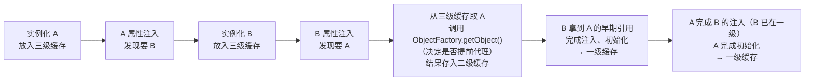

# Bean 生命周期与循环依赖

> **一句话记忆口诀**：实例化 → 属性注入 → Aware → BPP#before → 初始化 → BPP#after（AOP 代理）→ SmartInitializingSingleton → 使用 → 销毁（LIFO）；三级缓存提前暴露半成品，一级存完整 Bean，二级存早期引用，三级存工厂（支持 AOP 代理），构造器注入无法提前暴露所以不能解决循环依赖。

---

## 1. 引入：生命周期为何是高级开发必修

很多开发者停留在"8 步流程图"的死记层面，但面试与排障时真正被考察的是更深的一层：

- 为什么 `@PostConstruct` 里的 `@Autowired` 不会为 `null`，而构造器里会？
- `@EventListener` 注册到底发生在生命周期的哪一步？
- `@ConfigurationProperties` 的属性绑定发生在 `populateBean` 之前还是之后？
- Spring 6 升级后以前能跑的循环依赖为什么突然报错？
- 为什么 `@Async` 方法在同类内调用不生效？是"同一个问题的另一个表现"吗？

这些问题的共同答案是：**生命周期不是 8 步，而是 8 个"显式阶段" + 若干"隐式钩子"，它们共同定义了 Bean 从字节码到可用对象的全部状态转移**。

> 📖 容器启动的宏观视角（`refresh()` 12 步）见 [Spring 容器启动流程深度解析](03-Spring容器启动流程深度解析.md)；`BeanDefinition` 静态结构与依赖解析算法见 [IoC 与 DI](01-IoC与DI.md)。本文专注"**单个 Bean 从 `createBean()` 到 `destroy()` 之间发生了什么**"。

---

## 2. 类比：Bean 的一生就像员工入职到离职

```txt
招聘（实例化）→ 培训（属性注入）→ 报到（Aware 回调）→ 入职审查（BeanPostProcessor before）
→ 上岗（初始化）→ 转正（BeanPostProcessor after，AOP 代理在此创建）
→ 全员到齐公告（SmartInitializingSingleton）→ 工作（使用中）→ 离职（销毁）
```

---

## 3. 完整生命周期流程（显式 8 步 + 隐式钩子）

```mermaid
flowchart LR
    A["① 实例化<br>createBeanInstance<br>反射/@Bean/FactoryBean"] --> B["② 属性注入<br>populateBean<br>+ InstantiationAwareBPP"]
    B --> C["③ Aware 回调<br>invokeAwareMethods"]
    C --> D["④ BPP#before<br>@PostConstruct 实际在此触发"]
    D --> E["⑤ 初始化<br>InitializingBean → init-method"]
    E --> F["⑥ BPP#after<br>⚠️ AOP代理在此创建"]
    F --> G["⑦ SmartInitialzingSingleton<br>所有单例就绪后的全局钩子"]
    G --> H["⑧ 使用中 In Use"]
    H --> I["⑨ 销毁（LIFO）<br>@PreDestroy → destroy → destroy-method"]
```



> **阶段与源码方法的一一对应**（全部位于 `AbstractAutowireCapableBeanFactory`）：
>
> ```
> doCreateBean()
>   ├─ createBeanInstance()              ← 第 ① 步
>   ├─ applyMergedBeanDefinitionPostProcessors()  ← 合并元数据
>   ├─ populateBean()                    ← 第 ② 步（内含隐式钩子）
>   └─ initializeBean()
>        ├─ invokeAwareMethods()         ← 第 ③ 步
>        ├─ applyBeanPostProcessorsBeforeInitialization()  ← 第 ④ 步
>        ├─ invokeInitMethods()          ← 第 ⑤ 步
>        └─ applyBeanPostProcessorsAfterInitialization()   ← 第 ⑥ 步
> preInstantiateSingletons() 最后循环回调 SmartInitializingSingleton  ← 第 ⑦ 步
> ```

---

### ① 实例化 Instantiation

容器调用 `createBeanInstance()`，按 [IoC 与 DI §7](01-IoC与DI.md) 列出的**三条路径**之一创建原始对象：反射构造器 / `@Bean` 工厂方法 / `FactoryBean`。此时所有字段均为默认值（`null` / `0`），单例 Bean 的 `ObjectFactory` 在这一步完成后**立刻**放入三级缓存（为循环依赖做准备）。

!!! note "隐式钩子：`InstantiationAwareBeanPostProcessor#postProcessBeforeInstantiation`"
    在 `createBeanInstance()` **之前**，容器会先询问所有 `InstantiationAwareBeanPostProcessor`："你要不要直接返回一个对象替代正常的实例化？" 如果某个 BPP 返回非 `null`，生命周期**立即短路**——跳过后续所有步骤，直接进入第⑥步。AOP 的 `AnnotationAwareAspectJAutoProxyCreator` 就是靠这个钩子实现"为某些 Bean 提前创建代理"。

### ② 属性注入 Populate

`populateBean()` 扫描字段与 setter 上的 `@Autowired` / `@Value` / `@Resource`，通过 `DependencyDescriptor` 解析（算法见 [IoC 与 DI §6](01-IoC与DI.md)）。`@Value("${...}")` 占位符在容器启动阶段由 `PropertySourcesPlaceholderConfigurer`（一个 `BeanFactoryPostProcessor`）在 `BeanDefinition` 级别预解析，此步只是把最终值填入。

!!! note "隐式钩子：`InstantiationAwareBeanPostProcessor#postProcessProperties`"
    注入的**真正执行者**是 `AutowiredAnnotationBeanPostProcessor`（处理 `@Autowired`）和 `CommonAnnotationBeanPostProcessor`（处理 `@Resource`），它们都是 `InstantiationAwareBeanPostProcessor` 的实现，在这一步通过反射对字段 / setter 赋值。
    Spring Boot 的 `@ConfigurationProperties` 也在此阶段绑定属性（通过 `ConfigurationPropertiesBindingPostProcessor`）。

### ③ Aware 接口回调

`invokeAwareMethods()` 按固定顺序注入容器级对象：

| Aware 接口 | 注入内容 | 典型使用方 |
| :-- | :-- | :-- |
| `BeanNameAware` | Bean 在容器中的 id | 定时任务类获取自身名称 |
| `BeanClassLoaderAware` | 加载该 Bean 的 `ClassLoader` | SPI 加载 |
| `BeanFactoryAware` | 基础容器 `BeanFactory` | 框架组件 |
| `ApplicationContextAware` | 企业级容器（支持事件/国际化/资源） | 手写 `SpringContextHolder` 工具类 |

> 其余 `EnvironmentAware` / `ResourceLoaderAware` / `MessageSourceAware` 等在 `ApplicationContextAwareProcessor`（一个 `BeanPostProcessor`）的 `postProcessBeforeInitialization` 中触发——严格说它们属于第④步，只是概念上归为 Aware 家族。

### ④ BeanPostProcessor#before

`applyBeanPostProcessorsBeforeInitialization()` 遍历所有 `BeanPostProcessor`，依次调用 `postProcessBeforeInitialization()`。

!!! tip "`@PostConstruct` 的真实触发点在这里，不在第⑤步"
    很多资料说 "`@PostConstruct` 在初始化阶段执行"——不精确。实际上它由 **`CommonAnnotationBeanPostProcessor#postProcessBeforeInitialization`** 触发，在**第④步**而非第⑤步。只是因为第④和第⑤步紧挨着执行、都在属性注入之后，从业务视角合并表述为"初始化"。

### ⑤ 初始化 Initialization

`invokeInitMethods()` 按固定顺序执行业务初始化钩子：

1. `InitializingBean.afterPropertiesSet()`（实现接口方式）
2. `@Bean(initMethod = "xxx")` 或 XML `init-method`（声明式）

!!! note "为什么框架自身偏爱 `afterPropertiesSet`、业务偏爱 `@PostConstruct`"
    `InitializingBean` 是 Spring 专有接口，对业务代码是耦合；`@PostConstruct` 来自 JSR-250 标准（现位于 `jakarta.annotation`），与 Spring 解耦。所以 Spring 框架**内部组件**常用 `InitializingBean`（如 `SqlSessionFactoryBean`），**业务代码**推荐用 `@PostConstruct`。

### ⑥ BeanPostProcessor#after ⚠️ AOP 代理在此创建

`applyBeanPostProcessorsAfterInitialization()` 遍历所有 `BeanPostProcessor` 调用 `postProcessAfterInitialization()`。**`AbstractAutoProxyCreator`** 就是在这里检测 Bean 是否匹配切点（`@Transactional` / `@Aspect` / `@Async`），匹配则用 JDK 动态代理或 CGLIB 生成代理对象返回，替换掉原始 Bean 写入单例缓存。

!!! warning "为什么代理在第⑥步创建，而不是第④步"
    代理必须包装一个**行为完整**的对象——初始化逻辑（第⑤步）必须先跑完，代理才能正确拦截方法调用。如果在第④步就创建代理，`@PostConstruct` 就会在代理对象上执行，被不必要地套上事务/AOP 语义，行为不可控。
    **唯一例外**：循环依赖场景下，Spring 会在第②步（通过三级缓存的 `ObjectFactory`）**提前**创建代理，以保证所有持有 A 引用的 Bean 拿到的都是同一个代理对象。详见第 6 节。

### ⑦ SmartInitializingSingleton —— 所有单例就绪后的全局钩子

当容器在 `preInstantiateSingletons()` 循环中**把最后一个单例 Bean 创建完毕**后，会再遍历一次所有单例，调用实现了 `SmartInitializingSingleton#afterSingletonsInstantiated()` 的 Bean。

| 对比点 | `@PostConstruct` / `afterPropertiesSet` | `SmartInitializingSingleton` |
| :-- | :-- | :-- |
| 触发时机 | 自己初始化完时 | **容器所有单例都初始化完后** |
| 可见性 | 只能看到自己已注入的依赖 | 可以 `getBeansOfType` 看到全部 Bean |
| 典型使用者 | 业务 Bean 的初始化 | `EventListenerMethodProcessor`（注册 `@EventListener`）、`ScheduledAnnotationBeanPostProcessor`（启动定时任务） |

!!! tip "需要扫描所有 Bean 再做决定的场景"
    比如"遍历容器里所有 `XxxProcessor` 构建一个路由表"——这种逻辑放在 `@PostConstruct` 里会丢失后注册的 Bean；必须实现 `SmartInitializingSingleton`，等全员到齐再扫一遍。

### ⑧ 使用中 In Use

外部通过 `getBean()` 或 `@Autowired` 拿到的是第⑥步最终返回的对象（可能是代理）。

### ⑨ 销毁 Destruction（LIFO）

容器关闭（`close()` / `stop()`）时反向执行：

1. `@PreDestroy` 标注的方法（由 `CommonAnnotationBeanPostProcessor` 处理）
2. `DisposableBean.destroy()`
3. `@Bean(destroyMethod = "xxx")` 或 XML `destroy-method`

!!! warning "两条销毁规则"
    1. **prototype 作用域的 Bean 不会触发销毁**——容器不持有其引用，实例由 GC 负责回收。
    2. **`@DependsOn` 声明的依赖链在销毁时自动反序（LIFO）**：若 A `@DependsOn("B")`，创建顺序是 B → A，销毁顺序是 A → B，保证 A 在销毁时 B 还活着。

---

## 4. 生命周期全景对照表（高频面试）

| 阶段 | 源码方法 | 触发的扩展点 | 典型业务动作 |
| :-- | :-- | :-- | :-- |
| 实例化前 | `resolveBeforeInstantiation` | `InstantiationAwareBPP#before...Instantiation` | AOP 提前代理 |
| ① 实例化 | `createBeanInstance` | 三条路径 | 反射 new |
| 元数据合并 | `applyMergedBeanDefinitionPostProcessors` | `MergedBeanDefinitionPostProcessor` | 缓存 `@Autowired` 注入点 |
| ② 属性注入 | `populateBean` | `InstantiationAwareBPP#postProcessProperties` | `@Autowired` / `@Value` / `@ConfigurationProperties` 绑定 |
| ③ Aware | `invokeAwareMethods` | 6 大 Aware 接口 | 拿容器 / BeanName |
| ④ BPP#before | `applyBeanPostProcessorsBeforeInitialization` | `BeanPostProcessor#before...Initialization` | `@PostConstruct` |
| ⑤ 初始化 | `invokeInitMethods` | `InitializingBean` / `init-method` | 预热缓存、建立连接 |
| ⑥ BPP#after | `applyBeanPostProcessorsAfterInitialization` | `BeanPostProcessor#after...Initialization` | **AOP 代理生成** |
| ⑦ 全员到齐 | `preInstantiateSingletons` 末尾 | `SmartInitializingSingleton` | `@EventListener` 注册、`@Scheduled` 启动 |
| ⑧ 使用 | - | - | 业务调用 |
| ⑨ 销毁 | `DisposableBeanAdapter` | `@PreDestroy` / `DisposableBean` | 释放连接、落盘 |

---

## 5. 常见误区

### 误区 1：在构造器中使用 `@Autowired` 注入的字段

```java
// ❌ 构造器在第①步执行，@Autowired 在第②步才注入，此时字段是 null
@Component
public class CacheService {
    @Autowired
    private RedisTemplate<String, Object> redisTemplate;

    public CacheService() {
        redisTemplate.opsForValue().set("init", "true"); // NullPointerException
    }
}

// ✅ 方案一（首选）：构造器注入，依赖在实例化时就已传入
@Component
public class CacheService {
    private final RedisTemplate<String, Object> redisTemplate;

    public CacheService(RedisTemplate<String, Object> redisTemplate) {
        this.redisTemplate = redisTemplate;
        redisTemplate.opsForValue().set("init", "true"); // 安全
    }
}

// ✅ 方案二：初始化逻辑移到 @PostConstruct（第④步执行，字段已就绪）
@Component
public class CacheService {
    @Autowired
    private RedisTemplate<String, Object> redisTemplate;

    @PostConstruct
    public void init() {
        redisTemplate.opsForValue().set("init", "true");
    }
}
```

### 误区 2：以为 `@Scope("prototype")` 的 Bean 也会执行 `@PreDestroy`

Spring 不管理 prototype Bean 的销毁——若跟踪所有 prototype 实例会导致内存泄漏（持有全部引用）。因此 prototype Bean 的 `@PreDestroy` 永远不会被容器调用，必须业务代码自己管理。

### 误区 3：手动 `new` 的对象期望 `@Autowired` 生效

```java
MyService svc = new MyService();       // ❌ 绕过容器
svc.doSomething();                      // @Autowired 字段全是 null
```

只有**容器管理**的 Bean 才会走生命周期。如果确实需要对容器外对象做注入，用 `AutowireCapableBeanFactory.autowireBean(obj)`（见 [IoC 与 DI §3.1](01-IoC与DI.md)）。

### 误区 4：把 `@PostConstruct` 当作"全员到齐"的钩子

`@PostConstruct` 只能看到**自己**注入的依赖，看不到后创建的兄弟 Bean。需要"扫描全部同类型 Bean 再处理"的场景，必须改用 `SmartInitializingSingleton` 或 `ApplicationListener<ContextRefreshedEvent>`。

---

## 6. 循环依赖与三级缓存

### 6.1 循环依赖是什么

```java
@Component class A { @Autowired B b; }
@Component class B { @Autowired A a; }   // A ↔ B
```

本质：**对象图中存在环，对象构造期无法按"拓扑序"完成**。

!!! warning "Spring 6 / Boot 3 默认禁用循环依赖"
    **Spring Framework 6.0+ 将 `spring.main.allow-circular-references` 默认值改为 `false`**——字段/Setter 注入的循环依赖启动时直接抛 `BeanCurrentlyInCreationException`。Boot 2 升级 Boot 3 时的典型症状。
    **治本**：重构设计（见 6.5）；**治标**：
    ```yaml
    spring:
      main:
        allow-circular-references: true
    ```
    但不建议长期依赖这个开关。它传达的信号是"你的依赖图出了问题"。

### 6.2 三级缓存的源码定位

全部位于 `DefaultSingletonBeanRegistry`：

```java
// 一级缓存：完整 Bean
private final Map<String, Object> singletonObjects
    = new ConcurrentHashMap<>(256);

// 二级缓存：早期引用（已完成代理判断，但属性/初始化未完成）
private final Map<String, Object> earlySingletonObjects
    = new ConcurrentHashMap<>(16);

// 三级缓存：ObjectFactory（延迟生成早期引用 / 决定是否提前代理）
private final Map<String, ObjectFactory<?>> singletonFactories
    = new HashMap<>(16);
```

| 缓存 | 存什么 | 何时放入 | 何时移出 |
| :-- | :-- | :-- | :-- |
| 三级 `singletonFactories` | `ObjectFactory`（封装"要不要代理"的逻辑） | 实例化完成后（第①之后、第②之前） | 被取用后立刻移除，结果迁入二级 |
| 二级 `earlySingletonObjects` | 早期 Bean 引用（可能是代理） | 三级工厂首次被调用时 | Bean 完整创建后移入一级 |
| 一级 `singletonObjects` | 完成全生命周期的 Bean | 第⑥步结束后 | 容器关闭时清空 |

**查找顺序**：一级 → 二级 → 三级（通过工厂生成后放入二级）。

### 6.3 三级缓存解决循环依赖的完整流程



**完整事件序列**：

```txt
① new A()                      → 放入【三级缓存】（此时 A 字段全 null）
② A 开始 populateBean，发现要 B
    ① new B()                   → 放入【三级缓存】
    ② B 开始 populateBean，发现要 A
        查一级缓存 → 无
        查二级缓存 → 无
        查三级缓存 → 有！调用 ObjectFactory.getObject()
            → AbstractAutoProxyCreator.getEarlyBeanReference()
            → 判断 A 是否匹配切点
                → 匹配：立即生成 A 的 AOP 代理
                → 不匹配：返回原始 A
            → 结果放入【二级缓存】，从三级缓存删除 A 的条目
    ② B 拿到 A 的早期引用，完成注入
    ⑤ B 初始化 → ⑥ BPP#after → 【一级缓存】
② A 拿到 B（B 已是完整对象）
⑤ A 初始化 → ⑥ BPP#after
    此时检查：二级缓存里有 A 的早期引用吗？
        有 → 说明 A 已被循环依赖触发过代理 → 复用二级缓存对象
        无 → 按正常流程创建代理（普通场景）
⑦ A 完成 → 【一级缓存】，从二级缓存移除
```

!!! note "为什么要三级缓存而不是二级"
    常见错误说法："二级缓存会 AOP 失效"。**严谨解释**：
    - 如果在第①步之后**立刻**判断是否需要代理并把结果存入二级缓存，AOP **不会失效**。
    - 但这意味着**每个** Bean 实例化后都要遍历所有切点做匹配——这是昂贵的，而 **99% 的 Bean 不会发生循环依赖**，这部分开销是浪费的。
    - 三级缓存的 `ObjectFactory` 把"代理判断"**延迟到真正有第三方来取时才执行**。没有循环依赖时，工厂永远不会被调用，省去全部开销；有循环依赖时才按需触发，并把结果缓存在二级缓存避免重复生成。

    **一句话**：三级缓存 = 二级缓存 + 懒加载优化。

### 6.4 为什么构造器注入无法解决循环依赖

```java
@Component class A {
    private final B b;
    public A(B b) { this.b = b; }  // 构造时就需要 B，此时 A 还没放入任何缓存
}
```

三级缓存的前提是"Bean 先被 `new` 出来放入缓存，再注入依赖"。但构造器注入在 `new` 这一步就需要依赖——A 还没机会进缓存，B 来查 A 时三级缓存里什么都没有 → 死锁，抛 `BeanCurrentlyInCreationException`。

### 6.5 解决方案

| 方案 | 适用场景 | 原理 |
| :-- | :-- | :-- |
| **重构：提取公共依赖** | 首选 | A ↔ B 改成 A → C ← B，环被打破 |
| **重构：事件解耦** | 发布-订阅类场景 | 用 `ApplicationEventPublisher` 替代直接引用，见 [扩展点详解 §6](04-Spring扩展点详解.md) |
| **`@Lazy`** | 构造器注入被迫循环时 | 注入代理对象，首次调用时才解析目标 |
| **字段注入 + `allow-circular-references=true`** | 历史遗留代码临时救场 | 依赖三级缓存，不推荐长期使用 |

```java
// @Lazy 打破构造器注入的循环
@Component
public class A {
    private final B b;
    public A(@Lazy B b) { this.b = b; }   // 注入 B 的代理，首次调用才真正初始化 B
}
```

!!! tip "决策树"

    ```txt
    出现循环依赖
        ↓
    先问：两个类为什么互相需要对方？
        ↓
    能重构 → 优先提取公共类 / 事件解耦
        ↓ 不能（历史遗留、第三方代码）
    构造器注入 → @Lazy 打破
    字段 / Setter 注入 → 依赖三级缓存（Spring 6 需显式开启）
    ```

---

## 7. 与其他代理机制的边界：同类自调用失效

`@Async` / `@Scheduled` / `@Transactional` / `@Cacheable` 在同类内部调用时**全部失效**，它们本质是"生命周期第⑥步代理副作用"的同一问题。

```java
@Service
public class OrderService {
    public void createOrder() {
        this.sendMail();       // ❌ this 是原始对象，不走代理，@Async 失效
    }

    @Async                     // 依赖 BPP#after 生成的代理来拦截
    public void sendMail() { ... }
}
```

> 📖 完整排查清单与解决方案（注入自身代理、`AopContext.currentProxy()` 等）见 [AOP 面向切面编程 §4](05-AOP面向切面编程.md)。本文只强调：**这是"代理模式的本质限制"，而非生命周期 bug**。

---

## 8. 高频面试题（源码级标准答案）

**Q1：Spring Bean 完整生命周期？**

> 源码入口 `doCreateBean()`：① `createBeanInstance`（反射实例化）→ ② `populateBean`（属性注入，内含 `InstantiationAwareBPP`）→ ③ `invokeAwareMethods` → ④ `applyBeanPostProcessorsBeforeInitialization`（`@PostConstruct` 实际触发点）→ ⑤ `invokeInitMethods`（`InitializingBean` / `init-method`）→ ⑥ `applyBeanPostProcessorsAfterInitialization`（AOP 代理生成）；所有单例到齐后，容器再调用 ⑦ `SmartInitializingSingleton` → ⑧ 使用 → ⑨ 销毁（`@PreDestroy` / `DisposableBean` / `destroy-method`，LIFO）。

**Q2：`@PostConstruct` 和 `afterPropertiesSet` 到底谁先执行？**

> `@PostConstruct` 在**第④步**由 `CommonAnnotationBeanPostProcessor#postProcessBeforeInitialization` 触发；`afterPropertiesSet` 在**第⑤步** `invokeInitMethods` 中触发。所以执行顺序是 `@PostConstruct` → `afterPropertiesSet` → `init-method`。虽然很多资料把它们都归在"初始化"，但严格按源码它们处于两个不同阶段。

**Q3：Spring 如何解决循环依赖？**

> 通过三级缓存解决**字段/Setter 注入**的单例循环依赖。本质是"先把半成品放入缓存再注入依赖"：`new A` 后立刻把 A 的 `ObjectFactory` 放入三级缓存 → 注入 B 时发现要 A → 从三级缓存触发 `ObjectFactory` 生成 A 的早期引用（必要时提前创建 AOP 代理）并转入二级缓存 → B 拿到 A 的引用完成创建 → A 再完成自身的属性注入和初始化。**构造器注入无法解决**，因为实例化阶段就要依赖，A 还来不及放入缓存。**Spring 6 默认禁用该机制**，需显式 `allow-circular-references=true`。

**Q4：为什么需要三级缓存，二级不够吗？**

> 技术上二级缓存能解决循环依赖，三级缓存的意义是**延迟代理判断、避免性能浪费**。判断 Bean 是否需要 AOP 代理需要遍历全部切点做匹配，成本不低；99% 的 Bean 不会发生循环依赖，如果每个 Bean 实例化后都立刻做这个判断是浪费。三级缓存的 `ObjectFactory` 把这次判断**延迟到真正有人来查时才执行**——没有循环依赖时根本不触发，节省了启动期大量开销；有循环依赖时才按需生成并缓存到二级避免重复。

**Q5：构造器注入为什么不能解决循环依赖？**

> 构造器注入在 `createBeanInstance()` 这一步就要传入依赖，此时 Bean 还没有机会被放进任何缓存——三级缓存需要"先 `new` 再暴露"的前提被破坏。字段注入可以"先 `new` 一个空对象放入缓存，再通过反射注入依赖"，所以能走三级缓存。

**Q6：`@EventListener` 是什么时候注册到事件广播器的？**

> 不是在第④步或第⑤步，而是在**第⑦步** `SmartInitializingSingleton#afterSingletonsInstantiated` 中，由 `EventListenerMethodProcessor` 扫描全部单例 Bean 上的 `@EventListener` 方法注册。这也是为什么 `@EventListener` 不能监听"容器刷新完成前"发出的事件——它自己还没注册。

**Q7：Spring 6 升级后循环依赖启动报错怎么处理？**

> 先考虑**重构**：① 提取公共依赖成第三个类；② 把主动调用改为发布 `ApplicationEvent` 解耦。如果必须先跑起来，临时开启 `spring.main.allow-circular-references=true`，但要在日志里打红标警示团队"这是技术债"。

---

## 9. 一句话口诀

> **显式 8 步 + 隐式钩子**：`createBeanInstance` → `populateBean`（含 `InstantiationAwareBPP`）→ `invokeAwareMethods` → `BPP#before`（`@PostConstruct`）→ `invokeInitMethods`（`InitializingBean`）→ `BPP#after`（**AOP 代理**）→ `SmartInitializingSingleton`（`@EventListener` 注册）→ 使用 → `destroy`（LIFO）。**三级缓存**：一级存完整 Bean、二级存早期引用、三级存工厂；工厂的存在只为"**延迟代理判断**"。**Spring 6 默认禁用循环依赖**；**构造器注入**在实例化阶段就要依赖，所以永远无法被三级缓存救。
