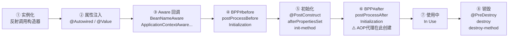
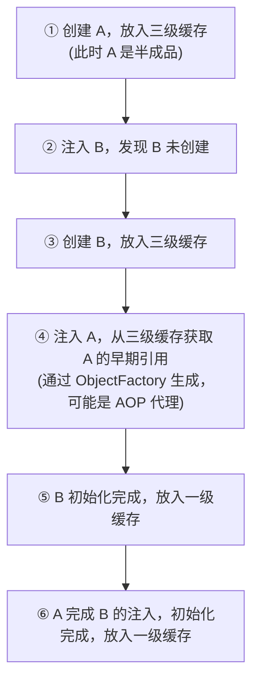

# Bean 生命周期与循环依赖

---

## 1. 类比：Bean 的一生就像员工入职到离职

```
招聘（实例化）→ 培训（属性注入）→ 报到（Aware 回调）→ 入职审查（BeanPostProcessor before）
→ 上岗（初始化）→ 转正（BeanPostProcessor after，AOP 代理在此创建）→ 工作（使用中）→ 离职（销毁）
```

---

## 2. 完整生命周期流程



---

**① 实例化 Instantiation**
容器读取 BeanDefinition，通过反射调用无参构造器（或指定构造器）创建原始对象；此时所有字段均为默认值（null/0）；若使用构造器注入，依赖在此步传入。

**② 属性注入 Populate**
容器扫描字段和 setter 上的 `@Autowired` / `@Value` / `@Resource`，从容器中查找匹配 Bean 并赋值；`@Value` 占位符由 `BeanFactoryPostProcessor` 在容器启动阶段提前解析，此步直接取值填入。

**③ Aware 接口回调**
若 Bean 实现了 Aware 子接口，容器依次回调：
- `BeanNameAware.setBeanName()` → 注入 Bean 在容器中的 id
- `BeanClassLoaderAware` → 注入加载该 Bean 的 ClassLoader
- `BeanFactoryAware` → 注入所属 BeanFactory
- `ApplicationContextAware` → 注入完整 ApplicationContext

普通业务 Bean 无需实现，主要供框架内部组件或工具类使用。

**④ BeanPostProcessor#before**
遍历所有已注册的 `BeanPostProcessor`，依次调用 `postProcessBeforeInitialization()`；返回值即为后续流程使用的对象（可替换或包装原始 Bean）；`@PostConstruct` 由 `CommonAnnotationBeanPostProcessor` 在此步触发执行。

> **为什么要有第④步？**
> 初始化钩子（第⑤步）是 Bean 自己的逻辑，而第④步是给**外部**在初始化之前插手的机会。Spring 内部用它来处理 `@PostConstruct`、`@Autowired` 校验等；开发者一般不直接实现 `BeanPostProcessor`，但可以通过它做统一的 Bean 增强，例如：对所有 Bean 打印初始化日志、校验某个注解是否配置正确等。

**⑤ 初始化 Initialization**
按固定顺序执行三种初始化钩子：
1. `@PostConstruct` 标注的方法（已在第④步由 BPP 触发）
2. `InitializingBean.afterPropertiesSet()`
3. XML / `@Bean(initMethod)` 指定的 init-method

三者语义相同，均在属性注入完成后执行业务初始化逻辑（建立连接、预热缓存等）。

> **为什么要有第⑤步？**
> 构造器执行时依赖还未注入（字段注入场景），所以无法在构造器里做初始化。第⑤步是 Spring 专门留给开发者的"**依赖就绪后的初始化入口**"。
>
> - **Spring 自身**：用 `afterPropertiesSet()` 做框架组件的内部校验和准备，例如 `SqlSessionFactoryBean` 在此构建 `SqlSessionFactory`。
> - **开发者**：最常用 `@PostConstruct`，典型场景：预热本地缓存、建立长连接、加载配置数据到内存、启动后台线程等。

**⑥ BeanPostProcessor#after ⚠️ AOP 代理在此创建**
遍历所有 `BeanPostProcessor`，调用 `postProcessAfterInitialization()`；`AbstractAutoProxyCreator` 在此检测 Bean 是否匹配切点，若匹配则用 JDK 动态代理或 CGLIB 生成代理对象，以代理替换原始 Bean 注册到容器单例缓存中。

> **为什么要有第⑥步，而不是在第④步直接创建代理？**
> 代理必须包装一个**行为完整**的对象——第⑤步的初始化逻辑必须先跑完，代理才能正确拦截方法调用。如果在第④步就创建代理，初始化钩子就会在代理对象上执行，行为不可控。因此 Spring 把"增强后处理"放在初始化完成之后。
>
> - **Spring 自身**：AOP 代理（`@Transactional`、`@Async`、自定义切面）全部在此创建；`@Async` 的线程池绑定也在此完成。
> - **开发者**：极少直接实现此接口；但如果需要对 Bean 做全局包装（如统一加监控埋点、动态替换实现类），可以在此返回一个新的包装对象。

**⑦ 使用中 In Use**
Bean 以单例形式存活于容器；外部通过 `getBean()` 或 `@Autowired` 拿到的是第⑥步最终返回的对象（可能是代理）。

**⑧ 销毁 Destruction**
容器关闭（`close()` / `stop()`）时触发，执行顺序：
1. `@PreDestroy` 标注的方法
2. `DisposableBean.destroy()`
3. XML / `@Bean(destroyMethod)` 指定的 destroy-method

⚠️ `prototype` 作用域的 Bean 不会触发此阶段——容器不持有其引用，实例由 GC 负责回收。

> **为什么 AOP 代理在第⑥步创建**：
> - **正常情况**：Spring 默认在第⑥步（`postProcessAfterInitialization`）创建代理，此时 Bean 已完成属性注入和初始化，是最终状态，代理包装的是一个行为完整的对象。
> - **循环依赖情况**：若 A 依赖 B、B 又依赖 A，且 A 需要被代理，Spring 会提前在第②步就为 A 创建代理并放入三级缓存，让 B 能拿到 A 的代理引用。这样做的目的是**保证一致性**：无论谁持有 A 的引用，拿到的都是同一个代理对象，而不是有的地方拿到代理、有的地方拿到原始对象（否则 B 会绕过 AOP 直接调用原始 A）。

---

## 3. 关键扩展点说明

| 扩展点 | 作用 | 典型应用 | 执行时机 |
|--------|------|---------|---------|
| `BeanPostProcessor` | 在初始化前后对 Bean 进行增强 | AOP 代理就是在 `postProcessAfterInitialization` 中创建的 | 每个 Bean 初始化前后 |
| `BeanFactoryPostProcessor` | 在 Bean 实例化**之前**修改 BeanDefinition | `PropertySourcesPlaceholderConfigurer` 解析 `@Value("${...}")` 占位符 | 容器启动，Bean 实例化前 |
| `@PostConstruct` | Bean 初始化完成后执行 | 初始化缓存、建立连接 | 属性注入完成后 |
| `@PreDestroy` | Bean 销毁前执行 | 释放资源、关闭连接 | 容器关闭时 |

> 📖 各扩展点的详细用法和代码示例，参见 [Spring 扩展点详解](04-Spring扩展点详解.md)。

---

## 4. 常见误区
### 误区1：在构造器中使用 @Autowired 注入的字段

```java
// ❌ 误区：在构造器中使用 @Autowired 注入的字段（此时还未注入）
@Component
public class MyService {
    @Autowired
    private OtherService other;

    public MyService() {
        other.doSomething(); // NullPointerException！
        // 原因：生命周期第①步（实例化）在第②步（属性注入）之前
        // 构造器执行时，@Autowired 字段还是 null
    }
}

// ✅ 最佳方案：构造器注入（Spring 官方推荐，依赖在对象创建时就已就绪）
@Component
public class MyService {
    private final OtherService other;

    public MyService(OtherService other) {
        this.other = other;
        other.doSomething(); // 构造器注入时依赖已传入，安全
    }
}

// ✅ 次选：使用 @PostConstruct（在第⑤步执行，此时属性已注入）
@Component
public class MyService {
    @Autowired
    private OtherService other;

    @PostConstruct
    public void init() {
        other.doSomething(); // 此时依赖已注入完毕
    }
}
```

### 误区2：以为 @Scope("prototype") 的 Bean 也会执行 @PreDestroy

```java
// ❌ 误区：以为 @Scope("prototype") 的 Bean 也会执行 @PreDestroy
// 原因：Spring 不管理 prototype Bean 的销毁，容器不会调用其 @PreDestroy
// 设计原因：prototype 每次都创建新对象，Spring 无法追踪所有实例，
//           如果追踪会导致内存泄漏（持有所有 prototype 实例的引用）
@Component
@Scope("prototype")
public class PrototypeBean {
    @PreDestroy
    public void destroy() {
        // ❌ 这个方法不会被 Spring 调用！
    }
}
```

---

## 5. 工作中常见问题

### 问题一：`@Autowired` 注入为 null

**现象**：调用某个 Service 的方法时，里面的依赖字段是 null，抛出 `NullPointerException`。

**根本原因**：该对象不是由 Spring 容器创建的，而是通过 `new` 手动创建的。Spring 只对自己管理的 Bean 进行依赖注入，手动 `new` 出来的对象完全绕过了容器，`@Autowired` 注解不会生效。

```java
// ❌ 错误：手动 new，Spring 不会注入任何依赖
MyService service = new MyService();
service.doSomething(); // service 内部的 @Autowired 字段全是 null

// ✅ 正确：从 Spring 容器中获取，或者通过 @Autowired 注入
@Autowired
private MyService service; // Spring 管理，依赖正常注入
```

---

### 问题二：`@PostConstruct` 方法中出现 NPE

**现象**：应用启动时，`@PostConstruct` 标注的初始化方法抛出 `NullPointerException`。

**根本原因**：这个问题的本质是**在错误的生命周期阶段使用了依赖**。最典型的场景是：在**构造器**中使用了 `@Autowired` 字段注入的依赖——构造器执行时处于生命周期第①步（实例化），而 `@Autowired` 字段注入发生在第②步（属性注入），此时字段还是 null，所以报 NPE。

> 注意：问题不是出在 `@PostConstruct` 方法本身，而是出在**构造器里提前使用了还未注入的字段**。`@PostConstruct` 恰恰是解决这个问题的正确方案——它在第⑤步执行，此时属性注入已经完成。

```java
// ❌ 错误：在构造器中使用 @Autowired 字段，此时字段还未注入
@Component
public class CacheService {
    @Autowired
    private RedisTemplate<String, Object> redisTemplate;

    public CacheService() {
        // 构造器在第①步执行，@Autowired 注入在第②步
        // 此时 redisTemplate 还是 null，必然 NPE
        redisTemplate.opsForValue().set("init", "true");
    }
}

// ✅ 正确方案一：将初始化逻辑移到 @PostConstruct 方法中
// @PostConstruct 在第⑤步执行，此时 @Autowired 字段已经注入完毕
@Component
public class CacheService {
    @Autowired
    private RedisTemplate<String, Object> redisTemplate;

    @PostConstruct
    public void init() {
        // 此时 redisTemplate 已经注入，可以安全使用
        redisTemplate.opsForValue().set("init", "true");
    }
}

// ✅ 正确方案二（更推荐）：改用构造器注入，依赖在构造器执行时就已传入
@Component
public class CacheService {
    private final RedisTemplate<String, Object> redisTemplate;

    public CacheService(RedisTemplate<String, Object> redisTemplate) {
        this.redisTemplate = redisTemplate; // 构造器注入，依赖已就绪
        redisTemplate.opsForValue().set("init", "true"); // 安全
    }
}
```

---

### 问题三：Bean 重复定义冲突

**现象**：启动时报错 `ConflictingBeanDefinitionException`，或者注入时报错 `NoUniqueBeanDefinitionException: expected single matching bean but found 2`。

**根本原因**：容器中存在多个**同类型**或**同名**的 Bean，Spring 不知道该注入哪一个。

**解决方案一：`@Primary` —— 标记首选 Bean**

当存在多个同类型 Bean 时，在**希望默认被注入**的那个 Bean 上加 `@Primary`。注入时如果没有特别指定，Spring 会优先选择带 `@Primary` 的那个。

```java
public interface MessageSender {
    void send(String msg);
}

@Component
@Primary // 标记为首选，不指定时默认注入这个
public class EmailSender implements MessageSender { ... }

@Component
public class SmsSender implements MessageSender { ... }

// 注入时不指定，自动选择 @Primary 的 EmailSender
@Autowired
private MessageSender messageSender; // 注入的是 EmailSender
```

**解决方案二：`@Qualifier` —— 精确指定注入哪个 Bean**

当需要注入**特定的某个** Bean 时，在注入点用 `@Qualifier("beanName")` 明确指定 Bean 的名称（默认 Bean 名称是类名首字母小写）。

```java
@Component
public class NotificationService {

    // 明确指定注入 emailSender 这个 Bean
    @Autowired
    @Qualifier("emailSender")
    private MessageSender emailSender;

    // 明确指定注入 smsSender 这个 Bean
    @Autowired
    @Qualifier("smsSender")
    private MessageSender smsSender;

    public void notifyAll(String msg) {
        emailSender.send(msg);
        smsSender.send(msg);
    }
}
```

**两者的区别**：
- `@Primary` 是在 **Bean 定义侧**声明"我是默认的"，适合有一个明显主选项的场景。
- `@Qualifier` 是在 **注入侧**声明"我要那个特定的"，适合需要同时使用多个同类型 Bean 的场景。
- 两者可以同时存在：`@Qualifier` 的优先级高于 `@Primary`，指定了 `@Qualifier` 就会忽略 `@Primary`。

---

## 6. 循环依赖与三级缓存

### 6.1 什么是循环依赖？

A 需要 B 才能创建，B 需要 A 才能创建，互相等待，形成死锁。

```java
@Component
public class A {
    @Autowired
    private B b; // A 依赖 B
}

@Component
public class B {
    @Autowired
    private A a; // B 依赖 A → 循环！
}
```

#### 为什么会出现循环依赖？

循环依赖的根本原因是**职责划分不清晰**，几个典型场景：

**场景一：Service 层互相调用**（最常见）

```java
// OrderService 处理订单，需要扣减库存
@Service
public class OrderService {
    @Autowired
    private InventoryService inventoryService; // 依赖库存服务
}

// InventoryService 处理库存，需要记录订单日志
@Service
public class InventoryService {
    @Autowired
    private OrderService orderService; // 又依赖回订单服务 → 循环
}
```

根本原因：两个 Service 承担了对方的部分职责，边界模糊。

**场景二：公共服务被多方依赖，自己又依赖其中一方**

```java
@Service
public class UserService {
    @Autowired
    private MessageService messageService; // 发消息
}

@Service
public class MessageService {
    @Autowired
    private UserService userService; // 查用户信息 → 循环
}
```

**场景三：事件发布者与监听者互相依赖**

```java
@Service
public class PayService {
    @Autowired
    private NotifyService notifyService; // 支付完成后通知
}

@Service
public class NotifyService {
    @Autowired
    private PayService payService; // 通知时需要查支付状态 → 循环
}
```

---

#### 我们真正需要解决的是什么？

**循环依赖是设计问题，不是技术问题。**

Spring 的三级缓存只是一个"兜底机制"，能让程序跑起来，但它解决不了根本问题——**两个类之间职责边界不清晰**。如果只是依赖 Spring 的机制让循环依赖"消失"，代码会越来越难维护。

真正需要解决的是：**为什么这两个类会互相需要对方？**

#### 优先考虑：重构解耦

遇到循环依赖时，应该**优先考虑重构**，而不是想办法让 Spring 绕过去。常见的重构思路：

**思路一：提取公共依赖（最常用）**

把两个类都需要的逻辑抽取到第三个类中，打破循环：

```
重构前：A ↔ B（互相依赖）

重构后：A → C ← B（A 和 B 都依赖 C，C 不依赖任何人）
```

```java
// 把 OrderService 和 InventoryService 都需要的"库存扣减+订单记录"逻辑
// 抽取到 StockDeductionService 中
@Service
public class StockDeductionService {
    // 只做库存扣减和记录，不依赖 OrderService 或 InventoryService
}

@Service
public class OrderService {
    @Autowired
    private StockDeductionService stockDeductionService; // 不再依赖 InventoryService
}

@Service
public class InventoryService {
    @Autowired
    private StockDeductionService stockDeductionService; // 不再依赖 OrderService
}
```

**思路二：用事件解耦（适合通知类场景）**

把"主动调用"改为"发布事件"，发布者不需要知道谁来处理：

```java
@Service
public class PayService {
    @Autowired
    private ApplicationEventPublisher eventPublisher;

    public void pay() {
        // 支付完成，发布事件，不再直接依赖 NotifyService
        eventPublisher.publishEvent(new PaySuccessEvent(this, orderId));
    }
}

@Service
public class NotifyService {
    // 监听事件，不再被 PayService 依赖
    @EventListener
    public void onPaySuccess(PaySuccessEvent event) {
        // 处理通知逻辑
    }
}
```

**选择策略总结：**

```
遇到循环依赖
    ↓
先问：为什么这两个类互相需要对方？
    ↓
能重构 → 优先重构（提取公共类 or 事件解耦）
    ↓
不能重构（历史遗留、第三方代码）
    ↓
字段注入 → Spring 三级缓存自动解决
构造器注入 → 加 @Lazy 打破循环
```

> **原则**：`@Lazy` 和三级缓存是最后的手段，不是第一选择。循环依赖出现时，首先应该审视设计是否合理。

---

### 6.2 三级缓存解决原理

Spring 的解决方案是：**先给 A 一个"半成品"的引用**，让 B 先用着，等 A 完成初始化后，B 持有的引用自动指向完整的 A。

```
三级缓存结构：
┌──────────────────────────────────┬──────────────────────────────┐
│ 一级缓存 singletonObjects         │ 完整的 Bean（已初始化）        │
│ 二级缓存 earlySingletonObjects    │ 早期 Bean（已实例化，未初始化）│
│ 三级缓存 singletonFactories       │ Bean 工厂（可生成早期引用）    │
└──────────────────────────────────┴──────────────────────────────┘
```



> **为什么需要三级缓存而不是两级**：如果 A 有 AOP 代理，B 需要持有的是 A 的**代理对象**而非原始对象。三级缓存存的是 `ObjectFactory`（工厂），可以在需要时生成代理对象；如果只有二级缓存，存的是原始对象，B 持有的就是未被代理的 A，AOP 失效。

### 6.3 三级缓存详细说明

#### "早期暴露的 Bean"是什么意思？

"早期"的意思是：**Bean 还没有完成完整的生命周期（属性注入、初始化都还没做完），但已经被其他 Bean 拿去用了。**

正常情况下，一个 Bean 要走完全部 8 个步骤才算"完整"，才会放进一级缓存供外部使用。但循环依赖时，A 还在创建过程中，B 就急着要用 A——这时候 Spring 只能把"还没做完的 A"提前暴露出去，这就叫**早期暴露**。

#### 什么时候判断需要 AOP 代理？

判断发生在**三级缓存的 `ObjectFactory.getObject()` 被调用时**，具体是在 `AbstractAutoProxyCreator#getEarlyBeanReference()` 方法里：

- 检查 A 是否匹配任何切点（`@Transactional`、自定义 `@Aspect` 等）
- **是** → 提前创建 A 的 AOP 代理，返回代理对象
- **否** → 直接返回原始对象

> 注意：这个判断**只在循环依赖场景下才会提前触发**。正常情况下，代理是在第⑥步（`postProcessAfterInitialization`）才创建的。

#### 各级缓存的放入与移出时机

| 缓存 | 名称 | 存储内容 | 何时放入 | 何时移出 |
|------|------|---------|---------|---------|
| 三级缓存 | `singletonFactories` | `ObjectFactory`（Bean 工厂） | Bean **刚实例化完**（第①步之后，第②步之前） | 有人来取早期引用时（结果移入二级缓存，三级删除） |
| 二级缓存 | `earlySingletonObjects` | 早期暴露的 Bean（可能是代理） | 三级缓存的工厂**第一次被调用**时（存结果防重复） | Bean 完整初始化完成，放入一级缓存时 |
| 一级缓存 | `singletonObjects` | 完整的单例 Bean | Bean **走完完整生命周期**后 | 容器关闭销毁时 |

**查找顺序**：一级缓存 → 二级缓存 → 三级缓存（通过工厂生成后放入二级缓存）

#### 为什么需要二级缓存？（防止重复生成）

三级缓存里存的是 `ObjectFactory`，每次调用它的 `getObject()` 都会**重新执行一次生成逻辑**（包括判断是否需要 AOP 代理、生成代理对象等）。

如果没有二级缓存，每次有人来要 A 的早期引用，都要调用一次工厂，就会生成多个不同的对象——这会导致 B 和 C 拿到的 A 的代理对象不是同一个实例，破坏单例语义。

所以：**第一次从三级缓存生成早期引用后，立刻把结果存入二级缓存，三级缓存中删掉对应条目**。后续再有人来要，直接从二级缓存拿，不再重复生成。

```
第一次要 A 的早期引用：
  三级缓存 → 调用 ObjectFactory.getObject() → 生成早期引用（可能是代理）
  → 存入二级缓存，从三级缓存删除

第二次要 A 的早期引用：
  直接从二级缓存拿，不再调用工厂，保证拿到的是同一个对象
```

#### 完整的 A、B 循环依赖流程

```
① 实例化 A（new 出来，字段全是 null）
② 立刻把 A 的 ObjectFactory 放入【三级缓存】
③ 开始属性注入，发现需要 B，去创建 B...

  ① 实例化 B
  ② 把 B 的 ObjectFactory 放入【三级缓存】
  ③ 属性注入，发现需要 A
  ④ 去三级缓存找 A → 调用 ObjectFactory.getObject()
     → 判断 A 是否需要 AOP 代理 → 生成早期引用（原始对象 or 代理）
     → 把结果放入【二级缓存】，从三级缓存删除 A 的条目
  ⑤ B 拿到 A 的早期引用，完成注入
  ⑥ B 走完完整生命周期 → 放入【一级缓存】，从三级缓存删除 B 的条目

回到 A：
④ A 完成 B 的注入（B 已在一级缓存）
⑤ A 走完完整生命周期（初始化等）
⑥ 正常情况下第⑥步会创建代理，但发现二级缓存里已经有 A 的代理了
   → 直接用二级缓存里的对象，不重复创建
⑦ 把最终对象放入【一级缓存】，从二级缓存删除 A 的条目
```

> **正常没有循环依赖时**：二级缓存永远是空的；三级缓存里的工厂也不会被调用，Bean 直接从三级缓存"毕业"到一级缓存。

### 6.4 为什么构造器注入无法解决循环依赖？

```java
// 构造器注入时，创建 A 必须先有 B，创建 B 必须先有 A
// 此时 A 还没有放入任何缓存，无法提前暴露引用 → 死锁
@Component
public class A {
    private final B b;
    public A(B b) { this.b = b; } // 构造时就需要 B，但 A 还没放入缓存
}
```

> **根本原因**：三级缓存的核心是"提前暴露未完成的 Bean 引用"，而构造器注入在实例化阶段就需要依赖，此时 Bean 还未放入任何缓存，无法提前暴露，所以无法解决。字段注入可以先创建空对象（放入缓存），再注入依赖，所以能解决。

### 6.5 循环依赖的解决方案

| 方案 | 适用场景 | 说明 |
|------|---------|------|
| 字段注入（默认支持） | 大多数循环依赖 | Spring 三级缓存自动解决 |
| `@Lazy` 延迟注入 | 构造器注入的循环依赖 | 注入代理对象，首次使用时才真正初始化 |
| 重构解耦 | 根本解决方案 | 循环依赖往往意味着设计问题，应该重构 |

```java
// @Lazy 解决构造器注入的循环依赖
@Component
public class A {
    private final B b;
    public A(@Lazy B b) { this.b = b; } // 注入 B 的代理，首次调用时才真正初始化 B
}
```

---

## 7. 常见问题

**Q：Spring Bean 的生命周期是什么？**
> ① 实例化（反射调用构造器）→ ② 属性注入（@Autowired）→ ③ Aware 回调 → ④ BeanPostProcessor before → ⑤ 初始化（@PostConstruct / afterPropertiesSet / init-method）→ ⑥ BeanPostProcessor after（**AOP 代理在此创建**）→ ⑦ 使用中 → ⑧ 销毁（@PreDestroy / destroy-method）

**Q：@PostConstruct 和 init-method 的区别？**
> 三者都在属性注入完成后执行，执行顺序：`@PostConstruct` → `InitializingBean.afterPropertiesSet` → `init-method`。`@PostConstruct` 是 JSR-250 标准注解，`init-method` 是 Spring XML 配置方式，推荐使用 `@PostConstruct`。

**Q：Spring 如何解决循环依赖？**
> Spring 通过三级缓存解决字段注入的循环依赖：① 创建 A 时先将 A 的 `ObjectFactory` 放入三级缓存；② 注入 B 时发现 B 未创建，开始创建 B；③ B 需要注入 A，从三级缓存获取 A 的早期引用（可能是代理）；④ B 初始化完成；⑤ A 完成 B 的注入，初始化完成。

**Q：为什么需要三级缓存，二级缓存不够吗？**
> 如果 A 有 AOP 代理，B 需要持有 A 的代理对象。三级缓存存的是 `ObjectFactory`，可以在需要时生成代理；如果只有二级缓存，存的是原始对象，B 持有的是未被代理的 A，导致 AOP 失效。

**Q：构造器注入为什么不能解决循环依赖？**
> 构造器注入在实例化阶段就需要依赖，此时 Bean 还未放入任何缓存，无法提前暴露引用，形成死锁。字段注入可以先创建空对象放入缓存，再注入依赖，所以能解决。

**一句话口诀**：实例化 → 注入 → Aware → BPP前 → 初始化 → BPP后（AOP代理）→ 使用 → 销毁；三级缓存提前暴露半成品，一级存完整 Bean，二级存早期引用，三级存工厂（支持 AOP 代理），构造器注入无法提前暴露所以不能解决循环依赖。