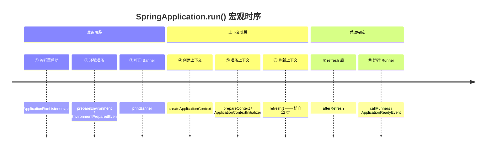
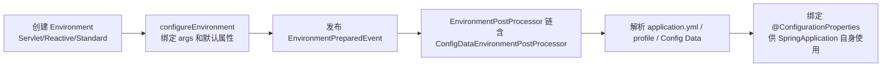
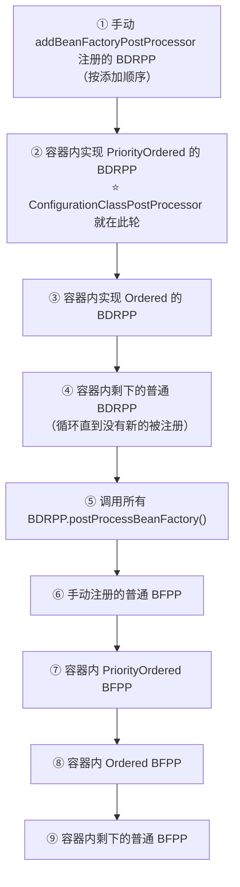
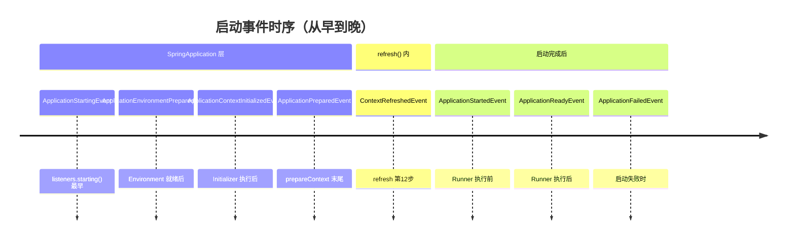
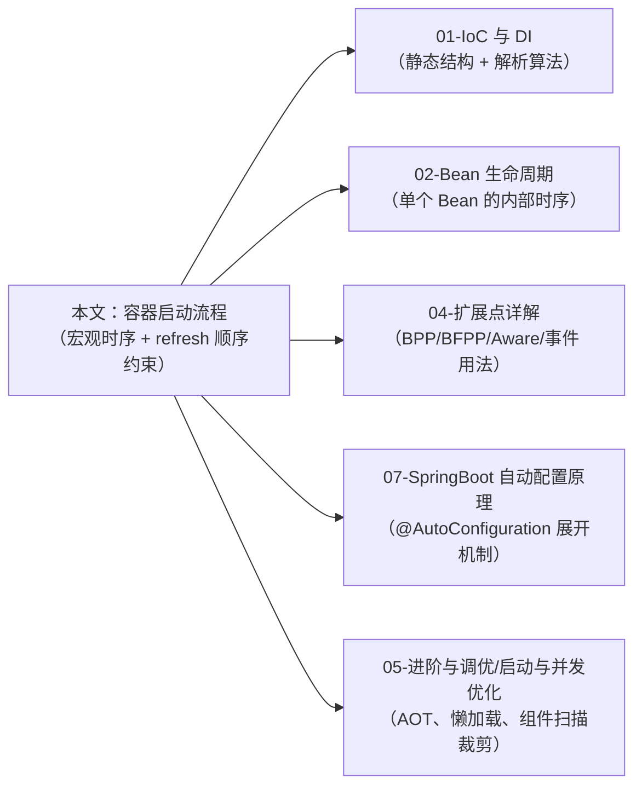

# Spring 容器启动流程深度解析

> **一句话记忆口诀**：`SpringApplication.run()` 八步（监听器 → 环境 → Banner → 上下文 → prepare → **refresh** → afterRefresh → Runner）；  
> `refresh()` 十二步关键顺序是"先改定义（BFPP）→ 再装处理器（BPP）→ 最后实例化单例（finishBeanFactoryInitialization）"；  
> 启动期靠 `SpringFactoriesLoader` 读 `META-INF/spring.factories`（Boot 2）/ `META-INF/spring/...imports`（Boot 3）实现 SPI；  
> 三大事件时机：`ContextRefreshedEvent`（refresh 末尾）→ `ApplicationStartedEvent`（Runner 执行前）→ `ApplicationReadyEvent`（Runner 执行后）；  
> Spring 6 AOT 把 `BeanDefinition` 注册从运行期搬到构建期。

---

## 1. 引入：启动流程是高级开发的地基

启动流程不是"流水账背诵"，它是排障、性能调优、扩展点开发的共同地基。高级开发者需要能当场回答这些问题：

- `application.yml` 里为什么命令行参数能覆盖文件里的值？优先级链是怎么定义的？
- `BeanFactoryPostProcessor` 为什么必须在 `BeanPostProcessor` **之前**执行？顺序反了会怎样？
- `@EventListener` 注册到底发生在 `refresh()` 的第几步？为什么它监听不到 `ContextRefreshedEvent`？
- `ContextRefreshedEvent` / `ApplicationStartedEvent` / `ApplicationReadyEvent` 三者时机差多少？选哪个做"应用启动完成钩子"？
- Spring Boot 3 升级后启动报 `AutoConfiguration` 类找不到，怎么回事？
- AOT 模式下 `BeanFactoryPostProcessor` 为什么"半失效"？

这些问题的共同前提是：**启动流程由一组强顺序约束串起来**，每一步只能在前一步完成后才能正确工作。本文按这个"顺序约束"视角展开。

> 📖 **边界声明**：
> - 单个 Bean 从 `createBean()` 到 `destroy()` 之间的阶段（属性注入、Aware、BPP before/after、初始化、销毁）见 [Bean 生命周期与循环依赖](02-Bean生命周期与循环依赖.md)。 
> - `BeanFactoryPostProcessor` / `BeanPostProcessor` / `Aware` / `ApplicationListener` / `ImportBeanDefinitionRegistrar` 的使用方式与代码示例见 [Spring 扩展点详解](04-Spring扩展点详解.md)。  
> - 懒加载、组件扫描范围裁剪、AOT / Native Image 构建实战见 [Spring 启动与并发优化](../05-进阶与调优/01b-启动与并发优化.md)。  
> 本文**只讲启动时序与顺序约束**，不与上述文档重复。

---

## 2. 类比：启动 = 剧组开机

```txt
剧组筹备（SpringApplication 构造）
    └─ 定剧本、招演员（加载 Initializer / Listener 实例）

筹建片场（prepareEnvironment）
    └─ 布置道具：属性从"命令行 → JNDI → JVM → OS → 配置文件"层层覆盖

选片场（createApplicationContext）
    └─ Servlet / Reactive / None 三选一

对剧本（refresh）
    └─ 读 BeanDefinition → 改剧本（BFPP）→ 招化妆师（BPP）→ 真正拍摄（预实例化单例）

开机仪式（ContextRefreshedEvent）→ 正式开拍（Runner）→ 通告观众（ApplicationReadyEvent）
```

---

## 3. 启动总览：`SpringApplication.run()` 八步



```java
public ConfigurableApplicationContext run(String... args) {
    // 1. 获取并启动 SPI 监听器（读取 META-INF/spring.factories）
    SpringApplicationRunListeners listeners = getRunListeners(args);
    listeners.starting();
    try {
        // 2. 准备环境（PropertySource / Profile / EnvironmentPreparedEvent）
        ConfigurableEnvironment environment = prepareEnvironment(listeners, appArgs);
        // 3. Banner
        Banner printedBanner = printBanner(environment);
        // 4. 根据 WebApplicationType 创建 ApplicationContext
        context = createApplicationContext();
        // 5. 应用 Initializer、发布 ContextPreparedEvent
        prepareContext(context, environment, listeners, appArgs, printedBanner);
        // 6. ⭐ 核心：AbstractApplicationContext.refresh() —— 12 步
        refreshContext(context);
        // 7. 钩子（默认空实现，供框架/业务扩展）
        afterRefresh(context, appArgs);
        listeners.started(context);               // ApplicationStartedEvent
        // 8. 执行 ApplicationRunner / CommandLineRunner
        callRunners(context, appArgs);
        listeners.running(context);               // ApplicationReadyEvent
        return context;
    } catch (Throwable ex) {
        handleRunFailure(context, ex, listeners);
        throw new IllegalStateException(ex);
    }
}
```

!!! note "八步的本质是三层嵌套"
    - **外层**（`SpringApplication`）：Boot 引导层，发布五大 `SpringApplicationEvent` 事件。
    - **中层**（`refresh()`）：Spring Framework 容器层，12 步刷新，发布 `ContextRefreshedEvent`。
    - **内层**（`doCreateBean()`）：单个 Bean 的生命周期层，见 [Bean 生命周期](02-Bean生命周期与循环依赖.md) 第 3、6 节。

    三层关系：外层 ⊃ 中层 ⊃ 内层。很多"启动慢"问题需要区分发生在哪一层，否则排查方向完全不同。

---

## 4. `SpringApplication` 构造：SPI 装配的起点

```java
public SpringApplication(ResourceLoader resourceLoader, Class<?>... primarySources) {
    this.webApplicationType = WebApplicationType.deduceFromClasspath();   // ① 推断应用类型
    this.bootstrapRegistryInitializers = getSpringFactoriesInstances(...);// ② 加载 BootstrapRegistryInitializer
    setInitializers(getSpringFactoriesInstances(ApplicationContextInitializer.class));
    setListeners(getSpringFactoriesInstances(ApplicationListener.class));
    this.mainApplicationClass = deduceMainApplicationClass();             // ③ 推断主类（堆栈里找 main）
}
```

**`WebApplicationType` 的推断规则**：

| 结果 | 判断依据 | 对应 Context 实现 |
| :-- | :-- | :-- |
| `SERVLET` | classpath 有 `Servlet` 且无 `DispatcherHandler` | `AnnotationConfigServletWebServerApplicationContext` |
| `REACTIVE` | classpath 有 `DispatcherHandler` 且无 `DispatcherServlet` | `AnnotationConfigReactiveWebServerApplicationContext` |
| `NONE` | 都没有 | `AnnotationConfigApplicationContext` |

!!! tip "推断是基于 classpath 的静态判断，不是 application.yml"
    常见误区："为什么我配了 `spring.main.web-application-type=none` 还是起了 Tomcat？"——错。`web-application-type` **生效**，但如果 classpath 上没有 Servlet/Reactive 相关类，根本不会走到这一步；如果有且你又没显式指定，则按上表优先级判断。想彻底关掉 Web，最干净的办法是排除 `spring-boot-starter-web` 的依赖。

---

## 5. 启动期的 SPI 机制：`SpringFactoriesLoader`

整个 Boot 启动的扩展性都建立在 `SpringFactoriesLoader` 上。它是 JDK `ServiceLoader` 的 Spring 版本，但行为更强（支持构造器参数注入、按类名分组）。

### 5.1 文件位置：Boot 2 vs Boot 3 的关键分水岭

| 版本 | SPI 文件位置 | 格式 |
| :-- | :-- | :-- |
| Boot 2.x | `META-INF/spring.factories` | `接口全限定名=实现类1,实现类2` |
| **Boot 2.7+** | 过渡期：`AutoConfiguration` 专用文件 | `META-INF/spring/org.springframework.boot.autoconfigure.AutoConfiguration.imports`（一行一个类名） |
| **Boot 3.0+** | 旧格式**仅用于非 AutoConfiguration 扩展点** | 所有 `@AutoConfiguration` 必须声明在 `.imports` 文件里，`spring.factories` 里写 `EnableAutoConfiguration=...` **不再生效** |

!!! warning "Boot 3 升级最常见的启动失败"
    现象：升级 Boot 3 后自定义 Starter 的 `@AutoConfiguration` 类完全不加载。
    **原因**：老代码把自动配置注册在 `META-INF/spring.factories` 的 `EnableAutoConfiguration` 键下，Boot 3 停止读取该键。
    **修复**：新建 `META-INF/spring/org.springframework.boot.autoconfigure.AutoConfiguration.imports`，每行一个配置类全限定名。

### 5.2 启动期通过 SPI 加载的关键扩展点

| 扩展点 | 加载时机 | 典型实现 |
| :-- | :-- | :-- |
| `BootstrapRegistryInitializer` | `SpringApplication` 构造 | 早期 DI（Boot 2.4+ 新增，比 Initializer 更早） |
| `ApplicationContextInitializer` | `SpringApplication` 构造 | `ConfigurationWarningsApplicationContextInitializer` |
| `ApplicationListener` | `SpringApplication` 构造 | `BackgroundPreinitializer`（后台线程预热 `Validator` 等） |
| `SpringApplicationRunListener` | `getRunListeners(args)` | `EventPublishingRunListener`（把 Boot 事件桥接到 `ApplicationEventMulticaster`） |
| `EnvironmentPostProcessor` | `prepareEnvironment` 中 | `ConfigDataEnvironmentPostProcessor`（加载 application.yml） |
| `@AutoConfiguration` | `refresh()` 第 5 步的 `ConfigurationClassPostProcessor` | 所有 Starter 的自动配置类 |

---

## 6. 环境准备 `prepareEnvironment`：PropertySource 优先级链



### 6.1 PropertySource 加载顺序（高优先级在前，覆盖低优先级）

1. **`DevToolsPropertyDefaultsPostProcessor`**（仅开发环境）
2. **`@TestPropertySource`** / `@SpringBootTest(properties=...)`（测试）
3. **命令行参数** `CommandLinePropertySource` —— `--server.port=8080`
4. **`SPRING_APPLICATION_JSON`** 环境变量 / JVM 属性
5. **`ServletConfig`** / **`ServletContext`** 初始化参数
6. **JNDI 属性** `java:comp/env`
7. **Java 系统属性** `System.getProperties()`
8. **操作系统环境变量** `System.getenv()`
9. **`RandomValuePropertySource`**（`${random.uuid}`）
10. **profile-specific 外部配置**（`application-{profile}.yml` 在 jar 外）
11. **profile-specific 打包配置**（`application-{profile}.yml` 在 jar 内）
12. **主配置外部**（`application.yml` 在 jar 外）
13. **主配置打包**（`application.yml` 在 jar 内）
14. **`@PropertySource`** 注解
15. **`SpringApplication.setDefaultProperties`**

!!! tip "记忆技巧"
    **越靠近"运行时 / 用户直接指定"的，优先级越高**：命令行 > 环境变量 > 配置文件 > 默认值。这也解释了为什么运维喜欢用环境变量注入密码——既能覆盖文件里的占位值，又不会把密码写进代码。

### 6.2 Profile 的激活时机

`ConfigDataEnvironmentPostProcessor` 读完主配置后，才会读取 `spring.profiles.active`，然后再叠加 profile-specific 配置。**这意味着**：`application-dev.yml` 里再设置 `spring.profiles.active` 是无效的（循环依赖），必须在主 `application.yml` 或外部指定。

---

## 7. 上下文创建与准备

### 7.1 `createApplicationContext()`

根据 `WebApplicationType` 选择工厂，底层是 `ApplicationContextFactory`（Boot 2.4+ 抽象出来的 SPI）：

```java
protected ConfigurableApplicationContext createApplicationContext() {
    return this.applicationContextFactory.create(this.webApplicationType);
}
```

三种 `ApplicationContext` 的本质都是 `GenericApplicationContext` 的子类，区别只在于：是否内建 `ServletWebServer` / `ReactiveWebServer` 的管理逻辑。

### 7.2 `prepareContext()` 的执行顺序

```java
private void prepareContext(...) {
    context.setEnvironment(environment);          // ① 关联 Environment
    postProcessApplicationContext(context);       // ② 注册 BeanNameGenerator / ConversionService
    applyInitializers(context);                   // ③ 调用所有 ApplicationContextInitializer
    listeners.contextPrepared(context);           // ④ 发布 ApplicationContextInitializedEvent
    // ⑤ 注册启动参数、Banner、懒加载处理器、allow-bean-definition-overriding 等
    // ⑥ 把主配置类（@SpringBootApplication 所在类）作为 BeanDefinition 注册
    load(context, sources);
    listeners.contextLoaded(context);             // ⑦ 发布 ApplicationPreparedEvent
}
```

!!! note "ApplicationContextInitializer 的真正价值"
    它是**`refresh()` 之前**唯一能拿到 `ConfigurableApplicationContext` 并安全修改的地方。典型用途：
    - 动态添加 `PropertySource`（比配置文件更灵活）
    - 注册额外的 `BeanFactoryPostProcessor`
    - 调整 `allow-bean-definition-overriding` 等底层开关

    这些动作放在 `@Bean` 或 `BeanFactoryPostProcessor` 里太晚，放在 `main` 里太早（`SpringApplication` 尚未推断 Environment）。

---

## 8. 核心：`AbstractApplicationContext.refresh()` 十二步

这是整个启动流程的**心脏**。十二步的顺序不是随意的，每一步都为后续步骤提供前置条件。

```java
public void refresh() throws BeansException, IllegalStateException {
    synchronized (this.startupShutdownMonitor) {
        prepareRefresh();                              // 1. 刷新前的标志位与环境校验
        ConfigurableListableBeanFactory beanFactory
            = obtainFreshBeanFactory();                // 2. 获取 DefaultListableBeanFactory（含 BeanDefinition 加载）
        prepareBeanFactory(beanFactory);               // 3. 装内置组件与忽略依赖
        try {
            postProcessBeanFactory(beanFactory);       // 4. 子类扩展点（Web 容器注册 Scope 等）
            invokeBeanFactoryPostProcessors(beanFactory); // 5. ⭐ 执行 BFPP：解析 @Configuration / @ComponentScan
            registerBeanPostProcessors(beanFactory);   // 6. ⭐ 装入所有 BPP（还未开始使用）
            initMessageSource();                       // 7. i18n
            initApplicationEventMulticaster();         // 8. 事件广播器（给 ApplicationListener 用）
            onRefresh();                               // 9. 子类钩子（Web 容器在此启动 Tomcat/Netty）
            registerListeners();                       // 10. 注册所有 ApplicationListener
            finishBeanFactoryInitialization(beanFactory); // 11. ⭐ 预实例化所有非懒加载单例
            finishRefresh();                           // 12. 发布 ContextRefreshedEvent
        } catch (BeansException ex) {
            destroyBeans();
            cancelRefresh(ex);
            throw ex;
        } finally {
            resetCommonCaches();
        }
    }
}
```

### 8.1 每一步的顺序约束（为什么不能换顺序）

| 步骤 | 前置依赖 | 换顺序的后果 |
| :-- | :-- | :-- |
| 2 `obtainFreshBeanFactory` | 无 | — |
| 3 `prepareBeanFactory` | 2（需要 beanFactory 实例） | — |
| 5 `invokeBeanFactoryPostProcessors` | 2、3（需要 BeanDefinition 已加载） | BFPP 改不到刚注册的 @Configuration 解析结果 |
| **6 `registerBeanPostProcessors`** | **5**（BFPP 可能注册新的 BPP） | **BFPP 新注册的 BPP 不会生效** |
| 10 `registerListeners` | 6（Listener 可能依赖被 BPP 增强） | Listener 无法被代理/AOP 增强 |
| **11 `finishBeanFactoryInitialization`** | **6、10** | **单例初始化时 BPP 未装入 → AOP/事务全失效；`@EventListener` 无处注册** |
| 12 `finishRefresh` | 11 | 发布 `ContextRefreshedEvent` 时必须已有完整 Bean 可用 |

!!! warning "最常被问的顺序问题"
    **Q：为什么 BFPP 必须在 BPP 前面？**
    A：BFPP 的本质是**修改 `BeanDefinition`**（元数据阶段），BPP 的本质是**增强 Bean 实例**（实例化阶段）。BPP 的注册信息本身也是个 `BeanDefinition`——如果 BFPP 在 BPP 之后执行，那么 BFPP 就没机会"动态修改 BPP 的定义"。实际上 `ConfigurationClassPostProcessor`（一个 BFPP）会扫描 `@Configuration` 类并注册很多新的 BPP（如 `AutowiredAnnotationBeanPostProcessor`），必须在第 5 步就做完，第 6 步才能把它们一起装入。

    **Q：为什么 `registerListeners` 在第 10 步、在 `finishBeanFactoryInitialization` 之前？**
    A：广播器（第 8 步创建）需要先登记 Listener，才能在第 11 步实例化 Bean 期间把"Bean 创建事件"派发出去。如果反过来，Listener 自己作为 Bean 被初始化时事件已错过。

### 8.2 第 5 步深挖：`invokeBeanFactoryPostProcessors` 的内部顺序

这是最复杂的一步，Spring 精心设计了**四轮调用**以保证 `BeanDefinitionRegistryPostProcessor`（BDRPP，BFPP 的子接口，可动态注册 BeanDefinition）优先于普通 BFPP：



!!! note "`ConfigurationClassPostProcessor` 是整个注解驱动的引擎"
    它在第 ② 轮执行，做了三件极其重要的事：
    1. **解析 `@Configuration` 类**：递归处理 `@ComponentScan` / `@Import` / `@ImportResource` / `@PropertySource`
    2. **注册 `@Bean` 方法**：作为新的 `BeanDefinition` 注入容器
    3. **决定 Full / Lite 模式**：若 `@Configuration(proxyBeanMethods=true)`，为配置类生成 CGLIB 代理（见 [IoC 与 DI §7.2](01-IoC与DI.md)）

    所有自动配置（`@AutoConfiguration`）、所有 `@EnableXxx` 注解能起作用的唯一原因，就是 `ConfigurationClassPostProcessor` 在这一步把它们展开。

### 8.3 第 11 步简述：`finishBeanFactoryInitialization`

- 冻结 `BeanDefinition`（`freezeConfiguration`）——此后不再允许修改
- 调用 `preInstantiateSingletons()`，对每一个非 lazy、非 abstract 的单例 `BeanDefinition` 调用 `getBean()`
- `getBean()` 触发单个 Bean 的完整生命周期（实例化 → 属性注入 → Aware → BPP before → 初始化 → BPP after）
- 所有单例创建完毕后，**遍历一遍所有 Bean**，对实现 `SmartInitializingSingleton` 的 Bean 调用 `afterSingletonsInstantiated()`——这是 `@EventListener` 真正被注册到广播器的时机

> 📖 第 11 步的内部细节（`doCreateBean` 的各阶段、三级缓存、AOP 代理生成）属于 Bean 生命周期范畴，见 [Bean 生命周期与循环依赖](02-Bean生命周期与循环依赖.md) 第 3、6 节。

### 8.4 第 12 步 `finishRefresh`

```java
protected void finishRefresh() {
    clearResourceCaches();
    initLifecycleProcessor();                       // 初始化 Lifecycle 处理器
    getLifecycleProcessor().onRefresh();            // 回调所有 SmartLifecycle.start()
    publishEvent(new ContextRefreshedEvent(this));  // ⭐ 发布 ContextRefreshedEvent
    LiveBeansView.registerApplicationContext(this); // JMX 注册（5.3 起 deprecated）
}
```

---

## 9. 启动期事件时序：三大 Event 的选择

Boot 启动期发布了**五个** `SpringApplicationEvent`，加上 Framework 层的 `ContextRefreshedEvent`，共六个关键事件。高级开发必须清楚时机差异。



| 事件 | 发布时机 | 可用的容器状态 | 典型用途 |
| :-- | :-- | :-- | :-- |
| `ApplicationStartingEvent` | `listeners.starting()` | 几乎什么都没有 | 极早期日志 |
| `ApplicationEnvironmentPreparedEvent` | Environment 就绪后 | 只有 Environment，没有 ApplicationContext | 自定义 `EnvironmentPostProcessor` 的替代 |
| `ApplicationPreparedEvent` | `prepareContext` 末尾 | ApplicationContext 就绪但未 refresh | 注册额外 BeanDefinition |
| **`ContextRefreshedEvent`** | **refresh 第 12 步** | **所有单例已创建** | **容器级"启动完成"钩子** |
| `ApplicationStartedEvent` | `afterRefresh` 之后、Runner 执行前 | 同上 | Boot 专属，等价于 ContextRefreshed 但更晚 |
| **`ApplicationReadyEvent`** | **所有 Runner 执行完毕** | **应用完全可对外提供服务** | **推荐的"对外可用"钩子**（注册到服务发现等） |
| `ApplicationFailedEvent` | 启动任意阶段抛异常 | 视失败阶段而定 | 告警 / 外部清理 |

!!! warning "`ContextRefreshedEvent` 不是应用启动完成"
    它只代表"容器 refresh 完毕"。此时 `CommandLineRunner` / `ApplicationRunner` **还没执行**，Tomcat 端口**虽已监听**但 Runner 可能还在做初始化（数据预热、灰度开关注册）——此时接入流量可能引发事故。

    **正确做法**：对外宣告"我能处理请求"应该用 `ApplicationReadyEvent`；容器内初始化逻辑可以用 `ContextRefreshedEvent` 或 `@EventListener(ContextRefreshedEvent.class)`。

!!! tip "为什么 `@EventListener` 监听不到 `ContextRefreshedEvent`"
    `@EventListener` 的注册发生在第 11 步末尾（`SmartInitializingSingleton` 钩子里），此时第 12 步的 `ContextRefreshedEvent` 还没发。可以注册到广播器的前提是 Bean 已创建 + `EventListenerMethodProcessor` 已扫描到。
    实际上 Spring 对这种情况做了特殊处理：`ContextRefreshedEvent` 发布时已经可以派发给刚注册的 `@EventListener`。但跨父子容器时仍可能踩坑——**子容器 refresh 发的 `ContextRefreshedEvent` 不会传播到父容器的 Listener**。

---

## 10. 启动期典型异常与定位表

启动失败的异常类型能精确定位出错阶段。

| 异常 | 抛出阶段 | 根因 | 排查入口 |
| :-- | :-- | :-- | :-- |
| `ApplicationContextException` | 第 9 步 `onRefresh`（Web 容器启动失败） | 端口占用 / Tomcat 配置错 | 日志看 `Unable to start embedded Tomcat` |
| `BeanDefinitionStoreException` | 第 2 或第 5 步 | `@ComponentScan` 扫不到类、XML 解析失败、`@Configuration` 类缺默认构造器 | 检查类路径、包名 |
| `BeanDefinitionOverrideException` | 第 5 步 | 两个同名 `@Bean`（Boot 2.1+ 默认禁止覆盖） | `spring.main.allow-bean-definition-overriding=true`（治标）/ 改名（治本） |
| `NoSuchBeanDefinitionException` | 第 11 步（实例化时） | 类型找不到 / 被 `@Conditional` 排除 | 启动加 `--debug` 看 `CONDITIONS EVALUATION REPORT` |
| `NoUniqueBeanDefinitionException` | 第 11 步 | 多个候选无 `@Primary` / `@Qualifier` | 见 [IoC 与 DI §6](01-IoC与DI.md) |
| `BeanCurrentlyInCreationException` | 第 11 步 | 构造器循环依赖 / Spring 6 默认禁用字段循环依赖 | 见 [Bean 生命周期 §6](02-Bean生命周期与循环依赖.md) |
| `BeanCreationException` | 第 11 步 | `@PostConstruct` 抛异常 / `afterPropertiesSet` 失败 | 看 `Caused by` 链 |
| `IllegalStateException: Failed to load ApplicationContext` | 任意阶段 | 通用包装，必须看 `Caused by` | 看内嵌异常 |

!!! tip "`--debug` 与 `-Ddebug=true` 的真正作用"
    不是开 DEBUG 级别日志，而是触发 `ConditionEvaluationReportLoggingListener` 打印**自动配置条件评估报告**：
    - `Positive matches` —— 生效的自动配置
    - `Negative matches` —— 被 `@ConditionalOnXxx` 排除的配置（附原因）
    - `Exclusions` —— 被显式 exclude 的配置

    90% 的"为什么我的 XxxAutoConfiguration 没生效"问题都能在这份报告里找到答案。

---

## 11. Spring 6 / Boot 3 AOT 对启动流程的冲击

AOT 把"运行时解析 + 反射实例化"变成"构建期生成 Java 源码 + 运行时直接执行"。这在启动流程层面带来了结构性变化。

### 11.1 运行期 vs AOT 启动流程对比

| 步骤 | 运行期模式 | AOT 模式 |
| :-- | :-- | :-- |
| BeanDefinition 加载 | 运行期 `@ComponentScan` + 注解解析 | **构建期**生成 `ApplicationContextInitializer` 类，硬编码 `BeanDefinition` 注册 |
| `ConfigurationClassPostProcessor` | 运行期递归展开 `@Configuration` | **构建期完成**，运行期不再执行展开 |
| `BeanFactoryPostProcessor` | 全部运行期执行 | 仅部分仍在运行期执行；动态 `BeanDefinition` 注册受限 |
| CGLIB 代理（Full `@Configuration`） | 运行期生成 | **强制 Lite 模式**（原生镜像禁止运行时字节码生成） |
| 条件注解 `@ConditionalOnXxx` | 运行期评估 | **构建期评估**，结果编译进二进制 |
| 反射 | 运行期 `setAccessible` | 需要提前声明 `RuntimeHints` 或 `reflect-config.json` |

### 11.2 AOT 下启动流程的"半失效"扩展点

!!! warning "不再按预期工作的扩展点"
    - `BeanDefinitionRegistryPostProcessor`：**只在构建期的** `ApplicationContextAotGenerator` 里执行；运行期再注册 `BeanDefinition` 多半无效。
    - 运行时动态 `@Import`：无法被原生镜像识别，必须改为构建期可静态分析的形式。
    - `ApplicationContext.refresh()` 重复调用：原生镜像下不支持（AOT 生成的 Initializer 只能跑一次）。

### 11.3 AOT 启动性能收益

```txt
传统 JVM 启动：
  SpringApplication 构造 → Environment → ComponentScan 反射扫描 → BeanDefinition 生成
  → BFPP 解析 @Configuration → 实例化单例 → ContextRefreshed
  冷启动时间：2~10s（取决于应用规模）

AOT + Native Image 启动：
  直接加载编译好的二进制 → 执行预生成的 Initializer → 实例化单例 → ContextRefreshed
  冷启动时间：~100ms（Serverless 场景提升 10~50 倍）
```

> 📖 AOT 的构建配置、`RuntimeHints` 声明、Native Image 构建命令详见 [Spring 启动与并发优化](../05-进阶与调优/01b-启动与并发优化.md) AOT 编译优化章节。IoC 层面的 AOT 影响见 [IoC 与 DI §8](01-IoC与DI.md)。

---

## 12. 启动期介入的扩展点（简表 + 引用）

> 📖 详细用法、代码示例见 [Spring 扩展点详解](04-Spring扩展点详解.md)。本节只列出**启动期**的介入时机对照表。

| 扩展点 | 介入时机（对应 `refresh()` 步骤或前置阶段） | 可做的事 |
| :-- | :-- | :-- |
| `BootstrapRegistryInitializer` | `SpringApplication` 构造之前 | 注册早期基础设施（Boot 2.4+） |
| `ApplicationContextInitializer` | prepareContext 第 ③ 步 | 修改 ApplicationContext 配置（添加 PropertySource 等） |
| `EnvironmentPostProcessor` | prepareEnvironment 中 | 动态调整 Environment / PropertySource |
| `BeanDefinitionRegistryPostProcessor` | refresh 第 5 步（BDRPP 轮） | 动态注册 BeanDefinition（MyBatis `MapperScannerConfigurer`） |
| `BeanFactoryPostProcessor` | refresh 第 5 步（BFPP 轮） | 修改已注册的 BeanDefinition（`PropertySourcesPlaceholderConfigurer`） |
| `BeanPostProcessor` | refresh 第 11 步的每个 Bean 创建时 | 干预 Bean 实例化前后（AOP 代理在此生成） |
| `SmartInitializingSingleton` | refresh 第 11 步末尾 | 全部单例到齐后的全局钩子（`@EventListener` 注册发生在此） |
| `ApplicationListener` / `@EventListener` | refresh 第 12 步之后 | 订阅 `ContextRefreshedEvent` 等事件 |
| `SmartLifecycle` | refresh 第 12 步 `finishRefresh` | 启停带生命周期的组件（MQ 消费者、调度器） |
| `ApplicationRunner` / `CommandLineRunner` | run() 第 8 步 | 最后一次启动钩子，失败会中断启动 |

---

## 13. 高频面试题（源码级标准答案）

**Q1：Spring Boot 应用的启动流程是怎样的？**

> 入口是 `SpringApplication.run()`，分八步：① 通过 `SpringFactoriesLoader` 加载并启动 `SpringApplicationRunListener`；② `prepareEnvironment` 准备 Environment 并应用 `EnvironmentPostProcessor`；③ 打印 Banner；④ 根据 `WebApplicationType` 调用 `ApplicationContextFactory` 创建 Context；⑤ `prepareContext` 应用 `ApplicationContextInitializer` 并发布 `ApplicationPreparedEvent`；⑥ 进入 Framework 层的 `AbstractApplicationContext.refresh()` 十二步（核心）；⑦ `afterRefresh` 钩子；⑧ 执行 `ApplicationRunner` / `CommandLineRunner`，最后发布 `ApplicationReadyEvent`。其中第 ⑥ 步是真正干活的地方，其余都是 Boot 为 Framework 容器做的引导和扩展。

**Q2：`refresh()` 的十二步为什么必须是这个顺序？**

> 核心约束是三个："先改定义、再装处理器、最后实例化"。具体地：**BFPP（第 5 步）必须在 BPP（第 6 步）之前**——因为 BFPP 可能动态注册新的 BPP，若反过来这些 BPP 就没机会被装入；**`registerListeners`（第 10 步）在 `finishBeanFactoryInitialization`（第 11 步）之前**——保证单例创建期间发出的事件能派发给 Listener；**`finishRefresh`（第 12 步）在所有单例就绪后**——`ContextRefreshedEvent` 的订阅者要能访问到完整的容器。

**Q3：`BeanFactoryPostProcessor` 和 `BeanPostProcessor` 的调用顺序与区别？**

> BFPP 在 `refresh()` 第 5 步执行，作用对象是 `BeanDefinition`（元数据）；BPP 在第 6 步**注册**（此时还未使用），在第 11 步每个 Bean 创建时才**调用**，作用对象是 Bean 实例。调用顺序的硬约束：BFPP 全部执行完 → BPP 被装入 → 单例实例化阶段 BPP 介入。`ConfigurationClassPostProcessor` 作为 BFPP 的典型实现，负责把 `@Configuration` / `@Bean` / `@ComponentScan` 展开为 `BeanDefinition`，并注册大量内置 BPP（如 `AutowiredAnnotationBeanPostProcessor`）。

**Q4：`ContextRefreshedEvent` / `ApplicationStartedEvent` / `ApplicationReadyEvent` 有什么区别？应该监听哪个？**

> 时机从早到晚：`ContextRefreshedEvent` 在 Framework 层 `refresh()` 第 12 步发布，此时所有单例已创建；`ApplicationStartedEvent` 在 `afterRefresh` 之后、Runner 执行前；`ApplicationReadyEvent` 在所有 Runner 执行完毕后。**关键区别**：前两个时机下 Runner 还没跑，应用可能尚未完成数据预热 / 灰度注册等逻辑，此时对外宣告"可用"存在风险；**推荐用 `ApplicationReadyEvent` 作为对外服务发现、灰度开关开启的钩子**；容器内初始化逻辑（如预热缓存）可以用 `ContextRefreshedEvent`。

**Q5：`SpringFactoriesLoader` 是什么？Boot 3 相比 Boot 2 有什么变化？**

> `SpringFactoriesLoader` 是 Spring 自己实现的 SPI 机制，支持按接口类型加载实现类，并可通过构造器注入参数。Boot 2 所有扩展点（含 `@AutoConfiguration`）都注册在 `META-INF/spring.factories`。**Boot 2.7 过渡期**新增了 `META-INF/spring/org.springframework.boot.autoconfigure.AutoConfiguration.imports`（每行一个类名）专用于自动配置。**Boot 3.0 起 `spring.factories` 里的 `EnableAutoConfiguration` 键不再被读取**——必须改用 `.imports` 文件，这是升级 Boot 3 最常见的启动失败原因。`ApplicationContextInitializer` / `ApplicationListener` 等非自动配置扩展点仍写在 `spring.factories`。

**Q6：`@EventListener` 在哪一步被注册？为什么？**

> 在 `refresh()` 第 11 步 `finishBeanFactoryInitialization` 的末尾，由 `EventListenerMethodProcessor`（实现了 `SmartInitializingSingleton`）在所有单例创建完毕后，遍历全部 Bean 扫描 `@EventListener` 方法并注册到 `ApplicationEventMulticaster`。不能更早——方法所在的 Bean 还没实例化；不能更晚——`ContextRefreshedEvent` 必须能派发给这些 Listener。这也是为什么 `@EventListener` 无法监听"容器刷新之前"的事件，因为它自己还没注册。

**Q7：AOT 模式下启动流程有哪些变化？**

> AOT 把原本运行时的"注解扫描 + `BeanDefinition` 生成 + `@Configuration` 解析"全部搬到构建期，产物是一个预生成的 `ApplicationContextInitializer` 类。运行期的 `refresh()` 跳过注解扫描和大部分 BFPP 执行，直接执行预生成的初始化器，冷启动从秒级降到百毫秒级。**硬约束**：`@Configuration` 强制 Lite 模式（不支持 CGLIB 运行时代理）、反射目标必须提前声明 `RuntimeHints`、运行时动态 `BeanDefinition` 注册失效、条件注解在构建期评估。升级 AOT 时把 `ApplicationContextAware.getBean` 改造成构造器注入 `ObjectProvider<T>` 是最常见的迁移动作。

---

## 14. 章节图谱



> **一句话口诀（再述）**：`run()` 八步引导 + `refresh()` 十二步刷新；顺序约束 = BFPP 前、BPP 中、单例后；`SpringFactoriesLoader` 是扩展总线（Boot 3 用 `.imports` 取代 `spring.factories` 的自动配置部分）；事件时序 `ContextRefreshed` → `ApplicationStarted` → `ApplicationReady`，对外宣告用最后一个；AOT 把整条启动流程"固化"到构建期。
