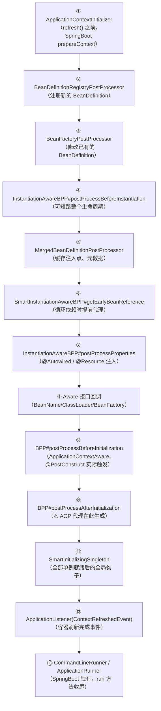
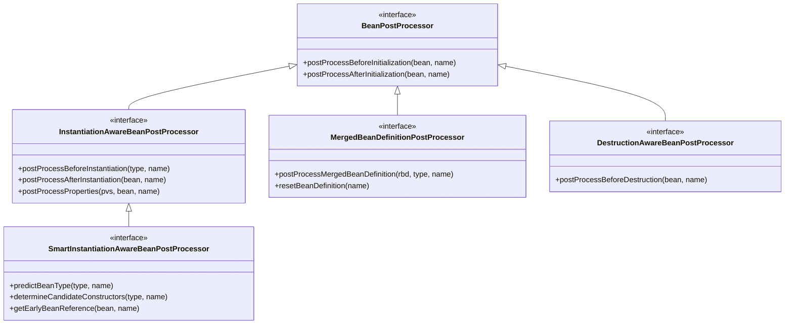
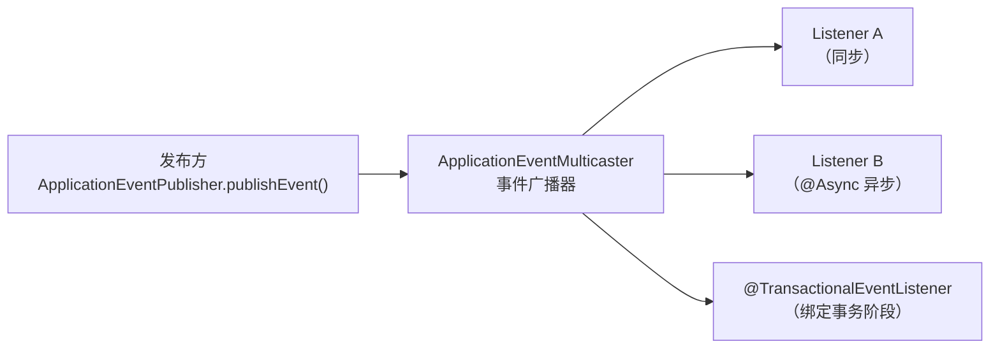
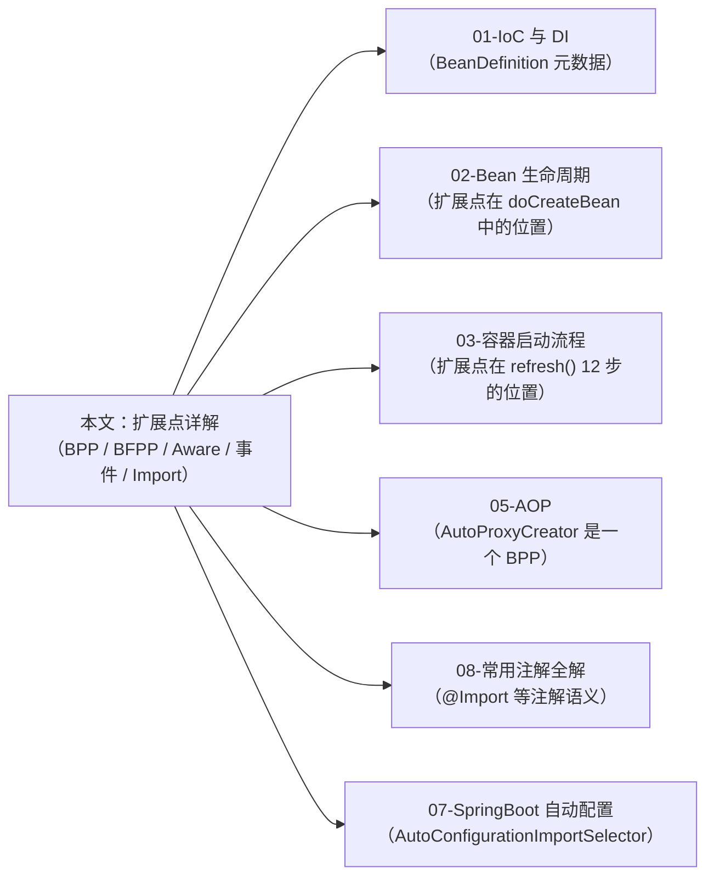

# Spring 扩展点详解

> **一句话记忆口诀**：扩展点按"作用对象"二分——改元数据（`BeanFactoryPostProcessor` / `BeanDefinitionRegistryPostProcessor`）与改实例（`BeanPostProcessor` 及其子类 `InstantiationAwareBPP` / `MergedBeanDefinitionPostProcessor` / `SmartInstantiationAwareBPP`）；按"作用时机"从早到晚 ——`ApplicationContextInitializer` → `BDRPP` → `BFPP` → `BPP#before` → `BPP#after` → `SmartInitializingSingleton` → `ApplicationListener(ContextRefreshedEvent)` → `CommandLineRunner/ApplicationRunner`；排序看 `PriorityOrdered` → `Ordered` → 注册顺序；事件默认同步，`@Async` 需 `@EnableAsync`，`@TransactionalEventListener` 绑定事务阶段。

---

## 1. 引入：为什么高级开发者必须吃透扩展点

扩展点是 Spring "对扩展开放、对修改关闭"的物化形式。八成业务开发者只用到 `@EventListener` 和 `ApplicationContextAware`，但下面这些问题只有吃透扩展点才答得上：

- 为什么 `@Autowired` 是靠 `BeanPostProcessor` 实现的？自己写的 BPP 里能用 `@Autowired` 吗？
- 为什么 `BeanFactoryPostProcessor` 可以 `@Component` 注册，但有时候 `@PostConstruct` 又不生效？
- `ImportSelector` 和 `ImportBeanDefinitionRegistrar` 什么时候选哪个？`@EnableXxx` 系注解为什么总是配一个 `Import`？
- `@EventListener` 监听 `ContextRefreshedEvent` 能拿到全部 Bean 吗？为什么有时候拿不到？
- `@TransactionalEventListener` 的 `BEFORE_COMMIT` 与 `AFTER_COMMIT` 有什么语义差异？事务里监听到的事件丢失怎么排查？
- 为什么 `ApplicationContextInitializer` 不能 `@Component`，只能配在 `spring.factories`？

这些问题的共同答案是：**扩展点不是孤立接口，而是嵌在 `refresh()` 12 步与 `doCreateBean()` 9 步里的一个个"预留钩子"**。理解它们的**作用对象、作用时机、注册方式、排序规则**四件事，才算真正掌握。

> 📖 `refresh()` 12 步的宏观视角见 [Spring 容器启动流程深度解析](03-Spring容器启动流程深度解析.md)；`doCreateBean()` 的微观视角见 [Bean 生命周期与循环依赖](02-Bean生命周期与循环依赖.md)。本文专注"**扩展点本身**"——每个接口的契约、触发点、使用陷阱。

---

## 2. 扩展点分类学：两个维度 + 一张对照表

### 2.1 按"作用对象"分类（关键直觉）

```txt
┌────────────────────────┐          ┌────────────────────────┐
│   BeanDefinition 世界   │  反射    │      Bean 实例世界      │
│      （元数据/配置）      │ ──────→ │       （真实对象）       │
└───────────┬────────────┘          └───────────┬────────────┘
            │                                    │
  BeanFactoryPostProcessor                BeanPostProcessor
  BeanDefinitionRegistryPostProcessor     InstantiationAwareBPP
  ImportSelector                          MergedBeanDefinitionPostProcessor
  ImportBeanDefinitionRegistrar           SmartInstantiationAwareBPP
```

**作用对象决定能做什么**：操作 `BeanDefinition` 的扩展点只能在 Bean 还没出生时修改"档案卡"；操作 Bean 实例的扩展点才能替换对象、生成代理、做依赖注入。

### 2.2 按"作用时机"分类（执行顺序全景）



> 第 ④~⑩ 步对每个 Bean 重复一次，第 ⑪~⑬ 步对整个容器只执行一次。

### 2.3 扩展点速查对照表

| 扩展点 | 作用对象 | 触发时机 | 典型实现 |
| :-- | :-- | :-- | :-- |
| `ApplicationContextInitializer` | `ConfigurableApplicationContext` | `refresh()` 之前 | `ConfigurationWarningsApplicationContextInitializer` |
| `BeanDefinitionRegistryPostProcessor` | `BeanDefinitionRegistry` | BDRPP 阶段 | `ConfigurationClassPostProcessor`、MyBatis `MapperScannerConfigurer` |
| `BeanFactoryPostProcessor` | `ConfigurableListableBeanFactory` | BFPP 阶段 | `PropertySourcesPlaceholderConfigurer` |
| `ImportSelector` | 返回类名数组 | 配置类解析阶段 | `AutoConfigurationImportSelector` |
| `ImportBeanDefinitionRegistrar` | `BeanDefinitionRegistry` | 配置类解析阶段 | `MapperScannerRegistrar`、`FeignClientsRegistrar` |
| `InstantiationAwareBeanPostProcessor` | Bean 实例（实例化前后） | 每个 Bean 实例化 | `AutowiredAnnotationBeanPostProcessor` |
| `MergedBeanDefinitionPostProcessor` | 合并后的 `RootBeanDefinition` | 每个 Bean 元数据合并 | `AutowiredAnnotationBeanPostProcessor`（缓存注入点） |
| `SmartInstantiationAwareBeanPostProcessor` | Bean 实例（提前暴露） | 循环依赖触发时 | `AbstractAutoProxyCreator` |
| `BeanPostProcessor` | Bean 实例（初始化前后） | 每个 Bean 初始化 | `ApplicationContextAwareProcessor`、`AbstractAutoProxyCreator` |
| `SmartInitializingSingleton` | Bean 自身（全员到齐钩子） | `preInstantiateSingletons()` 末尾 | `EventListenerMethodProcessor` |
| `ApplicationListener` / `@EventListener` | 事件对象 | 事件发布时 | 业务监听器 |
| `CommandLineRunner` / `ApplicationRunner` | 启动参数 | `SpringApplication.run()` 收尾 | 启动期初始化数据、校验配置 |

---

## 3. BeanFactoryPostProcessor 家族：修改 BeanDefinition

> 📖 `BeanDefinition` 的结构定义与合并机制见 [IoC 与 DI §4](01-IoC与DI.md)。本文只强调它们**作为扩展点**的使用边界。

### 3.1 `BeanDefinitionRegistryPostProcessor`——注册新 Bean

继承自 `BeanFactoryPostProcessor`，多出一个 `postProcessBeanDefinitionRegistry(registry)`，可以向容器**新增** `BeanDefinition`。它在 BFPP 阶段**更早**执行。

```java
@Component
public class MyBeanDefinitionRegistrar implements BeanDefinitionRegistryPostProcessor {

    @Override
    public void postProcessBeanDefinitionRegistry(BeanDefinitionRegistry registry) {
        // 动态注册一个 Bean，相当于运行时的 @Component
        RootBeanDefinition bd = new RootBeanDefinition(DynamicService.class);
        bd.setScope(BeanDefinition.SCOPE_SINGLETON);
        registry.registerBeanDefinition("dynamicService", bd);
    }

    @Override
    public void postProcessBeanFactory(ConfigurableListableBeanFactory beanFactory) {
        // 可留空；BDRPP 通常只用上面一个方法
    }
}
```

**典型应用**：
- `ConfigurationClassPostProcessor`（Spring 内置）：解析 `@Configuration` / `@ComponentScan` / `@Import`，把扫到的类注册为 `BeanDefinition`
- MyBatis `MapperScannerConfigurer`：扫描 `@Mapper` 接口批量注册
- Dubbo `ServiceAnnotationPostProcessor`：扫描 `@DubboService`

### 3.2 `BeanFactoryPostProcessor`——修改已有 Bean

```java
@Component
public class MyBeanFactoryPostProcessor implements BeanFactoryPostProcessor {

    @Override
    public void postProcessBeanFactory(ConfigurableListableBeanFactory beanFactory) {
        // 修改已有 BeanDefinition 的属性
        BeanDefinition bd = beanFactory.getBeanDefinition("userService");
        bd.getPropertyValues().add("maxRetry", 3);
    }
}
```

**典型应用**：`PropertySourcesPlaceholderConfigurer`——把 `BeanDefinition` 中的 `${xxx}` 占位符替换为配置值。Spring Boot 里该能力已融入 `PropertySourcesPropertyResolver`，日常很少再手写。

### 3.3 排序与陷阱

**排序规则**（三级优先级）：

```txt
① 实现 PriorityOrdered 的 BDRPP / BFPP   ← 最先执行，按 getOrder() 排序
② 实现 Ordered 的 BDRPP / BFPP          ← 次先
③ 普通 BDRPP / BFPP                    ← 按注册顺序
```

!!! warning "BFPP 里不要触发 Bean 的提前实例化"
    如果在 `postProcessBeanFactory` 里调用 `beanFactory.getBean(...)`，会把依赖的 Bean 提前实例化——此时 `BeanPostProcessor` 还没全部注册，可能导致 `@Autowired`、AOP、`@Async` 等**全部失效**。Spring 启动日志里的经典警告：
    > `Bean 'xxx' of type [X] is not eligible for getting processed by all BeanPostProcessors (for example: not eligible for auto-proxying)`
    常见元凶就是在 BFPP 里 `getBean()`、或把 BFPP 声明为 `static @Bean`（防止被代理加载 BPP）。

!!! note "BFPP 为什么可以用 `@Component`，而 BPP 也行"
    BFPP / BDRPP / BPP 这三类在 `refresh()` 中有**专用的提前注册流程**（`invokeBeanFactoryPostProcessors()` 与 `registerBeanPostProcessors()`），容器会主动扫描它们并**优先于业务 Bean** 实例化。所以它们可以直接 `@Component`。但 `ApplicationContextInitializer` 不一样——它在 `refresh()` **之前**就要用，此时容器还没启动，自然无法靠 `@Component` 注册，必须走 SPI（见 §7）。

---

## 4. BeanPostProcessor 家族：Bean 实例的全生命周期干预

> 📖 Bean 生命周期的完整阶段见 [Bean 生命周期与循环依赖 §3](02-Bean生命周期与循环依赖.md)。本文只按"扩展点视角"梳理 BPP 的继承体系。

### 4.1 继承体系



### 4.2 各接口的契约

| 接口 | 关键方法 | 返回值语义 | 典型使用者 |
| :-- | :-- | :-- | :-- |
| `BeanPostProcessor` | `postProcessBeforeInitialization` / `postProcessAfterInitialization` | 返回 bean 替换原对象；返回 null 等于 Spring 停止后续 BPP 链（**很少使用**） | `ApplicationContextAwareProcessor` 注入 `ApplicationContext`、`AbstractAutoProxyCreator` 生成 AOP 代理 |
| `InstantiationAwareBPP` | `postProcessBeforeInstantiation` | **返回非 null 直接短路**：跳过后续实例化/注入/初始化，但仍会走 `postProcessAfterInitialization` | 自定义"不经过 Spring 实例化"的 Bean、AOP 提前代理 |
| `InstantiationAwareBPP` | `postProcessProperties` | 修改或替换注入的 `PropertyValues` | `AutowiredAnnotationBeanPostProcessor`（`@Autowired`）、`CommonAnnotationBeanPostProcessor`（`@Resource`、`@PostConstruct`） |
| `SmartInstantiationAwareBPP` | `getEarlyBeanReference` | 为三级缓存提供"早期引用"生成逻辑 | `AbstractAutoProxyCreator` 在循环依赖时提前生成代理 |
| `MergedBeanDefinitionPostProcessor` | `postProcessMergedBeanDefinition` | 对合并后的 `RootBeanDefinition` 做最后修改 | `AutowiredAnnotationBeanPostProcessor` 在此**缓存 `@Autowired` 注入点**，避免每次 `populateBean` 都反射扫描 |
| `DestructionAwareBPP` | `postProcessBeforeDestruction` | 容器销毁 Bean 前调用 | `InitDestroyAnnotationBeanPostProcessor` 触发 `@PreDestroy` |

!!! tip "面试高频：`@Autowired` 和 `@PostConstruct` 由同一个 BPP 处理吗？"
    不是。`@Autowired` 由 `AutowiredAnnotationBeanPostProcessor` 在 `postProcessProperties`（第⑦步）处理；`@PostConstruct` 由 `CommonAnnotationBeanPostProcessor`（`InitDestroyAnnotationBeanPostProcessor` 的子类）在 `postProcessBeforeInitialization`（第⑨步）处理。二者虽都是 BPP，但属于**不同子接口、不同阶段**。

### 4.3 自定义 BPP 的正确姿势

```java
@Component  // 注册为普通 Bean，Spring 会识别为 BPP
public class TimingBeanPostProcessor implements BeanPostProcessor, Ordered {

    private final Map<String, Long> startTimes = new ConcurrentHashMap<>();

    @Override
    public Object postProcessBeforeInitialization(Object bean, String beanName) {
        startTimes.put(beanName, System.nanoTime());
        return bean;
    }

    @Override
    public Object postProcessAfterInitialization(Object bean, String beanName) {
        Long start = startTimes.remove(beanName);
        if (start != null) {
            long costMs = (System.nanoTime() - start) / 1_000_000;
            if (costMs > 100) {
                // 记录慢启动 Bean，用于性能优化
                log.warn("Slow bean init: {} cost {} ms", beanName, costMs);
            }
        }
        return bean;
    }

    @Override
    public int getOrder() { return Ordered.LOWEST_PRECEDENCE; }
}
```

!!! warning "自定义 BPP 内部慎用 `@Autowired`"
    BPP 的提前注册导致它**自身无法被其他 BPP 增强**——它创建时其他 BPP 可能还没就绪。所以：
    - BPP 内部的 `@Autowired` 字段可能拿不到增强过的依赖（拿到的是"原始对象"或旧版本）
    - BPP 内部慎用 `@Transactional`、`@Async`、`@Cacheable`——它们依赖的 AOP BPP 可能还没注册
    - **保险做法**：BPP 的依赖通过**构造器注入** + 声明类型为 `BeanFactory`（延迟查找），或干脆实现 `ApplicationContextAware` + 在需要时 `getBean()`。

---

## 5. Aware 接口家族：获取容器上下文

Aware 接口让 Bean 主动"感知"容器内部对象。它分为**两类触发路径**，不分清楚会在排查问题时困惑：

| 类别 | 触发路径 | 注入内容 | 代表接口 |
| :-- | :-- | :-- | :-- |
| **核心 Aware** | `invokeAwareMethods()` 直接硬编码调用 | Bean 自身元数据 | `BeanNameAware` / `BeanClassLoaderAware` / `BeanFactoryAware` |
| **扩展 Aware** | 由 `ApplicationContextAwareProcessor` 这个 BPP 在 `postProcessBeforeInitialization` 中触发 | 容器级服务 | `ApplicationContextAware` / `EnvironmentAware` / `ResourceLoaderAware` / `MessageSourceAware` / `ApplicationEventPublisherAware` / `EmbeddedValueResolverAware` |

### 5.1 完整接口清单

| 接口 | 注入内容 | 典型使用 |
| :-- | :-- | :-- |
| `BeanNameAware` | 当前 Bean 名 | 日志、定时任务名标识 |
| `BeanClassLoaderAware` | 加载该 Bean 的 `ClassLoader` | SPI / 插件隔离 |
| `BeanFactoryAware` | `BeanFactory`（最小契约） | 框架组件 |
| `ApplicationContextAware` | `ApplicationContext`（全套能力） | `SpringContextHolder` 工具类 |
| `EnvironmentAware` | `Environment`（配置 + Profile） | 读取配置时避免 `@Value` 的字符串硬编码 |
| `ResourceLoaderAware` | `ResourceLoader` | 加载 `classpath:*.yml` 类资源 |
| `MessageSourceAware` | `MessageSource` | 国际化 i18n |
| `ApplicationEventPublisherAware` | `ApplicationEventPublisher` | 独立于 `ApplicationContext` 的事件发布 |
| `EmbeddedValueResolverAware` | `StringValueResolver` | 解析 `${...}` 占位符（轻量替代 `@Value`） |

### 5.2 `SpringContextHolder` 的标准实现

```java
@Component
public class SpringContextHolder implements ApplicationContextAware {

    private static ApplicationContext ctx;

    @Override
    public void setApplicationContext(ApplicationContext applicationContext) {
        SpringContextHolder.ctx = applicationContext;
    }

    public static <T> T getBean(Class<T> type) { return ctx.getBean(type); }
    public static <T> T getBean(String name, Class<T> type) { return ctx.getBean(name, type); }
    public static ApplicationContext getContext() { return ctx; }
}
```

!!! warning "`ApplicationContextAware` 在 AOT / GraalVM 下的坑"
    原生镜像禁用了运行时反射元数据，`ctx.getBean(Xxx.class)` 可能抛异常。Spring 6 推荐重构为**构造器注入**——直接 `@Autowired` 具体类型，而不是把 `ApplicationContext` 当万能容器用。详见 [IoC 与 DI §8](01-IoC与DI.md)。

---

## 6. 事件机制：ApplicationListener 与 @EventListener

### 6.1 发布-订阅模型



### 6.2 两种写法

```java
// 方式一：实现 ApplicationListener 接口（经典）
@Component
public class AppReadyListener implements ApplicationListener<ApplicationReadyEvent> {
    @Override
    public void onApplicationEvent(ApplicationReadyEvent event) {
        // 容器完全启动后的初始化逻辑
    }
}

// 方式二：@EventListener 注解（推荐，更灵活）
@Component
public class OrderEventHandler {

    @EventListener
    public void onOrderCreated(OrderCreatedEvent event) { ... }

    // ① 支持 SpEL 条件过滤
    @EventListener(condition = "#event.amount > 1000")
    public void onBigOrder(OrderCreatedEvent event) { ... }

    // ② 支持异步（需 @EnableAsync）
    @Async
    @EventListener
    public void onOrderAsync(OrderCreatedEvent event) { ... }

    // ③ 绑定事务阶段
    @TransactionalEventListener(phase = TransactionPhase.AFTER_COMMIT)
    public void onOrderCommitted(OrderCreatedEvent event) { ... }
}
```

### 6.3 自定义事件

```java
public class OrderCreatedEvent extends ApplicationEvent {
    private final Long orderId;
    public OrderCreatedEvent(Object source, Long orderId) {
        super(source);
        this.orderId = orderId;
    }
    public Long getOrderId() { return orderId; }
}

@Service
public class OrderService {
    @Autowired
    private ApplicationEventPublisher publisher;

    @Transactional
    public void createOrder(Order order) {
        // 持久化...
        publisher.publishEvent(new OrderCreatedEvent(this, order.getId()));
    }
}
```

!!! tip "Spring 4.2+ 事件类型可不再继承 `ApplicationEvent`"
    ```java
    publisher.publishEvent(new OrderCreatedPojo(order.getId()));  // 任意 POJO
    ```
    容器内部会把它包装成 `PayloadApplicationEvent`。这让事件类与 Spring 解耦，便于领域模型复用。

### 6.4 内置事件清单（高频）

| 事件 | 触发时机 | 典型用途 |
| :-- | :-- | :-- |
| `ContextRefreshedEvent` | 容器初始化/刷新完成 | 启动后预热缓存、注册定时任务 |
| `ContextStartedEvent` | 显式调用 `start()` | Lifecycle Bean 启动 |
| `ContextStoppedEvent` | 显式调用 `stop()` | 优雅暂停服务 |
| `ContextClosedEvent` | 容器关闭 | 释放资源、持久化状态 |
| `ApplicationStartedEvent` | Spring Boot：`run()` 中 Context 刷新后、Runner 执行前 | 启动完成的早期通知 |
| `ApplicationReadyEvent` | Spring Boot：Runner 执行完毕，应用完全就绪 | 注册到服务发现、开放健康检查 |
| `ApplicationFailedEvent` | Spring Boot 启动失败 | 告警、优雅退出 |

### 6.5 事件机制的三大陷阱

!!! warning "陷阱 1：`@EventListener` 的注册时机"
    `@EventListener` **不是** Bean 初始化时就注册的，而是在容器所有单例初始化完成后，由 `EventListenerMethodProcessor`（一个 `SmartInitializingSingleton`）统一扫描注册。
    **后果**：在 `@PostConstruct` 或更早阶段发布的事件，`@EventListener` 监听器**收不到**。需要监听 `ContextRefreshedEvent` 前的事件，只能用 `ApplicationListener` 接口方式。

!!! warning "陷阱 2：`@Async` 失效"
    默认事件是**同步**的——发布者在事件处理完才返回。想要异步需要两步：
    1. 配置类加 `@EnableAsync`
    2. 监听方法加 `@Async`
    异步监听器在独立线程池执行，**事务上下文不传播**、**异常不抛给发布者**——需要用 `AsyncUncaughtExceptionHandler` 捕获。

!!! warning "陷阱 3：`@TransactionalEventListener` 的事务阶段"
    | `phase` | 触发时机 | 使用场景 |
    | :-- | :-- | :-- |
    | `BEFORE_COMMIT` | 事务提交**前** | 在同一事务中做最终校验 |
    | `AFTER_COMMIT`（默认） | 事务提交**后** | 发 MQ、发通知（确保数据已落库） |
    | `AFTER_ROLLBACK` | 事务回滚后 | 清理、补偿 |
    | `AFTER_COMPLETION` | 事务结束（无论成败） | 资源释放 |

    !!! danger "注意"
        `@TransactionalEventListener` 必须在**活跃事务**中发布事件才会触发；如果发布时没有事务，事件**默默丢失**（除非设置 `fallbackExecution = true`）。这是生产中最常见的"事件丢失"原因。

---

## 7. 配置驱动与 SPI 扩展点

### 7.1 `@Import` 三兄弟

`@Import` 是把外部配置拉进容器的"通用入口"，有三种用法：

| 用法 | 导入对象 | 何时使用 |
| :-- | :-- | :-- |
| `@Import(Xxx.class)` | **具体配置类**（`@Configuration` 或普通 `@Component`） | 静态导入单个配置 |
| `@Import(XxxImportSelector.class)` | 返回 **类名数组** | 根据条件批量导入已知类 |
| `@Import(XxxRegistrar.class)` | 直接向 `BeanDefinitionRegistry` **动态注册 Bean** | 根据注解属性扫描包、生成代理 |

### 7.2 `ImportSelector` 示例

```java
public class MyImportSelector implements ImportSelector {
    @Override
    public String[] selectImports(AnnotationMetadata metadata) {
        // 读取 @EnableMyFeature 注解的属性
        Map<String, Object> attrs = metadata.getAnnotationAttributes(EnableMyFeature.class.getName());
        String mode = (String) attrs.get("mode");
        return "prod".equals(mode)
            ? new String[]{"com.example.ProdConfig"}
            : new String[]{"com.example.DevConfig"};
    }
}

@Target(ElementType.TYPE) @Retention(RetentionPolicy.RUNTIME)
@Import(MyImportSelector.class)
public @interface EnableMyFeature {
    String mode() default "dev";
}
```

**典型应用**：Spring Boot 的 `@EnableAutoConfiguration` → `AutoConfigurationImportSelector`（读取 `META-INF/spring/org.springframework.boot.autoconfigure.AutoConfiguration.imports` 批量导入自动配置类）。

### 7.3 `ImportBeanDefinitionRegistrar` 示例

当只知道"要扫描某个包"而不知道具体类名时，`ImportSelector` 无法胜任——必须用 `Registrar` 自行构造 `BeanDefinition`：

```java
public class MapperRegistrar implements ImportBeanDefinitionRegistrar {
    @Override
    public void registerBeanDefinitions(AnnotationMetadata metadata,
                                        BeanDefinitionRegistry registry) {
        Map<String, Object> attrs = metadata.getAnnotationAttributes(EnableMyMapper.class.getName());
        String[] packages = (String[]) attrs.get("basePackages");

        ClassPathBeanDefinitionScanner scanner = new ClassPathBeanDefinitionScanner(registry, false);
        scanner.addIncludeFilter(new AnnotationTypeFilter(MyMapper.class));
        for (String pkg : packages) {
            scanner.scan(pkg);
        }
    }
}
```

**典型应用**：MyBatis `@MapperScan` → `MapperScannerRegistrar`；Spring Cloud OpenFeign `@EnableFeignClients` → `FeignClientsRegistrar`；Dubbo `@EnableDubbo` → `DubboComponentScanRegistrar`。

### 7.4 `ApplicationContextInitializer` 与 SPI

`ApplicationContextInitializer` 在 `refresh()` **之前**被调用，此时容器还没启动，Bean 扫描还没开始——所以**不能用 `@Component` 注册**，只能走 SPI：

```
src/main/resources/META-INF/spring.factories              # Spring Boot 2.x
src/main/resources/META-INF/spring/
  org.springframework.context.ApplicationContextInitializer.imports   # Spring Boot 3.x
```

```properties
# spring.factories 示例
org.springframework.context.ApplicationContextInitializer=\
com.example.MyContextInitializer
```

```java
public class MyContextInitializer implements ApplicationContextInitializer<ConfigurableApplicationContext> {
    @Override
    public void initialize(ConfigurableApplicationContext ctx) {
        // 在 refresh() 之前动态添加 PropertySource、激活 Profile、注册监听器
        ctx.getEnvironment().getPropertySources()
           .addFirst(new MapPropertySource("dynamic", Map.of("feature.x", "on")));
    }
}
```

!!! note "`AutoConfigurationImportSelector` 为什么也要 SPI"
    严格说它是被 `@Import` 驱动的，但它要加载的**"候选自动配置类列表"**本身是通过 SPI 加载的：Spring Boot 2.x 读 `spring.factories` 里的 `EnableAutoConfiguration` 键，Spring Boot 3.x 读 `AutoConfiguration.imports` 文件。这是 Spring SPI 机制（`SpringFactoriesLoader`）在自动配置上的直接应用。

### 7.5 `CommandLineRunner` / `ApplicationRunner`（Spring Boot 独有）

在 Bean 全部就绪后、`SpringApplication.run()` 返回前执行一次，相当于 `main` 方法的"后置钩子"：

```java
@Component
@Order(1)
public class DataInitializer implements CommandLineRunner {
    @Override
    public void run(String... args) {
        // 启动时预热数据、校验配置、检查远程依赖
    }
}
```

| 对比项 | `CommandLineRunner` | `ApplicationRunner` |
| :-- | :-- | :-- |
| 参数形态 | 原始 `String...` | `ApplicationArguments`（已解析 `--key=value`、非选项参数） |
| 排序 | `@Order` 或 `Ordered` | 同上 |
| 触发时机 | `ApplicationStartedEvent` 之后、`ApplicationReadyEvent` 之前 | 同 |

!!! tip "Runner vs `@PostConstruct` vs `ApplicationReadyEvent` 如何选？"
    - **`@PostConstruct`**：Bean 自己的初始化（需要本 Bean 的依赖已就绪即可）
    - **`Runner`**：全局一次性任务、且要保证**容器级 Bean 全部就绪**（数据预热、依赖检查）
    - **`ApplicationReadyEvent`**：更晚、更明确"服务可对外"——注册到服务发现、开放流量入口，推荐用它

---

## 8. 扩展点注册方式与排序规则总结

### 8.1 注册方式矩阵

| 扩展点 | `@Component` 注册 | SPI 注册 | `@Import` 注册 | 手动 API |
| :-- | :--: | :--: | :--: | :--: |
| `ApplicationContextInitializer` | ❌ | ✅ | | `SpringApplication.addInitializers` |
| `BeanDefinitionRegistryPostProcessor` | ✅ | | ✅ | `context.addBeanFactoryPostProcessor` |
| `BeanFactoryPostProcessor` | ✅ | | ✅ | 同上 |
| `BeanPostProcessor` 族 | ✅ | | ✅ | `beanFactory.addBeanPostProcessor` |
| `ImportSelector` / `ImportBeanDefinitionRegistrar` | | | ✅（必须） | |
| `ApplicationListener` | ✅ | ✅ | | `SpringApplication.addListeners` |
| `@EventListener` | ✅ | | | （方法注解，自动扫描） |
| `CommandLineRunner` / `ApplicationRunner` | ✅ | | | |

### 8.2 排序规则（通用）

所有扩展点共用同一套排序规则：

```txt
① PriorityOrdered  ← 最高优先级（框架级扩展点常用）
② Ordered          ← 次之（业务级扩展点常用）
③ 普通扩展点       ← 按注册顺序（不稳定，避免依赖）
```

**对 BPP 特殊说明**：Spring 会将三类 BPP 分别排序——先执行 `PriorityOrdered` 组，再执行 `Ordered` 组，最后是普通组。所以 `AutowiredAnnotationBeanPostProcessor`（`PriorityOrdered`）一定在业务 BPP 之前执行，这保证了业务 BPP 拿到的是"已完成依赖注入"的 Bean。

---

## 9. 常见误区与陷阱

### 误区 1：BFPP 里 `getBean()` 提前实例化业务 Bean

```java
// ❌ 在 BFPP 里直接 getBean，Bean 会绕过后续 BPP 增强
@Component
public class BadBFPP implements BeanFactoryPostProcessor {
    @Override
    public void postProcessBeanFactory(ConfigurableListableBeanFactory bf) {
        DataSource ds = bf.getBean(DataSource.class);  // 启动日志大量警告
        ds.getConnection();
    }
}
```

**正确做法**：如果确实需要早期初始化，改用 `ApplicationContextInitializer`（最早阶段）或 `SmartInitializingSingleton`（所有 Bean 就绪后）。

### 误区 2：BPP 依赖业务 Bean 的增强

```java
// ❌ BPP 内用 @Transactional，事务注解根本不生效
@Component
public class BadBPP implements BeanPostProcessor {
    @Transactional
    @Override
    public Object postProcessAfterInitialization(Object bean, String name) { ... }
}
```

BPP 在业务 BPP 之前注册，自身 **不会被 AOP BPP 增强**。需要事务请在 BPP 外面写代理。

### 误区 3：`@EventListener` 监听 `@PostConstruct` 里发布的事件

`@EventListener` 在 `SmartInitializingSingleton` 阶段才注册。如果在 `@PostConstruct` 中发布事件，**监听器还没注册**——事件被静默丢弃。

**正确做法**：
- 发布时机推后到 `ContextRefreshedEvent` 或 `ApplicationReadyEvent`
- 或改用 `ApplicationListener` 接口方式（更早注册）

### 误区 4：`@TransactionalEventListener` 在非事务方法里发事件

```java
// ❌ 没有 @Transactional，事件默认被忽略
public void createOrder() {
    repo.save(order);
    publisher.publishEvent(new OrderCreatedEvent(this, order.getId()));
    // @TransactionalEventListener(AFTER_COMMIT) 不会触发！
}
```

**解决**：① 加 `@Transactional`；或 ② 在监听器上设置 `fallbackExecution = true` 允许无事务时也执行。

### 误区 5：`ApplicationContextInitializer` 用 `@Component` 声明

容器刷新前根本还没扫描 `@Component`。**必须**走 `spring.factories` / `.imports` 或 `SpringApplication.addInitializers()`。

---

## 10. 高频面试题（源码级标准答案）

**Q1：`BeanFactoryPostProcessor` 和 `BeanPostProcessor` 有什么本质区别？**

> 二者作用对象不同、时机不同。`BFPP` 在 Bean **实例化之前**对 `BeanDefinition`（元数据/档案卡）做修改，只能改配置、不能接触对象；`BPP` 在每个 Bean **初始化前后**对 Bean 实例做干预，能做依赖注入、AOP 代理、属性验证等。一句话——`BFPP` 改元数据，`BPP` 改实例。

**Q2：`@Autowired` 是怎么被处理的？为什么自定义 BPP 内部慎用 `@Autowired`？**

> `@Autowired` 由 `AutowiredAnnotationBeanPostProcessor` 实现，它实现了 `InstantiationAwareBeanPostProcessor` 和 `MergedBeanDefinitionPostProcessor`——合并元数据阶段扫描缓存注入点，`postProcessProperties` 阶段反射赋值。而自定义 BPP 的实例化在其他 BPP 注册之前，它自己不受其他 BPP 增强，所以注入的依赖可能是原始对象（无 AOP）、事务/缓存/异步注解也都不生效。保险做法是构造器注入基础类型（`BeanFactory` / `Environment`），或实现 Aware 延迟获取。

**Q3：`ImportSelector` 和 `ImportBeanDefinitionRegistrar` 怎么选？**

> 如果**要导入的类在编译期已知**（只要决定"导哪几个"），用 `ImportSelector`——返回类名数组即可，Spring 会自动把它们作为配置类解析。如果要**根据注解属性动态扫描包、生成代理、控制 `BeanDefinition` 细节**，用 `ImportBeanDefinitionRegistrar`——直接拿到 `BeanDefinitionRegistry` 可做任何事。Spring Boot 自动配置用 `ImportSelector`（`AutoConfigurationImportSelector`），MyBatis/Feign 的 `@XxxScan` 用 `Registrar`。

**Q4：`ApplicationContextInitializer` 为什么不能 `@Component`？**

> 它在 `refresh()` 之前被调用——此时容器还没加载、`@Component` 扫描还没开始，自然无法靠注解注册。只能走 SPI：`META-INF/spring.factories`（Boot 2）或 `META-INF/spring/...ApplicationContextInitializer.imports`（Boot 3），或在 `main()` 里显式 `SpringApplication.addInitializers(...)`。本质原因——扩展点的注册方式取决于它的触发时机是否早于容器启动。

**Q5：`@EventListener` 为什么可能监听不到早期事件？**

> `@EventListener` 的注册由 `EventListenerMethodProcessor` 完成，它实现了 `SmartInitializingSingleton`，在**全部单例初始化完毕**后才扫描所有 Bean 上的 `@EventListener` 方法做注册。这意味着早于该时机发布的事件（例如其他 Bean 的 `@PostConstruct` 里）不会被 `@EventListener` 监听到——需要改用 `ApplicationListener` 接口方式（在普通 BPP 阶段就会注册）。

**Q6：`@TransactionalEventListener` 事件丢失怎么排查？**

> 首先确认发布方**处于活跃事务中**——没事务时事件默认被忽略（源码在 `TransactionalApplicationListenerMethodAdapter#onApplicationEvent`）。临时兜底可设 `fallbackExecution = true`。其次确认 `phase` 配置合理——`AFTER_COMMIT` 在回滚时不触发；如果要处理回滚场景需要 `AFTER_ROLLBACK` 或 `AFTER_COMPLETION`。最后确认监听器本身**不在事务内**执行额外 DB 操作（默认 `AFTER_COMMIT` 外部无事务，需要自己加 `@Transactional(propagation = REQUIRES_NEW)`）。

**Q7：BPP、BFPP 的执行顺序靠什么控制？**

> 三级排序：① 实现 `PriorityOrdered` 接口的最先执行（框架内置扩展点用这个）；② 实现 `Ordered` 接口的次之；③ 其余按注册顺序。`@Order` 注解对这些扩展点**不生效**（Spring 源码里显式 instanceof 判断，不读注解），必须实现接口。

---

## 11. 章节图谱与延伸阅读



> **一句话口诀（再述）**：扩展点按"作用对象"分两类（改元数据/改实例），按"作用时机"从早到晚是 `Initializer` → `BDRPP` → `BFPP` → `InstantiationAwareBPP` → `MergedBeanDefinitionBPP` → `BPP#before` → `BPP#after` → `SmartInitializingSingleton` → `ApplicationListener` → `Runner`；注册方式取决于是否早于 `refresh()`——早于的走 SPI，晚于的可 `@Component`；排序认 `PriorityOrdered` → `Ordered` → 注册顺序；事件默认同步，`@Async` 需开启，`@TransactionalEventListener` 无事务则丢失。
