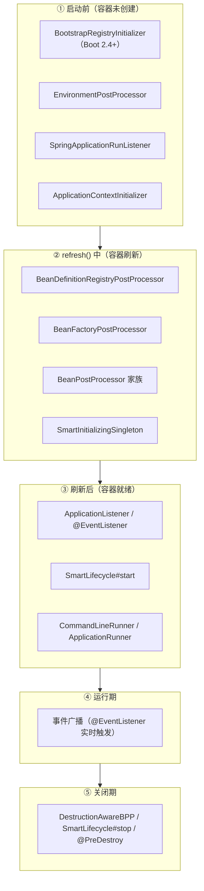
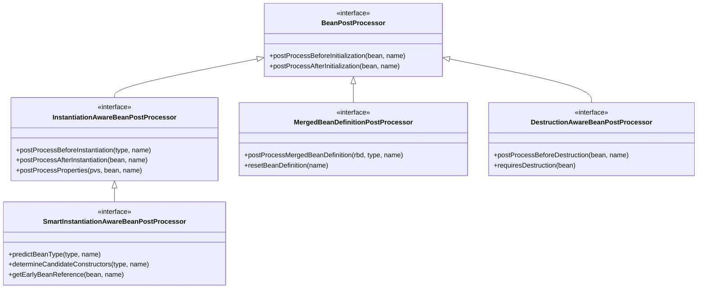
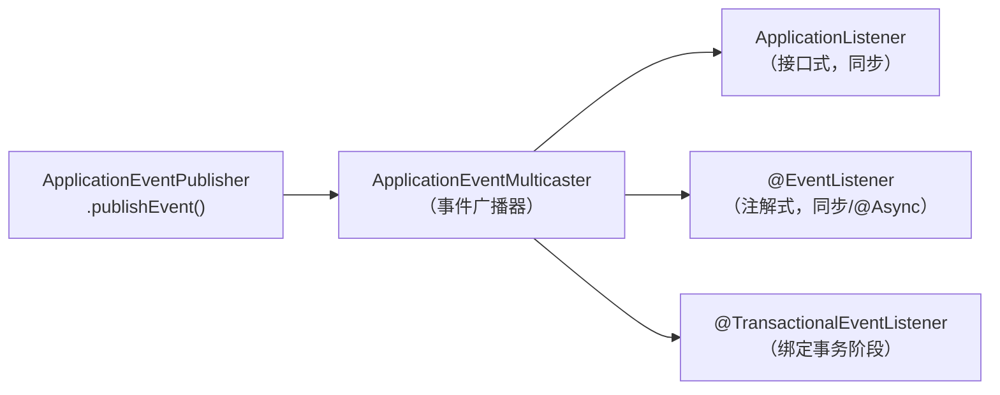
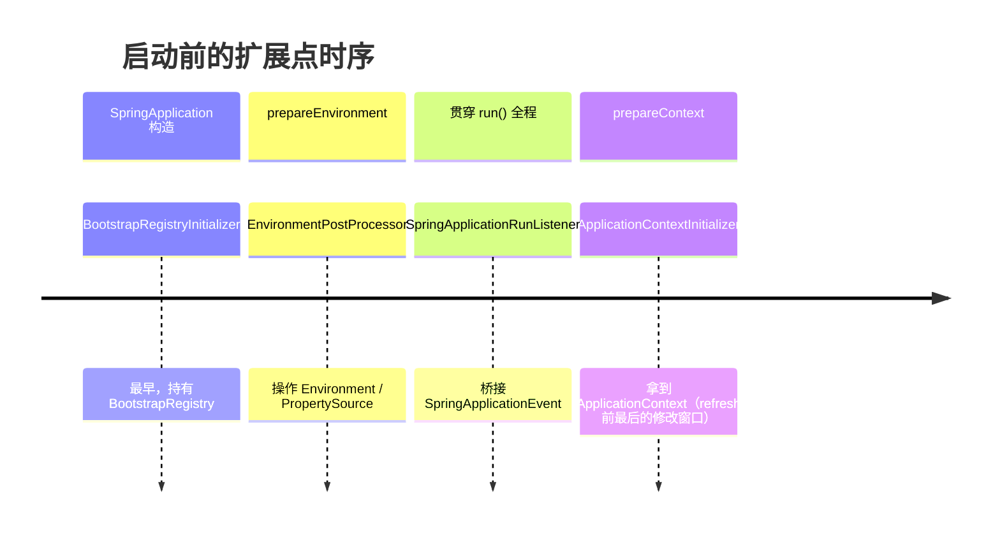
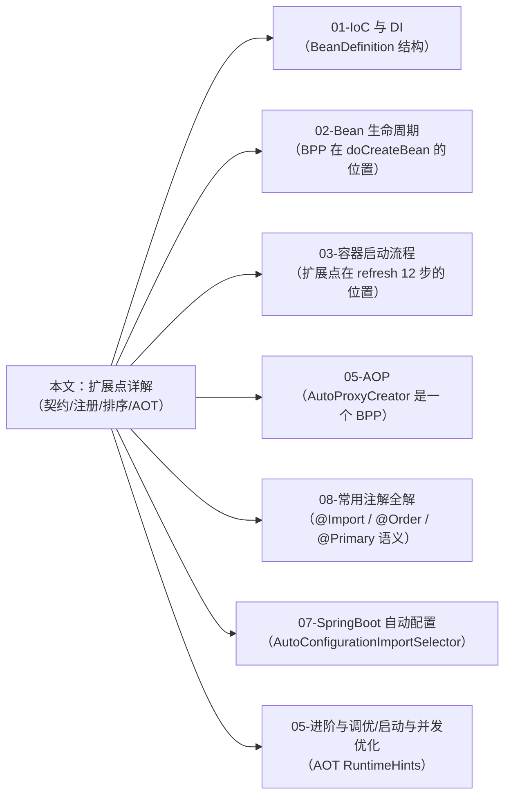

# Spring 扩展点详解

> **一句话记忆口诀**：
> 
> 扩展点按"作用对象"二分
> 
> - **改元数据**（`BeanFactoryPostProcessor` / `BeanDefinitionRegistryPostProcessor`）
> - **改实例**（`BeanPostProcessor` 及其子类 `InstantiationAwareBPP` / `MergedBeanDefinitionPostProcessor` / `SmartInstantiationAwareBPP`）；  
>
> 按"作用阶段"五段
>
> - **启动前**（`BootstrapRegistryInitializer` → `EnvironmentPostProcessor` → `SpringApplicationRunListener` → `ApplicationContextInitializer`）
> - **刷新中**（`BDRPP` → `BFPP` → `BPP` → `SmartInitializingSingleton`）
> - **刷新后**（`ApplicationListener` → `SmartLifecycle` → `Runner`）
> - **运行期**（事件广播）
> - **关闭期**（`DestructionAwareBPP` / `SmartLifecycle#stop`）；  
>
> 注册方式的铁律：**早于 `refresh()` 走 SPI，晚于 `refresh()` 可 `@Component`**；排序只认 `PriorityOrdered` → `Ordered` → 注册顺序，`@Order` 对 BPP/BFPP 无效。


> 📖 **边界声明**：本文只讲"**扩展点本身**"的契约、陷阱、源码实现。
>
> - `refresh()` 12 步的宏观时序与 `SpringFactoriesLoader` SPI 细节 → [Spring 容器启动流程深度解析](@spring-核心基础-Spring容器启动流程深度解析)
> - 单个 Bean `doCreateBean()` 的内部阶段 → [Bean 生命周期与循环依赖](@spring-核心基础-Bean生命周期与循环依赖)
> - `BeanDefinition` 的结构、合并、三种实现 → [IoC 与 DI §4](@spring-核心基础-IoC与DI)

---

## 1. 引入：扩展点视角的定位


高级开发者必须对扩展点的四件事给出精确答案：

| 维度 | 要回答的问题 |
| :-- | :-- |
| **作用对象** | 改的是 `BeanDefinition` 还是 Bean 实例？能不能替换对象？ |
| **触发时机** | 属于哪一阶段？早于还是晚于 `refresh()`？每个 Bean 一次还是全局一次？ |
| **注册方式** | SPI、`@Component`、`@Import`、手动 API，能混用吗？ |
| **排序规则** | `PriorityOrdered` / `Ordered` / `@Order` 哪个生效？扩展点之间的执行顺序约束是什么？ |

本文按"**分类学 → 逐家族契约 → 注册与排序 → AOT 下的半失效 → 误区**"的顺序展开。

---

## 2. 扩展点分类学

### 2.1 按作用对象：两个世界

```txt
┌────────────────────────┐          ┌────────────────────────┐
│   BeanDefinition 世界   │  反射    │      Bean 实例世界      │
│      （元数据/配置）      │ ──────→ │       （真实对象）       │
└───────────┬────────────┘          └───────────┬────────────┘
            │                                    │
  改元数据的扩展点（启动前半段）               改实例的扩展点（启动后半段）
  BeanFactoryPostProcessor                BeanPostProcessor
  BeanDefinitionRegistryPostProcessor     InstantiationAwareBPP
  ImportSelector                          MergedBeanDefinitionPostProcessor
  ImportBeanDefinitionRegistrar           SmartInstantiationAwareBPP
  BeanDefinitionCustomizer                DestructionAwareBPP
```

> 📖 这两个世界的分界线是 `refresh()` 第 5 步与第 6 步——BFPP 全部执行完后 `BeanDefinition` 才冻结。详见 [启动流程 §8](@spring-核心基础-Spring容器启动流程深度解析)。

### 2.2 按作用阶段：五段划分



> **每个 Bean 一次 vs 全局一次**：BPP 家族与 `MergedBeanDefinitionBPP` 对每个 Bean 触发；其余都是全局单次触发。

### 2.3 扩展点速查对照表

| 扩展点 | 作用对象 | 阶段 | 触发点（对应 refresh 步骤或启动阶段） | 典型实现 |
| :-- | :-- | :-- | :-- | :-- |
| `BootstrapRegistryInitializer` | `BootstrapRegistry` | ① 启动前 | `SpringApplication` 构造，早于 `prepareEnvironment` | 早期共享基础设施（Boot 2.4+） |
| `EnvironmentPostProcessor` | `ConfigurableEnvironment` | ① 启动前 | `prepareEnvironment` 中 | `ConfigDataEnvironmentPostProcessor`（加载 yaml） |
| `SpringApplicationRunListener` | `SpringApplication` 事件 | ① 启动前 + 贯穿全程 | `run()` 全程 | `EventPublishingRunListener` |
| `ApplicationContextInitializer` | `ConfigurableApplicationContext` | ① 启动前 | `prepareContext` 第 ③ 步 | `ContextIdApplicationContextInitializer` |
| `BeanDefinitionRegistryPostProcessor` | `BeanDefinitionRegistry` | ② refresh | 第 5 步（BDRPP 轮） | `ConfigurationClassPostProcessor`、`MapperScannerConfigurer` |
| `BeanFactoryPostProcessor` | `ConfigurableListableBeanFactory` | ② refresh | 第 5 步（BFPP 轮） | `PropertySourcesPlaceholderConfigurer` |
| `BeanDefinitionCustomizer` | 单个 `BeanDefinition` | ② refresh | 注册 BD 时（lambda） | 手动 `registerBean` 时定制 scope/primary |
| `ImportSelector` | 返回类名数组 | ② refresh | 第 5 步内 `ConfigurationClassPostProcessor` | `AutoConfigurationImportSelector` |
| `ImportBeanDefinitionRegistrar` | `BeanDefinitionRegistry` | ② refresh | 同上 | `MapperScannerRegistrar`、`FeignClientsRegistrar` |
| `MergedBeanDefinitionPostProcessor` | 合并后的 `RootBeanDefinition` | ② refresh（每 Bean） | `doCreateBean` 元数据合并 | `AutowiredAnnotationBeanPostProcessor` 缓存注入点 |
| `InstantiationAwareBeanPostProcessor` | Bean 实例（实例化前后） | ② refresh（每 Bean） | 实例化前 + 属性注入阶段 | `AutowiredAnnotationBeanPostProcessor` |
| `SmartInstantiationAwareBeanPostProcessor` | Bean 实例（提前暴露） | ② refresh（每 Bean） | 循环依赖触发时 | `AbstractAutoProxyCreator` |
| `BeanPostProcessor` | Bean 实例（初始化前后） | ② refresh（每 Bean） | 初始化前后 | `ApplicationContextAwareProcessor`、`AbstractAutoProxyCreator` |
| `DestructionAwareBeanPostProcessor` | Bean 实例（销毁前） | ⑤ 关闭 | `destroyBean` 时 | `InitDestroyAnnotationBeanPostProcessor`（`@PreDestroy`） |
| `SmartInitializingSingleton` | Bean 自身 | ② refresh（全局单次） | 第 11 步末尾 | `EventListenerMethodProcessor` |
| `ApplicationListener` / `@EventListener` | 事件对象 | ② / ③ / ④ | 事件发布时 | 业务监听器 |
| `SmartLifecycle` | Bean 自身 | ③ 刷新后 / ⑤ 关闭 | 第 12 步 `finishRefresh` / `close()` | MQ 消费者、调度器 |
| `CommandLineRunner` / `ApplicationRunner` | 启动参数 | ③ 刷新后 | `SpringApplication.run` 第 8 步 | 启动期数据预热 |

---

## 3. BeanFactoryPostProcessor 家族：改元数据

### 3.1 `BeanDefinitionRegistryPostProcessor`（BDRPP）——注册新 BD

`BFPP` 的子接口，多出 `postProcessBeanDefinitionRegistry(registry)`，可**向容器新增** `BeanDefinition`。在 BFPP 阶段**更早**执行（见 [启动流程 §8.2](@spring-核心基础-Spring容器启动流程深度解析) 四轮调用图）。

```java
@Component
public class MyBeanDefinitionRegistrar implements BeanDefinitionRegistryPostProcessor {

    @Override
    public void postProcessBeanDefinitionRegistry(BeanDefinitionRegistry registry) {
        RootBeanDefinition bd = new RootBeanDefinition(DynamicService.class);
        bd.setScope(BeanDefinition.SCOPE_SINGLETON);
        registry.registerBeanDefinition("dynamicService", bd);
    }

    @Override
    public void postProcessBeanFactory(ConfigurableListableBeanFactory beanFactory) {
        // BDRPP 通常只用上面一个方法
    }
}
```

**典型实现**：`ConfigurationClassPostProcessor`（解析所有 `@Configuration` / `@ComponentScan` / `@Import`）、MyBatis `MapperScannerConfigurer`、Dubbo `ServiceAnnotationPostProcessor`。

### 3.2 `BeanFactoryPostProcessor`（BFPP）——改已有 BD

```java
@Component
public class MyBeanFactoryPostProcessor implements BeanFactoryPostProcessor {
    @Override
    public void postProcessBeanFactory(ConfigurableListableBeanFactory beanFactory) {
        BeanDefinition bd = beanFactory.getBeanDefinition("userService");
        bd.getPropertyValues().add("maxRetry", 3);
    }
}
```

**典型实现**：`PropertySourcesPlaceholderConfigurer`（替换 `${...}` 占位符，Boot 里已内建）。

### 3.3 `BeanDefinitionCustomizer`——轻量 BD 定制（Spring 5.0+）

手动注册 Bean 时的 lambda 式定制器，不是 BPP/BFPP 的替代，而是**局部补充**：

```java
// 注册时当场定制 BeanDefinition
context.registerBean(MyService.class,
    bd -> {
        bd.setLazyInit(true);
        bd.setPrimary(true);
        bd.setScope(BeanDefinition.SCOPE_PROTOTYPE);
    });

// 或通过 GenericApplicationContext 的函数式 API
GenericApplicationContext ctx = new GenericApplicationContext();
ctx.registerBean("svc", MyService.class, MyService::new,
    bd -> bd.setLazyInit(true));
```

**适用场景**：AOT / 函数式 Bean 注册（`@Bean` 注解的非注解替代），无需再写 BFPP。

### 3.4 BFPP 的致命陷阱：不要 `getBean()`

!!! danger "BFPP 里调用 `getBean()` 会导致 BPP 全线失效"
    原理：BFPP 在 `refresh()` 第 5 步执行，此时第 6 步 `registerBeanPostProcessors` **尚未开始**——所有 BPP 还没装入 `beanFactory`。如果 BFPP 里直接 `getBean("xxx")` 把业务 Bean 提前实例化，这个 Bean 的初始化过程**绕过了所有后续 BPP**，导致：

    - `@Autowired` / `@Resource` 注入失败（依赖是 `null`）
    - `@Transactional` / `@Async` / `@Cacheable` 全部不生效（AOP 代理由 BPP 生成）
    - `@PostConstruct` 不执行（由 `CommonAnnotationBeanPostProcessor` 触发）

    启动日志里的经典警告：
    > `Bean 'xxx' of type [X] is not eligible for getting processed by all BeanPostProcessors (for example: not eligible for auto-proxying)`

    **规避方法**：
    1. BFPP 声明为 **`static @Bean`**（Spring 保证 `static @Bean` 的 BFPP 比普通 `@Bean` 更早实例化，避开配置类自身 Bean 被提前实例化）
    2. 要用的"Bean"改为 `ObjectProvider<T>` 构造器注入，延迟到真正使用时才查
    3. 真正需要早期初始化的场景，换用 `ApplicationContextInitializer`（更早）或 `SmartInitializingSingleton`（更晚但安全）

### 3.5 BFPP 家族为什么可以 `@Component`

三类 BPP/BFPP 在 `refresh()` 里有**专用的提前实例化路径**（`invokeBeanFactoryPostProcessors()` 与 `registerBeanPostProcessors()`），容器会主动识别并优先于业务 Bean 实例化。所以它们能用 `@Component` 注册。而 `ApplicationContextInitializer` 等启动期扩展点在 `refresh()` **之前**就要用，此时容器还没开始扫描——必须走 SPI（见 §7）。

---

## 4. BeanPostProcessor 家族：改实例

### 4.1 继承体系



### 4.2 五个子接口的契约对照表

| 接口 | 关键方法 | 返回值语义 | 典型使用者 |
| :-- | :-- | :-- | :-- |
| `BeanPostProcessor` | `postProcessBeforeInitialization` / `postProcessAfterInitialization` | 返回 bean 替换原对象；返回 `null` 停止后续 BPP 链 | `ApplicationContextAwareProcessor` 注入容器服务、`AbstractAutoProxyCreator` 生成 AOP 代理 |
| `InstantiationAwareBPP` | `postProcessBeforeInstantiation` | **返回非 `null` 直接短路**：跳过后续实例化/注入/初始化，但仍会走 `postProcessAfterInitialization` | 自定义"绕过 Spring 实例化"的场景、AOP 提前代理 |
| `InstantiationAwareBPP` | `postProcessProperties` | 修改或替换要注入的 `PropertyValues` | `AutowiredAnnotationBeanPostProcessor`（`@Autowired`）、`CommonAnnotationBeanPostProcessor`（`@Resource`） |
| `SmartInstantiationAwareBPP` | `getEarlyBeanReference` | 为三级缓存提供"早期引用"生成逻辑 | `AbstractAutoProxyCreator` 在循环依赖时提前生成代理 |
| `MergedBeanDefinitionPostProcessor` | `postProcessMergedBeanDefinition` | 对合并后的 `RootBeanDefinition` 做最后修改 | `AutowiredAnnotationBeanPostProcessor` **缓存注入点**，避免每次 `populateBean` 反射扫描 |
| `DestructionAwareBPP` | `postProcessBeforeDestruction` | 销毁前的最后一次干预 | `InitDestroyAnnotationBeanPostProcessor` 触发 `@PreDestroy` |

### 4.3 Bean 生命周期内的 BPP 调用顺序（每 Bean 一次）

> 📖 完整 8 步 + 隐式钩子见 [Bean 生命周期 §3](@spring-核心基础-Bean生命周期与循环依赖)。此处仅列 **BPP 维度**的调用链：

```txt
createBean()
  ├─ resolveBeforeInstantiation
  │    └─ InstantiationAwareBPP.postProcessBeforeInstantiation     ← 可短路
  └─ doCreateBean()
       ├─ applyMergedBeanDefinitionPostProcessors
       │    └─ MergedBeanDefinitionPostProcessor                   ← 缓存 @Autowired 注入点
       ├─ addSingletonFactory → 三级缓存
       │    └─ SmartInstantiationAwareBPP.getEarlyBeanReference    ← 循环依赖才触发
       ├─ populateBean
       │    ├─ InstantiationAwareBPP.postProcessAfterInstantiation ← 返回 false 可跳过注入
       │    └─ InstantiationAwareBPP.postProcessProperties         ← @Autowired/@Resource 真正执行
       └─ initializeBean
            ├─ invokeAwareMethods                                  ← 核心 Aware
            ├─ applyBeanPostProcessorsBeforeInitialization         ← @PostConstruct 实际触发点
            ├─ invokeInitMethods                                   ← InitializingBean / init-method
            └─ applyBeanPostProcessorsAfterInitialization          ← AOP 代理生成点
destroyBean()
  └─ DestructionAwareBPP.postProcessBeforeDestruction              ← @PreDestroy 触发
```

!!! tip "面试高频：`@Autowired` 与 `@PostConstruct` 由同一个 BPP 处理吗？"
    不是。
    - `@Autowired` 由 `AutowiredAnnotationBeanPostProcessor` 在 `postProcessProperties`（属性注入阶段）处理
    - `@PostConstruct` 由 `CommonAnnotationBeanPostProcessor`（继承 `InitDestroyAnnotationBeanPostProcessor`）在 `postProcessBeforeInitialization`（初始化前阶段）处理
    - `@Resource` 同样由 `CommonAnnotationBeanPostProcessor` 处理，但走的是 `postProcessProperties`
    - `@PreDestroy` 走 `DestructionAwareBPP.postProcessBeforeDestruction`

### 4.4 自定义 BPP 的正确姿势

```java
@Component
public class TimingBeanPostProcessor implements BeanPostProcessor, Ordered {

    private final Map<String, Long> startTimes = new ConcurrentHashMap<>();

    @Override
    public Object postProcessBeforeInitialization(Object bean, String beanName) {
        startTimes.put(beanName, System.nanoTime());
        return bean;
    }

    @Override
    public Object postProcessAfterInitialization(Object bean, String beanName) {
        Long start = startTimes.remove(beanName);
        if (start != null) {
            long costMs = (System.nanoTime() - start) / 1_000_000;
            if (costMs > 100) {
                log.warn("Slow bean init: {} cost {} ms", beanName, costMs);
            }
        }
        return bean;
    }

    @Override
    public int getOrder() { return Ordered.LOWEST_PRECEDENCE; }
}
```

### 4.5 BPP 自身的"增强盲区"

!!! warning "BPP 自身不会被其他 BPP 增强"
    BPP 在 `refresh()` 第 6 步被提前实例化，**早于业务 BPP 装入容器**。这意味着：

    | 业务代码里工作的注解 | 在 BPP 自身中的表现 |
    | :-- | :-- |
    | `@Autowired` 字段 | 依赖可能是未增强的原始对象（取决于 BPP 排序） |
    | `@Transactional` / `@Async` / `@Cacheable` | **全部静默失效**——AOP 代理由 `AnnotationAwareAspectJAutoProxyCreator` 生成，它本身是个 BPP |
    | `@PostConstruct` | 如果 `CommonAnnotationBeanPostProcessor` 尚未注册则不触发 |

    **安全的依赖方式**：
    1. **构造器注入 `BeanFactory` / `Environment`**：这两个在 BPP 创建时已可用
    2. 需要业务 Bean 时注入 `ObjectProvider<T>`，延迟到 `postProcessAfterInitialization` 里再 `getIfAvailable()`
    3. 绝对不要在 BPP 上标注事务/异步/缓存注解

---

## 5. Aware 接口家族：感知容器上下文

Aware 分**两类触发路径**——这是排查"为什么我的 Aware 没生效"的关键：

| 类别 | 触发路径 | 对应 BPP 还是硬编码 |
| :-- | :-- | :-- |
| **核心 Aware** | `invokeAwareMethods()` 内硬编码 `instanceof` 判断 | 非 BPP |
| **扩展 Aware** | 由 `ApplicationContextAwareProcessor` 这个 BPP 在 `postProcessBeforeInitialization` 中反射触发 | BPP |

### 5.1 接口清单

| 类别 | 接口 | 注入内容 | 典型使用 |
| :-- | :-- | :-- | :-- |
| **核心** | `BeanNameAware` | 当前 Bean 名 | 日志、定时任务标识 |
| **核心** | `BeanClassLoaderAware` | 加载该 Bean 的 `ClassLoader` | SPI / 插件隔离 |
| **核心** | `BeanFactoryAware` | `BeanFactory`（最小契约） | 框架组件 |
| **扩展** | `ApplicationContextAware` | `ApplicationContext`（全能） | `SpringContextHolder` 工具类 |
| **扩展** | `EnvironmentAware` | `Environment`（配置 + Profile） | 动态读配置 |
| **扩展** | `ResourceLoaderAware` | `ResourceLoader` | 加载 `classpath:*.yml` 类资源 |
| **扩展** | `MessageSourceAware` | `MessageSource` | 国际化 i18n |
| **扩展** | `ApplicationEventPublisherAware` | `ApplicationEventPublisher` | 不持有整个 Context 的事件发布 |
| **扩展** | `EmbeddedValueResolverAware` | `StringValueResolver` | 解析 `${...}` 占位符（轻量替代 `@Value`） |

### 5.2 `SpringContextHolder` 标准实现

```java
@Component
public class SpringContextHolder implements ApplicationContextAware {
    private static ApplicationContext ctx;

    @Override
    public void setApplicationContext(ApplicationContext applicationContext) {
        SpringContextHolder.ctx = applicationContext;
    }

    public static <T> T getBean(Class<T> type) { return ctx.getBean(type); }
    public static <T> T getBean(String name, Class<T> type) { return ctx.getBean(name, type); }
}
```

!!! warning "AOT / GraalVM 下 `ApplicationContextAware` 的反模式"
    原生镜像禁用运行时反射元数据，`ctx.getBean(Xxx.class)` 需要提前声明 `RuntimeHints`，否则抛 `MissingReflectionRegistrationError`。Spring 6 推荐把 `ApplicationContextAware` 重构为**构造器注入 `ObjectProvider<T>`**——显式、可静态分析、AOT 友好。详见 [IoC 与 DI §8](@spring-核心基础-IoC与DI) 与本文 §11。

---

## 6. 事件机制：ApplicationListener 与 @EventListener

### 6.1 发布-订阅模型



### 6.2 两种写法与能力对比

| 能力 | `ApplicationListener` 接口 | `@EventListener` 注解 |
| :-- | :-- | :-- |
| 注册时机 | BPP 扫描阶段即完成（早） | `SmartInitializingSingleton` 回调（晚） |
| 能否监听启动早期事件 | ✅ 可（如 `ApplicationStartingEvent`） | ❌ 不可 |
| 条件过滤 | 代码 `if` | ✅ SpEL `condition = "#event.xx > 1"` |
| 异步执行 | 手动线程池 | ✅ `@Async` |
| 绑定事务阶段 | 不支持 | ✅ `@TransactionalEventListener` |
| 一个类多个监听方法 | 需写多个类 | ✅ 同类多方法 |

```java
@Component
public class OrderEventHandler {

    @EventListener
    public void onOrderCreated(OrderCreatedEvent event) { ... }

    @EventListener(condition = "#event.amount > 1000")
    public void onBigOrder(OrderCreatedEvent event) { ... }

    @Async
    @EventListener
    public void onOrderAsync(OrderCreatedEvent event) { ... }

    @TransactionalEventListener(phase = TransactionPhase.AFTER_COMMIT)
    public void onOrderCommitted(OrderCreatedEvent event) { ... }
}
```

### 6.3 自定义事件与 POJO 事件

```java
// 继承 ApplicationEvent（经典）
public class OrderCreatedEvent extends ApplicationEvent {
    private final Long orderId;
    public OrderCreatedEvent(Object source, Long orderId) {
        super(source);
        this.orderId = orderId;
    }
    public Long getOrderId() { return orderId; }
}

// Spring 4.2+：直接发 POJO，自动包装为 PayloadApplicationEvent
publisher.publishEvent(new OrderCreatedPojo(orderId));
```

### 6.4 内置事件的选型矩阵

> 📖 完整的启动期事件时序与对比表见 [启动流程 §9](@spring-核心基础-Spring容器启动流程深度解析)。这里只给"**该监听哪个**"的选型视角：

| 业务意图 | 该监听的事件 | 理由 |
| :-- | :-- | :-- |
| Bean 全就绪后预热缓存（仍在启动期） | `ContextRefreshedEvent` | 所有单例已创建 |
| 应用"对外可用"（注册服务发现、开放流量） | **`ApplicationReadyEvent`** | Runner 已跑完，最晚最可靠 |
| 启动失败告警 | `ApplicationFailedEvent` | 捕获启动异常 |
| 容器显式 `start()` 的业务组件启停 | `ContextStartedEvent` / `ContextStoppedEvent` | 配合 `SmartLifecycle` 使用（见 §9） |
| 容器关闭前清理 | `ContextClosedEvent` | `close()` 开始时触发，早于 Bean 销毁 |

### 6.5 事件机制的三大陷阱

> 📖 `@EventListener` 为什么监听不到早期事件的根因见 [启动流程 Q6](@spring-核心基础-Spring容器启动流程深度解析)。

!!! warning "陷阱 1：`@EventListener` 注册在 `SmartInitializingSingleton` 阶段"
    在其他 Bean 的 `@PostConstruct` 中发布的事件，`@EventListener` **收不到**（此时它还没注册到广播器）。需要监听早期事件，改用 `ApplicationListener` 接口方式——它在 BPP 扫描阶段就注册。

!!! warning "陷阱 2：默认同步，`@Async` 有三个坑"
    1. 需要配置类加 `@EnableAsync`，否则 `@Async` 只是注释
    2. 异步监听器**事务上下文不传播**——`TransactionSynchronizationManager` 是 `ThreadLocal`，跨线程丢失
    3. 异步异常**不会抛给发布者**——必须配置 `AsyncUncaughtExceptionHandler` 捕获

!!! danger "陷阱 3：`@TransactionalEventListener` 无事务时静默丢失"
    | `phase` | 触发时机 | 使用场景 |
    | :-- | :-- | :-- |
    | `BEFORE_COMMIT` | 事务提交**前** | 同一事务中做最终校验 |
    | `AFTER_COMMIT`（默认） | 事务提交**后** | 发 MQ、发通知（确保落库） |
    | `AFTER_ROLLBACK` | 事务回滚后 | 清理、补偿 |
    | `AFTER_COMPLETION` | 事务结束（无论成败） | 资源释放 |

    必须在**活跃事务**中 `publishEvent()` 才会触发；否则事件默默丢失——生产中最常见的"事件消失"原因。兜底方案：`@TransactionalEventListener(fallbackExecution = true)`。

---

## 7. 启动期扩展点：早于 refresh() 的四个接口

这组扩展点都在 `refresh()` **之前**被调用——此时容器还没开始扫描，**全部不能靠 `@Component` 注册**，必须走 SPI 或手动 API。

### 7.1 介入时机与分工



### 7.2 `BootstrapRegistryInitializer`（Boot 2.4+）

最早的扩展点。在 `SpringApplication` 构造时就运行，**比 `ApplicationContextInitializer` 还早**，此时连 `Environment` 都还没准备。持有一个 `BootstrapRegistry`，用于注册**跨启动阶段共享的单例基础设施**（典型：ConfigData 的 `RestTemplate` 客户端）。

```java
public class MyBootstrapInitializer implements BootstrapRegistryInitializer {
    @Override
    public void initialize(BootstrapRegistry registry) {
        registry.register(MyEarlyClient.class,
            ctx -> new MyEarlyClient(/* 构造参数 */));
        // 注册关闭钩子：把 bootstrap 阶段的单例迁移到最终的 ApplicationContext
        registry.addCloseListener(evt ->
            evt.getApplicationContext().getBeanFactory()
               .registerSingleton("myEarlyClient",
                   evt.getBootstrapContext().get(MyEarlyClient.class)));
    }
}
```

### 7.3 `EnvironmentPostProcessor`——改 Environment

`prepareEnvironment` 阶段介入，可**动态添加/替换 `PropertySource`**、激活 Profile。Spring Boot 的 `application.yml` 加载就是由它完成的（`ConfigDataEnvironmentPostProcessor`）。

```java
public class DecryptEnvironmentPostProcessor implements EnvironmentPostProcessor, Ordered {
    @Override
    public void postProcessEnvironment(ConfigurableEnvironment env, SpringApplication app) {
        // 解密配置中以 ENC(...) 包裹的字段，前置于所有 PropertySource
        env.getPropertySources().addFirst(
            new MapPropertySource("decrypted", decryptFrom(env)));
    }

    @Override
    public int getOrder() { return Ordered.HIGHEST_PRECEDENCE; }
}
```

**对比 `ApplicationContextInitializer`**：`EnvironmentPostProcessor` **更早**（Context 还没创建），且只能接触 `Environment`；`ApplicationContextInitializer` 拿到的是整个 `ConfigurableApplicationContext`，能做更多事。

### 7.4 `SpringApplicationRunListener`（Boot 事件总线）

贯穿 `SpringApplication.run()` 全程，对应的生命周期方法被顺序调用。Spring Boot 内建实现 `EventPublishingRunListener` 把这些回调**桥接成** `ApplicationStartingEvent` 等 `SpringApplicationEvent`——所以 `@EventListener` 能监听到它们。自定义 `RunListener` 适合**埋点、监控**（关心启动每个阶段的耗时）。

```java
public class TimingRunListener implements SpringApplicationRunListener {
    private final long startTs;
    // ⚠️ 构造器签名固定：(SpringApplication, String[])
    public TimingRunListener(SpringApplication app, String[] args) {
        this.startTs = System.currentTimeMillis();
    }

    @Override public void starting(ConfigurableBootstrapContext bootstrap) { /* ... */ }
    @Override public void started(ConfigurableApplicationContext ctx, Duration timeTaken) {
        log.info("started in {} ms", System.currentTimeMillis() - startTs);
    }
    // 其他回调省略...
}
```

### 7.5 `ApplicationContextInitializer`——refresh 前的最后窗口

```java
public class DynamicPropertyInitializer
        implements ApplicationContextInitializer<ConfigurableApplicationContext>, Ordered {

    @Override
    public void initialize(ConfigurableApplicationContext ctx) {
        ctx.getEnvironment().getPropertySources()
           .addFirst(new MapPropertySource("dynamic", Map.of("feature.x", "on")));
        // 也可以在这里 ctx.addBeanFactoryPostProcessor(...) 注册额外 BFPP
    }

    @Override public int getOrder() { return Ordered.HIGHEST_PRECEDENCE; }
}
```

**它是 `refresh()` 之前**唯一能拿到 `ConfigurableApplicationContext` 并安全修改的位置——动态注册 `PropertySource`、追加 `BFPP`、调整 `allow-bean-definition-overriding` 等底层开关，都只能在这里做。

### 7.6 四个扩展点的注册方式

> 📖 Boot 2 vs Boot 3 的 SPI 文件路径差异见 [启动流程 §5.1](@spring-核心基础-Spring容器启动流程深度解析)，本文不重复。

| 扩展点 | Boot 2 `spring.factories` 键 | Boot 3 `.imports` 文件 | 手动 API |
| :-- | :-- | :-- | :-- |
| `BootstrapRegistryInitializer` | `org.springframework.boot.BootstrapRegistryInitializer` | `META-INF/spring/...BootstrapRegistryInitializer.imports` | `SpringApplication.addBootstrapRegistryInitializers` |
| `EnvironmentPostProcessor` | `org.springframework.boot.env.EnvironmentPostProcessor` | `META-INF/spring/...EnvironmentPostProcessor.imports` | 无（必须 SPI） |
| `SpringApplicationRunListener` | `org.springframework.boot.SpringApplicationRunListener` | `META-INF/spring/...SpringApplicationRunListener.imports` | 无 |
| `ApplicationContextInitializer` | `org.springframework.context.ApplicationContextInitializer` | `META-INF/spring/...ApplicationContextInitializer.imports` | `SpringApplication.addInitializers` |

---

## 8. 配置驱动扩展点：`@Import` 三兄弟

`@Import` 是把外部配置拉进容器的"通用入口"：

| 用法 | 导入对象 | 何时使用 |
| :-- | :-- | :-- |
| `@Import(Xxx.class)` | **具体配置类** | 静态导入单个配置 |
| `@Import(XxxImportSelector.class)` | 返回 **类名数组** | 根据注解属性批量导入**已知类** |
| `@Import(XxxRegistrar.class)` | 向 `BeanDefinitionRegistry` 直接注册 | 需要**扫描包、动态生成 BD** |

### 8.1 `ImportSelector`

```java
public class MyImportSelector implements ImportSelector {
    @Override
    public String[] selectImports(AnnotationMetadata metadata) {
        Map<String, Object> attrs = metadata.getAnnotationAttributes(EnableMyFeature.class.getName());
        return "prod".equals(attrs.get("mode"))
            ? new String[]{"com.example.ProdConfig"}
            : new String[]{"com.example.DevConfig"};
    }
}

@Target(ElementType.TYPE) @Retention(RetentionPolicy.RUNTIME)
@Import(MyImportSelector.class)
public @interface EnableMyFeature {
    String mode() default "dev";
}
```

**典型应用**：Spring Boot 的 `@EnableAutoConfiguration` → `AutoConfigurationImportSelector`，从 `.imports` 文件批量返回所有候选自动配置类名。

### 8.2 `DeferredImportSelector`（延迟导入）

`ImportSelector` 的子接口，会被延迟到**所有 `@Configuration` 类处理完**之后再执行。`AutoConfigurationImportSelector` 就是它的实现——用户配置类优先解析，自动配置最后补齐，保证 `@ConditionalOnMissingBean` 能正确识别"用户已定义了 X"。

### 8.3 `ImportBeanDefinitionRegistrar`

只知道"扫描某个包"而不知道具体类名时，`ImportSelector` 无法胜任，必须用 `Registrar` 自行构造 BD：

```java
public class MapperRegistrar implements ImportBeanDefinitionRegistrar {
    @Override
    public void registerBeanDefinitions(AnnotationMetadata metadata,
                                        BeanDefinitionRegistry registry) {
        String[] packages = (String[]) metadata.getAnnotationAttributes(
            EnableMyMapper.class.getName()).get("basePackages");

        ClassPathBeanDefinitionScanner scanner = new ClassPathBeanDefinitionScanner(registry, false);
        scanner.addIncludeFilter(new AnnotationTypeFilter(MyMapper.class));
        for (String pkg : packages) scanner.scan(pkg);
    }
}
```

**典型应用**：MyBatis `@MapperScan` → `MapperScannerRegistrar`；OpenFeign `@EnableFeignClients` → `FeignClientsRegistrar`；Dubbo `@EnableDubbo` → `DubboComponentScanRegistrar`。

### 8.4 Selector vs Registrar 的选型决策

```txt
要加入容器的是什么？
├─ 已知具体类名（编译期静态） → ImportSelector
│   └─ 需要等所有 @Configuration 处理完再决定？→ DeferredImportSelector
└─ 运行时扫描/动态生成的 BD（类名未知） → ImportBeanDefinitionRegistrar
```

---

## 9. `SmartLifecycle`：容器级启停钩子

`Lifecycle` 接口定义 `start()` / `stop()`，`SmartLifecycle` 增强了**自动启动、优雅停机、阶段排序**能力。它**不是 BPP**，而是容器级别的启停组件——典型载体：MQ 消费者、嵌入式 Web 服务器、定时任务调度器。

### 9.1 生命周期

- **启动**：`refresh()` 第 12 步 `finishRefresh` → `lifecycleProcessor.onRefresh()` → 遍历所有 `SmartLifecycle`，`isAutoStartup() == true` 的调用 `start()`
- **关闭**：`close()` → `lifecycleProcessor.onClose()` → 按 `phase` **倒序**调用 `stop(Runnable callback)`，支持异步优雅停机

### 9.2 标准实现

```java
@Component
public class KafkaConsumerLifecycle implements SmartLifecycle {
    private final KafkaConsumer<?, ?> consumer;
    private volatile boolean running;

    @Override
    public void start() {
        consumer.subscribe(...);
        running = true;
    }

    @Override
    public void stop(Runnable callback) {
        // 异步停机：先停止拉取、消费完在途消息、再回调
        CompletableFuture.runAsync(() -> {
            consumer.close();
            running = false;
            callback.run();  // ⚠️ 必须调用 callback，否则容器永远等下去
        });
    }

    @Override public boolean isRunning() { return running; }
    @Override public boolean isAutoStartup() { return true; }

    // phase 越大越晚启动、越早停止（像栈）
    // Web 服务器通常是最晚启动（phase = Integer.MAX_VALUE）、最早停止
    @Override public int getPhase() { return 1000; }
}
```

### 9.3 与 `@PostConstruct` / Runner 的区别

| 钩子 | 触发时机 | 能否优雅停机 | 重启能力 |
| :-- | :-- | :-- | :-- |
| `@PostConstruct` | 本 Bean 初始化时 | ❌ 需 `@PreDestroy` 配合 | ❌ 一次性 |
| `Runner` | 容器就绪后一次性执行 | ❌ | ❌ |
| `SmartLifecycle` | 容器级启动/关闭 | ✅ `stop(Runnable)` 异步回调 | ✅ 支持 `start()` / `stop()` 反复调用 |
| `@EventListener(ContextRefreshedEvent)` | 刷新完成时 | ❌ | ❌ |

**一句话决策**：**需要"优雅启停"用 `SmartLifecycle`，一次性初始化用 `Runner`**。

---

## 10. `CommandLineRunner` / `ApplicationRunner`

容器所有 Bean 就绪后、`SpringApplication.run()` 返回前执行一次。

```java
@Component
@Order(1)
public class DataInitializer implements CommandLineRunner {
    @Override
    public void run(String... args) {
        // 启动时预热数据、校验配置、检查远程依赖
    }
}
```

| 对比项 | `CommandLineRunner` | `ApplicationRunner` |
| :-- | :-- | :-- |
| 参数形态 | 原始 `String...` | `ApplicationArguments`（已解析 `--key=value`） |
| 排序 | `@Order` / `Ordered` | 同 |
| 触发时机 | `ApplicationStartedEvent` 之后、`ApplicationReadyEvent` 之前 | 同 |
| Runner 抛异常 | **中断启动**（容器回滚关闭） | 同 |

!!! tip "Runner / `@PostConstruct` / `ApplicationReadyEvent` 选型"
    - `@PostConstruct`：本 Bean 的初始化，依赖本 Bean 的依赖已注入
    - **Runner**：全局一次性任务，需要**整个容器已就绪**（数据预热、依赖健康检查）
    - **`ApplicationReadyEvent`**：最晚、最明确的"对外可用"时刻——注册服务发现、开放流量入口
    - **`SmartLifecycle`**：有启停语义的组件（能在 `close()` 时优雅退出）

---

## 11. AOT / GraalVM 下扩展点的"半失效"

Spring 6 / Boot 3 引入的 AOT 把"运行期注解解析 + 反射实例化"搬到**构建期**，产物是一个预生成的 `ApplicationContextInitializer` 类。这对扩展点带来结构性冲击。

> 📖 AOT 的启动流程视角见 [启动流程 §11](@spring-核心基础-Spring容器启动流程深度解析)。本节从**扩展点视角**补充——哪些扩展点会"半失效"、怎么改。

### 11.1 AOT 下各扩展点的状态

| 扩展点 | AOT 下的表现 |
| :-- | :-- |
| `BootstrapRegistryInitializer` | ✅ 正常（运行期）—— Bootstrap 阶段仍动态执行 |
| `EnvironmentPostProcessor` | ✅ 正常（运行期） |
| `ApplicationContextInitializer` | ⚠️ **AOT 生成的 Initializer 已在最前**——自定义的仍会执行，但要小心它依赖"还未注册的 BD"的场景 |
| `BeanDefinitionRegistryPostProcessor` | 🔴 **构建期执行一次，运行期不再执行**——动态注册 BD 多半无效 |
| `BeanFactoryPostProcessor` | 🟡 **部分失效**：Spring 自带 BFPP 在构建期求值完毕；用户 BFPP 仍会在运行期执行，但 BD 已冻结，修改窗口变窄 |
| `ImportSelector` / `Registrar` | 🔴 **构建期执行**——运行期决策失效，条件必须在构建期可静态分析 |
| `@Conditional` | 🔴 **构建期求值**——结果编译进二进制，运行期更改环境变量无效 |
| `BeanPostProcessor` 家族 | ✅ 运行期正常，但反射触达的字段/方法必须已声明 `RuntimeHints` |
| `SmartInitializingSingleton` | ✅ 正常 |
| `ApplicationListener` / `@EventListener` | ✅ 正常 |
| `SmartLifecycle` | ✅ 正常 |
| `Runner` | ✅ 正常 |
| CGLIB 代理（Full `@Configuration`） | 🔴 **强制 Lite 模式**——禁止运行时字节码生成 |

### 11.2 AOT 友好的扩展点改造清单

1. **`ApplicationContextAware` + `getBean(Xxx.class)`** → 改为**构造器注入 `ObjectProvider<T>`**
2. **运行期动态 `@Import`** → 改为构建期可静态分析的形式，或迁移到 `ApplicationContextInitializer` 里手动注册
3. **BFPP 里 `registry.registerBeanDefinition(...)`** → 改用 `@Bean` 方法 + `BeanDefinitionCustomizer`
4. **`@Configuration(proxyBeanMethods = true)` 的方法互调** → 改为参数注入（把被调方法的返回值作为当前方法的参数），避免依赖 CGLIB
5. **反射访问第三方类** → 注册 `RuntimeHintsRegistrar` 或 `@RegisterReflectionForBinding`

> 📖 `RuntimeHints` 注册方式、完整的 AOT 构建命令详见 [Spring 启动与并发优化](@spring-进阶与调优-启动与并发优化) AOT 章节。

---

## 12. 注册方式与排序规则总结

### 12.1 注册方式矩阵

| 扩展点 | `@Component` | SPI（`.imports` / `spring.factories`） | `@Import` | 手动 API |
| :-- | :--: | :--: | :--: | :--: |
| `BootstrapRegistryInitializer` | ❌ | ✅ | ❌ | `SpringApplication.addBootstrapRegistryInitializers` |
| `EnvironmentPostProcessor` | ❌ | ✅ | ❌ | ❌ |
| `SpringApplicationRunListener` | ❌ | ✅ | ❌ | ❌ |
| `ApplicationContextInitializer` | ❌ | ✅ | ❌ | `SpringApplication.addInitializers` |
| `BeanDefinitionRegistryPostProcessor` | ✅ | — | ✅ | `context.addBeanFactoryPostProcessor` |
| `BeanFactoryPostProcessor` | ✅ | — | ✅ | 同上 |
| `BeanPostProcessor` 族 | ✅ | — | ✅ | `beanFactory.addBeanPostProcessor` |
| `ImportSelector` / `Registrar` | ❌ | — | ✅（必须） | ❌ |
| `SmartInitializingSingleton` | ✅ | — | ✅ | ❌ |
| `SmartLifecycle` | ✅ | — | ✅ | ❌ |
| `ApplicationListener` | ✅ | ✅ | ✅ | `SpringApplication.addListeners` |
| `@EventListener` | ✅ | — | — | — |
| `Runner` | ✅ | — | ✅ | — |

**铁律**：**早于 `refresh()` 的扩展点只能走 SPI / 手动 API；晚于 `refresh()` 的可以 `@Component`**。

### 12.2 排序规则（通用）

```txt
① PriorityOrdered  ← 最高优先级（框架级扩展点常用，如 ConfigurationClassPostProcessor）
② Ordered          ← 次之（业务级扩展点常用）
③ 普通扩展点       ← 按注册/扫描顺序（不稳定，避免依赖）
```

!!! warning "`@Order` 注解对 BPP/BFPP 无效"
    Spring 在排序 BPP 和 BFPP 时，源码里是 `instanceof PriorityOrdered` / `instanceof Ordered` 的显式判断，**不读取 `@Order` 注解**。对这类扩展点，**必须实现接口**才能控制顺序。
    `@Order` 对以下扩展点有效：`ApplicationListener`、`@EventListener`、`Runner`、普通 `@Component`。

### 12.3 BPP 的分组排序

Spring 把 BPP 分三组依次装入 `beanFactory`：

1. 先装 `PriorityOrdered` 组（排序后）
2. 再装 `Ordered` 组（排序后）
3. 最后装普通组

**保证**：`AutowiredAnnotationBeanPostProcessor`（`PriorityOrdered`）一定在业务 BPP 之前，业务 BPP 拿到的 Bean **已完成依赖注入**。

---

## 13. 常见误区与陷阱

> BFPP 里 `getBean()` 导致 BPP 全线失效的陷阱见 §3.4；BPP 内部 `@Transactional` 失效见 §4.5；`@EventListener` 早期事件丢失见 §6.5；此处只列前文未覆盖的误区。

### 误区 1：`ApplicationContextInitializer` 用 `@Component` 声明

容器刷新前 `@Component` 扫描还没开始。**必须**走 `spring.factories` / `.imports` / `SpringApplication.addInitializers()`。这个错误的症状是"Initializer 类存在但从不执行"。

### 误区 2：`SmartLifecycle.stop(Runnable)` 忘记调用 `callback.run()`

```java
// ❌ 容器永远等待这个组件停机，close() 挂起
@Override
public void stop(Runnable callback) {
    consumer.close();
    // 忘了 callback.run()！
}
```

容器关闭时会阻塞等待所有 `SmartLifecycle` 的 callback 回调，超过 `timeoutPerShutdownPhase`（默认 30s）才强制进入下一 phase。症状：`close()` 总要卡 30 秒。

### 误区 3：把 `@EventListener` 写在 `@Configuration` 类的 `static` 方法里

`@EventListener` 只扫描**实例方法**，`static` 方法会被 `EventListenerMethodProcessor` 跳过，启动无报错但监听器永不触发。

### 误区 4：`ImportBeanDefinitionRegistrar` 里使用 `@Autowired`

Registrar 在 BD 注册阶段就要运行，此时容器连 `BeanFactory` 都没初始化完，`@Autowired` 不会生效。需要依赖时，通过实现 `EnvironmentAware` / `ResourceLoaderAware` 拿到——Spring 会在调用 `registerBeanDefinitions` 前先触发这些 Aware。

### 误区 5：以为 `BeanDefinitionCustomizer` 能改所有 Bean

它只在**手动 `registerBean()`** 时生效。对 `@Component` / `@Bean` 扫描注册的 Bean，要改 BD 仍然要用 BFPP。

---

## 14. 高频面试题（源码级标准答案）

**Q1：BFPP、BPP、`SmartInitializingSingleton`、`SmartLifecycle` 分别干预什么阶段？**

> - **BFPP（含 BDRPP）**：`refresh()` 第 5 步，改 `BeanDefinition`（元数据）——改配置、不能接触 Bean 实例
> - **BPP 家族**：第 6 步注册装入，第 11 步每个 Bean 初始化前后介入——做依赖注入、AOP 代理、属性增强
> - **`SmartInitializingSingleton`**：第 11 步末尾，所有单例到齐后的**全局单次**钩子——`@EventListener` 注册在此
> - **`SmartLifecycle`**：第 12 步 `finishRefresh` 调 `start()`、容器 `close()` 时按 phase 倒序调 `stop()`——有启停语义的组件（MQ、调度器）用它

**Q2：自定义 BPP 能用 `@Autowired` 吗？为什么 BPP 里 `@Transactional` 不生效？**

> 能用但有风险。BPP 被 Spring 提前实例化（早于业务 BPP 装入容器），其 `@Autowired` 依赖如果需要 AOP 增强，拿到的可能是未增强的原始对象；`@Transactional` / `@Async` / `@Cacheable` 依赖 `AnnotationAwareAspectJAutoProxyCreator`（本身是个 BPP）生成代理，对 BPP 自身**不会生效**，因为"后来装入的 BPP 不能回头增强已创建的 BPP"。保险做法：构造器注入 `BeanFactory` / `Environment`，或注入 `ObjectProvider<T>` 延迟查找。

**Q3：`ImportSelector` 和 `ImportBeanDefinitionRegistrar` 怎么选？`DeferredImportSelector` 有什么特殊？**

> 编译期**类名已知**用 `ImportSelector`（返回字符串数组）；需要**扫描包 / 动态生成 BD**用 `Registrar`（直接操作 `BeanDefinitionRegistry`）。`DeferredImportSelector` 是 `ImportSelector` 的延迟版——它**等所有 `@Configuration` 类处理完之后**再执行，Spring Boot 的 `AutoConfigurationImportSelector` 就是它，这样用户自定义配置优先于自动配置，`@ConditionalOnMissingBean` 才能正确识别"用户已定义"。

**Q4：`ApplicationContextInitializer`、`EnvironmentPostProcessor`、`BootstrapRegistryInitializer` 的区别？**

> 三者都是启动前扩展点，时机从早到晚：`BootstrapRegistryInitializer`（Boot 2.4+，`SpringApplication` 构造期，最早，Environment 都还没）→ `EnvironmentPostProcessor`（`prepareEnvironment` 中，只能操作 `Environment`）→ `ApplicationContextInitializer`（`prepareContext` 中，拿得到整个 `ConfigurableApplicationContext`，`refresh` 前最后的修改窗口）。全部**不能 `@Component`**，必须走 SPI——容器这时还没开始扫描注解。

**Q5：`@EventListener` 为什么可能监听不到早期事件？`SmartInitializingSingleton` 的意义是什么？**

> `@EventListener` 由 `EventListenerMethodProcessor`（一个 `SmartInitializingSingleton`）在第 11 步末尾扫描所有单例的 `@EventListener` 方法做注册。**早于该时机**发布的事件（如其他 Bean 的 `@PostConstruct` 里）监听器还没注册到广播器——事件默默丢失。需要监听早期事件改用 `ApplicationListener` 接口（在 BPP 扫描阶段就注册）。`SmartInitializingSingleton` 的价值就是"**全员到齐后再做一次全局扫描/决策**"，`@EventListener` 注册、`@Scheduled` 启动都依赖它。

**Q6：`SmartLifecycle` 和 `Runner`、`ApplicationReadyEvent` 怎么选？**

> 看是否需要"启停语义"。**一次性初始化**（数据预热、健康检查）用 `Runner`；**对外宣告可用**（服务发现注册）用 `ApplicationReadyEvent`；**有启停语义的组件**（MQ 消费者、调度器、嵌入式服务器）必须用 `SmartLifecycle`——它在容器 `close()` 时会按 `phase` 倒序调用 `stop(Runnable)`，支持异步优雅停机。`Runner` 一旦执行完就无法再"关闭"。

**Q7：AOT / GraalVM 原生镜像下，哪些扩展点会"半失效"？怎么改？**

> 构建期固化的：`BeanDefinitionRegistryPostProcessor`（构建期执行一次，运行期失效）、`ImportSelector` / `Registrar`（构建期求值）、`@Conditional`（构建期评估）、Full `@Configuration` CGLIB 代理（强制 Lite 模式）。运行期正常的：`BPP` 家族（注意反射要注册 `RuntimeHints`）、`Runner`、`SmartLifecycle`、`@EventListener`。典型改造：`ApplicationContextAware` + `getBean` 改为构造器注入 `ObjectProvider<T>`；`@Configuration` 方法互调改为参数注入；手动 BD 注册改用 `BeanDefinitionCustomizer` lambda。

**Q8：`@Order` 注解能控制 BPP / BFPP 的执行顺序吗？**

> **不能**。Spring 在排序 BPP / BFPP 时是 `instanceof PriorityOrdered` 和 `instanceof Ordered` 的显式判断，不读 `@Order` 注解——必须**实现接口**。`@Order` 只对 `ApplicationListener`、`@EventListener`、`Runner`、`@Component` 之间的顺序生效。这是工作中最容易踩的"顺序没生效"陷阱。

---

## 15. 章节图谱



> **一句话口诀（再述）**：**按对象分两类**（改元数据 / 改实例）；**按阶段分五段**（启动前 → refresh 中 → 刷新后 → 运行期 → 关闭期）；**铁律**：早于 `refresh()` 走 SPI，晚于 `refresh()` 可 `@Component`；**排序**认 `PriorityOrdered` → `Ordered` → 注册顺序，`@Order` 对 BPP/BFPP 无效；**AOT 下**动态 BD 注册 / 条件注解求值 / CGLIB 代理半失效，构造器注入 + `ObjectProvider` 是最安全的改造方向。
