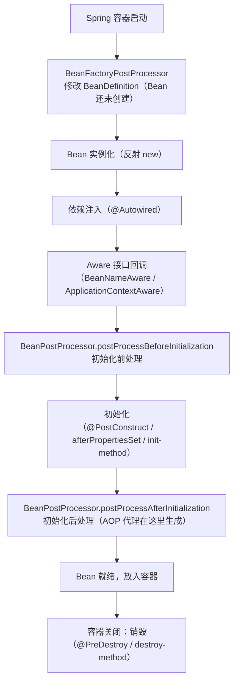

# Spring 扩展点详解

---

## 1. 为什么需要扩展点？

Spring 的核心设计原则是**开闭原则**：对扩展开放，对修改关闭。Spring 提供了大量扩展点，让开发者在不修改框架源码的情况下，介入 Bean 的创建、容器的初始化等各个阶段。



---

## 2. BeanFactoryPostProcessor —— 修改 Bean 定义

**时机**：所有 BeanDefinition 加载完成后，Bean 实例化之前。

**用途**：修改 Bean 的定义信息（如修改属性值、替换占位符）。

```java
@Component
public class MyBeanFactoryPostProcessor implements BeanFactoryPostProcessor {

    @Override
    public void postProcessBeanFactory(ConfigurableListableBeanFactory beanFactory)
            throws BeansException {
        // 获取某个 Bean 的定义
        BeanDefinition bd = beanFactory.getBeanDefinition("userService");
        // 修改 Bean 的属性值
        bd.getPropertyValues().add("maxRetry", 3);
        System.out.println("BeanFactoryPostProcessor 执行：修改了 userService 的定义");
    }
}
```

**典型应用**：`PropertySourcesPlaceholderConfigurer` —— 解析 `${xxx}` 占位符，将配置文件中的值替换到 BeanDefinition 中。

---

## 3. BeanDefinitionRegistryPostProcessor —— 动态注册 Bean

比 `BeanFactoryPostProcessor` 更早执行，可以动态向容器中注册新的 BeanDefinition：

```java
@Component
public class DynamicBeanRegistrar implements BeanDefinitionRegistryPostProcessor {

    @Override
    public void postProcessBeanDefinitionRegistry(BeanDefinitionRegistry registry)
            throws BeansException {
        // 动态注册一个 Bean
        RootBeanDefinition bd = new RootBeanDefinition(DynamicService.class);
        registry.registerBeanDefinition("dynamicService", bd);
    }

    @Override
    public void postProcessBeanFactory(ConfigurableListableBeanFactory beanFactory)
            throws BeansException {
        // 可以留空
    }
}
```

**典型应用**：MyBatis 的 `MapperScannerConfigurer` —— 扫描 Mapper 接口，动态注册为 Spring Bean。

---

## 4. BeanPostProcessor —— 干预 Bean 初始化

**时机**：每个 Bean 初始化前后都会调用，是最常用的扩展点。

```java
@Component
public class MyBeanPostProcessor implements BeanPostProcessor {

    // 初始化之前调用（@PostConstruct 之前）
    @Override
    public Object postProcessBeforeInitialization(Object bean, String beanName)
            throws BeansException {
        if (bean instanceof UserService) {
            System.out.println("UserService 初始化前处理");
        }
        return bean;  // 必须返回 bean（可以返回包装后的对象）
    }

    // 初始化之后调用（@PostConstruct 之后）—— AOP 代理在这里生成！
    @Override
    public Object postProcessAfterInitialization(Object bean, String beanName)
            throws BeansException {
        if (bean instanceof UserService) {
            System.out.println("UserService 初始化后处理，可以返回代理对象");
        }
        return bean;
    }
}
```

**典型应用**：
- `AbstractAutoProxyCreator`：AOP 代理生成（`postProcessAfterInitialization` 中创建代理）
- `AutowiredAnnotationBeanPostProcessor`：处理 `@Autowired` 注解注入
- `CommonAnnotationBeanPostProcessor`：处理 `@PostConstruct`、`@PreDestroy`

---

## 5. Aware 接口 —— 获取容器内部对象

实现 Aware 接口，Spring 会在 Bean 初始化时自动注入对应的容器对象：

```java
@Component
public class SpringContextHolder implements ApplicationContextAware, BeanNameAware {

    private static ApplicationContext applicationContext;
    private String beanName;

    // Spring 会自动调用，注入 ApplicationContext
    @Override
    public void setApplicationContext(ApplicationContext ctx) throws BeansException {
        SpringContextHolder.applicationContext = ctx;
    }

    // Spring 会自动调用，注入 Bean 的名称
    @Override
    public void setBeanName(String name) {
        this.beanName = name;
    }

    // 提供静态方法，方便在非 Spring 管理的类中获取 Bean
    public static <T> T getBean(Class<T> clazz) {
        return applicationContext.getBean(clazz);
    }

    public static Object getBean(String name) {
        return applicationContext.getBean(name);
    }
}
```

**常用 Aware 接口**：

| 接口 | 注入内容 |
|------|---------|
| `ApplicationContextAware` | `ApplicationContext` 容器本身 |
| `BeanNameAware` | 当前 Bean 在容器中的名称 |
| `BeanFactoryAware` | `BeanFactory` |
| `EnvironmentAware` | `Environment`（配置属性） |
| `ResourceLoaderAware` | `ResourceLoader`（资源加载器） |

---

## 6. ApplicationListener —— 监听容器事件

Spring 内置了事件发布机制，可以监听容器生命周期事件或自定义业务事件：

```java
// 监听容器启动完成事件
@Component
public class AppStartedListener implements ApplicationListener<ContextRefreshedEvent> {

    @Override
    public void onApplicationEvent(ContextRefreshedEvent event) {
        System.out.println("容器启动完成，执行初始化任务...");
        // 预热缓存、加载配置等
    }
}

// 自定义业务事件
public class OrderCreatedEvent extends ApplicationEvent {
    private final Long orderId;

    public OrderCreatedEvent(Object source, Long orderId) {
        super(source);
        this.orderId = orderId;
    }
}

// 发布事件
@Service
public class OrderService {
    @Autowired
    private ApplicationEventPublisher eventPublisher;

    public void createOrder(Order order) {
        // 保存订单...
        // 发布事件，解耦后续处理（发通知、更新统计等）
        eventPublisher.publishEvent(new OrderCreatedEvent(this, order.getId()));
    }
}

// 监听自定义事件（推荐用注解方式）
@Component
public class OrderEventHandler {

    @EventListener
    public void handleOrderCreated(OrderCreatedEvent event) {
        System.out.println("订单创建，发送通知: orderId=" + event.getOrderId());
    }

    @EventListener
    @Async  // 异步处理，不阻塞主流程
    public void handleOrderCreatedAsync(OrderCreatedEvent event) {
        System.out.println("异步更新统计数据: orderId=" + event.getOrderId());
    }
}
```

**内置事件**：

| 事件 | 触发时机 |
|------|---------|
| `ContextRefreshedEvent` | 容器初始化/刷新完成 |
| `ContextStartedEvent` | 容器调用 `start()` 时 |
| `ContextStoppedEvent` | 容器调用 `stop()` 时 |
| `ContextClosedEvent` | 容器关闭时（优雅停机） |

---

## 7. ImportBeanDefinitionRegistrar —— 注解驱动注册 Bean

配合 `@Import` 使用，实现注解驱动的 Bean 批量注册（MyBatis `@MapperScan`、Feign `@EnableFeignClients` 的底层原理）：

```java
// 自定义注解
@Target(ElementType.TYPE)
@Retention(RetentionPolicy.RUNTIME)
@Import(MyServiceRegistrar.class)  // 触发注册器
public @interface EnableMyService {
    String[] basePackages() default {};
}

// 注册器实现
public class MyServiceRegistrar implements ImportBeanDefinitionRegistrar {

    @Override
    public void registerBeanDefinitions(AnnotationMetadata metadata,
                                        BeanDefinitionRegistry registry) {
        // 获取注解属性
        Map<String, Object> attrs = metadata
            .getAnnotationAttributes(EnableMyService.class.getName());
        String[] packages = (String[]) attrs.get("basePackages");

        // 扫描指定包，注册 Bean
        for (String pkg : packages) {
            // 扫描 pkg 下的类，注册为 BeanDefinition
            // ...
        }
    }
}

// 使用
@SpringBootApplication
@EnableMyService(basePackages = "com.example.service")
public class Application { ... }
```

---

## 8. 扩展点执行顺序总结

```
容器启动
  ↓
① BeanDefinitionRegistryPostProcessor.postProcessBeanDefinitionRegistry()  // 注册 BeanDefinition
  ↓
② BeanFactoryPostProcessor.postProcessBeanFactory()  // 修改 BeanDefinition
  ↓
③ Bean 实例化（反射 new）
  ↓
④ 依赖注入（@Autowired）
  ↓
⑤ BeanNameAware / BeanFactoryAware / ApplicationContextAware 回调
  ↓
⑥ BeanPostProcessor.postProcessBeforeInitialization()
  ↓
⑦ @PostConstruct → afterPropertiesSet() → init-method
  ↓
⑧ BeanPostProcessor.postProcessAfterInitialization()  ← AOP 代理在这里生成
  ↓
Bean 就绪，放入单例池
```

---

## 9. 常见问题

**Q1：BeanFactoryPostProcessor 和 BeanPostProcessor 的区别？**
> `BeanFactoryPostProcessor` 在 Bean **实例化之前**执行，操作的是 `BeanDefinition`（Bean 的元数据），可以修改 Bean 的配置；`BeanPostProcessor` 在 Bean **初始化前后**执行，操作的是已经实例化的 Bean 对象，可以对 Bean 进行包装（如生成 AOP 代理）。

**Q2：AOP 代理是在哪里生成的？**
> 在 `BeanPostProcessor.postProcessAfterInitialization()` 中，具体是 `AbstractAutoProxyCreator` 这个 `BeanPostProcessor` 的实现类，在 Bean 初始化完成后判断是否需要创建代理，如果需要则返回代理对象替换原始 Bean。

**Q3：如何在非 Spring 管理的类中获取 Spring Bean？**
> 实现 `ApplicationContextAware` 接口，将 `ApplicationContext` 保存为静态变量，提供静态方法 `getBean()`，即可在任意地方获取 Spring Bean。

**Q4：Spring 事件机制有什么用？**
> 实现业务解耦。例如订单创建后需要发通知、更新统计、记录日志，如果都写在 `createOrder` 方法里会很臃肿。通过发布 `OrderCreatedEvent`，各个监听器独立处理，互不耦合，还可以加 `@Async` 实现异步处理。