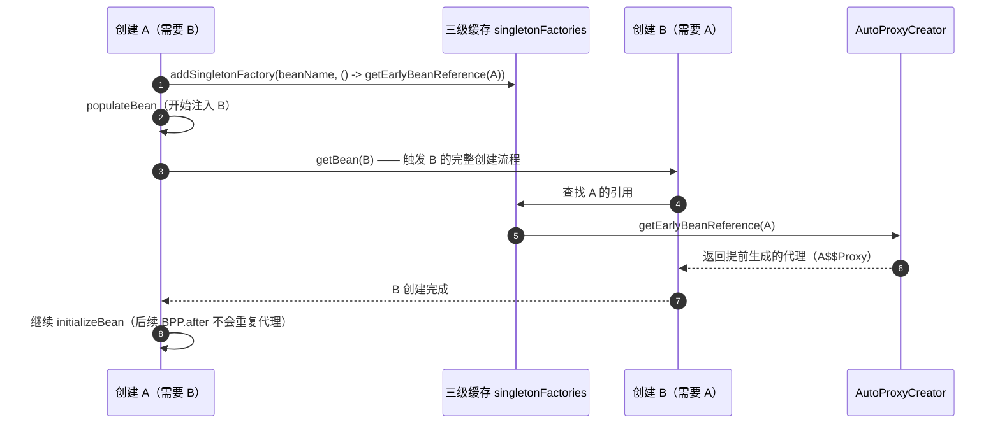
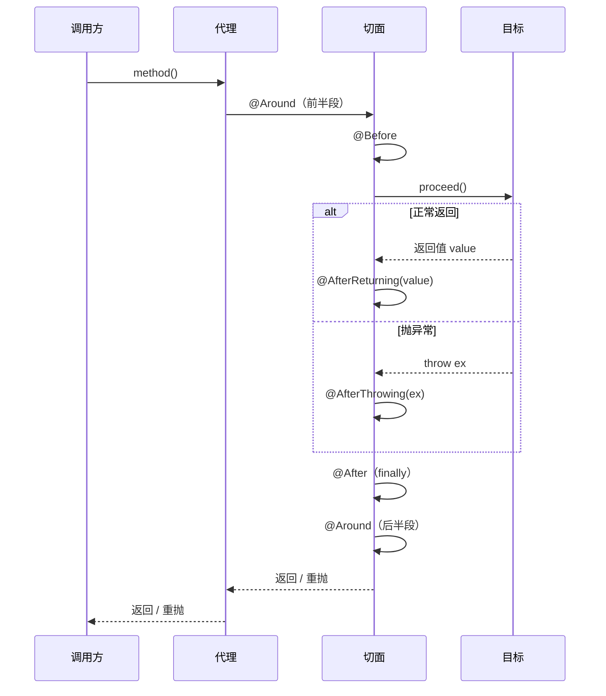
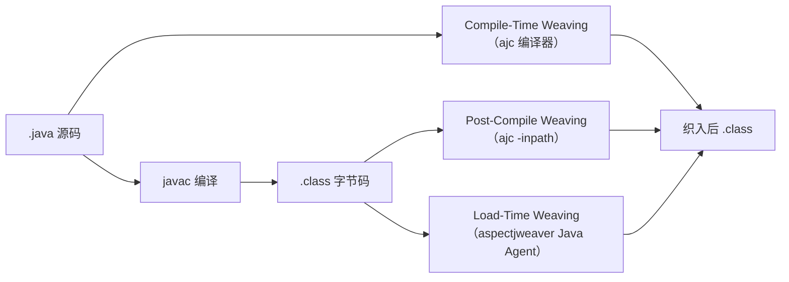
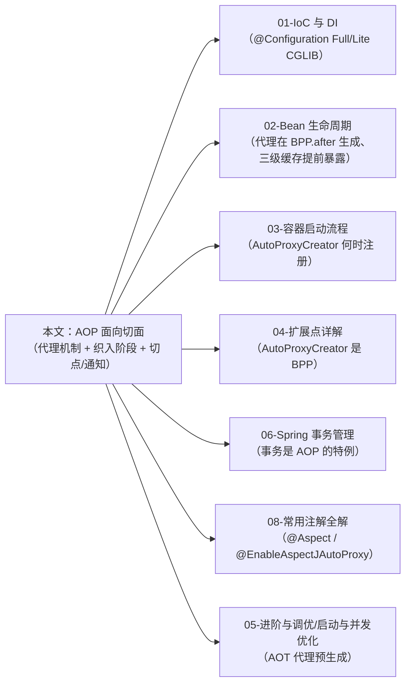

# AOP —— 面向切面编程

> **一句话记忆口诀**：
>
> Spring AOP 是**运行期的动态代理**——`AbstractAutoProxyCreator` 作为 `BeanPostProcessor` 在 Bean 初始化后根据 `Advisor` 链生成代理（JDK 或 CGLIB），业务调用经过代理才被增强；
> 绕过代理（同类自调用 / 非 Spring 管理对象 / 非 `public` 方法）= 绕过所有切面；
> Spring Boot 2 起默认 CGLIB（`spring.aop.proxy-target-class=true`）；
> AspectJ 是**编译期/加载期织入**，能力覆盖构造器、字段、`private` 方法，Spring AOP 只是它的运行期子集；
> AOT / GraalVM 下 CGLIB 运行期生成失效，代理子类改为构建期预生成。

> 📖 **边界声明**：本文只讲"**AOP 本身**"的机制、源码、陷阱。
>
> - 事务失效的完整 5 种场景（异常被吞、异常类型不匹配、REQUIRES_NEW 传播等）→ [Spring 事务管理](@spring-核心基础-Spring事务管理)
> - `@Configuration` Full/Lite 模式下 CGLIB 的使用 → [IoC 与 DI §7.2](@spring-核心基础-IoC与DI)
> - `AbstractAutoProxyCreator` 作为 BPP 的契约与三级缓存提前暴露 → [Bean 生命周期与循环依赖](@spring-核心基础-Bean生命周期与循环依赖) / [扩展点详解 §4](@spring-核心基础-Spring扩展点详解)
> - 注解属性类型、`@Retention` / `@Target` 的含义 → [注解（Annotation）](@java-注解Annotation)

---

## 1. 引入：AOP 在 Spring 中的定位

高级开发者必须对 AOP 给出精确答案：

| 维度 | 要回答的问题 |
| :-- | :-- |
| **代理是谁造的** | 哪个 `BeanPostProcessor` 生成代理？在哪一步？循环依赖下怎么办？ |
| **代理怎么造** | JDK / CGLIB / AspectJ 字节码织入的选型规则是什么？AOT 下怎么变？ |
| **怎么被调用** | `Advisor` → `MethodInterceptor` 链是如何串起来的？五种通知的执行时序？ |
| **哪里会失效** | 自调用、`private`、`final`、非 Spring Bean —— 根因是什么？有没有绕过方案？ |

本文按"**代理机制 → 织入时机 → 切点/通知 → 代理创建源码 → 失效诊断 → AspectJ 对比 → AOT → 面试题**"的顺序展开。

---

## 2. 类比：AOP = 动态代理 + 切面元数据

```txt
业务方法调用链（AOP 视角）

caller ─▶ 代理对象（Proxy）                            ← BeanFactory.getBean 返回的其实是它
           │
           ├─ 前置拦截器链（MethodInterceptor[]）       ← 由 Advisor 解析生成
           │    ├─ ExposeInvocationInterceptor         ← 为 AopContext.currentProxy 铺路
           │    ├─ TransactionInterceptor              ← @Transactional 实际由它织入
           │    ├─ CacheInterceptor                    ← @Cacheable
           │    └─ AspectJAroundAdvice                 ← 你自己写的 @Around
           │
           ▼
        target（原始 Bean）                             ← this 在方法内部指向的就是它
```

**关键直觉**：你手上拿到的引用是**代理对象**，`this.xxx()` 在方法内部执行时却是**原始对象**——这道"代理面 / 目标面"的分界，是理解 AOP 一切失效场景的根。

---

## 3. 两种代理实现：JDK 与 CGLIB

### 3.1 技术差异对照表

| 对比项 | JDK 动态代理 | CGLIB |
| :-- | :-- | :-- |
| 前置条件 | 目标类**必须实现接口** | 目标类**不能是 `final`**，方法不能是 `final` / `private` / `static` |
| 生成方式 | JDK 内置 `Proxy.newProxyInstance`，反射调用 | ASM 字节码生成目标类的**子类**（运行期） |
| 拦截入口 | `InvocationHandler.invoke` | `MethodInterceptor.intercept`（继承自 `net.sf.cglib.proxy`，Spring 重新打包为 `org.springframework.cglib`） |
| 能代理的方法 | **仅接口声明的方法** | 目标类所有**非 final 的 public/protected/package-private 方法** |
| 构造器调用 | 代理类构造时**不调用**目标构造器 | 代理类是子类，实例化时**会调用**一次父类构造器（`objenesis` 可绕过） |
| 性能 | JDK 8+ 之后与 CGLIB 相近；创建略快 | 创建慢（需要生成字节码），调用略快 |
| Spring Boot 默认 | Spring Boot 2.x 之前默认 | **Spring Boot 2.x 起默认 CGLIB** |

### 3.2 为什么 Boot 2 起默认 CGLIB

根本原因是**覆盖面**：大量业务 Service 直接用 `@Service` 而不写接口，JDK 代理无法处理——强制要求接口会让"AOP 不生效"问题在项目中反复出现。CGLIB 通过生成子类覆盖面更广，"默认能用"才是最重要的工程属性。

### 3.3 三个控制开关

```java
// 全局开关（application.yml）
spring:
  aop:
    proxy-target-class: true   // Boot 2 起默认 true（强制 CGLIB）
                                // 改为 false：有接口用 JDK，没接口用 CGLIB

// 注解级开关（通常自动配置已启用，极少手动写）
@Configuration
@EnableAspectJAutoProxy(
    proxyTargetClass = true,   // 同上
    exposeProxy = true         // ⭐ 把代理暴露到 ThreadLocal，供 AopContext.currentProxy() 获取
)
public class AopConfig {}
```

!!! tip "`exposeProxy = true` 的价值"
    打开后，代理对象会在方法调用期间被压入 `ThreadLocal`，业务代码中可以通过 `((Foo) AopContext.currentProxy()).bar()` 主动走代理——这是"同类自调用 AOP 失效"最轻量的绕过方式，无需自注入（见 §7.3）。

---

## 4. 代理的织入阶段：从 BPP 视角看代理何时生成

### 4.1 Spring AOP 的织入发生在**运行期** Bean 的**初始化完成后**

AOP 代理的生成器是一个 `BeanPostProcessor`——`AnnotationAwareAspectJAutoProxyCreator`（继承链：`AbstractAutoProxyCreator` ← `AbstractAdvisorAutoProxyCreator` ← `AspectJAwareAdvisorAutoProxyCreator` ← `AnnotationAwareAspectJAutoProxyCreator`）。它同时实现了：

| 接口 | 回调时机 | 职责 |
| :-- | :-- | :-- |
| `BeanPostProcessor#postProcessAfterInitialization` | 每个 Bean 初始化**之后** | **常规代理生成点**：遍历所有 `Advisor`，与当前 Bean 匹配则包装为代理 |
| `SmartInstantiationAwareBeanPostProcessor#getEarlyBeanReference` | 三级缓存查询时 | **提前代理生成点**：循环依赖中另一方需要引用时，这里提前生成代理 |
| `InstantiationAwareBeanPostProcessor#postProcessBeforeInstantiation` | Bean 实例化**之前** | 自定义目标源（`TargetSource`）时的短路路径，99% 不触发 |

### 4.2 在 Bean 生命周期里的精确位置

```txt
doCreateBean()
  ├─ createBeanInstance                                    ← 反射调构造器
  ├─ populateBean                                          ← @Autowired / @Resource 注入
  └─ initializeBean
       ├─ invokeAwareMethods
       ├─ applyBeanPostProcessorsBeforeInitialization      ← @PostConstruct 在此触发
       ├─ invokeInitMethods
       └─ applyBeanPostProcessorsAfterInitialization       ⭐ AOP 代理在此生成
            └─ AbstractAutoProxyCreator.wrapIfNecessary    
                  └─ 匹配 Advisor → ProxyFactory.getProxy  → JDK / CGLIB
```

> 📖 完整 8 步生命周期与三级缓存时序见 [Bean 生命周期与循环依赖](@spring-核心基础-Bean生命周期与循环依赖)，本文只讲"代理生成这一步"的内部。

### 4.3 循环依赖下的提前代理



!!! warning "循环依赖下的"双胞胎代理"风险"
    若自定义 BPP 修改了循环依赖中 Bean 的引用，可能导致"A 的代理"和"A 本身"是两个对象——注入给 B 的是代理，而 A 的 `singletonObjects` 里是原始对象。Spring 通过 `earlyProxyReferences` 缓存来保证**同一 Bean 的 `getEarlyBeanReference` 和后续 `postProcessAfterInitialization` 返回同一个代理**。详见 [Bean 生命周期 §5](@spring-核心基础-Bean生命周期与循环依赖)。

### 4.4 `@EnableAspectJAutoProxy` 做了什么

它通过 `AspectJAutoProxyRegistrar`（一个 `ImportBeanDefinitionRegistrar`）向容器注册 `AnnotationAwareAspectJAutoProxyCreator` 这个 BPP。Spring Boot 通过 `AopAutoConfiguration` 自动启用，普通项目无需手动写。

---

## 5. 切点（Pointcut）：表达式选型

切点决定"**哪些连接点要织入增强**"，Spring AOP 支持的主流切点指示符：

| 指示符 | 匹配对象 | 典型用法 |
| :-- | :-- | :-- |
| `execution(...)` | 方法签名（最常用） | `execution(* com.example.service..*.*(..))` |
| `within(...)` | 类型（比 `execution` 更快，不看方法签名） | `within(com.example.service..*)` |
| `@annotation(...)` | 方法上的注解 | `@annotation(com.example.Auditable)` |
| `@within(...)` | 类上的注解（该类所有方法） | `@within(org.springframework.stereotype.Service)` |
| `@target(...)` | 目标对象运行时的类注解（反射） | 与 `@within` 相似，但运行时判定 |
| `args(...)` / `@args(...)` | 参数类型 / 参数注解 | `args(String, ..)` / `@args(Sensitive)` |
| `this(...)` / `target(...)` | **代理对象 / 目标对象**的类型 | `this(X)` 在代理是 X 类型时匹配；`target(X)` 在目标是 X 时匹配 |
| `bean(...)` | beanName 匹配（Spring AOP 独有） | `bean(*Service)` |

### 5.1 `execution` 完整语法

```txt
execution( [修饰符] 返回类型 [声明类型.]方法名(参数列表) [throws 异常] )
          ↑可省    ↑必填   ↑可省        ↑必填  ↑必填            ↑可省

execution(public * com.example.service..*Service.*(..))
         │      │ │                    │      │  │
         │      │ │                    │      │  └─ (..) 任意参数
         │      │ │                    │      └─── * 任意方法名
         │      │ │                    └────────── *Service 以 Service 结尾的类
         │      │ └─────────────────────────────── 任意子包
         │      └───────────────────────────────── * 任意返回类型
         └──────────────────────────────────────── public 修饰符
```

### 5.2 切点组合

```java
@Pointcut("within(com.example.service..*)")
public void inService() {}

@Pointcut("@annotation(com.example.Auditable)")
public void audited() {}

@Pointcut("inService() && audited()")    // && || ! 组合
public void auditInService() {}

@Before("auditInService()")
public void before() { /* ... */ }
```

### 5.3 `this` 与 `target` 的区别（高频面试）

| 表达式 | 匹配语义 | 典型场景 |
| :-- | :-- | :-- |
| `this(X)` | **代理对象** instanceof X | CGLIB 代理 target 和 this 都是 X；JDK 代理 this 是接口代理类，target 才是实现类 |
| `target(X)` | **目标对象** instanceof X | 通常用这个——跨 JDK/CGLIB 表现一致 |

> **口诀**：不确定就用 `target`，它看的是真实目标类型；用 `this` 容易在 JDK 代理下匹配不到。

---

## 6. 通知（Advice）：五种类型与执行时序

### 6.1 五种通知

| 通知 | 注解 | 触发时机 | 能否访问返回值/异常 |
| :-- | :-- | :-- | :-- |
| 前置通知 | `@Before` | 方法执行前 | ❌ |
| 后置通知（return） | `@AfterReturning` | 方法正常返回后 | ✅ 返回值（`returning`） |
| 后置通知（throw） | `@AfterThrowing` | 方法抛异常后 | ✅ 异常（`throwing`） |
| 最终通知 | `@After` | 方法结束后（无论成功失败，类似 `finally`） | ❌ |
| 环绕通知 | `@Around` | 包裹整个方法（能力最强） | ✅ 通过 `ProceedingJoinPoint` 控制 |

### 6.2 单切面下五种通知的执行时序



> **记忆口诀**：Around 外壳包 Before，Before → proceed → AfterReturning 或 AfterThrowing → After（finally）→ Around 后半段收尾。

### 6.3 多切面执行顺序

多个切面作用于同一连接点时，按 `@Order`（或实现 `Ordered` 接口）决定顺序，数字越小优先级越高。环绕通知呈**栈式嵌套**：

```txt
Order=1 的切面 @Around ──▶ Order=2 的切面 @Around ──▶ 目标方法
                 ▲                        ▲
                 └──── Order=1 收尾 ◀──── Order=2 收尾
```

同一个切面内多个通知执行顺序固定为：`@Around(前) → @Before → 目标 → @AfterReturning/AfterThrowing → @After → @Around(后)`。

!!! warning "`@Order` 控制的是切面（`@Aspect` 类）之间的顺序，不是同类内通知方法的顺序"
    同类内 `@Before` 有多个时顺序不保证，靠源码里的字节码顺序或反射返回顺序。需要严格顺序就拆成多个切面分别加 `@Order`。

### 6.4 `ProceedingJoinPoint` vs `JoinPoint`

- `JoinPoint`：所有非 `@Around` 通知的参数，只能读信息（方法签名、参数）
- `ProceedingJoinPoint`：`JoinPoint` 的子接口，**仅 `@Around` 可用**，多一个 `proceed()` 方法——决定是否放行、如何放行（是否修改参数）

```java
@Around("@annotation(retry)")
public Object around(ProceedingJoinPoint pjp, Retry retry) throws Throwable {
    int times = retry.times();
    Throwable last = null;
    for (int i = 0; i <= times; i++) {
        try {
            return pjp.proceed();                      // 放行目标方法
        } catch (Throwable t) {
            last = t;
        }
    }
    throw last;
}
```

---

## 7. 代理不生效的四类失效（源码级根因）

### 7.1 同类自调用（最高频）

```java
@Service
public class OrderService {

    public void createOrder() {
        this.sendNotification();   // ❌ this 指向目标对象，绕过代理拦截器链
    }

    @Transactional
    public void sendNotification() { /* ... */ }
}
```

**根因**：`BeanFactory.getBean("orderService")` 返回的是代理对象，调用方持有"代理"引用；但方法体内部 `this` 指向 `ProxyFactory.setTarget(target)` 那个 target——Spring 不改写目标类的字节码，`this` 没法跨域。

**三种规避方案**：

| 方案 | 代码 | 评价 |
| :-- | :-- | :-- |
| 自注入（推荐） | `@Autowired private OrderService self; self.sendNotification();` | 拿到的就是代理；Spring 4.3+ 允许自依赖 |
| 暴露代理到 ThreadLocal | `((OrderService) AopContext.currentProxy()).sendNotification()` | 配合 `@EnableAspectJAutoProxy(exposeProxy=true)`；无需多一个字段 |
| 设计上拆分 | 把 `sendNotification` 移到独立的 `NotificationService` | 最根本——消除自调用本身 |

### 7.2 `private` / `final` / `static` 方法

| 方法类型 | JDK 代理 | CGLIB 代理 |
| :-- | :-- | :-- |
| `public` | ✅ | ✅ |
| `protected` / 包私有 | ❌（接口无此方法） | ✅ |
| `private` | ❌ | ❌（子类看不见 `private`） |
| `final` | ❌ | ❌（子类不能重写） |
| `static` | ❌ | ❌（方法不属于实例） |

**根因**：代理无法"拦截"到不能重写的方法，调用走向目标类本身。

### 7.3 类未被 Spring 管理

手动 `new OrderService()` 出来的对象没有经过 `AutoProxyCreator`，再写 `@Transactional` / `@Cacheable` 也无效。`@Configurable` + AspectJ LTW 可解决（Spring AOP 无能为力）。

### 7.4 切点表达式错位

| 错误 | 表现 |
| :-- | :-- |
| `execution(* com.example.*.*(..))` 漏写子包 | 嵌套包的 Service 匹配不到 |
| `this(X)` 在 JDK 代理下写了实现类 | 匹配不到（代理是接口代理类） |
| `@annotation` 只匹配方法注解，写成类注解时 | 用 `@within` |

**排查手段**：Spring 5.1+ 开启 `org.springframework.aop` DEBUG 日志，可以看到 `AnnotationAwareAspectJAutoProxyCreator` 为哪些 Bean 创建了代理、为什么没创建。

---

## 8. Spring AOP 与 AspectJ 的关系

很多资料把两者对立，其实 Spring AOP **借用了 AspectJ 的注解语法**，但底层实现完全不同：

| 维度 | Spring AOP | AspectJ |
| :-- | :-- | :-- |
| **定位** | AOP 的"运行期代理子集"，够用就好 | AOP 的"完整标准"，能力全集 |
| **织入时机** | 运行期（JDK/CGLIB 代理） | 编译期（Compile-Time Weaving）/ 编译后（Post-Compile Weaving）/ 加载期（Load-Time Weaving） |
| **织入工具** | 运行期 ASM/JDK 反射 | `ajc` 编译器 / `aspectjweaver.jar` 类加载代理 |
| **能拦截的连接点** | Spring Bean 的 **public 方法** | 构造器、字段读写、静态块、`private` 方法、本地调用、第三方 class |
| **性能** | 每次调用都走拦截器链 | 字节码直接内联增强，调用零额外开销 |
| **使用门槛** | 加注解即用 | 需要 `ajc` 或 Java Agent |
| **注解语法** | 用的是 `@Aspect` / `@Before` / `@Around`（来自 `org.aspectj.lang.annotation`）| 原生支持 |

### 8.1 AspectJ 三种织入时机



| 时机 | 优点 | 缺点 |
| :-- | :-- | :-- |
| Compile-Time | 零运行期开销 | 需要替换编译器 |
| Post-Compile | 能织入第三方 jar | 流程复杂 |
| Load-Time | 无需改构建，部署时加 `-javaagent` | 启动期有字节码扫描开销 |

### 8.2 与 Spring 的整合：`@EnableLoadTimeWeaving`

```java
@Configuration
@EnableLoadTimeWeaving(aspectjWeaving = AspectJWeaving.ENABLED)
public class AspectJConfig {}
```

启用后，Spring 容器内的 Bean 和非 Bean 对象都能被 AspectJ 增强——这是绕过"Spring AOP 只能代理 Bean 的 public 方法"的终极方案。典型场景：对 `@Configurable` 标注的 DO（由 `new` 创建）注入依赖。

---

## 9. AOT / GraalVM 原生镜像下的 AOP

Spring 6 / Boot 3 引入 AOT 后，代理生成机制发生了结构性变化：

| 项目 | 传统 JIT 模式 | AOT / 原生镜像 |
| :-- | :-- | :-- |
| JDK 代理 | 运行期 `Proxy.newProxyInstance` | **需要 `RuntimeHints.proxies()` 注册** |
| CGLIB 代理 | 运行期 ASM 生成子类 | ❌ 运行期不允许生成字节码——Spring AOT 插件**在构建期预生成代理子类**作为静态类 |
| `@Aspect` 切面注册 | 运行期扫描 `@Aspect` | 构建期扫描，切面信息固化到 `ApplicationContextInitializer` |
| 切点匹配 | 运行期表达式解析 | 构建期解析一次，运行期直接用结果 |
| `@EnableLoadTimeWeaving` | 正常 | 🔴 **完全失效**——原生镜像无类加载器钩子 |

### 9.1 AOT 友好的 AOP 写法

1. **不要在 Bean 上动态换 target**（`TargetSource` 动态切换场景慎用）——AOT 构建期要能静态确定代理的目标类
2. **反射访问代理方法需注册 hints**：`@RegisterReflectionForBinding` 或手动 `RuntimeHintsRegistrar`
3. **避免 `AopContext.currentProxy()` + 反射**：运行期绕过代理进入目标对象的操作，原生镜像下可能因方法签名未注册 hint 而抛 `MissingReflectionRegistrationError`

> 📖 `RuntimeHints` 注册的完整流程见 [启动与并发优化 AOT 章节](@spring-进阶与调优-启动与并发优化)。

---

## 10. AOP 核心术语 → 源码对照

| 术语 | Spring 中对应的类/接口 | 职责 |
| :-- | :-- | :-- |
| **Aspect**（切面） | `@Aspect` 标注的类 | 容器保存 `BeanFactoryAspectInstanceFactory` 来延迟取 Bean |
| **Pointcut**（切点） | `org.springframework.aop.Pointcut` | `ClassFilter` + `MethodMatcher`，前者决定类是否匹配，后者决定方法是否匹配 |
| **Advice**（通知） | `org.aopalliance.aop.Advice`（AOP 联盟规范） | 五种通知实际包装成 `MethodInterceptor`：`MethodBeforeAdviceInterceptor` / `AspectJAroundAdvice` / ... |
| **Advisor**（顾问） | `org.springframework.aop.Advisor` | `Pointcut + Advice` 的组合，容器里每个 `@Before` 方法都会被封装成一个 `InstantiationModelAwarePointcutAdvisor` |
| **JoinPoint**（连接点） | `org.aspectj.lang.JoinPoint` / `ProceedingJoinPoint` | 通知方法的入参，携带签名、参数、target |
| **Weaving**（织入） | Spring AOP：`ProxyFactory.getProxy()`；AspectJ：`ajc` / `aspectjweaver` | 把 Advisor 链挂到代理对象上 |
| **AutoProxyCreator** | `AbstractAutoProxyCreator` 子类 | 织入的**发动机**——一个 BPP |

---

## 11. 高频面试题（源码级标准答案）

**Q1：AOP 代理是在 Bean 生命周期的哪一步创建的？**

> 常规路径在 `AbstractAutowireCapableBeanFactory.initializeBean` 的最后一步 `applyBeanPostProcessorsAfterInitialization` 里，由 `AbstractAutoProxyCreator.postProcessAfterInitialization` → `wrapIfNecessary` → `ProxyFactory.getProxy()` 生成。循环依赖场景下 `SmartInstantiationAwareBeanPostProcessor.getEarlyBeanReference` 会提前生成代理，并借助 `earlyProxyReferences` 缓存保证后续 after 阶段不重复包装。

**Q2：Spring AOP 和 AspectJ 的本质区别是什么？**

> Spring AOP 是**运行期动态代理**（JDK / CGLIB），只能拦截 Spring 容器中 Bean 的 **public 方法**，调用时穿过拦截器链，有额外开销；AspectJ 是**编译期 / 加载期字节码织入**，能拦截构造器、字段访问、`private` 方法、`static` 方法、本地调用，增强后的方法与原生调用零开销。Spring AOP 借用了 AspectJ 的注解语法（`@Aspect` 等），但底层运行机制完全不同。

**Q3：Spring Boot 2.x 起为什么默认 CGLIB 代理？**

> 工程上的"默认能用"考虑。JDK 代理要求目标类实现接口，而项目中大量 Service 直接用 `@Service` 不写接口，导致"AOP 不生效"频发。CGLIB 通过继承目标类生成子类（要求目标类非 `final`、方法非 `final`/`private`），覆盖面更广。通过 `spring.aop.proxy-target-class=false` 可切回"有接口用 JDK、无接口用 CGLIB"的旧行为。

**Q4：同类内部调用为什么 AOP 不生效？怎么绕过？**

> `BeanFactory.getBean` 返回代理对象，调用方的引用是代理；但方法体里的 `this` 始终指向目标对象（`ProxyFactory` 的 target），绕过了代理的拦截器链，所有增强都失效。三种绕过方案：① 自注入 `@Autowired private Self self; self.x()`；② 配合 `@EnableAspectJAutoProxy(exposeProxy=true)` 用 `AopContext.currentProxy()` 从 ThreadLocal 拿代理；③ 从设计上拆分，把被调方法移到独立 Bean。

**Q5：五种通知的执行顺序是怎样的？多切面如何排序？**

> 单切面顺序：`@Around(前) → @Before → 目标方法 → (@AfterReturning | @AfterThrowing) → @After → @Around(后)`。多切面按 `@Order` 排序，数字小的优先级高，环绕通知呈**栈式嵌套**——Order=1 外层包住 Order=2，Order=2 再包住目标。`@Order` 只控制切面（`@Aspect` 类）间顺序，不控制同一切面内通知方法顺序，需要严格顺序就拆成多个切面。

**Q6：`this(X)` 和 `target(X)` 在切点中有什么区别？**

> `this(X)` 匹配**代理对象** `instanceof X`，`target(X)` 匹配**目标对象** `instanceof X`。在 CGLIB 代理下两者结果一致（代理是子类，instanceof 原类成立）；在 JDK 代理下代理是接口代理类，`this(实现类)` 匹配不到，`target(实现类)` 正常匹配。**通用建议用 `target`**，跨代理类型表现一致。

**Q7：`AnnotationAwareAspectJAutoProxyCreator` 实现了哪些接口？各自作用？**

> 它实现了三个 BPP 接口：`InstantiationAwareBeanPostProcessor.postProcessBeforeInstantiation`（自定义 `TargetSource` 时短路，99% 不触发）、`SmartInstantiationAwareBeanPostProcessor.getEarlyBeanReference`（循环依赖下提前生成代理）、`BeanPostProcessor.postProcessAfterInitialization`（常规代理生成点）。它自己也是一个 Bean，由 `@EnableAspectJAutoProxy` 背后的 `AspectJAutoProxyRegistrar`（`ImportBeanDefinitionRegistrar`）注册到容器。

**Q8：AOT / GraalVM 原生镜像下 Spring AOP 有什么变化？**

> CGLIB 不能再在运行期生成字节码——Spring AOT 插件在**构建期**为需要代理的 Bean 预生成静态代理子类；JDK 代理需要通过 `RuntimeHints.proxies()` 注册接口列表；切面扫描与切点表达式匹配都前移到构建期，结果固化到 `ApplicationContextInitializer`。`@EnableLoadTimeWeaving` 完全失效（原生镜像无类加载钩子）。写法上需避免运行期动态切换 `TargetSource`、手动反射绕过代理等操作。

---

## 12. 章节图谱



> **一句话口诀（再述）**：AOP 靠**代理**拦截；代理由 `AbstractAutoProxyCreator` 这个 **BPP** 在初始化后生成（循环依赖走三级缓存提前生成）；选 JDK 还是 CGLIB 看 `proxy-target-class` 和目标类是否有接口；`this` 调用、`private` / `final` / `static`、非 Spring Bean 都会绕过代理；Spring AOP 是 AspectJ 的**运行期子集**，需要拦截构造器/字段/自调用就上 AspectJ LTW；AOT 下 CGLIB 改为构建期预生成，`@EnableLoadTimeWeaving` 失效。
