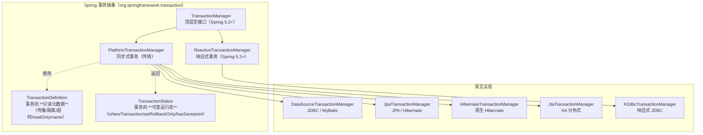
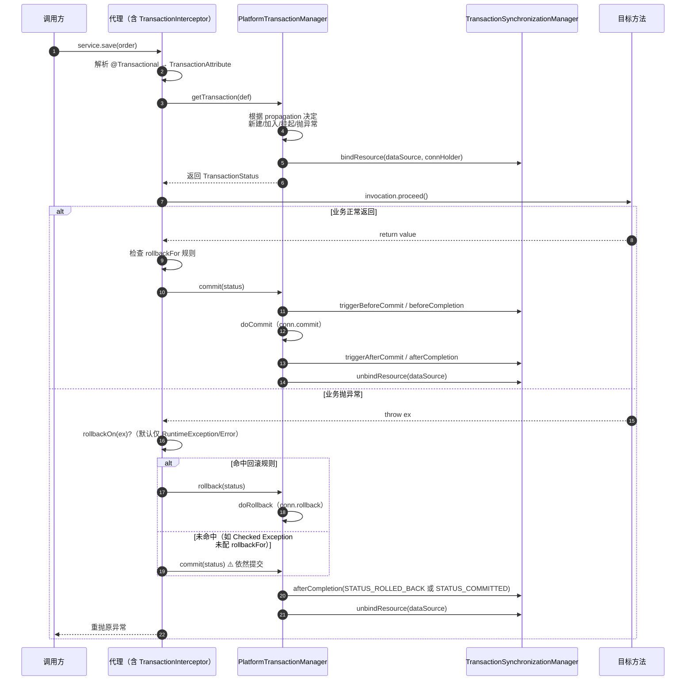
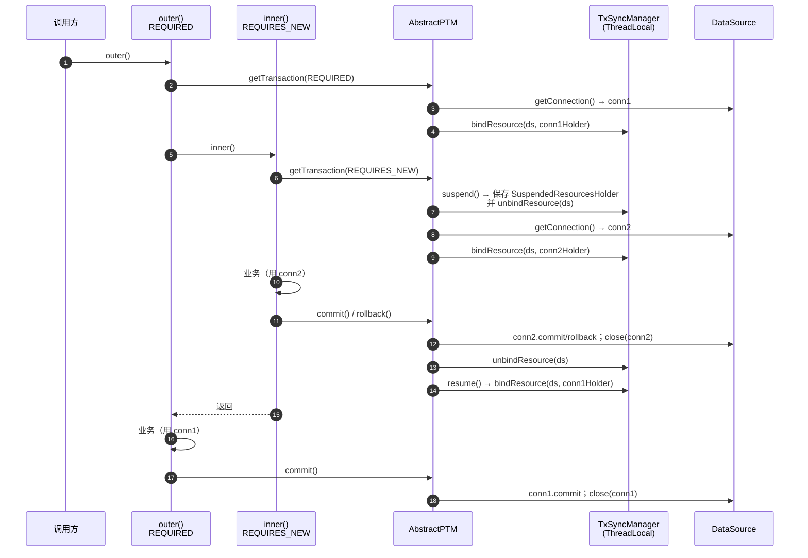
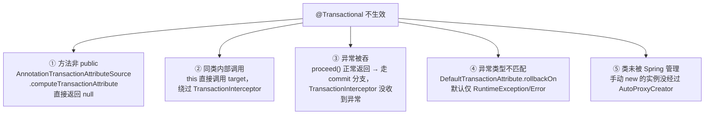
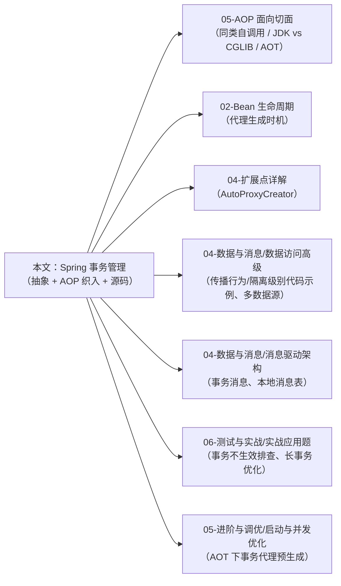

# Spring 事务管理

> **一句话记忆口诀**：
>
> `@Transactional` 是**AOP 的一个具体应用**——由 `TransactionInterceptor`（一个 `MethodInterceptor`）织入代理链，底层委托给 `PlatformTransactionManager` 的"三位一体"契约（`TransactionManager` + `TransactionDefinition` + `TransactionStatus`）；  
> 事务边界实质上是对 `TransactionSynchronizationManager` 这个 **ThreadLocal 注册表**的"绑定资源—执行业务—提交或回滚—解绑资源"四步操作；  
> 绕过代理（`this` 自调用 / 非 Spring Bean / 非 `public` 方法）= 绕过事务拦截器 = 事务不生效；  
> 默认只回滚 `RuntimeException` + `Error`，Checked Exception 必须 `rollbackFor` 显式声明；  
> Spring 6 / Boot 3 起支持响应式事务 `ReactiveTransactionManager`，AOT 下事务代理改为构建期预生成。

> 📖 **边界声明**：本文聚焦"**Spring 事务的抽象层与 AOP 织入机制**"，以下主题请见对应专题：
>
> - AOP 代理的 JDK/CGLIB 选型、同类自调用的三种规避方案、`AopContext.currentProxy()` 的用法 → [AOP 面向切面编程](05-AOP面向切面编程.md)
> - 7 种传播行为的完整代码示例、5 种隔离级别的完整代码示例、多数据源 `@EnableTransactionManagement`、HikariCP 调优 → [Spring 数据访问高级技巧](../04-数据与消息/01-Spring数据访问高级技巧.md)
> - 事务不生效的**排查流程**、`REQUIRED` vs `REQUIRES_NEW` 的**业务选型**、长事务危害与优化 → [Spring 实战应用题 Q1~Q3](../06-测试与实战/07-Spring实战应用题.md)
> - 事务消息（本地消息表、`@TransactionalEventListener` 的消息集成用法）→ [消息驱动架构深度解析](../04-数据与消息/03-消息驱动架构深度解析.md)
> - AOP 代理在 Bean 生命周期中的生成时机 → [Bean 生命周期与循环依赖](02-Bean生命周期与循环依赖.md)

---

## 1. 引入：事务在 Spring 中的定位

高级开发者必须能精确回答这些问题：

| 维度 | 要回答的问题 |
| :-- | :-- |
| **事务是谁执行的** | `@Transactional` 注解背后实际是哪个拦截器？它如何和 AOP 代理协作？ |
| **事务状态存哪** | 多个 `@Transactional` 方法嵌套调用时，连接 / 嵌套层数 / 回滚标记存在哪里？ |
| **挂起到底做了什么** | `REQUIRES_NEW` 的"挂起外层事务"具体是一个什么动作？`NESTED` 又是什么？ |
| **什么时候失效** | 自调用、`private`、异常被吞、异常类型不匹配——五种失效的**源码级根因**是什么？ |
| **响应式与 AOT** | WebFlux 下事务如何工作？GraalVM 原生镜像下事务代理还能用吗？ |

本文按"**类比 → 三位一体接口 → 声明式执行链路 → 传播行为与挂起恢复 → 隔离级别方言 → 五种失效根因 → 注解属性深解 → 编程式事务 → AOT 与响应式 → 面试题**"展开。

---

## 2. 类比：事务 = AOP 代理 + ThreadLocal 资源绑定

```txt
业务方法调用链（事务视角）

caller ─▶ 代理对象（Proxy）                                  ← BeanFactory.getBean 返回
           │
           ├─ 前置拦截器链（MethodInterceptor[]）
           │    └─ TransactionInterceptor ⭐                  ← @Transactional 的真身
           │         │
           │         ├─ getTransaction(def)                   ← 决定"新建 / 加入 / 挂起"
           │         │    └─ doBegin() → DataSource.getConnection()
           │         │       └─ conn.setAutoCommit(false)
           │         │
           │         ├─ TransactionSynchronizationManager
           │         │    ├─ ThreadLocal<Map<DataSource, ConnectionHolder>>  ← 资源绑定
           │         │    └─ ThreadLocal<TransactionInfo> 事务栈（嵌套）
           │         │
           │         ├─ invokeWithinTransaction → target 业务方法
           │         │
           │         └─ commit() / rollback()
           │              └─ afterCompletion → 同步器回调（@TransactionalEventListener）
           │
           ▼
        target（原始 Bean）                                    ← this 指向它
```

**关键直觉**：

1. **事务就是 AOP 的一个具体应用**——拿掉 `TransactionInterceptor`，`@Transactional` 就只是一个普普通通的注解。AOP 的一切失效场景（同类自调用、`private`、非 Spring Bean）**完全等价于**事务失效场景。
2. **事务状态不在注解里**——`TransactionSynchronizationManager` 用 `ThreadLocal` 保存"当前线程绑了哪些连接、嵌套了几层事务、有没有被标记 rollback-only"。**同一线程、同一数据源、同一事务内，所有 DAO 拿到的是同一个 Connection**。

---

## 3. Spring 事务抽象：三位一体的接口契约

Spring 的事务抽象由**三个接口**共同定义"什么是一个事务"：



### 3.1 三者职责对照

| 接口 | 性质 | 核心方法 | 职责 |
| :-- | :-- | :-- | :-- |
| `PlatformTransactionManager` | 发动机（策略） | `getTransaction(def)` / `commit(status)` / `rollback(status)` | **开启/提交/回滚事务**——三个方法构成事务的全部生命周期 |
| `TransactionDefinition` | 元数据（只读） | `getPropagationBehavior()` / `getIsolationLevel()` / `getTimeout()` / `isReadOnly()` / `getName()` | 描述"我想要一个**什么样的**事务"——由 `@Transactional` 注解属性填充 |
| `TransactionStatus` | 运行态（可变） | `isNewTransaction()` / `hasSavepoint()` / `setRollbackOnly()` / `isCompleted()` | 代表"**当前这个**事务的运行状态"——方法体内可通过它主动标记回滚 |

### 3.2 为什么需要"三位一体"

| 设计 | 动机 |
| :-- | :-- |
| **抽象 `TransactionManager`** | 统一 JDBC / JPA / JTA / R2DBC 的事务语义，业务代码不感知底层 |
| **分离 `Definition` 和 `Status`** | Definition 只读（可 `@Transactional` 注解直接映射），Status 可变（可在方法内 `setRollbackOnly`） |
| **顶层 `TransactionManager` 空接口** | Spring 5.2+ 为兼容 `PlatformTransactionManager` 与 `ReactiveTransactionManager` 而引入，`@Transactional` 的 `transactionManager` 属性声明为 `TransactionManager` 类型即可适配两者 |

!!! note "`AbstractPlatformTransactionManager` —— 模板方法在这里"
    所有 `PlatformTransactionManager` 实现（`DataSourceTransactionManager` / `JpaTransactionManager` 等）都继承自 `AbstractPlatformTransactionManager`。
    它用**模板方法模式**固化了"决定传播 → 挂起旧事务 → 开启新事务 → 执行 → 触发同步器 → 提交/回滚 → 恢复旧事务"的完整流程，子类只需实现 `doBegin` / `doCommit` / `doRollback` / `doSuspend` / `doResume` 五个钩子——这就是 JDBC / JPA / JTA 事务行为差异的唯一收敛点。

---

## 4. 声明式事务的执行链路（源码级剖析）

`@Transactional` 从被解析到事务提交的完整链路，涉及四个核心类：

| 组件 | 类型 | 作用 |
| :-- | :-- | :-- |
| `@EnableTransactionManagement` | 配置注解 | 通过 `TransactionManagementConfigurationSelector` 导入 `ProxyTransactionManagementConfiguration` |
| `BeanFactoryTransactionAttributeSourceAdvisor` | `Advisor` | 把 `TransactionInterceptor` 和"带有 `@Transactional` 的方法"这一切点绑定 |
| `TransactionAttributeSource`（默认 `AnnotationTransactionAttributeSource`） | 切点 + 元数据解析器 | 解析 `@Transactional` 注解属性 → 生成 `TransactionAttribute`（一种 `TransactionDefinition`） |
| `TransactionInterceptor` | `MethodInterceptor` | 事务逻辑的真身——被 AOP 织入代理链 |

### 4.1 织入的 `Advisor`

```java
// ProxyTransactionManagementConfiguration（Spring 源码）
@Bean
public BeanFactoryTransactionAttributeSourceAdvisor transactionAdvisor(
        TransactionAttributeSource source, TransactionInterceptor interceptor) {
    BeanFactoryTransactionAttributeSourceAdvisor advisor = new BeanFactoryTransactionAttributeSourceAdvisor();
    advisor.setTransactionAttributeSource(source);      // 切点：方法/类上有 @Transactional
    advisor.setAdvice(interceptor);                     // 通知：TransactionInterceptor
    return advisor;
}
```

> 📖 `Advisor` 如何被 `AbstractAutoProxyCreator` 包装成代理，详见 [AOP §4](05-AOP面向切面编程.md)——事务代理的创建时机与普通 AOP 代理**完全一致**，在 Bean 初始化最后一步（`applyBeanPostProcessorsAfterInitialization`）织入。

### 4.2 `TransactionInterceptor.invokeWithinTransaction()` 主流程



### 4.3 `TransactionSynchronizationManager` —— 事务的 ThreadLocal 注册表

这是理解事务机制的**真正的钥匙**。它本身不是一个 Bean，而是一个全静态方法的工具类，内部持有若干 `ThreadLocal`：

| `ThreadLocal` 字段 | 存储内容 | 作用 |
| :-- | :-- | :-- |
| `resources` | `Map<Object, Object>`（键为 `DataSource` / `EntityManagerFactory`，值为 `ConnectionHolder` / `EntityManagerHolder`） | **资源绑定表**——让 `DataSourceUtils.getConnection()` 能拿到当前事务的连接，而不是新连接 |
| `synchronizations` | `Set<TransactionSynchronization>` | 事务同步器集合——`beforeCommit` / `afterCommit` / `afterCompletion` 的回调挂载点 |
| `currentTransactionName` | `String` | 调试用——当前事务的名字（通常是全限定方法名） |
| `currentTransactionReadOnly` | `Boolean` | `@Transactional(readOnly=true)` 的传递开关，供 ORM 做优化（见 §6.3） |
| `actualTransactionActive` | `Boolean` | 当前线程是否真在一个事务里（区分"加入了事务"和"没事务"） |

```java
// DAO 层的典型取连接代码（MyBatis / Spring JDBC 内部一致）
Connection conn = DataSourceUtils.getConnection(dataSource);
// 内部逻辑：
//   ConnectionHolder holder = (ConnectionHolder) TransactionSynchronizationManager.getResource(dataSource);
//   if (holder != null) return holder.getConnection();   // 返回事务内连接
//   else return dataSource.getConnection();              // 新连接（非事务）
```

!!! tip "这解释了为什么同一事务内多个 Mapper 共享连接"
    任何走 `DataSourceUtils.getConnection()` 路径的组件（JdbcTemplate、MyBatis、Spring Data JPA）都会先查 `TransactionSynchronizationManager` 中绑定的 `ConnectionHolder`。**多数据源场景下事务不传递**，根因就在于：不同数据源对应 `resources` Map 中不同的 key，事务管理器只绑定了它自己那个数据源的连接。

### 4.4 `@TransactionalEventListener` 的实现原理

很多人以为它是独立的事件机制，其实它**完全建立在 `TransactionSynchronization.afterCommit` 之上**：

```java
// 简化后的核心逻辑（TransactionalApplicationListenerMethodAdapter）
@Override
public void onApplicationEvent(ApplicationEvent event) {
    if (TransactionSynchronizationManager.isSynchronizationActive()
            && TransactionSynchronizationManager.isActualTransactionActive()) {
        // ⭐ 有事务：注册同步器，延迟到提交后执行
        TransactionSynchronizationManager.registerSynchronization(
            new TransactionalApplicationListenerSynchronization(event, this));
    } else if (annotation.fallbackExecution()) {
        // 无事务且配置了 fallback：立即执行
        processEvent(event);
    }
    // 否则静默丢弃事件
}
```

| `phase` 值 | 触发时机 | 底层同步器回调 |
| :-- | :-- | :-- |
| `AFTER_COMMIT`（默认） | 事务成功提交**后** | `afterCommit()` |
| `AFTER_ROLLBACK` | 事务回滚后 | `afterCompletion(STATUS_ROLLED_BACK)` |
| `AFTER_COMPLETION` | 事务完成（无论提交/回滚） | `afterCompletion(任意状态)` |
| `BEFORE_COMMIT` | 提交前（此时还能写 DB） | `beforeCommit()` |

!!! warning "`AFTER_COMMIT` 阶段不能再写数据库到同一事务"
    此时事务已提交、连接已解绑，在监听器里再做 DB 操作会**开启新事务**（或无事务写入）。需要让"写库 + 发消息"完全原子，用 `BEFORE_COMMIT` 或 **本地消息表**（见 [消息驱动架构深度解析](../04-数据与消息/03-消息驱动架构深度解析.md)）。

---

## 5. 七种传播行为：语义、底层动作、适用场景

### 5.1 传播行为总表（加入"底层动作"列）

| 传播行为 | 当前**有**事务 | 当前**无**事务 | 底层动作（`AbstractPTM`） | 典型场景 |
| :-- | :-- | :-- | :-- | :-- |
| `REQUIRED`（默认） | 加入 | 新建 | `handleExistingTransaction` 直接返回已有 status | 绝大多数业务方法 |
| `REQUIRES_NEW` | **挂起**旧事务，新建 | 新建 | `suspend()` → `doBegin()` → 完成后 `resume()` | 必须独立提交的日志/审计 |
| `NESTED` | **SavePoint**嵌套 | 新建 | `conn.setSavepoint()`，回滚时 `rollbackToSavepoint` | 批量中局部可回滚 |
| `SUPPORTS` | 加入 | 非事务执行 | 无 `doBegin`，仅返回空 status | 查询方法 |
| `NOT_SUPPORTED` | **挂起**旧事务，非事务执行 | 非事务执行 | `suspend()`，完成后 `resume()` | 大批量导入（避免锁） |
| `MANDATORY` | 加入 | **抛 `IllegalTransactionStateException`** | 调用前检查 | 强制要求调用方开启事务 |
| `NEVER` | **抛 `IllegalTransactionStateException`** | 非事务执行 | 调用前检查 | 禁止在事务中执行的操作 |

> **为什么默认 `REQUIRED`**：绝大多数场景希望"一组操作在同一事务里、同时成败"，这正是 `REQUIRED` 的语义；每次 `REQUIRES_NEW` 都要额外获取一个连接并挂起当前事务，开销显著。

> 📖 **完整的代码示例与业务取舍**（如"日志用 REQUIRES_NEW"）见 [Spring 数据访问高级技巧 §事务传播行为深度解析](../04-数据与消息/01-Spring数据访问高级技巧.md) 与 [实战题 Q2](../06-测试与实战/07-Spring实战应用题.md)。本文只讲**底层机制**。

### 5.2 `REQUIRES_NEW` 的"挂起 / 恢复"时序



**关键结论**：

1. `REQUIRES_NEW` 在 JDBC 层**真的会再开一个 Connection**——这是它最主要的开销来源
2. 外层持有的 `conn1` 并未关闭，而是通过 `SuspendedResourcesHolder` "暂存"在栈上，内层结束后被精确恢复
3. 外层事务**看不见内层的提交数据**（除非外层隔离级别是 `READ_UNCOMMITTED`）——两个事务本质是同一数据库上的两个独立会话

### 5.3 `NESTED` 与 `REQUIRES_NEW` 的本质区别

| 维度 | `REQUIRES_NEW` | `NESTED` |
| :-- | :-- | :-- |
| JDBC 机制 | 开启**新 Connection** | 在同一 Connection 上调用 `setSavepoint()` |
| 外层回滚，内层已提交 | 内层**独立提交**，不受影响 | 外层回滚，内层一并回滚 |
| 内层回滚 | 不影响外层 | 不影响外层（`rollbackToSavepoint`） |
| 事务管理器要求 | 所有 PTM 都支持 | 仅 JDBC 原生 PTM；`JpaTransactionManager` 默认**不支持** |
| 连接开销 | 多一个 Connection | 零额外连接 |

!!! warning "`JpaTransactionManager` 不支持 `NESTED`"
    在 JPA 下使用 `NESTED` 传播行为会直接抛 `NestedTransactionNotSupportedException`。需要嵌套语义时要么切换 `DataSourceTransactionManager`，要么用 `REQUIRES_NEW` 并接受"多一个连接"的代价。

---

## 6. 隔离级别：JVM 语义 vs 数据库方言

### 6.1 五种隔离级别

| 隔离级别 | 脏读 | 不可重复读 | 幻读 | 备注 |
| :-- | :-- | :-- | :-- | :-- |
| `READ_UNCOMMITTED` | ✅ 可能 | ✅ 可能 | ✅ 可能 | 几乎不用 |
| `READ_COMMITTED` | ❌ | ✅ 可能 | ✅ 可能 | Oracle / PostgreSQL 默认 |
| `REPEATABLE_READ` | ❌ | ❌ | ⚠️ MySQL InnoDB 通过 MVCC+间隙锁消除 | MySQL InnoDB 默认 |
| `SERIALIZABLE` | ❌ | ❌ | ❌ | 性能最低，极少使用 |
| `DEFAULT` | 取决于数据库 | 取决于数据库 | 取决于数据库 | ⚠️ **@Transactional 的默认值** |

> 📖 每个级别的代码示例与并发现象演示见 [Spring 数据访问高级技巧 §事务隔离级别](../04-数据与消息/01-Spring数据访问高级技巧.md)，本文只讲**方言差异**与**`readOnly` 真实语义**。

### 6.2 `DEFAULT` 的坑：同一份代码在不同数据库行为不同

`@Transactional(isolation = DEFAULT)` **不等于** `READ_COMMITTED`，而是**下发数据库默认值**：

| 数据库 | 默认隔离级别 |
| :-- | :-- |
| MySQL InnoDB | `REPEATABLE_READ` |
| PostgreSQL | `READ_COMMITTED` |
| Oracle | `READ_COMMITTED` |
| SQL Server | `READ_COMMITTED` |
| H2（默认） | `READ_COMMITTED` |

**典型陷阱**：本地 H2 测试通过，上 MySQL 测试环境后"不可重复读"的问题神秘消失（因为 MySQL 默认更严的 REPEATABLE_READ）；但到某个用 PostgreSQL 的客户环境又出问题。**生产代码建议显式指定隔离级别**，不要依赖默认。

### 6.3 `readOnly = true` 的真实效果（远不止"优化查询"）

| 层级 | `readOnly=true` 的实际影响 | 来源 |
| :-- | :-- | :-- |
| **Spring 框架层** | 设置 `TransactionSynchronizationManager.currentTransactionReadOnly = true`（供下游查询） | `AbstractPlatformTransactionManager.prepareSynchronization` |
| **Hibernate / JPA 层** | Session 的 `FlushMode` 自动设为 `MANUAL`——**不触发自动 flush**，无 `UPDATE` 被发出 | `JpaTransactionManager.prepareTransaction` |
| **JDBC 层** | 调用 `conn.setReadOnly(true)`——驱动可据此**选择从库**、禁写、减少 undo log | `DataSourceTransactionManager.doBegin` |
| **连接池层（可选）** | 部分读写分离中间件（如 Sharding-JDBC）根据 `conn.isReadOnly()` **路由到从库** | 第三方实现 |

!!! note "`readOnly=true` 不等于"强制只读""
    它是一个**优化提示**，不同层尽力配合：
    - Hibernate 会跳过脏检查，但你仍可手动 `em.persist()`——此时行为未定义（取决于是否手动 flush）
    - JDBC `setReadOnly(true)` 在 MySQL 下只是"请求"，**不保证**数据库拒绝写操作
    - 真要禁写，配合数据库账号权限或中间件路由

---

## 7. 事务不生效的 5 类根因（源码级）



### 7.1 五类失效的源码定位与规避

| 失效类型 | 源码依据 | 规避方案 |
| :-- | :-- | :-- |
| ① 非 public | `AbstractFallbackTransactionAttributeSource.computeTransactionAttribute` 中 `if (allowPublicMethodsOnly() && !Modifier.isPublic(...)) return null;` | 改 public；或使用 AspectJ LTW |
| ② 同类调用 | AOP 代理机制的结构性限制——见 [AOP §7.1](05-AOP面向切面编程.md) | 三种方案详见下表 |
| ③ 异常被吞 | `TransactionAspectSupport.invokeWithinTransaction` 里 `try { proceed() } catch (Throwable ex) { completeTransactionAfterThrowing(...) }`——没有 catch 到就走 `commitTransactionAfterReturning` | 重抛 or `TransactionAspectSupport.currentTransactionStatus().setRollbackOnly()` |
| ④ 异常类型不匹配 | `DefaultTransactionAttribute.rollbackOn(ex)` 默认实现 `ex instanceof RuntimeException \|\| ex instanceof Error` | `@Transactional(rollbackFor = Exception.class)` |
| ⑤ 非 Spring Bean | `AbstractAutoProxyCreator` 只对容器内 Bean 生效 | 让类进容器；或 AspectJ 编译/加载期织入 |

### 7.2 同类自调用的三种规避方案（与 AOP 呼应）

| 方案 | 代码 | 评价 |
| :-- | :-- | :-- |
| 自注入（推荐） | `@Autowired private OrderService self; self.saveOrder();` | Spring 4.3+ 支持自依赖，拿到的就是代理 |
| 暴露代理到 ThreadLocal | `((OrderService) AopContext.currentProxy()).saveOrder();` | 配合 `@EnableAspectJAutoProxy(exposeProxy=true)` |
| 设计上拆分 | 移到独立 `OrderPersistenceService` | 最根本——消除自调用本身 |

> 📖 三种方案的细节对比与适用场景，详见 [AOP §7.1](05-AOP面向切面编程.md)。

### 7.3 常见错误代码示例

```java
// ❌ 常见错误 1：捕获异常但未重新抛出
@Transactional
public void transfer() {
    try {
        deduct();
        add();
    } catch (Exception e) {
        log.error("转账失败", e);
        // 事务不会回滚！TransactionInterceptor 收到的是"正常返回"
    }
}

// ✅ 正确：重抛 or 主动标记回滚
@Transactional(rollbackFor = Exception.class)
public void transfer() {
    try {
        deduct();
        add();
    } catch (Exception e) {
        log.error("转账失败", e);
        throw e;
        // 或：TransactionAspectSupport.currentTransactionStatus().setRollbackOnly();
    }
}
```

```java
// ❌ 常见错误 2：同类自调用，事务不生效
@Service
public class OrderService {
    public void createOrder() {
        this.saveOrder(); // this 指向 target，绕过代理
    }

    @Transactional
    public void saveOrder() { /* ... */ }
}

// ✅ 正确：自注入走代理
@Service
public class OrderService {
    @Autowired
    private OrderService self;

    public void createOrder() {
        self.saveOrder(); // 通过代理调用，事务生效
    }

    @Transactional
    public void saveOrder() { /* ... */ }
}
```

---

## 8. `@Transactional` 属性深度解析

### 8.1 属性全表

| 属性 | 默认值 | 技术含义 |
| :-- | :-- | :-- |
| `propagation` | `REQUIRED` | 见 §5，决定与已有事务的交互方式 |
| `isolation` | `DEFAULT` | 下发 `conn.setTransactionIsolation(level)`；`DEFAULT` 取决于数据库 |
| `rollbackFor` / `rollbackForClassName` | `{}` | 额外触发回滚的异常类型（默认仅 RuntimeException/Error） |
| `noRollbackFor` / `noRollbackForClassName` | `{}` | 排除不触发回滚的异常类型 |
| `timeout` | -1（不超时） | 传给 `Statement.setQueryTimeout()`；**只对事务内的 SQL 语句**生效，对纯 Java 业务代码无效 |
| `readOnly` | `false` | 见 §6.3 |
| `transactionManager` / `value` | 默认 PTM | 多 PTM 场景下指定使用哪一个（如多数据源） |
| `label` | `{}` | Spring 5.3+，可被 `TransactionAttribute` 查询的自定义标签，供定制化同步器使用 |

### 8.2 `rollbackFor` 的决策算法

```java
// DefaultTransactionAttribute.rollbackOn(Throwable ex) 的精髓
public boolean rollbackOn(Throwable ex) {
    return (ex instanceof RuntimeException || ex instanceof Error);
}

// RuleBasedTransactionAttribute（@Transactional 实际用的类）的增强：
// 遍历 rollbackRuleAttributes，按"继承深度"最小的规则优先
// 也就是说：同时配 rollbackFor 和 noRollbackFor 时，以更"具体"的异常类型为准
```

**为什么默认不回滚 Checked Exception**：

> Java 的 Checked Exception 本身语义是"**已预期的、可恢复的错误**"（开发者必须在签名显式声明），Spring 认为你既然已经声明了就应该处理。而 `RuntimeException` / `Error` 是"**不可预期的错误**"，应回滚。这是一个**纯粹的语义设计决策**，非技术限制。

### 8.3 `timeout` 的作用边界

```java
@Transactional(timeout = 3)
public void slowMethod() {
    Thread.sleep(10_000);          // ❌ timeout 不会生效——纯 Java 代码不被监控
    jdbcTemplate.query("...");     // ✅ 执行到这里时如果已超 3 秒，此 SQL 会被中断
}
```

**底层机制**：`DataSourceTransactionManager.doBegin` 计算出 `deadline`，保存在 `ConnectionHolder.deadline`。每次通过 `DataSourceUtils.applyTransactionTimeout` 获取 `Statement` 时，用 `deadline - now()` 作为 `setQueryTimeout` 参数——**监控点在 SQL 执行前**，Java 纯计算不在范围内。

---

## 9. 编程式事务 `TransactionTemplate`

### 9.1 与声明式的选型

| 对比维度 | 声明式 `@Transactional` | 编程式 `TransactionTemplate` |
| :-- | :-- | :-- |
| 侵入性 | 零（注解） | 有（代码包一层 lambda） |
| 事务边界灵活性 | 方法级 | 任意代码块 |
| 条件回滚 | 只能基于异常类型 | 可基于任意业务条件调用 `setRollbackOnly` |
| 分批提交（循环中每 N 条一个事务） | 做不到 | 可做 |
| 测试 | 需要 Spring 容器 | 可 mock `TransactionTemplate` |

### 9.2 典型场景：分批提交

```java
@Service
public class BatchImportService {

    @Autowired
    private TransactionTemplate txTemplate;

    public void importAll(List<Record> records) {
        // 分批，每 1000 条一个独立事务——某批失败不影响其他批
        Lists.partition(records, 1000).forEach(batch ->
            txTemplate.executeWithoutResult(status -> {
                try {
                    recordDao.batchInsert(batch);
                } catch (DuplicateKeyException e) {
                    status.setRollbackOnly();           // ⭐ 主动标记回滚
                    log.warn("批次 {} 重复，已跳过", batch);
                }
            })
        );
    }
}
```

### 9.3 `TransactionTemplate` 的配置即 `TransactionDefinition`

```java
TransactionTemplate tx = new TransactionTemplate(platformTransactionManager);
tx.setPropagationBehavior(TransactionDefinition.PROPAGATION_REQUIRES_NEW);
tx.setIsolationLevel(TransactionDefinition.ISOLATION_READ_COMMITTED);
tx.setTimeout(5);
```

它本身就是一个 `TransactionDefinition` 实现——这也印证了 §3 中"Definition 是事务元数据的统一抽象"的设计。

---

## 10. Spring 6 / Boot 3 / AOT 下的事务

| 维度 | 传统 JIT | Spring 6 / Boot 3 / AOT |
| :-- | :-- | :-- |
| 事务代理生成 | 运行期 CGLIB 生成代理子类 | **构建期**预生成静态代理类（AOT 插件） |
| `@Transactional` 注解扫描 | 运行期 | 构建期扫描 → 固化到 `ApplicationContextInitializer` |
| `PlatformTransactionManager` 动态替换 | 支持 | ⚠️ 多 PTM 必须在构建期可静态确定 |
| **响应式事务** | Reactor 线程模型下 ThreadLocal 不可靠 | ✅ `ReactiveTransactionManager` + `TransactionalOperator`，通过 Reactor `Context` 传递事务 |
| 虚拟线程（Loom, JDK 21） | `ThreadLocal` 兼容（Carrier Thread 不同也不影响） | ✅ `TransactionSynchronizationManager` 兼容——绑定的是"当前线程"而非"载体线程" |

### 10.1 响应式事务写法

```java
@Service
public class ReactiveOrderService {

    @Autowired
    private TransactionalOperator tx;         // 由 ReactiveTransactionManager 派生

    public Mono<Order> createOrder(OrderReq req) {
        return Mono.fromCallable(() -> buildOrder(req))
            .flatMap(o -> orderRepo.save(o))
            .flatMap(o -> inventoryRepo.deduct(o))
            .as(tx::transactional);           // ⭐ 事务边界
    }
}
```

!!! warning "`@Transactional` 也能用于 `Mono` / `Flux` 返回类型"
    Spring 5.2+ 的 `TransactionInterceptor` 会**自动识别返回类型**——若是 `Mono`/`Flux`，则委托给 `ReactiveTransactionManager`，事务状态通过 Reactor `Context` 传递（而非 ThreadLocal）。但**不能混用**：`@Transactional` 方法里同时做阻塞 DB 操作和响应式操作，行为未定义。

### 10.2 AOT 下的踩坑点

1. **`TransactionTemplate` 手动 new 的对象可能丢代理**：AOT 下请用 `@Bean` 暴露，不要手动 new
2. **自定义 `TransactionSynchronization` 需要反射 Hint**：`afterCommit` 回调中的反射调用可能因未注册 `RuntimeHints` 而失败
3. **`@TransactionalEventListener` 的事件类要注册反射**：序列化/反射访问字段时需要

---

## 11. 事务核心术语 → 源码对照

| 术语 | Spring 中对应的类/接口 | 职责 |
| :-- | :-- | :-- |
| **事务管理器** | `PlatformTransactionManager` / `ReactiveTransactionManager` | 开启/提交/回滚的契约 |
| **事务元数据** | `TransactionDefinition` / `TransactionAttribute` / `RuleBasedTransactionAttribute` | 注解属性的内部表示 |
| **事务状态** | `TransactionStatus` / `DefaultTransactionStatus` | 运行态，可 `setRollbackOnly` |
| **事务拦截器** | `TransactionInterceptor` extends `TransactionAspectSupport` | `@Transactional` 的 Advice 真身 |
| **事务顾问** | `BeanFactoryTransactionAttributeSourceAdvisor` | 切点（带 `@Transactional`）+ Advice（TransactionInterceptor） |
| **元数据解析器** | `AnnotationTransactionAttributeSource` + `SpringTransactionAnnotationParser` | 解析 `@Transactional` 注解属性 |
| **同步管理器** | `TransactionSynchronizationManager` | ThreadLocal 资源表 + 同步器集合 |
| **同步器** | `TransactionSynchronization` | `beforeCommit` / `afterCommit` / `afterCompletion` 回调 |
| **资源持有者** | `ConnectionHolder` / `EntityManagerHolder` | 包装被绑定到当前事务的资源 |
| **挂起资源** | `SuspendedResourcesHolder` | 保存被挂起事务的所有资源，供 `resume()` 恢复 |

---

## 12. 高频面试题（源码级标准答案）

> 📖 **事务失效排查流程** / **REQUIRED vs REQUIRES_NEW 业务选型** / **长事务优化** 这三题已在 [实战题 Q1~Q3](../06-测试与实战/07-Spring实战应用题.md) 给出工程排查视角的答案，本文不再重复，专注"源码机制"题。

**Q1：`@Transactional` 注解是如何"变成"事务行为的？从注解到提交的完整链路说一下。**

> `@EnableTransactionManagement`（Spring Boot 由 `TransactionAutoConfiguration` 自动开启）通过 `TransactionManagementConfigurationSelector` 导入 `ProxyTransactionManagementConfiguration`，后者注册三个 Bean：
> ① `AnnotationTransactionAttributeSource`（解析注解 → `TransactionAttribute`）；
> ② `TransactionInterceptor`（真正的事务 Advice）；
> ③ `BeanFactoryTransactionAttributeSourceAdvisor`（把切点和 Advice 组合成 Advisor）。
> 随后 `AbstractAutoProxyCreator` 这个 BPP 在 Bean 初始化后为匹配的 Bean 生成代理，代理链中插入 `TransactionInterceptor`。方法被调用时，`TransactionInterceptor.invokeWithinTransaction` 流程为：解析注解 → `PlatformTransactionManager.getTransaction(def)`（决定传播/开连接/绑定到 `TransactionSynchronizationManager`）→ `invocation.proceed()`（业务）→ 根据异常命中 `rollbackFor` 调 `rollback` 或 `commit` → `afterCompletion` 触发同步器回调 → 解绑资源。

**Q2：`PlatformTransactionManager` / `TransactionDefinition` / `TransactionStatus` 三者是什么关系？**

> 三者共同定义"事务"这一抽象：`TransactionDefinition` 是**只读元数据**（想要什么样的事务——传播/隔离/超时/只读），`TransactionStatus` 是**可变运行态**（当前这个事务的状态，可 `setRollbackOnly`），`PlatformTransactionManager` 是**发动机**（三个方法 `getTransaction(def)` → `commit(status) / rollback(status)` 完成事务生命周期）。`@Transactional` 注解属性被映射为 `TransactionAttribute`（一种 `TransactionDefinition`），传入 `TransactionInterceptor` 调用 PTM 开启事务，返回 `TransactionStatus` 贯穿方法体直到提交/回滚。

**Q3：多个 DAO 方法调用共享一个事务，底层是怎么共享连接的？**

> 靠 `TransactionSynchronizationManager` 的 `ThreadLocal<Map<Object, Object>> resources`——键是 `DataSource`，值是 `ConnectionHolder`（包装 Connection）。事务开启时 `DataSourceTransactionManager.doBegin` 调 `TransactionSynchronizationManager.bindResource(dataSource, holder)`。后续任何 DAO 走 `DataSourceUtils.getConnection(ds)` 都会先查这个 ThreadLocal，找到就返回同一个 Connection；事务结束时 `unbindResource` 解绑。所以**同线程 + 同数据源**的方法自动共享连接，**不同数据源**则各绑各的——这也是多数据源场景下事务不传递的根因。

**Q4：`@TransactionalEventListener(phase = AFTER_COMMIT)` 的实现原理？为什么有些事件会"丢"？**

> 它完全建立在 `TransactionSynchronization` 之上。`TransactionalApplicationListenerMethodAdapter` 在收到事件时，**检查当前线程是否在一个活动事务中**（`isActualTransactionActive`）：若是，则 `registerSynchronization` 一个同步器，事件缓存起来，等事务 `afterCommit` 回调时执行；若不在事务中且 `fallbackExecution=false`（默认），事件会被**静默丢弃**——这就是最常见的"事件没发"原因。解决方法：① 调用方加 `@Transactional` 确保在事务内；② 设置 `fallbackExecution=true` 让监听器即使没事务也执行。

**Q5：`readOnly = true` 到底做了什么？真的能让查询更快吗？**

> 它在四层同时起作用：① Spring 框架层把 `TransactionSynchronizationManager.currentTransactionReadOnly` 设为 true；② Hibernate/JPA 把 Session 的 `FlushMode` 设为 `MANUAL`，关闭脏检查和自动 flush，查询路径**显著加速**；③ JDBC 层 `conn.setReadOnly(true)`，驱动可据此优化；④ 部分读写分离中间件根据 `conn.isReadOnly()` 路由到从库。**对纯 JDBC 场景提速有限，对 JPA/Hibernate 提速显著**。它是"优化提示"而非"强制只读"——`em.persist()` 仍能调用，行为未定义。

**Q6：`REQUIRES_NEW` 和 `NESTED` 都能让内层独立回滚，有什么本质区别？**

> `REQUIRES_NEW` 是**两个事务两个连接**——挂起外层连接，新开一个 JDBC 连接做内层事务，内层完全独立（可独立提交，外层回滚不影响内层已提交数据）。`NESTED` 是**一个事务一个连接**——在同一连接上调 `setSavepoint()`，内层回滚实际是 `rollbackToSavepoint`，外层回滚内层也一并回滚。连接开销：REQUIRES_NEW 多 1 个，NESTED 零额外连接。**兼容性**：REQUIRES_NEW 所有 PTM 都支持，NESTED 仅 JDBC 原生 PTM 支持，`JpaTransactionManager` 会抛 `NestedTransactionNotSupportedException`。

**Q7：编程式事务 `TransactionTemplate` 相比 `@Transactional` 有什么不可替代的场景？**

> 三个场景：① **分批提交**——循环内每 N 条开一个事务，某批失败不影响其他批，`@Transactional` 只能方法级、做不到；② **条件回滚**——基于业务数据（而非异常类型）决定是否回滚，如"三次重试都失败再回滚"，`@Transactional` 的 `rollbackFor` 只能识别异常；③ **精确事务边界**——只给某段代码（而非整个方法）加事务，减小事务范围。`TransactionTemplate` 本身也是一个 `TransactionDefinition`，可显式设置传播/隔离/超时，灵活性最高。

**Q8：Spring 6 响应式事务 `ReactiveTransactionManager` 是怎么让事务贯穿整个 `Mono`/`Flux` 链的？**

> 关键在于**不再用 ThreadLocal**（Reactor 的操作符可能跨线程调度，ThreadLocal 不可靠），而是用 **Reactor 的 `Context`** 传递事务状态。`TransactionalOperator.transactional()` 把事务上下文（`ReactiveTransaction`）写入下游的 Reactor `Context`，下游算子通过 `Mono.deferContextual` 读取——只要在同一条响应式链内，就能访问到同一事务。Spring 5.2+ 的 `TransactionInterceptor` 会自动识别 `Mono`/`Flux` 返回类型，委托 `ReactiveTransactionManager` 处理。但**不能在响应式链中调阻塞 DB**——ThreadLocal 和 Reactor Context 是两套机制，混用行为未定义。

---

## 13. 章节图谱



> **一句话口诀（再述）**：`@Transactional` 是 AOP 的具体应用——`TransactionInterceptor` 是 Advice，`BeanFactoryTransactionAttributeSourceAdvisor` 是 Advisor，`PlatformTransactionManager` 是发动机；事务状态藏在 `TransactionSynchronizationManager` 的 ThreadLocal 里；绕过代理 = 失效；Checked Exception 默认不回滚；`REQUIRES_NEW` 开新连接挂起，`NESTED` 用 SavePoint；`readOnly` 对 JPA 显著提速；响应式事务走 Reactor Context；AOT 下代理改为构建期预生成。
