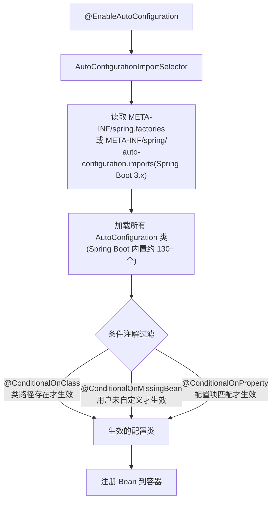

# Spring Boot 自动配置原理

---

## 1. 类比：自动配置就像智能家居

你搬进新家（引入依赖），智能家居系统（Spring Boot）自动检测到你有空调（`spring-boot-starter-web`），就帮你把空调调好默认温度（默认配置）。你也可以手动调温度（自定义配置），手动设置后智能系统就不再干预。

---

## 2. @SpringBootApplication 解析

```java
@SpringBootApplication
// 等价于以下三个注解的组合：
@SpringBootConfiguration   // 等同于 @Configuration，标记为配置类
@EnableAutoConfiguration   // 开启自动配置（核心！）
@ComponentScan             // 扫描当前包及子包的组件
public class Application {
    public static void main(String[] args) {
        SpringApplication.run(Application.class, args);
    }
}
```

---

## 3. 自动配置加载流程



> **为什么用条件注解而非全部加载**：Spring Boot 内置了 130+ 个自动配置类，如果全部加载会浪费大量内存并拖慢启动速度。条件注解实现了"按需加载"——只有你引入了对应的 starter 依赖，相关配置才会生效。

---

## 4. 常用条件注解

| 注解 | 生效条件 | 典型应用 |
|------|---------|---------|
| `@ConditionalOnClass` | 类路径中存在指定类 | 引入了 `spring-boot-starter-web` 才配置 MVC |
| `@ConditionalOnMissingBean` | 容器中不存在指定 Bean | 用户未自定义 DataSource 时才创建默认的 |
| `@ConditionalOnProperty` | 配置文件中存在指定属性 | `spring.datasource.url` 存在时才配置数据源 |
| `@ConditionalOnBean` | 容器中存在指定 Bean | 依赖某个 Bean 存在才生效 |
| `@ConditionalOnWebApplication` | 是 Web 应用时才生效 | Web 相关的自动配置 |

---

## 5. 自定义配置覆盖自动配置

```java
// Spring Boot 自动配置了 DataSource，但你可以覆盖它
@Configuration
public class MyDataSourceConfig {

    @Bean
    @Primary // 优先使用此 Bean
    public DataSource dataSource() {
        return new HikariDataSource(...);
    }
}
// 因为自动配置类上有 @ConditionalOnMissingBean(DataSource.class)
// 当你定义了 DataSource Bean，自动配置就不会再创建
// 这就是"约定优于配置"：有约定（默认配置），但允许覆盖（自定义配置）
```

**调试自动配置**：启动时加 `--debug` 参数，控制台会打印哪些自动配置生效、哪些未生效及原因。

---

## 6. Spring Boot 2.x vs 3.x 的变化

| 变化点 | Spring Boot 2.x | Spring Boot 3.x |
|--------|----------------|----------------|
| 自动配置文件 | `META-INF/spring.factories` | `META-INF/spring/org.springframework.boot.autoconfigure.AutoConfiguration.imports` |
| Java 最低版本 | Java 8 | Java 17 |
| Jakarta EE | `javax.*` 包 | `jakarta.*` 包 |

---

## 7. 常见问题

**Q1：Spring Boot 自动配置的原理是什么？**
> `@SpringBootApplication` 包含 `@EnableAutoConfiguration`，它通过 `AutoConfigurationImportSelector` 读取 `spring.factories`（或 Spring Boot 3.x 的 imports 文件）中的自动配置类列表，再通过 `@ConditionalOnClass`、`@ConditionalOnMissingBean` 等条件注解过滤，只加载满足条件的配置类。

**Q2：如何自定义一个 Spring Boot Starter？**
> ① 创建自动配置类，加 `@Configuration` 和条件注解；② 在 `META-INF/spring.factories` 中注册自动配置类；③ 打包为 jar，其他项目引入依赖即可自动生效。

**Q3：自动配置不生效怎么排查？**
> 启动时加 `--debug` 参数，查看 Conditions Evaluation Report，找到对应的自动配置类，查看哪个条件注解不满足（如缺少依赖、已有自定义 Bean 等）。

**一句话口诀**：`@EnableAutoConfiguration` 读配置列表，条件注解按需过滤，`@ConditionalOnMissingBean` 允许用户覆盖，这就是"约定优于配置"。