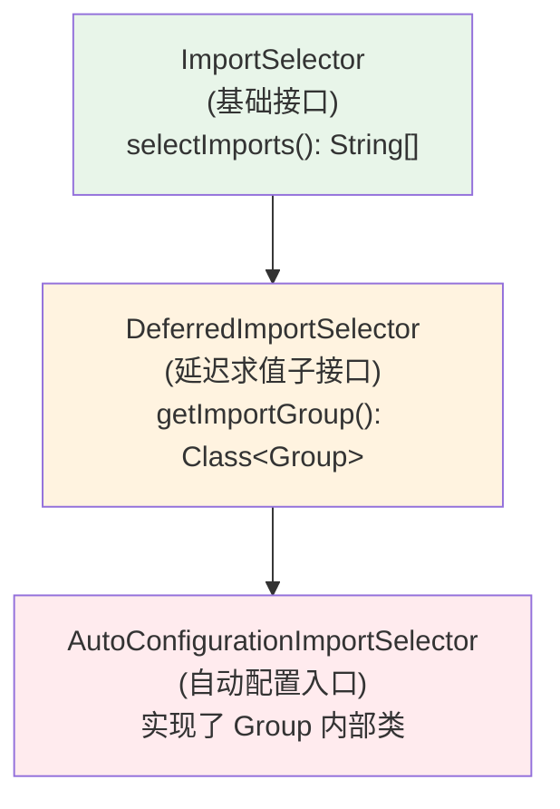
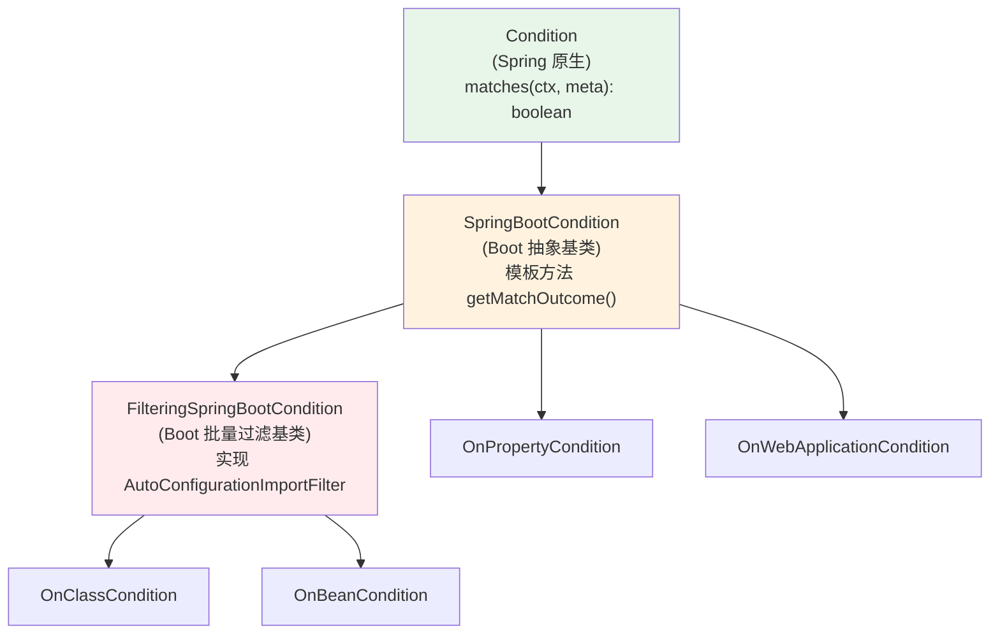
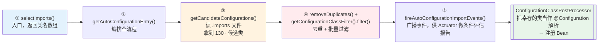
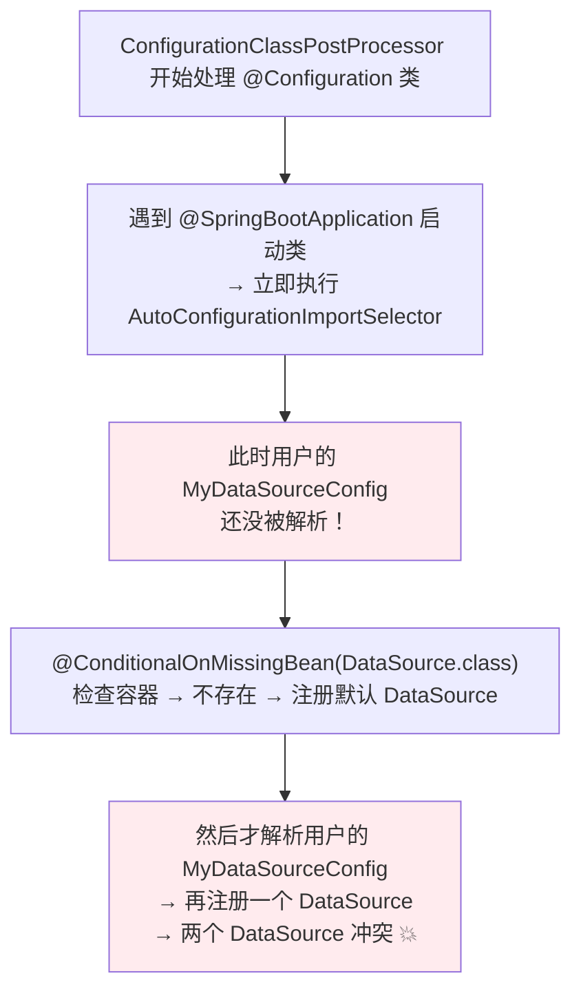
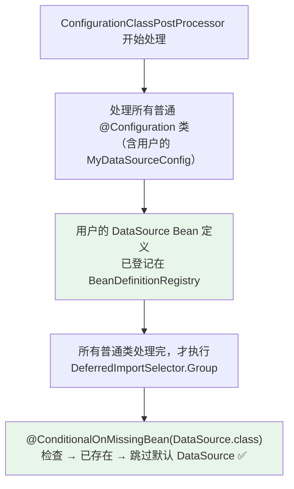

# Spring Boot 自动配置原理

> **一句话记忆**：自动配置 = 一张 `.imports` 清单 + 一堆 `@ConditionalOnXxx` 过滤器 + `DeferredImportSelector` 让位用户 Bean。

> 📖 **边界声明**：本文聚焦"Spring Boot 自动配置的**源码机制**"，即 `AutoConfigurationImportSelector` 如何读取配置列表、如何在 `DeferredImportSelector` 时机延迟求值、`@ConditionalOnMissingBean` 为何能让位用户 Bean。以下主题请见对应专题：
>
> - **条件注解 `@ConditionalOnXxx` 的完整语义、使用示例、Q&A** → [Spring常用注解全解](@spring-核心基础-Spring常用注解全解)
> - **`spring.factories` → `.imports` 的完整迁移矩阵、Boot 2.7 过渡期、升级踩坑** → [Spring容器启动流程深度解析](@spring-核心基础-Spring容器启动流程深度解析)
> - **如何自定义一个 Spring Boot Starter（完整工程示例：目录结构 + `.imports` + 打包）** → [Spring实战应用题](@spring-测试与实战-Spring实战应用题)
> - **`BeanFactoryPostProcessor` / `ImportSelector` 等扩展点的全景对比** → [Spring扩展点详解](@spring-核心基础-Spring扩展点详解)

---

## 1. 类比：自动配置就像智能家居

你搬进新家（引入依赖），智能家居系统（Spring Boot）自动检测到你有空调（`spring-boot-starter-web`），就帮你把空调调好默认温度（默认配置）。你也可以手动调温度（自定义配置），手动设置后智能系统就不再干预。

把类比落到源码：

| 生活场景 | 自动配置机制 |
| :-- | :-- |
| 智能系统感知"家里有空调" | `@ConditionalOnClass` 感知类路径有没有某个类 |
| "没手动设置才自动调温" | `@ConditionalOnMissingBean` 感知容器里没有用户 Bean 才注册默认 Bean |
| "主人设定的场景开关" | `@ConditionalOnProperty` 感知 `application.yml` 里配置项是否匹配 |
| 家电图谱（空调/冰箱/洗衣机清单） | `META-INF/spring/....imports` 文件（Boot 3）里的 130+ 自动配置类清单 |
| "先等主人住进来，再决定要不要启动设备" | `DeferredImportSelector` 延迟执行：等所有用户 `@Configuration` 解析完，再求值自动配置的条件 |

这张映射表就是本文的核心主线，后续每一节都是在展开它的某一行。

---

## 2. 为什么需要自动配置：从 XML 到零配置

要理解自动配置解决什么痛点，先看"没有它的日子"。搭建一个最简单的"Web + JDBC"应用，三个时代的配置量对比：

**① Spring 2.x 时代（XML 配置）——一个空架子就 300+ 行 XML：**

```xml
<!-- applicationContext.xml 典型片段 -->
<bean id="dataSource" class="org.apache.commons.dbcp2.BasicDataSource">
    <property name="driverClassName" value="com.mysql.cj.jdbc.Driver"/>
    <property name="url" value="jdbc:mysql://localhost:3306/demo"/>
    <property name="username" value="root"/>
    <property name="password" value="123456"/>
    <property name="initialSize" value="5"/>
    <property name="maxTotal" value="20"/>
</bean>

<bean id="transactionManager" class="org.springframework.jdbc.datasource.DataSourceTransactionManager">
    <property name="dataSource" ref="dataSource"/>
</bean>

<bean id="jdbcTemplate" class="org.springframework.jdbc.core.JdbcTemplate">
    <property name="dataSource" ref="dataSource"/>
</bean>

<!-- 还要配 DispatcherServlet、ViewResolver、MultipartResolver、MessageConverter... -->
<!-- 外加 web.xml 里 DispatcherServlet 的 servlet-mapping、context-param、listener 等数十行 -->
```

**② Spring 3.x 时代（Java Config）——从 XML 搬到 `@Configuration` 类，体量减半但仍要自己写：**

```java
@Configuration
@EnableWebMvc
public class AppConfig {
    @Bean
    public DataSource dataSource() { /* 手动 new HikariDataSource 并 set 一堆属性 */ }

    @Bean
    public PlatformTransactionManager transactionManager(DataSource ds) { /* ... */ }

    @Bean
    public JdbcTemplate jdbcTemplate(DataSource ds) { /* ... */ }
}
```

**③ Spring Boot 时代——零配置：**

```xml
<!-- pom.xml：引入两个 starter 即可 -->
<dependency><artifactId>spring-boot-starter-web</artifactId></dependency>
<dependency><artifactId>spring-boot-starter-jdbc</artifactId></dependency>
```

```properties
# application.properties：只写业务相关的连接信息
spring.datasource.url=jdbc:mysql://localhost:3306/demo
spring.datasource.username=root
spring.datasource.password=123456
```

自动配置帮你做了什么？**130+ 个 `@AutoConfiguration` 类**按条件注解精确命中当前类路径和配置文件状态，自动注册 `DataSource` / `JdbcTemplate` / `TransactionManager` / `DispatcherServlet` / `ViewResolver` / `MultipartResolver` 等 Bean。

> 📌 **一句话**：自动配置不是魔法，它只是把"你以前自己写的 `@Configuration` 类"打包到了框架 jar 里，再用条件注解决定"此时此刻要不要激活它"。

---

## 3. 术语表 + 核心类继承体系

阅读本文源码章节前，先对齐 6 个术语的精确含义——它们在后续每张图、每段源码链路里都会反复出现。

| 术语 | 精确含义 | 第一次出现的位置 |
| :-- | :-- | :-- |
| `SpringFactoriesLoader` | Spring 的 SPI 加载器，负责读 `META-INF/spring.factories`（Boot 2）/ `META-INF/spring/*.imports`（Boot 3）。是自动配置清单的"搬运工" | §5 |
| `AutoConfigurationImportSelector` | 自动配置的入口类，实现 `DeferredImportSelector`。`@EnableAutoConfiguration` 通过 `@Import` 导入它 | §5 |
| `DeferredImportSelector` | `ImportSelector` 的**延迟版**子接口。它会**等所有用户 `@Configuration` 类解析完**再执行，保证 `@ConditionalOnMissingBean` 能正确识别"用户已定义" | §5、§7 |
| `@AutoConfiguration` | Boot 2.7+ 引入的元注解 = `@Configuration(proxyBeanMethods=false)` + 内置 `@AutoConfigureBefore/After/Order` 声明位。所有自动配置类都应改用它 | §8 |
| `AutoConfigurationImportFilter` | 条件过滤器 SPI。在正式求值 `@Conditional` 之前，先做一轮快速过滤（如 `OnClassCondition` 批量检查类路径）。避免把 130+ 个类全部加载进来再一个个求值 | §5 |
| `SpringBootCondition` | `Condition` 的基类。所有 `@ConditionalOnClass` / `@ConditionalOnMissingBean` / `@ConditionalOnProperty` 等注解对应的 `Condition` 实现都继承它 | §6 |

**接口继承图 A：`ImportSelector` 家族**



!!! note "📖 术语家族：`*Selector` / `*Registrar`（类名贡献者家族）"
    **字面义**：`Import` = 导入，`Selector` = 选择器 / 挑选者——"被 `@Import` 导入时，负责挑出一批类名交给容器"。
    **在 Spring 中的含义**：介于"写死的 `@Import(Xxx.class)`"与"程序化 `BeanDefinitionRegistry` 注册"之间的中间层——让框架能在 `@Configuration` 解析阶段**动态决定**要把哪些配置类纳入容器，是自动配置、`@EnableXxx` 家族、Spring Cloud 的 `@EnableFeignClients` 等"开关式装配"的共同技术底座。
    **同家族成员**：

    | 成员 | 返回物 | 求值时机 | 典型用途 | 源码位置 |
    | :-- | :-- | :-- | :-- | :-- |
    | `ImportSelector` | `String[]`（类名数组） | 与 `@Configuration` 解析**同批**求值 | `@EnableCaching` / `@EnableAsync` 这类"开关 + 固定配置集"场景 | `org.springframework.context.annotation.ImportSelector` |
    | `DeferredImportSelector` | `String[]`（类名数组） | **所有 `@Configuration` 解析完**后延迟求值，可声明内部 `Group` 批处理 | 需要等用户 Bean 登记完再决定的场景（自动配置唯一选它） | `org.springframework.context.annotation.DeferredImportSelector` |
    | `AutoConfigurationImportSelector` | `String[]` + `AutoConfigurationEntry`（带 exclusions） | 继承 `DeferredImportSelector`，Spring Boot 专用 | `@EnableAutoConfiguration` 的真正干活者 | `org.springframework.boot.autoconfigure.AutoConfigurationImportSelector` |
    | `ImportBeanDefinitionRegistrar` | **void**（直接往 `BeanDefinitionRegistry` 注册） | 与 `ImportSelector` 同批 | 需要精细控制 `BeanDefinition`（scope / primary / 别名）的场景，如 `@MapperScan` | `org.springframework.context.annotation.ImportBeanDefinitionRegistrar` |

    **命名规律**：
    - `<Xxx>Selector` = "我返回**一串类名**给你，由你当作 `@Configuration` 去解析"——轻量，不碰 `BeanDefinition`
    - `Deferred<Xxx>Selector` = "同上，但**延迟到最后**执行"——让位给用户配置
    - `<Xxx>Registrar` = "我直接上手改 `BeanDefinitionRegistry`"——重量，绕过 `@Configuration` 解析
    - 三者都要被 `@Import` 引入才会被激活；只有 `DeferredImportSelector` 的 `Group` 能跨多个 `@Import` 聚合批处理

关键差异：`ImportSelector` 和 `@Configuration` 类一起求值；`DeferredImportSelector` **等所有 `@Configuration` 处理完才求值**——这一点就是自动配置"用户优先"的技术根基（详见 §7）。

**接口继承图 B：`Condition` 家族**



为什么 `OnClassCondition` / `OnBeanCondition` 要继承 `FilteringSpringBootCondition`？因为它们要在"130+ 自动配置类"这个量级上**批量过滤**——详见 §5 的源码链路。

---

## 4. @SpringBootApplication 解剖

```java
@SpringBootApplication
// 等价于以下三个注解的组合：
@SpringBootConfiguration   // 等同于 @Configuration，标记为配置类
@EnableAutoConfiguration   // 开启自动配置（核心！）
@ComponentScan             // 扫描当前包及子包的组件
public class Application {
    public static void main(String[] args) {
        SpringApplication.run(Application.class, args);
    }
}
```

而 `@EnableAutoConfiguration` 的核心只有一行：

```java
@Target(ElementType.TYPE)
@Retention(RetentionPolicy.RUNTIME)
@AutoConfigurationPackage
@Import(AutoConfigurationImportSelector.class)   // ⭐ 一切的起点
public @interface EnableAutoConfiguration { ... }
```

**所以"自动配置是怎么工作的"这个问题，等价于"`AutoConfigurationImportSelector` 里发生了什么"**——这就是下一节的全部内容。

---

## 5. 源码链路：从 selectImports() 到 Bean 注册 ⭐

自动配置的全链路可以压缩成 5 个方法调用。理解了这 5 步，所有"为什么生效/为什么失效"的问题都能自己回答。



### 5.1 第 ①②③ 步：入口与候选清单加载

`AutoConfigurationImportSelector` 实现的是 `DeferredImportSelector`，真正的入口不是 `selectImports()` 而是它的内部 `Group` 类（`AutoConfigurationGroup`），但对外语义一致：**返回一个要交给 `@Configuration` 解析器处理的类名数组**。核心方法签名：

| 方法 | 职责 | 关键源码动作 |
| :-- | :-- | :-- |
| `selectImports(AnnotationMetadata)` | 对外入口 | 委托给 `getAutoConfigurationEntry()` |
| `getAutoConfigurationEntry(AnnotationMetadata)` | 编排全流程 | 串联 ③→④→⑤ 五个子步骤 |
| `getCandidateConfigurations(...)` | 加载候选清单 | Boot 3：`ImportCandidates.load(AutoConfiguration.class, cl)`；Boot 2：`SpringFactoriesLoader.loadFactoryNames(EnableAutoConfiguration.class, cl)` |

第 ③ 步加载完，手里就有一份 **130+ 个全限定类名**的原始清单（实际数量随版本与引入的 starter 浮动）。此时**还没做任何条件判断**——清单里包含"当前项目根本没用 Kafka，但 Kafka 自动配置类名"。

### 5.2 第 ④ 步：批量过滤（性能关键）

如果顺序跑 130+ 个类的 `@Conditional` 求值，启动会慢得肉眼可见。Boot 的做法是**先批量过滤，再精细求值**：

```java
// AutoConfigurationImportSelector#getConfigurationClassFilter() 返回一个过滤器链
// 链上每一环都是一个 AutoConfigurationImportFilter 实现，目前官方提供 3 个：
//   - OnClassCondition             批量检查类路径是否存在
//   - OnBeanCondition              批量检查容器内是否已有 Bean
//   - OnWebApplicationCondition    批量检查是否 Web 环境
```

`OnClassCondition` 的实现细节值得单独拎出来——它是启动性能的核心：

| 技巧 | 实现 |
| :-- | :-- |
| **字符串形式的类名声明** | `@ConditionalOnClass(name="...")` 使用字符串，避免 JVM 在加载注解元数据时触发目标类的静态初始化 |
| **`ClassLoader.loadClass()` + catch `Throwable`** | 检查类存在性时即便出现 `NoClassDefFoundError` 也能安全返回 false，而不是让启动直接崩 |
| **多线程并行检查** | 大项目里 `OnClassCondition` 会拆分任务到多个线程并行跑 |

经过 ④ 的过滤，130+ 通常会缩到 **20~40 个真正要激活的类**。

### 5.3 第 ⑤ 步：事件广播与最终注册

过滤后剩下的类会经由 `fireAutoConfigurationImportEvents()` 广播 `AutoConfigurationImportEvent`，这是 Actuator `/actuator/conditions` 端点数据的来源。随后这批类名被返回给上游的 `ConfigurationClassParser`，被当作**普通 `@Configuration` 类**解析——于是 `@Bean` 方法被发现、求值、注册为 Bean。

!!! warning "Boot 3 停止读取 spring.factories 的 EnableAutoConfiguration 键"
    Boot 2 的 `getCandidateConfigurations()` 读的是 `META-INF/spring.factories` 里的 `EnableAutoConfiguration=...` 键值对；**Boot 3 起该键不再被读取**，必须改用 `META-INF/spring/org.springframework.boot.autoconfigure.AutoConfiguration.imports` 文件（一行一个类名，纯文本）。老 Starter 升级到 Boot 3 时最典型的症状就是"自动配置类一个都不加载"——根因就在这里。完整迁移方案见 §8 及 [Spring容器启动流程深度解析](@spring-核心基础-Spring容器启动流程深度解析) 的"SPI 与 .imports 机制"章节。

---

## 6. 条件注解在自动配置链路上的速查

本节**只讲"条件注解在自动配置链路的哪一步触发、对应哪个 `Condition` 实现类"**，注解本身的完整语义和使用示例请看姊妹篇。

| 注解 | 在 §5 的哪一步触发 | 对应 `Condition` 实现 |
| :-- | :-- | :-- |
| `@ConditionalOnClass` | ④ 批量过滤阶段（`OnClassCondition`） | `OnClassCondition extends FilteringSpringBootCondition` |
| `@ConditionalOnMissingBean` | ④ 批量过滤阶段（`OnBeanCondition`） | `OnBeanCondition extends FilteringSpringBootCondition` |
| `@ConditionalOnWebApplication` | ④ 批量过滤阶段 | `OnWebApplicationCondition extends SpringBootCondition` |
| `@ConditionalOnProperty` | 精细求值阶段（每个类上逐个求值） | `OnPropertyCondition extends SpringBootCondition` |

> 📖 上述条件注解的**完整语义、参数列表、使用示例、Q&A**，详见 [Spring常用注解全解 · 条件装配系列](@spring-核心基础-Spring常用注解全解)。本文不再展开。

---

## 7. @ConditionalOnMissingBean 让位机制深度解析

这是整个自动配置体系**最重要的一个设计**——"用户 Bean 优先于自动配置 Bean"。它能工作的根本原因，不在 `@ConditionalOnMissingBean` 本身，而在 `DeferredImportSelector` 的延迟求值时序。

### 7.1 问题：普通 ImportSelector 为什么做不到？

假设 `AutoConfigurationImportSelector` 只是普通 `ImportSelector`，执行时序会是这样：



### 7.2 DeferredImportSelector 的救赎

`AutoConfigurationImportSelector implements DeferredImportSelector`，这个"延迟"两个字改变了时序：



### 7.3 一个容易踩的边界

`@ConditionalOnMissingBean` 检查的是 **`BeanDefinitionRegistry`**（Bean 定义注册表），不是 **`BeanFactory` 中已实例化的单例**。这意味着：

- ✅ 用户在 `@Configuration` 类里用 `@Bean` 声明过 `DataSource` → 检查通过（已登记）
- ❌ 用户通过 `BeanFactoryPostProcessor` 在自动配置**之后**手动 `registerBeanDefinition()` → 检查不到（时序已过）
- ⚠️ 用户在另一个自动配置类里用 `@Bean` 声明 `DataSource`，且两个自动配置类通过 `@AutoConfigureBefore/After` 有依赖关系 → 需要 `AutoConfigurationSorter` 先排序，才能保证先到的那个登记 Bean 定义（详见 §9 坑 ②）

---

## 8. Spring Boot 2.x → 3.x 自动配置机制迁移

本节从"**自动配置视角**"讲为什么要迁移、自动配置清单去了哪里。完整的 SPI 迁移矩阵、Boot 2.7 过渡期、升级踩坑列表，见 [Spring容器启动流程深度解析 · SPI 与 .imports 机制](@spring-核心基础-Spring容器启动流程深度解析)。

### 8.1 为什么要迁移

Boot 2.x 把"自动配置类清单"和"其他扩展点（`ApplicationContextInitializer`、`EnvironmentPostProcessor`、`SpringApplicationRunListener`…）"**全塞在同一个 `spring.factories` 文件里**，按键区分：

```properties
# META-INF/spring.factories（Boot 2.x 典型内容）
org.springframework.boot.autoconfigure.EnableAutoConfiguration=\
  com.example.MyAutoConfiguration,\
  com.example.OtherAutoConfiguration

org.springframework.context.ApplicationContextInitializer=\
  com.example.MyInitializer
```

这样设计有三个问题：

1. **解析歧义**：键名字符串匹配，写错一个字母就静默失败，排查极费劲；
2. **启动慢**：`SpringFactoriesLoader` 每次读全文件、用反射实例化；而自动配置场景下只需要"拿到类名清单"这一个动作；
3. **AOT 编译不友好**：Spring 6 / Boot 3 全面支持 GraalVM Native Image，反射密集的 `SpringFactoriesLoader` 路径需要生成大量反射提示配置。

### 8.2 Boot 3 的新方案：.imports 纯文本清单

Boot 3 给自动配置**单独拎一个文件**，纯文本一行一个类名：

```text
# META-INF/spring/org.springframework.boot.autoconfigure.AutoConfiguration.imports
com.example.MyAutoConfiguration
com.example.OtherAutoConfiguration
```

同时推出 `@AutoConfiguration` 元注解取代"自动配置类上的 `@Configuration` + `@AutoConfigureBefore/After/Order`"：

```java
// Boot 2.x 旧写法
@Configuration(proxyBeanMethods = false)
@AutoConfigureBefore(DataSourceAutoConfiguration.class)
@AutoConfigureOrder(Ordered.HIGHEST_PRECEDENCE)
public class MyAutoConfiguration { ... }

// Boot 3.x 推荐写法：一个元注解搞定
@AutoConfiguration(before = DataSourceAutoConfiguration.class)
public class MyAutoConfiguration { ... }
```

### 8.3 迁移对照速查

| 变化点 | Boot 2.x | Boot 3.x |
| :-- | :-- | :-- |
| 自动配置清单文件 | `META-INF/spring.factories`（键 `EnableAutoConfiguration`） | `META-INF/spring/org.springframework.boot.autoconfigure.AutoConfiguration.imports` |
| 清单格式 | Properties（键值对，逗号/反斜杠续行） | 纯文本（一行一个类名，`#` 开头为注释） |
| 自动配置类注解 | `@Configuration` + `@AutoConfigureBefore/After/Order` 分散写 | `@AutoConfiguration(before=..., after=..., order=...)` 一站式 |
| 其他扩展点（非自动配置） | 继续用 `spring.factories` | 继续用 `spring.factories`，**不受影响** |
| Boot 2.7 过渡期 | 两种格式都被读取 | 仅支持新格式 |
| Java 最低版本 | Java 8 | Java 17 |
| Jakarta EE | `javax.*` | `jakarta.*` |

!!! tip "调试自动配置的 3 种方法"
    1. **`--debug` 启动参数**：最常用。控制台打印 `Conditions Evaluation Report`，分 `Positive matches`（生效）/ `Negative matches`（未生效）/ `Exclusions`（被 exclude）/ `Unconditional classes`（无条件类）四段。
    2. **Actuator `/actuator/conditions` 端点**：生产环境首选。需要依赖 `spring-boot-starter-actuator` 并在 `management.endpoints.web.exposure.include` 暴露 `conditions`，返回 JSON 格式，可被监控系统抓取。
    3. **`ConditionEvaluationReport` API**：编程式访问。在测试中 `ConditionEvaluationReport.get(beanFactory)` 可直接拿到条件评估结果，用于断言"某个自动配置类确实被某个条件挡住了"。

---

## 9. 不理解底层会踩的 4 个坑

### 9.1 坑 ①：@SpringBootApplication(exclude=) vs @EnableAutoConfiguration(exclude=) 作用域差异

两者**都**能排除自动配置类，但在**多模块 + 继承结构**下有微妙差异：

```java
// 场景 A：在启动类上直接 exclude，作用于本启动应用
@SpringBootApplication(exclude = DataSourceAutoConfiguration.class)
public class Application { ... }

// 场景 B：通过自定义元注解传递 exclude
@EnableAutoConfiguration(exclude = DataSourceAutoConfiguration.class)
@ComponentScan
@SpringBootConfiguration
public @interface MyBootApp { ... }

@MyBootApp   // ⚠️ 这里的 exclude 不会继承生效！
public class Application { ... }
```

**根因**：`@SpringBootApplication` 的 `exclude` 是通过 `@AliasFor` 直通到 `@EnableAutoConfiguration.exclude` 的显式别名，而自定义元注解的 `@EnableAutoConfiguration` 属性不会被再次提取。**结论**：exclude 只在**标注的那个注解**上声明，不要期望被元注解传递。

### 9.2 坑 ②：@AutoConfigureBefore/After/Order 在类未被 .imports 收录时失效

很多人以为"在自动配置类上加 `@AutoConfigureBefore` 就能保证它先于某个类加载"——这是**只对了一半**：

- 前提：**本类必须在 `.imports` 文件里登记**，才会进入 `AutoConfigurationSorter` 的排序范围；
- 如果本类只是一个普通 `@Configuration` 被 `@ComponentScan` 扫到，`@AutoConfigureBefore/After/Order` 会被**完全忽略**（它们是 `AutoConfigurationSorter` 私有识别的元注解，不走 `@Order` 那条路径）。

排查办法：在启动参数加 `--debug`，看 `Positive matches` 里能不能找到本类。找不到就说明根本没被当作"自动配置"处理。

### 9.3 坑 ③：自定义 @Configuration 放在 @SpringBootApplication 所在包之外时不被扫描

`@SpringBootApplication` 隐含了 `@ComponentScan`，而 `@ComponentScan` **默认只扫描启动类所在包及其子包**：

```text
com.example.app                          ← 启动类包
├── Application.java                     @SpringBootApplication
├── service/UserService.java             ✅ 被扫描
└── ...

com.other                                ← 不在启动类包下
└── config/ExtConfig.java                ❌ 不被扫描！即使加了 @Configuration
```

**解决方案三选一**：
1. 把类移到启动类包或子包下（推荐）；
2. 在启动类上加 `@ComponentScan(basePackages = {"com.example.app", "com.other"})`；
3. 把 `ExtConfig` 做成**自动配置类**：在自己的 jar 里加 `META-INF/spring/....imports` 并把它登记进去——这样就绕开了 `@ComponentScan` 的包限制，走 §5 的链路加载。

### 9.4 坑 ④：@ConditionalOnMissingBean 在 @Bean 方法 vs 类级别的求值时机差异

```java
@AutoConfiguration
@ConditionalOnMissingBean(DataSource.class)   // ⚠️ 类级别
public class MyDataSourceAutoConfiguration {

    @Bean
    @ConditionalOnMissingBean(DataSource.class)   // ✅ 方法级别
    public DataSource dataSource() { ... }
}
```

两者**时机完全不同**：

| 位置 | 触发时机 | 风险 |
| :-- | :-- | :-- |
| 类级别 | §5 第 ④ 步批量过滤（`OnBeanCondition` 批量检查），此时**其他自动配置类的 `@Bean` 可能还没登记** | 如果另一个自动配置类也会创建 `DataSource` 且按 `@AutoConfigureBefore` 顺序在前，你这边类级别的检查拿不到它，会"双注册竞争"——通常让 Spring 直接抛错或让 `@Primary` 生效 |
| 方法级别 | 本类被当作 `@Configuration` 解析时**逐个 `@Bean` 求值**，此时**所有自动配置类的 Bean 定义已登记** | 准确、推荐 |

**结论**：**优先用方法级别的 `@ConditionalOnMissingBean`**；类级别只用于"整个配置类都依赖某个类存在"的粗粒度场景。

---

## 10. 常见问题 Q&A（机制题）

> 📖 **"如何自定义 Starter"（工程实现题）已在 [Spring实战应用题 · Q9](@spring-测试与实战-Spring实战应用题) 给出完整工程视角答案，本文不再重复，专注"源码机制"题。** 同理，"自动配置不生效怎么排查" 这类 checklist 类排查题也归实战篇。

**Q1：Spring Boot 自动配置的原理是什么（一句话版）？**
> `@SpringBootApplication` 包含 `@EnableAutoConfiguration` → `@Import(AutoConfigurationImportSelector.class)`。这个 Selector 实现了 `DeferredImportSelector`，在所有用户 `@Configuration` 解析完之后才执行，通过 `SpringFactoriesLoader`（Boot 2）或 `ImportCandidates`（Boot 3）读取 `.imports` 清单拿到 130+ 候选类，再经过 `OnClassCondition` / `OnBeanCondition` / `OnWebApplicationCondition` 的批量过滤和精细 `@Conditional` 求值，幸存的类被当作普通 `@Configuration` 解析并注册 Bean。

**Q2：`AutoConfigurationImportSelector` 为什么要实现 `DeferredImportSelector` 而不是普通 `ImportSelector`？**
> 关键在"延迟到所有 `@Configuration` 解析完才执行"。若不延迟，用户在 `@Configuration` 里定义的 Bean 还没登记到 `BeanDefinitionRegistry`，此时 `@ConditionalOnMissingBean` 检查会误判为"用户没定义" → 自动配置照常注册 → 容器里出现两个同类型 Bean 发生冲突。延迟求值保证了用户 Bean 定义**先**登记，自动配置**后**求值，`@ConditionalOnMissingBean` 才能正确识别"用户已定义"——这是自动配置"用户优先"原则的技术根基。

**Q3：`@ConditionalOnClass` 如何避免 `ClassNotFoundException`？**
> 三个设计细节：① 注解使用 `name` 属性接受**字符串类名**，避免 JVM 在加载注解元数据时触发目标类的静态初始化；② `OnClassCondition` 内部用 `ClassLoader.loadClass()` 并 `catch Throwable`（包括 `NoClassDefFoundError`、`LinkageError`），安全返回 false；③ 条件在 §5 第 ④ 步的**批量过滤阶段**统一求值，大项目还会并行化，避免一个一个抛异常拖慢启动。

**Q4：`@AutoConfigureBefore/After/Order` 的底层排序算法是什么？何时会失效？**
> 由 `AutoConfigurationSorter` 在 §5 第 ④ 步排序后实施，核心是**基于有向图的拓扑排序**——以 `@AutoConfigureBefore/After` 为依赖边，`@AutoConfigureOrder` 为同级间的次排序因子。**失效场景**：① 本类没登记在 `.imports` 文件里（不被 `AutoConfigurationSorter` 识别）；② 被 `@ComponentScan` 扫到的普通 `@Configuration` 类，这两个元注解完全无效；③ `@AutoConfigureOrder` 的值相同且无 before/after 关系时顺序不保证。

---

## 11. 一句话口诀

**`AutoConfigurationImportSelector` 读 `.imports` 清单，`DeferredImportSelector` 延迟到用户 `@Configuration` 解析完才求值，`@ConditionalOnMissingBean` 让位用户 Bean——"约定优于配置"的三根支柱，缺一不可。**