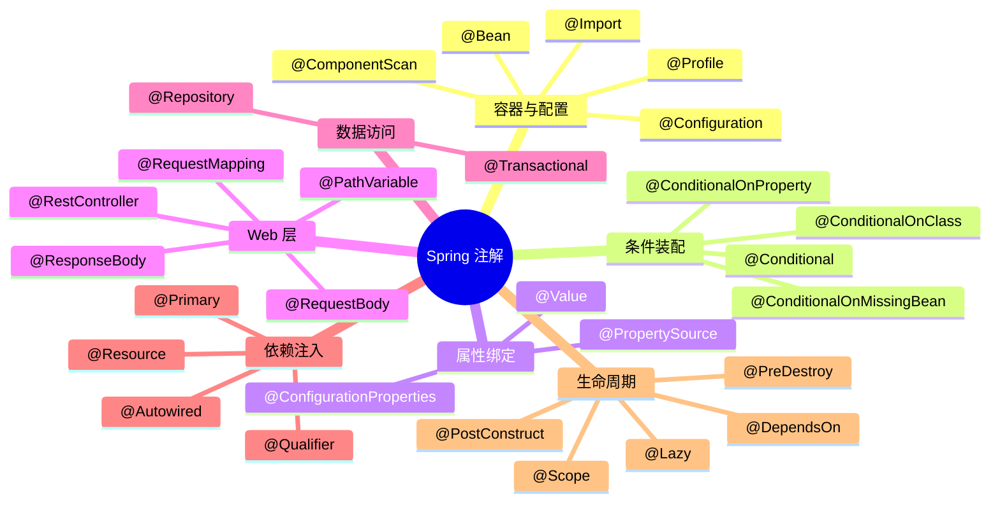

# Spring 常用注解全解

---

## 0. 类比与为什么需要注解

**类比：注解 = 给 Bean 贴标签**。想象一个巨型仓库里堆满了零件（POJO），快递员（Spring 容器）要把它们搬上流水线。早年我们得手写一本《货物登记册》（XML）逐件说明“这个零件由谁交给谁、放在什么位置、什么时候上线”——就像中文附述的《条码表》，零件本身并不知道自己干啥。**注解**把这张《条码表》直接贴在零件自己身上：注解不产生行为，只声明“我是谁、该怎么处理我”，Spring 在启动时扫描这些标签再反射执行。

**为什么需要：从三十行 XML 到三行注解**。同样注册三个 Bean：

```xml
<!-- ❌ XML 时代：注册一个用户服务要写 7~8 行 -->
<beans>
    <bean id="userDao" class="com.example.UserDao"/>
    <bean id="userService" class="com.example.UserService">
        <property name="userDao" ref="userDao"/>
    </bean>
    <bean id="userController" class="com.example.UserController">
        <property name="userService" ref="userService"/>
    </bean>
</beans>
```

```java
// ✅ 注解时代：每个类头一行标签 + 构造器 + @Autowired 即可，类与配置高内聚
@Repository           class UserDao { }
@Service              class UserService  { @Autowired UserDao dao; }
@RestController       class UserController { @Autowired UserService svc; }
```

设计动机四条：**声明式取代命令式**（写“是什么”而不写“怎么做”）、**元数据贴在自己身上**（获得重构安全，重命名类不会漏改配置）、**类型安全**（编译期检查注解参数）、**支持元注解堆叠**（`@RestController` = `@Controller` + `@ResponseBody`）。

---

## 1. 注解分类总览



> 📖 **边界声明**：本文只讲注解**语义**，不讲注解背后的**机制**。以下主题请见对应专题：
>
> - **IoC 容器与依赖解析算法**（`@Autowired` / `@Primary` / `@Qualifier` 的匹配优先级） → [IoC与DI](@spring-核心基础-IoC与DI) §6
> - **Bean 生命周期触发时点**（`@PostConstruct` / `@PreDestroy` / `@Lazy` 的实际执行阶段） → [Bean生命周期与循环依赖](@spring-核心基础-Bean生命周期与循环依赖) §3
> - **条件注解批量过滤时机**（`@ConditionalOn*` 的 `DeferredImportSelector` 延迟求值链路） → [SpringBoot自动配置原理](@spring-核心基础-SpringBoot自动配置原理) §5、§7
> - **AOP 注解织入机制**（`@Aspect` / `@Around` 的代理生成与通知顺序） → [AOP面向切面编程](@spring-核心基础-AOP面向切面编程)
> - **Web 层注解请求处理链路**（`@RequestMapping` / `@RequestBody` 的 `HandlerMapping` 匹配） → [Spring MVC 请求处理流程](@spring-Web与通信-SpringMVC请求处理流程)
> - **事务注解源码链路**（`@Transactional` 的 `TransactionInterceptor` 织入） → [Spring 事务管理](@spring-核心基础-Spring事务管理)
> - **配置注解底层机制**（`@Value` vs `@ConfigurationProperties` 两条链、`@Profile` 求值、`PropertySource` 17 层优先级、`@RefreshScope` 动态刷新） → [Spring 配置加载与属性绑定](@spring-核心基础-Spring配置加载与属性绑定)

---

## 2. 条件装配注解

### @Conditional —— 按条件注册 Bean

```java
// 自定义条件：只有 Linux 系统才注册此 Bean
public class LinuxCondition implements Condition {
    @Override
    public boolean matches(ConditionContext context, AnnotatedTypeMetadata metadata) {
        String osName = context.getEnvironment().getProperty("os.name");
        return osName != null && osName.toLowerCase().contains("linux");
    }
}

@Bean
@Conditional(LinuxCondition.class)
public FileService linuxFileService() {
    return new LinuxFileService();
}
```

### Spring Boot 派生条件注解（面试高频）

| 注解 | 条件 | 典型场景 |
| :-- | :-- | :-- |
| `@ConditionalOnClass` | 类路径存在指定类 | 有 Redis 依赖才自动配置 Redis |
| `@ConditionalOnMissingClass` | 类路径不存在指定类 | 缺少某依赖时提供默认实现 |
| `@ConditionalOnBean` | 容器中存在指定 Bean | 依赖其他 Bean 才生效 |
| `@ConditionalOnMissingBean` | 容器中不存在指定 Bean | 用户未自定义时才注册默认 Bean |
| `@ConditionalOnProperty` | 配置属性满足条件 | 开关控制功能是否启用 |
| `@ConditionalOnWebApplication` | 是 Web 应用 | Web 相关自动配置 |
| `@ConditionalOnExpression` | SpEL 表达式为 true | 复杂条件判断 |

!!! note "📖 术语家族：`@ConditionalOn*` 条件装配家族"
    **字面义**：`Conditional` = 有条件的 / 依条件成立的
    **在本框架中的含义**：Spring 在 Bean 注册阶段**提前求值**的闸门，只有 `matches()` 返回 `true` 的 Bean 才会进入容器；与运行期的 `@Profile` 不同，条件注解是可插拔的。
    **同家族成员**：

    | 成员 | 条件 | 源码位置 |
    | :-- | :-- | :-- |
    | `@ConditionalOnClass` | 类路径存在指定类 | `org.springframework.boot.autoconfigure.condition.OnClassCondition` |
    | `@ConditionalOnMissingClass` | 类路径不存在指定类 | 同上 |
    | `@ConditionalOnBean` | 容器中已有指定类型 Bean | `OnBeanCondition` |
    | `@ConditionalOnMissingBean` | 容器中没有指定类型 Bean | 同上 |
    | `@ConditionalOnProperty` | 配置属性满足指定值 | `OnPropertyCondition` |
    | `@ConditionalOnWebApplication` | 当前是 Web 应用 | `OnWebApplicationCondition` |
    | `@ConditionalOnExpression` | SpEL 表达式为 `true` | `OnExpressionCondition` |
    | `@ConditionalOnJava` | JDK 版本满足区间 | `OnJavaCondition` |

    **命名规律**：`@ConditionalOn<Resource>` / `@ConditionalOnMissing<Resource>` ——“资源存在/不存在时生效”，背后都对应一个 `On<Resource>Condition` 实现类，统一由 `@Conditional` 元注解驱动。早期条件（`OnClass`/`OnBean`）实现 `AutoConfigurationImportFilter`，支持批量过滤以提速。

```java
// 典型用法：用户未配置时才注册默认实现
@Bean
@ConditionalOnMissingBean(CacheManager.class)  // 用户没有自定义 CacheManager 时
@ConditionalOnProperty(name = "cache.enabled", havingValue = "true", matchIfMissing = true)
public CacheManager defaultCacheManager() {
    return new ConcurrentMapCacheManager();
}
```

> 📖 条件注解的**求值时机**（注册时 vs 实例化前）、`DeferredImportSelector` 如何把大批 `@ConditionalOn*` 延后到全量扫描结束再批量过滤、以及 `@ConditionalOnMissingBean` 为什么能做到“用户优先”，详见 [SpringBoot自动配置原理](@spring-核心基础-SpringBoot自动配置原理) §5、§7。

---

## 3. @ConfigurationProperties / @Value —— 配置属性绑定（语义速查）

> 📖 **本节只讲语义速查**。`@Value` / `@ConfigurationProperties` 两条链的底层差异（占位符解析器 vs `Binder`）、17 层 `PropertySource` 加载优先级、松散绑定算法、`@RefreshScope` 动态刷新原理等机制层内容，详见 [Spring 配置加载与属性绑定](@spring-核心基础-Spring配置加载与属性绑定)。

### @ConfigurationProperties 速用

```yaml
# application.yml
app:
  datasource:
    url: jdbc:mysql://localhost:3306/mydb
    username: root
    max-pool-size: 20
    connection-timeout: 30s   # Duration 直接用字符串
```

```java
@Data
@Component
@ConfigurationProperties(prefix = "app.datasource")
@Validated
public class DataSourceProperties {
    @NotBlank private String url;
    @NotBlank private String username;
    @Min(1) @Max(100) private int maxPoolSize = 10;
    private Duration connectionTimeout = Duration.ofSeconds(30);
}
```

### `@Value` vs `@ConfigurationProperties` 选型速查

| 特性 | `@Value` | `@ConfigurationProperties` |
| :-- | :-- | :-- |
| 绑定方式 | 单个属性 | 批量绑定到对象 |
| 类型转换 | 基本类型 | 完整类型栈（`Duration` / `DataSize` / `List` / `Map`） |
| 松散绑定 | ❌ 不支持 | ✅ 支持（`max-pool-size` = `maxPoolSize` = `MAX_POOL_SIZE`） |
| JSR-303 校验 | ❌ | ✅（配合 `@Validated`） |
| SpEL 表达式 | ✅（`#{...}`） | ❌ |
| `@RefreshScope` 热刷 | ⚠️ 需 Bean 进 `RefreshScope` + 重建 | ✅ 原生支持 in-place rebind |
| 适用场景 | 散装一两个值 / 需要 SpEL | 一组相关属性（**默认首选**） |

!!! tip "Spring Boot 2.2+ / 3.0+ 构造器绑定"
    Boot 2.2+ 起 `@ConfigurationProperties` 支持构造器绑定（配合 `@ConstructorBinding`）实现不可变（`final` 字段、无 setter）；**Boot 3.0 起**，类上只要标注 `@ConfigurationProperties` 就**默认**用构造器绑定，`@ConstructorBinding` 不再必需。Java 17 `record` 与之天然契合：

    ```java
    @ConfigurationProperties(prefix = "app.datasource")
    public record DataSourceProperties(
            String url, String username,
            int maxPoolSize, Duration connectionTimeout) {}
    ```

---

## 4. @Profile —— 多环境配置（语义速查）

> 📖 **`@Profile` 的求值时机**（`ProfileCondition` 在 `@Configuration` 解析阶段 vs `ConfigDataActivationContext` 在 yaml 加载阶段）、`spring.profiles.active` / `include` / `group` 的冲突检测，详见 [Spring 配置加载与属性绑定 §7](@spring-核心基础-Spring配置加载与属性绑定)。

```java
@Bean
@Profile("dev")
public DataSource devDataSource() {
    return new EmbeddedDatabaseBuilder().setType(EmbeddedDatabaseType.H2).build();
}

@Bean
@Profile("prod & us-east")     // Spring 5.1+ 逻辑表达式
public DataSource prodDataSource() { /* ... */ }
```

```yaml
# application.yml 激活 profile
spring:
  profiles:
    active: dev   # 或启动参数 --spring.profiles.active=prod
```

**Profile 文件约定**：

```txt
application.yml          # 公共配置
application-dev.yml      # 开发环境
application-test.yml     # 测试环境
application-prod.yml     # 生产环境
```

**表达式语法（Spring 5.1+）**：`@Profile("prod & us-east")`（同时满足）、`@Profile("dev | test")`（任一满足）、`@Profile("!prod")`（非生产）。

---

## 5. @Import —— 导入配置类

```java
// 方式1：直接导入配置类
@Configuration
@Import(SecurityConfig.class)
public class AppConfig { }

// 方式2：导入 ImportSelector（批量导入）
public class MyImportSelector implements ImportSelector {
    @Override
    public String[] selectImports(AnnotationMetadata metadata) {
        // 根据条件动态返回要导入的类名
        return new String[]{
            "com.example.ServiceA",
            "com.example.ServiceB"
        };
    }
}

@Configuration
@Import(MyImportSelector.class)
public class AppConfig { }

// 方式3：导入 ImportBeanDefinitionRegistrar（动态注册）
// 见 04-Spring扩展点详解.md
```

**`@Import` 是 Spring Boot 自动配置的核心**：`@EnableAutoConfiguration` → `@Import(AutoConfigurationImportSelector.class)` → 读取 `META-INF/spring/org.springframework.boot.autoconfigure.AutoConfiguration.imports` → 批量导入自动配置类。

> 📖 `ImportSelector` / `DeferredImportSelector` / `ImportBeanDefinitionRegistrar` 三兄弟的职责分工、`selectImports()` 的调用时序、自动配置如何利用 `DeferredImportSelector` 把条件过滤延后到全量扫描结束，详见 [SpringBoot自动配置原理](@spring-核心基础-SpringBoot自动配置原理) §3、§5，本文不再重复。

---

## 6. @Scope —— Bean 作用域

!!! note "📖 术语家族：`*Scope` Bean 作用域家族"
    **字面义**：`Scope` = 范围 / 生命期 / 可见域
    **在本框架中的含义**：`@Scope` 声明 Bean 的实例范围与生命周期，决定容器每次 `getBean()` 时是复用缓存还是制造新实例。所有作用域由 `org.springframework.beans.factory.config.Scope` 接口的实现类承载。
    **同家族成员**：

    | 成员 | 范围 | 适用场景 | 源码 / 实现 |
    | :-- | :-- | :-- | :-- |
    | `singleton`（默认） | 容器生命周期内唯一 | 无状态 Service / DAO | 容器一级缓存 |
    | `prototype` | 每次 `getBean` 新实例 | 有状态对象、线程封装 | 不缓存 |
    | `request` | 每个 HTTP 请求一个 | Controller 宵本级存储 | `RequestScope` |
    | `session` | 每个 HTTP Session 一个 | 用户会话状态 | `SessionScope` |
    | `application` | `ServletContext` 唯一 | Web 应用全局 | `ServletContextScope` |
    | `websocket` | 每个 WebSocket 会话一个 | WS 会话状态 | `SimpSessionScope`（`Spring 5.0+`） |

    **命名规律**：作用域名为全小写的 `<范围>`，对应 `Scope` 实现类命名为 `<范围>Scope`。Web 相关作用域仅在 `WebApplicationContext` 下生效（需注册 `RequestContextListener` 或使用 Spring Boot 默认配置）。

```java
@Bean
@Scope("prototype")
public ShoppingCart shoppingCart() {
    return new ShoppingCart();
}

// 在单例 Bean 中注入 prototype Bean 的正确方式
@Service
public class OrderService {
    @Autowired
    private ApplicationContext context;

    public void createOrder() {
        // 每次调用都获取新的 ShoppingCart 实例
        ShoppingCart cart = context.getBean(ShoppingCart.class);
    }
}
```

> ⚠️ 注意：单例 Bean 中直接 `@Autowired` 注入 prototype Bean，只会注入一次，后续都是同一个实例，达不到 prototype 的效果。需要通过 `ApplicationContext.getBean()` 或 `@Lookup` 注解每次获取新实例；或在 prototype Bean 上标注 `@Scope(proxyMode = ScopedProxyMode.TARGET_CLASS)` 令容器注入作用域代理对象。

---

## 7. @DependsOn —— 控制 Bean 创建顺序

默认情况下，Spring 不保证 Bean 的创建顺序。如果某个 Bean 的初始化**依赖另一个 Bean 的副作用**（如 A 的 `@PostConstruct` 会初始化全局资源，B 需要该资源已就绪），但两者之间没有直接的字段依赖，可以用 `@DependsOn` 显式声明顺序：

```java
@Component
public class DatabaseInitializer {
    @PostConstruct
    public void init() {
        // 执行建表 SQL，初始化数据库结构
    }
}

@Component
@DependsOn("databaseInitializer") // 必须等 databaseInitializer 创建完才创建我
public class OrderService {
    @PostConstruct
    public void init() {
        // 此时可以安全地操作数据库，表结构已就绪
    }
}
```

> **注意**：`@DependsOn` 只控制**创建顺序**，不负责注入。销毁时顺序相反。也支持同时依赖多个 Bean：`@DependsOn({"a", "b"})`。

### @PostConstruct / @PreDestroy —— 生命周期回调注解

附在方法上的两个标准生命周期回调注解（JSR-250）：

- **`@PostConstruct`**：Bean 属性注入完成**后**、正式交付给使用者**前**，执行一次。适合做校验、预加载、定时任务注册等。
- **`@PreDestroy`**：容器销毁前执行一次，适合释放连接池、关闭线程、刷写缓冲区等。

```java
@Service
public class CacheWarmer {
    @PostConstruct
    public void warmUp() {
        // 属性注入完、容器点火后自动调用
    }
    @PreDestroy
    public void cleanUp() {
        // 容器关闭前自动调用
    }
}
```

!!! warning "Spring 6 的 Jakarta 包名迁移"
    `Spring 6` / `Spring Boot 3` 起，`@PostConstruct` / `@PreDestroy` 的包名从 `javax.annotation.*` 迁到 `jakarta.annotation.*`，迁移时必须同步替换 import；仍然使用 `javax.annotation.*` 不会报编译错误，但**不会被触发**（无声失效，是 Spring 6 迁移高发坑）。

> 📖 `@PostConstruct` / `@PreDestroy` 在 Bean 生命周期 12 步中的确切触发位置、与 `InitializingBean.afterPropertiesSet()` / `@Bean(initMethod=...)` 的执行先后、`CommonAnnotationBeanPostProcessor` 的处理链路，详见 [Bean生命周期与循环依赖](@spring-核心基础-Bean生命周期与循环依赖) §3，本文不再展开。

---

## 8. @Lazy —— 延迟初始化

```java
// 类级别：整个类延迟初始化
@Component
@Lazy
public class HeavyService {
    public HeavyService() {
        System.out.println("HeavyService 初始化（第一次使用时才执行）");
    }
}

// 注入点级别：解决循环依赖
@Service
public class ServiceA {
    @Autowired
    @Lazy  // 注入代理对象，第一次调用时才真正初始化 ServiceB
    private ServiceB serviceB;
}
```

**`@Lazy` 的两个用途**：

1. **延迟初始化**：启动时不创建，第一次使用时才创建，加快启动速度
2. **解决循环依赖**：构造器注入的循环依赖，加 `@Lazy` 注入代理对象打破循环

> 📖 `@Lazy` 如何通过代理对象绕开三级缓存、为什么构造器循环加 `@Lazy` 也能解决、与 `@Scope(proxyMode)` 的代理机制区别，详见 [Bean生命周期与循环依赖](@spring-核心基础-Bean生命周期与循环依赖) §6，本文不再重复。

---

## 9. @Primary 和 @Qualifier —— 解决注入歧义

> 📖 `@Autowired` / `@Primary` / `@Qualifier` / `@Resource` 在**依赖解析算法**中的匹配优先级（类型→限定符→主选→名称映射 的四阶评分）、`DependencyDescriptor` 如何拼装候选集、以及在集合/Map 注入时的特殊处理，详见 [IoC与DI](@spring-核心基础-IoC与DI) §6，本文仅讲注解语义约定。

```java
// 场景：有多个 DataSource Bean，注入时不知道用哪个

@Bean
@Primary  // 默认首选
public DataSource masterDataSource() { ... }

@Bean
public DataSource slaveDataSource() { ... }

// 注入时：
@Autowired  // 自动注入 masterDataSource（@Primary 标注的）
private DataSource dataSource;

@Autowired
@Qualifier("slaveDataSource")  // 明确指定注入 slaveDataSource
private DataSource readDataSource;
```

---

## 10. 模式注解家族：@Component / @Service / @Repository / @Controller

这组注解称为**模式注解（Stereotype Annotations）**——他们在容器注册行为上完全等效，差别在于**语义分层**与少数专用加持。

!!! note "📖 术语家族：`@Component` 模式注解家族"
    **字面义**：`Stereotype` = 刷版印刻 / 定型化角色，“到处都能见到的样板化角色”
    **在本框架中的含义**：Spring 通过 `ClassPathBeanDefinitionScanner` + `@ComponentScan` 扫描这组标记注解，自动注册为 Bean；除 `@Component` 之外均为元注解（`@Component` 作为元标记）。
    **同家族成员**：

    | 成员 | 分层语义 | 专用加持 | 源码 |
    | :-- | :-- | :-- | :-- |
    | `@Component` | 通用组件 | 无 | `org.springframework.stereotype.Component` |
    | `@Service` | 业务服务层 | 无，纯语义 | `org.springframework.stereotype.Service` |
    | `@Repository` | 数据访问层 | 通过 `PersistenceExceptionTranslationPostProcessor` 自动将 JDBC / Hibernate / JPA 异常翻译为 `DataAccessException` | `org.springframework.stereotype.Repository` |
    | `@Controller` | Web 控制层 | 配合 `@RequestMapping` 参与 `HandlerMapping` 扰动 | `org.springframework.stereotype.Controller` |
    | `@RestController`（Spring 4.0+） | REST 控制层 | 合成注解 = `@Controller` + `@ResponseBody` | `org.springframework.web.bind.annotation.RestController` |
    | `@Configuration` | 配置类 | 也是元标记 `@Component`；`@Bean` 方法会被 CGLIB 代理 | `org.springframework.context.annotation.Configuration` |

    **命名规律**：`@<分层角色>` ——分层角色名同时提示架构层和语义；如果标签伴随额外行为（异常翻译、响应体序列化），该行为通过配套的 `BeanPostProcessor` / `HandlerAdapter` 实现，不在注解本身。

**为什么要区分四个？**即使功能上 `@Service` / `@Controller` 与 `@Component` 几乎等价，分层语义仍然价值三重：① AOP 可基于模式注解按层切入（`within(@Service *)`）；② `@Repository` 提供的异常翻译是**硬性差异**，不用不行；③ 代码作为架构文档——读到 `@Repository` 即知是数据层，无需内容旁证。

!!! warning "Spring 6 / Boot 3 Jakarta 迁移"
    `@Repository` 的异常翻译机制依赖持久化异常栈：`Spring 6` / `Spring Boot 3` 起，`javax.persistence.*` 全部迁到 `jakarta.persistence.*`，`PersistenceExceptionTranslationPostProcessor` 匹配的也是新包名下的异常类；迁移时若 ORM 仍用旧版，翻译会静默失效。

---

## 11. Web 层注解

Spring MVC 常用注解概貈，包括路由声明、参数绑定、响应处理三类。

| 注解 | 用途 | 典型位置 | 补充说明 |
| :-- | :-- | :-- | :-- |
| `@RestController` | REST 控制器，返回值直接序列化为响应体 | 类 | `@Controller + @ResponseBody`（Spring 4.0+） |
| `@RequestMapping` | 通用路由注解 | 类 / 方法 | 支持 `value` / `method` / `consumes` / `produces` / `headers` |
| `@GetMapping` 等 | HTTP 动词专用版本 | 方法 | `@GetMapping` / `@PostMapping` / `@PutMapping` / `@DeleteMapping` / `@PatchMapping`（Spring 4.3+） |
| `@PathVariable` | 绑定 URL 路径变量 | 参数 | `/order/{id}` → `@PathVariable Long id` |
| `@RequestParam` | 绑定 query / form 参数 | 参数 | 支持 `required` / `defaultValue` |
| `@RequestBody` | 反序列化请求体为对象 | 参数 | 由 `HttpMessageConverter` 处理（默认 `MappingJackson2HttpMessageConverter`） |
| `@ResponseBody` | 序列化返回值为响应体 | 方法 / 类 | `@RestController` 已隐含 |
| `@RequestHeader` | 绑定请求头 | 参数 | —— |
| `@CookieValue` | 绑定 Cookie | 参数 | —— |
| `@ModelAttribute` | 绑定到模型 / 添加到模型 | 参数 / 方法 | Spring MVC 特有，与Spring WebFlux 语义一致 |
| `@ExceptionHandler` | 局部异常处理 | 方法 | 配合 `@RestControllerAdvice` 可做全局 |
| `@RestControllerAdvice` | 全局异常处理 / ResponseBodyAdvice | 类 | `@ControllerAdvice + @ResponseBody` |
| `@ResponseStatus` | 指定响应状态码 | 方法 / 异常类 | —— |

```java
@RestController
@RequestMapping("/orders")
public class OrderController {
    @GetMapping("/{id}")
    public OrderDTO get(@PathVariable Long id) { ... }

    @PostMapping
    @ResponseStatus(HttpStatus.CREATED)
    public OrderDTO create(@RequestBody @Valid CreateOrderReq req) { ... }
}
```

> 📖 `HandlerMapping` 如何匹配路由、`HandlerAdapter` 如何解析参数和渲染响应体、`@RequestMapping` 的级联继承规则与优先级冲突、以及异常处理链路，详见 [Spring MVC 请求处理流程](@spring-Web与通信-SpringMVC请求处理流程)，本文不再重复。

---

## 12. AOP 注解

切面标记与通知声明注解：

| 注解 | 用途 | 典型位置 | 补充说明 |
| :-- | :-- | :-- | :-- |
| `@EnableAspectJAutoProxy` | 开启自动代理 | 配置类 | Boot 场景下默认已开；`proxyTargetClass` 控制是否强制 CGLIB |
| `@Aspect` | 声明切面类 | 类 | 通常与 `@Component` 一起使用 |
| `@Pointcut` | 命名切点表达式 | 方法（空方法体） | 可被多个通知复用 |
| `@Before` | 前置通知 | 方法 | 运行在目标方法前 |
| `@After` | 最终通知 | 方法 | 无论正常/异常都执行，类似 `finally` |
| `@AfterReturning` | 返回后通知 | 方法 | 可用 `returning` 绑定返回值 |
| `@AfterThrowing` | 异常通知 | 方法 | 可用 `throwing` 绑定异常 |
| `@Around` | 环绕通知 | 方法 | 首个参数为 `ProceedingJoinPoint`，调 `proceed()` 才会执行目标 |
| `@Order` | 声明切面优先级 | 类 | 值越小越外层，前置先执行、后置后执行 |

```java
@Aspect
@Component
public class LogAspect {
    @Pointcut("execution(* com.example.service..*.*(..))")
    public void serviceMethods() {}

    @Around("serviceMethods()")
    public Object log(ProceedingJoinPoint pjp) throws Throwable {
        long start = System.currentTimeMillis();
        try {
            return pjp.proceed();
        } finally {
            System.out.println(pjp.getSignature() + " cost " + (System.currentTimeMillis() - start) + "ms");
        }
    }
}
```

> 📖 JDK 动态代理 vs CGLIB 的选型、五种通知的**执行时序**与嵌套顺序、同类自调用为何失效、AOT / GraalVM 场景的约束，详见 [AOP面向切面编程](@spring-核心基础-AOP面向切面编程)，本文仅给语义收口。

---

## 13. 常见问题

**Q1：@Autowired 和 @Resource 的区别？**
> `@Autowired` 是 Spring 注解，**按类型**注入，有多个同类型 Bean 时配合 `@Qualifier` 指定名称；`@Resource` 是 JDK 注解（JSR-250），**先按名称**注入，找不到再按类型，不依赖 Spring 框架。推荐用 `@Autowired` + `@Qualifier`，语义更清晰。

**Q2：为什么要区分 `@Service` / `@Repository` / `@Controller`？直接全用 `@Component` 不行吗？**
> 功能上可以全用 `@Component`，但**分层语义**有三重不可替代的价值：① `@Repository` 会被 `PersistenceExceptionTranslationPostProcessor` 识别，自动将 JDBC/ORM 异常翻译为 `DataAccessException` ——这是**行为差异**，换为 `@Component` 就没有了；② AOP 常用 `within(@Service *)` 按层切入，分层注解是层切面的锂点；③ 代码即架构文档，读到 `@Repository` 即知数据层，判断层次无需内容旁证。同理，`@Controller` / `@RestController` 配合 MVC 控制器检测逻辑参与 `HandlerMapping` 扰动。

**Q3：@Configuration 和 @Component 的区别？**
> 📖 深层机制（`@Bean` 方法间调用为何走容器、`ConfigurationClassEnhancer` CGLIB 子类的生成时机）详见 [IoC与DI](@spring-核心基础-IoC与DI) §4，本文仅给结论。`@Configuration` 类中的 `@Bean` 方法会被 CGLIB 代理，方法间互相调用会走 Spring 容器（保证单例）；`@Component` 类中的 `@Bean` 方法不被代理，方法间调用是普通 Java 调用，可能创建多个实例。

**Q4：@ConditionalOnMissingBean 的作用？**
> 📖 让位机制的完整求值链路（`DeferredImportSelector` 延后求值、`AutoConfigurationImportFilter` 批量过滤）详见 [SpringBoot自动配置原理](@spring-核心基础-SpringBoot自动配置原理) §7。语义上：当容器中不存在指定类型的 Bean 时才注册当前 Bean。这是 Spring Boot 自动配置"用户优先"原则的核心：自动配置类用 `@ConditionalOnMissingBean` 注册默认 Bean，如果用户自己定义了同类型的 Bean，自动配置就不会生效，用户的配置优先。

**Q5：如何让 Spring Boot 的自动配置不生效？**
> 📖 工程排查视角的确认清单（`ConditionEvaluationReport` 日志、`debug=true` 输出、实际创建的 Bean 总览）详见 [Spring实战应用题](@spring-测试与实战-Spring实战应用题)。三种配置式手段：① 自定义同类型的 Bean（利用 `@ConditionalOnMissingBean`）；② 在 `@SpringBootApplication` 上排除：`@SpringBootApplication(exclude = {DataSourceAutoConfiguration.class})`；③ 配置文件中设置 `spring.autoconfigure.exclude=...`。

---

## 14. 一句话口诀

> **注解 = 贴在 Bean 自己身上的标签**：声明式、元数据高内聚、编译期类型安全。
>
> **三条选型主线**：
>
> 1. **条件装配用 `@ConditionalOn*`**：“有什么 / 没什么 / 配了什么”三隆用法覆盖所有自动配置场景
> 2. **属性绑定首选 `@ConfigurationProperties`**：一组属性批量绑定 > 散装 `@Value`
> 3. **注入仲裁优先用 `@Qualifier`**，语义最清晰；`@Primary` 留给默认主跃场景
>
> **两条计位特别注意**：`Spring Boot 2.2+` 构造器绑定与 `Spring 6 / Boot 3` 的 Jakarta 包名迁移——前者是最佳实践，后者是入坑保持缓嬬。
