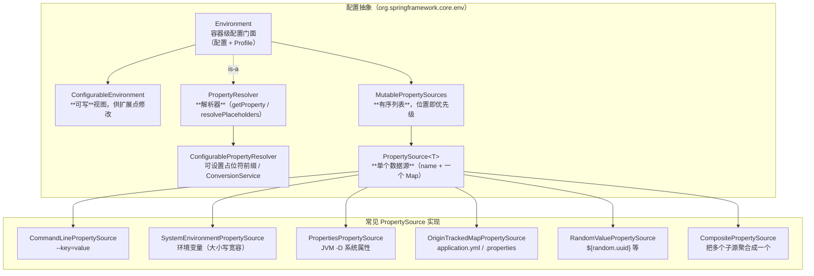
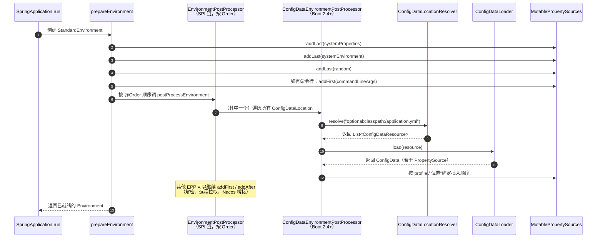
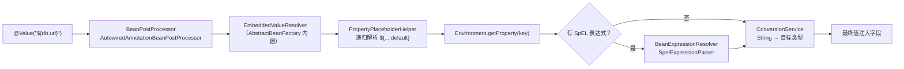
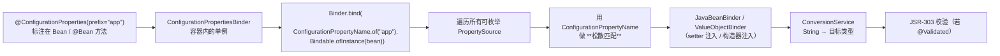
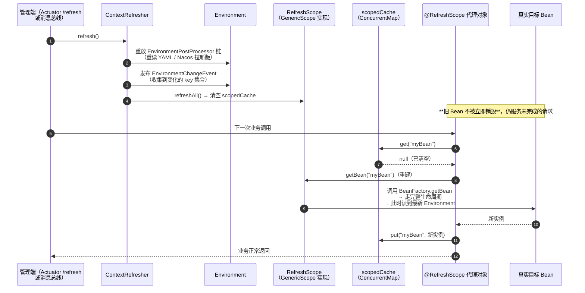
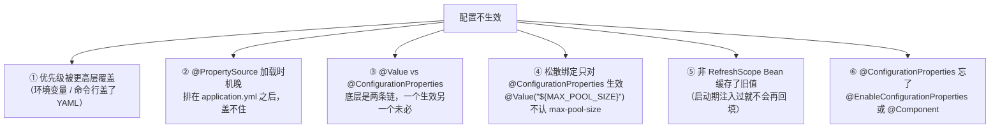
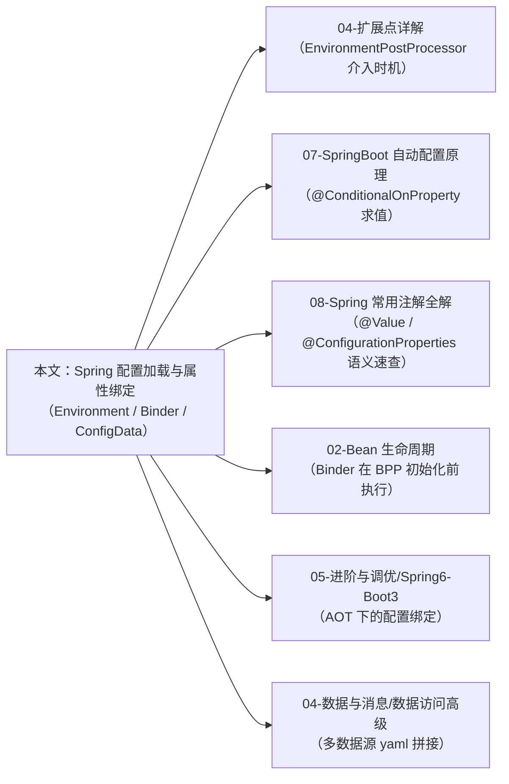

# Spring 配置加载与属性绑定

!!! info "**Spring 配置加载与属性绑定一句话口诀**"
    `Environment` + `PropertySource` + `PropertyResolver` 构成**配置三位一体**——抽象、数据源、解析器分层，任何配置最终都映射成"有序的 `PropertySource` 列表 + 懒解析"；

    Spring Boot 启动期由 `ConfigDataEnvironmentPostProcessor` 按 **17 层优先级**堆叠 `PropertySource`（命令行 → 环境变量 → `application-{profile}.yml` → `application.yml` → 默认值），顺序即优先级，**先查到谁就是谁**；

    `${...}` 占位符走 `PropertySourcesPropertyResolver` + `PlaceholderHelper`，`@Value` 额外经过 `EmbeddedValueResolver` 和 `BeanExpressionResolver`（SpEL）；

    `@ConfigurationProperties` 走**完全不同**的一条链路——`Binder` + `ConfigurationPropertyName` 做 kebab-case 松散匹配，`ConversionService` 做类型转换，不经过占位符解析器；

    `@RefreshScope` 通过**作用域代理 + `ContextRefresher.refresh()`** 重建 Bean 实现动态刷新，刷新时重放 `EnvironmentPostProcessor` 链 + 发 `EnvironmentChangeEvent`；

    AOT / 原生镜像下需注册 `@ConfigurationProperties` 的反射 Hints，Spring Boot 3 已自动生成。

<!-- -->

> 📖 **边界声明**：本文聚焦"**配置从磁盘 / 环境变量到 Bean 字段的完整机制**"，以下主题请见对应专题：
>
> - `@Value` / `@ConfigurationProperties` / `@Profile` 的**注解语义速查**（一张对比表、构造器绑定、Profile 激活语法） → [Spring 常用注解全解](@spring-核心基础-Spring常用注解全解) §3~§4
> - `EnvironmentPostProcessor` / `ApplicationContextInitializer` 等**启动前扩展点**的注册与时序 → [Spring 扩展点详解](@spring-核心基础-Spring扩展点详解) §7
> - 自动配置类的**条件注解**（`@ConditionalOnProperty` 的求值链路）→ [SpringBoot 自动配置原理](@spring-核心基础-SpringBoot自动配置原理) §5、§7
> - 多数据源 `spring.datasource.xxx` **业务用法**、`HikariCP` 调优 → [Spring 数据访问高级技巧](@spring-数据与消息-Spring数据访问高级技巧)
> - 配置中心（Nacos / Apollo / Spring Cloud Config）的**产品集成**、`@RefreshScope` 业务用法、灰度与回滚、密钥管理 → [配置中心与动态刷新](@spring-数据与消息-配置中心与动态刷新)

---

## 1. 引入：配置在 Spring 中的定位

高级开发者必须能精确回答这些问题：

| 维度 | 要回答的问题 |
| :-- | :-- |
| **配置是谁加载的** | `application.yml` 是哪个类读进来的？Boot 2.4 前后有什么差别？ |
| **优先级怎么定** | 命令行参数、环境变量、`application-{profile}.yml`、`application.yml`、`@PropertySource`，谁覆盖谁？总共有几层？ |
| **`@Value` vs `@ConfigurationProperties`** | 两者**底层是两条独立链路**——差别到底在哪、失效时为何表现不同？ |
| **松散绑定怎么做到的** | `max-pool-size` 为什么能绑到 `maxPoolSize`？`MAX_POOL_SIZE` 环境变量又为什么也能命中？ |
| **动态刷新的边界** | `@RefreshScope` 能刷哪些 Bean？为什么单例 `DataSource` 刷了不生效？ |

本文按"**类比 → 三位一体抽象 → 17 层加载链路 → 占位符 vs Binder 两条路 → 松散绑定算法 → @Profile 求值 → @RefreshScope 源码 → 六大失效场景 → AOT / 响应式 → 面试题**"展开。

---

## 2. 类比：配置 = 有序的分层字典 + 懒解析

```txt
配置查询链（getProperty("server.port") 视角）

caller ─▶ Environment.getProperty("server.port")
           │
           ▼
       PropertySourcesPropertyResolver
           │
           ├─ MutablePropertySources（有序列表，查找即迭代）
           │    ├─ [0] CommandLinePropertySource         ← 最高优先级
           │    ├─ [1] SystemEnvironmentPropertySource   ← 环境变量（大小写 & 下划线宽容）
           │    ├─ [2] SystemPropertiesPropertySource    ← JVM -D 系统属性
           │    ├─ [3] RandomValuePropertySource         ← ${random.uuid}
           │    ├─ [4] OriginTrackedMapPropertySource    ← application-{profile}.yml
           │    ├─ [5] OriginTrackedMapPropertySource    ← application.yml
           │    ├─ [6] MapPropertySource                 ← defaultProperties
           │    └─ ...（可由 EnvironmentPostProcessor 继续追加/前插）
           │
           ▼   找到第一个 containsProperty(name) 返回 true 的 PropertySource
       ${...} 占位符解析 → PropertyPlaceholderHelper
           │
           ▼
       ConversionService（SpEL）
           │
           ▼
       最终值（String / Integer / Duration / 复杂对象 via Binder）
```

**关键直觉**：

1. **配置不是 Map，而是"有序列表的 Map"**——`MutablePropertySources` 里存的是**多个 `PropertySource` 的有序列表**，任何一次 `getProperty` 都按顺序线性扫，**先找到就返回**。这就是"优先级"的**物理含义**——位置靠前即优先级高。
2. **值是懒算的**——`${db.url}` / SpEL 表达式 / 加密占位符，都只在被 `getProperty` 实际读取时才求值。这让 `EnvironmentPostProcessor` 能在任意时机塞进一个自定义 `PropertySource`（解密、远程拉取），而不必关心"别人是否已经读过某个 key"。
3. **`@Value` 和 `@ConfigurationProperties` 走两条独立的链**——前者走 `StringValueResolver`（占位符解析），后者走 `Binder`（结构化绑定 + 松散匹配）。理解这一点是避开 90% 配置坑的起点。

---

## 3. 三位一体：Environment + PropertySource + PropertyResolver

Spring 的配置抽象由**三个接口**共同定义"什么是一份配置"：



### 3.1 三者职责对照

| 接口 | 性质 | 核心方法 | 职责 |
| :-- | :-- | :-- | :-- |
| `PropertySource<T>` | 数据源（一个 Map） | `getProperty(name)` / `containsProperty(name)` / `getName()` | **描述一份配置数据**——YAML 文件、环境变量、JVM 参数，每一份都是一个 `PropertySource` |
| `PropertyResolver` | 解析器 | `getProperty(name)` / `resolvePlaceholders("${x}")` / `getProperty(name, Class)` | **从一组 `PropertySource` 里查找 + 占位符替换 + 类型转换** |
| `Environment` | 门面 | `getActiveProfiles()` / `getPropertySources()` / 继承自 `PropertyResolver` 的所有方法 | **配置 + Profile 的统一门面**，容器内任何组件要读配置都问它 |

### 3.2 术语家族卡片

!!! note "📖 术语家族：`PropertySource` / `Environment` / `Binder` / `ConfigData*`（配置抽象家族）"
    **字面义**：`PropertySource` = 属性来源、`Environment` = 环境、`Binder` = 绑定器、`ConfigData` = 配置数据（新模型）
    **在本框架中的含义**：Spring 用这一组接口把"任何形态的配置（文件、环境变量、远程中心、命令行）"抽象成**可迭代的有序列表 + 名值映射**，上层业务代码统一通过 `Environment` 问值，不关心底层形态。
    **同家族成员**：

    | 成员 | 作用 | 源码位置 |
    | :-- | :-- | :-- |
    | `PropertySource<T>` | 单个数据源的抽象基类 | `org.springframework.core.env.PropertySource` |
    | `MapPropertySource` | 基于 `Map<String, Object>` 的最常用实现 | `org.springframework.core.env.MapPropertySource` |
    | `EnumerablePropertySource` | 可枚举所有 key 的子类（`Binder` 依赖它做全扫描） | `org.springframework.core.env.EnumerablePropertySource` |
    | `OriginTrackedMapPropertySource` | 记录"这条配置来自哪个文件哪一行"（失败堆栈定位用） | `org.springframework.boot.env.OriginTrackedMapPropertySource` |
    | `CompositePropertySource` | 把多个子 `PropertySource` 聚合成一个逻辑源 | `org.springframework.core.env.CompositePropertySource` |
    | `SystemEnvironmentPropertySource` | 环境变量的特殊源（实现了大小写 & 下划线宽容匹配） | `org.springframework.core.env.SystemEnvironmentPropertySource` |
    | `Environment` / `ConfigurableEnvironment` | 配置门面（只读 vs 可写视图） | `org.springframework.core.env.Environment` |
    | `PropertyResolver` / `ConfigurablePropertyResolver` | 解析器（`getProperty` + 占位符 + 转换） | `org.springframework.core.env.PropertyResolver` |
    | `PropertySourcesPropertyResolver` | `Environment` 内部使用的默认解析器实现 | `org.springframework.core.env.PropertySourcesPropertyResolver` |
    | `Binder`（Boot 2.0+） | `@ConfigurationProperties` 背后的"结构化绑定器"（松散匹配 + 类型转换） | `org.springframework.boot.context.properties.bind.Binder` |
    | `ConfigurationPropertyName` | Binder 用于松散匹配的**统一规范名**（一律转 kebab-case） | `org.springframework.boot.context.properties.source.ConfigurationPropertyName` |
    | `ConfigDataEnvironmentPostProcessor`（Boot 2.4+） | 新的**配置数据加载模型**总入口，取代老的 `ConfigFileApplicationListener` | `org.springframework.boot.context.config.ConfigDataEnvironmentPostProcessor` |
    | `ConfigDataLoader` / `ConfigDataLocationResolver` | SPI 扩展点，支持自定义配置源（如 `configtree:` / `optional:classpath:` / Nacos 集成） | 同上包 |

    **命名规律**：
    - `<Xxx>PropertySource` = "来自 Xxx 的一份配置数据"——只负责 `containsProperty` / `getProperty` 两件事
    - `<Xxx>Resolver` = "在一组 `PropertySource` 之上做解析"（占位符、类型转换）
    - `Environment` / `Binder` 是**两条并行主线**——前者偏**字符串 key 的运行时查询**（`@Value` 走它），后者偏**结构化对象绑定**（`@ConfigurationProperties` 走它）
    - `ConfigData*` 是 Boot 2.4+ 引入的**加载器家族**，职责是"把外部位置（`classpath:` / `file:` / `configtree:` / 远程 URI）变成一批 `PropertySource`"

### 3.3 `MutablePropertySources` 的"位置即优先级"

`MutablePropertySources` 维护一个 `CopyOnWriteArrayList<PropertySource<?>>`，提供 6 个关键方法：

| 方法 | 作用 |
| :-- | :-- |
| `addFirst(ps)` | 插入到列表**头部**——变成最高优先级 |
| `addLast(ps)` | 插入到列表**尾部**——最低优先级 |
| `addBefore(relativeName, ps)` | 插到某个已知源**之前** |
| `addAfter(relativeName, ps)` | 插到某个已知源**之后** |
| `replace(name, ps)` | 原地替换（保留位置） |
| `remove(name)` | 按名字移除 |

!!! tip "这解释了 `EnvironmentPostProcessor` 为什么能任意干预优先级"
    `EnvironmentPostProcessor` 拿到的就是这个 `MutablePropertySources`——调 `addFirst` 就是"顶掉所有人、我优先"；调 `addAfter("systemEnvironment", ...)` 就是"我仅次于系统环境变量"。**一切"插队"操作，本质是 List 上的位置操纵。**

---

## 4. Spring Boot 启动期的 17 层 PropertySource 加载链路

### 4.1 加载链路总览



### 4.2 17 层优先级全表（高 → 低）

> 依据：`SpringApplication.configureEnvironment` + `ConfigDataEnvironmentPostProcessor` + Spring 官方文档《Features / Externalized Configuration》

| # | 来源 | `PropertySource` 类型 | 何时加入 | 关键要点 |
| :-- | :-- | :-- | :-- | :-- |
| 1 | `DevTools` 全局设置（`~/.config/spring-boot/spring-boot-devtools.properties`） | `MapPropertySource` | `DevToolsHomePropertiesPostProcessor` | 仅存在 DevTools 时 |
| 2 | `@TestPropertySource` | `MapPropertySource` | 测试时 `TestPropertySourceUtils` | 单测隔离 |
| 3 | `SpringApplication.setDefaultProperties` + `@SpringBootTest(properties=...)` | `MapPropertySource` | `prepareEnvironment` | 测试专用覆盖 |
| 4 | 命令行参数（`--server.port=9090`） | `SimpleCommandLinePropertySource` | `addFirst` 最先插入 | 生产最常用的 override 方式 |
| 5 | `SPRING_APPLICATION_JSON` 环境变量 / `spring.application.json` | `MapPropertySource` | `SpringApplicationJsonEnvironmentPostProcessor` | 容器化部署常用 |
| 6 | `ServletConfig` / `ServletContext` init-params | `ServletConfigPropertySource` / `ServletContextPropertySource` | Web 容器启动 | 仅 Servlet Web |
| 7 | JNDI 属性（`java:comp/env`） | `JndiPropertySource` | 传统应用服务器 | 几乎不用 |
| 8 | JVM 系统属性（`-Dkey=value`） | `PropertiesPropertySource`（name=`systemProperties`） | `StandardEnvironment.customizePropertySources` | |
| 9 | 操作系统环境变量 | `SystemEnvironmentPropertySource`（name=`systemEnvironment`） | 同上 | **大小写 / 下划线宽容匹配** |
| 10 | `RandomValuePropertySource`（`${random.uuid}`） | 专用实现 | `RandomValuePropertySourceEnvironmentPostProcessor` | 生成随机占位 |
| 11 | **profile-specific** 外部 YAML：`application-{profile}.yml` / `.properties`（外部目录） | `OriginTrackedMapPropertySource` | `ConfigDataEnvironmentPostProcessor` | 外部 > 打包内 |
| 12 | **profile-specific** 打包内 YAML：`classpath:/application-{profile}.yml` | 同上 | 同上 | |
| 13 | **非 profile** 外部 YAML：`./application.yml` / `./config/application.yml` | 同上 | 同上 | 传统"外置配置"场景 |
| 14 | **非 profile** 打包内 YAML：`classpath:/application.yml` | 同上 | 同上 | 默认配置 |
| 15 | `@PropertySource`（`@Configuration` 类上） | `ResourcePropertySource` | `ConfigurationClassParser` 解析 `@PropertySource` | **所有 YAML 之后**，请勿指望它覆盖 `application.yml` |
| 16 | `SpringApplication.setDefaultProperties` 的默认值 | `MapPropertySource` | `prepareEnvironment` | 代码层兜底 |
| 17 | `@Value` 注解默认值 `${x:default}` | 不是 `PropertySource`——是占位符解析器的 fallback | `PropertyPlaceholderHelper` | 读不到 key 时才用 |

### 4.3 `ConfigDataEnvironmentPostProcessor` 新模型（Boot 2.4+）

Boot 2.4 前由 `ConfigFileApplicationListener` 加载 `application.yml`；Boot 2.4 起被 `ConfigDataEnvironmentPostProcessor` 完全取代，并引入 `spring.config.import` **统一导入语法**：

```yaml
spring:
  config:
    # 取代老的 spring.config.location / spring.profiles.include 拼接
    import:
      - optional:file:./config/
      - optional:classpath:/shared.yml
      - configtree:/run/secrets/    # 读 Kubernetes Secret 挂载目录，每个文件一个 key
      - nacos:my-config             # 配合 Spring Cloud 2020.0+ 的新 API
```

**设计收益**：

| 维度 | 旧模型（`ConfigFileApplicationListener`） | 新模型（`ConfigDataEnvironmentPostProcessor`） |
| :-- | :-- | :-- |
| 自定义源 | 需要实现整套 `EnvironmentPostProcessor`，侵入性强 | 实现两个 SPI：`ConfigDataLocationResolver` + `ConfigDataLoader` |
| 可选 / 必须语义 | `spring.config.location` 混在一起 | 显式 `optional:` 前缀 |
| K8s Secret / ConfigMap | 需自己写 `PostProcessor` | `configtree:` 原生支持 |
| Profile 激活顺序 | `spring.profiles.include` 与 `active` 规则复杂 | `spring.config.activate.on-profile` 在文档内条件激活 |

!!! warning "Boot 2.4+ 的默认行为变化"
    Boot 2.4+ 默认**不再**允许同一文件用 `---` 分隔多个 profile 段的老写法（`spring.profiles:` 单数，不加 `active.on-profile`）。升级时若看到 `Invalid config data…`，改用：
    ```yaml
    spring:
      config:
        activate:
          on-profile: prod
    ```
    或加 `spring.config.use-legacy-processing=true` 临时回退（不推荐，Boot 3 已移除）。

### 4.4 同名 key 的优先级可视化（典型面试题）

四个地方同时配 `server.port`：

| 位置 | 值 | 优先级层次 | 实际生效？ |
| :-- | :-- | :-- | :-- |
| 启动命令 `--server.port=9090` | 9090 | 4 | ✅ **生效** |
| 环境变量 `SERVER_PORT=8081` | 8081 | 9 | ❌ 被命令行盖 |
| `application-prod.yml` 中 `server.port: 8082` | 8082 | 11/12 | ❌ |
| `application.yml` 中 `server.port: 8080` | 8080 | 13/14 | ❌ |

**口诀**：**命令行 > 环境变量 > `{profile}.yml` > `application.yml` > 默认值**；有歧义时，起一个单测打印 `Environment.getProperty("server.port")` 即可现场看清。

---

## 5. 占位符解析：`${...}` 的两条执行路径

### 5.1 `${...}` 在 `@Value` 和 XML 中的解析链



### 5.2 `${...}` vs `#{...}` vs `@ConfigurationProperties`

| 语法 | 解析器 | 能力 | 典型场景 |
| :-- | :-- | :-- | :-- |
| `${x:default}` | `PropertyPlaceholderHelper` + `Environment` | **只能从 PropertySource 查** | 读一个原子值 |
| `#{expr}`（SpEL） | `BeanExpressionResolver`（`SpelExpressionParser`） | **完整表达式语言**——字段访问、方法调用、三目、集合投影 | 计算型、引用其它 Bean |
| `@Value("#{${list}}")` | 两者**组合**——先 `${...}` 再 SpEL | 先把占位符替换成 `List` 字面量，再 SpEL 求值 | 把字符串列表解成 `List<String>` |
| `@ConfigurationProperties(prefix="x")` | **完全不同的 `Binder`** | 结构化绑定 + 松散匹配 + JSR-303 校验 | 一组相关属性 |

### 5.3 占位符默认值与嵌套

```java
@Value("${db.url:jdbc:h2:mem:test}")     // 简单默认值
private String url;

@Value("${db.url:${fallback.url}}")      // 嵌套占位符（2 层）
private String url2;

@Value("${db.url:${fallback.url:jdbc:h2:mem:test}}")  // 嵌套 + 默认
private String url3;
```

底层实现：`PropertyPlaceholderHelper.parseStringValue` **递归**调用自身解析内层 `${...}`，递归深度无硬限制但受 `visitedPlaceholders` 防循环保护。

### 5.4 关闭递归解析（避免密文里的 `${...}` 被误解）

```yaml
# application.yml
# 如果密文本身可能包含 ${...}，可关闭嵌套解析或改用 @ConfigurationProperties
spring:
  main:
    ignore-beans-with-resolver-failures: false  # 配置缺失直接快速失败（推荐生产环境）
```

若要关闭占位符本身，用 `ConfigurableApplicationContext.setDefaultProfiles` 之前替换 `PropertySourcesPlaceholderConfigurer` 的 `setIgnoreUnresolvablePlaceholders(true)`——但**强烈不推荐**，会把配置缺失从 fail-fast 变成运行时 NPE。

---

## 6. `Binder` 与松散绑定算法（`@ConfigurationProperties` 的底层）

**这是最容易被忽略、但最值得搞清楚的机制**——`@ConfigurationProperties` **不走**占位符解析器，完全是另一条链路。

### 6.1 `Binder` 的触发时机



触发点：`ConfigurationPropertiesBindingPostProcessor`（一个 `BeanPostProcessor`），在**初始化前**（`postProcessBeforeInitialization`）调用 `Binder.bind`。

### 6.2 松散绑定规则（面试必考）

`ConfigurationPropertyName` 把**任何形态**的 key 规范化成"kebab-case 的路径元素列表"后才比较：

| 源 key | 规范化后 | 能否绑到 Java 字段 `maxPoolSize` |
| :-- | :-- | :-- |
| `app.max-pool-size` | `app.max-pool-size` | ✅ 标准 kebab-case |
| `app.maxPoolSize` | `app.maxpoolsize`（驼峰拆词） | ✅ |
| `app.max_pool_size` | `app.max-pool-size` | ✅ |
| `APP_MAX_POOL_SIZE`（环境变量） | `app.max-pool-size` | ✅ **下划线 + 大写自动映射** |
| `app.MAX-POOL-SIZE` | `app.max-pool-size` | ✅ |
| `app.maxpoolsize` | `app.maxpoolsize` | ✅（驼峰拆词后匹配） |
| `app.MaxPoolSize` | `app.maxpoolsize` | ✅ |

!!! tip "为什么环境变量推荐用下划线"
    操作系统（特别是 POSIX shell）对环境变量名有字符限制——**不允许短横线、不允许点号**。`SERVER_PORT` 是最保险的写法，`Binder` 会把它规范化成 `server.port` 与字段 `port` 匹配。

**不支持的映射**（失败静默）：

- 字段 `maxPoolSize` ← key `app.max.pool.size`（**点号被当成路径分隔符**，这里会去找 `app.max` 下的 `pool.size`，匹配不到）
- 字段 `maxPoolSize` ← key `app.mAx-pOOl-sIZe` 中间含非常规大小写跳变——**大小写宽容仅限整体大写/全小写**，混写不保证

### 6.3 类型转换：`ConversionService` 背后的类型栈

| 源类型 | 目标类型 | 实际转换器 |
| :-- | :-- | :-- |
| `String` | `Integer` / `Long` / `Boolean` / `Double` | `StringToNumberConverterFactory` / `StringToBooleanConverter` |
| `String` | `Duration` | `StringToDurationConverter`（支持 `30s` / `5m` / `PT1H30M`） |
| `String` | `DataSize` | `StringToDataSizeConverter`（支持 `10MB` / `1GB`） |
| `String` | `Enum` | `StringToEnumConverterFactory`（大小写宽容 + 下划线宽容） |
| `String` | `Period` / `LocalDate` / `Instant` | Boot 的 JSR-310 扩展 |
| `String` | `Resource` | `ResourceLoader.getResource` |
| `String` | `List<T>` / `Map<K,V>` | `Binder` 对索引语法 `app.list[0]=x` 的专项解析 |

### 6.4 `@Value` vs `@ConfigurationProperties` 的真正差别

> 📖 **面向"用法"的对比表**已在 [Spring 常用注解全解](@spring-核心基础-Spring常用注解全解) §3 给出。本节只讲底层差别。

| 维度 | `@Value` | `@ConfigurationProperties` |
| :-- | :-- | :-- |
| **解析入口** | `BeanPostProcessor` 注入阶段 | `BeanPostProcessor`（`ConfigurationPropertiesBindingPostProcessor`）初始化前 |
| **查找链** | `Environment.resolveRequiredPlaceholders` → 只认**精确匹配** | `Binder.bind` → **松散匹配**（kebab-case 规范化） |
| **环境变量** | `${SERVER_PORT}` 要精确大写；`${server.port}` 自动小写→大写转换（Boot 兜底） | 一律规范化，`SERVER_PORT` 自动命中 `server.port` |
| **SpEL** | ✅ 支持（`#{expr}`） | ❌ 不支持 |
| **JSR-303 校验** | ❌ 不支持 | ✅ `@Validated` + `@NotBlank` |
| **`@RefreshScope` 热刷** | ⚠️ 需字段所在 Bean 进 `RefreshScope`；字段值不会自动更新 | ✅ **原生支持** `@ConfigurationPropertiesRebinder`（Spring Cloud） |
| **失败行为** | 配置缺失 → 启动抛 `IllegalArgumentException`（除非给默认值） | 配置缺失 → 字段保持 null / 默认值（不抛异常） |
| **类型支持** | 基本类型 + SpEL 计算结果 | 完整类型栈（`Duration` / `DataSize` / `List` / `Map` / 嵌套对象） |

---

## 7. `@Profile` 的求值链路

### 7.1 两个不同时机的 Profile 处理

| 处理器 | 触发时机 | 作用 |
| :-- | :-- | :-- |
| `ProfileCondition`（实现 `Condition`） | `@Configuration` 解析时 | 决定 `@Profile` 注解的 `@Component` / `@Bean` **是否注册到容器** |
| `ConfigDataActivationContext` | `ConfigDataEnvironmentPostProcessor` 加载 YAML 时 | 决定 `application-{profile}.yml` **是否被加载** |

**重要结论**：Profile 影响的是**两件不同的事**——配置文件是否被加载（加载期） vs Bean 是否被注册（容器解析期）。两者都读 `Environment.getActiveProfiles()`，但时机不同。

### 7.2 Profile 表达式（Spring 5.1+）

```java
@Profile("prod & us-east")          // 同时满足
@Profile("dev | test")              // 任一满足
@Profile("!prod")                   // 排除
@Profile({"dev", "test"})           // 等价于 dev | test（历史用法）
```

底层由 `Profiles.of("prod & us-east")` 解析成一棵表达式树，再调用 `Environment.acceptsProfiles(Profiles)` 求值。

### 7.3 `spring.profiles.active` vs `include` vs `group`（Boot 2.4+）

| 配置键 | 作用 | 相互关系 |
| :-- | :-- | :-- |
| `spring.profiles.active` | **主动**激活的 profile 列表 | 互斥 |
| `spring.profiles.include` | **无条件追加**一个 profile（即使没 active 也生效） | 可与 active 同时用 |
| `spring.profiles.group.<name>` | 给一个"组名"映射一组 profile（激活组名 = 激活整组） | Boot 2.4+ 引入 |

!!! warning "Boot 2.4+ 的冲突检测"
    Boot 2.4+ **禁止** `active` / `include` / `group` 同时配置在 profile-specific 文件中（如 `application-prod.yml` 里配 `spring.profiles.active: another` 会抛 `InactiveConfigDataAccessException`）。迁移时注意这个限制。

---

## 8. `@RefreshScope` 动态刷新原理（Spring Cloud）

### 8.1 为什么单例 Bean 改配置不生效

默认 `singleton` scope 的 Bean **只在容器启动时注入一次**——`@Value` 字段已经写成最终值，`Environment` 后续变化不会回填到已创建的 Bean。

### 8.2 `@RefreshScope` = 作用域代理 + 重建 Bean



### 8.3 `@RefreshScope` 的边界

| 能刷？ | 为什么 |
| :-- | :-- |
| ✅ `@ConfigurationProperties` 的 Bean | Boot 自动把它们纳入 `RefreshScope`（需 `spring-cloud-context` 依赖） |
| ✅ 自定义 `@Service` + `@RefreshScope` | 显式加注解 |
| ❌ 已经被其他 Bean **构造器注入**的 Bean | 构造器注入的是"当时的旧实例"，refresh 后其他 Bean 仍持有旧引用 |
| ❌ `DataSource` / `RedisConnectionFactory` 这类**连接池** | 单例 + 重量级资源；刷了也要物理重建连接，通常改用专门的 rebinder（`HikariDataSourceRefresher`） |
| ❌ `@Value` 注入到 `@RefreshScope` 之外的 Bean | `@Value` 是常量注入，必须让所在 Bean 也被 `@RefreshScope` 代理 |

!!! note "为什么 `@ConfigurationProperties` 天然支持刷新"
    `@ConfigurationPropertiesRebinder`（Spring Cloud 提供）监听 `EnvironmentChangeEvent`，对变更涉及前缀的 `@ConfigurationProperties` Bean 调用 `Binder.bind` 就地**回填**字段值——**不重建 Bean、不触发代理**。这就是为什么推荐业务用 `@ConfigurationProperties` 而不是散装 `@Value`。

---

## 9. 配置失效的 6 类根因



### 9.1 各失效类型的源码依据

| 失效类型 | 根因 | 规避 |
| :-- | :-- | :-- |
| ① 优先级覆盖 | `MutablePropertySources` 列表顺序决定，靠前优先 | `env.getPropertySources()` 打印出来看；或借 Actuator `/env` 端点 |
| ② `@PropertySource` 晚加载 | `ConfigurationClassParser` 解析 `@PropertySource` 的顺序在 `ConfigDataEnvironmentPostProcessor` 之后 | 改用 `application.yml` 或 `spring.config.import` |
| ③ 两条链差异 | §6.4 已详述 | 用 `@ConfigurationProperties` 做主力，`@Value` 只用于散装场景 |
| ④ 松散绑定限制 | `Binder` 做规范化，`EmbeddedValueResolver` 不做 | 环境变量映射到 `@Value` 的场景要精确大写 |
| ⑤ 单例缓存 | Java 对象的本质——字段已被赋值，后续 `Environment` 变更不会回填 | 加 `@RefreshScope` 或改 `@ConfigurationProperties` |
| ⑥ 注册遗漏 | Boot 2.2 前 `@ConfigurationProperties` 不会自动成 Bean；必须配 `@EnableConfigurationProperties(Xxx.class)` 或类上加 `@Component` | Boot 2.2+ 推荐 `@ConfigurationPropertiesScan`（类似 `@ComponentScan`） |

### 9.2 排查利器：Actuator `/env` 端点

```yaml
management:
  endpoints:
    web:
      exposure:
        include: env, configprops
  endpoint:
    env:
      show-values: when-authorized   # Boot 3 默认 never，生产注意授权
```

`GET /actuator/env/server.port` 会**按优先级**返回所有配置位置里该 key 的值，**第一个**就是生效值——排查"到底是谁在生效"这种题只需一个 curl。

---

## 10. AOT / 原生镜像 / 响应式下的配置

### 10.1 AOT 原生镜像（GraalVM Native Image，Boot 3.0+）

| 维度 | JIT 传统部署 | AOT 原生镜像 |
| :-- | :-- | :-- |
| `@ConfigurationProperties` 反射 | JIT 运行时反射 setter | **构建期**由 Boot AOT 插件生成 `RuntimeHints`，注册反射元数据 |
| `Binder` 动态代理 | 运行时 `JavaBeanBinder` | 构建期生成固定绑定代码（无反射） |
| `RandomValuePropertySource` | 正常 | 正常（无反射依赖） |
| 动态加载自定义 `PropertySource` | 反射 newInstance | ⚠️ 需手动注册 `@RegisterReflectionForBinding` 或 `RuntimeHintsRegistrar` |
| Spring Cloud Config 客户端 | 正常 | 🚧 需显式注册远程拉取响应类的反射 Hint |

!!! warning "AOT 下 `@ConfigurationProperties` 的坑"
    若 `@ConfigurationProperties` 的字段是**接口类型**或**抽象类**，AOT 无法静态推导实现类，需用 `@ImportRuntimeHints(MyHints.class)` 显式注册。Boot 3.2+ 对常见模式（如 `List<Interface>`）有所改善，但仍建议 POJO 化。

### 10.2 响应式应用下的配置

响应式链里读 `Environment.getProperty` **本身不是阻塞操作**（纯内存查询），所以**没有反压问题**——不需要 `subscribeOn(Schedulers.boundedElastic())` 包装。但要注意：

- `@RefreshScope` Bean 若参与响应式链路，刷新瞬间**正在进行的 `Flux` 流**仍持有旧 Bean 引用——这是预期行为（保证流不中断）
- Spring Cloud Config 客户端的**远程拉取**才是阻塞的——但它走启动期 / refresh 期，不在热路径

### 10.3 虚拟线程（Loom，JDK 21）

`Environment.getProperty` 是纯内存查询 + `CopyOnWriteArrayList` 读操作，在 Virtual Thread 里**零 pin**，完全兼容。`Binder` 的初始化发生在启动期，也不涉及虚拟线程运行期问题。

---

## 11. 配置核心术语 → 源码对照

| 术语 | Spring 中对应的类/接口 | 职责 |
| :-- | :-- | :-- |
| **配置门面** | `Environment` / `ConfigurableEnvironment` | 容器内组件读配置的唯一入口 |
| **有序数据源列表** | `MutablePropertySources` | 承载所有 `PropertySource`，位置即优先级 |
| **单个数据源** | `PropertySource<T>` / `MapPropertySource` / `EnumerablePropertySource` | 一份具体配置数据（文件、env、命令行） |
| **解析器** | `PropertyResolver` / `PropertySourcesPropertyResolver` | `getProperty` 入口 + 占位符替换 + 类型转换 |
| **占位符工具** | `PropertyPlaceholderHelper` | `${...:default}` 的递归解析 |
| **`@Value` 入口** | `AutowiredAnnotationBeanPostProcessor` + `EmbeddedValueResolver` | 把 `${...}` 翻译后注入字段 |
| **`@ConfigurationProperties` 入口** | `ConfigurationPropertiesBindingPostProcessor` + `Binder` | 结构化绑定 + 松散匹配 |
| **规范化名** | `ConfigurationPropertyName` | kebab-case 统一命名 |
| **配置加载新模型（Boot 2.4+）** | `ConfigDataEnvironmentPostProcessor` | 取代 `ConfigFileApplicationListener` |
| **位置解析 SPI** | `ConfigDataLocationResolver` | 把 `optional:file:...` 解析成 `ConfigDataResource` |
| **加载 SPI** | `ConfigDataLoader` | 把 `ConfigDataResource` 加载成 `PropertySource` 列表 |
| **类型转换服务** | `ConversionService` / `ApplicationConversionService` | `String` ↔ 目标类型 |
| **动态刷新核心（Cloud）** | `ContextRefresher` / `RefreshScope` / `ConfigurationPropertiesRebinder` | 刷新 `Environment` + 重建 Bean 或就地 rebind |

---

## 12. 高频面试题（源码级标准答案）

**Q1：`application.yml` 是在 Spring Boot 启动流程的哪一步被加载的？**

> 在 `SpringApplication.run` → `prepareEnvironment` 阶段。`ConfigDataEnvironmentPostProcessor`（一个 `EnvironmentPostProcessor` SPI 实现，Boot 2.4+ 取代了老的 `ConfigFileApplicationListener`）被 `EnvironmentPostProcessorApplicationListener` 调度执行，它通过 `ConfigDataLocationResolver` 把 `optional:classpath:/application.yml` 等位置解析成 `ConfigDataResource`，再交给 `ConfigDataLoader` 读成 `PropertySource`，最终按"外部 profile > 内部 profile > 外部通用 > 内部通用"的顺序 `addLast` 到 `Environment.getPropertySources()`。整个过程在 `ApplicationContext` 创建**之前**完成。

**Q2：同一个 key 分别配在命令行、环境变量、`application.yml`，实际生效的是哪个？为什么？**

> 生效的是**命令行**。根因是 `MutablePropertySources` 维护的**有序列表**——`getProperty` 实现是按列表顺序线性扫，遇到第一个 `containsProperty` 返回 true 的 `PropertySource` 就返回其值。`SpringApplication.configureEnvironment` 让命令行 `SimpleCommandLinePropertySource` 走 `addFirst`、系统环境变量走 `addLast`，`ConfigDataEnvironmentPostProcessor` 又把 yaml 插在环境变量之后，所以顺序从高到低是：命令行 → `SPRING_APPLICATION_JSON` → 环境变量 → JVM 系统属性 → `application-{profile}.yml` → `application.yml`。

**Q3：为什么 `MAX_POOL_SIZE` 这样的环境变量能绑到 `maxPoolSize` 字段，但 `@Value("${MAX_POOL_SIZE}")` 不能绑到 `maxPoolSize`？**

> 差别在**是不是经过 `Binder`**。`@ConfigurationProperties` 走 `ConfigurationPropertiesBindingPostProcessor` → `Binder`，`Binder` 的第一步就是把每个 key 通过 `ConfigurationPropertyName.adapt` 规范化成 kebab-case（`MAX_POOL_SIZE` → `max-pool-size`），再和字段名（驼峰转 kebab 后是 `max-pool-size`）做松散匹配，所以命中。`@Value` 走 `EmbeddedValueResolver` → `PropertyPlaceholderHelper` → `Environment.resolvePlaceholders`，后者**只做精确字符串匹配**（有一个环境变量到属性名的单向小写兜底，但不做结构化规范化）——`${MAX_POOL_SIZE}` 字面量不命中 `maxPoolSize`。所以做结构化绑定一律用 `@ConfigurationProperties`。

**Q4：`@Value` 和 `@ConfigurationProperties` 底层是同一套机制吗？能不能互相替代？**

> **不是同一套**。`@Value` 走占位符解析器（`EmbeddedValueResolver` + `PropertyPlaceholderHelper`），只能做字符串替换 + SpEL，走精确匹配；`@ConfigurationProperties` 走 `Binder`，做结构化绑定 + 松散匹配 + JSR-303 校验 + 类型栈（`Duration` / `DataSize` / `List`）。差别的**工程后果**：① 环境变量绑定只有 `@ConfigurationProperties` 可靠；② JSR-303 校验只有 `@ConfigurationProperties` 支持；③ SpEL 只有 `@Value` 支持；④ 动态刷新 `@RefreshScope` 下，`@ConfigurationProperties` 由 `ConfigurationPropertiesRebinder` 原生支持 in-place 刷新，`@Value` 必须整个所在 Bean 加 `@RefreshScope` 且重建代价大。推荐：一组相关属性用 `@ConfigurationProperties`，散装一两个值或要 SpEL 时才 `@Value`。

**Q5：`@RefreshScope` 下 Bean 是怎么"刷新"的？为什么配置中心推送了新值，有些 Bean 仍然用旧值？**

> `@RefreshScope` 的本质是"作用域代理 + 缓存清空"：`RefreshScope`（继承自 `GenericScope`）维护一个 `scopedCache: ConcurrentMap<String, Object>`，`@RefreshScope` 注解触发 Spring 为 Bean 生成 CGLIB 代理；`Actuator /refresh` 或消息总线触发 `ContextRefresher.refresh()`，它重放 `EnvironmentPostProcessor` 链让 `Environment` 读到最新值，随后调用 `RefreshScope.refreshAll()` **清空缓存**——下一次业务调用经过代理时发现缓存为空，就调 `BeanFactory.getBean` 重建 Bean（此时读到最新 `Environment`）。**不生效**的常见原因：① 目标 Bean 没被 `@RefreshScope` 代理；② 被**构造器注入**到其它非 `@RefreshScope` Bean 的字段里——其它 Bean 持有的是"当时的旧实例"；③ `DataSource` 这类连接池被刷新但物理连接没重建；④ `@ConfigurationProperties` Bean 缺少 `spring-cloud-context` 依赖，`ConfigurationPropertiesRebinder` 不存在。

**Q6：自定义一个 `PropertySource` 想让它优先级高于 `application.yml`，怎么做？**

> 实现 `EnvironmentPostProcessor` 并注册到 `META-INF/spring/org.springframework.boot.env.EnvironmentPostProcessor.imports`（Boot 3；Boot 2 用 `META-INF/spring.factories`）。在 `postProcessEnvironment` 里调 `environment.getPropertySources().addFirst(mySource)`。**时机很关键**：`EnvironmentPostProcessor` 会按 `@Order` 多次执行（先用户的、后 Boot 的），所以光 `addFirst` 还不够——如果是 Boot 3 + Boot 自带 `ConfigDataEnvironmentPostProcessor` 在后面跑，它仍会往 `MutablePropertySources` 里插 yaml，但插入时会避开 "name 已存在" 的位置且不会越过首位——所以用户的 `addFirst` 最终会排在 yaml **之前**。若要插到特定位置，用 `addBefore("systemEnvironment", mySource)` 这样的定位语法。Boot 2.4+ 推荐改走 `ConfigDataLocationResolver` + `ConfigDataLoader` SPI，语义更清晰（支持 `optional:` / `configtree:` 前缀）。

**Q7：`spring.config.import` 和 `@PropertySource` / `spring.config.location` 有什么区别？推荐哪个？**

> 三者都是"引入额外配置"，但加载时机和灵活度差别很大。`@PropertySource` 是 `@Configuration` 类上的注解，由 `ConfigurationClassParser` 在**容器刷新阶段**解析——比 `application.yml` 晚、优先级**低**（第 15 层）；而且它不支持 yaml（Boot 加了一个变通的 `YamlPropertySourceFactory` 但不是默认）。`spring.config.location` 是老 API，简单拼接，不支持可选 / 自定义前缀。`spring.config.import`（Boot 2.4+）是**推荐方式**：支持 `optional:` / `configtree:` / `configserver:` 等前缀，基于 SPI，能被自定义扩展，和 `application.yml` 是同一加载器（`ConfigDataEnvironmentPostProcessor`），优先级统一。新项目一律用 `spring.config.import`。

**Q8：Spring Cloud Config / Nacos 配置中心的配置是怎么接入 Spring `Environment` 的？**

> 本质是"在启动早期插一个新的 `PropertySource`"。以 Nacos 为例：`NacosConfigBootstrapConfiguration`（Spring Cloud 2020.0 前）或 `ConfigDataLocationResolver` + `ConfigDataLoader` 实现（Spring Cloud 2020.0+）在 `ConfigDataEnvironmentPostProcessor` 阶段发起 HTTP 拉取，把返回内容解析成 `CompositePropertySource`，`addFirst` 到 `Environment`。随后 Nacos 客户端监听长轮询，收到变更时通过 `ContextRefresher.refresh()` 触发 `RefreshScope` 刷新。**关键设计**：远程配置被"装扮成"普通的 `PropertySource`，对上层 `@Value` / `@ConfigurationProperties` **完全透明**——这就是"三位一体"抽象的工程收益。

---

## 13. 章节图谱



> **一句话口诀（再述）**：三位一体（`Environment` / `PropertySource` / `PropertyResolver`）→ 17 层优先级（命令行 > 环境变量 > profile yaml > 默认 yaml）→ 两条链（`@Value` 走占位符、`@ConfigurationProperties` 走 `Binder`）→ 松散绑定（kebab-case 规范化）→ `@RefreshScope` 靠作用域代理 + `ContextRefresher` 重建 Bean → AOT 下反射 Hint 构建期预生成。
