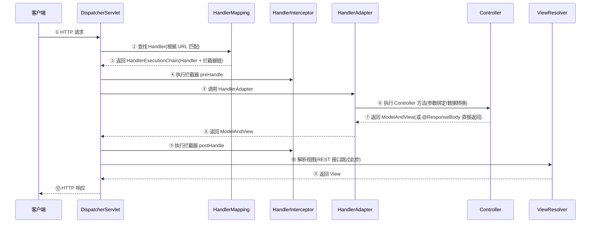

# Spring MVC 请求处理流程

---

## 1. 整体架构概述

`DispatcherServlet` 作为前端控制器，是所有 HTTP 请求的统一入口。请求到达后，由 `HandlerMapping` 查找对应的处理器（Handler），经由 `HandlerAdapter` 适配调用，最终通过 `ViewResolver` 解析视图并返回响应。这一设计将请求路由、处理器调用、视图渲染三个关注点彻底解耦。

---

## 2. 完整请求处理时序



---

## 3. 关键组件职责

| 组件 | 职责 | 设计意义 |
|------|------|------------|
| `DispatcherServlet` | 前端控制器，所有请求的统一入口，负责整体调度 | 集中处理，避免各 Servlet 重复实现路由逻辑 |
| `HandlerMapping` | 根据请求 URL 解析并定位对应的 Handler | 解耦 URL 路由与业务逻辑，支持多种映射策略 |
| `HandlerAdapter` | 适配不同类型的 Handler，提供统一调用接口 | 适配器模式，兼容 `@Controller`、`HttpRequestHandler` 等多种 Handler 类型 |
| `HandlerInterceptor` | 拦截器，在 Handler 执行前后插入横切逻辑 | 实现认证校验、日志记录等横切关注点 |
| `ViewResolver` | 将逻辑视图名解析为具体 View 对象 | REST 接口场景下不参与，前后端分离架构中可忽略 |

### Handler 的含义

Handler 即**负责处理当前请求的具体 Controller 方法**，对应开发者声明的 `@RequestMapping` 方法。

Spring 容器启动时扫描所有 `@Controller` 类，将每个映射方法注册至 `HandlerMapping` 的映射注册表中：

```
映射表（RequestMappingHandlerMapping 维护）：
  GET  /api/users        → UserController.listUsers()
  GET  /api/users/{id}   → UserController.getUser()
  POST /api/users        → UserController.createUser()
  ...
```

请求到达后，框架在注册表中执行路径匹配，定位目标方法并交由 `HandlerAdapter` 完成调用。

### HandlerMapping 的初始化与查找机制

**映射注册表在应用启动阶段完成构建**，请求处理阶段直接查表，不执行重复扫描。

#### 启动阶段（一次性构建）

```
Spring 容器启动
  → 扫描所有 @Controller 类
  → 解析每个 @RequestMapping 方法（路径、HTTP 方法、参数条件等）
  → 注册到 MappingRegistry（一个 Map 结构）
  → 完成，映射表固定不变
```

`RequestMappingHandlerMapping` 实现了 `InitializingBean` 接口，在 `afterPropertiesSet()` 中完成所有映射的注册，这个过程只发生一次。

#### 请求阶段（缓存查找）

每次请求到达时，`HandlerMapping` 的查找流程如下：

```
请求进来：GET /api/users/123
  ↓
先查 lookupPath 缓存（已解析过的路径直接命中）
  ↓ 未命中
遍历 MappingRegistry 中的所有映射，按条件匹配
  ↓ 找到多个候选
按优先级排序，取最精确的那个
  ↓
将结果写入缓存，下次同样的路径直接命中
  ↓
返回 HandlerExecutionChain
```

Spring MVC 内部有两层缓存：

| 缓存 | 作用 |
|---|---|
| `pathLookupCache` | URL 路径 → 映射信息，精确路径直接命中，无需遍历 |
| `HandlerExecutionChain` 组装 | 每次请求都会重新组装（因为拦截器匹配依赖当前请求的路径） |

> **说明**：`HandlerExecutionChain`（Handler + 拦截器列表）在每次请求时动态组装，原因是拦截器的 `addPathPatterns` / `excludePathPatterns` 需要依据当前请求路径进行匹配。Handler 本身的查找命中缓存，性能开销极低。

#### 小结

> **映射表在启动阶段构建完毕，Handler 查找命中缓存，拦截器链在每次请求时动态匹配组装。**

### 为何先定位 Handler，再执行拦截器

表面上看，先执行拦截器可以提前终止无效请求，但这一思路在 Spring MVC 的设计中并不成立，原因有两点：

1. **拦截器链依附于 Handler**：`HandlerMapping.getHandler()` 返回的是 `HandlerExecutionChain`，其中同时包含 Handler 与匹配的拦截器列表。Handler 定位与拦截器链组装属于**同一操作**，并非两个独立步骤。

2. **Handler 不存在时直接响应 404**：若请求 URL 无对应 Handler，框架直接返回 404，拦截器不参与执行。拦截器的职责是在"存在 Handler 处理该请求"的前提下执行横切逻辑，而非承担路由判断的职能。

```
HandlerMapping.getHandler(request)
  └── 返回 HandlerExecutionChain {
        handler:      UserController.getUser()   // Handler
        interceptors: [AuthInterceptor, LogInterceptor]  // 与该路径匹配的拦截器
      }
```

所以流程是：**先找到 Handler（同时确定拦截器链）→ 再按顺序执行拦截器 preHandle → 再调用 Handler**。

---

## 4. 拦截器详解

### 执行顺序

拦截器的执行顺序由**注册顺序**决定，`preHandle` 按注册顺序正序执行，`postHandle` 与 `afterCompletion` 按注册顺序逆序执行，整体呈对称的栈式结构：

```java
@Configuration
public class WebConfig implements WebMvcConfigurer {
    @Override
    public void addInterceptors(InterceptorRegistry registry) {
        registry.addInterceptor(new AuthInterceptor());   // 第1个注册
        registry.addInterceptor(new LogInterceptor());    // 第2个注册
        registry.addInterceptor(new TraceInterceptor());  // 第3个注册
    }
}
```

```
请求进入
  → AuthInterceptor.preHandle()      ← 第1个
  → LogInterceptor.preHandle()       ← 第2个
  → TraceInterceptor.preHandle()     ← 第3个
  → Controller 方法执行
  → TraceInterceptor.postHandle()    ← 反序第3个
  → LogInterceptor.postHandle()      ← 反序第2个
  → AuthInterceptor.postHandle()     ← 反序第1个
  → 渲染视图
  → TraceInterceptor.afterCompletion()
  → LogInterceptor.afterCompletion()
  → AuthInterceptor.afterCompletion()
```

### preHandle 返回 false 时的处理机制

```
AuthInterceptor.preHandle()  → true  ✅
LogInterceptor.preHandle()   → false ❌ 终止！

此时：
  TraceInterceptor.preHandle()     不执行
  Controller 方法                  不执行
  所有 postHandle()                不执行
  AuthInterceptor.afterCompletion() 会执行（已执行过 preHandle 的都会执行）
  LogInterceptor.afterCompletion()  不执行（自己返回了 false）
```

`afterCompletion` 的设计目的是**资源清理**，因此凡是已成功执行 `preHandle` 的拦截器，无论后续流程是否发生异常，均会执行 `afterCompletion`。

### 生产环境中的拦截器配置实践

实际项目中，**多数接口共用同一套拦截器配置**，通过路径规则进行分组管理，而非为每个接口单独配置：

```java
@Override
public void addInterceptors(InterceptorRegistry registry) {
    // 链路追踪：所有接口都要
    registry.addInterceptor(new TraceInterceptor())
            .addPathPatterns("/**");

    // 认证：大部分接口要，少数公开接口排除
    registry.addInterceptor(new AuthInterceptor())
            .addPathPatterns("/**")
            .excludePathPatterns("/api/login", "/api/register", "/actuator/**");

    // 管理后台专用
    registry.addInterceptor(new AdminInterceptor())
            .addPathPatterns("/admin/**");
}
```

| 分组 | 路径规则 | 拦截器 |
|---|---|---|
| 全局 | `/**` | 日志、链路追踪 |
| 需登录的接口 | `/**` 排除白名单 | 认证 |
| 管理后台 | `/admin/**` | 管理员权限校验 |
| 开放接口 | `/open/**` | 签名验证、限流 |
| 内部接口 | `/internal/**` | 内网 IP 校验 |

**细粒度权限控制不建议在拦截器中实现**，应通过注解结合 AOP 完成：

```java
// 拦截器 → 粗粒度，按路径分组：限定某类接口的访问条件
// 注解   → 细粒度，按方法声明：限定具体接口所需的操作权限
@RequiresPermission("user:delete")
@DeleteMapping("/users/{id}")
public void deleteUser(@PathVariable Long id) { ... }
```

---

## 5. 参数校验的层次

Spring 参数校验（`@Valid` / `@Validated`）并非拦截器机制，而是**框架内置的校验能力**，在不同层次有不同的实现方式：

```
请求进来
   ↓
Filter（过滤器）              ← Servlet 层
   ↓
HandlerInterceptor.preHandle  ← Spring MVC 拦截器层
   ↓
参数绑定 & 参数校验            ← Spring MVC 内部（DataBinder + Validator）
   ↓
Controller 方法执行
   ↓
AOP（@Transactional 等）      ← Spring AOP 层
   ↓
Service / 业务逻辑
```

| | Controller 层 `@Valid` | Service 层 `@Validated` |
|---|---|---|
| 实现机制 | Spring MVC 参数绑定 | Spring AOP 动态代理 |
| 触发时机 | 参数解析阶段 | 方法调用前 |
| 失败异常 | `MethodArgumentNotValidException` | `ConstraintViolationException` |
| 是否走 AOP | ❌ 不走 | ✅ 走 |

```java
// Controller 层：Spring MVC 参数绑定阶段触发，不走 AOP
@PostMapping("/users")
public void create(@RequestBody @Valid UserDTO dto) { ... }

// Service 层：AOP 动态代理触发，需要 @Validated 在类上
@Service
@Validated
public class UserService {
    public void create(@NotNull @Valid UserDTO dto) { ... }
}
```

---

## 6. 拦截器 vs 过滤器

| 对比项 | HandlerInterceptor（拦截器） | Filter（过滤器） |
|--------|---------------------------|----------------|
| 规范 | Spring MVC 特有 | Servlet 规范，与框架无关 |
| 作用范围 | 只拦截 DispatcherServlet 处理的请求 | 拦截所有请求（包括静态资源） |
| 能否访问 Spring Bean | ✅ 可以（本身就是 Spring Bean） | ❌ 不能直接访问（需要手动获取） |
| 执行时机 | Handler 执行前后（更细粒度） | 请求进入 Servlet 前后 |
| 适用场景 | 登录校验、权限控制、日志 | 字符编码、跨域处理、请求日志 |

> **两者并存的原因**：过滤器属于 Servlet 规范，无法访问 Spring 容器中的 Bean 及 MVC 上下文；拦截器是 Spring MVC 的扩展点，可访问 Handler 信息与 `ModelAndView`，更适合承载业务层面的拦截逻辑。

---

## 7. @Controller vs @RestController

```java
// @Controller：返回视图名（传统 MVC）
@Controller
public class PageController {
    @GetMapping("/home")
    public String home(Model model) {
        model.addAttribute("user", "Tom");
        return "home"; // 返回视图名，由 ViewResolver 解析
    }
}

// @RestController = @Controller + @ResponseBody
// 返回值直接序列化为 JSON，不经过 ViewResolver
@RestController
public class ApiController {
    @GetMapping("/api/user")
    public User getUser() {
        return new User("Tom", 18); // 自动序列化为 JSON
    }
}
```

---

## 8. @RestController 序列化原理

### 序列化链路

`@RestController` = `@Controller` + `@ResponseBody`。`@ResponseBody` 告知 `HandlerAdapter`：不走 `ViewResolver`，直接将返回值通过 `HttpMessageConverter` 写入响应体。

```
Controller 方法返回对象
    ↓
HandlerAdapter 检测到 @ResponseBody
    ↓
遍历已注册的 HttpMessageConverter 列表
    ↓
根据请求 Accept 头 & 返回值类型，选择合适的 Converter
    ↓（通常选中 MappingJackson2HttpMessageConverter）
Jackson ObjectMapper 将对象序列化为 JSON 字节流
    ↓
写入 HttpServletResponse 输出流
```

### HttpMessageConverter 的选择逻辑

Spring MVC 默认注册了多个 Converter，按顺序匹配：

| Converter | 处理类型 |
|---|---|
| `StringHttpMessageConverter` | `String` 类型，直接写入 |
| `MappingJackson2HttpMessageConverter` | 对象 → JSON（最常用） |
| `Jaxb2RootElementHttpMessageConverter` | 对象 → XML |
| `ByteArrayHttpMessageConverter` | `byte[]` 类型 |

选择依据是**请求的 `Accept` 头**与**返回值类型**的双向匹配，客户端声明 `Accept: application/json` 时优先选中 Jackson Converter。

### 使用注意事项

**① 字段可见性：Jackson 默认只序列化有 getter 的字段**

```java
public class User {
    private String name;     // ✅ 有 getter，会被序列化
    private String password; // ❌ 无 getter，不会序列化
}
```

**② 常用 Jackson 注解**

```java
public class User {
    @JsonProperty("user_name")                        // 自定义序列化字段名
    private String name;

    @JsonIgnore                                       // 排除该字段，不序列化
    private String password;

    @JsonFormat(pattern = "yyyy-MM-dd HH:mm:ss")     // 日期格式化
    private LocalDateTime createTime;

    @JsonInclude(JsonInclude.Include.NON_NULL)        // null 值不序列化
    private String remark;
}
```

**③ 循环引用问题**

```java
// ❌ 双向关联导致无限递归，序列化时栈溢出
public class Order { private User user; }
public class User  { private List<Order> orders; }  // 循环！

// ✅ 方案一：@JsonIgnore 断开循环
public class User {
    @JsonIgnore
    private List<Order> orders;
}

// ✅ 方案二：@JsonManagedReference + @JsonBackReference
public class Order {
    @JsonManagedReference
    private User user;
}
public class User {
    @JsonBackReference   // 该字段不序列化
    private List<Order> orders;
}
```

**④ 返回 `String` 类型的特殊行为**

```java
// ⚠️ 返回 String 时，StringHttpMessageConverter 优先于 Jackson
// 直接将字符串写入响应体，不会加引号
@GetMapping("/name")
public String getName() {
    return "Tom";  // 响应体：Tom（不是 "Tom"）
}

// 若需要返回标准 JSON 结构，应返回对象
@GetMapping("/name")
public Map<String, String> getName() {
    return Map.of("name", "Tom");  // 响应体：{"name":"Tom"}
}
```

**⑤ 多态类型序列化**

```java
// ❌ 父类引用指向子类对象，默认只序列化父类字段，子类特有字段丢失
public abstract class Animal { private String name; }
public class Dog extends Animal { private String breed; }

// ✅ 加上类型信息注解
@JsonTypeInfo(use = JsonTypeInfo.Id.NAME, property = "type")
@JsonSubTypes({
    @JsonSubTypes.Type(value = Dog.class, name = "dog")
})
public abstract class Animal { ... }
```

**⑥ 全局配置 ObjectMapper**

```java
@Configuration
public class JacksonConfig {
    @Bean
    public ObjectMapper objectMapper() {
        return Jackson2ObjectMapperBuilder.json()
            .featuresToDisable(SerializationFeature.WRITE_DATES_AS_TIMESTAMPS)
            .featuresToDisable(DeserializationFeature.FAIL_ON_UNKNOWN_PROPERTIES)
            .simpleDateFormat("yyyy-MM-dd HH:mm:ss")
            .build();
    }
}
```

### 注意事项汇总

| 注意点 | 说明 |
|---|---|
| 字段可见性 | 默认需要 getter，或配置 `@JsonAutoDetect` |
| null 值处理 | 默认序列化 null，可用 `@JsonInclude` 排除 |
| 日期格式 | 默认序列化为时间戳，需配置 `@JsonFormat` 或全局 ObjectMapper |
| 循环引用 | 双向关联必须用 `@JsonIgnore` 或 `@JsonManagedReference` 断开 |
| 返回 String | 不走 Jackson，直接写入，行为与其他类型不同 |
| 多态类型 | 子类特有字段默认丢失，需要 `@JsonTypeInfo` 保留类型信息 |

---

## 9. 常见问题

**Q1：Spring MVC 的请求处理流程？**
> ① 请求到达 DispatcherServlet → ② HandlerMapping 找到 Handler → ③ 执行拦截器 preHandle → ④ HandlerAdapter 调用 Controller → ⑤ 返回 ModelAndView → ⑥ 执行拦截器 postHandle → ⑦ ViewResolver 解析视图（REST 接口跳过）→ ⑧ 渲染响应。

**Q2：为什么先找 Handler 再执行拦截器？**
> `HandlerMapping.getHandler()` 返回的是 `HandlerExecutionChain`，Handler 和拦截器链是同时组装的，是一个动作而非两个。另外，找不到 Handler 直接 404，也没必要执行拦截器。

**Q3：拦截器的执行顺序是怎么确定的？**
> 由注册顺序决定。`preHandle` 按注册顺序正序执行；`postHandle` 和 `afterCompletion` 反序执行。若某个 `preHandle` 返回 false，后续拦截器和 Controller 不再执行，但已执行过 `preHandle` 的拦截器会执行 `afterCompletion` 做资源清理。

**Q4：拦截器和过滤器的区别？**
> 过滤器是 Servlet 规范，拦截所有请求，无法访问 Spring Bean；拦截器是 Spring MVC 扩展点，只拦截 DispatcherServlet 处理的请求，可以访问 Spring Bean 和 Handler 信息，更适合业务拦截逻辑。

**Q5：Spring 参数校验是哪个层面的？**
> Controller 层的 `@Valid` 是 Spring MVC 参数绑定阶段触发，不走 AOP；Service 层的 `@Validated` 是 Spring AOP 动态代理触发。两者底层都依赖 JSR-303（Bean Validation）规范，由 Hibernate Validator 实现。

**Q6：`@RestController` 的序列化是如何实现的？**
> `@RestController` = `@Controller` + `@ResponseBody`。`@ResponseBody` 使 `HandlerAdapter` 跳过 `ViewResolver`，将返回值交由 `HttpMessageConverter` 处理。默认使用 `MappingJackson2HttpMessageConverter`，通过 Jackson `ObjectMapper` 将对象序列化为 JSON 写入响应体。具体选用哪个 Converter 由请求的 `Accept` 头与返回值类型共同决定。使用时需注意：字段需有 getter 才会被序列化；返回 `String` 类型时走 `StringHttpMessageConverter` 而非 Jackson；双向关联对象需用 `@JsonIgnore` 等注解断开循环引用；日期默认序列化为时间戳，需通过 `@JsonFormat` 或全局 `ObjectMapper` 配置格式。

**一句话口诀**：DispatcherServlet 是总调度，HandlerMapping 找处理器（同时组装拦截器链），拦截器 preHandle 正序执行，HandlerAdapter 适配调用，postHandle 反序执行，ViewResolver 解析视图，afterCompletion 反序清理。