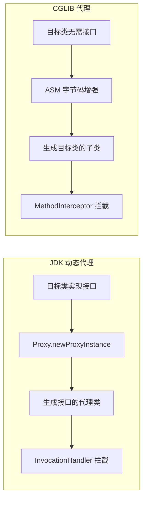

# AOP —— 面向切面编程

---

## 1. 类比：AOP 就像高速公路收费站

所有车辆（方法调用）都必须经过收费站（代理对象），收费站可以在车辆通过前后做任何事（记录日志、收费、检查），但司机（业务代码）不需要关心这些。

---

## 2. 为什么需要 AOP？

```java
// ❌ 没有 AOP：每个方法都要写日志，代码重复且耦合
public void createOrder() {
    log.info("开始创建订单");
    // 业务逻辑...
    log.info("订单创建完成");
}

// ✅ 使用 AOP：业务代码干净，横切逻辑集中管理
@Aspect
@Component
public class LogAspect {
    @Around("execution(* com.example.service.*.*(..))")
    public Object log(ProceedingJoinPoint pjp) throws Throwable {
        log.info("方法开始: {}", pjp.getSignature());
        Object result = pjp.proceed();
        log.info("方法结束: {}", pjp.getSignature());
        return result;
    }
}
```

---

## 3. 两种动态代理对比



| 对比项 | JDK 动态代理 | CGLIB |
|--------|------------|-------|
| 要求 | 目标类必须实现接口 | 无需接口，但目标类不能是 `final` |
| 原理 | 反射生成接口代理 | ASM 字节码生成子类 |
| 性能 | JDK 8+ 后性能相近 | 创建代理稍慢，调用稍快 |
| Spring Boot 默认 | Spring Boot 2.x 之前默认 | **Spring Boot 2.x 后默认 CGLIB** |

> **为什么 JDK 代理要求目标类实现接口**：这是 **Java 单继承限制 + 时代设计哲学**的共同产物。
> - **技术原因**：JDK 动态代理生成的代理类已经固定 `extends Proxy`，Java 单继承导致无法再继承目标类，只能通过接口建立代理类与目标类之间的"契约"——两者都实现同一个接口，调用方只认接口，代理类就可以无缝替换目标类。
> - **设计哲学**：Java 1.3（2000年）设计时，"面向接口编程"是主流思想，设计者认为"你的 Service 本来就应该有接口"，这不是限制，而是在强制推行好的设计习惯。
>
> **为什么后来大量项目出现"一个接口只有一个实现"**：随着 Spring 的普及，开发者机械地套用"面向接口编程"原则，给每个 Service 都写了接口，哪怕这个接口永远不会有第二个实现。接口本来是为了"多实现、可替换"，但大量接口永远只有一个实现，导致接口膨胀、重构成本高、语义被稀释。
>
> **为什么 Spring Boot 2.x 后默认改为 CGLIB**：实际项目中大量 Service 类没有接口（直接 `@Service` 注解），JDK 代理无法处理。CGLIB 通过继承目标类、重写方法来生成代理，无需接口即可代理，覆盖面更广，减少了"AOP 不生效"的配置问题。

---

## 4. AOP 不生效的经典场景（深度分析）

```java
@Service
public class OrderService {

    public void createOrder() {
        // ❌ 同类内部调用：this 指向原始对象，而非代理对象
        // Spring AOP 的增强逻辑在代理对象的拦截器链中
        // 绕过代理 = 绕过了所有增强（日志、事务等）
        this.sendNotification();
    }

    @Transactional // 事务注解也是 AOP，同样不生效
    public void sendNotification() { ... }
}
```

**根本原因**：Spring AOP 是基于代理的，调用方持有的是代理对象的引用，但 `this` 关键字指向的是原始对象（被代理的那个），代理对象的拦截器链根本没有机会执行。

```java
// ✅ 解决方案1：注入自身代理（让 Spring 注入代理对象）
@Service
public class OrderService {
    @Autowired
    private OrderService self; // Spring 注入的是代理对象

    public void createOrder() {
        self.sendNotification(); // 通过代理调用，AOP 生效
    }
}

// ✅ 解决方案2：从 ApplicationContext 获取代理
@Service
public class OrderService {
    @Autowired
    private ApplicationContext ctx;

    public void createOrder() {
        ctx.getBean(OrderService.class).sendNotification();
    }
}
```

---

## 5. AOP 核心术语

| 术语 | 含义 | 示例 |
|------|------|------|
| **Aspect（切面）** | 横切关注点的模块化，包含 Advice 和 Pointcut | `LogAspect` 类 |
| **Pointcut（切点）** | 定义在哪些方法上应用增强 | `execution(* com.example.service.*.*(..))` |
| **Advice（通知）** | 在切点处执行的增强逻辑 | `@Before`、`@After`、`@Around` |
| **JoinPoint（连接点）** | 程序执行的某个点（方法调用、异常抛出等） | 方法执行时 |
| **Weaving（织入）** | 将切面应用到目标对象的过程 | Spring 在运行时通过代理织入 |

---

## 6. AspectJ 与 Spring AOP 是什么关系？

先搞清楚这两个概念在哪个层级：

| | AspectJ | Spring AOP |
|---|---|---|
| **是什么** | Java 生态中最完整的 AOP 框架，独立于 Spring | Spring 框架内置的 AOP 实现 |
| **定位** | AOP 的"标准"和"全集" | AOP 的"子集"，够用就好 |
| **织入时机** | 编译期 / 类加载期（需要特殊编译器 ajc） | 运行期（通过 JDK 代理或 CGLIB 生成代理对象） |
| **能拦截什么** | 几乎一切：方法、构造器、字段访问、静态代码块 | 只能拦截 Spring 容器管理的 Bean 的 **public 方法** |
| **使用门槛** | 高，需要额外工具链 | 低，加注解即用 |

> **关系类比**：AspectJ 是"完整版 AOP 规范"，Spring AOP 是"够用的简化版"。Spring AOP 借用了 AspectJ 的**注解语法**（`@Aspect`、`@Before`、`@Around` 等），但底层实现完全不同——Spring AOP 用的是动态代理，而不是 AspectJ 的字节码织入。
>
> 所以你在 Spring 项目里写的 `@Aspect` 切面，**用的是 AspectJ 的注解，走的是 Spring AOP 的代理机制**，两者并不冲突。

---

## 7. 面试高频问题

**Q1：Spring AOP 和 AspectJ 的区别？**
> Spring AOP 是**运行时代理**（JDK/CGLIB），只能拦截 Spring 容器管理的 Bean 的方法调用；AspectJ 是**编译时/加载时织入**，功能更强大，可以拦截任意代码（包括构造器、字段访问），但需要特殊编译器。Spring AOP 已能满足大多数业务需求。

**Q2：为什么 Spring Boot 2.x 后默认使用 CGLIB 代理？**
> 根本原因是 JDK 代理有两个历史包袱：
> - **技术层面**：JDK 代理类已固定 `extends Proxy`，Java 单继承导致无法再继承目标类，只能依赖接口；
> - **设计层面**：Java 1.3（2000年）设计时推崇"面向接口编程"，强制要求目标类实现接口，导致项目中出现大量"一个接口只有一个实现"的冗余代码——接口膨胀、重构成本高，却毫无实际意义。
>
> 随着 Spring 普及，大量 Service 直接用 `@Service` 而不写接口，JDK 代理无法处理这类场景，"AOP 不生效"问题频发。Spring Boot 2.x 改为默认 CGLIB，通过继承目标类生成子类，无需接口即可代理，彻底解决了这个问题。

**Q3：AOP 切面不生效怎么排查？**
> 按以下顺序排查：① 是否同类内部调用（`this.method()`）；② 方法是否是 `public`；③ 类是否被 Spring 管理（是否有 `@Component` 等注解）；④ 切点表达式是否正确匹配。

**一句话口诀**：AOP 靠代理拦截，`this` 调用绕过代理，CGLIB 生成子类，JDK 代理需要接口。