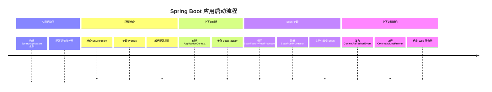
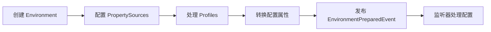
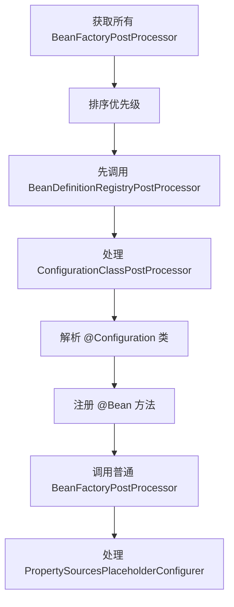

# Spring 容器启动流程深度解析

---

## 概述

Spring 容器启动是一个复杂的过程，涉及多个阶段的协调工作。理解这个流程对于排查启动问题、性能优化和自定义扩展至关重要。



## 详细启动流程

### 1. SpringApplication 初始化

```java
// SpringApplication 构造方法核心逻辑
public SpringApplication(ResourceLoader resourceLoader, Class<?>... primarySources) {
    this.resourceLoader = resourceLoader;
    this.primarySources = new LinkedHashSet<>(Arrays.asList(primarySources));
    this.webApplicationType = WebApplicationType.deduceFromClasspath();
    setInitializers((Collection) getSpringFactoriesInstances(ApplicationContextInitializer.class));
    setListeners((Collection) getSpringFactoriesInstances(ApplicationListener.class));
    this.mainApplicationClass = deduceMainApplicationClass();
}
```

**关键步骤：**
- 推断 Web 应用类型（Servlet、Reactive、None）
- 加载 `ApplicationContextInitializer` 实例
- 加载 `ApplicationListener` 实例
- 推断主应用类

### 2. run() 方法执行流程

```java
public ConfigurableApplicationContext run(String... args) {
    StopWatch stopWatch = new StopWatch();
    stopWatch.start();
    
    ConfigurableApplicationContext context = null;
    Collection<SpringBootExceptionReporter> exceptionReporters = new ArrayList<>();
    configureHeadlessProperty();
    
    // 1. 获取并启动监听器
    SpringApplicationRunListeners listeners = getRunListeners(args);
    listeners.starting();
    
    try {
        // 2. 准备环境
        ApplicationArguments applicationArguments = new DefaultApplicationArguments(args);
        ConfigurableEnvironment environment = prepareEnvironment(listeners, applicationArguments);
        
        // 3. 打印 Banner
        Banner printedBanner = printBanner(environment);
        
        // 4. 创建应用上下文
        context = createApplicationContext();
        
        // 5. 准备上下文
        prepareContext(context, environment, listeners, applicationArguments, printedBanner);
        
        // 6. 刷新上下文（核心！）
        refreshContext(context);
        
        // 7. 刷新后处理
        afterRefresh(context, applicationArguments);
        
        stopWatch.stop();
        if (this.logStartupInfo) {
            new StartupInfoLogger(this.mainApplicationClass)
                .logStarted(getApplicationLog(), stopWatch);
        }
        
        listeners.started(context);
        
        // 8. 执行 Runner
        callRunners(context, applicationArguments);
        
        listeners.running(context);
        return context;
    } catch (Throwable ex) {
        handleRunFailure(context, ex, exceptionReporters, listeners);
        throw new IllegalStateException(ex);
    }
}
```

### 3. 环境准备（prepareEnvironment）



**PropertySource 加载顺序：**
1. 命令行参数 (`CommandLinePropertySource`)
2. JNDI 属性
3. Java 系统属性 (`System.getProperties()`)
4. 操作系统环境变量
5. RandomValuePropertySource
6. 应用配置文件（application-{profile}.yml/properties）
7. @PropertySource 注解
8. 默认属性

### 4. 上下文创建（createApplicationContext）

根据 Web 应用类型创建不同的 ApplicationContext：

| 应用类型 | Context 类 | 特点 |
|---------|-----------|------|
| Servlet | `AnnotationConfigServletWebServerApplicationContext` | 支持 Servlet 容器 |
| Reactive | `AnnotationConfigReactiveWebServerApplicationContext` | 响应式 Web 容器 |
| None | `AnnotationConfigApplicationContext` | 普通应用上下文 |

### 5. 上下文准备（prepareContext）

```java
private void prepareContext(ConfigurableApplicationContext context, 
                          ConfigurableEnvironment environment, 
                          SpringApplicationRunListeners listeners, 
                          ApplicationArguments applicationArguments, 
                          Banner printedBanner) {
    
    // 设置环境
    context.setEnvironment(environment);
    
    // 后处理上下文
    postProcessApplicationContext(context);
    
    // 应用初始化器
    applyInitializers(context);
    
    // 发布事件
    listeners.contextPrepared(context);
    
    // 注册 shutdown hook
    if (this.registerShutdownHook) {
        registerShutdownHook(context);
    }
    
    // 发布 ContextPreparedEvent
    listeners.contextLoaded(context);
}
```

### 6. 上下文刷新（refreshContext） - 核心！

`AbstractApplicationContext.refresh()` 方法包含 12 个关键步骤：

```java
public void refresh() throws BeansException, IllegalStateException {
    synchronized (this.startupShutdownMonitor) {
        // 1. 准备刷新
        prepareRefresh();
        
        // 2. 获取 BeanFactory（刷新内部工厂）
        ConfigurableListableBeanFactory beanFactory = obtainFreshBeanFactory();
        
        // 3. 准备 BeanFactory
        prepareBeanFactory(beanFactory);
        
        try {
            // 4. 后处理 BeanFactory
            postProcessBeanFactory(beanFactory);
            
            // 5. 调用 BeanFactoryPostProcessor
            invokeBeanFactoryPostProcessors(beanFactory);
            
            // 6. 注册 BeanPostProcessor
            registerBeanPostProcessors(beanFactory);
            
            // 7. 初始化消息源
            initMessageSource();
            
            // 8. 初始化事件广播器
            initApplicationEventMulticaster();
            
            // 9. 初始化特殊 Bean
            onRefresh();
            
            // 10. 注册监听器
            registerListeners();
            
            // 11. 完成 BeanFactory 初始化（实例化单例 Bean）
            finishBeanFactoryInitialization(beanFactory);
            
            // 12. 完成刷新
            finishRefresh();
        } catch (BeansException ex) {
            // 清理资源
            destroyBeans();
            cancelRefresh(ex);
            throw ex;
        }
    }
}
```

### 7. BeanFactoryPostProcessor 调用流程



**ConfigurationClassPostProcessor 关键作用：**
- 解析 `@Configuration` 类
- 处理 `@ComponentScan` 扫描包路径
- 处理 `@Import` 导入的其他配置
- 处理 `@Bean` 方法注册

### 8. Bean 实例化流程（finishBeanFactoryInitialization）

```java
protected void finishBeanFactoryInitialization(ConfigurableListableBeanFactory beanFactory) {
    // 初始化 ConversionService
    if (beanFactory.containsBean(CONVERSION_SERVICE_BEAN_NAME) && 
        beanFactory.isTypeMatch(CONVERSION_SERVICE_BEAN_NAME, ConversionService.class)) {
        beanFactory.setConversionService(
            beanFactory.getBean(CONVERSION_SERVICE_BEAN_NAME, ConversionService.class));
    }
    
    // 初始化 LoadTimeWeaverAware Bean
    if (!beanFactory.containsTempClassLoader() && 
        beanFactory.isTypeMatch(LOAD_TIME_WEAVER_BEAN_NAME, LoadTimeWeaver.class)) {
        beanFactory.addBeanPostProcessor(new LoadTimeWeaverAwareProcessor(beanFactory));
        beanFactory.setTempClassLoader(new ContextTypeMatchClassLoader(beanFactory.getBeanClassLoader()));
    }
    
    // 停止冻结配置
    beanFactory.freezeConfiguration();
    
    // 预实例化单例 Bean
    beanFactory.preInstantiateSingletons();
}
```

**单例 Bean 实例化步骤：**
1. 获取所有 Bean 定义名称
2. 遍历每个 Bean 定义
3. 如果是单例且非懒加载，调用 `getBean()`
4. `getBean()` → `doGetBean()` → `createBean()` → `doCreateBean()`

### 9. Bean 创建详细流程（doCreateBean）

```java
protected Object doCreateBean(String beanName, RootBeanDefinition mbd, @Nullable Object[] args) {
    // 1. 实例化 Bean
    BeanWrapper instanceWrapper = createBeanInstance(beanName, mbd, args);
    
    // 2. 应用 MergedBeanDefinitionPostProcessor
    applyMergedBeanDefinitionPostProcessors(mbd, beanType, beanName);
    
    // 3. 属性注入（解决循环依赖）
    populateBean(beanName, mbd, instanceWrapper);
    
    // 4. 初始化 Bean
    exposedObject = initializeBean(beanName, exposedObject, mbd);
    
    // 5. 注册 disposable Bean
    registerDisposableBeanIfNecessary(beanName, bean, mbd);
    
    return exposedObject;
}
```

### 10. 初始化 Bean（initializeBean）

```java
protected Object initializeBean(String beanName, Object bean, @Nullable RootBeanDefinition mbd) {
    // 1. 调用 Aware 方法
    invokeAwareMethods(beanName, bean);
    
    // 2. 应用 BeanPostProcessor 前置处理
    Object wrappedBean = bean;
    if (mbd == null || !mbd.isSynthetic()) {
        wrappedBean = applyBeanPostProcessorsBeforeInitialization(wrappedBean, beanName);
    }
    
    // 3. 调用初始化方法
    invokeInitMethods(beanName, wrappedBean, mbd);
    
    // 4. 应用 BeanPostProcessor 后置处理（AOP 代理在这里生成）
    if (mbd == null || !mbd.isSynthetic()) {
        wrappedBean = applyBeanPostProcessorsAfterInitialization(wrappedBean, beanName);
    }
    
    return wrappedBean;
}
```

## 关键扩展点详解

### 1. ApplicationContextInitializer

在上下文刷新前执行，用于自定义上下文配置：

```java
public class CustomContextInitializer implements ApplicationContextInitializer<ConfigurableApplicationContext> {
    @Override
    public void initialize(ConfigurableApplicationContext applicationContext) {
        // 自定义环境配置
        ConfigurableEnvironment environment = applicationContext.getEnvironment();
        environment.addActiveProfile("custom");
        
        // 添加自定义 PropertySource
        Map<String, Object> customProperties = new HashMap<>();
        customProperties.put("custom.property", "value");
        environment.getPropertySources()
            .addFirst(new MapPropertySource("customProperties", customProperties));
    }
}
```

**注册方式：**
- `META-INF/spring.factories`:
  ```
  org.springframework.context.ApplicationContextInitializer=com.example.CustomContextInitializer
  ```
- SpringApplication.addInitializers()

### 2. BeanDefinitionRegistryPostProcessor

在 Bean 定义加载后、实例化前执行，用于修改 Bean 定义：

```java
@Component
public class CustomBeanDefinitionPostProcessor implements BeanDefinitionRegistryPostProcessor {
    
    @Override
    public void postProcessBeanDefinitionRegistry(BeanDefinitionRegistry registry) {
        // 动态注册 Bean 定义
        GenericBeanDefinition beanDefinition = new GenericBeanDefinition();
        beanDefinition.setBeanClass(CustomService.class);
        beanDefinition.setScope(BeanDefinition.SCOPE_SINGLETON);
        registry.registerBeanDefinition("customService", beanDefinition);
        
        // 修改现有 Bean 定义
        BeanDefinition existingDef = registry.getBeanDefinition("someBean");
        existingDef.setInitMethodName("customInit");
    }
    
    @Override
    public void postProcessBeanFactory(ConfigurableListableBeanFactory beanFactory) {
        // 修改 BeanFactory 配置
    }
}
```

### 3. ImportSelector 和 ImportBeanDefinitionRegistrar

用于动态导入配置：

```java
public class CustomImportSelector implements ImportSelector {
    @Override
    public String[] selectImports(AnnotationMetadata importingClassMetadata) {
        // 根据条件动态返回要导入的配置类
        if (isFeatureEnabled()) {
            return new String[]{"com.example.FeatureConfig"};
        }
        return new String[0];
    }
}

public class CustomImportBeanDefinitionRegistrar implements ImportBeanDefinitionRegistrar {
    @Override
    public void registerBeanDefinitions(AnnotationMetadata importingClassMetadata, 
                                      BeanDefinitionRegistry registry) {
        // 直接注册 Bean 定义
        RootBeanDefinition beanDefinition = new RootBeanDefinition(CustomBean.class);
        registry.registerBeanDefinition("customBean", beanDefinition);
    }
}
```

## 启动性能优化技巧

### 1. 减少组件扫描范围

```java
@SpringBootApplication(scanBasePackages = "com.example.main")
public class Application {
    public static void main(String[] args) {
        SpringApplication.run(Application.class, args);
    }
}
```

### 2. 使用懒加载

```java
@Configuration
public class LazyConfig {
    
    @Lazy
    @Bean
    public HeavyService heavyService() {
        return new HeavyService();
    }
}
```

### 3. 排除自动配置

```yaml
spring:
  autoconfigure:
    exclude:
      - org.springframework.boot.autoconfigure.jdbc.DataSourceAutoConfiguration
      - org.springframework.boot.autoconfigure.orm.jpa.HibernateJpaAutoConfiguration
```

### 4. 使用索引加速组件扫描

添加依赖：
```xml
<dependency>
    <groupId>org.springframework</groupId>
    <artifactId>spring-context-indexer</artifactId>
    <optional>true</optional>
</dependency>
```

生成 `META-INF/spring.components` 索引文件，加速 `@ComponentScan`。

## 常见启动问题排查

### 1. 启动缓慢排查步骤

1. **启用调试日志**：
   ```bash
   java -jar app.jar --debug
   ```

2. **分析组件扫描**：
   ```bash
   java -jar app.jar --spring.profiles.active=debug --logging.level.org.springframework.context=DEBUG
   ```

3. **使用 JMX 监控**：
   ```java
   @SpringBootApplication
   @EnableJmxExport
   public class Application { ... }
   ```

### 2. Bean 定义冲突

**症状**：`BeanDefinitionOverrideException`

**解决**：
```yaml
spring:
  main:
    allow-bean-definition-overriding: true
```

### 3. 循环依赖检测

Spring 默认支持字段注入的循环依赖，但构造器注入会报错：

```java
// 会报错
@Component
public class ServiceA {
    private final ServiceB serviceB;
    public ServiceA(ServiceB serviceB) { this.serviceB = serviceB; }
}

@Component
public class ServiceB {
    private final ServiceA serviceA;
    public ServiceB(ServiceA serviceA) { this.serviceA = serviceA; }
}
```

**解决**：改用字段注入或使用 `@Lazy`：
```java
@Component
public class ServiceA {
    @Lazy
    private final ServiceB serviceB;
    public ServiceA(@Lazy ServiceB serviceB) { this.serviceB = serviceB; }
}
```

## 实战：自定义启动过程

### 1. 自定义 Banner

在 `src/main/resources` 创建 `banner.txt`：
```
  ___  _  _  ____  _  _  ____  ____ 
 / __)( \/ )(  _ \( \/ )(  _ \(  _ \
( (__  )  /  ) _ ( )  /  ) _ ( )   /
 \___)(__/  (____/(__/  (____/(__\_)

Spring Boot: v${spring-boot.version}
App: ${application.name}
Profile: ${spring.profiles.active}
```

### 2. 自定义启动事件监听

```java
@Component
public class CustomApplicationListener implements ApplicationListener<ApplicationReadyEvent> {
    
    @Override
    public void onApplicationEvent(ApplicationReadyEvent event) {
        // 应用启动完成后执行
        ConfigurableApplicationContext context = event.getApplicationContext();
        HealthIndicator healthIndicator = context.getBean(HealthIndicator.class);
        Health health = healthIndicator.health();
        
        if (health.getStatus().equals(Status.UP)) {
            log.info("应用启动成功，健康状态: {}", health.getStatus());
        } else {
            log.warn("应用启动异常，健康状态: {}", health.getStatus());
        }
    }
}
```

### 3. 自定义 CommandLineRunner

```java
@Component
@Order(1) // 执行顺序
public class DatabaseInitializer implements CommandLineRunner {
    
    @Override
    public void run(String... args) throws Exception {
        // 应用启动后执行数据库初始化
        initializeDatabase();
    }
}
```

## 总结

Spring 容器启动是一个精心设计的多阶段过程，理解每个阶段的职责和扩展点对于高级开发至关重要。通过掌握：

1. **启动流程**：12 个刷新步骤的详细机制
2. **扩展点**：Initializer、PostProcessor、Import 机制
3. **性能优化**：组件扫描、懒加载、索引加速
4. **问题排查**：启动缓慢、循环依赖、Bean 冲突

您将能够更好地驾驭 Spring 框架，解决复杂的生产环境问题。