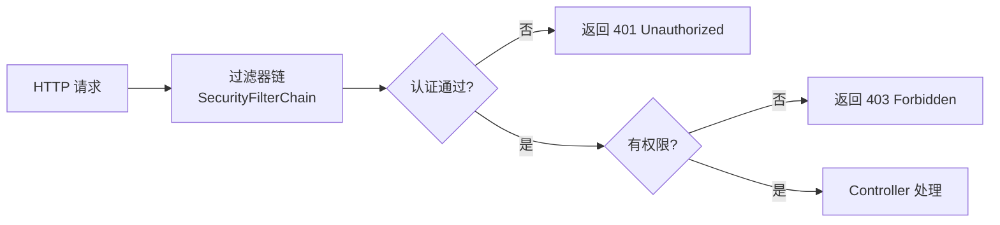
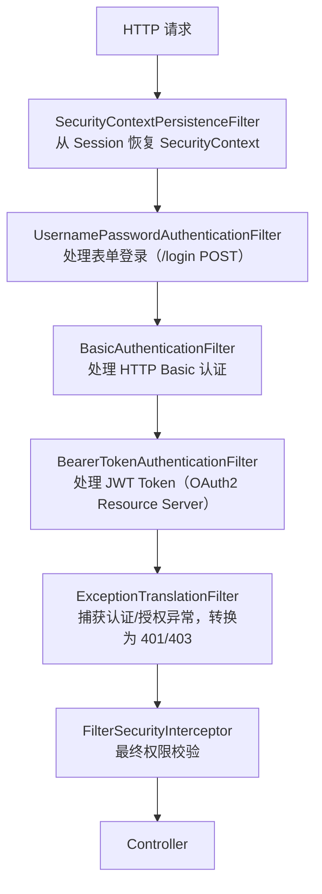
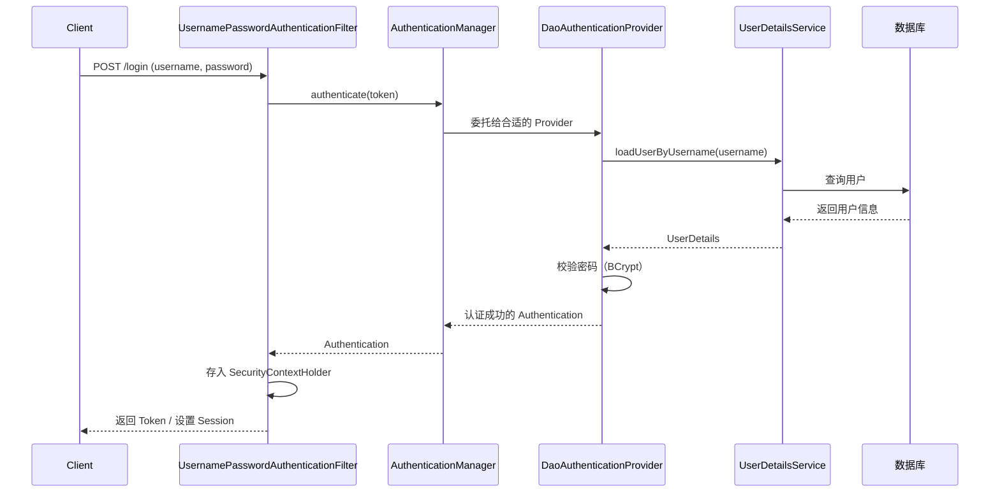
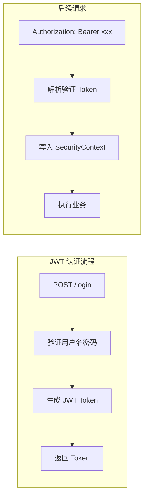

# Spring Security 认证与授权

> **定位**：本文是 Spring Security 的入门导读，帮助快速理解核心概念和整体架构。深入的代码实现、OAuth2 集成、安全最佳实践等内容请参阅 → [Spring 安全架构深度解析](@spring-微服务与安全-Spring安全架构深度解析)

---

## 1. 核心概念

Spring Security 解决两个核心问题：

- **认证（Authentication）**：你是谁？—— 验证用户身份（登录）
- **授权（Authorization）**：你能做什么？—— 控制资源访问权限



**一句话总结**：Spring Security = 过滤器链拦截请求 + `UserDetailsService` 加载用户 + `AuthenticationManager` 验证身份 + `AccessDecisionManager` 决策权限。

---

## 2. 过滤器链（核心架构）

Spring Security 本质是一条 **Servlet 过滤器链**，请求必须通过所有过滤器才能到达 Controller：



**关键过滤器说明**：

| 过滤器 | 作用 |
|--------|------|
| `SecurityContextPersistenceFilter` | 请求开始时从 Session 加载 `SecurityContext`，请求结束时保存回去 |
| `UsernamePasswordAuthenticationFilter` | 拦截登录请求，提取用户名密码，调用 `AuthenticationManager` 认证 |
| `ExceptionTranslationFilter` | 捕获 `AuthenticationException`（→401）和 `AccessDeniedException`（→403） |
| `FilterSecurityInterceptor` | 最终的权限决策，调用 `AccessDecisionManager` |

> 📖 完整的 30+ 过滤器执行顺序和自定义过滤器实现 → [深度解析 - 安全过滤器链](@spring-微服务与安全-Spring安全架构深度解析#spring-security-核心架构)

---

## 3. 认证流程



**核心接口一览**：

| 接口 | 职责 | 说明 |
|------|------|------|
| `UserDetailsService` | 加载用户信息 | 实现 `loadUserByUsername()` 从数据库查询用户 |
| `AuthenticationManager` | 认证管理器 | 委托给 `AuthenticationProvider` 执行认证 |
| `AuthenticationProvider` | 认证提供者 | 实际执行认证逻辑（密码校验等） |
| `PasswordEncoder` | 密码编码器 | 推荐使用 `BCryptPasswordEncoder` |

> 📖 自定义认证提供者、多因素认证（MFA）实现 → [深度解析 - 认证体系](@spring-微服务与安全-Spring安全架构深度解析#2-认证体系深度解析)

---

## 4. JWT vs Session 认证对比

| 维度 | Session 认证 | JWT 认证 |
|------|-------------|---------|
| 状态 | 有状态，服务端存储会话 | 无状态，Token 自包含用户信息 |
| 分布式 | 需要共享 Session（Redis） | 天然支持分布式 |
| 主动失效 | 删除 Session 即可 | 需要黑名单机制（Redis） |
| 性能 | 每次请求查 Session 存储 | 每次请求验证签名（CPU 计算） |
| 适用场景 | 传统 Web 应用 | 前后端分离、微服务 |



> 📖 JWT 过滤器实现、OAuth2 资源服务器配置、Token 刷新机制 → [深度解析 - OAuth2 深度集成](@spring-微服务与安全-Spring安全架构深度解析#oauth2-深度集成)

---

## 5. 授权方式速览

| 方式 | 注解/配置 | 适用场景 |
|------|----------|---------|
| URL 级授权 | `http.authorizeHttpRequests()` | 按路径控制访问权限 |
| 方法级授权 | `@PreAuthorize("hasRole('ADMIN')")` | 细粒度的方法权限控制 |
| 数据级授权 | `@PostFilter` / 自定义 `PermissionEvaluator` | 控制返回数据的可见性 |

```java
// URL 级：配置类中定义
.requestMatchers("/api/admin/**").hasRole("ADMIN")
.requestMatchers("/api/user/**").authenticated()
.requestMatchers("/api/public/**").permitAll()

// 方法级：注解在 Service 方法上
@PreAuthorize("hasRole('ADMIN') or #userId == authentication.principal")
public UserVO getUser(Long userId) { ... }
```

> 📖 自定义权限评估器、动态权限管理、数据级授权实现 → [深度解析 - 授权体系](@spring-微服务与安全-Spring安全架构深度解析#授权体系深度解析)

---

## 6. 常见问题

**Q1：认证和授权的区别？**
> 认证（Authentication）是验证"你是谁"，通常是登录验证用户名密码；授权（Authorization）是验证"你能做什么"，基于已认证的身份判断是否有权限访问某资源。

**Q2：Spring Security 过滤器链的执行顺序？**
> 请求进入后依次经过：`SecurityContextPersistenceFilter`（恢复上下文）→ 认证过滤器（JWT/表单登录）→ `ExceptionTranslationFilter`（异常转换）→ `FilterSecurityInterceptor`（最终权限校验）。

**Q3：JWT 和 Session 认证的区别？**
> Session 有状态，服务端存储会话信息，分布式环境需要共享 Session（Redis）；JWT 无状态，用户信息编码在 Token 中，服务端只需验证签名，天然支持分布式，但 Token 无法主动失效（需要黑名单机制）。

**Q4：JWT Token 如何实现主动失效（退出登录）？**
> JWT 本身无法撤销，常见方案：① Redis 黑名单，退出时将 Token 存入 Redis（TTL = Token 剩余有效期）；② 缩短 Token 有效期 + Refresh Token 机制；③ Token 中加入版本号，退出时更新版本号。

**Q5：`@PreAuthorize` 和 `@Secured` 的区别？**
> `@Secured` 只支持角色字符串（需加 `ROLE_` 前缀），功能简单；`@PreAuthorize` 支持 SpEL 表达式，可以写复杂逻辑，更灵活，推荐使用。

---

## 深入阅读

- 🔗 [Spring 安全架构深度解析](@spring-微服务与安全-Spring安全架构深度解析) — 自定义认证提供者、MFA、OAuth2 授权服务器/资源服务器、动态权限管理、密码安全、安全响应头等