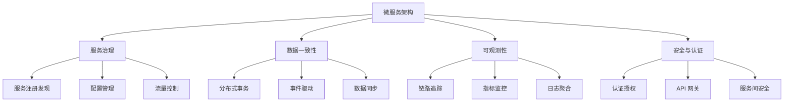

# 微服务架构深度实践

> **文档定位**：落地实践指南 — 聚焦分布式事务、服务网格、云原生部署、可观测性等高级实践。
>
> **前置阅读**：各核心组件的工作原理和配置方式请先参阅 → [Spring Cloud 核心组件](./02-Spring-Cloud核心组件.md)（Eureka / Gateway / Feign / Sentinel）

---

## 概述

本文深度探讨微服务架构的高级实践，包括分布式事务、服务网格、云原生部署等。



## 分布式事务深度解析

### 分布式事务挑战

> 关于 CAP 理论与 BASE 理论的详细说明，请参阅 → [CAP 理论与 BASE 理论](@se-CAP理论与BASE理论)

### 分布式事务模式

#### 1. 两阶段提交（2PC）

```java
// 协调者接口
public interface TransactionCoordinator {
    
    @PostMapping("/prepare")
    ResponseEntity<String> prepare(@RequestBody PrepareRequest request);
    
    @PostMapping("/commit")
    ResponseEntity<String> commit(@RequestBody CommitRequest request);
    
    @PostMapping("/rollback")
    ResponseEntity<String> rollback(@RequestBody RollbackRequest request);
}

// 参与者服务
@Service
public class OrderService implements TransactionParticipant {
    
    @Transactional
    public boolean prepare(Long orderId, BigDecimal amount) {
        // 预扣库存、冻结资金等
        Order order = orderRepository.findById(orderId).orElseThrow();
        if (order.getStatus() != OrderStatus.PENDING) {
            return false;
        }
        order.setStatus(OrderStatus.PREPARED);
        orderRepository.save(order);
        return true;
    }
    
    @Transactional
    public void commit(Long orderId) {
        Order order = orderRepository.findById(orderId).orElseThrow();
        order.setStatus(OrderStatus.COMPLETED);
        orderRepository.save(order);
    }
    
    @Transactional
    public void rollback(Long orderId) {
        Order order = orderRepository.findById(orderId).orElseThrow();
        order.setStatus(OrderStatus.CANCELLED);
        orderRepository.save(order);
    }
}
```

#### 2. TCC（Try-Confirm-Cancel）模式

```java
// TCC 服务接口
public interface TccOrderService {
    
    @PostMapping("/try")
    ResponseEntity<TryResult> tryCreateOrder(@RequestBody OrderRequest request);
    
    @PostMapping("/confirm")
    ResponseEntity<String> confirmOrder(@RequestParam String txId);
    
    @PostMapping("/cancel")
    ResponseEntity<String> cancelOrder(@RequestParam String txId);
}

// TCC 实现
@Service
public class TccOrderServiceImpl implements TccOrderService {
    
    @Override
    @Transactional
    public TryResult tryCreateOrder(OrderRequest request) {
        // Try 阶段：资源预留
        String txId = UUID.randomUUID().toString();
        
        // 预扣库存
        inventoryService.prepareDeduct(request.getProductId(), request.getQuantity(), txId);
        
        // 冻结资金
        accountService.prepareFreeze(request.getUserId(), request.getAmount(), txId);
        
        // 创建订单（待确认状态）
        Order order = new Order();
        order.setTxId(txId);
        order.setStatus(OrderStatus.TRY_SUCCESS);
        orderRepository.save(order);
        
        return new TryResult(txId, true, "Try success");
    }
    
    @Override
    @Transactional
    public String confirmOrder(String txId) {
        // Confirm 阶段：确认操作
        Order order = orderRepository.findByTxId(txId)
            .orElseThrow(() -> new RuntimeException("Order not found"));
        
        // 确认扣减库存
        inventoryService.confirmDeduct(txId);
        
        // 确认扣款
        accountService.confirmDeduct(txId);
        
        // 更新订单状态
        order.setStatus(OrderStatus.CONFIRMED);
        orderRepository.save(order);
        
        return "Confirm success";
    }
    
    @Override
    @Transactional
    public String cancelOrder(String txId) {
        // Cancel 阶段：取消操作
        Order order = orderRepository.findByTxId(txId)
            .orElseThrow(() -> new RuntimeException("Order not found"));
        
        // 回滚库存
        inventoryService.cancelDeduct(txId);
        
        // 解冻资金
        accountService.cancelFreeze(txId);
        
        // 更新订单状态
        order.setStatus(OrderStatus.CANCELLED);
        orderRepository.save(order);
        
        return "Cancel success";
    }
}
```

#### 3. Saga 模式

```java
// Saga 协调器
@Component
public class OrderSagaCoordinator {
    
    private final Map<String, SagaExecution> executions = new ConcurrentHashMap<>();
    
    public SagaResult executeOrderSaga(OrderRequest request) {
        String sagaId = UUID.randomUUID().toString();
        SagaExecution execution = new SagaExecution(sagaId);
        executions.put(sagaId, execution);
        
        try {
            // 步骤1：创建订单
            execution.addStep("createOrder", () -> orderService.createOrder(request));
            
            // 步骤2：扣减库存
            execution.addStep("deductInventory", 
                () -> inventoryService.deduct(request.getProductId(), request.getQuantity()),
                () -> inventoryService.compensateDeduct(request.getProductId(), request.getQuantity())
            );
            
            // 步骤3：扣款
            execution.addStep("deductAccount", 
                () -> accountService.deduct(request.getUserId(), request.getAmount()),
                () -> accountService.compensateDeduct(request.getUserId(), request.getAmount())
            );
            
            // 执行 Saga
            return execution.execute();
            
        } catch (Exception e) {
            // 执行补偿操作
            execution.compensate();
            return SagaResult.failed(sagaId, e.getMessage());
        }
    }
}

// Saga 步骤定义
public class SagaStep {
    private final String name;
    private final Supplier<Boolean> action;
    private final Runnable compensation;
    
    public SagaStep(String name, Supplier<Boolean> action, Runnable compensation) {
        this.name = name;
        this.action = action;
        this.compensation = compensation;
    }
    
    public boolean execute() {
        return action.get();
    }
    
    public void compensate() {
        if (compensation != null) {
            compensation.run();
        }
    }
}
```

### Seata 分布式事务框架

#### Seata AT 模式配置
```yaml
# application.yml
seata:
  enabled: true
  application-id: order-service
  tx-service-group: my_tx_group
  service:
    vgroup-mapping:
      my_tx_group: default
    grouplist:
      default: 127.0.0.1:8091
  config:
    type: nacos
    nacos:
      server-addr: 127.0.0.1:8848
      namespace: ""
      group: SEATA_GROUP
  registry:
    type: nacos
    nacos:
      application: seata-server
      server-addr: 127.0.0.1:8848
      namespace: ""
      group: SEATA_GROUP
```

#### Seata 使用示例
```java
@Service
public class OrderService {
    
    @GlobalTransactional(timeoutMills = 300000, name = "create-order")
    public Order createOrder(OrderRequest request) {
        // 1. 创建订单
        Order order = new Order();
        order.setUserId(request.getUserId());
        order.setAmount(request.getAmount());
        orderRepository.save(order);
        
        // 2. 扣减库存（远程调用）
        inventoryFeignClient.deduct(request.getProductId(), request.getQuantity());
        
        // 3. 扣款（远程调用）
        accountFeignClient.deduct(request.getUserId(), request.getAmount());
        
        return order;
    }
}

// Feign 客户端配置
@FeignClient(name = "inventory-service", configuration = FeignConfig.class)
public interface InventoryFeignClient {
    
    @PostMapping("/inventory/deduct")
    ResponseEntity<String> deduct(@RequestParam Long productId, @RequestParam Integer quantity);
}

// Feign 配置支持 Seata
@Configuration
public class FeignConfig {
    
    @Bean
    public RequestInterceptor seataFeignInterceptor() {
        return template -> {
            String xid = RootContext.getXID();
            if (StringUtils.isNotBlank(xid)) {
                template.header(RootContext.KEY_XID, xid);
            }
        };
    }
}
```

## 服务网格（Service Mesh）集成

### Istio 与 Spring Cloud 集成

#### Sidecar 自动注入
```yaml
# Kubernetes 部署配置
apiVersion: apps/v1
kind: Deployment
metadata:
  name: order-service
  labels:
    app: order-service
spec:
  replicas: 3
  selector:
    matchLabels:
      app: order-service
  template:
    metadata:
      labels:
        app: order-service
      annotations:
        sidecar.istio.io/inject: "true"  # 启用 Sidecar 注入
    spec:
      containers:
      - name: order-service
        image: registry.example.com/order-service:latest
        ports:
        - containerPort: 8080
        env:
        - name: SPRING_PROFILES_ACTIVE
          value: "kubernetes"
---
apiVersion: v1
kind: Service
metadata:
  name: order-service
  labels:
    app: order-service
spec:
  ports:
  - port: 80
    targetPort: 8080
    name: http
  selector:
    app: order-service
```

#### Istio 流量管理
```yaml
# VirtualService 配置
apiVersion: networking.istio.io/v1alpha3
kind: VirtualService
metadata:
  name: order-service
spec:
  hosts:
  - order-service
  - order-service.example.com
  http:
  - match:
    - headers:
        user-type:
          exact: vip
    route:
    - destination:
        host: order-service
        subset: v1  # VIP 用户路由到 v1 版本
  - route:
    - destination:
        host: order-service
        subset: v2  # 普通用户路由到 v2 版本
        weight: 80
    - destination:
        host: order-service
        subset: v1
        weight: 20
---
# DestinationRule 配置
apiVersion: networking.istio.io/v1alpha3
kind: DestinationRule
metadata:
  name: order-service
spec:
  host: order-service
  subsets:
  - name: v1
    labels:
      version: v1.0.0
  - name: v2
    labels:
      version: v2.0.0
```

#### Spring Cloud 与 Istio 协同
```java
@Configuration
public class IstioIntegrationConfig {
    
    // 使用 Istio 的服务发现
    @Bean
    @ConditionalOnProperty(name = "istio.enabled", havingValue = "true")
    public ServiceInstanceListSupplier istioServiceInstanceListSupplier(
        ConfigurableApplicationContext context) {
        return ServiceInstanceListSupplier.builder()
            .withBlockingDiscoveryClient()
            .withCaching()
            .withHealthChecks()
            .build(context);
    }
    
    // 集成 Istio 链路追踪
    @Bean
    public TracingCustomizer istioTracingCustomizer() {
        return builder -> {
            builder.sampler(Sampler.ALWAYS_SAMPLE);
            builder.propagationFactory(B3Propagation.FACTORY);
        };
    }
}

// 使用 Istio 的熔断器
@Configuration
public class CircuitBreakerConfig {
    
    @Bean
    public Customizer<Resilience4JCircuitBreakerFactory> defaultCustomizer() {
        return factory -> factory.configureDefault(id -> {
            return Resilience4JConfigBuilder.of(id)
                .circuitBreakerConfig(CircuitBreakerConfig.custom()
                    .slidingWindowSize(100)
                    .failureRateThreshold(50)
                    .waitDurationInOpenState(Duration.ofSeconds(60))
                    .build())
                .timeLimiterConfig(TimeLimiterConfig.custom()
                    .timeoutDuration(Duration.ofSeconds(5))
                    .build())
                .build();
        });
    }
}
```

## 云原生部署实践

### Kubernetes 部署配置

#### 完整的部署清单
```yaml
# deployment.yaml
apiVersion: apps/v1
kind: Deployment
metadata:
  name: order-service
  labels:
    app: order-service
    version: v1.0.0
spec:
  replicas: 3
  selector:
    matchLabels:
      app: order-service
  template:
    metadata:
      labels:
        app: order-service
        version: v1.0.0
      annotations:
        prometheus.io/scrape: "true"
        prometheus.io/port: "8080"
        prometheus.io/path: "/actuator/prometheus"
    spec:
      containers:
      - name: order-service
        image: registry.example.com/order-service:latest
        ports:
        - containerPort: 8080
        env:
        - name: SPRING_PROFILES_ACTIVE
          value: "kubernetes"
        - name: JAVA_OPTS
          value: "-Xmx512m -Xms256m -XX:+UseG1GC"
        resources:
          requests:
            memory: "512Mi"
            cpu: "250m"
          limits:
            memory: "1Gi"
            cpu: "500m"
        livenessProbe:
          httpGet:
            path: /actuator/health/liveness
            port: 8080
          initialDelaySeconds: 60
          periodSeconds: 10
        readinessProbe:
          httpGet:
            path: /actuator/health/readiness
            port: 8080
          initialDelaySeconds: 30
          periodSeconds: 5
---
# service.yaml
apiVersion: v1
kind: Service
metadata:
  name: order-service
  labels:
    app: order-service
spec:
  ports:
  - port: 80
    targetPort: 8080
    name: http
  selector:
    app: order-service
---
# ingress.yaml
apiVersion: networking.k8s.io/v1
kind: Ingress
metadata:
  name: order-service
  annotations:
    nginx.ingress.kubernetes.io/rewrite-target: /
    nginx.ingress.kubernetes.io/ssl-redirect: "true"
spec:
  tls:
  - hosts:
    - orders.example.com
    secretName: tls-secret
  rules:
  - host: orders.example.com
    http:
      paths:
      - path: /
        pathType: Prefix
        backend:
          service:
            name: order-service
            port:
              number: 80
```

#### ConfigMap 配置管理
```yaml
# configmap.yaml
apiVersion: v1
kind: ConfigMap
metadata:
  name: order-service-config
data:
  application.yml: |
    server:
      port: 8080
    
    spring:
      datasource:
        url: jdbc:mysql://mysql-service:3306/order_db
        username: ${DB_USERNAME}
        password: ${DB_PASSWORD}
      
      cloud:
        kubernetes:
          config:
            enabled: true
          discovery:
            enabled: true
    
    management:
      endpoints:
        web:
          exposure:
            include: health,info,metrics,prometheus
      endpoint:
        health:
          show-details: always
```

#### Secret 敏感信息管理
```yaml
# secret.yaml
apiVersion: v1
kind: Secret
metadata:
  name: order-service-secret
type: Opaque
data:
  DB_USERNAME: dXNlcm5hbWU=  # username
  DB_PASSWORD: cGFzc3dvcmQ=  # password
  JWT_SECRET: c2VjcmV0a2V5    # secretkey
```

### 健康检查与自愈

#### Spring Boot Actuator 配置
```yaml
management:
  endpoint:
    health:
      enabled: true
      show-details: always
      show-components: always
      group:
        liveness:
          include: livenessState,diskSpace
        readiness:
          include: readinessState,ping,db
  health:
    livenessstate:
      enabled: true
    readinessstate:
      enabled: true
    diskspace:
      enabled: true
```

#### 自定义健康检查
```java
@Component
public class DatabaseHealthIndicator implements HealthIndicator {
    
    private final DataSource dataSource;
    
    public DatabaseHealthIndicator(DataSource dataSource) {
        this.dataSource = dataSource;
    }
    
    @Override
    public Health health() {
        try (Connection connection = dataSource.getConnection()) {
            if (connection.isValid(5)) {
                return Health.up()
                    .withDetail("database", "Connected")
                    .build();
            } else {
                return Health.down()
                    .withDetail("database", "Connection invalid")
                    .build();
            }
        } catch (SQLException e) {
            return Health.down(e).build();
        }
    }
}

@Component
public class LivenessHealthIndicator implements HealthIndicator {
    
    @Override
    public Health health() {
        // 检查应用是否存活的基本指标
        long usedMemory = Runtime.getRuntime().totalMemory() - Runtime.getRuntime().freeMemory();
        long maxMemory = Runtime.getRuntime().maxMemory();
        double memoryUsage = (double) usedMemory / maxMemory;
        
        if (memoryUsage > 0.9) {
            return Health.down()
                .withDetail("memory", "High memory usage: " + memoryUsage)
                .build();
        }
        
        return Health.up()
            .withDetail("memory", "Usage: " + memoryUsage)
            .build();
    }
}
```

## 可观测性实践

### 分布式链路追踪

#### Spring Cloud Sleuth + Zipkin
```yaml
# application.yml
spring:
  zipkin:
    base-url: http://zipkin:9411
    enabled: true
  sleuth:
    sampler:
      probability: 1.0
    web:
      enabled: true
```

#### 自定义追踪
```java
@Service
public class OrderService {
    
    private final Tracer tracer;
    
    public OrderService(Tracer tracer) {
        this.tracer = tracer;
    }
    
    public Order createOrder(OrderRequest request) {
        // 创建自定义 Span
        Span orderSpan = tracer.nextSpan().name("create-order").start();
        
        try (Tracer.SpanInScope ws = tracer.withSpanInScope(orderSpan)) {
            orderSpan.tag("order.amount", request.getAmount().toString());
            orderSpan.tag("order.userId", request.getUserId().toString());
            
            // 业务逻辑
            Order order = processOrder(request);
            
            orderSpan.event("order.created");
            return order;
            
        } catch (Exception e) {
            orderSpan.tag("error", "true");
            orderSpan.tag("error.message", e.getMessage());
            throw e;
        } finally {
            orderSpan.finish();
        }
    }
}
```

### 指标监控

#### Micrometer 指标收集
```java
@Component
public class OrderMetrics {
    
    private final MeterRegistry meterRegistry;
    private final Counter orderCounter;
    private final Timer orderProcessingTimer;
    private final Gauge memoryUsageGauge;
    
    public OrderMetrics(MeterRegistry meterRegistry) {
        this.meterRegistry = meterRegistry;
        
        this.orderCounter = Counter.builder("orders.created")
            .description("Total number of orders created")
            .register(meterRegistry);
        
        this.orderProcessingTimer = Timer.builder("orders.processing.time")
            .description("Time taken to process an order")
            .register(meterRegistry);
        
        this.memoryUsageGauge = Gauge.builder("jvm.memory.used")
            .description("JVM memory used")
            .register(meterRegistry, this, OrderMetrics::getMemoryUsage);
    }
    
    public void recordOrderCreation() {
        orderCounter.increment();
    }
    
    public void recordOrderProcessingTime(long duration) {
        orderProcessingTimer.record(duration, TimeUnit.MILLISECONDS);
    }
    
    private double getMemoryUsage() {
        Runtime runtime = Runtime.getRuntime();
        long usedMemory = runtime.totalMemory() - runtime.freeMemory();
        long maxMemory = runtime.maxMemory();
        return (double) usedMemory / maxMemory;
    }
}
```

## 安全与认证

### OAuth2 + JWT 集成

#### 授权服务器配置
```java
@Configuration
@EnableAuthorizationServer
public class AuthorizationServerConfig extends AuthorizationServerConfigurerAdapter {
    
    @Autowired
    private AuthenticationManager authenticationManager;
    
    @Autowired
    private UserDetailsService userDetailsService;
    
    @Override
    public void configure(ClientDetailsServiceConfigurer clients) throws Exception {
        clients.inMemory()
            .withClient("web-app")
            .secret(passwordEncoder().encode("secret"))
            .authorizedGrantTypes("password", "refresh_token")
            .scopes("read", "write")
            .accessTokenValiditySeconds(3600)
            .refreshTokenValiditySeconds(86400);
    }
    
    @Override
    public void configure(AuthorizationServerEndpointsConfigurer endpoints) {
        endpoints
            .authenticationManager(authenticationManager)
            .userDetailsService(userDetailsService)
            .tokenStore(tokenStore())
            .accessTokenConverter(accessTokenConverter());
    }
    
    @Bean
    public JwtAccessTokenConverter accessTokenConverter() {
        JwtAccessTokenConverter converter = new JwtAccessTokenConverter();
        converter.setSigningKey("secret");
        return converter;
    }
    
    @Bean
    public TokenStore tokenStore() {
        return new JwtTokenStore(accessTokenConverter());
    }
}
```

#### 资源服务器配置
```java
@Configuration
@EnableResourceServer
public class ResourceServerConfig extends ResourceServerConfigurerAdapter {
    
    @Override
    public void configure(HttpSecurity http) throws Exception {
        http
            .authorizeRequests()
            .antMatchers("/api/public/**").permitAll()
            .antMatchers("/api/admin/**").hasRole("ADMIN")
            .antMatchers("/api/**").authenticated()
            .and()
            .oauth2ResourceServer()
            .jwt();
    }
}
```

#### 服务间安全调用
```java
@Configuration
public class FeignSecurityConfig {
    
    @Bean
    public RequestInterceptor oauth2FeignRequestInterceptor() {
        return requestTemplate -> {
            // 从安全上下文中获取 Token 并添加到请求头
            Authentication authentication = SecurityContextHolder.getContext().getAuthentication();
            if (authentication != null && authentication.getCredentials() instanceof OAuth2AccessToken) {
                OAuth2AccessToken token = (OAuth2AccessToken) authentication.getCredentials();
                requestTemplate.header("Authorization", "Bearer " + token.getValue());
            }
        };
    }
}

// 安全的 Feign 客户端
@FeignClient(name = "user-service", configuration = FeignSecurityConfig.class)
public interface UserServiceClient {
    
    @GetMapping("/api/users/{id}")
    User getUser(@PathVariable("id") Long id);
}
```

## 总结

微服务架构深度实践涉及多个层面的技术挑战：

1. **分布式事务**：根据业务场景选择合适的模式（2PC、TCC、Saga）
2. **服务网格**：利用 Istio 等工具实现高级流量管理
3. **云原生部署**：Kubernetes 提供完整的应用生命周期管理
4. **可观测性**：链路追踪、指标监控、日志聚合三位一体
5. **安全认证**：OAuth2 + JWT 保障服务间安全通信

通过本文的深度实践指南，您将能够构建高可用、可扩展、易维护的微服务架构。

---

> 📖 **相关文档**：各核心组件原理速查 → [Spring Cloud 核心组件](./02-Spring-Cloud核心组件.md)