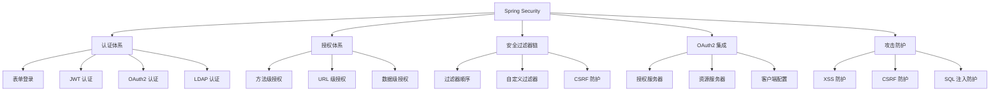

# Spring 安全架构深度解析

---

## 概述

Spring Security 是 Spring 生态中的安全框架，提供全面的认证、授权、攻击防护等功能。本文深度解析 Spring Security 的架构设计和高级用法。



## Spring Security 核心架构

### 1. 安全过滤器链（Security Filter Chain）

#### 过滤器链组成
```java
@Configuration
@EnableWebSecurity
public class SecurityConfig {
    
    @Bean
    public SecurityFilterChain filterChain(HttpSecurity http) throws Exception {
        http
            // 1. 认证相关过滤器
            .formLogin(form -> form
                .loginPage("/login")
                .permitAll()
            )
            // 2. 授权相关过滤器
            .authorizeHttpRequests(auth -> auth
                .requestMatchers("/admin/**").hasRole("ADMIN")
                .requestMatchers("/user/**").hasAnyRole("USER", "ADMIN")
                .requestMatchers("/public/**").permitAll()
                .anyRequest().authenticated()
            )
            // 3. 会话管理
            .sessionManagement(session -> session
                .sessionCreationPolicy(SessionCreationPolicy.IF_REQUIRED)
                .maximumSessions(1)
                .maxSessionsPreventsLogin(true)
            )
            // 4. 记住我功能
            .rememberMe(remember -> remember
                .tokenValiditySeconds(86400) // 24小时
                .key("remember-me-key")
            )
            // 5. 退出登录
            .logout(logout -> logout
                .logoutUrl("/logout")
                .logoutSuccessUrl("/login?logout")
                .invalidateHttpSession(true)
                .deleteCookies("JSESSIONID")
            )
            // 6. CSRF 防护
            .csrf(csrf -> csrf
                .ignoringRequestMatchers("/api/**") // API 接口禁用 CSRF
            )
            // 7. 异常处理
            .exceptionHandling(exception -> exception
                .authenticationEntryPoint(new HttpStatusEntryPoint(HttpStatus.UNAUTHORIZED))
                .accessDeniedHandler(new HttpStatusEntryPoint(HttpStatus.FORBIDDEN))
            );
        
        return http.build();
    }
}
```

#### 过滤器执行顺序
```java
// Spring Security 过滤器链的典型顺序
public class SecurityFilterOrder {
    
    // 1. ChannelProcessingFilter - 处理 HTTPS 重定向
    // 2. WebAsyncManagerIntegrationFilter - 异步请求支持
    // 3. SecurityContextPersistenceFilter - 安全上下文管理
    // 4. HeaderWriterFilter - 安全响应头设置
    // 5. CorsFilter - 跨域请求处理
    // 6. CsrfFilter - CSRF 防护
    // 7. LogoutFilter - 退出登录处理
    // 8. OAuth2AuthorizationRequestRedirectFilter - OAuth2 授权请求重定向
    // 9. Saml2WebSsoAuthenticationRequestFilter - SAML2 认证
    // 10. X509AuthenticationFilter - X509 证书认证
    // 11. AbstractPreAuthenticatedProcessingFilter - 预认证处理
    // 12. CasAuthenticationFilter - CAS 认证
    // 13. OAuth2LoginAuthenticationFilter - OAuth2 登录认证
    // 14. Saml2WebSsoAuthenticationFilter - SAML2 Web SSO
    // 15. UsernamePasswordAuthenticationFilter - 用户名密码认证
    // 16. OpenIDAuthenticationFilter - OpenID 认证
    // 17. DefaultLoginPageGeneratingFilter - 默认登录页生成
    // 18. DefaultLogoutPageGeneratingFilter - 默认退出页生成
    // 19. ConcurrentSessionFilter - 并发会话控制
    // 20. DigestAuthenticationFilter - 摘要认证
    // 21. BearerTokenAuthenticationFilter - Bearer Token 认证
    // 22. BasicAuthenticationFilter - Basic 认证
    // 23. RequestCacheAwareFilter - 请求缓存
    // 24. SecurityContextHolderAwareRequestFilter - 安全上下文感知
    // 25. JaasApiIntegrationFilter - JAAS 集成
    // 26. RememberMeAuthenticationFilter - 记住我认证
    // 27. AnonymousAuthenticationFilter - 匿名认证
    // 28. OAuth2AuthorizationCodeGrantFilter - OAuth2 授权码
    // 29. SessionManagementFilter - 会话管理
    // 30. ExceptionTranslationFilter - 异常转换
    // 31. FilterSecurityInterceptor - 安全拦截器（授权决策）
    // 32. SwitchUserFilter - 用户切换
}
```

### 2. 认证体系深度解析

#### 自定义认证提供者
```java
@Component
public class CustomAuthenticationProvider implements AuthenticationProvider {
    
    @Autowired
    private UserDetailsService userDetailsService;
    
    @Autowired
    private PasswordEncoder passwordEncoder;
    
    @Override
    public Authentication authenticate(Authentication authentication) throws AuthenticationException {
        String username = authentication.getName();
        String password = authentication.getCredentials().toString();
        
        // 1. 加载用户信息
        UserDetails userDetails = userDetailsService.loadUserByUsername(username);
        
        // 2. 验证密码
        if (!passwordEncoder.matches(password, userDetails.getPassword())) {
            throw new BadCredentialsException("Invalid password");
        }
        
        // 3. 检查账户状态
        if (!userDetails.isEnabled()) {
            throw new DisabledException("Account is disabled");
        }
        
        if (!userDetails.isAccountNonLocked()) {
            throw new LockedException("Account is locked");
        }
        
        if (!userDetails.isAccountNonExpired()) {
            throw new AccountExpiredException("Account is expired");
        }
        
        if (!userDetails.isCredentialsNonExpired()) {
            throw new CredentialsExpiredException("Credentials are expired");
        }
        
        // 4. 创建认证令牌
        return new UsernamePasswordAuthenticationToken(
            userDetails, 
            password, 
            userDetails.getAuthorities()
        );
    }
    
    @Override
    public boolean supports(Class<?> authentication) {
        return UsernamePasswordAuthenticationToken.class.isAssignableFrom(authentication);
    }
}

@Configuration
@EnableWebSecurity
public class SecurityConfig {
    
    @Autowired
    private CustomAuthenticationProvider customAuthenticationProvider;
    
    @Bean
    public SecurityFilterChain filterChain(HttpSecurity http) throws Exception {
        http
            .authenticationProvider(customAuthenticationProvider)
            .authorizeHttpRequests(auth -> auth
                .anyRequest().authenticated()
            )
            .formLogin(Customizer.withDefaults());
        
        return http.build();
    }
}
```

#### 多因素认证（MFA）实现
```java
@Component
public class MultiFactorAuthenticationProvider implements AuthenticationProvider {
    
    @Autowired
    private UserDetailsService userDetailsService;
    
    @Autowired
    private OtpService otpService;
    
    @Override
    public Authentication authenticate(Authentication authentication) throws AuthenticationException {
        if (authentication instanceof UsernamePasswordAuthenticationToken) {
            // 第一阶段：用户名密码认证
            return authenticateFirstFactor(authentication);
        } else if (authentication instanceof MultiFactorAuthenticationToken) {
            // 第二阶段：多因素认证
            return authenticateSecondFactor(authentication);
        }
        
        return null;
    }
    
    private Authentication authenticateFirstFactor(Authentication authentication) {
        String username = authentication.getName();
        String password = authentication.getCredentials().toString();
        
        UserDetails userDetails = userDetailsService.loadUserByUsername(username);
        
        // 验证密码...
        
        // 创建第一阶段认证令牌（未完全认证）
        MultiFactorAuthenticationToken firstFactorToken = new MultiFactorAuthenticationToken(
            userDetails, 
            null, 
            Collections.emptyList(),
            false // 未完全认证
        );
        firstFactorToken.setDetails(authentication.getDetails());
        
        // 发送 OTP 验证码
        otpService.sendOtp(username);
        
        return firstFactorToken;
    }
    
    private Authentication authenticateSecondFactor(Authentication authentication) {
        MultiFactorAuthenticationToken mfaToken = (MultiFactorAuthenticationToken) authentication;
        String otpCode = mfaToken.getOtpCode();
        String username = mfaToken.getName();
        
        // 验证 OTP 码
        if (!otpService.validateOtp(username, otpCode)) {
            throw new BadCredentialsException("Invalid OTP code");
        }
        
        // 加载用户信息
        UserDetails userDetails = userDetailsService.loadUserByUsername(username);
        
        // 创建完全认证的令牌
        MultiFactorAuthenticationToken authenticatedToken = new MultiFactorAuthenticationToken(
            userDetails, 
            null, 
            userDetails.getAuthorities(),
            true // 完全认证
        );
        authenticatedToken.setDetails(mfaToken.getDetails());
        
        return authenticatedToken;
    }
    
    @Override
    public boolean supports(Class<?> authentication) {
        return UsernamePasswordAuthenticationToken.class.isAssignableFrom(authentication) ||
               MultiFactorAuthenticationToken.class.isAssignableFrom(authentication);
    }
}

// 自定义多因素认证令牌
public class MultiFactorAuthenticationToken extends AbstractAuthenticationToken {
    
    private final Object principal;
    private Object credentials;
    private String otpCode;
    
    public MultiFactorAuthenticationToken(Object principal, Object credentials, 
                                         Collection<? extends GrantedAuthority> authorities, 
                                         boolean authenticated) {
        super(authorities);
        this.principal = principal;
        this.credentials = credentials;
        super.setAuthenticated(authenticated);
    }
    
    public String getOtpCode() {
        return otpCode;
    }
    
    public void setOtpCode(String otpCode) {
        this.otpCode = otpCode;
    }
    
    @Override
    public Object getCredentials() {
        return credentials;
    }
    
    @Override
    public Object getPrincipal() {
        return principal;
    }
}
```

## 授权体系深度解析

### 1. 方法级安全控制

#### 基于注解的细粒度授权
```java
@Service
public class UserService {
    
    @PreAuthorize("hasRole('ADMIN') or #userId == authentication.principal.id")
    public User getUserById(Long userId) {
        // 只有管理员或用户自己可以查看用户信息
        return userRepository.findById(userId).orElseThrow();
    }
    
    @PreAuthorize("hasPermission(#user, 'WRITE')")
    public User updateUser(User user) {
        // 基于自定义权限的授权
        return userRepository.save(user);
    }
    
    @PostAuthorize("returnObject.owner == authentication.principal.username")
    public Document getDocument(Long docId) {
        // 方法执行后检查返回值权限
        return documentRepository.findById(docId).orElseThrow();
    }
    
    @PreFilter("filterObject.owner == authentication.principal.username")
    public List<Document> updateDocuments(List<Document> documents) {
        // 过滤输入参数，只处理用户拥有的文档
        return documentRepository.saveAll(documents);
    }
    
    @PostFilter("filterObject.status == 'PUBLISHED' or filterObject.owner == authentication.principal.username")
    public List<Document> getUserDocuments(Long userId) {
        // 过滤返回结果，只返回已发布文档或用户自己的文档
        return documentRepository.findByOwnerId(userId);
    }
    
    @Secured({"ROLE_ADMIN", "ROLE_MANAGER"})
    public void deleteUser(Long userId) {
        // 基于角色的授权（旧版注解）
        userRepository.deleteById(userId);
    }
    
    @RolesAllowed({"ADMIN", "MANAGER"})
    public void approveDocument(Long docId) {
        // JSR-250 标准注解
        documentRepository.approve(docId);
    }
}

// 启用方法级安全
@Configuration
@EnableMethodSecurity(prePostEnabled = true, securedEnabled = true, jsr250Enabled = true)
public class MethodSecurityConfig {
    
    @Bean
    public MethodSecurityExpressionHandler methodSecurityExpressionHandler() {
        DefaultMethodSecurityExpressionHandler handler = new DefaultMethodSecurityExpressionHandler();
        handler.setPermissionEvaluator(customPermissionEvaluator());
        return handler;
    }
    
    @Bean
    public PermissionEvaluator customPermissionEvaluator() {
        return new CustomPermissionEvaluator();
    }
}

// 自定义权限评估器
@Component
public class CustomPermissionEvaluator implements PermissionEvaluator {
    
    @Autowired
    private PermissionService permissionService;
    
    @Override
    public boolean hasPermission(Authentication authentication, Object targetDomainObject, Object permission) {
        if (authentication == null || targetDomainObject == null || !(permission instanceof String)) {
            return false;
        }
        
        String username = authentication.getName();
        String perm = (String) permission;
        
        // 检查用户对目标对象是否有指定权限
        return permissionService.hasPermission(username, targetDomainObject, perm);
    }
    
    @Override
    public boolean hasPermission(Authentication authentication, Serializable targetId, String targetType, Object permission) {
        if (authentication == null || targetId == null || targetType == null || !(permission instanceof String)) {
            return false;
        }
        
        String username = authentication.getName();
        String perm = (String) permission;
        
        // 根据类型和ID检查权限
        return permissionService.hasPermission(username, targetType, targetId.toString(), perm);
    }
}
```

### 2. 动态权限控制

#### 基于数据库的权限管理
```java
@Component
public class DynamicPermissionEvaluator {
    
    @Autowired
    private PermissionRepository permissionRepository;
    
    @Autowired
    private RoleRepository roleRepository;
    
    public boolean hasPermission(String username, String resource, String action) {
        // 1. 获取用户角色
        List<Role> userRoles = roleRepository.findByUsername(username);
        
        // 2. 检查角色权限
        for (Role role : userRoles) {
            if (permissionRepository.existsByRoleAndResourceAndAction(role.getName(), resource, action)) {
                return true;
            }
        }
        
        // 3. 检查用户特定权限
        return permissionRepository.existsByUsernameAndResourceAndAction(username, resource, action);
    }
    
    public List<String> getUserPermissions(String username) {
        List<String> permissions = new ArrayList<>();
        
        // 获取角色权限
        List<Role> userRoles = roleRepository.findByUsername(username);
        for (Role role : userRoles) {
            List<Permission> rolePermissions = permissionRepository.findByRole(role.getName());
            for (Permission perm : rolePermissions) {
                permissions.add(perm.getResource() + ":" + perm.getAction());
            }
        }
        
        // 获取用户特定权限
        List<Permission> userSpecificPermissions = permissionRepository.findByUsername(username);
        for (Permission perm : userSpecificPermissions) {
            permissions.add(perm.getResource() + ":" + perm.getAction());
        }
        
        return permissions;
    }
}

// 权限实体类
@Entity
public class Permission {
    @Id
    @GeneratedValue(strategy = GenerationType.IDENTITY)
    private Long id;
    
    private String role;        // 角色名（可为空）
    private String username;    // 用户名（可为空）
    private String resource;    // 资源（如：user, document）
    private String action;      // 操作（如：read, write, delete）
    
    // getters and setters
}

// 角色实体类
@Entity
public class Role {
    @Id
    @GeneratedValue(strategy = GenerationType.IDENTITY)
    private Long id;
    
    private String name;        // 角色名
    private String description; // 角色描述
    
    @ManyToMany(mappedBy = "roles")
    private Set<User> users;   // 拥有该角色的用户
    
    // getters and setters
}
```

## OAuth2 深度集成

### 1. 授权服务器配置

#### 基于 Spring Authorization Server
```java
@Configuration
@EnableAuthorizationServer
public class AuthorizationServerConfig {
    
    @Bean
    @Order(Ordered.HIGHEST_PRECEDENCE)
    public SecurityFilterChain authorizationServerSecurityFilterChain(HttpSecurity http) throws Exception {
        OAuth2AuthorizationServerConfiguration.applyDefaultSecurity(http);
        
        return http
            .formLogin(Customizer.withDefaults())
            .build();
    }
    
    @Bean
    public RegisteredClientRepository registeredClientRepository() {
        RegisteredClient client = RegisteredClient.withId(UUID.randomUUID().toString())
            .clientId("web-client")
            .clientSecret("{bcrypt}$2a$10$dXJ3SW6G7P.XBLBvanJYv.Ms6.2Z7.2Z7.2Z7.2Z7.2Z7.2Z7")
            .clientAuthenticationMethod(ClientAuthenticationMethod.CLIENT_SECRET_BASIC)
            .authorizationGrantType(AuthorizationGrantType.AUTHORIZATION_CODE)
            .authorizationGrantType(AuthorizationGrantType.REFRESH_TOKEN)
            .authorizationGrantType(AuthorizationGrantType.CLIENT_CREDENTIALS)
            .redirectUri("http://localhost:8080/login/oauth2/code/web-client")
            .scope(OidcScopes.OPENID)
            .scope(OidcScopes.PROFILE)
            .scope("read")
            .scope("write")
            .clientSettings(ClientSettings.builder()
                .requireAuthorizationConsent(true)
                .build())
            .build();
        
        return new InMemoryRegisteredClientRepository(client);
    }
    
    @Bean
    public JWKSource<SecurityContext> jwkSource() {
        RSAKey rsaKey = Jwks.generateRsa();
        JWKSet jwkSet = new JWKSet(rsaKey);
        return (jwkSelector, securityContext) -> jwkSelector.select(jwkSet);
    }
    
    @Bean
    public ProviderSettings providerSettings() {
        return ProviderSettings.builder()
            .issuer("http://auth-server:9000")
            .build();
    }
}

// JWT 密钥生成工具类
final class Jwks {
    
    private Jwks() {}
    
    public static RSAKey generateRsa() {
        KeyPair keyPair = KeyGeneratorUtils.generateRsaKey();
        RSAPublicKey publicKey = (RSAPublicKey) keyPair.getPublic();
        RSAPrivateKey privateKey = (RSAPrivateKey) keyPair.getPrivate();
        
        return new RSAKey.Builder(publicKey)
            .privateKey(privateKey)
            .keyID(UUID.randomUUID().toString())
            .build();
    }
}

final class KeyGeneratorUtils {
    
    private KeyGeneratorUtils() {}
    
    static KeyPair generateRsaKey() {
        KeyPair keyPair;
        try {
            KeyPairGenerator keyPairGenerator = KeyPairGenerator.getInstance("RSA");
            keyPairGenerator.initialize(2048);
            keyPair = keyPairGenerator.generateKeyPair();
        } catch (Exception ex) {
            throw new IllegalStateException(ex);
        }
        return keyPair;
    }
}
```

### 2. 资源服务器配置

#### JWT 令牌验证
```java
@Configuration
@EnableWebSecurity
@EnableMethodSecurity
public class ResourceServerConfig {
    
    @Bean
    public SecurityFilterChain filterChain(HttpSecurity http) throws Exception {
        http
            .authorizeHttpRequests(auth -> auth
                .requestMatchers("/api/public/**").permitAll()
                .anyRequest().authenticated()
            )
            .oauth2ResourceServer(oauth2 -> oauth2
                .jwt(jwt -> jwt
                    .jwtAuthenticationConverter(jwtAuthenticationConverter())
                )
            )
            .sessionManagement(session -> session
                .sessionCreationPolicy(SessionCreationPolicy.STATELESS)
            );
        
        return http.build();
    }
    
    @Bean
    public JwtAuthenticationConverter jwtAuthenticationConverter() {
        JwtGrantedAuthoritiesConverter grantedAuthoritiesConverter = new JwtGrantedAuthoritiesConverter();
        grantedAuthoritiesConverter.setAuthorityPrefix("ROLE_");
        grantedAuthoritiesConverter.setAuthoritiesClaimName("roles");
        
        JwtAuthenticationConverter jwtAuthenticationConverter = new JwtAuthenticationConverter();
        jwtAuthenticationConverter.setJwtGrantedAuthoritiesConverter(grantedAuthoritiesConverter);
        
        return jwtAuthenticationConverter;
    }
    
    @Bean
    public JwtDecoder jwtDecoder() {
        return NimbusJwtDecoder.withJwkSetUri("http://auth-server:9000/oauth2/jwks")
            .build();
    }
}

// 自定义 JWT 令牌增强器
@Component
public class CustomJwtTokenEnhancer implements OAuth2TokenCustomizer<JwtEncodingContext> {
    
    @Override
    public void customize(JwtEncodingContext context) {
        if (context.getTokenType().getValue().equals(OAuth2TokenType.ACCESS_TOKEN.getValue())) {
            // 添加自定义声明
            context.getClaims().claim("custom_claim", "custom_value");
            
            // 添加用户角色信息
            Authentication principal = context.getPrincipal();
            if (principal instanceof OAuth2AuthenticationToken) {
                OAuth2AuthenticationToken oauthToken = (OAuth2AuthenticationToken) principal;
                Set<String> authorities = oauthToken.getAuthorities().stream()
                    .map(GrantedAuthority::getAuthority)
                    .collect(Collectors.toSet());
                context.getClaims().claim("roles", authorities);
            }
        }
    }
}
```

## 安全最佳实践

### 1. 密码安全

#### 密码编码器配置
```java
@Configuration
public class PasswordConfig {
    
    @Bean
    public PasswordEncoder passwordEncoder() {
        // 使用 BCrypt 密码编码器
        return new BCryptPasswordEncoder(12); // 强度因子 12
    }
    
    @Bean
    public DelegatingPasswordEncoder delegatingPasswordEncoder() {
        String encodingId = "bcrypt";
        Map<String, PasswordEncoder> encoders = new HashMap<>();
        encoders.put(encodingId, new BCryptPasswordEncoder(12));
        encoders.put("pbkdf2", new Pbkdf2PasswordEncoder());
        encoders.put("scrypt", new SCryptPasswordEncoder());
        encoders.put("argon2", new Argon2PasswordEncoder());
        
        // 默认使用 bcrypt，但支持迁移其他算法
        return new DelegatingPasswordEncoder(encodingId, encoders);
    }
}

// 密码策略验证
@Component
public class PasswordPolicyValidator {
    
    private static final int MIN_LENGTH = 8;
    private static final int MAX_LENGTH = 128;
    
    public void validatePassword(String password) {
        if (password == null || password.length() < MIN_LENGTH) {
            throw new IllegalArgumentException("Password must be at least " + MIN_LENGTH + " characters long");
        }
        
        if (password.length() > MAX_LENGTH) {
            throw new IllegalArgumentException("Password must not exceed " + MAX_LENGTH + " characters");
        }
        
        // 检查密码复杂度
        if (!containsUpperCase(password)) {
            throw new IllegalArgumentException("Password must contain at least one uppercase letter");
        }
        
        if (!containsLowerCase(password)) {
            throw new IllegalArgumentException("Password must contain at least one lowercase letter");
        }
        
        if (!containsDigit(password)) {
            throw new IllegalArgumentException("Password must contain at least one digit");
        }
        
        if (!containsSpecialCharacter(password)) {
            throw new IllegalArgumentException("Password must contain at least one special character");
        }
        
        // 检查常见弱密码
        if (isCommonPassword(password)) {
            throw new IllegalArgumentException("Password is too common, please choose a stronger one");
        }
    }
    
    private boolean containsUpperCase(String password) {
        return password.chars().anyMatch(Character::isUpperCase);
    }
    
    private boolean containsLowerCase(String password) {
        return password.chars().anyMatch(Character::isLowerCase);
    }
    
    private boolean containsDigit(String password) {
        return password.chars().anyMatch(Character::isDigit);
    }
    
    private boolean containsSpecialCharacter(String password) {
        return password.chars().anyMatch(ch -> !Character.isLetterOrDigit(ch));
    }
    
    private boolean isCommonPassword(String password) {
        Set<String> commonPasswords = Set.of(
            "password", "123456", "qwerty", "admin", "welcome"
            // 更多常见密码...
        );
        return commonPasswords.contains(password.toLowerCase());
    }
}
```

### 2. 安全响应头配置

#### 自定义安全头过滤器
```java
@Component
public class SecurityHeadersFilter extends OncePerRequestFilter {
    
    @Override
    protected void doFilterInternal(HttpServletRequest request, 
                                  HttpServletResponse response, 
                                  FilterChain filterChain) throws ServletException, IOException {
        
        // 设置安全相关的 HTTP 头
        response.setHeader("X-Content-Type-Options", "nosniff");
        response.setHeader("X-Frame-Options", "DENY");
        response.setHeader("X-XSS-Protection", "1; mode=block");
        response.setHeader("Strict-Transport-Security", "max-age=31536000; includeSubDomains");
        response.setHeader("Content-Security-Policy", 
            "default-src 'self'; script-src 'self' 'unsafe-inline'; style-src 'self' 'unsafe-inline'");
        response.setHeader("Referrer-Policy", "strict-origin-when-cross-origin");
        response.setHeader("Feature-Policy", 
            "geolocation 'none'; microphone 'none'; camera 'none'");
        
        filterChain.doFilter(request, response);
    }
}

// 配置安全头过滤器
@Configuration
public class SecurityHeadersConfig {
    
    @Bean
    public FilterRegistrationBean<SecurityHeadersFilter> securityHeadersFilter() {
        FilterRegistrationBean<SecurityHeadersFilter> registrationBean = new FilterRegistrationBean<>();
        registrationBean.setFilter(new SecurityHeadersFilter());
        registrationBean.setOrder(Ordered.HIGHEST_PRECEDENCE);
        return registrationBean;
    }
}
```

## 总结

Spring Security 提供了全面的安全解决方案：

1. **认证体系**：支持多种认证方式，可自定义认证提供者
2. **授权体系**：细粒度的权限控制，支持动态权限管理
3. **OAuth2 集成**：完整的 OAuth2 授权服务器和资源服务器支持
4. **安全过滤器链**：可定制的安全过滤器执行流程
5. **安全最佳实践**：密码安全、响应头安全、攻击防护

通过深度理解 Spring Security 架构，可以构建安全、可靠的企业级应用。