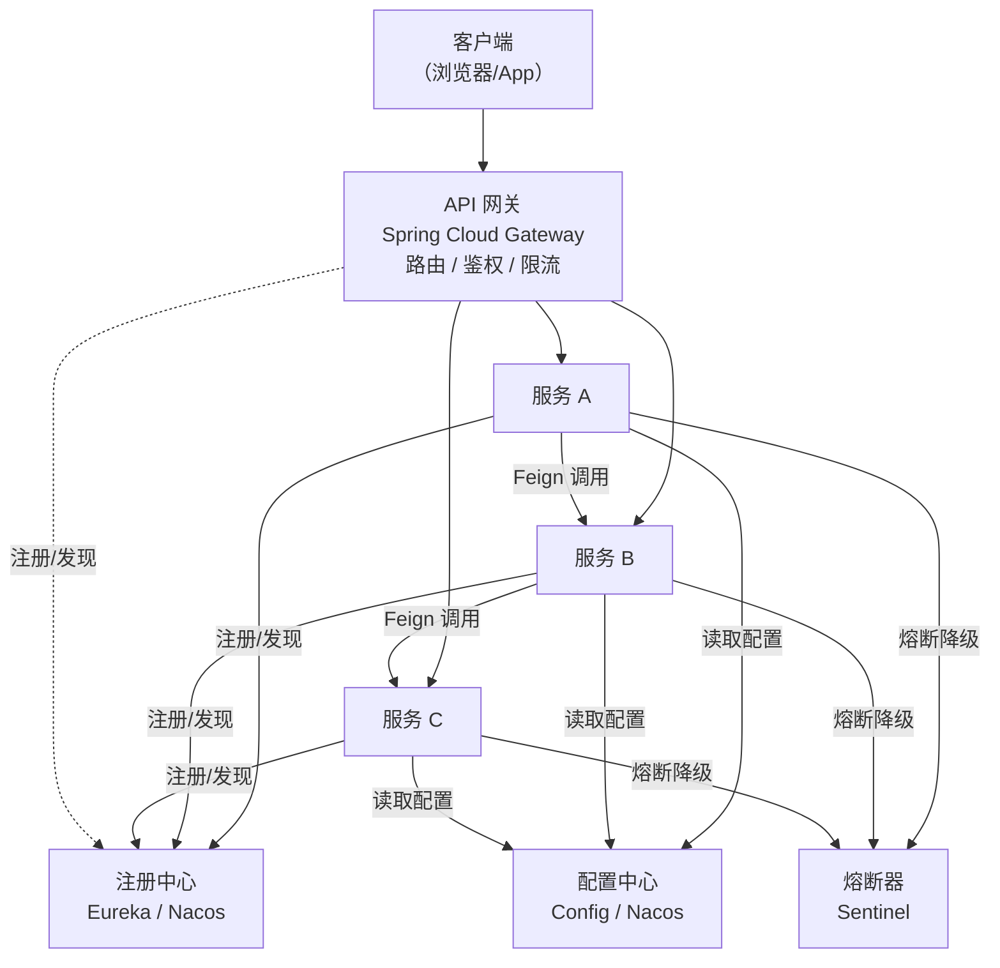
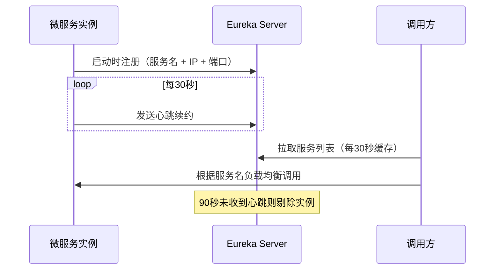
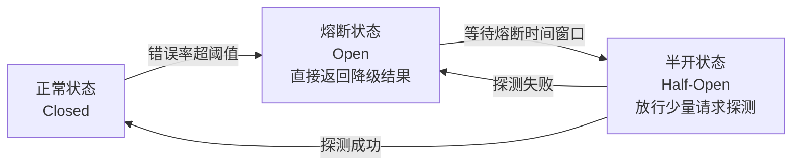

# Spring Cloud 核心组件

---

## 1. 为什么需要 Spring Cloud？

单体应用拆分为微服务后，带来了一系列新问题：

| 问题 | Spring Cloud 解决方案 |
|------|---------------------|
| 服务太多，地址怎么管理？ | **Eureka / Nacos** 注册中心 |
| 服务间怎么调用？ | **Feign** 声明式 HTTP 客户端 |
| 调用失败怎么办？ | **Sentinel / Hystrix** 熔断降级 |
| 外部请求怎么路由？ | **Spring Cloud Gateway** API 网关 |
| 配置文件怎么统一管理？ | **Config / Nacos** 配置中心 |
| 分布式链路怎么追踪？ | **Sleuth + Zipkin** 链路追踪 |

---

## 2. 整体架构



---

## 3. Eureka 注册中心

### 工作原理



### 三个核心机制

| 机制 | 说明 |
|------|------|
| **服务注册** | 服务启动时向 Eureka 注册自己的信息 |
| **心跳续约** | 每 30 秒发送心跳，90 秒未收到则剔除 |
| **自我保护** | 短时间内大量服务下线时，Eureka 不剔除（防止网络抖动误删） |

### 自我保护模式

```
# 触发条件：15分钟内心跳续约比例 < 85%
# 效果：停止剔除过期服务，保留所有注册信息
# 目的：防止网络分区时误删健康服务

# 开发环境建议关闭（避免测试时服务下线后仍被发现）
eureka:
  server:
    enable-self-preservation: false
```

---

## 4. Spring Cloud Gateway

### 核心概念

- **Route（路由）**：转发规则，包含 ID、目标 URI、断言、过滤器
- **Predicate（断言）**：匹配条件，如路径、请求头、时间等
- **Filter（过滤器）**：对请求/响应进行处理，如鉴权、限流、日志

### 配置示例

```yaml
spring:
  cloud:
    gateway:
      routes:
        - id: user-service
          uri: lb://user-service        # lb:// 表示负载均衡
          predicates:
            - Path=/api/users/**        # 路径匹配
          filters:
            - StripPrefix=1             # 去掉路径前缀 /api
            - name: RequestRateLimiter  # 限流过滤器
              args:
                redis-rate-limiter.replenishRate: 100   # 每秒100个请求
                redis-rate-limiter.burstCapacity: 200

        - id: qa-service
          uri: lb://qa-service
          predicates:
            - Path=/api/questions/**
            - Header=X-Version, v2      # 请求头匹配（灰度发布）
```

### 全局过滤器（鉴权）

```java
@Component
public class AuthGlobalFilter implements GlobalFilter, Ordered {

    @Autowired
    private JwtUtils jwtUtils;

    // 白名单：不需要鉴权的路径
    private static final List<String> WHITE_LIST = List.of(
        "/api/auth/login", "/api/auth/register"
    );

    @Override
    public Mono<Void> filter(ServerWebExchange exchange, GatewayFilterChain chain) {
        String path = exchange.getRequest().getPath().value();

        // 白名单直接放行
        if (WHITE_LIST.stream().anyMatch(path::startsWith)) {
            return chain.filter(exchange);
        }

        // 校验 Token
        String token = exchange.getRequest().getHeaders().getFirst("Authorization");
        if (token == null || !token.startsWith("Bearer ")) {
            exchange.getResponse().setStatusCode(HttpStatus.UNAUTHORIZED);
            return exchange.getResponse().setComplete();
        }

        try {
            Claims claims = jwtUtils.parseToken(token.substring(7));
            // 将用户信息注入 Header，传递给下游服务
            ServerHttpRequest mutatedRequest = exchange.getRequest().mutate()
                .header("X-User-Id", claims.get("userId").toString())
                .header("X-User-Roles", claims.get("roles").toString())
                .build();
            return chain.filter(exchange.mutate().request(mutatedRequest).build());
        } catch (JwtException e) {
            exchange.getResponse().setStatusCode(HttpStatus.UNAUTHORIZED);
            return exchange.getResponse().setComplete();
        }
    }

    @Override
    public int getOrder() {
        return -100;  // 数字越小优先级越高
    }
}
```

---

## 5. Feign 声明式调用

Feign 让服务间调用像调用本地方法一样简单：

```java
// 定义 Feign 客户端接口
@FeignClient(
    name = "user-service",           // 服务名（从注册中心发现）
    fallback = UserClientFallback.class  // 降级实现
)
public interface UserClient {

    @GetMapping("/users/{id}")
    UserVO getUserById(@PathVariable Long id);

    @PostMapping("/users/batch")
    List<UserVO> getUsersByIds(@RequestBody List<Long> ids);
}

// 降级实现（Feign 调用失败时执行）
@Component
public class UserClientFallback implements UserClient {

    @Override
    public UserVO getUserById(Long id) {
        return UserVO.empty();  // 返回空对象，避免 NPE
    }

    @Override
    public List<UserVO> getUsersByIds(List<Long> ids) {
        return Collections.emptyList();
    }
}
```

**Feign 超时配置**：

```yaml
feign:
  client:
    config:
      default:              # 全局默认配置
        connect-timeout: 1000
        read-timeout: 5000
      user-service:         # 针对特定服务的配置
        read-timeout: 3000
  circuitbreaker:
    enabled: true           # 开启熔断
```

---

## 6. Sentinel 熔断降级

### 核心概念



### 三种保护规则

| 规则 | 说明 | 适用场景 |
|------|------|---------|
| **流量控制** | 限制 QPS 或并发线程数 | 防止流量突增压垮服务 |
| **熔断降级** | 错误率/慢调用比例超阈值时熔断 | 防止故障扩散（雪崩） |
| **热点参数限流** | 对特定参数值限流 | 防止热点数据被刷 |

```java
// 注解方式使用 Sentinel
@SentinelResource(
    value = "getUserById",
    fallback = "getUserByIdFallback",      // 降级方法
    blockHandler = "getUserByIdBlock"       // 被限流时的处理方法
)
public UserVO getUserById(Long id) {
    return userClient.getUserById(id);
}

// 降级方法（业务异常时调用）
public UserVO getUserByIdFallback(Long id, Throwable e) {
    log.error("获取用户失败，id={}", id, e);
    return UserVO.empty();
}

// 限流方法（触发流控规则时调用）
public UserVO getUserByIdBlock(Long id, BlockException e) {
    return UserVO.builder().message("系统繁忙，请稍后重试").build();
}
```

---

## 7. 常见问题

**Q1：Eureka 和 Nacos 的区别？**
> Eureka 是 AP 模型（可用性优先），服务注册信息可能短暂不一致，有自我保护机制；Nacos 同时支持 AP 和 CP 模式可切换，还集成了配置中心功能，功能更丰富，是目前更主流的选择。

**Q2：Gateway 和 Nginx 的区别？**
> Nginx 是基于 C 的高性能反向代理，适合静态资源、SSL 终止、负载均衡；Gateway 是 Java 实现，与 Spring 生态深度集成，支持动态路由、服务发现、自定义过滤器（鉴权、限流），更适合微服务场景的业务网关。

**Q3：Feign 调用超时怎么处理？**
> ① 配置合理的超时时间（连接超时 1s，读取超时 3-5s）；② 配置 Fallback 降级，超时时返回默认值；③ 结合 Sentinel 熔断，错误率过高时快速失败，防止线程堆积。

**Q4：什么是服务雪崩？如何防止？**
> 服务雪崩：A 调 B，B 调 C，C 响应慢导致 B 线程堆积，进而 A 也被拖垮，整个调用链崩溃。防止方案：① **超时**：设置合理超时，快速失败；② **熔断**：错误率超阈值时直接返回降级结果；③ **限流**：控制入口流量；④ **隔离**：不同服务使用独立线程池，互不影响。

**Q5：Gateway 的全局过滤器和局部过滤器的区别？**
> 全局过滤器（`GlobalFilter`）对所有路由生效，适合做鉴权、日志、链路追踪等通用逻辑；局部过滤器（`GatewayFilter`）只对配置了该过滤器的路由生效，适合做特定路由的限流、重写路径等。

**一句话总结**：Spring Cloud = Eureka（服务发现）+ Gateway（流量入口）+ Feign（服务调用）+ Sentinel（熔断限流）+ Config（配置管理）。