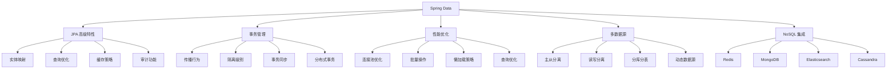

# Spring 数据访问高级技巧

---

## 概述

Spring Data 提供了强大的数据访问抽象，支持多种数据存储技术。本文深度解析 Spring Data 的高级特性和最佳实践。



## JPA 高级特性

### 1. 实体映射高级技巧

#### 继承映射策略
```java
// 继承映射示例
@Entity
@Inheritance(strategy = InheritanceType.JOINED)
public abstract class Payment {
    @Id
    @GeneratedValue(strategy = GenerationType.IDENTITY)
    private Long id;
    
    private BigDecimal amount;
    private LocalDateTime paymentDate;
    
    // getters and setters
}

@Entity
public class CreditCardPayment extends Payment {
    private String cardNumber;
    private String cardHolder;
    private String expiryDate;
    
    // getters and setters
}

@Entity
public class BankTransferPayment extends Payment {
    private String bankName;
    private String accountNumber;
    private String reference;
    
    // getters and setters
}

@Entity
public class PayPalPayment extends Payment {
    private String paypalEmail;
    private String transactionId;
    
    // getters and setters
}

// 继承策略对比
/*
1. SINGLE_TABLE: 所有子类存储在一张表中，使用鉴别器列区分类型
2. JOINED: 每个类对应一张表，通过外键关联
3. TABLE_PER_CLASS: 每个具体类对应一张表，不推荐使用
*/
```

#### 复杂类型映射
```java
// 自定义类型转换器
@Converter(autoApply = true)
public class LocalDateConverter implements AttributeConverter<LocalDate, Date> {
    
    @Override
    public Date convertToDatabaseColumn(LocalDate localDate) {
        return localDate != null ? Date.valueOf(localDate) : null;
    }
    
    @Override
    public LocalDate convertToEntityAttribute(Date date) {
        return date != null ? date.toLocalDate() : null;
    }
}

// JSON 类型映射
@Entity
public class Product {
    @Id
    @GeneratedValue(strategy = GenerationType.IDENTITY)
    private Long id;
    
    private String name;
    private BigDecimal price;
    
    // 使用 JSON 类型存储规格信息
    @Column(columnDefinition = "json")
    @Convert(converter = JsonConverter.class)
    private Map<String, Object> specifications;
    
    // getters and setters
}

// JSON 转换器
@Converter
public class JsonConverter implements AttributeConverter<Map<String, Object>, String> {
    
    private static final ObjectMapper objectMapper = new ObjectMapper();
    
    @Override
    public String convertToDatabaseColumn(Map<String, Object> attribute) {
        try {
            return objectMapper.writeValueAsString(attribute);
        } catch (JsonProcessingException e) {
            throw new RuntimeException("JSON conversion error", e);
        }
    }
    
    @Override
    public Map<String, Object> convertToEntityAttribute(String dbData) {
        try {
            return objectMapper.readValue(dbData, new TypeReference<Map<String, Object>>() {});
        } catch (JsonProcessingException e) {
            throw new RuntimeException("JSON conversion error", e);
        }
    }
}
```

### 2. 查询优化技巧

#### 自定义查询方法
```java
@Repository
public interface UserRepository extends JpaRepository<User, Long> {
    
    // 基本查询方法
    List<User> findByEmailContaining(String email);
    List<User> findByCreatedAtBetween(LocalDateTime start, LocalDateTime end);
    Optional<User> findByUsernameAndEnabledTrue(String username);
    
    // 分页查询
    Page<User> findByRole(Role role, Pageable pageable);
    Slice<User> findTop10ByOrderByCreatedAtDesc();
    
    // 投影查询（只返回部分字段）
    @Query("select u.username, u.email from User u where u.role = :role")
    List<UserProjection> findUsernamesByRole(@Param("role") Role role);
    
    // 动态查询
    @Query("select u from User u where " +
           "(:username is null or u.username like %:username%) and " +
           "(:email is null or u.email like %:email%) and " +
           "(:role is null or u.role = :role)")
    List<User> findUsersByCriteria(@Param("username") String username,
                                  @Param("email") String email,
                                  @Param("role") Role role);
    
    // 原生 SQL 查询
    @Query(value = "SELECT * FROM users u WHERE u.created_at > :sinceDate", 
           nativeQuery = true)
    List<User> findRecentUsers(@Param("sinceDate") LocalDateTime sinceDate);
    
    // 更新查询（避免 select + update）
    @Modifying
    @Query("update User u set u.lastLogin = :lastLogin where u.id = :userId")
    int updateLastLogin(@Param("userId") Long userId, 
                       @Param("lastLogin") LocalDateTime lastLogin);
    
    // 删除查询
    @Modifying
    @Query("delete from User u where u.enabled = false and u.createdAt < :expiryDate")
    int deleteInactiveUsers(@Param("expiryDate") LocalDateTime expiryDate);
}

// 投影接口
public interface UserProjection {
    String getUsername();
    String getEmail();
    
    // 计算属性
    default String getDisplayName() {
        return getUsername() + " (" + getEmail() + ")";
    }
}
```

#### 动态查询构建器
```java
// 使用 Specification 构建动态查询
@Repository
public interface UserRepository extends JpaRepository<User, Long>, JpaSpecificationExecutor<User> {
    
    default List<User> findUsersByDynamicCriteria(UserSearchCriteria criteria) {
        return findAll((root, query, criteriaBuilder) -> {
            List<Predicate> predicates = new ArrayList<>();
            
            if (criteria.getUsername() != null) {
                predicates.add(criteriaBuilder.like(root.get("username"), 
                    "%" + criteria.getUsername() + "%"));
            }
            
            if (criteria.getEmail() != null) {
                predicates.add(criteriaBuilder.like(root.get("email"), 
                    "%" + criteria.getEmail() + "%"));
            }
            
            if (criteria.getRole() != null) {
                predicates.add(criteriaBuilder.equal(root.get("role"), criteria.getRole()));
            }
            
            if (criteria.getCreatedFrom() != null) {
                predicates.add(criteriaBuilder.greaterThanOrEqualTo(
                    root.get("createdAt"), criteria.getCreatedFrom()));
            }
            
            if (criteria.getCreatedTo() != null) {
                predicates.add(criteriaBuilder.lessThanOrEqualTo(
                    root.get("createdAt"), criteria.getCreatedTo()));
            }
            
            if (criteria.isEnabledOnly()) {
                predicates.add(criteriaBuilder.isTrue(root.get("enabled")));
            }
            
            return criteriaBuilder.and(predicates.toArray(new Predicate[0]));
        });
    }
}

// 查询条件类
public class UserSearchCriteria {
    private String username;
    private String email;
    private Role role;
    private LocalDateTime createdFrom;
    private LocalDateTime createdTo;
    private boolean enabledOnly;
    
    // getters and setters
}
```

## 事务管理高级技巧

### 1. 事务传播行为深度解析

```java
@Service
@Transactional
public class OrderService {
    
    @Autowired
    private OrderRepository orderRepository;
    
    @Autowired
    private PaymentService paymentService;
    
    @Autowired
    private InventoryService inventoryService;
    
    @Autowired
    private NotificationService notificationService;
    
    // REQUIRED（默认）：如果当前有事务，就加入该事务；如果没有，就新建一个事务
    @Transactional(propagation = Propagation.REQUIRED)
    public Order createOrder(OrderRequest request) {
        Order order = createOrderInternal(request);
        
        // 在同一个事务中处理支付
        paymentService.processPayment(order);
        
        // 在同一个事务中扣减库存
        inventoryService.deductInventory(order);
        
        return order;
    }
    
    // REQUIRES_NEW：新建事务，如果当前有事务，把当前事务挂起
    @Transactional(propagation = Propagation.REQUIRES_NEW)
    public void processPayment(Order order) {
        // 支付处理，独立事务
        // 即使外部事务回滚，支付记录也会保留
    }
    
    // NOT_SUPPORTED：以非事务方式执行，如果当前有事务，把当前事务挂起
    @Transactional(propagation = Propagation.NOT_SUPPORTED)
    public void sendNotification(Order order) {
        // 发送通知，不需要事务
        // 即使外部事务回滚，通知也会发送
    }
    
    // NESTED：如果当前有事务，则在嵌套事务内执行
    @Transactional(propagation = Propagation.NESTED)
    public void deductInventory(Order order) {
        // 嵌套事务：如果外部事务回滚，嵌套事务也会回滚
        // 但嵌套事务可以独立回滚而不影响外部事务
    }
    
    // MANDATORY：必须在一个已有的事务中执行，否则抛出异常
    @Transactional(propagation = Propagation.MANDATORY)
    public void validateOrder(Order order) {
        // 必须在事务中执行
    }
    
    // NEVER：必须不在事务中执行，否则抛出异常
    @Transactional(propagation = Propagation.NEVER)
    public void generateReport() {
        // 生成报表，不能有事务
    }
    
    // SUPPORTS：如果当前有事务，就加入该事务；如果没有，就以非事务方式执行
    @Transactional(propagation = Propagation.SUPPORTS)
    public Order getOrder(Long orderId) {
        // 查询操作，支持事务但不强制
        return orderRepository.findById(orderId).orElse(null);
    }
}
```

### 2. 事务隔离级别

```java
@Service
@Transactional
public class AccountService {
    
    @Autowired
    private AccountRepository accountRepository;
    
    // READ_UNCOMMITTED：允许读取未提交的数据变更（脏读）
    @Transactional(isolation = Isolation.READ_UNCOMMITTED)
    public BigDecimal getAccountBalanceUnsafe(Long accountId) {
        // 可能读取到未提交的数据
        return accountRepository.findBalanceById(accountId);
    }
    
    // READ_COMMITTED：只能读取已提交的数据（避免脏读）
    @Transactional(isolation = Isolation.READ_COMMITTED)
    public BigDecimal getAccountBalance(Long accountId) {
        // 只能读取已提交的数据
        return accountRepository.findBalanceById(accountId);
    }
    
    // REPEATABLE_READ：同一事务中多次读取结果一致（避免不可重复读）
    @Transactional(isolation = Isolation.REPEATABLE_READ)
    public void transferMoney(Long fromAccountId, Long toAccountId, BigDecimal amount) {
        // 在事务期间，读取的数据不会被其他事务修改
        Account fromAccount = accountRepository.findById(fromAccountId).orElseThrow();
        Account toAccount = accountRepository.findById(toAccountId).orElseThrow();
        
        fromAccount.setBalance(fromAccount.getBalance().subtract(amount));
        toAccount.setBalance(toAccount.getBalance().add(amount));
        
        accountRepository.save(fromAccount);
        accountRepository.save(toAccount);
    }
    
    // SERIALIZABLE：最高隔离级别，完全串行化执行（避免幻读）
    @Transactional(isolation = Isolation.SERIALIZABLE)
    public void batchUpdateAccounts(List<AccountUpdate> updates) {
        // 完全串行化执行，避免并发问题
        for (AccountUpdate update : updates) {
            Account account = accountRepository.findById(update.getAccountId()).orElseThrow();
            account.setBalance(account.getBalance().add(update.getAmount()));
            accountRepository.save(account);
        }
    }
    
    // DEFAULT：使用数据库默认隔离级别
    @Transactional(isolation = Isolation.DEFAULT)
    public void defaultOperation() {
        // 使用数据库默认隔离级别
    }
}
```

## 性能优化技巧

### 1. 连接池优化

#### HikariCP 配置优化
```yaml
# application.yml
spring:
  datasource:
    hikari:
      # 连接池大小配置
      maximum-pool-size: 20           # 最大连接数（根据应用负载调整）
      minimum-idle: 5                 # 最小空闲连接
      
      # 连接生命周期
      max-lifetime: 1800000           # 连接最大存活时间（30分钟）
      connection-timeout: 30000       # 连接超时时间（30秒）
      idle-timeout: 600000            # 空闲连接超时时间（10分钟）
      
      # 连接验证
      connection-test-query: "SELECT 1"
      validation-timeout: 5000        # 验证超时时间（5秒）
      
      # 泄漏检测
      leak-detection-threshold: 60000 # 泄漏检测阈值（60秒）
      
      # 性能优化
      initialization-fail-timeout: 1  # 初始化失败超时（立即失败）
      
  jpa:
    properties:
      hibernate:
        # 批量操作优化
        jdbc.batch_size: 50           # 批量操作大小
        order_inserts: true           # 优化插入顺序
        order_updates: true           # 优化更新顺序
        
        # 二级缓存配置
        cache.use_second_level_cache: true
        cache.region.factory_class: org.hibernate.cache.ehcache.EhCacheRegionFactory
        
        # 查询缓存
        cache.use_query_cache: true
        
        # 统计信息（生产环境关闭）
        generate_statistics: false
```

### 2. 批量操作优化

#### JPA 批量插入
```java
@Service
@Transactional
public class BatchService {
    
    @PersistenceContext
    private EntityManager entityManager;
    
    @Autowired
    private UserRepository userRepository;
    
    // 批量插入优化
    public void batchInsertUsers(List<User> users) {
        for (int i = 0; i < users.size(); i++) {
            entityManager.persist(users.get(i));
            
            // 每50条刷新一次
            if (i % 50 == 0) {
                entityManager.flush();
                entityManager.clear();
            }
        }
        
        entityManager.flush();
        entityManager.clear();
    }
    
    // 使用原生 SQL 批量插入（性能最佳）
    @Transactional
    public void batchInsertUsersNative(List<User> users) {
        String sql = "INSERT INTO users (username, email, created_at) VALUES (?, ?, ?)";
        
        entityManager.createNativeQuery(sql)
            .unwrap(org.hibernate.SQLQuery.class)
            .addSynchronizedEntityClass(User.class);
        
        for (int i = 0; i < users.size(); i++) {
            User user = users.get(i);
            entityManager.createNativeQuery(sql)
                .setParameter(1, user.getUsername())
                .setParameter(2, user.getEmail())
                .setParameter(3, user.getCreatedAt())
                .executeUpdate();
            
            // 每100条提交一次
            if (i % 100 == 0) {
                entityManager.flush();
            }
        }
    }
    
    // 使用 Spring Data 的批量保存
    @Transactional
    public void batchSaveUsers(List<User> users) {
        // Spring Data JPA 的 saveAll 方法内部会进行批量优化
        userRepository.saveAll(users);
    }
}
```

#### 批量更新优化
```java
@Service
@Transactional
public class BatchUpdateService {
    
    @PersistenceContext
    private EntityManager entityManager;
    
    // 批量更新（避免 N+1 查询问题）
    @Transactional
    public int batchUpdateUserStatus(List<Long> userIds, UserStatus newStatus) {
        String jpql = "UPDATE User u SET u.status = :newStatus WHERE u.id IN :userIds";
        
        return entityManager.createQuery(jpql)
            .setParameter("newStatus", newStatus)
            .setParameter("userIds", userIds)
            .executeUpdate();
    }
    
    // 使用原生 SQL 批量更新
    @Transactional
    public int batchUpdateUserStatusNative(List<Long> userIds, UserStatus newStatus) {
        String sql = "UPDATE users SET status = ? WHERE id IN (?)";
        
        // 处理 IN 子句参数（避免参数过多）
        List<List<Long>> batches = partitionList(userIds, 1000);
        int totalUpdated = 0;
        
        for (List<Long> batch : batches) {
            String inClause = batch.stream()
                .map(String::valueOf)
                .collect(Collectors.joining(","));
            
            String batchSql = sql.replace("(?)", "(" + inClause + ")");
            
            totalUpdated += entityManager.createNativeQuery(batchSql)
                .setParameter(1, newStatus.name())
                .executeUpdate();
        }
        
        return totalUpdated;
    }
    
    private <T> List<List<T>> partitionList(List<T> list, int batchSize) {
        List<List<T>> batches = new ArrayList<>();
        
        for (int i = 0; i < list.size(); i += batchSize) {
            batches.add(list.subList(i, Math.min(i + batchSize, list.size())));
        }
        
        return batches;
    }
}
```

## 多数据源配置

### 1. 主从数据源配置

```java
// 主数据源配置
@Configuration
@EnableTransactionManagement
@EnableJpaRepositories(
    basePackages = "com.example.repository.primary",
    entityManagerFactoryRef = "primaryEntityManagerFactory",
    transactionManagerRef = "primaryTransactionManager"
)
public class PrimaryDataSourceConfig {
    
    @Bean
    @Primary
    @ConfigurationProperties("spring.datasource.primary")
    public DataSource primaryDataSource() {
        return DataSourceBuilder.create().build();
    }
    
    @Bean
    @Primary
    public LocalContainerEntityManagerFactoryBean primaryEntityManagerFactory(
            EntityManagerFactoryBuilder builder) {
        return builder
            .dataSource(primaryDataSource())
            .packages("com.example.entity.primary")
            .persistenceUnit("primary")
            .properties(jpaProperties())
            .build();
    }
    
    @Bean
    @Primary
    public PlatformTransactionManager primaryTransactionManager(
            @Qualifier("primaryEntityManagerFactory") EntityManagerFactory entityManagerFactory) {
        return new JpaTransactionManager(entityManagerFactory);
    }
    
    private Map<String, Object> jpaProperties() {
        Map<String, Object> props = new HashMap<>();
        props.put("hibernate.dialect", "org.hibernate.dialect.MySQL8Dialect");
        props.put("hibernate.hbm2ddl.auto", "validate");
        props.put("hibernate.show_sql", "false");
        return props;
    }
}

// 从数据源配置
@Configuration
@EnableTransactionManagement
@EnableJpaRepositories(
    basePackages = "com.example.repository.secondary",
    entityManagerFactoryRef = "secondaryEntityManagerFactory", 
    transactionManagerRef = "secondaryTransactionManager"
)
public class SecondaryDataSourceConfig {
    
    @Bean
    @ConfigurationProperties("spring.datasource.secondary")
    public DataSource secondaryDataSource() {
        return DataSourceBuilder.create().build();
    }
    
    @Bean
    public LocalContainerEntityManagerFactoryBean secondaryEntityManagerFactory(
            EntityManagerFactoryBuilder builder) {
        return builder
            .dataSource(secondaryDataSource())
            .packages("com.example.entity.secondary")
            .persistenceUnit("secondary")
            .properties(jpaProperties())
            .build();
    }
    
    @Bean
    public PlatformTransactionManager secondaryTransactionManager(
            @Qualifier("secondaryEntityManagerFactory") EntityManagerFactory entityManagerFactory) {
        return new JpaTransactionManager(entityManagerFactory);
    }
    
    private Map<String, Object> jpaProperties() {
        Map<String, Object> props = new HashMap<>();
        props.put("hibernate.dialect", "org.hibernate.dialect.MySQL8Dialect");
        props.put("hibernate.hbm2ddl.auto", "validate");
        props.put("hibernate.show_sql", "false");
        return props;
    }
}
```

### 2. 动态数据源路由

```java
// 数据源路由键
public class DataSourceContextHolder {
    
    private static final ThreadLocal<String> CONTEXT_HOLDER = new ThreadLocal<>();
    
    public static void setDataSource(String dataSource) {
        CONTEXT_HOLDER.set(dataSource);
    }
    
    public static String getDataSource() {
        return CONTEXT_HOLDER.get();
    }
    
    public static void clearDataSource() {
        CONTEXT_HOLDER.remove();
    }
}

// 动态数据源
public class DynamicDataSource extends AbstractRoutingDataSource {
    
    @Override
    protected Object determineCurrentLookupKey() {
        return DataSourceContextHolder.getDataSource();
    }
}

// 数据源配置
@Configuration
public class DynamicDataSourceConfig {
    
    @Bean
    @ConfigurationProperties("spring.datasource.master")
    public DataSource masterDataSource() {
        return DataSourceBuilder.create().build();
    }
    
    @Bean
    @ConfigurationProperties("spring.datasource.slave")
    public DataSource slaveDataSource() {
        return DataSourceBuilder.create().build();
    }
    
    @Bean
    public DataSource dynamicDataSource() {
        Map<Object, Object> targetDataSources = new HashMap<>();
        targetDataSources.put("master", masterDataSource());
        targetDataSources.put("slave", slaveDataSource());
        
        DynamicDataSource dynamicDataSource = new DynamicDataSource();
        dynamicDataSource.setTargetDataSources(targetDataSources);
        dynamicDataSource.setDefaultTargetDataSource(masterDataSource());
        
        return dynamicDataSource;
    }
    
    @Bean
    public PlatformTransactionManager transactionManager() {
        return new DataSourceTransactionManager(dynamicDataSource());
    }
}

// 数据源切面
@Aspect
@Component
public class DataSourceAspect {
    
    // 读操作使用从库
    @Before("execution(* com.example.service.*Service.*(..)) && " +
           "@annotation(com.example.annotation.ReadOnly)")
    public void setReadDataSource() {
        DataSourceContextHolder.setDataSource("slave");
    }
    
    // 写操作使用主库
    @Before("execution(* com.example.service.*Service.*(..)) && " +
           "!@annotation(com.example.annotation.ReadOnly)")
    public void setWriteDataSource() {
        DataSourceContextHolder.setDataSource("master");
    }
    
    @After("execution(* com.example.service.*Service.*(..))")
    public void clearDataSource() {
        DataSourceContextHolder.clearDataSource();
    }
}

// 只读注解
@Target(ElementType.METHOD)
@Retention(RetentionPolicy.RUNTIME)
public @interface ReadOnly {
}
```

## 总结

Spring Data 提供了强大的数据访问能力：

1. **JPA 高级特性**：继承映射、复杂类型、动态查询
2. **事务管理**：传播行为、隔离级别、事务同步
3. **性能优化**：连接池、批量操作、缓存策略
4. **多数据源**：主从分离、读写分离、动态路由
5. **NoSQL 集成**：Redis、MongoDB、Elasticsearch 等

通过深度掌握这些高级技巧，可以构建高性能、可扩展的数据访问层。