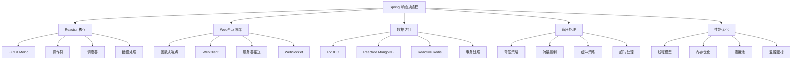

# Spring 响应式编程深度解析

---

## 概述

Spring 5 引入了响应式编程支持，基于 Project Reactor 提供了非阻塞、异步的编程模型。本文深度解析 Spring 响应式编程的核心概念和高级用法。



## Reactor 核心概念

### 1. Flux 和 Mono

#### 基本类型介绍
```java
// Mono: 0-1 个元素的异步序列
Mono<String> monoEmpty = Mono.empty();
Mono<String> monoJust = Mono.just("Hello");
Mono<String> monoError = Mono.error(new RuntimeException("Error"));

// Flux: 0-N 个元素的异步序列
Flux<String> fluxEmpty = Flux.empty();
Flux<String> fluxJust = Flux.just("A", "B", "C");
Flux<Integer> fluxRange = Flux.range(1, 10);
Flux<Long> fluxInterval = Flux.interval(Duration.ofSeconds(1));

// 创建方式对比
public class ReactorCreationExamples {
    
    // 从集合创建
    public Flux<String> fromCollection() {
        List<String> list = Arrays.asList("A", "B", "C");
        return Flux.fromIterable(list);
    }
    
    // 从流创建
    public Flux<Integer> fromStream() {
        return Flux.fromStream(Stream.of(1, 2, 3, 4, 5));
    }
    
    // 异步创建
    public Flux<String> createAsync() {
        return Flux.create(sink -> {
            // 异步事件源
            someAsyncEventSource.register(event -> {
                sink.next(event);
                if (event.equals("COMPLETE")) {
                    sink.complete();
                }
            });
        });
    }
    
    // 生成器模式
    public Flux<Integer> generateSequence() {
        return Flux.generate(
            () -> 0, // 初始状态
            (state, sink) -> {
                sink.next(state);
                if (state == 10) {
                    sink.complete();
                }
                return state + 1; // 新状态
            }
        );
    }
    
    // 延迟创建
    public Mono<String> deferredMono() {
        return Mono.defer(() -> {
            // 每次订阅时执行
            return Mono.just(Instant.now().toString());
        });
    }
}
```

#### 操作符深度解析
```java
public class ReactorOperators {
    
    // 转换操作符
    public Flux<String> transformOperators() {
        return Flux.range(1, 5)
            .map(i -> "Number: " + i)           // 一对一转换
            .flatMap(this::asyncProcess)        // 扁平化异步处理
            .filter(s -> s.length() > 10)        // 过滤
            .distinct()                         // 去重
            .sort()                             // 排序
            .take(3)                            // 取前N个
            .skip(1)                            // 跳过前N个
            .buffer(2)                          // 缓冲
            .window(2)                          // 窗口
            .groupBy(s -> s.charAt(0));         // 分组
    }
    
    // 组合操作符
    public Flux<String> combineOperators() {
        Flux<String> flux1 = Flux.just("A", "B", "C");
        Flux<String> flux2 = Flux.just("1", "2", "3");
        
        return Flux.merge(flux1, flux2)         // 合并
            .zipWith(Flux.range(1, 100))        // 压缩
            .map(tuple -> tuple.getT1() + "-" + tuple.getT2())
            .concatWith(Flux.just("END"))       // 连接
            .startWith(Flux.just("START"));     // 前置
    }
    
    // 条件操作符
    public Flux<Integer> conditionalOperators() {
        return Flux.range(1, 10)
            .takeUntil(i -> i > 5)              // 直到条件满足
            .takeWhile(i -> i < 8)              // 当条件满足时
            .defaultIfEmpty(0)                  // 默认值
            .switchIfEmpty(Flux.just(-1, -2));  // 切换流
    }
    
    // 错误处理操作符
    public Flux<String> errorHandlingOperators() {
        return Flux.just("A", "B", "C")
            .map(this::riskyOperation)
            .onErrorReturn("ERROR")             // 错误时返回默认值
            .onErrorResume(throwable -> {       // 错误时恢复
                if (throwable instanceof IllegalArgumentException) {
                    return Flux.just("RECOVERED");
                }
                return Flux.error(throwable);
            })
            .retry(3)                           // 重试3次
            .retryWhen(Retry.fixedDelay(3, Duration.ofSeconds(1))); // 延迟重试
    }
    
    // 工具操作符
    public Mono<Void> utilityOperators() {
        return Flux.range(1, 5)
            .doOnNext(i -> System.out.println("Next: " + i))     // 副作用
            .doOnComplete(() -> System.out.println("Complete"))  // 完成回调
            .doOnError(e -> System.err.println("Error: " + e))    // 错误回调
            .doOnSubscribe(s -> System.out.println("Subscribed")) // 订阅回调
            .doOnRequest(n -> System.out.println("Request: " + n)) // 请求回调
            .then();                                             // 转换为 Mono<Void>
    }
    
    private Mono<String> asyncProcess(String input) {
        return Mono.fromCallable(() -> {
            // 模拟异步处理
            Thread.sleep(100);
            return input.toUpperCase();
        }).subscribeOn(Schedulers.boundedElastic());
    }
    
    private String riskyOperation(String input) {
        if (input.equals("B")) {
            throw new IllegalArgumentException("B is not allowed");
        }
        return input;
    }
}
```

### 2. 调度器（Schedulers）

#### 调度器类型和使用场景
```java
public class SchedulerExamples {
    
    // 立即调度器（当前线程）
    public Flux<String> immediateScheduler() {
        return Flux.just("A", "B", "C")
            .publishOn(Schedulers.immediate()); // 在当前线程执行
    }
    
    // 单线程调度器
    public Flux<String> singleScheduler() {
        return Flux.just("A", "B", "C")
            .publishOn(Schedulers.single())     // 单个后台线程
            .map(String::toUpperCase);
    }
    
    // 弹性调度器（适合阻塞操作）
    public Flux<String> elasticScheduler() {
        return Flux.just("A", "B", "C")
            .subscribeOn(Schedulers.boundedElastic()) // I/O 密集型任务
            .flatMap(this::blockingOperation);
    }
    
    // 并行调度器
    public Flux<String> parallelScheduler() {
        return Flux.range(1, 100)
            .parallel()                         // 并行处理
            .runOn(Schedulers.parallel())       // 使用并行调度器
            .map(i -> "Item-" + i)
            .sequential();                      // 转回顺序流
    }
    
    // 自定义调度器
    public Flux<String> customScheduler() {
        Scheduler customScheduler = Schedulers.newBoundedElastic(
            10,                                  // 最大线程数
            100,                                 // 任务队列大小
            "custom-scheduler"                   // 线程名前缀
        );
        
        return Flux.just("A", "B", "C")
            .publishOn(customScheduler)
            .doFinally(signal -> customScheduler.dispose()); // 使用后清理
    }
    
    // publishOn vs subscribeOn
    public void publishVsSubscribe() {
        Flux.just("A", "B", "C")
            .map(s -> {
                System.out.println("Map on: " + Thread.currentThread().getName());
                return s.toLowerCase();
            })
            .publishOn(Schedulers.boundedElastic()) // 影响下游操作
            .map(s -> {
                System.out.println("After publishOn: " + Thread.currentThread().getName());
                return s.toUpperCase();
            })
            .subscribeOn(Schedulers.parallel())     // 影响整个链
            .subscribe();
    }
    
    private Mono<String> blockingOperation(String input) {
        return Mono.fromCallable(() -> {
            // 模拟阻塞操作
            Thread.sleep(1000);
            return "Processed: " + input;
        });
    }
}
```

## Spring WebFlux 深度解析

### 1. 函数式端点（Functional Endpoints）

#### RouterFunction 配置
```java
@Configuration
public class RouterConfig {
    
    @Bean
    public RouterFunction<ServerResponse> routerFunction(UserHandler userHandler) {
        return RouterFunctions.route()
            .GET("/users", userHandler::getAllUsers)
            .GET("/users/{id}", userHandler::getUserById)
            .POST("/users", userHandler::createUser)
            .PUT("/users/{id}", userHandler::updateUser)
            .DELETE("/users/{id}", userHandler::deleteUser)
            .GET("/users/{id}/posts", userHandler::getUserPosts)
            .nest(RequestPredicates.path("/api"), this::apiRoutes)
            .filter(this::securityFilter)
            .build();
    }
    
    private RouterFunction<ServerResponse> apiRoutes() {
        return RouterFunctions.route()
            .GET("/v2/users", request -> ServerResponse.ok().bodyValue("API V2"))
            .build();
    }
    
    private Mono<ServerResponse> securityFilter(ServerRequest request, 
                                               HandlerFunction<ServerResponse> next) {
        String authHeader = request.headers().firstHeader("Authorization");
        
        if (authHeader == null || !authHeader.startsWith("Bearer ")) {
            return ServerResponse.status(HttpStatus.UNAUTHORIZED).build();
        }
        
        // 验证令牌
        return validateToken(authHeader.substring(7))
            .flatMap(valid -> valid ? next.handle(request) : 
                     ServerResponse.status(HttpStatus.UNAUTHORIZED).build());
    }
    
    private Mono<Boolean> validateToken(String token) {
        // 令牌验证逻辑
        return Mono.just(token.equals("valid-token"));
    }
}

// 处理器类
@Component
public class UserHandler {
    
    @Autowired
    private UserService userService;
    
    public Mono<ServerResponse> getAllUsers(ServerRequest request) {
        Flux<User> users = userService.findAllUsers();
        
        return ServerResponse.ok()
            .contentType(MediaType.APPLICATION_JSON)
            .body(users, User.class);
    }
    
    public Mono<ServerResponse> getUserById(ServerRequest request) {
        Long userId = Long.valueOf(request.pathVariable("id"));
        
        return userService.findUserById(userId)
            .flatMap(user -> ServerResponse.ok().bodyValue(user))
            .switchIfEmpty(ServerResponse.notFound().build());
    }
    
    public Mono<ServerResponse> createUser(ServerRequest request) {
        return request.bodyToMono(User.class)
            .flatMap(userService::createUser)
            .flatMap(user -> ServerResponse
                .created(URI.create("/users/" + user.getId()))
                .bodyValue(user));
    }
    
    public Mono<ServerResponse> updateUser(ServerRequest request) {
        Long userId = Long.valueOf(request.pathVariable("id"));
        
        return request.bodyToMono(User.class)
            .flatMap(user -> userService.updateUser(userId, user))
            .flatMap(user -> ServerResponse.ok().bodyValue(user))
            .switchIfEmpty(ServerResponse.notFound().build());
    }
    
    public Mono<ServerResponse> deleteUser(ServerRequest request) {
        Long userId = Long.valueOf(request.pathVariable("id"));
        
        return userService.deleteUser(userId)
            .then(ServerResponse.noContent().build());
    }
    
    public Mono<ServerResponse> getUserPosts(ServerRequest request) {
        Long userId = Long.valueOf(request.pathVariable("id"));
        
        return userService.findUserPosts(userId)
            .collectList()
            .flatMap(posts -> ServerResponse.ok().bodyValue(posts));
    }
}
```

### 2. WebClient 深度使用

#### 高级 WebClient 配置
```java
@Configuration
public class WebClientConfig {
    
    @Bean
    public WebClient webClient() {
        return WebClient.builder()
            .baseUrl("https://api.example.com")
            .defaultHeader(HttpHeaders.CONTENT_TYPE, MediaType.APPLICATION_JSON_VALUE)
            .defaultHeader(HttpHeaders.USER_AGENT, "MyApp/1.0")
            .codecs(configurer -> {
                // 配置编解码器
                configurer.defaultCodecs().maxInMemorySize(10 * 1024 * 1024); // 10MB
            })
            .filter((request, next) -> {
                // 请求拦截器
                System.out.println("Sending request: " + request.method() + " " + request.url());
                return next.exchange(request);
            })
            .filter((request, next) -> {
                // 重试逻辑
                return next.exchange(request)
                    .retryWhen(Retry.fixedDelay(3, Duration.ofSeconds(1)));
            })
            .build();
    }
    
    @Bean
    public WebClient.Builder webClientBuilder() {
        return WebClient.builder()
            .clientConnector(new ReactorClientHttpConnector(
                HttpClient.create()
                    .option(ChannelOption.CONNECT_TIMEOUT_MILLIS, 5000)
                    .doOnConnected(conn -> 
                        conn.addHandlerLast(new ReadTimeoutHandler(10))
                            .addHandlerLast(new WriteTimeoutHandler(10)))
            ));
    }
}

@Service
public class ApiClientService {
    
    @Autowired
    private WebClient webClient;
    
    // 基本 GET 请求
    public Mono<User> getUserById(Long userId) {
        return webClient.get()
            .uri("/users/{id}", userId)
            .retrieve()
            .bodyToMono(User.class)
            .timeout(Duration.ofSeconds(5))
            .onErrorResume(WebClientResponseException.NotFound.class, 
                e -> Mono.empty());
    }
    
    // POST 请求带请求体
    public Mono<User> createUser(User user) {
        return webClient.post()
            .uri("/users")
            .bodyValue(user)
            .retrieve()
            .bodyToMono(User.class);
    }
    
    // 流式响应处理
    public Flux<Post> streamUserPosts(Long userId) {
        return webClient.get()
            .uri("/users/{id}/posts/stream", userId)
            .accept(MediaType.TEXT_EVENT_STREAM)
            .retrieve()
            .bodyToFlux(Post.class)
            .take(Duration.ofMinutes(10)); // 限制流持续时间
    }
    
    // 批量请求
    public Flux<User> getUsersBatch(List<Long> userIds) {
        return Flux.fromIterable(userIds)
            .flatMap(this::getUserById, 5); // 并发度限制为5
    }
    
    // 错误处理
    public Mono<ApiResponse<User>> getUserWithErrorHandling(Long userId) {
        return webClient.get()
            .uri("/users/{id}", userId)
            .retrieve()
            .onStatus(HttpStatus::is4xxClientError, response -> {
                return response.bodyToMono(String.class)
                    .flatMap(errorBody -> Mono.error(new ClientException(errorBody)));
            })
            .onStatus(HttpStatus::is5xxServerError, response -> {
                return Mono.error(new ServerException("Server error"));
            })
            .bodyToMono(User.class)
            .map(ApiResponse::success)
            .onErrorResume(ClientException.class, e -> 
                Mono.just(ApiResponse.error(e.getMessage())));
    }
}
```

## 响应式数据访问

### 1. R2DBC（响应式关系数据库连接）

#### R2DBC 配置和使用
```java
@Configuration
@EnableR2dbcRepositories
public class R2dbcConfig extends AbstractR2dbcConfiguration {
    
    @Bean
    @Override
    public ConnectionFactory connectionFactory() {
        return new PostgresqlConnectionFactory(
            PostgresqlConnectionConfiguration.builder()
                .host("localhost")
                .port(5432)
                .database("mydb")
                .username("user")
                .password("password")
                .build()
        );
    }
    
    @Bean
    public R2dbcEntityOperations r2dbcEntityOperations(ConnectionFactory connectionFactory) {
        DatabaseClient databaseClient = DatabaseClient.create(connectionFactory);
        
        R2dbcMappingContext mappingContext = new R2dbcMappingContext();
        mappingContext.setInitialEntitySet(Collections.singleton(User.class));
        
        return new R2dbcEntityTemplate(databaseClient, mappingContext);
    }
}

// 响应式 Repository
public interface UserRepository extends R2dbcRepository<User, Long> {
    
    Flux<User> findByEmailContaining(String email);
    Mono<User> findByUsername(String username);
    Flux<User> findByCreatedAtAfter(LocalDateTime date);
    
    @Query("SELECT * FROM users WHERE age > :minAge ORDER BY created_at DESC")
    Flux<User> findUsersOlderThan(@Param("minAge") int minAge);
    
    @Modifying
    @Query("UPDATE users SET last_login = :lastLogin WHERE id = :userId")
    Mono<Integer> updateLastLogin(@Param("userId") Long userId, 
                                 @Param("lastLogin") LocalDateTime lastLogin);
}

@Service
@Transactional
public class UserService {
    
    @Autowired
    private UserRepository userRepository;
    
    public Mono<User> createUser(User user) {
        return userRepository.save(user);
    }
    
    public Flux<User> findAllUsers() {
        return userRepository.findAll();
    }
    
    public Mono<User> updateUser(Long userId, User user) {
        return userRepository.findById(userId)
            .flatMap(existingUser -> {
                existingUser.setEmail(user.getEmail());
                existingUser.setUsername(user.getUsername());
                return userRepository.save(existingUser);
            });
    }
    
    // 批量操作
    public Flux<User> batchCreateUsers(List<User> users) {
        return Flux.fromIterable(users)
            .buffer(100) // 每100条一批
            .flatMap(batch -> userRepository.saveAll(batch));
    }
}
```

## 背压处理策略

### 1. 背压控制机制

```java
@Service
public class BackpressureService {
    
    // 缓冲策略
    public Flux<Integer> withBuffer() {
        return Flux.range(1, 1000)
            .onBackpressureBuffer(100, // 缓冲区大小
                dropped -> System.out.println("Dropped: " + dropped),
                BufferOverflowStrategy.DROP_LATEST); // 溢出策略
    }
    
    // 丢弃策略
    public Flux<Integer> withDrop() {
        return Flux.range(1, 1000)
            .onBackpressureDrop(item -> 
                System.out.println("Dropped: " + item));
    }
    
    // 最新值策略
    public Flux<Integer> withLatest() {
        return Flux.range(1, 1000)
            .onBackpressureLatest();
    }
    
    // 错误策略
    public Flux<Integer> withError() {
        return Flux.range(1, 1000)
            .onBackpressureError();
    }
    
    // 自定义背压处理
    public Flux<Integer> customBackpressure() {
        return Flux.create(sink -> {
            AtomicLong requested = new AtomicLong();
            
            sink.onRequest(n -> {
                long current = requested.addAndGet(n);
                System.out.println("Requested: " + current);
                
                // 根据请求量控制生产速度
                for (long i = 0; i < n; i++) {
                    if (!sink.isCancelled()) {
                        sink.next((int) (current - n + i + 1));
                    }
                }
            });
        }, FluxSink.OverflowStrategy.BUFFER);
    }
    
    // 速率限制
    public Flux<Integer> rateLimited() {
        return Flux.range(1, 1000)
            .limitRate(10) // 每批次处理10个
            .delayElements(Duration.ofMillis(100)); // 延迟处理
    }
}
```

## 性能优化和监控

### 1. 响应式应用监控

```java
@Configuration
public class MetricsConfig {
    
    @Bean
    public MeterRegistry meterRegistry() {
        return new SimpleMeterRegistry();
    }
    
    @Bean
    public MicrometerMetricsInterceptor metricsInterceptor(MeterRegistry registry) {
        return new MicrometerMetricsInterceptor(registry);
    }
}

@Service
public class MonitoringService {
    
    private final MeterRegistry meterRegistry;
    private final Counter requestCounter;
    private final Timer responseTimer;
    
    public MonitoringService(MeterRegistry meterRegistry) {
        this.meterRegistry = meterRegistry;
        this.requestCounter = Counter.builder("api.requests")
            .description("API request count")
            .register(meterRegistry);
        this.responseTimer = Timer.builder("api.response.time")
            .description("API response time")
            .register(meterRegistry);
    }
    
    public <T> Mono<T> monitorRequest(Mono<T> mono, String endpoint) {
        return Mono.defer(() -> {
            requestCounter.increment();
            long startTime = System.currentTimeMillis();
            
            return mono
                .doOnSuccess(result -> {
                    long duration = System.currentTimeMillis() - startTime;
                    responseTimer.record(duration, TimeUnit.MILLISECONDS);
                    
                    // 记录成功指标
                    meterRegistry.counter("api.success", "endpoint", endpoint).increment();
                })
                .doOnError(error -> {
                    long duration = System.currentTimeMillis() - startTime;
                    responseTimer.record(duration, TimeUnit.MILLISECONDS);
                    
                    // 记录错误指标
                    meterRegistry.counter("api.errors", 
                        "endpoint", endpoint, 
                        "error", error.getClass().getSimpleName()).increment();
                });
        });
    }
}

// 使用示例
@RestController
public class UserController {
    
    @Autowired
    private UserService userService;
    
    @Autowired
    private MonitoringService monitoringService;
    
    @GetMapping("/users")
    public Flux<User> getAllUsers() {
        return monitoringService.monitorRequest(
            userService.findAllUsers().collectList().flatMapMany(Flux::fromIterable),
            "getAllUsers"
        );
    }
}
```

## 总结

Spring 响应式编程提供了强大的异步处理能力：

1. **Reactor 核心**：Flux/Mono、操作符、调度器
2. **WebFlux 框架**：函数式端点、WebClient、服务器推送
3. **响应式数据访问**：R2DBC、Reactive MongoDB/Redis
4. **背压处理**：缓冲、丢弃、速率限制策略
5. **性能优化**：线程模型、内存优化、监控指标

通过深度掌握响应式编程，可以构建高性能、高并发的现代应用。