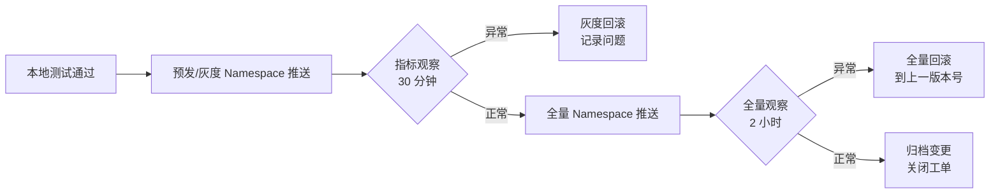
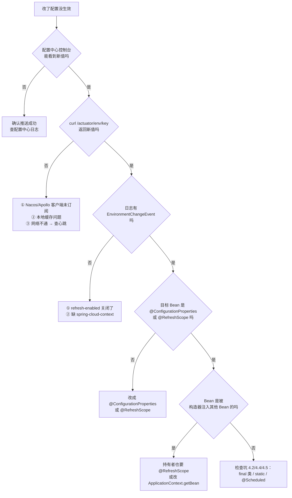
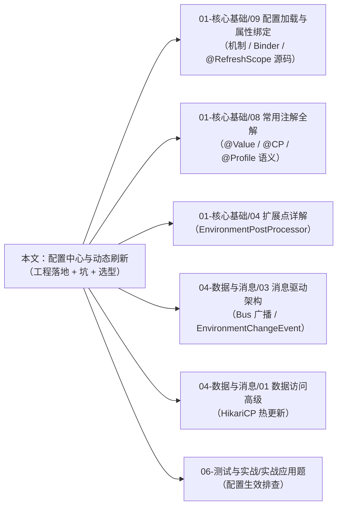

# 配置中心与动态刷新

!!! info "**配置中心与动态刷新一句话口诀**"
    配置中心接入的本质 = "**在 Spring 启动期塞一个高优先级 `PropertySource`** + **长轮询/WebSocket 拿到变更后触发 `ContextRefresher.refresh()`**"——Nacos / Apollo / Config 的 API 不同但套路一致；

    **动态刷新四步法**：① 依赖 `spring-cloud-context`；② 业务类标 `@RefreshScope` 或用 `@ConfigurationProperties`；③ 配置中心推送变更；④ `Actuator /actuator/refresh` 或消息总线 `/actuator/busrefresh` 触发重建；

    **三方选型**：**Nacos** = 配置 + 注册中心二合一、国内生态最好；**Apollo** = 灰度 / 审计 / 多维度 Namespace 最完善、携程背书；**Spring Cloud Config** = 原生血统、纯文本 Git 版本化、但要另配消息总线才能推送；

    **K8s 原生派**：`configtree:/run/secrets/` 直读 ConfigMap/Secret 挂载目录，零外部依赖、最朴素也最可靠；配合 Reloader 等 Operator 实现 Pod 级刷新，语义清晰；

    **密钥管理三件套**：① **绝不**把密码明文塞 Git；② Jasypt（`ENC(...)` 占位符）/ Vault / KMS SDK 做运行期解密，走自定义 `EnvironmentPostProcessor`；③ K8s Secret + `configtree:` 是最低成本方案；

    **灰度 & 回滚**：配置中心推送默认**全量**生效——生产强制走"**灰度 Namespace / Tag → 观测 → 全量**"三段式，任何变更必须留 **回滚版本号**。

<!-- -->

> 📖 **边界声明**：本文聚焦"**配置中心的工程落地与动态刷新的业务用法**"，以下主题请见对应专题：
>
> - `PropertySource` 17 层优先级、`@Value` vs `@ConfigurationProperties` 底层两条链、`Binder` 松散绑定算法、`@RefreshScope` 源码级时序 → [Spring 配置加载与属性绑定](@spring-核心基础-Spring配置加载与属性绑定)
> - `EnvironmentPostProcessor` / `ConfigDataLocationResolver` / `ConfigDataLoader` 三个 SPI 的注册时机与扩展点机制 → [Spring 扩展点详解](@spring-核心基础-Spring扩展点详解)
> - 自动配置类本身（`XxxAutoConfiguration`）的 `@ConditionalOnProperty` 求值 → [SpringBoot 自动配置原理](@spring-核心基础-SpringBoot自动配置原理)
> - `@Value` / `@ConfigurationProperties` 的**注解语义速查** → [Spring 常用注解全解](@spring-核心基础-Spring常用注解全解)
> - 事件驱动与 `ApplicationEvent`（`EnvironmentChangeEvent` 是 `ApplicationEvent` 的子类） → [Spring 消息驱动架构深度解析](@spring-数据与消息-Spring消息驱动架构深度解析)

---

## 1. 引入：什么时候需要配置中心

**不是每个项目都需要配置中心**——单体 + 每月发一次版的项目，`application.yml` + K8s ConfigMap 足够。需要配置中心的典型信号：

| 触发信号 | 场景 | 本文对应章节 |
| :-- | :-- | :-- |
| 配置变更需要**秒级生效**，不能接受重启 | 限流阈值、降级开关、A/B 实验分流比例 | §3 ~ §5 动态刷新 |
| 多环境 + 多实例，配置文件分散难管 | 10+ 微服务 × 4 环境 × 多 region | §6 Nacos / §7 Apollo |
| 密钥不能塞 Git，但又要能热换 | DB 密码、三方 API Key 轮换 | §9 密钥管理 |
| 灰度发布要求"**一部分机器先试**" | 新算法上线、大促预热 | §10 灰度与回滚 |
| 审计合规要求可追溯 | 金融、政企 | §7 Apollo + §10 |

若**全部信号皆否**，跳到 §2 直接用 K8s ConfigMap 方案即可。

---

## 2. 最朴素派：K8s ConfigMap + `configtree:` 零外部依赖

Spring Boot 2.4+ 原生支持 `configtree:` 前缀，**直接把挂载目录当配置源**——最省事、最稳定、无需任何配置中心。

### 2.1 ConfigMap 挂载为文件树

```yaml
# k8s/configmap.yaml
apiVersion: v1
kind: ConfigMap
metadata:
  name: order-service-config
data:
  database.url: "jdbc:mysql://mysql-prod.svc:3306/order"
  database.username: "order_ro"
  feature.new-checkout-enabled: "true"
  limit.rate-per-second: "200"

---
# k8s/deployment.yaml 片段
spec:
  containers:
    - name: order-service
      image: registry/order-service:1.2.0
      volumeMounts:
        - name: config
          mountPath: /app/config              # 挂载到容器内目录
      env:
        - name: SPRING_CONFIG_IMPORT
          value: "configtree:/app/config/"    # ⭐ Spring 自动把目录当配置
  volumes:
    - name: config
      configMap:
        name: order-service-config
```

**挂载后目录形态**：

```txt
/app/config/
├── database.url              # 内容：jdbc:mysql://...
├── database.username         # 内容：order_ro
├── feature.new-checkout-enabled
└── limit.rate-per-second
```

**Spring 读取效果**：文件名即 key（`.` 作分隔），文件内容即 value，等价于：

```yaml
database:
  url: jdbc:mysql://mysql-prod.svc:3306/order
  username: order_ro
feature:
  new-checkout-enabled: true
limit:
  rate-per-second: 200
```

### 2.2 Secret 同理（密钥直接喂给 Spring）

```yaml
apiVersion: v1
kind: Secret
metadata:
  name: order-service-secret
type: Opaque
stringData:
  database.password: "P@ssw0rd-Vault-Rotated"
  third-party.api-key: "sk-xxxx"

---
# deployment.yaml
spec:
  containers:
    - name: order-service
      volumeMounts:
        - name: secrets
          mountPath: /app/secrets
          readOnly: true
      env:
        - name: SPRING_CONFIG_IMPORT
          value: "configtree:/app/config/,configtree:/app/secrets/"
  volumes:
    - name: secrets
      secret:
        secretName: order-service-secret
```

### 2.3 刷新方案：不要 `@RefreshScope`，用 Operator 重建 Pod

ConfigMap/Secret 的挂载文件**会被 K8s 自动同步**（默认 ~1 分钟），但 Spring 并不会自动感知文件变化。有三种刷新策略：

| 策略 | 做法 | 评价 |
| :-- | :-- | :-- |
| **A. 重启 Pod** | `kubectl rollout restart deploy/order-service` | ✅ 最简单、最可靠；配合滚动发布无损 |
| **B. Reloader Operator** | 给 Deployment 加注解 `reloader.stakater.com/auto: "true"`，ConfigMap 变更时 Operator 自动触发滚动重启 | ✅ 推荐生产 |
| **C. 定时轮询 + /actuator/refresh** | 应用内起一个 `@Scheduled` 每 30 秒重读文件触发刷新 | ❌ 不推荐，心智负担大 |

!!! tip "为什么 K8s 派首选"重启"而非"热刷""
    K8s 滚动发布本身已经是**零宕机**的（`readinessProbe` 保护 + 逐 Pod 替换），重启成本接近于零——配置变更走一次 rollout 比维护 `@RefreshScope` 的各种失效场景简单得多。真正需要热刷的场景（秒级生效、不能接受 30 秒滚动窗口）才考虑 Nacos / Apollo。

### 2.4 适用边界

| 场景 | K8s 原生派合适？ |
| :-- | :-- |
| 秒级生效（<5 秒） | ❌ ConfigMap 同步 + 重启 > 30 秒 |
| 灰度推送（先推 10% 实例） | ❌ 需借助 Argo Rollouts 等额外工具 |
| 审计 / 配置历史 | ⚠️ 靠 Git + GitOps 能做到，但不如 Apollo 原生体验好 |
| 变更频率低（周级） | ✅ 最朴素、最少依赖 |
| 多 Region 同步 | ⚠️ 依赖 GitOps / Argo CD |

---

## 3. 动态刷新三件套（Nacos / Apollo / Config 通用）

任何配置中心的动态刷新都走同一套机制。先把**通用骨架**讲清楚，§6~§8 再讲各家 API 差异。

### 3.1 三件套依赖

```xml
<!-- pom.xml 基础三件套 -->
<dependency>
    <groupId>org.springframework.cloud</groupId>
    <artifactId>spring-cloud-starter-bootstrap</artifactId>    <!-- bootstrap 阶段（可选，2020.0 起可去掉）-->
</dependency>
<dependency>
    <groupId>org.springframework.cloud</groupId>
    <artifactId>spring-cloud-context</artifactId>              <!-- @RefreshScope / ContextRefresher 所在 -->
</dependency>
<dependency>
    <groupId>org.springframework.boot</groupId>
    <artifactId>spring-boot-starter-actuator</artifactId>      <!-- 暴露 /refresh / /busrefresh 端点 -->
</dependency>
```

### 3.2 开启 refresh 端点

```yaml
# application.yml
management:
  endpoints:
    web:
      exposure:
        include: health,info,refresh,busrefresh,env,configprops
  endpoint:
    env:
      show-values: when-authorized   # Boot 3 默认 never，排查时打开
```

### 3.3 业务代码两种风格

**风格 A：`@ConfigurationProperties`（推荐，in-place rebind）**

```java
@Data
@Component
@ConfigurationProperties(prefix = "limit")
public class RateLimitProperties {
    private int ratePerSecond = 100;
    private int burst = 200;
    private Duration window = Duration.ofSeconds(1);
}

@Service
@RequiredArgsConstructor
public class OrderService {
    private final RateLimitProperties limit;  // 字段不会换，但内部值会被 rebind

    public void create(OrderReq req) {
        if (!tryAcquire(limit.getRatePerSecond())) {
            throw new TooManyRequestsException();
        }
        // ...
    }
}
```

**风格 B：`@RefreshScope` + `@Value`（场景狭窄，业务 Bean 级刷新）**

```java
@Service
@RefreshScope
public class FeatureToggleService {
    @Value("${feature.new-checkout-enabled:false}")
    private boolean newCheckout;

    @Value("${feature.recommend-algo:v1}")
    private String algo;

    public boolean useNewCheckout() { return newCheckout; }
    public String currentAlgo() { return algo; }
}
```

### 3.4 两种风格的区别（直接决定踩坑清单）

| 维度 | `@ConfigurationProperties` | `@RefreshScope` + `@Value` |
| :-- | :-- | :-- |
| **Bean 是否重建** | ❌ 不重建，`ConfigurationPropertiesRebinder` in-place 填值 | ✅ 重建（清代理缓存 + 下次调用时 `getBean`） |
| **性能开销** | 极小（仅 setter 调用） | 中等（重建 + 一次完整生命周期） |
| **依赖关系是否会断** | ❌ 不断 | ⚠️ 被**构造器注入**到其他非 `@RefreshScope` Bean 时，其他 Bean 仍持有旧引用 |
| **连接池 / 重资源** | ✅ 可控（setter 里做增量更新） | ⚠️ 会重新 new 一份重资源，必须自己处理关闭旧的 |
| **松散绑定** | ✅ `MAX_RATE` → `maxRate` 自动命中 | ❌ `@Value("${MAX_RATE}")` 精确匹配 |
| **推荐度** | ⭐⭐⭐⭐⭐ **生产默认** | ⭐⭐ 仅散装开关类 |

> 📖 两种风格的底层差异（`Binder` vs `PropertyPlaceholderHelper` / in-place vs 重建）详见 [Spring 配置加载与属性绑定 §6 / §8](@spring-核心基础-Spring配置加载与属性绑定)。

### 3.5 触发刷新的 4 种方式

| 触发方式 | 指令 | 影响范围 | 何时用 |
| :-- | :-- | :-- | :-- |
| **单机** | `POST /actuator/refresh` | 本实例 | 调试 / 非集群 |
| **消息总线** | `POST /actuator/busrefresh` | 集群全部实例（经 RabbitMQ/Kafka 广播） | Spring Cloud Bus 场景 |
| **配置中心推** | Nacos / Apollo 的长轮询自带 | 订阅了该 dataId 的所有实例 | Nacos / Apollo 推荐 |
| **手工代码** | `contextRefresher.refresh()` | 本实例 | 定时任务、异常自愈 |

```java
// 手工代码刷新示例
@Component
@RequiredArgsConstructor
public class ManualRefreshTrigger {
    private final ContextRefresher refresher;

    public Set<String> forceRefresh() {
        return refresher.refresh();   // 返回本次变更的 key 集合
    }
}
```

---

## 4. `@RefreshScope` 的五大踩坑场景（生产验证）

### 4.1 坑 1：被构造器注入就失效

```java
// ❌ 踩坑写法
@Service
@RefreshScope
public class AlgoService {
    @Value("${algo.version:v1}") private String version;
}

@Service
public class RecommendService {
    private final AlgoService algo;   // 构造器注入的是"当时的代理快照"

    public RecommendService(AlgoService algo) {
        this.algo = algo;
    }
}
```

刷新后 `RecommendService` 持有的 `algo` 引用**不会换**——但事实上它仍然是代理、每次方法调用都透穿到最新 Bean，所以表面上"能工作"。真正的坑在于**非方法调用场景**（如直接读字段）。

```java
// ✅ 安全写法：要么让持有者也 @RefreshScope，要么每次用时 getBean
@Service
public class RecommendService {
    private final ApplicationContext ctx;
    public RecommendService(ApplicationContext ctx) { this.ctx = ctx; }

    public String currentAlgo() {
        return ctx.getBean(AlgoService.class).getVersion();  // 每次取最新
    }
}
```

!!! tip "更推荐的姿势：业务用 `@ConfigurationProperties`"
    上例改用 `@ConfigurationProperties(prefix="algo")` 就完全没有这个问题——Bean 引用永远不换，内部字段被 rebind。

### 4.2 坑 2：`@Bean` 方法返回类型是 `final` 或无默认构造器

```java
// ❌ CGLIB 代理需要能继承目标类，final 类或无默认构造器直接报错
@Bean
@RefreshScope
public ImmutableConfig config() {   // ImmutableConfig 是 final class
    return ImmutableConfig.load();
}
```

**报错**：`Could not generate CGLIB subclass of class ImmutableConfig: Common causes: class is final ...`

**规避**：① 把目标类改为 non-final；② 改用接口 + 实现类；③ 改用 `@ConfigurationProperties` POJO。

### 4.3 坑 3：连接池类 Bean（`DataSource` / `RedisConnectionFactory`）

```java
// ❌ 这样刷了会留下旧连接泄露
@Bean
@RefreshScope
@ConfigurationProperties("spring.datasource")
public DataSource dataSource() {
    return DataSourceBuilder.create().build();
}
```

**问题**：每次 refresh 会 new 一个新 `HikariDataSource`，**旧的没地方 close**——连接泄露 + 对象堆积。

**正解**：连接池不要 `@RefreshScope`，改用**专用 rebinder**：

```java
@Component
@RequiredArgsConstructor
public class HikariDataSourceRefresher {
    private final HikariDataSource hikari;
    private final DataSourceProperties props;   // @ConfigurationProperties，会被 in-place rebind

    @EventListener
    public void onRefresh(EnvironmentChangeEvent event) {
        Set<String> changed = event.getKeys();
        if (changed.stream().anyMatch(k -> k.startsWith("spring.datasource."))) {
            // 热更新允许变更的属性（注意：URL / 驱动不能热换）
            hikari.setMaximumPoolSize(props.getHikari().getMaximumPoolSize());
            hikari.setConnectionTimeout(props.getHikari().getConnectionTimeout().toMillis());
            log.info("HikariCP 已热更新：maxPool={}, timeout={}",
                props.getHikari().getMaximumPoolSize(),
                props.getHikari().getConnectionTimeout());
        }
    }
}
```

### 4.4 坑 4：静态字段 / static 初始化块

```java
// ❌ 不会刷
@Component
public class Constants {
    public static final int BATCH_SIZE = Integer.parseInt(
        System.getProperty("batch.size", "100"));
}
```

`static final` 在类加载期已固化，refresh 完全不影响。**解法**：改用 Spring Bean + 非 static 字段。

### 4.5 坑 5：`@Scheduled` 注解的 cron 表达式

```java
// ❌ cron 值在启动期已定，refresh 后不会变
@Scheduled(cron = "${task.cron:0 0 * * * ?}")
public void run() { /* ... */ }
```

**解法（Boot 2.4+）**：实现 `SchedulingConfigurer`，运行时动态调 `registrar.addCronTask`：

```java
@Configuration
@EnableScheduling
public class DynamicScheduleConfig implements SchedulingConfigurer {
    @Value("${task.cron:0 0 * * * ?}")
    private String cron;

    @Override
    public void configureTasks(ScheduledTaskRegistrar registrar) {
        registrar.addTriggerTask(
            this::run,
            ctx -> new CronTrigger(cron).nextExecution(ctx)  // 每次调度前重读 cron
        );
    }

    public void run() { /* ... */ }
}
```

---

## 5. 变更事件与回调：`EnvironmentChangeEvent` 工程用法

### 5.1 监听变更并做增量动作

```java
@Component
@Slf4j
@RequiredArgsConstructor
public class ConfigChangeAuditor {
    private final Environment env;

    @EventListener
    public void onChange(EnvironmentChangeEvent event) {
        Set<String> keys = event.getKeys();
        log.info("配置变更：{} 个 key", keys.size());
        keys.forEach(k ->
            log.info("  {} = {}", k, env.getProperty(k))
        );
        // 集成 IM 机器人报警、写审计表等
        alert.sendChangeNotification(keys);
    }
}
```

### 5.2 防抖：短时间内多次变更合并

Apollo / Nacos 在一次批量推送时会对**每个变更的 key** 都发一次事件——一次改 50 个值 = 50 次事件。生产场景应做防抖：

```java
@Component
@RequiredArgsConstructor
public class DebouncedChangeHandler {
    private final ScheduledExecutorService scheduler =
        Executors.newSingleThreadScheduledExecutor();
    private final AtomicReference<ScheduledFuture<?>> pending = new AtomicReference<>();
    private final Set<String> bufferedKeys = ConcurrentHashMap.newKeySet();

    @EventListener
    public void onChange(EnvironmentChangeEvent event) {
        bufferedKeys.addAll(event.getKeys());
        // 取消上一个待执行任务，重新排一个
        ScheduledFuture<?> prev = pending.getAndSet(
            scheduler.schedule(this::flush, 500, TimeUnit.MILLISECONDS));
        if (prev != null) prev.cancel(false);
    }

    private void flush() {
        Set<String> batch = Set.copyOf(bufferedKeys);
        bufferedKeys.clear();
        log.info("合并处理 {} 个配置变更", batch.size());
        // 真正的动作放这里
    }
}
```

### 5.3 条件回调：只关心某些前缀

```java
@EventListener(condition = "#event.keys.?[#this.startsWith('feature.')].size() > 0")
public void onFeatureToggle(EnvironmentChangeEvent event) {
    // SpEL 过滤：仅当变更包含 feature.* 才执行
    featureCache.invalidate();
}
```

---

## 6. Nacos 配置中心实战

### 6.1 最小接入

```xml
<!-- pom.xml -->
<dependency>
    <groupId>com.alibaba.cloud</groupId>
    <artifactId>spring-cloud-starter-alibaba-nacos-config</artifactId>
    <version>2022.0.0.0</version>
</dependency>
```

```yaml
# application.yml（Spring Cloud 2020.0+ 推荐走 spring.config.import）
spring:
  application:
    name: order-service
  profiles:
    active: prod
  config:
    import:
      - optional:nacos:${spring.application.name}.yml   # 主 dataId
      - optional:nacos:common.yml                       # 共享配置
  cloud:
    nacos:
      config:
        server-addr: nacos-prod.svc:8848
        namespace: order-prod-namespace
        group: DEFAULT_GROUP
        file-extension: yml
        refresh-enabled: true                           # ⭐ 自动监听变更
```

### 6.2 多 Namespace / Group 策略（生产推荐）

| 划分维度 | Namespace | Group | dataId |
| :-- | :-- | :-- | :-- |
| **环境**（dev/test/prod） | ✅ 一个环境一个 namespace | 不用 | — |
| **业务域**（订单/支付/库存） | — | ✅ 一个域一个 group | — |
| **具体应用** | — | — | ✅ `<app-name>.yml` |
| **共享配置** | — | — | `common.yml` / `common-db.yml` |

### 6.3 Nacos 的灰度推送（Beta 发布）

Nacos 控制台有「Beta 发布」入口，可指定 **IP 列表**或 **标签**做灰度：

```txt
灰度策略：IP 白名单
  → 10.1.1.100, 10.1.1.101 （先推 2 台）
  → 观察 30 分钟
  → Beta 转正式 / 回滚
```

对应的客户端代码**无需改动**——Nacos 长轮询自带"**本机 IP 是否命中 Beta**"判断。

### 6.4 Nacos 独有的"共享配置"陷阱

```yaml
spring:
  config:
    import:
      - optional:nacos:common.yml        # 先导入的靠后（低优先级）
      - optional:nacos:${spring.application.name}.yml   # 后导入的靠前（高优先级）
```

!!! warning "顺序与想象相反"
    `spring.config.import` 列表里**越往下、越优先**（Boot 会 `addFirst` 后面的项）——和 Nacos 老版本的 `shared-configs` / `extension-configs` 顺序相反。迁移时容易出现"改了 common.yml 不生效"，实际是被 `<app>.yml` 盖了。

### 6.5 Nacos 本地降级：断网也能启动

```yaml
spring:
  cloud:
    nacos:
      config:
        server-addr: nacos-prod.svc:8848
        fail-fast: false              # ⭐ Nacos 不可达时不阻塞启动
        enable-remote-sync-config: true
```

**降级行为**：Nacos 客户端会在本地 `~/nacos/config/` 缓存上次成功拉到的配置，断网时用缓存启动。配合 K8s 的 `livenessProbe` 避免配置中心抖动触发全集群重启。

---

## 7. Apollo 配置中心实战

### 7.1 最小接入

```xml
<dependency>
    <groupId>com.ctrip.framework.apollo</groupId>
    <artifactId>apollo-client</artifactId>
    <version>2.2.0</version>
</dependency>
```

```yaml
# application.yml
app:
  id: order-service          # Apollo 里登记的 AppId
apollo:
  meta: http://apollo-meta.svc:8080
  bootstrap:
    enabled: true            # 在 bootstrap 阶段拉配置
    namespaces: application,common.db,common.redis
    eagerLoad:
      enabled: true          # 日志打印前拉配置（否则日志级别变更要等应用启动后才生效）
  cacheDir: /opt/data/apollo-cache   # 本地降级缓存路径
```

### 7.2 Namespace 设计

Apollo 的 Namespace = "**配置的逻辑分区**"：

| Namespace 类型 | 含义 | 使用场景 |
| :-- | :-- | :-- |
| **私有** | 属于单个 AppId（默认 `application` namespace） | 业务特有配置 |
| **公共** | 跨 AppId 共享，其他 app 可关联 | DB/Redis/MQ 等基础设施共享 |
| **关联** | app 把公共 namespace 拉到自己的配置里，可做 override | 默认用公共，个别 key 本 app 特化 |

### 7.3 Apollo 的灰度发布（这是它最强项）

Apollo 控制台每个 Namespace 都支持："**创建灰度版本 → 指定 IP 白名单 → 灰度验证 → 全量发布 / 放弃灰度**"的完整流程。配合审计日志、版本对比、一键回滚，是**金融 / 政企场景首选**。

### 7.4 多 Cluster 应对多机房

```yaml
apollo:
  cluster: ${DEPLOY_REGION:default}    # 从环境变量注入，比如 shanghai / beijing
```

不同 cluster 可以有不同配置值，同一 namespace 下按 `cluster` 维度隔离——多 region 部署利器。

### 7.5 Apollo vs Nacos 本质差异

| 维度 | Nacos | Apollo |
| :-- | :-- | :-- |
| 身兼 **注册中心** | ✅ 二合一 | ❌ 纯配置中心 |
| 灰度发布 | Beta 列表（简单） | 灰度版本 / 规则 / 流量比例（完善） |
| 配置格式 | yml / properties / json | properties / yml / json / xml / txt |
| 权限模型 | RBAC 基础版 | 按环境 / 集群 / Namespace 细粒度 |
| 审计日志 | 有（简单） | 有（完整，含发布人 / 回滚链） |
| 运维复杂度 | 低（单服务即可） | 高（MySQL × 2 + ConfigService + AdminService + Portal） |
| 社区活跃度（国内） | ⭐⭐⭐⭐⭐ | ⭐⭐⭐⭐ |
| 选型建议 | 互联网中小规模、要注册中心 | 金融 / 政企 / 强合规 |

---

## 8. Spring Cloud Config + Bus 实战

### 8.1 为什么还需要知道 Config

- **纯文本 Git 版本化**——配置就是 Git 仓库的文件，PR / Review / Blame 全套 Git 工作流
- **Spring 原生血统**——没有阿里 / 携程的依赖
- **和 Vault 集成最成熟**——`spring-cloud-config-server` 自带 Vault Backend

### 8.2 Config Server

```yaml
# config-server/application.yml
spring:
  cloud:
    config:
      server:
        git:
          uri: https://github.com/mycompany/config-repo
          search-paths: '{application}'
          default-label: main
          private-key: ${CONFIG_REPO_SSH_KEY}
server:
  port: 8888
```

### 8.3 客户端

```yaml
# 客户端 application.yml
spring:
  application:
    name: order-service
  config:
    import: "optional:configserver:http://config-server:8888"
  profiles:
    active: prod
```

### 8.4 动态推送：必须配 Bus

Config Server 本身**不会主动通知**客户端——变更后要么客户端周期拉取，要么通过 Spring Cloud Bus 广播。

```xml
<!-- 客户端 pom -->
<dependency>
    <groupId>org.springframework.cloud</groupId>
    <artifactId>spring-cloud-starter-bus-amqp</artifactId>   <!-- 或 -bus-kafka -->
</dependency>
```

```yaml
spring:
  rabbitmq:
    host: rabbitmq-prod.svc
    port: 5672
  cloud:
    bus:
      trace:
        enabled: true
```

**触发广播刷新**：

```bash
# 对任何一个客户端 POST /busrefresh，消息经 RabbitMQ 扩散到集群全部实例
curl -X POST http://order-service-1:8080/actuator/busrefresh
```

### 8.5 Webhook 完成"Git 推送 → 全量刷新"

```txt
git push → GitHub / GitLab Webhook → POST Config Server /monitor
        → Config Server 把 Bus 事件推到 RabbitMQ
        → 集群所有客户端收到事件自动 refresh
```

全链路无人工，但需要维护 Bus + Broker——比 Nacos / Apollo 自带的长轮询复杂一截，**已不推荐新项目**用。

---

## 9. 密钥管理三段论

**绝不在配置中心明文存 DB 密码 / API Key**——Nacos / Apollo 的访问控制做不到"运维不能看密钥"。正确做法分三档。

### 9.1 入门档：Jasypt（运行时解密）

```xml
<dependency>
    <groupId>com.github.ulisesbocchio</groupId>
    <artifactId>jasypt-spring-boot-starter</artifactId>
    <version>3.0.5</version>
</dependency>
```

```yaml
# application.yml（配置中心里存的是密文）
spring:
  datasource:
    password: ENC(xxxxEncryptedBase64xxxx)

jasypt:
  encryptor:
    password: ${JASYPT_PASSWORD}     # 主密钥从环境变量 / K8s Secret 注入
    algorithm: PBEWITHHMACSHA512ANDAES_256
    iv-generator-classname: org.jasypt.iv.RandomIvGenerator
```

**主密钥的去向**：

- K8s 场景：写进 Secret + 挂载为环境变量
- 物理机：写进 `/etc/environment` 并设权限 `chmod 600`
- **绝不**把主密钥本身再塞配置中心——变成递归问题

### 9.2 进阶档：HashiCorp Vault

```yaml
spring:
  config:
    import:
      - optional:vault://secret/order-service
  cloud:
    vault:
      uri: https://vault.company.com
      authentication: KUBERNETES          # K8s SA Token 直接认证
      kubernetes:
        role: order-service-role
```

Vault 支持**动态凭证**（`DB dynamic creds`）——每次应用启动从 Vault 要一份只有 1 小时有效期的 DB 账号。真 · 零密钥硬编码。

### 9.3 云原生档：KMS / AWS Secrets Manager / 阿里云 KMS

以 AWS 为例：

```yaml
spring:
  config:
    import:
      - optional:aws-secretsmanager:order-service/prod
```

密钥直接在 AWS IAM 下管控，应用用 Instance Role 取密钥——密钥**从不落盘**。

### 9.4 三档选型

| 档位 | 成本 | 安全强度 | 适用 |
| :-- | :-- | :-- | :-- |
| Jasypt | 极低（改一个配置） | ⭐⭐⭐ 够用 | 中小团队 |
| Vault | 高（搭建 + 运维 Vault 集群） | ⭐⭐⭐⭐⭐ 最强 | 金融 / 大厂 |
| 云 KMS | 中（云账单） | ⭐⭐⭐⭐ 强 | 云原生项目 |

---

## 10. 灰度与回滚的工程纪律

### 10.1 变更三段式（生产强制）



### 10.2 每次变更必带的四项元数据

| 字段 | 示例 | 作用 |
| :-- | :-- | :-- |
| **变更号** | `CR-2026-0422-001` | 关联工单 / IM 群 |
| **变更人** | `zhangsan@example.com` | 追责与咨询 |
| **回滚版本号** | `v127 → v128`（Nacos 历史版本 ID） | 一键回退的依据 |
| **预期影响** | "提升 QPS 上限到 500" | 观察指标方向 |

Nacos / Apollo 都支持"变更备注"字段——**强制每次改动都写**，可以通过网关或审核流程拦截空备注的发布。

### 10.3 回滚的 3 种粒度

| 粒度 | 操作 | 场景 |
| :-- | :-- | :-- |
| 单 key 回滚 | 手工改回旧值 | 发现单个 key 配错 |
| 版本号回滚 | Nacos 历史版本 / Apollo 发布历史"回滚到版本 vX" | 整批变更出问题 |
| 应用级配置回滚 + 重启 | 配置中心回滚 + `kubectl rollout restart` | 怀疑是配置 + 代码耦合问题 |

### 10.4 观测指标基线

变更期间必须盯的指标（Prometheus + Grafana 大盘）：

- **业务层**：QPS、错误率、P99 延迟、业务量
- **基础层**：GC 频率、线程数、堆内存、DB 连接池使用率
- **配置刷新层**：`EnvironmentChangeEvent` 次数、`@RefreshScope` 重建 Bean 数

---

## 11. 故障排查 Checklist

### 11.1 "改了配置没生效" 排查树



### 11.2 Actuator 诊断三板斧

```bash
# 板斧 1：看当前生效值
curl http://localhost:8080/actuator/env/limit.rate-per-second

# 板斧 2：看所有 @ConfigurationProperties Bean 的值
curl http://localhost:8080/actuator/configprops | jq

# 板斧 3：手工触发 refresh 看是否返回变更的 key
curl -X POST http://localhost:8080/actuator/refresh
# 返回 ["limit.rate-per-second", "feature.new-checkout-enabled"] 说明变更生效
```

### 11.3 上线前 Checklist

- [ ] 所有密码 / API Key 走 Jasypt / Vault / K8s Secret，**配置中心明文检索结果为空**
- [ ] `fail-fast: false`（或等价配置）已设置，配置中心抖动不拖垮应用启动
- [ ] 本地降级缓存目录已挂载持久卷（`cacheDir` / Nacos `~/nacos/config`）
- [ ] `@RefreshScope` 的 Bean 数量 < 10，且每个都在**坑 4.1~4.5** checklist 过一遍
- [ ] 连接池类 Bean 通过**专用 rebinder**（§4.3）更新，没用 `@RefreshScope`
- [ ] `EnvironmentChangeEvent` 监听器做了**防抖**（§5.2），避免批量变更时抖动
- [ ] 每个 Namespace 的修改权限按 RBAC 收敛，生产不开放给开发
- [ ] 灰度发布流程 + 回滚 SOP 已文档化并演练
- [ ] 配置变更的审计日志 30 天+，联动 IM 告警

---

## 12. 选型速查表（一张图给决策）

| 我的情况 | 推荐方案 | 理由 |
| :-- | :-- | :-- |
| K8s 部署、变更频率 < 每周 1 次 | K8s ConfigMap + `configtree:` + Reloader | 零依赖 |
| K8s 部署、需要秒级生效 | Nacos（国内）/ Consul（海外）+ K8s ConfigMap 兜底密钥 | 热刷 + 原生密钥分离 |
| 金融 / 政企、强审计合规 | Apollo + Vault | 灰度 / 审计 / 权限完善 |
| 阿里云环境 | Nacos + 阿里云 KMS | 云原生集成最好 |
| AWS 环境 | Spring Cloud Config + AWS Secrets Manager | IAM 一体化 |
| 小团队、单机 / 双机 | 纯 `application.yml` + 环境变量 | 不要过度工程化 |

---

## 13. 常见问题 Q&A

> 📖 **机制层问题**（`@RefreshScope` 源码时序 / `Binder` 松散绑定算法 / `PropertySource` 17 层优先级）详见 [Spring 配置加载与属性绑定](@spring-核心基础-Spring配置加载与属性绑定) Q1~Q8，本文只讲**工程落地题**。

**Q1：Nacos 和 Apollo 怎么选？**

> **业务属性驱动**：金融 / 政企 / 强合规选 Apollo——灰度发布、审计日志、RBAC 完善；互联网中小规模、且本来就要用注册中心选 Nacos——配置 + 注册二合一，运维一套就够。**技术栈驱动**：云原生 K8s 深度用户优先 Nacos（社区对 K8s 适配更激进），传统机房多机房部署选 Apollo（多 Cluster 设计天然契合）。**团队驱动**：没有专职配置中心运维的小团队用 Nacos（单服务起步），有平台团队的大厂可上 Apollo（MySQL×2 + ConfigService + AdminService + Portal）。

**Q2：我们只有 3 个微服务，要不要上配置中心？**

> **大概率不用**。3 个服务的配置完全可以用"`application.yml` + 环境变量 + K8s ConfigMap"搞定——复杂度远低于维护一个配置中心的价值。什么时候该上：① 服务数 ≥ 10；② 变更频率 ≥ 每周；③ 有秒级生效需求（限流 / 降级开关）；④ 多环境（dev/test/staging/prod）× 多 region 组合爆炸。符合 2 条以上再考虑。记住一句话：**配置中心是架构复杂度的摊销**，不是起点配置。

**Q3：为什么我的 `@RefreshScope` 不生效？**

> 按 §11.1 决策树走一遍。最常见 3 个原因：① **没加 `spring-cloud-context` 依赖**——`@RefreshScope` 和 `ContextRefresher` 都在这个包；② **Bean 被构造器注入到其他非 `@RefreshScope` Bean**（坑 4.1）——持有者仍持有旧引用；③ **Bean 内部是 static 字段或 final 类**（坑 4.2 / 4.4）——CGLIB 代理做不出。诊断方法：`curl /actuator/beans | grep scopedTarget`——能看到 `scopedTarget.yourBean` 说明代理已生效。

**Q4：连接池类 Bean（`DataSource` / Redis）能热刷吗？**

> **能，但不能用 `@RefreshScope`**。原因：`@RefreshScope` 会 new 一个新实例，**旧实例不会被 close**——连接泄露 + 物理连接耗尽。正确做法是 `@EventListener(EnvironmentChangeEvent.class)` 监听变更，手动调 `hikari.setMaximumPoolSize(...)` 等 setter 做**增量热更新**（§4.3）。**不可热更新的字段**：URL、driver、DataSource 类型——这些变更必须重启。设计时就应该把"可热更新属性"和"必须重启属性"分成两个 `@ConfigurationProperties` Bean。

**Q5：配置中心挂了我的应用还能启动吗？**

> **能，但要显式配置**。三家各有自己的降级机制：
>
> - **Nacos**：`spring.cloud.nacos.config.fail-fast: false` + 本地缓存 `~/nacos/config/`
> - **Apollo**：`apollo.cacheDir` 指定本地缓存目录 + `apollo.cache.file.enable: true`
> - **Spring Cloud Config**：`spring.cloud.config.fail-fast: false` + 客户端本地留一份 `application-prod.yml` 作为 fallback
>
> 没有这些配置时默认 `fail-fast=true`，配置中心不可达直接启动失败。**生产环境务必关掉 fail-fast**——否则配置中心抖一下，全集群 Pod 陷入 CrashLoopBackOff，故障传导。

**Q6：密钥轮换时怎么保证不停机？**

> **四步法**（以 DB 密码为例）：① 在 DB 层创建新密码（双活期双密码同时有效）；② 更新配置中心密文；③ 触发 `/actuator/busrefresh` 让所有实例拿到新密码，`DataSourceRefresher`（§4.3）更新 Hikari 的 `password`（HikariCP 3.4+ 支持 `getHikariConfigMXBean().setPassword()`，已建连接走旧密码不受影响，新建连接用新密码）；④ 观察 24 小时确认全部连接已轮换后，DB 层删除旧密码。**Vault 动态凭证场景**更简单——每次建连都从 Vault 要新凭证，DB 层设短 TTL 自动轮换。

**Q7：`@Value` 注入的字段会被配置中心刷新吗？**

> **默认不会**。`@Value` 注入是启动期一次性的常量注入，后续 `Environment` 变了也不会回填。要刷新必须：① 所在 Bean 加 `@RefreshScope`（代价是 Bean 会被重建，见 §3.4 风格 B）；② 或改用 `@ConfigurationProperties`（推荐，§3.4 风格 A）。**实战建议**：把"可刷新配置" 100% 用 `@ConfigurationProperties` 收敛，`@Value` 只用于启动期常量（如 `server.port` 这种一启动就定死的）——心智负担最低。

**Q8：多个应用共享一份配置怎么设计？**

> **Apollo 公共 Namespace** 或 **Nacos 共享 dataId**，不要用"把配置复制到每个应用的私有 namespace"这种土办法——改一个地方要推 N 次。共享配置典型场景：DB 连接、Redis 连接、限流公共参数、链路追踪采样率。设计原则：① 共享配置 = 基础设施层参数；② 应用私有 = 业务参数；③ 个别应用要 override 共享值时，通过"关联 Namespace + 本地 override"（Apollo）或"共享 dataId + 本地 dataId 后导入"（Nacos，后导入的优先级高）。**绝不要**让共享配置里包含业务 key——否则跨应用耦合，改一个崩一片。

---

## 14. 章节图谱



> **一句话口诀（再述）**：配置中心 = 高优先级 `PropertySource` + 长轮询推送 + `@RefreshScope`/`@ConfigurationProperties` 刷新；K8s 派用 `configtree:` + Reloader 最朴素可靠；热刷怕踩坑就一律用 `@ConfigurationProperties`；连接池专用 rebinder 不要 `@RefreshScope`；密钥走 Jasypt / Vault / K8s Secret 三档；生产变更强制走"灰度 → 观测 → 全量 → 回滚版本号"。
