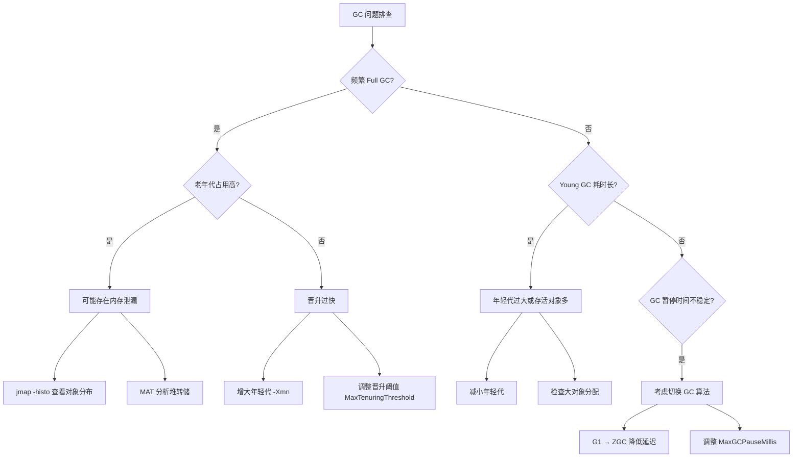

# Spring 监控与内存优化

---

## 概述

性能优化是 Spring 应用开发中的重要环节。本文从实战角度出发，深度解析 Spring 应用的性能优化策略和技巧。

```mermaid
graph TB
    A[Spring 性能优化] --> B[应用性能监控]
    A --> C[内存优化]
    A --> D[启动性能优化]
    A --> E[并发性能优化]
    A --> F[数据库性能优化]
    A --> G[缓存优化]
    A --> H[网络优化]
    
    B --> B1[Spring Boot Actuator]
    B --> B2[自定义指标]
    B --> B3[性能分析工具]
    B --> B4[APM 集成]
    
    C --> C1[内存泄漏排查]
    C --> C2[GC 调优]
    C --> C3[对象池优化]
    C --> C4[堆外内存管理]
    
    D --> D1[懒加载策略]
    D --> D2[组件扫描优化]
    D --> D3[类路径优化]
    D --> D4[AOT 编译]
    
    E --> E1[线程池配置]
    E --> E2[异步处理]
    E --> E3[响应式编程]
    E --> E4[虚拟线程]
    
    F --> F1[连接池优化]
    F --> F2[SQL 优化]
    F --> F3[事务优化]
    F --> F4[分库分表]
    
    G --> G1[缓存策略]
    G --> G2[缓存穿透/击穿/雪崩]
    G --> G3[多级缓存]
    G --> G4[缓存预热]
    
    H --> H1[连接池优化]
    H --> H2[HTTP 客户端优化]
    H --> H3[序列化优化]
    H --> H4[压缩优化]
```



## 应用性能监控

### 1. Spring Boot Actuator 深度使用

#### 完整监控配置
```yaml
# application.yml
management:
  endpoints:
    web:
      exposure:
        include: health,metrics,info,beans,env,configprops,conditions,httptrace,loggers,threaddump
      base-path: /actuator
      path-mapping:
        health: healthcheck
    jmx:
      exposure:
        include: "*"
  endpoint:
    health:
      show-details: always
      show-components: always
      enabled: true
      probes:
        enabled: true
    metrics:
      enabled: true
    prometheus:
      enabled: true
    loggers:
      enabled: true
    threaddump:
      enabled: true
  metrics:
    export:
      prometheus:
        enabled: true
        step: 1m
      influx:
        enabled: false
    tags:
      application: ${spring.application.name}
      environment: ${spring.profiles.active:default}
      instance: ${HOSTNAME:local}
    distribution:
      percentiles-histogram:
        http.server.requests: true
      sla:
        http.server.requests: 100ms,200ms,500ms,1s,2s
  info:
    env:
      enabled: true
    build:
      enabled: true
    git:
      enabled: true
      mode: full

# 安全配置（生产环境）
spring:
  security:
    user:
      name: actuator
      password: ${ACTUATOR_PASSWORD:changeme}
      roles: ACTUATOR
```

#### 自定义健康检查
```java
@Component
public class CustomHealthIndicator implements HealthIndicator {
    
    @Autowired
    private DataSource dataSource;
    
    @Autowired
    private RedisTemplate<String, Object> redisTemplate;
    
    @Autowired
    private ApplicationContext applicationContext;
    
    @Override
    public Health health() {
        Map<String, Object> details = new HashMap<>();
        
        // 数据库健康检查
        try (Connection connection = dataSource.getConnection()) {
            details.put("database", "UP");
            details.put("database.connection", connection.isValid(5));
        } catch (Exception e) {
            details.put("database", "DOWN");
            details.put("database.error", e.getMessage());
        }
        
        // Redis 健康检查
        try {
            redisTemplate.opsForValue().get("health-check");
            details.put("redis", "UP");
        } catch (Exception e) {
            details.put("redis", "DOWN");
            details.put("redis.error", e.getMessage());
        }
        
        // Bean 状态检查
        String[] beanNames = applicationContext.getBeanDefinitionNames();
        details.put("beans.total", beanNames.length);
        
        // 内存使用情况
        Runtime runtime = Runtime.getRuntime();
        details.put("memory.used", formatBytes(runtime.totalMemory() - runtime.freeMemory()));
        details.put("memory.free", formatBytes(runtime.freeMemory()));
        details.put("memory.total", formatBytes(runtime.totalMemory()));
        details.put("memory.max", formatBytes(runtime.maxMemory()));
        
        boolean isHealthy = details.get("database").equals("UP") && 
                           details.get("redis").equals("UP");
        
        return isHealthy ? Health.up().withDetails(details).build() 
                        : Health.down().withDetails(details).build();
    }
    
    private String formatBytes(long bytes) {
        if (bytes < 1024) return bytes + " B";
        int exp = (int) (Math.log(bytes) / Math.log(1024));
        String pre = "KMGTPE".charAt(exp-1) + "";
        return String.format("%.1f %sB", bytes / Math.pow(1024, exp), pre);
    }
}

// 就绪状态检查（Kubernetes）
@Component
public class ReadinessHealthIndicator implements HealthIndicator {
    
    private volatile boolean isReady = false;
    
    @EventListener
    public void onApplicationReady(ApplicationReadyEvent event) {
        // 应用完全启动后设置为就绪状态
        isReady = true;
    }
    
    @Override
    public Health health() {
        if (isReady) {
            return Health.up().withDetail("status", "Application is ready").build();
        } else {
            return Health.down().withDetail("status", "Application is starting").build();
        }
    }
}
```

#### 自定义性能指标
```java
@Component
public class PerformanceMetrics {
    
    private final MeterRegistry meterRegistry;
    
    // HTTP 请求指标
    private final Timer httpRequestTimer;
    private final Counter httpRequestCounter;
    private final DistributionSummary httpRequestSize;
    
    // 数据库指标
    private final Timer databaseQueryTimer;
    private final Counter databaseQueryCounter;
    
    // 缓存指标
    private final Timer cacheAccessTimer;
    private final Counter cacheHitCounter;
    private final Counter cacheMissCounter;
    
    // 业务指标
    private final Counter orderCreatedCounter;
    private final Counter paymentProcessedCounter;
    private final Timer orderProcessingTimer;
    
    public PerformanceMetrics(MeterRegistry meterRegistry) {
        this.meterRegistry = meterRegistry;
        
        // HTTP 指标
        this.httpRequestTimer = Timer.builder("http.requests")
            .description("HTTP request processing time")
            .publishPercentiles(0.5, 0.95, 0.99) // 50%, 95%, 99% 分位数
            .publishPercentileHistogram()
            .register(meterRegistry);
            
        this.httpRequestCounter = Counter.builder("http.requests.total")
            .description("Total HTTP requests")
            .register(meterRegistry);
            
        this.httpRequestSize = DistributionSummary.builder("http.request.size")
            .description("HTTP request size in bytes")
            .baseUnit("bytes")
            .register(meterRegistry);
        
        // 数据库指标
        this.databaseQueryTimer = Timer.builder("database.queries")
            .description("Database query execution time")
            .publishPercentiles(0.5, 0.95, 0.99)
            .register(meterRegistry);
            
        this.databaseQueryCounter = Counter.builder("database.queries.total")
            .description("Total database queries")
            .register(meterRegistry);
        
        // 缓存指标
        this.cacheAccessTimer = Timer.builder("cache.access")
            .description("Cache access time")
            .register(meterRegistry);
            
        this.cacheHitCounter = Counter.builder("cache.hits")
            .description("Cache hits")
            .register(meterRegistry);
            
        this.cacheMissCounter = Counter.builder("cache.misses")
            .description("Cache misses")
            .register(meterRegistry);
        
        // 业务指标
        this.orderCreatedCounter = Counter.builder("business.orders.created")
            .description("Number of orders created")
            .register(meterRegistry);
            
        this.paymentProcessedCounter = Counter.builder("business.payments.processed")
            .description("Number of payments processed")
            .register(meterRegistry);
            
        this.orderProcessingTimer = Timer.builder("business.orders.processing")
            .description("Order processing time")
            .publishPercentiles(0.5, 0.95, 0.99)
            .register(meterRegistry);
    }
    
    // HTTP 请求监控
    public Timer.Sample startHttpRequest() {
        httpRequestCounter.increment();
        return Timer.start(meterRegistry);
    }
    
    public void endHttpRequest(Timer.Sample sample, String method, String uri, int status) {
        sample.stop(httpRequestTimer);
        
        // 记录标签信息
        meterRegistry.counter("http.requests", 
            "method", method,
            "uri", uri,
            "status", String.valueOf(status)
        ).increment();
    }
    
    // 数据库查询监控
    public Timer.Sample startDatabaseQuery() {
        databaseQueryCounter.increment();
        return Timer.start(meterRegistry);
    }
    
    public void endDatabaseQuery(Timer.Sample sample, String queryType) {
        sample.stop(databaseQueryTimer);
        
        meterRegistry.counter("database.queries", "type", queryType).increment();
    }
    
    // 缓存访问监控
    public Timer.Sample startCacheAccess() {
        return Timer.start(meterRegistry);
    }
    
    public void endCacheAccess(Timer.Sample sample, boolean hit) {
        sample.stop(cacheAccessTimer);
        
        if (hit) {
            cacheHitCounter.increment();
        } else {
            cacheMissCounter.increment();
        }
    }
    
    // 业务指标记录
    public void recordOrderCreated() {
        orderCreatedCounter.increment();
    }
    
    public void recordPaymentProcessed() {
        paymentProcessedCounter.increment();
    }
    
    public Timer.Sample startOrderProcessing() {
        return Timer.start(meterRegistry);
    }
    
    public void endOrderProcessing(Timer.Sample sample) {
        sample.stop(orderProcessingTimer);
    }
}

// HTTP 拦截器记录指标
@Component
public class MetricsInterceptor implements HandlerInterceptor {
    
    @Autowired
    private PerformanceMetrics performanceMetrics;
    
    private ThreadLocal<Timer.Sample> requestTimer = new ThreadLocal<>();
    
    @Override
    public boolean preHandle(HttpServletRequest request, HttpServletResponse response, Object handler) throws Exception {
        requestTimer.set(performanceMetrics.startHttpRequest());
        return true;
    }
    
    @Override
    public void afterCompletion(HttpServletRequest request, HttpServletResponse response, Object handler, Exception ex) throws Exception {
        Timer.Sample sample = requestTimer.get();
        if (sample != null) {
            performanceMetrics.endHttpRequest(
                sample,
                request.getMethod(),
                request.getRequestURI(),
                response.getStatus()
            );
            requestTimer.remove();
        }
    }
}

// 配置拦截器
@Configuration
public class WebMvcConfig implements WebMvcConfigurer {
    
    @Autowired
    private MetricsInterceptor metricsInterceptor;
    
    @Override
    public void addInterceptors(InterceptorRegistry registry) {
        registry.addInterceptor(metricsInterceptor)
            .addPathPatterns("/api/**");
    }
}
```

### 2. APM 集成

APM（Application Performance Management）工具可以提供全链路追踪、性能分析和异常监控能力。

#### SkyWalking 集成
```java
// 1. 添加依赖
// pom.xml
// <dependency>
//     <groupId>org.apache.skywalking</groupId>
//     <artifactId>apm-toolkit-trace</artifactId>
//     <version>9.0.0</version>
// </dependency>

// 2. 自定义链路追踪
import org.apache.skywalking.apm.toolkit.trace.Trace;
import org.apache.skywalking.apm.toolkit.trace.Tag;
import org.apache.skywalking.apm.toolkit.trace.Tags;

@Service
public class TracedOrderService {
    
    @Trace // 标记为追踪方法
    @Tags({@Tag(key = "orderId", value = "arg[0]"),
           @Tag(key = "userId", value = "arg[1]")})
    public Order createOrder(String orderId, String userId) {
        // 业务逻辑
        return orderRepository.save(new Order(orderId, userId));
    }
    
    @Trace
    public void processPayment(String orderId, BigDecimal amount) {
        // 支付处理逻辑
        ActiveSpan.tag("payment.amount", amount.toString());
        ActiveSpan.info("开始处理支付");
        paymentGateway.charge(orderId, amount);
    }
}
```

#### Zipkin/Sleuth 集成
```yaml
# application.yml - Spring Cloud Sleuth + Zipkin 配置
spring:
  sleuth:
    sampler:
      probability: 1.0  # 采样率（生产环境建议 0.1）
    propagation:
      type: B3           # 传播格式
    async:
      enabled: true      # 异步追踪
  zipkin:
    base-url: http://zipkin-server:9411
    sender:
      type: kafka        # 使用 Kafka 异步发送（推荐生产环境）
    kafka:
      topic: zipkin

# Micrometer Tracing（Spring Boot 3.x 推荐）
management:
  tracing:
    sampling:
      probability: 1.0
  zipkin:
    tracing:
      endpoint: http://zipkin-server:9411/api/v2/spans
```

```java
// Spring Boot 3.x 使用 Micrometer Tracing
@Configuration
public class TracingConfig {
    
    @Bean
    public ObservationHandler<Observation.Context> observationTextPublisher() {
        return new ObservationTextPublisher();
    }
}

// 自定义 Observation（Spring Boot 3.x 新方式）
@Service
public class ObservedOrderService {
    
    private final ObservationRegistry observationRegistry;
    
    public ObservedOrderService(ObservationRegistry observationRegistry) {
        this.observationRegistry = observationRegistry;
    }
    
    public Order createOrder(OrderRequest request) {
        return Observation.createNotStarted("order.create", observationRegistry)
            .lowCardinalityKeyValue("order.type", request.getType())
            .highCardinalityKeyValue("order.id", request.getId())
            .observe(() -> {
                // 业务逻辑
                return doCreateOrder(request);
            });
    }
}
```

#### Prometheus + Grafana 监控面板
```java
// 自定义 Prometheus 指标导出
@Configuration
public class PrometheusConfig {
    
    @Bean
    public MeterRegistryCustomizer<PrometheusMeterRegistry> prometheusCustomizer() {
        return registry -> {
            registry.config()
                .commonTags("application", "my-app")
                .commonTags("region", "cn-east");
        };
    }
    
    // 自定义业务告警指标
    @Bean
    public Gauge activeOrdersGauge(MeterRegistry registry, OrderService orderService) {
        return Gauge.builder("business.orders.active", orderService, OrderService::getActiveOrderCount)
            .description("当前活跃订单数")
            .register(registry);
    }
}
```

## 内存优化

### 1. 内存泄漏排查与预防

#### 常见内存泄漏场景
```java
// 1. 静态集合导致的内存泄漏
@Component
public class StaticCollectionLeak {
    
    // 错误：静态集合持有对象引用，导致无法GC
    private static final List<Object> CACHE = new ArrayList<>();
    
    public void addToCache(Object obj) {
        CACHE.add(obj); // 对象永远不会被回收
    }
    
    // 正确：使用弱引用或定期清理
    private static final Map<Object, WeakReference<Object>> WEAK_CACHE = new WeakHashMap<>();
    
    public void addToWeakCache(Object key, Object value) {
        WEAK_CACHE.put(key, new WeakReference<>(value));
    }
}

// 2. ThreadLocal 内存泄漏
@Component
public class ThreadLocalLeak {
    
    // 错误：ThreadLocal 未清理
    private static final ThreadLocal<UserContext> USER_CONTEXT = new ThreadLocal<>();
    
    public void setUserContext(UserContext context) {
        USER_CONTEXT.set(context);
    }
    
    // 正确：使用后清理
    public void cleanup() {
        USER_CONTEXT.remove();
    }
    
    // 更好的方案：使用 InheritableThreadLocal 或自定义清理
    private static final ThreadLocal<UserContext> SAFE_USER_CONTEXT = 
        new ThreadLocal<>() {
            @Override
            protected UserContext initialValue() {
                return new UserContext();
            }
        };
}

// 3. 监听器注册未注销
@Component
public class ListenerLeak {
    
    private List<EventListener> listeners = new ArrayList<>();
    
    // 错误：监听器注册后未注销
    public void registerListener(EventListener listener) {
        listeners.add(listener);
        // 应该提供注销方法
    }
    
    // 正确：提供注销机制
    public void unregisterListener(EventListener listener) {
        listeners.remove(listener);
    }
    
    @PreDestroy
    public void cleanup() {
        listeners.clear();
    }
}
```

#### 内存分析工具使用
```java
// 内存分析服务
@Service
public class MemoryAnalysisService {
    
    private static final Logger logger = LoggerFactory.getLogger(MemoryAnalysisService.class);
    
    // 获取内存快照
    public void analyzeMemory() {
        Runtime runtime = Runtime.getRuntime();
        
        long usedMemory = runtime.totalMemory() - runtime.freeMemory();
        long maxMemory = runtime.maxMemory();
        double memoryUsage = (double) usedMemory / maxMemory * 100;
        
        logger.info("内存使用情况: {}/{} ({:.2f}%)", 
            formatBytes(usedMemory), formatBytes(maxMemory), memoryUsage);
        
        // 如果内存使用率过高，触发GC并重新分析
        if (memoryUsage > 80) {
            logger.warn("内存使用率过高，触发GC");
            System.gc();
            
            // 重新计算
            usedMemory = runtime.totalMemory() - runtime.freeMemory();
            memoryUsage = (double) usedMemory / maxMemory * 100;
            logger.info("GC后内存使用情况: {}/{} ({:.2f}%)", 
                formatBytes(usedMemory), formatBytes(maxMemory), memoryUsage);
        }
    }
    
    // 分析对象内存占用
    public void analyzeObjectMemory() {
        MemoryMXBean memoryMXBean = ManagementFactory.getMemoryMXBean();
        MemoryUsage heapUsage = memoryMXBean.getHeapMemoryUsage();
        MemoryUsage nonHeapUsage = memoryMXBean.getNonHeapMemoryUsage();
        
        logger.info("堆内存: {}/{}", 
            formatBytes(heapUsage.getUsed()), formatBytes(heapUsage.getMax()));
        logger.info("非堆内存: {}/{}", 
            formatBytes(nonHeapUsage.getUsed()), formatBytes(nonHeapUsage.getMax()));
        
        // 分析GC情况
        List<GarbageCollectorMXBean> gcBeans = ManagementFactory.getGarbageCollectorMXBeans();
        for (GarbageCollectorMXBean gcBean : gcBeans) {
            logger.info("GC {}: 次数={}, 耗时={}ms", 
                gcBean.getName(), gcBean.getCollectionCount(), gcBean.getCollectionTime());
        }
    }
    
    // 生成堆转储（需要JVM参数支持）
    public void generateHeapDump() {
        try {
            String fileName = "heapdump_" + System.currentTimeMillis() + ".hprof";
            HotSpotDiagnosticMXBean diagnosticMXBean = ManagementFactory
                .getPlatformMXBean(HotSpotDiagnosticMXBean.class);
            diagnosticMXBean.dumpHeap(fileName, true);
            logger.info("堆转储已生成: {}", fileName);
        } catch (IOException e) {
            logger.error("生成堆转储失败", e);
        }
    }
    
    private String formatBytes(long bytes) {
        if (bytes < 1024) return bytes + " B";
        int exp = (int) (Math.log(bytes) / Math.log(1024));
        String pre = "KMGTPE".charAt(exp-1) + "";
        return String.format("%.1f %sB", bytes / Math.pow(1024, exp), pre);
    }
}
```

### 2. GC 调优策略

#### GC 算法对比与选型

| 特性 | G1 GC | ZGC | Shenandoah |
|------|-------|-----|------------|
| **最低 JDK 版本** | JDK 9（默认） | JDK 15（生产就绪） | JDK 15（生产就绪） |
| **最大暂停时间** | 数十~数百毫秒 | < 1ms（亚毫秒级） | < 10ms |
| **堆大小适用范围** | 4GB ~ 64GB | 8MB ~ 16TB | 任意大小 |
| **吞吐量** | 高 | 中高 | 中高 |
| **内存开销** | 中（~10%） | 较高（~15%） | 较高（~15%） |
| **适用场景** | 通用场景 | 超低延迟、大堆 | 低延迟、中大堆 |

```bash
# G1 GC 配置（通用推荐，4GB~64GB 堆）
java -jar application.jar \
  -Xms2g -Xmx2g \
  -XX:+UseG1GC \
  -XX:MaxGCPauseMillis=200 \
  -XX:G1HeapRegionSize=16m \
  -XX:InitiatingHeapOccupancyPercent=45 \
  -XX:G1ReservePercent=15 \
  -XX:MaxMetaspaceSize=256m \
  -XX:MaxDirectMemorySize=512m \
  -XX:+HeapDumpOnOutOfMemoryError \
  -XX:HeapDumpPath=/tmp/heapdump.hprof \
  -Xlog:gc*:file=/tmp/gc.log:time,uptime,level,tags

# ZGC 配置（超低延迟场景，JDK 17+）
java -jar application.jar \
  -Xms4g -Xmx4g \
  -XX:+UseZGC \
  -XX:+ZGenerational \
  -XX:SoftMaxHeapSize=3g \
  -XX:MaxMetaspaceSize=256m \
  -XX:+HeapDumpOnOutOfMemoryError \
  -XX:HeapDumpPath=/tmp/heapdump.hprof \
  -Xlog:gc*:file=/tmp/gc.log:time,uptime,level,tags

# Shenandoah 配置（低延迟场景）
java -jar application.jar \
  -Xms4g -Xmx4g \
  -XX:+UseShenandoahGC \
  -XX:ShenandoahGCHeuristics=adaptive \
  -XX:MaxMetaspaceSize=256m \
  -XX:+HeapDumpOnOutOfMemoryError \
  -XX:HeapDumpPath=/tmp/heapdump.hprof \
  -Xlog:gc*:file=/tmp/gc.log:time,uptime,level,tags
```

#### GC 日志分析
```java
// GC 日志分析工具类
@Component
public class GCLogAnalyzer {
    
    private static final Logger logger = LoggerFactory.getLogger(GCLogAnalyzer.class);
    
    // 注册 GC 通知监听器
    @PostConstruct
    public void registerGCNotification() {
        List<GarbageCollectorMXBean> gcBeans = ManagementFactory.getGarbageCollectorMXBeans();
        
        for (GarbageCollectorMXBean gcBean : gcBeans) {
            if (gcBean instanceof NotificationEmitter) {
                NotificationEmitter emitter = (NotificationEmitter) gcBean;
                emitter.addNotificationListener((notification, handback) -> {
                    if (notification.getType().equals(GarbageCollectionNotificationInfo.GARBAGE_COLLECTION_NOTIFICATION)) {
                        GarbageCollectionNotificationInfo info = GarbageCollectionNotificationInfo
                            .from((CompositeData) notification.getUserData());
                        
                        GcInfo gcInfo = info.getGcInfo();
                        long duration = gcInfo.getDuration();
                        String gcAction = info.getGcAction();
                        String gcCause = info.getGcCause();
                        
                        // 记录 GC 事件
                        if (duration > 200) {
                            logger.warn("[GC 告警] 类型={}, 原因={}, 耗时={}ms, 动作={}",
                                info.getGcName(), gcCause, duration, gcAction);
                        } else {
                            logger.debug("[GC 事件] 类型={}, 原因={}, 耗时={}ms",
                                info.getGcName(), gcCause, duration);
                        }
                        
                        // 分析内存变化
                        Map<String, MemoryUsage> beforeGc = gcInfo.getMemoryUsageBeforeGc();
                        Map<String, MemoryUsage> afterGc = gcInfo.getMemoryUsageAfterGc();
                        
                        for (Map.Entry<String, MemoryUsage> entry : afterGc.entrySet()) {
                            MemoryUsage before = beforeGc.get(entry.getKey());
                            MemoryUsage after = entry.getValue();
                            if (before != null) {
                                long freed = before.getUsed() - after.getUsed();
                                if (freed > 0) {
                                    logger.debug("  {} 释放: {}", entry.getKey(), formatBytes(freed));
                                }
                            }
                        }
                    }
                }, null, null);
            }
        }
    }
    
    private String formatBytes(long bytes) {
        if (bytes < 1024) return bytes + " B";
        int exp = (int) (Math.log(bytes) / Math.log(1024));
        String pre = "KMGTPE".charAt(exp - 1) + "";
        return String.format("%.1f %sB", bytes / Math.pow(1024, exp), pre);
    }
}
```

#### 常见 GC 问题排查思路



> **排查工具推荐**：
> - `jstat -gcutil <pid> 1000`：实时查看 GC 统计
> - `jmap -heap <pid>`：查看堆内存分布
> - `jmap -histo:live <pid>`：查看存活对象统计
> - **GCViewer / GCEasy**：可视化分析 GC 日志
> - **Eclipse MAT**：分析堆转储文件

#### GC 监控和调优
```java
@Component
public class GCMonitor {
    
    private static final Logger logger = LoggerFactory.getLogger(GCMonitor.class);
    
    @EventListener
    public void onApplicationReady(ApplicationReadyEvent event) {
        startGCMonitoring();
    }
    
    private void startGCMonitoring() {
        ScheduledExecutorService scheduler = Executors.newScheduledThreadPool(1);
        
        scheduler.scheduleAtFixedRate(() -> {
            try {
                monitorGC();
            } catch (Exception e) {
                logger.error("GC监控异常", e);
            }
        }, 0, 60, TimeUnit.SECONDS); // 每分钟监控一次
    }
    
    private void monitorGC() {
        List<GarbageCollectorMXBean> gcBeans = ManagementFactory.getGarbageCollectorMXBeans();
        
        for (GarbageCollectorMXBean gcBean : gcBeans) {
            long count = gcBean.getCollectionCount();
            long time = gcBean.getCollectionTime();
            
            // 记录GC指标
            logger.debug("GC {}: count={}, time={}ms", gcBean.getName(), count, time);
            
            // 如果GC过于频繁或耗时过长，发出警告
            if (count > 1000 || time > 5000) {
                logger.warn("GC异常: {} 过于频繁或耗时过长", gcBean.getName());
            }
        }
    }
}
```

### 3. 对象池优化

频繁创建和销毁重量级对象会增加 GC 压力，使用对象池可以有效复用对象。

#### Apache Commons Pool 对象池
```java
// 1. 定义池化对象工厂
public class HeavyObjectFactory extends BasePooledObjectFactory<HeavyObject> {
    
    @Override
    public HeavyObject create() throws Exception {
        // 创建重量级对象（如数据库连接、加密引擎等）
        return new HeavyObject();
    }
    
    @Override
    public PooledObject<HeavyObject> wrap(HeavyObject obj) {
        return new DefaultPooledObject<>(obj);
    }
    
    @Override
    public void destroyObject(PooledObject<HeavyObject> p) throws Exception {
        p.getObject().close();
    }
    
    @Override
    public boolean validateObject(PooledObject<HeavyObject> p) {
        return p.getObject().isValid();
    }
    
    @Override
    public void passivateObject(PooledObject<HeavyObject> p) throws Exception {
        p.getObject().reset(); // 归还前重置状态
    }
}

// 2. 配置对象池
@Configuration
public class ObjectPoolConfig {
    
    @Bean
    public GenericObjectPool<HeavyObject> heavyObjectPool() {
        GenericObjectPoolConfig<HeavyObject> config = new GenericObjectPoolConfig<>();
        config.setMaxTotal(50);           // 最大对象数
        config.setMaxIdle(20);            // 最大空闲对象数
        config.setMinIdle(5);             // 最小空闲对象数
        config.setMaxWaitMillis(5000);    // 最大等待时间
        config.setTestOnBorrow(true);     // 借出时验证
        config.setTestOnReturn(false);    // 归还时不验证
        config.setTestWhileIdle(true);    // 空闲时验证
        config.setTimeBetweenEvictionRunsMillis(30000); // 驱逐检查间隔
        
        return new GenericObjectPool<>(new HeavyObjectFactory(), config);
    }
}

// 3. 使用对象池
@Service
public class PooledService {
    
    @Autowired
    private GenericObjectPool<HeavyObject> objectPool;
    
    public String process(String data) {
        HeavyObject obj = null;
        try {
            obj = objectPool.borrowObject(); // 从池中借出
            return obj.process(data);
        } catch (Exception e) {
            throw new RuntimeException("对象池操作失败", e);
        } finally {
            if (obj != null) {
                objectPool.returnObject(obj); // 归还到池中
            }
        }
    }
}
```

#### 轻量级自定义对象池
```java
// 基于 ConcurrentLinkedQueue 的简单对象池
public class SimpleObjectPool<T> {
    
    private final ConcurrentLinkedQueue<T> pool;
    private final Supplier<T> factory;
    private final Consumer<T> resetter;
    private final int maxSize;
    private final AtomicInteger currentSize = new AtomicInteger(0);
    
    public SimpleObjectPool(Supplier<T> factory, Consumer<T> resetter, int maxSize) {
        this.pool = new ConcurrentLinkedQueue<>();
        this.factory = factory;
        this.resetter = resetter;
        this.maxSize = maxSize;
    }
    
    public T borrow() {
        T obj = pool.poll();
        if (obj == null) {
            obj = factory.get();
            currentSize.incrementAndGet();
        }
        return obj;
    }
    
    public void returnObject(T obj) {
        if (currentSize.get() <= maxSize) {
            resetter.accept(obj); // 重置对象状态
            pool.offer(obj);
        } else {
            currentSize.decrementAndGet();
        }
    }
    
    public int getPoolSize() {
        return pool.size();
    }
}

// 使用示例：StringBuilder 对象池
@Component
public class StringBuilderPool {
    
    private final SimpleObjectPool<StringBuilder> pool = new SimpleObjectPool<>(
        () -> new StringBuilder(256),
        sb -> sb.setLength(0),  // 重置
        100
    );
    
    public String buildString(List<String> parts) {
        StringBuilder sb = pool.borrow();
        try {
            for (String part : parts) {
                sb.append(part);
            }
            return sb.toString();
        } finally {
            pool.returnObject(sb);
        }
    }
}
```

### 4. 堆外内存管理

堆外内存（Off-Heap Memory）不受 GC 管理，适合大数据量缓存和 I/O 密集场景。

```java
// DirectByteBuffer 堆外内存使用
@Component
public class OffHeapCacheManager {
    
    private static final Logger logger = LoggerFactory.getLogger(OffHeapCacheManager.class);
    
    private final ConcurrentHashMap<String, ByteBuffer> offHeapCache = new ConcurrentHashMap<>();
    private final AtomicLong totalAllocated = new AtomicLong(0);
    private final long maxOffHeapSize; // 最大堆外内存
    
    public OffHeapCacheManager(@Value("${cache.offheap.max-size:536870912}") long maxOffHeapSize) {
        this.maxOffHeapSize = maxOffHeapSize; // 默认 512MB
    }
    
    public void put(String key, byte[] data) {
        if (totalAllocated.get() + data.length > maxOffHeapSize) {
            logger.warn("堆外内存不足，执行清理");
            evictOldest();
        }
        
        ByteBuffer buffer = ByteBuffer.allocateDirect(data.length);
        buffer.put(data);
        buffer.flip();
        
        ByteBuffer old = offHeapCache.put(key, buffer);
        if (old != null) {
            totalAllocated.addAndGet(-old.capacity());
            cleanDirectBuffer(old);
        }
        totalAllocated.addAndGet(data.length);
    }
    
    public byte[] get(String key) {
        ByteBuffer buffer = offHeapCache.get(key);
        if (buffer == null) return null;
        
        byte[] data = new byte[buffer.remaining()];
        buffer.duplicate().get(data);
        return data;
    }
    
    public void remove(String key) {
        ByteBuffer buffer = offHeapCache.remove(key);
        if (buffer != null) {
            totalAllocated.addAndGet(-buffer.capacity());
            cleanDirectBuffer(buffer);
        }
    }
    
    // 主动释放 DirectByteBuffer
    private void cleanDirectBuffer(ByteBuffer buffer) {
        if (buffer.isDirect()) {
            try {
                // 使用 Unsafe 或 Cleaner 主动释放
                sun.misc.Cleaner cleaner = ((sun.nio.ch.DirectBuffer) buffer).cleaner();
                if (cleaner != null) {
                    cleaner.clean();
                }
            } catch (Exception e) {
                logger.warn("释放堆外内存失败", e);
            }
        }
    }
    
    private void evictOldest() {
        // 简单的 LRU 驱逐策略
        Iterator<Map.Entry<String, ByteBuffer>> it = offHeapCache.entrySet().iterator();
        while (it.hasNext() && totalAllocated.get() > maxOffHeapSize * 0.8) {
            Map.Entry<String, ByteBuffer> entry = it.next();
            totalAllocated.addAndGet(-entry.getValue().capacity());
            cleanDirectBuffer(entry.getValue());
            it.remove();
        }
    }
    
    @PreDestroy
    public void cleanup() {
        offHeapCache.forEach((key, buffer) -> cleanDirectBuffer(buffer));
        offHeapCache.clear();
        logger.info("堆外内存已全部释放");
    }
}
```

> **堆外内存使用注意事项**：
> - 通过 `-XX:MaxDirectMemorySize` 限制堆外内存上限
> - 必须手动管理生命周期，避免内存泄漏
> - 适合大块数据缓存（如图片、文件缓冲）
> - 生产环境推荐使用成熟框架（如 Netty 的 PooledByteBufAllocator）

