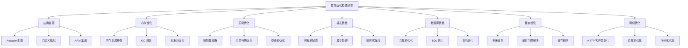

# Spring 网络优化与最佳实践

---

## 网络优化

### 1. HTTP 客户端优化

#### WebClient 配置优化
```java
@Configuration
public class WebClientConfig {
    
    @Bean
    public WebClient webClient() {
        HttpClient httpClient = HttpClient.create()
            .option(ChannelOption.CONNECT_TIMEOUT_MILLIS, 5000)
            .responseTimeout(Duration.ofSeconds(10))
            .doOnConnected(conn -> 
                conn.addHandlerLast(new ReadTimeoutHandler(10, TimeUnit.SECONDS))
                    .addHandlerLast(new WriteTimeoutHandler(10, TimeUnit.SECONDS)));
        
        return WebClient.builder()
            .clientConnector(new ReactorClientHttpConnector(httpClient))
            .codecs(configurer -> configurer.defaultCodecs().maxInMemorySize(10 * 1024 * 1024))
            .build();
    }
    
    // 连接池配置
    @Bean
    public ConnectionProvider connectionProvider() {
        return ConnectionProvider.builder("custom")
            .maxConnections(100)
            .pendingAcquireTimeout(Duration.ofSeconds(5))
            .maxIdleTime(Duration.ofSeconds(30))
            .maxLifeTime(Duration.ofMinutes(5))
            .build();
    }
}

// 优化的HTTP服务
@Service
public class OptimizedHttpService {
    
    @Autowired
    private WebClient webClient;
    
    // 异步HTTP调用
    public Mono<String> fetchDataAsync(String url) {
        return webClient.get()
            .uri(url)
            .retrieve()
            .bodyToMono(String.class)
            .timeout(Duration.ofSeconds(5))
            .onErrorResume(throwable -> {
                // 错误处理
                logger.error("HTTP请求失败: {}", url, throwable);
                return Mono.just("fallback");
            });
    }
    
    // 批量请求
    public Flux<String> fetchMultipleData(List<String> urls) {
        return Flux.fromIterable(urls)
            .flatMap(this::fetchDataAsync, 10); // 并发度控制
    }
}
```

### 2. 序列化优化

序列化性能直接影响网络传输效率和缓存存储效率。

#### 序列化框架对比

| 框架 | 序列化速度 | 体积 | 可读性 | 跨语言 | 适用场景 |
|------|-----------|------|--------|--------|----------|
| **JSON (Jackson)** | 中 | 大 | 高 | 是 | REST API、配置文件 |
| **Protobuf** | 快 | 小 | 低 | 是 | gRPC、高性能通信 |
| **Kryo** | 最快 | 最小 | 低 | 否 | Java 内部通信、缓存 |
| **MessagePack** | 快 | 较小 | 低 | 是 | 跨语言高性能场景 |
| **Hessian** | 中 | 中 | 低 | 是 | Dubbo 默认序列化 |

```java
// Jackson 性能优化配置
@Configuration
public class JacksonOptimizationConfig {
    
    @Bean
    public ObjectMapper optimizedObjectMapper() {
        ObjectMapper mapper = new ObjectMapper();
        
        // 性能优化配置
        mapper.configure(DeserializationFeature.FAIL_ON_UNKNOWN_PROPERTIES, false);
        mapper.configure(SerializationFeature.WRITE_DATES_AS_TIMESTAMPS, false);
        mapper.setSerializationInclusion(JsonInclude.Include.NON_NULL); // 不序列化 null
        
        // 使用 AfterBurner 模块加速（基于字节码生成）
        mapper.registerModule(new AfterburnerModule());
        
        // 日期格式
        mapper.registerModule(new JavaTimeModule());
        
        return mapper;
    }
}

// Protobuf 序列化配置（Spring MVC）
@Configuration
public class ProtobufConfig {
    
    @Bean
    public ProtobufHttpMessageConverter protobufHttpMessageConverter() {
        return new ProtobufHttpMessageConverter();
    }
    
    // 支持 Protobuf 和 JSON 双格式
    @Override
    public void configureMessageConverters(List<HttpMessageConverter<?>> converters) {
        converters.add(protobufHttpMessageConverter());
        converters.add(new MappingJackson2HttpMessageConverter(optimizedObjectMapper()));
    }
}

// Kryo 序列化工具（用于缓存存储）
public class KryoSerializer {
    
    // 使用 ThreadLocal 保证线程安全
    private static final ThreadLocal<Kryo> kryoThreadLocal = ThreadLocal.withInitial(() -> {
        Kryo kryo = new Kryo();
        kryo.setRegistrationRequired(false);
        kryo.setReferences(true);
        // 注册常用类以提升性能
        kryo.register(User.class);
        kryo.register(Order.class);
        kryo.register(ArrayList.class);
        kryo.register(HashMap.class);
        return kryo;
    });
    
    public static byte[] serialize(Object obj) {
        ByteArrayOutputStream baos = new ByteArrayOutputStream(256);
        Output output = new Output(baos);
        kryoThreadLocal.get().writeClassAndObject(output, obj);
        output.flush();
        return baos.toByteArray();
    }
    
    @SuppressWarnings("unchecked")
    public static <T> T deserialize(byte[] data) {
        Input input = new Input(new ByteArrayInputStream(data));
        return (T) kryoThreadLocal.get().readClassAndObject(input);
    }
}

// Redis 使用 Kryo 序列化（替代 JDK 序列化，体积减少 50%+）
@Configuration
public class RedisKryoConfig {
    
    @Bean
    public RedisTemplate<String, Object> redisTemplate(RedisConnectionFactory factory) {
        RedisTemplate<String, Object> template = new RedisTemplate<>();
        template.setConnectionFactory(factory);
        template.setKeySerializer(new StringRedisSerializer());
        template.setValueSerializer(new RedisSerializer<Object>() {
            @Override
            public byte[] serialize(Object obj) {
                if (obj == null) return new byte[0];
                return KryoSerializer.serialize(obj);
            }
            
            @Override
            public Object deserialize(byte[] bytes) {
                if (bytes == null || bytes.length == 0) return null;
                return KryoSerializer.deserialize(bytes);
            }
        });
        return template;
    }
}
```

### 3. 压缩优化

```java
// HTTP 响应压缩配置
// application.yml
// server:
//   compression:
//     enabled: true
//     mime-types: application/json,application/xml,text/html,text/plain,text/css,application/javascript
//     min-response-size: 1024  # 超过 1KB 才压缩

// 自定义 GZIP 压缩过滤器（更精细的控制）
@Component
@Order(Ordered.HIGHEST_PRECEDENCE)
public class GzipCompressionFilter extends OncePerRequestFilter {
    
    @Override
    protected void doFilterInternal(HttpServletRequest request, 
                                     HttpServletResponse response, 
                                     FilterChain filterChain) throws ServletException, IOException {
        String acceptEncoding = request.getHeader("Accept-Encoding");
        
        if (acceptEncoding != null && acceptEncoding.contains("gzip")) {
            GzipResponseWrapper gzipResponse = new GzipResponseWrapper(response);
            filterChain.doFilter(request, gzipResponse);
            gzipResponse.finish();
        } else {
            filterChain.doFilter(request, response);
        }
    }
    
    @Override
    protected boolean shouldNotFilter(HttpServletRequest request) {
        String uri = request.getRequestURI();
        // 静态资源和小响应不压缩
        return uri.endsWith(".png") || uri.endsWith(".jpg") || uri.endsWith(".gif");
    }
}

// 数据传输压缩工具
@Component
public class DataCompressor {
    
    // GZIP 压缩
    public byte[] gzipCompress(byte[] data) throws IOException {
        ByteArrayOutputStream baos = new ByteArrayOutputStream();
        try (GZIPOutputStream gzipOut = new GZIPOutputStream(baos)) {
            gzipOut.write(data);
        }
        return baos.toByteArray();
    }
    
    // GZIP 解压
    public byte[] gzipDecompress(byte[] compressed) throws IOException {
        ByteArrayInputStream bais = new ByteArrayInputStream(compressed);
        ByteArrayOutputStream baos = new ByteArrayOutputStream();
        try (GZIPInputStream gzipIn = new GZIPInputStream(bais)) {
            byte[] buffer = new byte[4096];
            int len;
            while ((len = gzipIn.read(buffer)) != -1) {
                baos.write(buffer, 0, len);
            }
        }
        return baos.toByteArray();
    }
    
    // 缓存数据压缩存储（节省 Redis 内存）
    public void cacheWithCompression(RedisTemplate<String, byte[]> redisTemplate,
                                      String key, Object value, long expireSeconds) throws IOException {
        byte[] serialized = KryoSerializer.serialize(value);
        
        // 超过 1KB 才压缩
        if (serialized.length > 1024) {
            byte[] compressed = gzipCompress(serialized);
            redisTemplate.opsForValue().set("gz:" + key, compressed, expireSeconds, TimeUnit.SECONDS);
        } else {
            redisTemplate.opsForValue().set(key, serialized, expireSeconds, TimeUnit.SECONDS);
        }
    }
}
```

## 最佳实践总结

### 性能优化检查清单



### 性能优化优先级

| 优先级 | 优化领域 | 预期收益 | 实施难度 |
|--------|----------|----------|----------|
| ⭐⭐⭐ | 数据库优化 | 高 | 中 |
| ⭐⭐⭐ | 缓存优化 | 高 | 低 |
| ⭐⭐ | 并发优化 | 中 | 中 |
| ⭐⭐ | 内存优化 | 中 | 高 |
| ⭐ | 启动优化 | 低 | 低 |
| ⭐ | 网络优化 | 低 | 低 |

### 性能测试和监控

#### JMH 基准测试

JMH（Java Microbenchmark Harness）是 OpenJDK 官方的微基准测试框架，用于精确测量代码性能。

```java
// 1. 添加依赖
// <dependency>
//     <groupId>org.openjdk.jmh</groupId>
//     <artifactId>jmh-core</artifactId>
//     <version>1.37</version>
//     <scope>test</scope>
// </dependency>
// <dependency>
//     <groupId>org.openjdk.jmh</groupId>
//     <artifactId>jmh-generator-annprocess</artifactId>
//     <version>1.37</version>
//     <scope>test</scope>
// </dependency>

// 2. 序列化性能基准测试
@BenchmarkMode(Mode.Throughput)           // 测量吞吐量
@OutputTimeUnit(TimeUnit.SECONDS)         // 输出单位
@State(Scope.Benchmark)                   // 状态作用域
@Warmup(iterations = 3, time = 1)         // 预热 3 轮
@Measurement(iterations = 5, time = 1)    // 测量 5 轮
@Fork(1)                                  // 1 个 JVM 进程
public class SerializationBenchmark {
    
    private User testUser;
    private ObjectMapper jackson;
    private Kryo kryo;
    
    @Setup
    public void setup() {
        testUser = new User(1L, "张三", "zhangsan@example.com", 28);
        jackson = new ObjectMapper();
        kryo = new Kryo();
        kryo.register(User.class);
    }
    
    @Benchmark
    public byte[] jacksonSerialize() throws Exception {
        return jackson.writeValueAsBytes(testUser);
    }
    
    @Benchmark
    public byte[] kryoSerialize() {
        ByteArrayOutputStream baos = new ByteArrayOutputStream();
        Output output = new Output(baos);
        kryo.writeObject(output, testUser);
        output.flush();
        return baos.toByteArray();
    }
    
    // 运行基准测试
    public static void main(String[] args) throws Exception {
        Options opt = new OptionsBuilder()
            .include(SerializationBenchmark.class.getSimpleName())
            .resultFormat(ResultFormatType.JSON)
            .result("benchmark-result.json")
            .build();
        new Runner(opt).run();
    }
}

// 3. Spring Bean 性能基准测试
@BenchmarkMode({Mode.Throughput, Mode.AverageTime})
@OutputTimeUnit(TimeUnit.MILLISECONDS)
@State(Scope.Benchmark)
@Warmup(iterations = 3, time = 2)
@Measurement(iterations = 5, time = 2)
@Fork(1)
public class ServiceBenchmark {
    
    private ConfigurableApplicationContext context;
    private UserService userService;
    
    @Setup
    public void setup() {
        // 启动 Spring 上下文
        context = SpringApplication.run(BenchmarkApplication.class);
        userService = context.getBean(UserService.class);
    }
    
    @TearDown
    public void tearDown() {
        context.close();
    }
    
    @Benchmark
    public User testGetUserById() {
        return userService.getUserById(1L);
    }
    
    @Benchmark
    public List<User> testGetAllUsers() {
        return userService.getAllUsers();
    }
}
```

#### 性能测试配置
```java
@SpringBootTest
@TestPropertySource(properties = {
    "spring.jpa.show-sql=false",
    "spring.jpa.properties.hibernate.generate_statistics=true",
    "logging.level.org.hibernate.stat=DEBUG"
})
@ActiveProfiles("test")
public class PerformanceTest {
    
    @Autowired
    private TestRestTemplate restTemplate;
    
    @Test
    public void testApiPerformance() {
        // 压力测试
        IntStream.range(0, 1000).parallel().forEach(i -> {
            ResponseEntity<String> response = restTemplate.getForEntity("/api/users", String.class);
            assertThat(response.getStatusCode()).isEqualTo(HttpStatus.OK);
        });
    }
    
    @Test
    public void testDatabasePerformance() {
        // 数据库性能测试
        StopWatch stopWatch = new StopWatch();
        stopWatch.start("query-test");
        
        List<User> users = userRepository.findAll();
        
        stopWatch.stop();
        assertThat(stopWatch.getTotalTimeSeconds()).isLessThan(1.0);
    }
}
```

### 总结

Spring 性能优化是一个系统工程，需要从多个维度进行综合考虑：

1. **监控先行**：建立完善的监控体系，及时发现性能瓶颈
2. **数据驱动**：基于监控数据进行有针对性的优化
3. **渐进优化**：从高收益、低难度的优化点开始
4. **持续改进**：性能优化是一个持续的过程，需要定期评估和调整
5. **平衡考虑**：在性能、可维护性、开发效率之间找到平衡点

通过本文介绍的优化策略和实践，可以显著提升 Spring 应用的性能表现，为高并发、高可用的系统提供坚实的技术支撑。