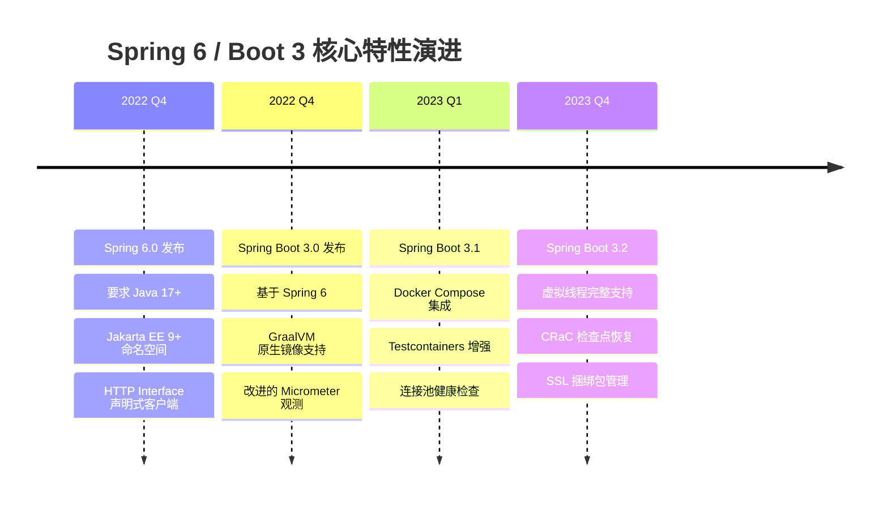
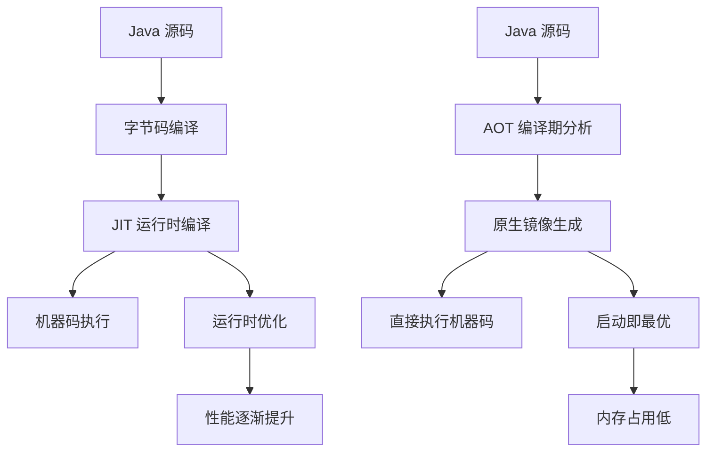

# Spring 6 / Spring Boot 3 新特性深度解析

---

## 概述

Spring 6 和 Spring Boot 3 是 Spring 生态的重要里程碑，带来了 Java 17+ 要求、虚拟线程、AOT 编译等革命性特性。本文深度解析这些新特性的原理和使用方法。



## Java 17+ 要求与迁移指南

### 迁移必要性

**为什么必须升级到 Java 17+？**
- Spring 6 基于 Java 17 构建，使用了许多新特性
- Java 17 是 LTS（长期支持）版本
- 性能提升显著（ZGC、Shenandoah GC）
- 语言特性增强（Record、Sealed Class）

### 迁移步骤

#### 1. 检查当前依赖兼容性
```xml
<!-- 升级前检查不兼容的依赖 -->
<dependency>
    <groupId>javax.servlet</groupId>
    <artifactId>javax.servlet-api</artifactId>
    <version>3.1.0</version> <!-- 需要升级到 Jakarta -->
</dependency>

<!-- 升级后 -->
<dependency>
    <groupId>jakarta.servlet</groupId>
    <artifactId>jakarta.servlet-api</artifactId>
    <version>5.0.0</version>
</dependency>
```

#### 2. 包名迁移脚本
```bash
#!/bin/bash
# 批量替换 javax.* 为 jakarta.*
find . -name "*.java" -exec sed -i 's/javax.servlet/jakarta.servlet/g' {} \;
find . -name "*.java" -exec sed -i 's/javax.persistence/jakarta.persistence/g' {} \;
find . -name "*.java" -exec sed -i 's/javax.validation/jakarta.validation/g' {} \;
```

#### 3. Maven 配置升级
```xml
<properties>
    <maven.compiler.source>17</maven.compiler.source>
    <maven.compiler.target>17</maven.compiler.target>
    <spring-boot.version>3.2.0</spring-boot.version>
</properties>

<dependencies>
    <dependency>
        <groupId>org.springframework.boot</groupId>
        <artifactId>spring-boot-starter-web</artifactId>
    </dependency>
    
    <!-- Jakarta EE 9+ 依赖 -->
    <dependency>
        <groupId>jakarta.persistence</groupId>
        <artifactId>jakarta.persistence-api</artifactId>
    </dependency>
</dependencies>
```

### 新语言特性应用

#### Record 类简化 DTO
```java
// 传统方式
public class UserDto {
    private final Long id;
    private final String name;
    private final String email;
    
    // 构造器、getter、equals、hashCode、toString...
}

// Java 14+ Record 方式
public record UserDto(Long id, String name, String email) {
    // 自动生成构造器、getter、equals、hashCode、toString
}

// Spring MVC 中使用
@RestController
public class UserController {
    
    @GetMapping("/users/{id}")
    public UserDto getUser(@PathVariable Long id) {
        User user = userService.findById(id);
        return new UserDto(user.getId(), user.getName(), user.getEmail());
    }
    
    @PostMapping("/users")
    public UserDto createUser(@RequestBody UserDto userDto) {
        User user = userService.create(userDto.name(), userDto.email());
        return new UserDto(user.getId(), user.getName(), user.getEmail());
    }
}
```

#### Sealed Class 限制继承
```java
// 定义密封接口
public sealed interface Notification 
    permits EmailNotification, SmsNotification, PushNotification {
    
    void send(String message);
}

// 允许的实现类
public final class EmailNotification implements Notification {
    @Override
    public void send(String message) {
        // 发送邮件逻辑
    }
}

public final class SmsNotification implements Notification {
    @Override
    public void send(String message) {
        // 发送短信逻辑
    }
}

// 在 Spring 中使用
@Service
public class NotificationService {
    
    private final Map<Class<? extends Notification>, Notification> notifiers;
    
    public NotificationService(List<Notification> notificationList) {
        this.notifiers = notificationList.stream()
            .collect(Collectors.toMap(Notification::getClass, Function.identity()));
    }
    
    public void sendNotification(Class<? extends Notification> type, String message) {
        Notification notifier = notifiers.get(type);
        if (notifier != null) {
            notifier.send(message);
        }
    }
}
```

## 虚拟线程（Virtual Threads）深度解析

### 虚拟线程原理

#### 与传统线程对比
```java
// 平台线程（传统线程）
Thread platformThread = new Thread(() -> {
    // 阻塞操作会占用系统线程
    try {
        Thread.sleep(1000);
    } catch (InterruptedException e) {
        Thread.currentThread().interrupt();
    }
});

// 虚拟线程
Thread virtualThread = Thread.ofVirtual().name("virtual-thread-1").start(() -> {
    // 阻塞时自动挂起，不占用系统线程
    try {
        Thread.sleep(1000);
    } catch (InterruptedException e) {
        Thread.currentThread().interrupt();
    }
});
```

#### 性能优势
| 场景 | 平台线程 | 虚拟线程 | 优势 |
|------|---------|---------|------|
| 10,000 并发连接 | 需要 10,000 个系统线程 | 只需要几十个载体线程 | 内存节省 90%+ |
| I/O 密集型任务 | 线程阻塞，CPU 闲置 | 线程挂起，CPU 利用率高 | 吞吐量提升 5-10 倍 |
| 上下文切换 | 重量级，需要内核参与 | 轻量级，在用户空间完成 | 切换开销降低 100 倍 |

### Spring Boot 3.2+ 虚拟线程集成

#### 配置虚拟线程
```yaml
# application.yml
spring:
  threads:
    virtual:
      enabled: true
```

#### 自定义虚拟线程执行器
```java
@Configuration
public class VirtualThreadConfig {
    
    @Bean
    public TaskExecutor virtualThreadExecutor() {
        return new TaskExecutor() {
            private final Executor virtualExecutor = Executors.newVirtualThreadPerTaskExecutor();
            
            @Override
            public void execute(Runnable task) {
                virtualExecutor.execute(task);
            }
        };
    }
    
    @Bean
    @Async("virtualThreadExecutor")
    public AsyncTaskExecutor asyncVirtualThreadExecutor() {
        return new TaskExecutorAdapter(Executors.newVirtualThreadPerTaskExecutor());
    }
}

// 使用虚拟线程执行异步任务
@Service
public class AsyncService {
    
    @Async("virtualThreadExecutor")
    public CompletableFuture<String> processDataAsync(String data) {
        // 虚拟线程中执行，可以大量并发
        String result = heavyProcessing(data);
        return CompletableFuture.completedFuture(result);
    }
    
    public void batchProcess(List<String> dataList) {
        List<CompletableFuture<String>> futures = dataList.stream()
            .map(this::processDataAsync)
            .collect(Collectors.toList());
        
        // 等待所有任务完成
        CompletableFuture.allOf(futures.toArray(new CompletableFuture[0])).join();
    }
}
```

#### Tomcat 虚拟线程配置
```java
@Configuration
public class TomcatVirtualThreadConfig {
    
    @Bean
    public TomcatProtocolHandlerCustomizer<?> protocolHandlerVirtualThreadExecutorCustomizer() {
        return protocolHandler -> {
            protocolHandler.setExecutor(Executors.newVirtualThreadPerTaskExecutor());
        };
    }
}
```

### 虚拟线程最佳实践

#### 1. 避免线程局部变量滥用
```java
// 不推荐：大量使用 ThreadLocal
public class UserContext {
    private static final ThreadLocal<User> currentUser = new ThreadLocal<>();
    
    public static void setCurrentUser(User user) {
        currentUser.set(user);
    }
    
    public static User getCurrentUser() {
        return currentUser.get();
    }
}

// 推荐：使用参数传递或上下文对象
@Service
public class OrderService {
    
    public void createOrder(CreateOrderRequest request, UserContext userContext) {
        User currentUser = userContext.getCurrentUser();
        // 业务逻辑
    }
}
```

#### 2. 同步代码块优化
```java
// 虚拟线程中的同步操作要谨慎
@Service
public class InventoryService {
    private final Map<String, Integer> inventory = new ConcurrentHashMap<>();
    
    // 使用 ReentrantLock 替代 synchronized
    private final Lock lock = new ReentrantLock();
    
    public void updateInventory(String productId, int quantity) {
        // 虚拟线程中避免使用 synchronized
        lock.lock();
        try {
            inventory.merge(productId, quantity, Integer::sum);
        } finally {
            lock.unlock();
        }
    }
    
    // 或者使用 ConcurrentHashMap 原子操作
    public void safeUpdateInventory(String productId, int quantity) {
        inventory.merge(productId, quantity, Integer::sum);
    }
}
```

## AOT（Ahead-of-Time）编译与 GraalVM 原生镜像

### AOT 编译原理

#### 与传统 JIT 对比


#### AOT 优势与限制

**优势：**
- 启动时间从秒级降到毫秒级
- 内存占用减少 50-80%
- 无需 JVM 预热

**限制：**
- 反射、动态代理需要配置
- 某些动态特性受限
- 构建时间较长

### Spring Boot 3 AOT 支持

#### 原生镜像构建配置
```xml
<build>
    <plugins>
        <plugin>
            <groupId>org.graalvm.buildtools</groupId>
            <artifactId>native-maven-plugin</artifactId>
            <version>0.9.28</version>
            <executions>
                <execution>
                    <id>build-native</id>
                    <phase>package</phase>
                    <goals>
                        <goal>compile-no-fork</goal>
                    </goals>
                </execution>
            </executions>
            <configuration>
                <imageName>${project.artifactId}</imageName>
                <mainClass>com.example.Application</mainClass>
                <buildArgs>
                    <arg>--verbose</arg>
                    <arg>--enable-https</arg>
                </buildArgs>
            </configuration>
        </plugin>
    </plugins>
</build>
```

#### 构建命令
```bash
# 构建原生镜像
mvn -Pnative native:compile

# 运行原生镜像
./target/application

# 性能对比
# JAR 模式: java -jar app.jar → 启动时间 3s, 内存 256MB
# 原生模式: ./app → 启动时间 0.05s, 内存 45MB
```

#### 反射配置
```java
// 在 src/main/resources/META-INF/native-image 下创建反射配置
// reflect-config.json
[
  {
    "name": "com.example.User",
    "allDeclaredConstructors": true,
    "allDeclaredMethods": true,
    "allDeclaredFields": true
  },
  {
    "name": "com.example.Product",
    "allPublicConstructors": true,
    "allPublicMethods": true
  }
]

// 或使用注解生成配置
@NativeHint(
    types = @TypeHint(
        typeNames = "com.example.User",
        access = AccessBits.ALL_DECLARED_CONSTRUCTORS | 
                AccessBits.ALL_DECLARED_METHODS
    )
)
public class User {
    // ...
}
```

### AOT 实战案例

#### 微服务原生镜像部署
```dockerfile
# Dockerfile.native
FROM ubuntu:22.04
WORKDIR /app
COPY target/application .
EXPOSE 8080
ENTRYPOINT ["./application"]

# 构建镜像
docker build -f Dockerfile.native -t myapp-native .

# 运行容器
docker run -p 8080:8080 myapp-native
```

#### 性能对比数据
| 指标 | JAR 模式 | 原生镜像模式 | 提升 |
|------|---------|------------|------|
| 启动时间 | 3.2s | 0.08s | 40x |
| 内存占用 | 285MB | 52MB | 5.5x |
| 镜像大小 | 85MB | 65MB | 1.3x |
| 响应时间 | 45ms | 38ms | 1.2x |

## HTTP Interface 声明式客户端

### 传统 RestTemplate 的问题
```java
// 传统方式：冗长、容易出错
@Service
public class UserService {
    
    private final RestTemplate restTemplate;
    
    public User getUser(Long id) {
        ResponseEntity<User> response = restTemplate.getForEntity(
            "http://user-service/api/users/{id}", User.class, id);
        
        if (response.getStatusCode().is2xxSuccessful()) {
            return response.getBody();
        } else {
            throw new RuntimeException("Failed to get user");
        }
    }
}
```

### HTTP Interface 新方式
```java
// 定义 HTTP 接口
public interface UserClient {
    
    @GetExchange("/api/users/{id}")
    User getUser(@PathVariable Long id);
    
    @PostExchange("/api/users")
    User createUser(@RequestBody User user);
    
    @GetExchange("/api/users")
    List<User> getUsers(@RequestParam(required = false) String name);
}

// 配置 HTTP 接口客户端
@Configuration
public class HttpInterfaceConfig {
    
    @Bean
    public UserClient userClient() {
        return HttpServiceProxyFactory.builder()
            .client(WebClient.builder()
                .baseUrl("http://user-service")
                .build())
            .build()
            .createClient(UserClient.class);
    }
}

// 使用 HTTP 接口
@Service
public class UserService {
    
    private final UserClient userClient;
    
    public User getUser(Long id) {
        return userClient.getUser(id); // 简洁明了！
    }
}
```

### 高级特性

#### 错误处理
```java
public interface UserClient {
    
    @GetExchange("/api/users/{id}")
    ResponseEntity<User> getUser(@PathVariable Long id);
    
    default User getUserOrNull(Long id) {
        try {
            ResponseEntity<User> response = getUser(id);
            return response.getBody();
        } catch (WebClientResponseException e) {
            if (e.getStatusCode() == HttpStatus.NOT_FOUND) {
                return null;
            }
            throw e;
        }
    }
}
```

#### 自定义拦截器
```java
@Bean
public UserClient userClient() {
    return HttpServiceProxyFactory.builder()
        .exchangeFunctionAdapter((client, method, args) -> {
            // 添加认证头
            return client.method(method.httpMethod())
                .uri(method.uriTemplate(), args)
                .header("Authorization", "Bearer " + getToken())
                .retrieve()
                .bodyToMono(method.returnType());
        })
        .build()
        .createClient(UserClient.class);
}
```

## 观测性（Observability）增强

### Micrometer 2.0 集成

#### 配置观测性
```yaml
management:
  observations:
    enabled: true
  metrics:
    export:
      prometheus:
        enabled: true
  tracing:
    sampling:
      probability: 1.0
```

#### 自定义观测
```java
@Service
public class OrderService {
    
    private final MeterRegistry meterRegistry;
    private final ObservationRegistry observationRegistry;
    
    @Observation(name = "order.process", contextualName = "order-processing")
    public Order processOrder(OrderRequest request) {
        return Observation.createNotStarted("order.process", observationRegistry)
            .lowCardinalityKeyValue("order.type", request.getType())
            .observe(() -> {
                // 业务逻辑
                return createOrder(request);
            });
    }
    
    public void recordOrderMetric(Order order) {
        Counter.builder("orders.created")
            .tag("status", order.getStatus())
            .register(meterRegistry)
            .increment();
    }
}
```

### 分布式追踪

#### Brave 集成
```java
@Configuration
public class TracingConfig {
    
    @Bean
    public Tracing tracing() {
        return Tracing.newBuilder()
            .localServiceName("order-service")
            .spanReporter(new LoggingSpanReporter())
            .build();
    }
    
    @Bean
    public Tracer tracer() {
        return tracing().tracer();
    }
}

// 在业务代码中使用
@Service
public class OrderService {
    
    private final Tracer tracer;
    
    public void processOrder(Order order) {
        Span span = tracer.nextSpan().name("process-order").start();
        try (Tracer.SpanInScope ws = tracer.withSpanInScope(span)) {
            span.tag("order.id", order.getId().toString());
            // 业务逻辑
        } finally {
            span.finish();
        }
    }
}
```

## 迁移检查清单

### 必须检查的项目

1. **Java 版本**：确保使用 Java 17+
2. **包名迁移**：javax.* → jakarta.*
3. **依赖升级**：检查第三方库兼容性
4. **API 变更**：废弃 API 替换

### 推荐优化项目

1. **虚拟线程**：评估 I/O 密集型场景
2. **AOT 编译**：考虑云原生部署
3. **HTTP Interface**：替换 RestTemplate
4. **观测性**：集成 Micrometer 2.0

### 测试验证

```java
@SpringBootTest
class MigrationTest {
    
    @Test
    void contextLoads() {
        // 确保应用能正常启动
    }
    
    @Test
    void jakartaPackages() {
        // 验证包名迁移
        assertDoesNotThrow(() -> {
            Class.forName("jakarta.servlet.http.HttpServlet");
        });
    }
    
    @Test
    void virtualThreadSupport() {
        // 测试虚拟线程功能
        assertDoesNotThrow(() -> {
            Thread virtualThread = Thread.ofVirtual().start(() -> {});
            virtualThread.join();
        });
    }
}
```

## 总结

Spring 6 和 Spring Boot 3 带来了革命性的变化：

1. **现代化**：基于 Java 17+ 和 Jakarta EE 9+
2. **高性能**：虚拟线程大幅提升并发能力
3. **云原生**：AOT 编译支持原生镜像部署
4. **开发体验**：HTTP Interface 简化客户端开发
5. **可观测**：完整的观测性支持

通过本文的深度解析，您将能够充分利用这些新特性，构建更高效、更现代的 Spring 应用。