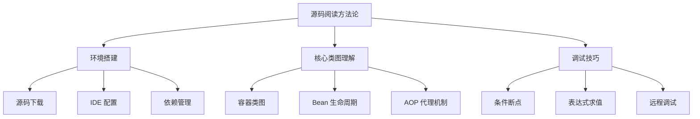
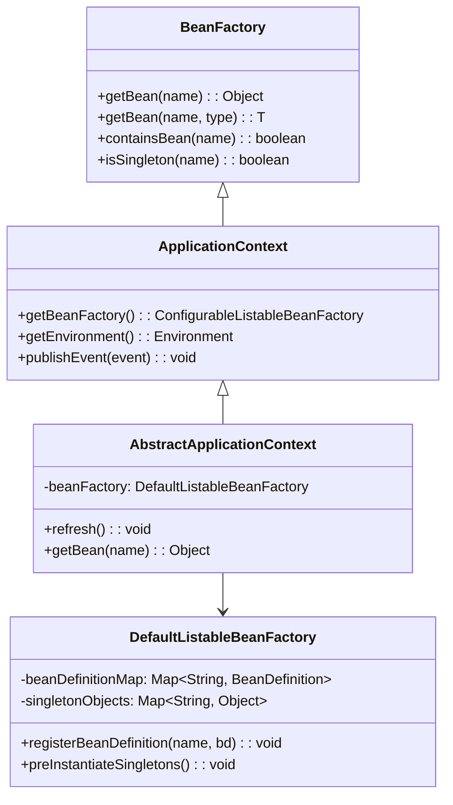
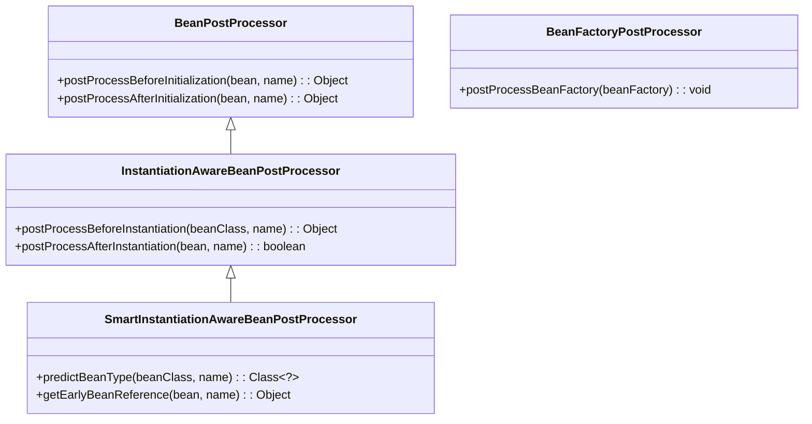
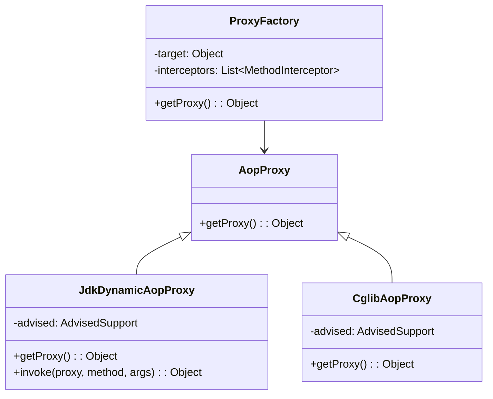

# Spring 源码阅读与调试技巧

---

## 概述

阅读 Spring 源码是深入理解框架原理的关键。本文提供系统性的源码阅读方法和实用的调试技巧，帮助您高效学习 Spring 内部机制。



## 源码阅读方法论

### 1. 分层阅读策略

#### 从宏观到微观


**阅读顺序建议：**
1. **Spring Framework 整体架构**：了解模块划分和依赖关系
2. **Spring Core 模块**：IoC 容器、Bean 管理、依赖注入
3. **Spring AOP 模块**：代理机制、切面实现
4. **Spring MVC 模块**：Web 请求处理流程
5. **Spring Boot 自动配置**：条件注解、自动装配机制

### 2. 问题驱动阅读

**带着问题读源码更高效：**
- `@Autowired` 注解是如何实现依赖注入的？
- Spring 如何解决循环依赖问题？
- AOP 代理是在哪个阶段创建的？
- `@Transactional` 事务是如何生效的？
- Spring Boot 自动配置的原理是什么？

## 环境搭建

### 1. 源码下载与编译

#### 下载 Spring Framework 源码
```bash
# 克隆 Spring Framework 仓库
git clone https://github.com/spring-projects/spring-framework.git
cd spring-framework

# 切换到稳定版本（如 6.1.x）
git checkout v6.1.0

# 使用 Gradle 编译
./gradlew build -x test
```

#### 下载 Spring Boot 源码
```bash
# 克隆 Spring Boot 仓库
git clone https://github.com/spring-projects/spring-boot.git
cd spring-boot

# 切换到稳定版本（如 3.2.x）
git checkout v3.2.0

# 编译 Spring Boot
./gradlew build -x test
```

### 2. IDE 配置

#### IntelliJ IDEA 配置
```xml
<!-- .idea/gradle.xml -->
<?xml version="1.0" encoding="UTF-8"?>
<project version="4">
  <component name="GradleSettings">
    <option name="linkedExternalProjectsSettings">
      <GradleProjectSettings>
        <option name="distributionType" value="DEFAULT_WRAPPED" />
        <option name="externalProjectPath" value="$PROJECT_DIR$" />
        <option name="gradleJvm" value="17" />
        <option name="modules">
          <set>
            <option value="$PROJECT_DIR$" />
            <option value="$PROJECT_DIR$/spring-core" />
            <option value="$PROJECT_DIR$/spring-beans" />
            <option value="$PROJECT_DIR$/spring-context" />
            <option value="$PROJECT_DIR$/spring-aop" />
            <option value="$PROJECT_DIR$/spring-web" />
            <option value="$PROJECT_DIR$/spring-webmvc" />
            <option value="$PROJECT_DIR$/spring-boot" />
            <option value="$PROJECT_DIR$/spring-boot-autoconfigure" />
          </set>
        </option>
      </GradleProjectSettings>
    </option>
  </component>
</project>
```

#### Eclipse 配置
```xml
<!-- .project -->
<projectDescription>
  <name>spring-framework</name>
  <buildSpec>
    <buildCommand>
      <name>org.eclipse.buildship.core.gradleprojectbuilder</name>
    </buildCommand>
  </buildSpec>
  <natures>
    <nature>org.eclipse.buildship.core.gradleprojectnature</nature>
  </natures>
</projectDescription>
```

### 3. 依赖管理技巧

#### 使用 Gradle 依赖替换
```gradle
// build.gradle
dependencies {
    // 使用本地源码替代远程依赖
    implementation project(':spring-core')
    implementation project(':spring-context')
    implementation project(':spring-beans')
    implementation project(':spring-aop')
    
    // 测试依赖
    testImplementation 'junit:junit:4.13.2'
    testImplementation 'org.mockito:mockito-core:4.11.0'
}
```

## 核心类图理解

### 1. IoC 容器核心类图



#### 关键接口和类说明

| 类/接口 | 职责 | 关键方法 |
|---------|------|---------|
| `BeanFactory` | Bean 工厂基础接口 | `getBean()`, `containsBean()` |
| `ApplicationContext` | 应用上下文，扩展 BeanFactory | `getEnvironment()`, `publishEvent()` |
| `AbstractApplicationContext` | 上下文抽象实现 | `refresh()`, `getBeanFactory()` |
| `DefaultListableBeanFactory` | 默认 Bean 工厂实现 | `registerBeanDefinition()`, `preInstantiateSingletons()` |
| `BeanDefinition` | Bean 定义信息 | `getBeanClassName()`, `getPropertyValues()` |

### 2. Bean 生命周期关键类



### 3. AOP 代理类图



## 调试技巧实战

### 1. 条件断点使用

#### 在关键方法设置条件断点
```java
// 在 AbstractApplicationContext.refresh() 方法设置断点
// 条件：只在该方法第一次调用时中断
// 条件表达式：invocationCount == 1

// 在 DefaultListableBeanFactory.getBean() 方法设置断点
// 条件：只在获取特定 Bean 时中断
// 条件表达式："userService".equals(name)

// 在 Bean 创建过程中设置断点
// 在 AbstractAutowireCapableBeanFactory.createBean() 方法
// 条件：beanName.contains("Controller") || beanName.contains("Service")
```

#### 实际调试示例
```java
// 调试 Bean 创建过程
public class BeanCreationDebug {
    
    public static void main(String[] args) {
        // 在以下位置设置条件断点：
        // 1. AbstractAutowireCapableBeanFactory.doCreateBean() 第 500 行左右
        //    条件：beanName.equals("userService")
        // 2. AbstractAutowireCapableBeanFactory.createBeanInstance() 第 300 行左右
        //    条件：beanName.equals("userService")
        // 3. AbstractAutowireCapableBeanFactory.populateBean() 第 1200 行左右
        //    条件：beanName.equals("userService")
        
        ApplicationContext context = new AnnotationConfigApplicationContext(AppConfig.class);
        UserService userService = context.getBean(UserService.class);
        userService.doSomething();
    }
}
```

### 2. 表达式求值调试

#### 在调试时评估表达式
```java
// 在 Bean 创建过程中评估表达式
// 在 AbstractAutowireCapableBeanFactory.doCreateBean() 方法中

// 评估表达式示例：
// 1. 查看当前 Bean 的定义信息
//    表达式：mbd.getBeanClassName()
//    表达式：mbd.getPropertyValues()

// 2. 查看 Bean 的依赖关系
//    表达式：mbd.getDependsOn()

// 3. 查看 Bean 的作用域
//    表达式：mbd.getScope()

// 4. 查看 Bean 的初始化方法
//    表达式：mbd.getInitMethodName()
```

#### 调试时调用方法
```java
// 在调试过程中调用方法进行测试
// 在 BeanPostProcessor 执行过程中

// 调用方法示例：
// 1. 测试 Bean 的类型
//    表达式：bean instanceof UserService

// 2. 调用 Bean 的方法
//    表达式：((UserService) bean).getUserCount()

// 3. 检查 Bean 的属性值
//    表达式：ReflectionUtils.findField(bean.getClass(), "userRepository").get(bean)
```

### 3. 远程调试配置

#### Spring Boot 应用远程调试
```bash
# 启动 Spring Boot 应用并启用远程调试
java -agentlib:jdwp=transport=dt_socket,server=y,suspend=n,address=5005 \
     -jar your-application.jar

# 或者使用 Maven
mvn spring-boot:run -Dspring-boot.run.jvmArguments="-agentlib:jdwp=transport=dt_socket,server=y,suspend=n,address=5005"

# 或者使用 Gradle
gradle bootRun -PjvmArgs="-agentlib:jdwp=transport=dt_socket,server=y,suspend=n,address=5005"
```

#### IDE 远程调试配置
```xml
<!-- IntelliJ IDEA 远程调试配置 -->
<configuration name="Remote Debug" type="Remote">
  <module name="your-module" />
  <option name="USE_SOCKET_TRANSPORT" value="true" />
  <option name="SERVER_MODE" value="false" />
  <option name="SHMEM_ADDRESS" value="javadebug" />
  <option name="HOST" value="localhost" />
  <option name="PORT" value="5005" />
</configuration>
```

### 4. 日志调试技巧

#### 启用 Spring 调试日志
```yaml
# application.yml
logging:
  level:
    org.springframework: DEBUG
    org.springframework.beans: TRACE
    org.springframework.context: TRACE
    org.springframework.aop: DEBUG
    org.springframework.transaction: DEBUG
    
  pattern:
    console: "%d{yyyy-MM-dd HH:mm:ss} [%thread] %-5level %logger{36} - %msg%n"
```

#### 自定义调试日志
```java
@Component
public class BeanCreationLogger implements BeanPostProcessor {
    
    private static final Logger logger = LoggerFactory.getLogger(BeanCreationLogger.class);
    
    @Override
    public Object postProcessBeforeInitialization(Object bean, String beanName) {
        logger.debug("Before initialization: {} - {}", beanName, bean.getClass().getName());
        return bean;
    }
    
    @Override
    public Object postProcessAfterInitialization(Object bean, String beanName) {
        logger.debug("After initialization: {} - {}", beanName, bean.getClass().getName());
        return bean;
    }
}

@Component
public class TransactionDebugger {
    
    private static final Logger logger = LoggerFactory.getLogger(TransactionDebugger.class);
    
    @EventListener
    public void handleTransactionEvent(TransactionEvent event) {
        logger.debug("Transaction event: {} - {}", event.getTransaction().getName(), event.getStatus());
    }
}
```

## 源码阅读实战案例

### 案例1：理解 @Autowired 注解实现

#### 阅读路径
```mermaid
graph LR
    A[@Autowired] --> B[AutowiredAnnotationBeanPostProcessor]
    B --> C[postProcessProperties]
    C --> D[inject]
    D --> E[resolveDependency]
    E --> F[doResolveDependency]
```

#### 关键代码分析
```java
// AutowiredAnnotationBeanPostProcessor.java
public class AutowiredAnnotationBeanPostProcessor implements SmartInstantiationAwareBeanPostProcessor {
    
    @Override
    public PropertyValues postProcessProperties(PropertyValues pvs, Object bean, String beanName) {
        // 查找需要注入的字段和方法
        InjectionMetadata metadata = findAutowiringMetadata(beanName, bean.getClass(), pvs);
        try {
            // 执行依赖注入
            metadata.inject(bean, beanName, pvs);
        } catch (Throwable ex) {
            throw new BeanCreationException(beanName, "Injection of autowired dependencies failed", ex);
        }
        return pvs;
    }
    
    private InjectionMetadata findAutowiringMetadata(String beanName, Class<?> clazz, PropertyValues pvs) {
        // 缓存机制，避免重复解析注解
        String cacheKey = (StringUtils.hasLength(beanName) ? beanName : clazz.getName());
        InjectionMetadata metadata = this.injectionMetadataCache.get(cacheKey);
        if (metadata == null) {
            // 解析 @Autowired 注解
            metadata = buildAutowiringMetadata(clazz);
            this.injectionMetadataCache.put(cacheKey, metadata);
        }
        return metadata;
    }
}

// DefaultListableBeanFactory.java
public class DefaultListableBeanFactory extends AbstractAutowireCapableBeanFactory {
    
    @Override
    public Object resolveDependency(DependencyDescriptor descriptor, String requestingBeanName,
            Set<String> autowiredBeanNames, TypeConverter typeConverter) throws BeansException {
        
        // 解析依赖描述符
        descriptor.initParameterNameDiscovery(getParameterNameDiscoverer());
        
        // 根据类型查找匹配的 Bean
        if (descriptor.getDependencyType().equals(javaUtilOptionalClass)) {
            return new OptionalDependencyFactory().createOptionalDependency(descriptor, requestingBeanName);
        } else if (descriptor.getDependencyType().equals(ObjectFactory.class) ||
                descriptor.getDependencyType().equals(javaxInjectProviderClass)) {
            return new DependencyObjectFactory(descriptor, requestingBeanName);
        } else {
            // 实际解析依赖
            Object result = getAutowireCandidateResolver().getSuggestedValue(descriptor);
            if (result == null) {
                result = doResolveDependency(descriptor, requestingBeanName, autowiredBeanNames, typeConverter);
            }
            return result;
        }
    }
}
```

### 案例2：理解循环依赖解决机制

#### 三级缓存分析
```java
// DefaultSingletonBeanRegistry.java
public class DefaultSingletonBeanRegistry extends SimpleAliasRegistry implements SingletonBeanRegistry {
    
    /** 一级缓存：完整的单例 Bean */
    private final Map<String, Object> singletonObjects = new ConcurrentHashMap<>(256);
    
    /** 二级缓存：早期暴露的 Bean（未完成初始化） */
    private final Map<String, Object> earlySingletonObjects = new ConcurrentHashMap<>(16);
    
    /** 三级缓存：ObjectFactory，用于创建代理对象 */
    private final Map<String, ObjectFactory<?>> singletonFactories = new ConcurrentHashMap<>(16);
    
    protected Object getSingleton(String beanName, boolean allowEarlyReference) {
        // 先从一级缓存获取
        Object singletonObject = this.singletonObjects.get(beanName);
        if (singletonObject == null && isSingletonCurrentlyInCreation(beanName)) {
            // 如果正在创建中，从二级缓存获取
            singletonObject = this.earlySingletonObjects.get(beanName);
            if (singletonObject == null && allowEarlyReference) {
                // 如果二级缓存也没有，从三级缓存获取 ObjectFactory
                synchronized (this.singletonObjects) {
                    singletonObject = this.singletonObjects.get(beanName);
                    if (singletonObject == null) {
                        singletonObject = this.earlySingletonObjects.get(beanName);
                        if (singletonObject == null) {
                            ObjectFactory<?> singletonFactory = this.singletonFactories.get(beanName);
                            if (singletonFactory != null) {
                                // 调用 ObjectFactory 获取 Bean（可能是代理对象）
                                singletonObject = singletonFactory.getObject();
                                this.earlySingletonObjects.put(beanName, singletonObject);
                                this.singletonFactories.remove(beanName);
                            }
                        }
                    }
                }
            }
        }
        return singletonObject;
    }
}
```

## 实用工具和技巧

### 1. 源码分析工具

#### 使用 JDK 自带工具
```bash
# 查看类加载信息
java -verbose:class YourApplication

# 查看内存使用情况
jmap -heap <pid>
jstat -gc <pid> 1000

# 线程分析
jstack <pid>
```

#### 使用第三方工具
- **JProfiler**：性能分析工具
- **VisualVM**：JVM 监控工具
- **Arthas**：阿里巴巴开源诊断工具
- **JConsole**：JDK 自带监控工具

### 2. 代码阅读工具

#### IDE 插件推荐
- **SequenceDiagram**：生成方法调用序列图
- **Code Iris**：代码依赖关系可视化
- **PlantUML**：UML 图生成
- **Mermaid**：流程图和类图生成

#### 在线工具
- **Sourcegraph**：在线代码搜索和浏览
- **GitHub**：代码仓库和 PR 查看
- **Spring Boot Reference**：官方文档

## 总结

通过系统性的源码阅读方法和实用的调试技巧，您可以：

1. **快速定位问题**：使用条件断点和表达式求值快速找到问题根源
2. **深入理解原理**：通过类图分析和关键代码阅读理解 Spring 内部机制
3. **提高调试效率**：掌握远程调试和日志调试技巧
4. **扩展框架功能**：基于源码理解开发自定义扩展

记住：源码阅读是一个渐进的过程，从简单到复杂，从宏观到微观，带着问题去阅读会事半功倍。