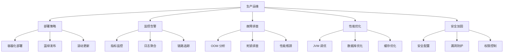

# 生产环境 Spring 应用运维

---

## 概述

生产环境运维是 Spring 应用生命周期的关键环节。本文涵盖部署策略、监控告警、故障排查、性能优化等实战内容，确保应用稳定运行。



## 部署策略

### 1. 容器化部署最佳实践

#### Dockerfile 优化
```dockerfile
# 多阶段构建优化
FROM eclipse-temurin:17-jdk as builder
WORKDIR /app
COPY . .
RUN ./gradlew build -x test

FROM eclipse-temurin:17-jre
WORKDIR /app

# 创建非 root 用户
RUN addgroup --system spring && adduser --system --ingroup spring spring
USER spring:spring

# 复制构建产物
COPY --from=builder /app/build/libs/*.jar app.jar

# JVM 参数优化
ENV JAVA_OPTS="-Xmx512m -Xms256m -XX:+UseG1GC -XX:MaxGCPauseMillis=200"

# 健康检查
HEALTHCHECK --interval=30s --timeout=3s --start-period=5s --retries=3 \
    CMD curl -f http://localhost:8080/actuator/health || exit 1

# 启动命令
ENTRYPOINT ["sh", "-c", "java $JAVA_OPTS -jar app.jar"]
```

#### Kubernetes 部署配置
```yaml
# deployment.yaml
apiVersion: apps/v1
kind: Deployment
metadata:
  name: spring-app
  labels:
    app: spring-app
spec:
  replicas: 3
  selector:
    matchLabels:
      app: spring-app
  strategy:
    type: RollingUpdate
    rollingUpdate:
      maxSurge: 1
      maxUnavailable: 0
  template:
    metadata:
      labels:
        app: spring-app
      annotations:
        prometheus.io/scrape: "true"
        prometheus.io/port: "8080"
        prometheus.io/path: "/actuator/prometheus"
    spec:
      containers:
      - name: spring-app
        image: registry.example.com/spring-app:latest
        ports:
        - containerPort: 8080
        env:
        - name: SPRING_PROFILES_ACTIVE
          value: "prod"
        - name: JAVA_OPTS
          value: "-Xmx512m -Xms256m -XX:+UseG1GC"
        resources:
          requests:
            memory: "512Mi"
            cpu: "250m"
          limits:
            memory: "1Gi"
            cpu: "500m"
        livenessProbe:
          httpGet:
            path: /actuator/health/liveness
            port: 8080
          initialDelaySeconds: 60
          periodSeconds: 10
          timeoutSeconds: 3
        readinessProbe:
          httpGet:
            path: /actuator/health/readiness
            port: 8080
          initialDelaySeconds: 30
          periodSeconds: 5
          timeoutSeconds: 3
        securityContext:
          runAsNonRoot: true
          runAsUser: 1000
          allowPrivilegeEscalation: false
---
# service.yaml
apiVersion: v1
kind: Service
metadata:
  name: spring-app
spec:
  selector:
    app: spring-app
  ports:
  - port: 80
    targetPort: 8080
  type: ClusterIP
---
# hpa.yaml
apiVersion: autoscaling/v2
kind: HorizontalPodAutoscaler
metadata:
  name: spring-app-hpa
spec:
  scaleTargetRef:
    apiVersion: apps/v1
    kind: Deployment
    name: spring-app
  minReplicas: 2
  maxReplicas: 10
  metrics:
  - type: Resource
    resource:
      name: cpu
      target:
        type: Utilization
        averageUtilization: 70
  - type: Resource
    resource:
      name: memory
      target:
        type: Utilization
        averageUtilization: 80
```

### 2. 发布策略

#### 蓝绿部署
```yaml
# blue-green-deployment.yaml
apiVersion: v1
kind: Service
metadata:
  name: spring-app
spec:
  selector:
    version: blue  # 初始指向 blue 版本
  ports:
  - port: 80
    targetPort: 8080
---
apiVersion: apps/v1
kind: Deployment
metadata:
  name: spring-app-blue
  labels:
    version: blue
spec:
  replicas: 3
  selector:
    matchLabels:
      app: spring-app
      version: blue
  template:
    metadata:
      labels:
        app: spring-app
        version: blue
    spec:
      containers:
      - name: spring-app
        image: registry.example.com/spring-app:v1.0.0
---
apiVersion: apps/v1
kind: Deployment
metadata:
  name: spring-app-green
  labels:
    version: green
spec:
  replicas: 3
  selector:
    matchLabels:
      app: spring-app
      version: green
  template:
    metadata:
      labels:
        app: spring-app
        version: green
    spec:
      containers:
      - name: spring-app
        image: registry.example.com/spring-app:v1.1.0
```

#### 滚动更新配置
```yaml
# 滚动更新策略
strategy:
  type: RollingUpdate
  rollingUpdate:
    maxSurge: 25%        # 最大可超出副本数
    maxUnavailable: 25%   # 最大不可用副本数
```

## 监控告警

### 1. Spring Boot Actuator 配置

#### 完整的监控配置
```yaml
# application-prod.yml
management:
  endpoints:
    web:
      exposure:
        include: health,info,metrics,prometheus,loggers,env
      base-path: /actuator
    enabled-by-default: false
  
  endpoint:
    health:
      enabled: true
      show-details: always
      show-components: always
      group:
        liveness:
          include: livenessState,diskSpace
        readiness:
          include: readinessState,ping,db,custom
    
    metrics:
      enabled: true
    
    prometheus:
      enabled: true
    
    loggers:
      enabled: true
    
    env:
      enabled: true
  
  health:
    livenessstate:
      enabled: true
    readinessstate:
      enabled: true
    diskspace:
      enabled: true
    db:
      enabled: true
  
  metrics:
    export:
      prometheus:
        enabled: true
        step: 1m
    distribution:
      percentiles-histogram:
        http.server.requests: true
      sla:
        http.server.requests: 100ms,200ms,500ms
  
  info:
    env:
      enabled: true
```

#### 自定义健康检查
```java
@Component
public class CustomHealthIndicator implements HealthIndicator {
    
    private final DataSource dataSource;
    private final RedisTemplate<String, String> redisTemplate;
    
    public CustomHealthIndicator(DataSource dataSource, RedisTemplate<String, String> redisTemplate) {
        this.dataSource = dataSource;
        this.redisTemplate = redisTemplate;
    }
    
    @Override
    public Health health() {
        Map<String, Object> details = new HashMap<>();
        
        // 数据库健康检查
        try (Connection connection = dataSource.getConnection()) {
            if (connection.isValid(5)) {
                details.put("database", "UP");
            } else {
                return Health.down().withDetail("database", "Connection invalid").build();
            }
        } catch (SQLException e) {
            return Health.down(e).withDetail("database", "Connection failed").build();
        }
        
        // Redis 健康检查
        try {
            redisTemplate.getConnectionFactory().getConnection().ping();
            details.put("redis", "UP");
        } catch (Exception e) {
            return Health.down(e).withDetail("redis", "Connection failed").build();
        }
        
        // 自定义业务健康检查
        if (checkBusinessHealth()) {
            details.put("business", "UP");
        } else {
            return Health.down().withDetail("business", "Business logic unhealthy").build();
        }
        
        return Health.up().withDetails(details).build();
    }
    
    private boolean checkBusinessHealth() {
        // 实现业务逻辑健康检查
        return true;
    }
}

@Component
public class LivenessHealthIndicator implements HealthIndicator {
    
    @Override
    public Health health() {
        // 检查 JVM 内存使用率
        Runtime runtime = Runtime.getRuntime();
        long usedMemory = runtime.totalMemory() - runtime.freeMemory();
        long maxMemory = runtime.maxMemory();
        double memoryUsage = (double) usedMemory / maxMemory;
        
        Map<String, Object> details = new HashMap<>();
        details.put("memory.used", formatMemory(usedMemory));
        details.put("memory.max", formatMemory(maxMemory));
        details.put("memory.usage", String.format("%.2f%%", memoryUsage * 100));
        
        if (memoryUsage > 0.9) {
            return Health.down()
                .withDetails(details)
                .withDetail("error", "High memory usage")
                .build();
        }
        
        return Health.up().withDetails(details).build();
    }
    
    private String formatMemory(long bytes) {
        return String.format("%.2f MB", bytes / 1024.0 / 1024.0);
    }
}
```

### 2. Prometheus + Grafana 监控

#### 应用指标配置
```java
@Configuration
public class MetricsConfig {
    
    @Bean
    public MeterRegistryCustomizer<MeterRegistry> metricsCommonTags() {
        return registry -> registry.config().commonTags(
            "application", "spring-app",
            "environment", "production"
        );
    }
    
    @Bean
    public TimedAspect timedAspect(MeterRegistry registry) {
        return new TimedAspect(registry);
    }
}

@Service
public class OrderService {
    
    private final MeterRegistry meterRegistry;
    private final Counter orderCounter;
    private final Timer orderProcessingTimer;
    private final Gauge activeOrdersGauge;
    
    public OrderService(MeterRegistry meterRegistry) {
        this.meterRegistry = meterRegistry;
        
        this.orderCounter = Counter.builder("orders.total")
            .description("Total number of orders")
            .register(meterRegistry);
        
        this.orderProcessingTimer = Timer.builder("orders.processing.time")
            .description("Time taken to process an order")
            .publishPercentiles(0.5, 0.95, 0.99)  // 50%, 95%, 99% 分位数
            .register(meterRegistry);
        
        this.activeOrdersGauge = Gauge.builder("orders.active")
            .description("Number of active orders")
            .register(meterRegistry);
    }
    
    @Timed(value = "orders.create", description = "Time taken to create an order")
    public Order createOrder(OrderRequest request) {
        orderCounter.increment();
        
        return orderProcessingTimer.record(() -> {
            // 订单创建逻辑
            Order order = processOrder(request);
            activeOrdersGauge.increment();
            return order;
        });
    }
}
```

#### Grafana 仪表板配置
```json
{
  "dashboard": {
    "title": "Spring Application Metrics",
    "panels": [
      {
        "title": "JVM Memory Usage",
        "type": "graph",
        "targets": [
          {
            "expr": "jvm_memory_used_bytes{area=\"heap\"} / jvm_memory_max_bytes{area=\"heap\"} * 100",
            "legendFormat": "Heap Usage"
          }
        ]
      },
      {
        "title": "HTTP Request Rate",
        "type": "graph", 
        "targets": [
          {
            "expr": "rate(http_server_requests_seconds_count[5m])",
            "legendFormat": "Request Rate"
          }
        ]
      },
      {
        "title": "Order Processing Time",
        "type": "graph",
        "targets": [
          {
            "expr": "histogram_quantile(0.95, rate(orders_processing_time_seconds_bucket[5m]))",
            "legendFormat": "95th Percentile"
          }
        ]
      }
    ]
  }
}
```

## 故障排查

### 1. OOM 问题排查

#### 内存泄漏检测
```java
@Component
public class MemoryLeakDetector {
    
    private static final Logger logger = LoggerFactory.getLogger(MemoryLeakDetector.class);
    
    @Scheduled(fixedRate = 60000)  // 每分钟检查一次
    public void checkMemoryUsage() {
        Runtime runtime = Runtime.getRuntime();
        long usedMemory = runtime.totalMemory() - runtime.freeMemory();
        long maxMemory = runtime.maxMemory();
        double usage = (double) usedMemory / maxMemory;
        
        if (usage > 0.8) {
            logger.warn("High memory usage: {}%", String.format("%.2f", usage * 100));
            
            // 触发堆转储（需要配置 -XX:+HeapDumpOnOutOfMemoryError）
            if (usage > 0.9) {
                logger.error("Critical memory usage, consider taking heap dump");
            }
        }
    }
    
    // 手动触发堆转储的接口
    @RestController
    @RequestMapping("/api/admin")
    public class AdminController {
        
        @PostMapping("/heap-dump")
        public ResponseEntity<String> triggerHeapDump() {
            try {
                // 使用 HotSpotDiagnosticMXBean 生成堆转储
                HotSpotDiagnosticMXBean diagnosticBean = ManagementFactory
                    .getPlatformMXBean(HotSpotDiagnosticMXBean.class);
                
                String dumpFile = "/tmp/heapdump_" + System.currentTimeMillis() + ".hprof";
                diagnosticBean.dumpHeap(dumpFile, true);
                
                return ResponseEntity.ok("Heap dump created: " + dumpFile);
            } catch (IOException e) {
                return ResponseEntity.status(500).body("Failed to create heap dump: " + e.getMessage());
            }
        }
    }
}
```

#### 堆转储分析工具使用
```bash
# 使用 jmap 生成堆转储
jmap -dump:live,format=b,file=heapdump.hprof <pid>

# 使用 jhat 分析堆转储
jhat heapdump.hprof

# 使用 Eclipse MAT 分析（推荐）
# 下载地址：https://www.eclipse.org/mat/

# 使用 VisualVM 分析
jvisualvm --openfile heapdump.hprof
```

### 2. 死锁排查

#### 死锁检测工具
```java
@Component
public class DeadlockDetector {
    
    private static final Logger logger = LoggerFactory.getLogger(DeadlockDetector.class);
    
    @Scheduled(fixedRate = 30000)  // 每30秒检查一次
    public void checkDeadlock() {
        ThreadMXBean threadBean = ManagementFactory.getThreadMXBean();
        long[] threadIds = threadBean.findDeadlockedThreads();
        
        if (threadIds != null && threadIds.length > 0) {
            logger.error("Detected deadlock involving {} threads", threadIds.length);
            
            ThreadInfo[] threadInfos = threadBean.getThreadInfo(threadIds, true, true);
            for (ThreadInfo threadInfo : threadInfos) {
                logger.error("Deadlocked thread: {}", threadInfo.getThreadName());
                logger.error("Lock info: {}", threadInfo.getLockName());
                logger.error("Stack trace:");
                for (StackTraceElement element : threadInfo.getStackTrace()) {
                    logger.error("    {}", element);
                }
            }
            
            // 发送告警
            sendDeadlockAlert(threadInfos);
        }
    }
    
    private void sendDeadlockAlert(ThreadInfo[] threadInfos) {
        // 实现告警逻辑，如发送邮件、短信、钉钉等
        String message = "Deadlock detected in Spring application. Check logs for details.";
        // alertService.sendAlert(message);
    }
}
```

#### 线程转储分析
```bash
# 生成线程转储
jstack <pid> > threaddump.txt

# 分析线程转储中的死锁
# 查找 "Found one Java-level deadlock" 部分

# 使用在线工具分析
# https://fastthread.io/
# https://gceasy.io/
```

### 3. 性能瓶颈排查

#### 慢查询监控
```java
@Aspect
@Component
public class PerformanceMonitorAspect {
    
    private static final Logger logger = LoggerFactory.getLogger(PerformanceMonitorAspect.class);
    private static final long SLOW_THRESHOLD = 1000; // 1秒
    
    @Around("execution(* com.example.service.*.*(..))")
    public Object monitorPerformance(ProceedingJoinPoint joinPoint) throws Throwable {
        long startTime = System.currentTimeMillis();
        
        try {
            return joinPoint.proceed();
        } finally {
            long duration = System.currentTimeMillis() - startTime;
            
            if (duration > SLOW_THRESHOLD) {
                logger.warn("Slow method execution: {} took {}ms", 
                    joinPoint.getSignature().toShortString(), duration);
                
                // 记录慢方法详情
                logSlowMethodDetails(joinPoint, duration);
            }
        }
    }
    
    private void logSlowMethodDetails(ProceedingJoinPoint joinPoint, long duration) {
        String methodName = joinPoint.getSignature().toShortString();
        Object[] args = joinPoint.getArgs();
        
        logger.info("Slow method details - Method: {}, Duration: {}ms, Args: {}", 
            methodName, duration, Arrays.toString(args));
    }
}
```

#### 数据库性能监控
```java
@Component
public class DatabasePerformanceMonitor {
    
    private static final Logger logger = LoggerFactory.getLogger(DatabasePerformanceMonitor.class);
    
    @Autowired
    private DataSource dataSource;
    
    @Scheduled(fixedRate = 60000)  // 每分钟检查一次
    public void monitorDatabasePerformance() {
        if (dataSource instanceof HikariDataSource) {
            HikariDataSource hikariDataSource = (HikariDataSource) dataSource;
            HikariPoolMXBean poolMXBean = hikariDataSource.getHikariPoolMXBean();
            
            int activeConnections = poolMXBean.getActiveConnections();
            int idleConnections = poolMXBean.getIdleConnections();
            int totalConnections = poolMXBean.getTotalConnections();
            long connectionTimeout = hikariDataSource.getConnectionTimeout();
            
            if (activeConnections > totalConnections * 0.8) {
                logger.warn("High database connection usage: {}/{} ({}%)", 
                    activeConnections, totalConnections, 
                    (activeConnections * 100 / totalConnections));
            }
            
            // 记录连接池指标
            logger.info("Database connection pool - Active: {}, Idle: {}, Total: {}", 
                activeConnections, idleConnections, totalConnections);
        }
    }
}
```

## 性能优化

### 1. JVM 调优

#### 生产环境 JVM 参数
```bash
# 生产环境推荐配置
java -jar app.jar \
  -Xms2g -Xmx2g \
  -XX:+UseG1GC \
  -XX:MaxGCPauseMillis=200 \
  -XX:InitiatingHeapOccupancyPercent=45 \
  -XX:+ExplicitGCInvokesConcurrent \
  -XX:+HeapDumpOnOutOfMemoryError \
  -XX:HeapDumpPath=/tmp \
  -XX:+PrintGCDetails \
  -XX:+PrintGCDateStamps \
  -Xloggc:/tmp/gc.log \
  -Djava.security.egd=file:/dev/./urandom
```

#### G1 GC 调优参数
```bash
# G1 GC 专用调优
-XX:+UseG1GC
-XX:G1HeapRegionSize=16m
-XX:MaxGCPauseMillis=200
-XX:G1NewSizePercent=30
-XX:G1MaxNewSizePercent=60
-XX:G1HeapWastePercent=5
-XX:G1MixedGCCountTarget=8
```

### 2. 应用层优化

#### 连接池优化
```yaml
# application-prod.yml
spring:
  datasource:
    hikari:
      maximum-pool-size: 20
      minimum-idle: 5
      connection-timeout: 30000
      idle-timeout: 600000
      max-lifetime: 1800000
      leak-detection-threshold: 60000
  
  redis:
    lettuce:
      pool:
        max-active: 20
        max-idle: 10
        min-idle: 5
        max-wait: 3000
```

#### 缓存优化
```java
@Configuration
@EnableCaching
public class CacheConfig {
    
    @Bean
    public CacheManager cacheManager(RedisConnectionFactory redisConnectionFactory) {
        RedisCacheConfiguration config = RedisCacheConfiguration.defaultCacheConfig()
            .entryTtl(Duration.ofMinutes(30))  // 默认缓存30分钟
            .disableCachingNullValues()        // 不缓存null值
            .serializeKeysWith(RedisSerializationContext.SerializationPair
                .fromSerializer(new StringRedisSerializer()))
            .serializeValuesWith(RedisSerializationContext.SerializationPair
                .fromSerializer(new GenericJackson2JsonRedisSerializer()));
        
        return RedisCacheManager.builder(redisConnectionFactory)
            .cacheDefaults(config)
            .withInitialCacheConfigurations(getCacheConfigurations())
            .transactionAware()
            .build();
    }
    
    private Map<String, RedisCacheConfiguration> getCacheConfigurations() {
        Map<String, RedisCacheConfiguration> cacheConfigs = new HashMap<>();
        
        // 用户信息缓存1小时
        cacheConfigs.put("users", RedisCacheConfiguration.defaultCacheConfig()
            .entryTtl(Duration.ofHours(1)));
        
        // 配置信息缓存24小时
        cacheConfigs.put("configs", RedisCacheConfiguration.defaultCacheConfig()
            .entryTtl(Duration.ofHours(24)));
        
        return cacheConfigs;
    }
}
```

## 安全加固

### 1. 安全配置

#### Spring Security 生产配置
```java
@Configuration
@EnableWebSecurity
public class SecurityConfig {
    
    @Bean
    public SecurityFilterChain filterChain(HttpSecurity http) throws Exception {
        http
            .csrf().disable()  // 如果是API服务可以禁用CSRF
            .authorizeHttpRequests(authz -> authz
                .requestMatchers("/actuator/health").permitAll()
                .requestMatchers("/actuator/info").permitAll()
                .requestMatchers("/api/public/**").permitAll()
                .requestMatchers("/api/admin/**").hasRole("ADMIN")
                .anyRequest().authenticated()
            )
            .sessionManagement(session -> session
                .sessionCreationPolicy(SessionCreationPolicy.STATELESS)  // 无状态会话
            )
            .oauth2ResourceServer(oauth2 -> oauth2
                .jwt(jwt -> jwt.jwtAuthenticationConverter(jwtAuthenticationConverter()))
            )
            .headers(headers -> headers
                .contentSecurityPolicy("default-src 'self'")
                .and()
                .frameOptions().deny()  // 防止点击劫持
            );
        
        return http.build();
    }
    
    private Converter<Jwt, AbstractAuthenticationToken> jwtAuthenticationConverter() {
        JwtAuthenticationConverter converter = new JwtAuthenticationConverter();
        converter.setJwtGrantedAuthoritiesConverter(new KeycloakRealmRoleConverter());
        return converter;
    }
}
```

#### 应用安全头配置
```yaml
# 在 application-prod.yml 中配置
server:
  servlet:
    session:
      timeout: 30m
      cookie:
        secure: true
        http-only: true
        same-site: strict
  
  tomcat:
    relaxed-query-chars: ["[]"]  # 防止非法字符攻击
```

## 总结

生产环境 Spring 应用运维需要关注：

1. **部署策略**：容器化部署、蓝绿发布、滚动更新
2. **监控告警**：健康检查、指标监控、日志聚合
3. **故障排查**：OOM 分析、死锁检测、性能瓶颈定位
4. **性能优化**：JVM 调优、连接池配置、缓存策略
5. **安全加固**：安全配置、漏洞防护、权限控制

通过系统性的运维实践，可以确保 Spring 应用在生产环境中稳定、高效、安全地运行。