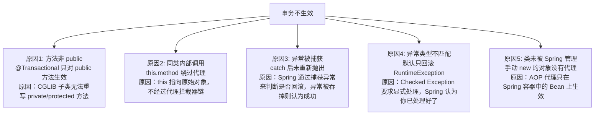

# Spring 事务管理

---

## 1. 类比：事务就像银行转账的原子操作

转账必须"扣款"和"入账"同时成功或同时失败，不能只扣款不入账。`@Transactional` 就是告诉 Spring："这个方法里的所有数据库操作，要么全成功，要么全回滚"。

---

## 2. 七种事务传播行为

| 传播行为 | 含义 | 使用场景 | 为什么这样设计 |
|---------|------|---------|-------------|
| `REQUIRED`（默认） | 有事务则加入，没有则新建 | 绝大多数业务方法 | 最常见需求，复用已有事务减少开销 |
| `REQUIRES_NEW` | 总是新建事务，挂起当前事务 | 日志记录（不受外层事务回滚影响） | 需要独立提交，不受外层影响 |
| `SUPPORTS` | 有事务则加入，没有则非事务执行 | 查询方法 | 查询不需要事务，但如果已有事务也可以参与 |
| `NOT_SUPPORTED` | 总是非事务执行，挂起当前事务 | 不需要事务的操作 | 某些操作（如发邮件）不应在事务中执行 |
| `MANDATORY` | 必须在事务中执行，否则抛异常 | 强制要求调用方开启事务 | 防止调用方忘记开启事务 |
| `NEVER` | 不能在事务中执行，否则抛异常 | 明确禁止事务的场景 | 某些操作（如批量导入）在事务中会锁表太久 |
| `NESTED` | 嵌套事务，外层回滚则内层也回滚 | 部分回滚场景（保存点） | 内层可以独立回滚，不影响外层继续执行 |

> **为什么默认是 REQUIRED 而不是 REQUIRES_NEW**：REQUIRED 复用已有事务，避免频繁开启/提交事务的开销；而 REQUIRES_NEW 每次都新建事务，开销更大。大多数业务场景希望多个操作在同一事务中，REQUIRED 是最自然的选择。

---

## 3. 事务不生效的 5 种常见原因（深度分析）



---

## 4. 常见错误代码示例

```java
// ❌ 常见错误：捕获了异常但没有重新抛出
@Transactional
public void transfer() {
    try {
        deduct();
        add();
    } catch (Exception e) {
        log.error("转账失败", e);
        // 事务不会回滚！Spring 没有收到异常，认为方法正常结束
    }
}

// ✅ 正确做法：重新抛出，或手动标记回滚
@Transactional(rollbackFor = Exception.class)
public void transfer() {
    try {
        deduct();
        add();
    } catch (Exception e) {
        log.error("转账失败", e);
        throw e; // 重新抛出，触发回滚
        // 或者：TransactionAspectSupport.currentTransactionStatus().setRollbackOnly();
    }
}
```

```java
// ❌ 同类内部调用，事务不生效
@Service
public class OrderService {
    public void createOrder() {
        this.saveOrder(); // this 指向原始对象，绕过代理，事务不生效
    }

    @Transactional
    public void saveOrder() { ... }
}

// ✅ 注入自身代理解决
@Service
public class OrderService {
    @Autowired
    private OrderService self; // Spring 注入的是代理对象

    public void createOrder() {
        self.saveOrder(); // 通过代理调用，事务生效
    }

    @Transactional
    public void saveOrder() { ... }
}
```

---

## 5. @Transactional 常用属性

| 属性 | 默认值 | 说明 |
|------|--------|------|
| `propagation` | `REQUIRED` | 事务传播行为 |
| `isolation` | `DEFAULT`（使用数据库默认） | 事务隔离级别 |
| `rollbackFor` | `RuntimeException` | 触发回滚的异常类型 |
| `noRollbackFor` | 无 | 不触发回滚的异常类型 |
| `timeout` | -1（不超时） | 事务超时时间（秒） |
| `readOnly` | `false` | 只读事务（优化查询性能） |

---

## 6. 面试高频问题

**Q1：@Transactional 事务不生效的原因有哪些？**
> ① 方法非 public（CGLIB 无法重写）；② 同类内部调用（`this` 绕过代理）；③ 异常被捕获未重新抛出；④ 异常类型不是 RuntimeException（需加 `rollbackFor`）；⑤ 类未被 Spring 管理（手动 new）。

**Q2：REQUIRED 和 REQUIRES_NEW 的区别？**
> REQUIRED 加入已有事务（无则新建），多个操作共用一个事务，任一失败全部回滚；REQUIRES_NEW 总是新建独立事务，与外层事务互不影响，适合需要独立提交的场景（如操作日志）。

**Q3：事务中抛出异常后，如何只回滚部分操作？**
> 使用 `NESTED` 传播行为（嵌套事务），内层事务可以独立回滚而不影响外层；或者使用 `SavePoint` 手动设置保存点。

**一句话口诀**：事务是 AOP 的特例，`this` 调用不生效，异常要抛出，Checked 异常要加 `rollbackFor`，REQUIRED 共享事务，REQUIRES_NEW 独立事务。