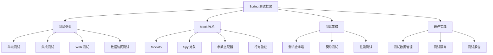
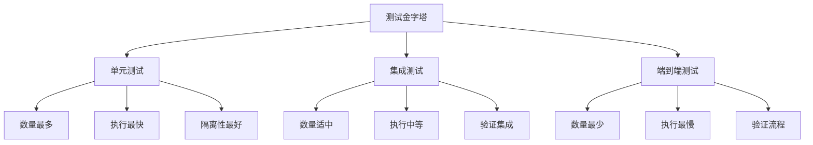

# Spring 测试框架深度使用

---

## 概述

Spring 测试框架提供了强大的测试支持，从单元测试到集成测试，从 Mock 对象到测试切片。本文深度解析 Spring 测试框架的高级用法。



## Spring 测试框架核心

### 1. 测试注解体系

#### 核心测试注解
```java
// 基础测试注解
@SpringBootTest          // 启动完整的 Spring 应用上下文
@WebMvcTest              // 仅测试 Web 层，不加载完整的上下文
@DataJpaTest             // 仅测试 JPA 组件
@JsonTest                // 仅测试 JSON 序列化/反序列化
@RestClientTest          // 仅测试 REST 客户端
```

#### 测试配置注解
```java
// 配置相关注解
@TestConfiguration       // 测试专用的配置类
@ContextConfiguration    // 指定配置文件
@ActiveProfiles          // 激活特定的 Profile
@TestPropertySource      // 加载测试属性文件
@Import                  // 导入特定的配置类
```

### 2. 测试切片（Test Slices）

#### Web 层测试切片
```java
@WebMvcTest(UserController.class)
class UserControllerTest {
    
    @Autowired
    private MockMvc mockMvc;
    
    @MockBean
    private UserService userService;
    
    @Test
    void shouldReturnUserWhenValidId() throws Exception {
        // 模拟服务层返回
        given(userService.getUserById(1L))
            .willReturn(new User(1L, "John", "john@example.com"));
        
        // 执行 HTTP 请求并验证
        mockMvc.perform(get("/api/users/1"))
            .andExpect(status().isOk())
            .andExpect(jsonPath("$.name").value("John"))
            .andExpect(jsonPath("$.email").value("john@example.com"));
    }
    
    @Test
    void shouldReturn404WhenUserNotFound() throws Exception {
        given(userService.getUserById(999L))
            .willThrow(new UserNotFoundException("User not found"));
        
        mockMvc.perform(get("/api/users/999"))
            .andExpect(status().isNotFound());
    }
}
```

#### 数据访问层测试切片
```java
@DataJpaTest
@AutoConfigureTestDatabase(replace = AutoConfigureTestDatabase.Replace.NONE)
class UserRepositoryTest {
    
    @Autowired
    private TestEntityManager entityManager;
    
    @Autowired
    private UserRepository userRepository;
    
    @Test
    void shouldFindUserByEmail() {
        // 准备测试数据
        User user = new User("John", "john@example.com");
        entityManager.persist(user);
        entityManager.flush();
        
        // 执行查询
        Optional<User> found = userRepository.findByEmail("john@example.com");
        
        // 验证结果
        assertThat(found).isPresent();
        assertThat(found.get().getName()).isEqualTo("John");
    }
    
    @Test
    void shouldReturnEmptyWhenEmailNotFound() {
        Optional<User> found = userRepository.findByEmail("nonexistent@example.com");
        assertThat(found).isEmpty();
    }
}
```

## Mock 技术深度使用

### 1. Mockito 高级特性

#### 参数匹配器（Argument Matchers）
```java
@Service
class OrderService {
    
    public Order createOrder(Long userId, OrderRequest request) {
        // 业务逻辑
        return order;
    }
    
    public List<Order> findOrdersByStatus(Long userId, OrderStatus status) {
        // 查询逻辑
        return orders;
    }
}

@ExtendWith(MockitoExtension.class)
class OrderServiceTest {
    
    @Mock
    private OrderRepository orderRepository;
    
    @InjectMocks
    private OrderService orderService;
    
    @Test
    void shouldCreateOrderWithAnyUserId() {
        OrderRequest request = new OrderRequest("product1", 2);
        Order expectedOrder = new Order(1L, 100L, request);
        
        // 使用 any() 匹配器，不关心具体的 userId
        given(orderRepository.save(any(Order.class)))
            .willReturn(expectedOrder);
        
        Order result = orderService.createOrder(anyLong(), request);
        
        assertThat(result).isEqualTo(expectedOrder);
        verify(orderRepository).save(any(Order.class));
    }
    
    @Test
    void shouldFindOrdersWithSpecificStatus() {
        List<Order> pendingOrders = Arrays.asList(
            new Order(1L, 100L, OrderStatus.PENDING),
            new Order(2L, 100L, OrderStatus.PENDING)
        );
        
        // 使用 eq() 精确匹配参数
        given(orderRepository.findByUserIdAndStatus(eq(100L), eq(OrderStatus.PENDING)))
            .willReturn(pendingOrders);
        
        List<Order> result = orderService.findOrdersByStatus(100L, OrderStatus.PENDING);
        
        assertThat(result).hasSize(2);
        assertThat(result).allMatch(order -> order.getStatus() == OrderStatus.PENDING);
    }
    
    @Test
    void shouldHandleComplexParameterMatching() {
        // 使用 argThat() 自定义匹配器
        given(orderRepository.save(argThat(order -> 
            order.getUserId() != null && order.getTotalAmount().compareTo(BigDecimal.ZERO) > 0)))
        ).willAnswer(invocation -> invocation.getArgument(0));
        
        OrderRequest request = new OrderRequest("product1", 2);
        Order result = orderService.createOrder(100L, request);
        
        assertThat(result).isNotNull();
        assertThat(result.getUserId()).isEqualTo(100L);
    }
}
```

#### Spy 对象使用
```java
@Service
class PaymentService {
    
    public PaymentResult processPayment(PaymentRequest request) {
        validatePayment(request);
        PaymentResult result = callPaymentGateway(request);
        recordPayment(result);
        return result;
    }
    
    protected void validatePayment(PaymentRequest request) {
        if (request.getAmount().compareTo(BigDecimal.ZERO) <= 0) {
            throw new IllegalArgumentException("Payment amount must be positive");
        }
    }
    
    protected PaymentResult callPaymentGateway(PaymentRequest request) {
        // 调用第三方支付网关
        return paymentGateway.process(request);
    }
    
    protected void recordPayment(PaymentResult result) {
        // 记录支付结果
        paymentRepository.save(result);
    }
}

@ExtendWith(MockitoExtension.class)
class PaymentServiceTest {
    
    @Spy
    @InjectMocks
    private PaymentService paymentService;
    
    @Mock
    private PaymentGateway paymentGateway;
    
    @Mock
    private PaymentRepository paymentRepository;
    
    @Test
    void shouldProcessPaymentSuccessfully() {
        PaymentRequest request = new PaymentRequest(BigDecimal.valueOf(100));
        PaymentResult expectedResult = new PaymentResult("SUCCESS", "12345");
        
        // 模拟第三方调用
        given(paymentGateway.process(request)).willReturn(expectedResult);
        
        // 执行测试
        PaymentResult result = paymentService.processPayment(request);
        
        // 验证结果
        assertThat(result.getStatus()).isEqualTo("SUCCESS");
        
        // 验证方法调用
        verify(paymentService).validatePayment(request);
        verify(paymentService).callPaymentGateway(request);
        verify(paymentService).recordPayment(expectedResult);
        verify(paymentRepository).save(expectedResult);
    }
    
    @Test
    void shouldSkipGatewayCallWhenValidationFails() {
        PaymentRequest invalidRequest = new PaymentRequest(BigDecimal.valueOf(-100));
        
        // 验证异常抛出
        assertThatThrownBy(() -> paymentService.processPayment(invalidRequest))
            .isInstanceOf(IllegalArgumentException.class)
            .hasMessage("Payment amount must be positive");
        
        // 验证网关未被调用
        verify(paymentGateway, never()).process(any());
        verify(paymentRepository, never()).save(any());
    }
    
    @Test
    void shouldStubSpecificMethod() {
        PaymentRequest request = new PaymentRequest(BigDecimal.valueOf(100));
        
        // 对 Spy 对象的特定方法进行存根
        doReturn(new PaymentResult("MOCKED", "mock-id"))
            .when(paymentService).callPaymentGateway(request);
        
        PaymentResult result = paymentService.processPayment(request);
        
        assertThat(result.getStatus()).isEqualTo("MOCKED");
        
        // 验证存根方法被调用，而不是原始实现
        verify(paymentService).callPaymentGateway(request);
        verify(paymentGateway, never()).process(any());
    }
}
```

### 2. 行为验证高级用法

#### 调用次数验证
```java
@ExtendWith(MockitoExtension.class)
class NotificationServiceTest {
    
    @Mock
    private EmailService emailService;
    
    @Mock
    private SmsService smsService;
    
    @InjectMocks
    private NotificationService notificationService;
    
    @Test
    void shouldSendBothEmailAndSmsForImportantNotification() {
        NotificationRequest request = new NotificationRequest("重要通知", "这是一条重要消息", true);
        
        notificationService.sendNotification(request);
        
        // 验证方法调用次数
        verify(emailService, times(1)).sendEmail(anyString(), anyString());
        verify(smsService, times(1)).sendSms(anyString(), anyString());
        
        // 验证调用顺序
        InOrder inOrder = inOrder(emailService, smsService);
        inOrder.verify(emailService).sendEmail(anyString(), anyString());
        inOrder.verify(smsService).sendSms(anyString(), anyString());
    }
    
    @Test
    void shouldSendOnlyEmailForNormalNotification() {
        NotificationRequest request = new NotificationRequest("普通通知", "这是一条普通消息", false);
        
        notificationService.sendNotification(request);
        
        // 验证邮件发送一次，短信不发送
        verify(emailService, times(1)).sendEmail(anyString(), anyString());
        verify(smsService, never()).sendSms(anyString(), anyString());
    }
    
    @Test
    void shouldHandleRetryLogic() {
        NotificationRequest request = new NotificationRequest("重试测试", "测试消息", true);
        
        // 第一次调用失败，第二次成功
        given(emailService.sendEmail(anyString(), anyString()))
            .willThrow(new RuntimeException("Network error"))
            .willReturn(true);
        
        notificationService.sendNotificationWithRetry(request, 3);
        
        // 验证重试逻辑（总共调用2次）
        verify(emailService, times(2)).sendEmail(anyString(), anyString());
    }
    
    @Test
    void shouldVerifyWithTimeout() {
        NotificationRequest request = new NotificationRequest("异步通知", "异步消息", false);
        
        // 异步发送通知
        CompletableFuture.runAsync(() -> {
            try {
                Thread.sleep(100); // 模拟异步延迟
                notificationService.sendNotification(request);
            } catch (InterruptedException e) {
                Thread.currentThread().interrupt();
            }
        });
        
        // 使用超时验证异步调用
        verify(emailService, timeout(500).times(1)).sendEmail(anyString(), anyString());
    }
}
```

## 集成测试深度实践

### 1. @SpringBootTest 高级用法

#### 测试配置管理
```java
@SpringBootTest(
    webEnvironment = SpringBootTest.WebEnvironment.RANDOM_PORT,
    properties = {
        "spring.datasource.url=jdbc:h2:mem:testdb",
        "spring.jpa.hibernate.ddl-auto=create-drop",
        "logging.level.org.springframework=DEBUG"
    }
)
@ActiveProfiles("test")
@TestPropertySource(locations = "classpath:application-test.properties")
class UserServiceIntegrationTest {
    
    @Autowired
    private TestRestTemplate restTemplate;
    
    @Autowired
    private UserRepository userRepository;
    
    @LocalServerPort
    private int port;
    
    @BeforeEach
    void setUp() {
        // 清理测试数据
        userRepository.deleteAll();
        
        // 准备测试数据
        User user1 = new User("Alice", "alice@example.com");
        User user2 = new User("Bob", "bob@example.com");
        userRepository.saveAll(Arrays.asList(user1, user2));
    }
    
    @Test
    void shouldGetAllUsersViaRest() {
        ResponseEntity<User[]> response = restTemplate.getForEntity(
            "http://localhost:" + port + "/api/users", User[].class);
        
        assertThat(response.getStatusCode()).isEqualTo(HttpStatus.OK);
        assertThat(response.getBody()).hasSize(2);
        assertThat(response.getBody())
            .extracting(User::getName)
            .containsExactlyInAnyOrder("Alice", "Bob");
    }
    
    @Test
    void shouldCreateUserViaRest() {
        User newUser = new User("Charlie", "charlie@example.com");
        
        ResponseEntity<User> response = restTemplate.postForEntity(
            "http://localhost:" + port + "/api/users", newUser, User.class);
        
        assertThat(response.getStatusCode()).isEqualTo(HttpStatus.CREATED);
        assertThat(response.getBody().getId()).isNotNull();
        assertThat(response.getBody().getName()).isEqualTo("Charlie");
        
        // 验证数据库中的数据
        assertThat(userRepository.count()).isEqualTo(3);
        assertThat(userRepository.findByEmail("charlie@example.com")).isPresent();
    }
    
    @Test
    @Sql(scripts = "/sql/test-users.sql")
    @Sql(scripts = "/sql/cleanup-users.sql", executionPhase = Sql.ExecutionPhase.AFTER_TEST_METHOD)
    void shouldLoadTestDataFromSqlScript() {
        // 测试数据由 @Sql 注解加载
        List<User> users = userRepository.findAll();
        assertThat(users).hasSize(5); // 脚本中插入了5条记录
        
        Optional<User> admin = userRepository.findByEmail("admin@example.com");
        assertThat(admin).isPresent();
        assertThat(admin.get().getName()).isEqualTo("Admin User");
    }
}
```

#### 测试事务管理
```java
@SpringBootTest
@Transactional
class TransactionalUserServiceTest {
    
    @Autowired
    private UserService userService;
    
    @Autowired
    private UserRepository userRepository;
    
    @Test
    void shouldRollbackTransactionOnFailure() {
        // 准备测试数据
        User user1 = new User("User1", "user1@example.com");
        User user2 = new User("User2", "user2@example.com");
        
        userRepository.save(user1);
        
        // 这个操作会失败，导致事务回滚
        assertThatThrownBy(() -> userService.batchCreateUsers(Arrays.asList(user1, user2)))
            .isInstanceOf(DataIntegrityViolationException.class);
        
        // 验证事务回滚，user1 也没有被保存
        assertThat(userRepository.count()).isEqualTo(0);
    }
    
    @Test
    @Rollback(false)  // 禁用自动回滚
    void shouldCommitTransactionWhenDisabledRollback() {
        User user = new User("TestUser", "test@example.com");
        
        userService.createUser(user);
        
        // 验证数据被提交到数据库
        assertThat(userRepository.count()).isEqualTo(1);
        assertThat(userRepository.findByEmail("test@example.com")).isPresent();
        
        // 手动清理
        userRepository.deleteAll();
    }
    
    @Test
    @DirtiesContext(methodMode = DirtiesContext.MethodMode.AFTER_METHOD)
    void shouldResetApplicationContext() {
        // 这个测试会修改应用上下文状态
        userService.updateCacheConfiguration("new-config");
        
        // 由于使用了 @DirtiesContext，下一个测试会使用干净的应用上下文
    }
}
```

### 2. 测试数据管理

#### 使用 Testcontainers
```java
@Testcontainers
@SpringBootTest
class UserServiceWithTestcontainersTest {
    
    @Container
    static PostgreSQLContainer<?> postgres = new PostgreSQLContainer<>("postgres:13")
        .withDatabaseName("testdb")
        .withUsername("test")
        .withPassword("test");
    
    @DynamicPropertySource
    static void configureProperties(DynamicPropertyRegistry registry) {
        registry.add("spring.datasource.url", postgres::getJdbcUrl);
        registry.add("spring.datasource.username", postgres::getUsername);
        registry.add("spring.datasource.password", postgres::getPassword);
    }
    
    @Autowired
    private UserRepository userRepository;
    
    @Test
    void shouldWorkWithRealDatabase() {
        User user = new User("Test", "test@example.com");
        User saved = userRepository.save(user);
        
        assertThat(saved.getId()).isNotNull();
        assertThat(userRepository.count()).isEqualTo(1);
    }
}
```

#### 使用@DataJpaTest 与 Testcontainers 结合
```java
@DataJpaTest
@Testcontainers
class UserRepositoryWithTestcontainersTest {
    
    @Container
    static PostgreSQLContainer<?> postgres = new PostgreSQLContainer<>("postgres:13");
    
    @DynamicPropertySource
    static void configureProperties(DynamicPropertyRegistry registry) {
        registry.add("spring.datasource.url", postgres::getJdbcUrl);
        registry.add("spring.datasource.username", postgres::getUsername);
        registry.add("spring.datasource.password", postgres::getPassword);
    }
    
    @Autowired
    private TestEntityManager entityManager;
    
    @Autowired
    private UserRepository userRepository;
    
    @Test
    void shouldPersistUserWithTestcontainers() {
        User user = new User("John", "john@example.com");
        User saved = userRepository.save(user);
        
        assertThat(saved.getId()).isNotNull();
        assertThat(userRepository.findByEmail("john@example.com")).isPresent();
    }
}
```

## 测试策略与最佳实践

### 1. 测试金字塔实践



#### 测试分布建议
```java
// 单元测试示例（70%）
class UserServiceUnitTest {
    
    @Test
    void shouldCalculateUserAge() {
        // 纯业务逻辑测试，不依赖外部资源
    }
}

// 集成测试示例（20%）
@WebMvcTest(UserController.class)
class UserControllerIntegrationTest {
    
    @Test
    void shouldReturnUserViaHttp() {
        // 测试控制器与HTTP层的集成
    }
}

// 端到端测试示例（10%）
@SpringBootTest(webEnvironment = SpringBootTest.WebEnvironment.RANDOM_PORT)
class UserServiceE2ETest {
    
    @Test
    void shouldCompleteUserRegistrationFlow() {
        // 测试完整的用户注册流程
    }
}
```

### 2. 契约测试

#### Spring Cloud Contract 使用
```java
// 生产者端契约定义
@RunWith(SpringRunner.class)
@SpringBootTest(webEnvironment = SpringBootTest.WebEnvironment.MOCK)
public class UserContractTest {
    
    @Autowired
    private UserController userController;
    
    @Before
    public void setup() {
        StandaloneMockMvcBuilder builder = MockMvcBuilders.standaloneSetup(userController);
        RestAssuredMockMvc.standaloneSetup(builder);
    }
    
    @Test
    public void shouldReturnUserWhenExists() {
        given()
            .mockMvc(mockMvc)
        .when()
            .get("/users/1")
        .then()
            .status(200)
            .body("id", equalTo(1))
            .body("name", equalTo("John"));
    }
}

// 消费者端测试
@SpringBootTest
@AutoConfigureStubRunner(ids = {"com.example:user-service:+:stubs:8080"})
class UserServiceConsumerTest {
    
    @Autowired
    private UserServiceClient userServiceClient;
    
    @Test
    void shouldGetUserFromProducer() {
        User user = userServiceClient.getUser(1L);
        
        assertThat(user.getId()).isEqualTo(1L);
        assertThat(user.getName()).isEqualTo("John");
    }
}
```

### 3. 性能测试

#### 使用 @RepeatedTest 进行性能基准测试
```java
@SpringBootTest
class UserServicePerformanceTest {
    
    @Autowired
    private UserService userService;
    
    @RepeatedTest(100)  // 重复执行100次
    void shouldProcessUserQuickly() {
        long startTime = System.nanoTime();
        
        User user = userService.createUser(new User("Test", "test@example.com"));
        
        long duration = System.nanoTime() - startTime;
        
        // 断言执行时间在合理范围内
        assertThat(duration).isLessThan(100_000_000); // 100ms
        assertThat(user).isNotNull();
    }
    
    @Test
    void shouldHandleConcurrentRequests() throws InterruptedException {
        int threadCount = 10;
        CountDownLatch startLatch = new CountDownLatch(1);
        CountDownLatch endLatch = new CountDownLatch(threadCount);
        
        List<CompletableFuture<Void>> futures = new ArrayList<>();
        
        for (int i = 0; i < threadCount; i++) {
            CompletableFuture<Void> future = CompletableFuture.runAsync(() -> {
                try {
                    startLatch.await();
                    userService.createUser(new User("User" + Thread.currentThread().getId(), "test@example.com"));
                } catch (InterruptedException e) {
                    Thread.currentThread().interrupt();
                } finally {
                    endLatch.countDown();
                }
            });
            futures.add(future);
        }
        
        // 同时启动所有线程
        startLatch.countDown();
        
        // 等待所有线程完成
        endLatch.await(10, TimeUnit.SECONDS);
        
        // 验证所有任务都成功完成
        for (CompletableFuture<Void> future : futures) {
            assertThat(future).isDone();
            assertThat(future).isNotCompletedExceptionally();
        }
    }
}
```

## 总结

Spring 测试框架提供了丰富的测试支持：

1. **测试切片**：针对不同层次的精准测试
2. **Mock 技术**：强大的 Mockito 集成和高级用法
3. **集成测试**：完整的应用上下文测试支持
4. **测试策略**：测试金字塔、契约测试、性能测试
5. **最佳实践**：测试数据管理、事务控制、测试隔离

通过深度使用 Spring 测试框架，可以构建可靠、可维护的测试套件，确保代码质量和系统稳定性。