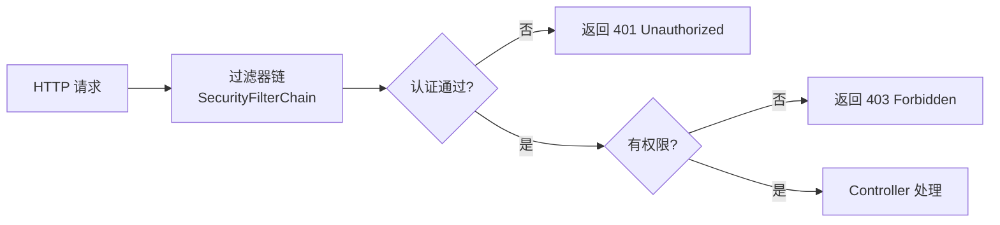
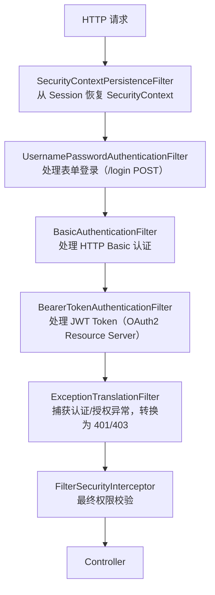
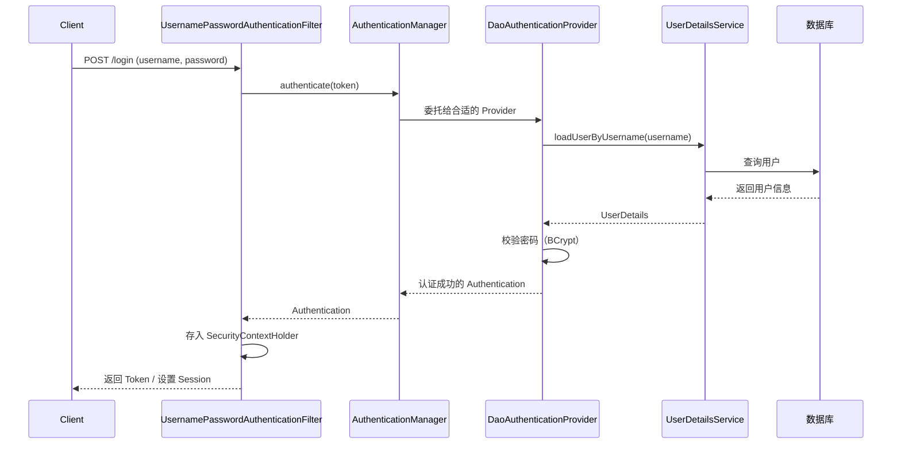
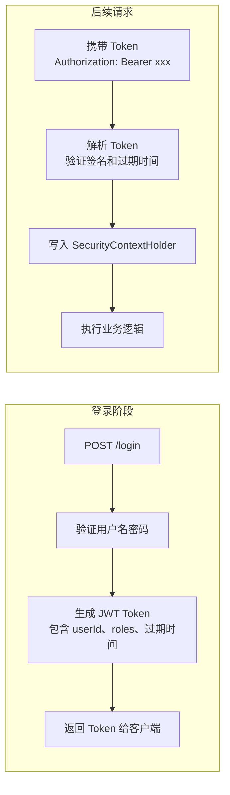

# Spring Security 认证与授权

---

## 1. 核心概念

Spring Security 解决两个核心问题：

- **认证（Authentication）**：你是谁？—— 验证用户身份（登录）
- **授权（Authorization）**：你能做什么？—— 控制资源访问权限



---

## 2. 过滤器链（核心架构）

Spring Security 本质是一条 **Servlet 过滤器链**，请求必须通过所有过滤器才能到达 Controller：



**关键过滤器说明**：

| 过滤器 | 作用 |
|--------|------|
| `SecurityContextPersistenceFilter` | 请求开始时从 Session 加载 `SecurityContext`，请求结束时保存回去 |
| `UsernamePasswordAuthenticationFilter` | 拦截登录请求，提取用户名密码，调用 `AuthenticationManager` 认证 |
| `ExceptionTranslationFilter` | 捕获 `AuthenticationException`（→401）和 `AccessDeniedException`（→403） |
| `FilterSecurityInterceptor` | 最终的权限决策，调用 `AccessDecisionManager` |

---

## 3. 认证流程



**核心接口**：

```java
// 1. 实现此接口，告诉 Spring Security 如何加载用户
@Service
public class UserDetailsServiceImpl implements UserDetailsService {
    @Autowired
    private UserMapper userMapper;

    @Override
    public UserDetails loadUserByUsername(String username) throws UsernameNotFoundException {
        User user = userMapper.selectByUsername(username);
        if (user == null) {
            throw new UsernameNotFoundException("用户不存在: " + username);
        }
        // 返回 Spring Security 的 UserDetails 对象
        return org.springframework.security.core.userdetails.User
            .withUsername(user.getUsername())
            .password(user.getPassword())  // 已加密的密码
            .authorities(user.getRoles())  // 角色列表
            .build();
    }
}
```

---

## 4. JWT 无状态认证方案

传统 Session 认证在分布式环境下需要共享 Session（Redis），JWT 方案无需服务端存储状态：



**JWT 过滤器实现**：

```java
@Component
public class JwtAuthenticationFilter extends OncePerRequestFilter {

    @Autowired
    private JwtUtils jwtUtils;

    @Override
    protected void doFilterInternal(HttpServletRequest request,
                                    HttpServletResponse response,
                                    FilterChain chain) throws ServletException, IOException {
        String header = request.getHeader("Authorization");
        if (header != null && header.startsWith("Bearer ")) {
            String token = header.substring(7);
            try {
                // 解析 Token，获取用户信息
                Claims claims = jwtUtils.parseToken(token);
                Long userId = claims.get("userId", Long.class);
                List<String> roles = claims.get("roles", List.class);

                // 构建认证对象，写入 SecurityContext
                UsernamePasswordAuthenticationToken auth =
                    new UsernamePasswordAuthenticationToken(
                        userId,
                        null,
                        roles.stream().map(SimpleGrantedAuthority::new).collect(Collectors.toList())
                    );
                SecurityContextHolder.getContext().setAuthentication(auth);
            } catch (JwtException e) {
                // Token 无效，清空 SecurityContext
                SecurityContextHolder.clearContext();
            }
        }
        chain.doFilter(request, response);
    }
}
```

**Security 配置**：

```java
@Configuration
@EnableWebSecurity
@EnableMethodSecurity  // 开启方法级权限注解
public class SecurityConfig {

    @Autowired
    private JwtAuthenticationFilter jwtFilter;

    @Bean
    public SecurityFilterChain filterChain(HttpSecurity http) throws Exception {
        http
            .csrf(csrf -> csrf.disable())  // 前后端分离，禁用 CSRF
            .sessionManagement(session ->
                session.sessionCreationPolicy(SessionCreationPolicy.STATELESS))  // 无状态
            .authorizeHttpRequests(auth -> auth
                .requestMatchers("/api/auth/**").permitAll()  // 登录注册接口放行
                .requestMatchers("/api/admin/**").hasRole("ADMIN")  // 管理员接口
                .anyRequest().authenticated()  // 其余接口需要认证
            )
            .addFilterBefore(jwtFilter, UsernamePasswordAuthenticationFilter.class);
        return http.build();
    }

    @Bean
    public PasswordEncoder passwordEncoder() {
        return new BCryptPasswordEncoder();  // 密码加密
    }
}
```

---

## 5. 方法级权限控制

```java
// 需要在配置类上加 @EnableMethodSecurity

// 基于角色
@PreAuthorize("hasRole('ADMIN')")
public void deleteUser(Long id) { ... }

// 基于权限
@PreAuthorize("hasAuthority('user:delete')")
public void deleteUser(Long id) { ... }

// 复杂表达式（SpEL）
@PreAuthorize("hasRole('ADMIN') or #userId == authentication.principal")
public UserVO getUser(Long userId) { ... }

// 返回值过滤
@PostFilter("filterObject.userId == authentication.principal")
public List<Order> getOrders() { ... }
```

---

## 6. 面试高频问题

**Q1：认证和授权的区别？**
> 认证（Authentication）是验证"你是谁"，通常是登录验证用户名密码；授权（Authorization）是验证"你能做什么"，基于已认证的身份判断是否有权限访问某资源。

**Q2：Spring Security 过滤器链的执行顺序？**
> 请求进入后依次经过：`SecurityContextPersistenceFilter`（恢复上下文）→ 认证过滤器（JWT/表单登录）→ `ExceptionTranslationFilter`（异常转换）→ `FilterSecurityInterceptor`（最终权限校验）。

**Q3：JWT 和 Session 认证的区别？**
> Session 有状态，服务端存储会话信息，分布式环境需要共享 Session（Redis）；JWT 无状态，用户信息编码在 Token 中，服务端只需验证签名，天然支持分布式，但 Token 无法主动失效（需要黑名单机制）。

**Q4：JWT Token 如何实现主动失效（退出登录）？**
> JWT 本身无法撤销，常见方案：① Redis 黑名单，退出时将 Token 存入 Redis（TTL = Token 剩余有效期），每次请求校验是否在黑名单中；② 缩短 Token 有效期 + Refresh Token 机制；③ 在 Token 中加入版本号，用户退出时更新版本号，旧 Token 版本号不匹配则拒绝。

**Q5：`@PreAuthorize` 和 `@Secured` 的区别？**
> `@Secured` 只支持角色字符串（需加 `ROLE_` 前缀），功能简单；`@PreAuthorize` 支持 SpEL 表达式，可以写复杂逻辑（如 `#userId == authentication.principal`），更灵活，推荐使用。

**一句话总结**：Spring Security = 过滤器链拦截请求 + `UserDetailsService` 加载用户 + `AuthenticationManager` 验证身份 + `AccessDecisionManager` 决策权限。