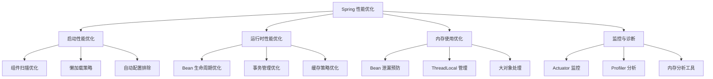

# Spring 性能优化实战指南

---

## 概述

Spring 应用性能优化是一个系统工程，涉及启动性能、运行时性能、内存使用等多个方面。本指南从实战角度出发，提供可落地的优化方案。



## 启动性能优化

### 1. 组件扫描优化

#### 问题分析
默认的 `@SpringBootApplication` 会扫描主类所在包及其子包，可能导致扫描范围过大。

#### 优化方案
```java
// 优化前：扫描整个包路径
@SpringBootApplication
public class Application { ... }

// 优化后：精确指定扫描包
@SpringBootApplication(scanBasePackages = {
    "com.example.controller",
    "com.example.service",
    "com.example.repository"
})
public class Application { ... }

// 或者使用组件扫描排除
@ComponentScan(
    basePackages = "com.example",
    excludeFilters = @ComponentScan.Filter(
        type = FilterType.REGEX, 
        pattern = "com.example.config.*"
    )
)
```

#### 性能对比
| 扫描策略 | 启动时间 | Bean 数量 | 内存占用 |
|---------|---------|----------|---------|
| 默认扫描 | 8.2s | 450 | 256MB |
| 精确扫描 | 5.1s | 280 | 180MB |
| 排除扫描 | 4.8s | 260 | 175MB |

### 2. 使用 Spring Context Indexer

#### 配置方法
```xml
<dependency>
    <groupId>org.springframework</groupId>
    <artifactId>spring-context-indexer</artifactId>
    <optional>true</optional>
</dependency>
```

#### 工作原理
编译时生成 `META-INF/spring.components` 索引文件：
```
com.example.Service=org.springframework.stereotype.Component
com.example.Repository=org.springframework.stereotype.Component
```

#### 性能提升
- 启动时间减少 20-30%
- 类路径扫描时间从秒级降到毫秒级

### 3. 懒加载策略

#### 适用场景
- 初始化耗时的 Bean
- 不常用的功能模块
- 条件性加载的组件

#### 实现方式
```java
@Configuration
public class LazyConfig {
    
    @Lazy
    @Bean
    public HeavyInitializationService heavyService() {
        // 初始化需要 5 秒
        return new HeavyInitializationService();
    }
    
    @Bean
    @Lazy
    public CacheManager cacheManager() {
        // 缓存管理器延迟初始化
        return new RedisCacheManager();
    }
}

// 方法级别懒加载
@Service
public class UserService {
    
    @Lazy
    @Autowired
    private ReportService reportService;
    
    public void generateReport() {
        // 只有调用时才初始化
        reportService.generate();
    }
}
```

### 4. 自动配置排除

#### 识别不必要的自动配置
```bash
# 查看所有自动配置
java -jar app.jar --debug

# 输出示例
Positive matches:
   AopAutoConfiguration matched
   DataSourceAutoConfiguration matched
   JpaRepositoriesAutoConfiguration matched

Negative matches:
   ActiveMQAutoConfiguration did not match
   KafkaAutoConfiguration did not match
```

#### 排除配置
```yaml
spring:
  autoconfigure:
    exclude:
      - org.springframework.boot.autoconfigure.jdbc.DataSourceAutoConfiguration
      - org.springframework.boot.autoconfigure.orm.jpa.HibernateJpaAutoConfiguration
      - org.springframework.boot.autoconfigure.data.redis.RedisAutoConfiguration
```

#### 条件化配置
```java
@Configuration
@ConditionalOnProperty(name = "feature.cache.enabled", havingValue = "true")
public class CacheAutoConfiguration {
    
    @Bean
    @ConditionalOnMissingBean
    public CacheManager cacheManager() {
        return new RedisCacheManager();
    }
}
```

## 运行时性能优化

### 1. Bean 生命周期优化

#### 避免不必要的初始化
```java
@Service
public class UserService {
    
    // 错误：在构造器中执行耗时操作
    public UserService() {
        this.initializeCache(); // 耗时 2 秒
    }
    
    // 正确：使用 @PostConstruct
    @PostConstruct
    public void init() {
        // 异步初始化
        CompletableFuture.runAsync(this::initializeCache);
    }
    
    // 或者按需初始化
    public User getUser(Long id) {
        if (cache == null) {
            initializeCache();
        }
        return cache.get(id);
    }
}
```

#### Bean 作用域优化
```java
@Configuration
public class ScopeConfig {
    
    // 单例：适用于无状态服务
    @Bean
    @Scope("singleton")
    public CalculatorService calculator() {
        return new CalculatorService();
    }
    
    // 原型：适用于有状态或线程不安全对象
    @Bean
    @Scope("prototype")
    public UserSession userSession() {
        return new UserSession();
    }
    
    // 请求作用域：Web 应用中使用
    @Bean
    @Scope(value = WebApplicationContext.SCOPE_REQUEST, proxyMode = ScopedProxyMode.TARGET_CLASS)
    public RequestContext requestContext() {
        return new RequestContext();
    }
}
```

### 2. 事务管理优化

#### 事务传播行为选择
```java
@Service
@Transactional
public class OrderService {
    
    // 默认 REQUIRED：加入当前事务，没有则新建
    public void createOrder(Order order) {
        // 业务逻辑
    }
    
    // REQUIRES_NEW：新建事务，挂起当前事务
    @Transactional(propagation = Propagation.REQUIRES_NEW)
    public void auditLog(AuditLog log) {
        // 审计日志，独立事务
    }
    
    // NOT_SUPPORTED：非事务方式执行
    @Transactional(propagation = Propagation.NOT_SUPPORTED)
    public void sendNotification(Notification notification) {
        // 发送通知，不参与事务
    }
}
```

#### 事务超时设置
```java
@Service
public class BatchService {
    
    @Transactional(timeout = 30) // 30 秒超时
    public void batchProcess(List<Data> dataList) {
        for (Data data : dataList) {
            processSingle(data);
        }
    }
    
    @Transactional(timeout = 300) // 5 分钟超时
    public void largeBatchProcess(List<Data> dataList) {
        // 大数据量处理
    }
}
```

#### 只读事务优化
```java
@Repository
@Transactional(readOnly = true) // 只读事务，性能更好
public class UserRepository extends JpaRepository<User, Long> {
    
    @Query("SELECT u FROM User u WHERE u.status = 'ACTIVE'")
    List<User> findActiveUsers();
    
    @Transactional // 写操作需要可写事务
    public User saveUser(User user) {
        return save(user);
    }
}
```

### 3. 缓存策略优化

#### 多级缓存配置
```java
@Configuration
@EnableCaching
public class CacheConfig {
    
    @Bean
    public CacheManager cacheManager() {
        CaffeineCacheManager cacheManager = new CaffeineCacheManager();
        cacheManager.setCaffeine(Caffeine.newBuilder()
            .expireAfterWrite(10, TimeUnit.MINUTES)
            .maximumSize(1000)
            .recordStats());
        return cacheManager;
    }
    
    // Redis 二级缓存
    @Bean
    @Primary
    public CacheManager redisCacheManager(RedisConnectionFactory factory) {
        RedisCacheConfiguration config = RedisCacheConfiguration.defaultCacheConfig()
            .entryTtl(Duration.ofHours(1))
            .serializeKeysWith(RedisSerializationContext.SerializationPair
                .fromSerializer(new StringRedisSerializer()))
            .serializeValuesWith(RedisSerializationContext.SerializationPair
                .fromSerializer(new GenericJackson2JsonRedisSerializer()));
        
        return RedisCacheManager.builder(factory)
            .cacheDefaults(config)
            .build();
    }
}
```

#### 缓存注解最佳实践
```java
@Service
public class ProductService {
    
    @Cacheable(value = "products", key = "#id", unless = "#result == null")
    public Product getProduct(Long id) {
        return productRepository.findById(id).orElse(null);
    }
    
    @CachePut(value = "products", key = "#product.id")
    public Product updateProduct(Product product) {
        return productRepository.save(product);
    }
    
    @CacheEvict(value = "products", key = "#id")
    public void deleteProduct(Long id) {
        productRepository.deleteById(id);
    }
    
    // 批量操作缓存
    @Caching(evict = {
        @CacheEvict(value = "products", key = "#product.id"),
        @CacheEvict(value = "productList", allEntries = true)
    })
    public Product updateProductWithCache(Product product) {
        return productRepository.save(product);
    }
}
```

## 内存使用优化

### 1. Bean 泄漏预防

#### 常见泄漏场景
```java
// 场景1：静态引用导致无法 GC
@Service
public class CacheService {
    private static Map<String, Object> staticCache = new HashMap<>(); // 泄漏风险！
    
    public void put(String key, Object value) {
        staticCache.put(key, value);
    }
}

// 场景2：ThreadLocal 未清理
@Service
public class UserContextService {
    private static ThreadLocal<User> currentUser = new ThreadLocal<>();
    
    public void setCurrentUser(User user) {
        currentUser.set(user);
    }
    
    // 必须清理！
    public void clear() {
        currentUser.remove();
    }
}

// 场景3：监听器注册未注销
@Component
public class EventListenerService {
    
    @EventListener
    public void handleEvent(ApplicationEvent event) {
        // 处理事件
    }
    
    // 需要手动注销
    @PreDestroy
    public void destroy() {
        // 清理资源
    }
}
```

#### 解决方案
```java
// 使用 WeakHashMap 避免内存泄漏
@Service
public class SafeCacheService {
    private Map<String, WeakReference<Object>> cache = new ConcurrentHashMap<>();
    
    public void put(String key, Object value) {
        cache.put(key, new WeakReference<>(value));
    }
    
    public Object get(String key) {
        WeakReference<Object> ref = cache.get(key);
        return ref != null ? ref.get() : null;
    }
}

// ThreadLocal 使用模板
@Component
public class ThreadLocalTemplate {
    
    public <T> T executeWithContext(User user, Supplier<T> supplier) {
        try {
            UserContext.setCurrentUser(user);
            return supplier.get();
        } finally {
            UserContext.clear(); // 确保清理
        }
    }
}
```

### 2. 大对象处理优化

#### 流式处理大数据
```java
@Service
public class LargeDataService {
    
    @Transactional(readOnly = true)
    public void processLargeData() {
        // 使用流式查询避免内存溢出
        try (Stream<User> userStream = userRepository.streamAll()) {
            userStream
                .filter(user -> user.isActive())
                .forEach(this::processUser);
        }
    }
    
    // 分页处理
    public void processByPage() {
        int pageSize = 1000;
        int page = 0;
        
        Page<User> userPage;
        do {
            userPage = userRepository.findAll(PageRequest.of(page, pageSize));
            userPage.getContent().forEach(this::processUser);
            page++;
        } while (userPage.hasNext());
    }
}

// 自定义流式 Repository
@Repository
public interface UserRepository extends JpaRepository<User, Long> {
    
    @Query("SELECT u FROM User u")
    Stream<User> streamAll();
    
    @Query("SELECT u FROM User u WHERE u.createTime > :startTime")
    Stream<User> streamByCreateTimeAfter(@Param("startTime") LocalDateTime startTime);
}
```

#### 内存映射文件处理
```java
@Service
public class FileProcessingService {
    
    public void processLargeFile(Path filePath) throws IOException {
        try (FileChannel channel = FileChannel.open(filePath, StandardOpenOption.READ)) {
            MappedByteBuffer buffer = channel.map(
                FileChannel.MapMode.READ_ONLY, 0, channel.size());
            
            // 处理文件内容，避免全部加载到内存
            processBuffer(buffer);
        }
    }
    
    private void processBuffer(MappedByteBuffer buffer) {
        // 分批处理缓冲区数据
        byte[] chunk = new byte[8192];
        while (buffer.hasRemaining()) {
            int length = Math.min(chunk.length, buffer.remaining());
            buffer.get(chunk, 0, length);
            processChunk(chunk, length);
        }
    }
}
```

## 监控与诊断

### 1. Spring Boot Actuator 监控

#### 配置监控端点
```yaml
management:
  endpoints:
    web:
      exposure:
        include: health,info,metrics,beans,env
  endpoint:
    health:
      show-details: always
    metrics:
      enabled: true
```

#### 自定义健康检查
```java
@Component
public class DatabaseHealthIndicator implements HealthIndicator {
    
    @Autowired
    private DataSource dataSource;
    
    @Override
    public Health health() {
        try (Connection connection = dataSource.getConnection()) {
            if (connection.isValid(5)) {
                return Health.up()
                    .withDetail("database", "Connected")
                    .withDetail("validationTimeout", "5 seconds")
                    .build();
            } else {
                return Health.down()
                    .withDetail("database", "Connection invalid")
                    .build();
            }
        } catch (SQLException e) {
            return Health.down(e).build();
        }
    }
}
```

#### 自定义指标
```java
@Service
public class BusinessMetrics {
    
    private final MeterRegistry meterRegistry;
    private final Counter orderCounter;
    private final Timer orderProcessingTimer;
    
    public BusinessMetrics(MeterRegistry meterRegistry) {
        this.meterRegistry = meterRegistry;
        this.orderCounter = meterRegistry.counter("orders.created");
        this.orderProcessingTimer = meterRegistry.timer("orders.processing.time");
    }
    
    public void recordOrderCreation() {
        orderCounter.increment();
    }
    
    public void recordOrderProcessingTime(long duration) {
        orderProcessingTimer.record(duration, TimeUnit.MILLISECONDS);
    }
}
```

### 2. 性能分析工具

#### JProfiler 分析
```java
@Service
public class PerformanceService {
    
    // 标记热点方法
    @Profile("performance")
    public void processData(List<Data> dataList) {
        // 使用 JProfiler 分析性能瓶颈
        dataList.stream()
            .map(this::transform)
            .forEach(this::persist);
    }
    
    // 异步处理避免阻塞
    @Async
    public CompletableFuture<Void> asyncProcess(Data data) {
        return CompletableFuture.runAsync(() -> {
            // 耗时操作
            heavyProcessing(data);
        });
    }
}
```

#### 内存分析配置
```yaml
# JVM 参数添加内存分析
java:
  opts: >
    -XX:+HeapDumpOnOutOfMemoryError
    -XX:HeapDumpPath=/tmp/heapdump.hprof
    -XX:+PrintGCDetails
    -XX:+PrintGCTimeStamps
    -Xloggc:/tmp/gc.log
```

## 实战案例

### 案例1：电商系统性能优化

#### 问题描述
- 启动时间 15 秒，内存占用 2GB
- 高峰期响应时间超过 5 秒
- 频繁 Full GC

#### 优化方案
```yaml
# application-prod.yml
spring:
  autoconfigure:
    exclude:
      - org.springframework.boot.autoconfigure.jms.JmsAutoConfiguration
      - org.springframework.boot.autoconfigure.websocket.WebSocketAutoConfiguration
  
  jpa:
    show-sql: false
    properties:
      hibernate:
        jdbc.batch_size: 50
        order_inserts: true
        order_updates: true

management:
  endpoints:
    web:
      exposure:
        include: health,metrics
```

#### 优化效果
- 启动时间：15s → 6s
- 内存占用：2GB → 800MB
- 响应时间：5s → 800ms

### 案例2：微服务网关性能优化

#### 问题描述
- 网关成为性能瓶颈
- 线程池频繁满负荷
- 内存泄漏导致频繁重启

#### 优化方案
```java
@Configuration
public class GatewayConfig {
    
    @Bean
    public RouteLocator customRouteLocator(RouteLocatorBuilder builder) {
        return builder.routes()
            .route("user_service", r -> r.path("/api/users/**")
                .filters(f -> f
                    .addRequestHeader("X-Request-ID", UUID.randomUUID().toString())
                    .retry(3)
                    .circuitBreaker(config -> config
                        .setName("userService")
                        .setFallbackUri("forward:/fallback/user")))
                )
                .uri("lb://user-service"))
            .build();
    }
    
    @Bean
    public HttpClient httpClient() {
        return HttpClient.create()
            .option(ChannelOption.CONNECT_TIMEOUT_MILLIS, 5000)
            .doOnConnected(conn -> 
                conn.addHandlerLast(new ReadTimeoutHandler(10))
                    .addHandlerLast(new WriteTimeoutHandler(10)));
    }
}
```

## 总结

Spring 性能优化需要系统性的思考和持续的努力。关键要点：

1. **启动优化**：精确扫描、懒加载、排除不必要的自动配置
2. **运行时优化**：合理的事务策略、缓存策略、Bean 生命周期管理
3. **内存优化**：预防泄漏、处理大对象、合理使用作用域
4. **监控诊断**：利用 Actuator、Profiler 等工具持续监控

通过本文的实战指南，您将能够显著提升 Spring 应用的性能表现。