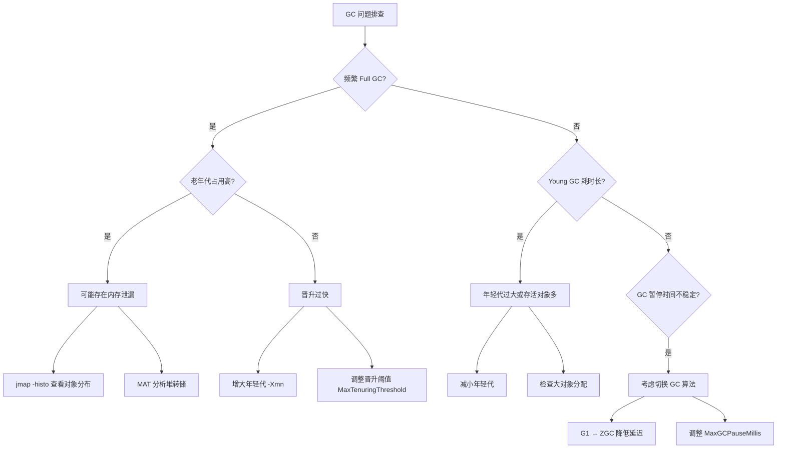
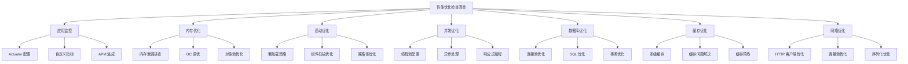

# Spring 性能优化实战指南

---

## 概述

性能优化是 Spring 应用开发中的重要环节。本文从实战角度出发，深度解析 Spring 应用的性能优化策略和技巧。

```mermaid
graph TB
    A[Spring 性能优化] --> B[应用性能监控]
    A --> C[内存优化]
    A --> D[启动性能优化]
    A --> E[并发性能优化]
    A --> F[数据库性能优化]
    A --> G[缓存优化]
    A --> H[网络优化]
    
    B --> B1[Spring Boot Actuator]
    B --> B2[自定义指标]
    B --> B3[性能分析工具]
    B --> B4[APM 集成]
    
    C --> C1[内存泄漏排查]
    C --> C2[GC 调优]
    C --> C3[对象池优化]
    C --> C4[堆外内存管理]
    
    D --> D1[懒加载策略]
    D --> D2[组件扫描优化]
    D --> D3[类路径优化]
    D --> D4[AOT 编译]
    
    E --> E1[线程池配置]
    E --> E2[异步处理]
    E --> E3[响应式编程]
    E --> E4[虚拟线程]
    
    F --> F1[连接池优化]
    F --> F2[SQL 优化]
    F --> F3[事务优化]
    F --> F4[分库分表]
    
    G --> G1[缓存策略]
    G --> G2[缓存穿透/击穿/雪崩]
    G --> G3[多级缓存]
    G --> G4[缓存预热]
    
    H --> H1[连接池优化]
    H --> H2[HTTP 客户端优化]
    H --> H3[序列化优化]
    H --> H4[压缩优化]
```



## 应用性能监控

### 1. Spring Boot Actuator 深度使用

#### 完整监控配置
```yaml
# application.yml
management:
  endpoints:
    web:
      exposure:
        include: health,metrics,info,beans,env,configprops,conditions,httptrace,loggers,threaddump
      base-path: /actuator
      path-mapping:
        health: healthcheck
    jmx:
      exposure:
        include: "*"
  endpoint:
    health:
      show-details: always
      show-components: always
      enabled: true
      probes:
        enabled: true
    metrics:
      enabled: true
    prometheus:
      enabled: true
    loggers:
      enabled: true
    threaddump:
      enabled: true
  metrics:
    export:
      prometheus:
        enabled: true
        step: 1m
      influx:
        enabled: false
    tags:
      application: ${spring.application.name}
      environment: ${spring.profiles.active:default}
      instance: ${HOSTNAME:local}
    distribution:
      percentiles-histogram:
        http.server.requests: true
      sla:
        http.server.requests: 100ms,200ms,500ms,1s,2s
  info:
    env:
      enabled: true
    build:
      enabled: true
    git:
      enabled: true
      mode: full

# 安全配置（生产环境）
spring:
  security:
    user:
      name: actuator
      password: ${ACTUATOR_PASSWORD:changeme}
      roles: ACTUATOR
```

#### 自定义健康检查
```java
@Component
public class CustomHealthIndicator implements HealthIndicator {
    
    @Autowired
    private DataSource dataSource;
    
    @Autowired
    private RedisTemplate<String, Object> redisTemplate;
    
    @Autowired
    private ApplicationContext applicationContext;
    
    @Override
    public Health health() {
        Map<String, Object> details = new HashMap<>();
        
        // 数据库健康检查
        try (Connection connection = dataSource.getConnection()) {
            details.put("database", "UP");
            details.put("database.connection", connection.isValid(5));
        } catch (Exception e) {
            details.put("database", "DOWN");
            details.put("database.error", e.getMessage());
        }
        
        // Redis 健康检查
        try {
            redisTemplate.opsForValue().get("health-check");
            details.put("redis", "UP");
        } catch (Exception e) {
            details.put("redis", "DOWN");
            details.put("redis.error", e.getMessage());
        }
        
        // Bean 状态检查
        String[] beanNames = applicationContext.getBeanDefinitionNames();
        details.put("beans.total", beanNames.length);
        
        // 内存使用情况
        Runtime runtime = Runtime.getRuntime();
        details.put("memory.used", formatBytes(runtime.totalMemory() - runtime.freeMemory()));
        details.put("memory.free", formatBytes(runtime.freeMemory()));
        details.put("memory.total", formatBytes(runtime.totalMemory()));
        details.put("memory.max", formatBytes(runtime.maxMemory()));
        
        boolean isHealthy = details.get("database").equals("UP") && 
                           details.get("redis").equals("UP");
        
        return isHealthy ? Health.up().withDetails(details).build() 
                        : Health.down().withDetails(details).build();
    }
    
    private String formatBytes(long bytes) {
        if (bytes < 1024) return bytes + " B";
        int exp = (int) (Math.log(bytes) / Math.log(1024));
        String pre = "KMGTPE".charAt(exp-1) + "";
        return String.format("%.1f %sB", bytes / Math.pow(1024, exp), pre);
    }
}

// 就绪状态检查（Kubernetes）
@Component
public class ReadinessHealthIndicator implements HealthIndicator {
    
    private volatile boolean isReady = false;
    
    @EventListener
    public void onApplicationReady(ApplicationReadyEvent event) {
        // 应用完全启动后设置为就绪状态
        isReady = true;
    }
    
    @Override
    public Health health() {
        if (isReady) {
            return Health.up().withDetail("status", "Application is ready").build();
        } else {
            return Health.down().withDetail("status", "Application is starting").build();
        }
    }
}
```

#### 自定义性能指标
```java
@Component
public class PerformanceMetrics {
    
    private final MeterRegistry meterRegistry;
    
    // HTTP 请求指标
    private final Timer httpRequestTimer;
    private final Counter httpRequestCounter;
    private final DistributionSummary httpRequestSize;
    
    // 数据库指标
    private final Timer databaseQueryTimer;
    private final Counter databaseQueryCounter;
    
    // 缓存指标
    private final Timer cacheAccessTimer;
    private final Counter cacheHitCounter;
    private final Counter cacheMissCounter;
    
    // 业务指标
    private final Counter orderCreatedCounter;
    private final Counter paymentProcessedCounter;
    private final Timer orderProcessingTimer;
    
    public PerformanceMetrics(MeterRegistry meterRegistry) {
        this.meterRegistry = meterRegistry;
        
        // HTTP 指标
        this.httpRequestTimer = Timer.builder("http.requests")
            .description("HTTP request processing time")
            .publishPercentiles(0.5, 0.95, 0.99) // 50%, 95%, 99% 分位数
            .publishPercentileHistogram()
            .register(meterRegistry);
            
        this.httpRequestCounter = Counter.builder("http.requests.total")
            .description("Total HTTP requests")
            .register(meterRegistry);
            
        this.httpRequestSize = DistributionSummary.builder("http.request.size")
            .description("HTTP request size in bytes")
            .baseUnit("bytes")
            .register(meterRegistry);
        
        // 数据库指标
        this.databaseQueryTimer = Timer.builder("database.queries")
            .description("Database query execution time")
            .publishPercentiles(0.5, 0.95, 0.99)
            .register(meterRegistry);
            
        this.databaseQueryCounter = Counter.builder("database.queries.total")
            .description("Total database queries")
            .register(meterRegistry);
        
        // 缓存指标
        this.cacheAccessTimer = Timer.builder("cache.access")
            .description("Cache access time")
            .register(meterRegistry);
            
        this.cacheHitCounter = Counter.builder("cache.hits")
            .description("Cache hits")
            .register(meterRegistry);
            
        this.cacheMissCounter = Counter.builder("cache.misses")
            .description("Cache misses")
            .register(meterRegistry);
        
        // 业务指标
        this.orderCreatedCounter = Counter.builder("business.orders.created")
            .description("Number of orders created")
            .register(meterRegistry);
            
        this.paymentProcessedCounter = Counter.builder("business.payments.processed")
            .description("Number of payments processed")
            .register(meterRegistry);
            
        this.orderProcessingTimer = Timer.builder("business.orders.processing")
            .description("Order processing time")
            .publishPercentiles(0.5, 0.95, 0.99)
            .register(meterRegistry);
    }
    
    // HTTP 请求监控
    public Timer.Sample startHttpRequest() {
        httpRequestCounter.increment();
        return Timer.start(meterRegistry);
    }
    
    public void endHttpRequest(Timer.Sample sample, String method, String uri, int status) {
        sample.stop(httpRequestTimer);
        
        // 记录标签信息
        meterRegistry.counter("http.requests", 
            "method", method,
            "uri", uri,
            "status", String.valueOf(status)
        ).increment();
    }
    
    // 数据库查询监控
    public Timer.Sample startDatabaseQuery() {
        databaseQueryCounter.increment();
        return Timer.start(meterRegistry);
    }
    
    public void endDatabaseQuery(Timer.Sample sample, String queryType) {
        sample.stop(databaseQueryTimer);
        
        meterRegistry.counter("database.queries", "type", queryType).increment();
    }
    
    // 缓存访问监控
    public Timer.Sample startCacheAccess() {
        return Timer.start(meterRegistry);
    }
    
    public void endCacheAccess(Timer.Sample sample, boolean hit) {
        sample.stop(cacheAccessTimer);
        
        if (hit) {
            cacheHitCounter.increment();
        } else {
            cacheMissCounter.increment();
        }
    }
    
    // 业务指标记录
    public void recordOrderCreated() {
        orderCreatedCounter.increment();
    }
    
    public void recordPaymentProcessed() {
        paymentProcessedCounter.increment();
    }
    
    public Timer.Sample startOrderProcessing() {
        return Timer.start(meterRegistry);
    }
    
    public void endOrderProcessing(Timer.Sample sample) {
        sample.stop(orderProcessingTimer);
    }
}

// HTTP 拦截器记录指标
@Component
public class MetricsInterceptor implements HandlerInterceptor {
    
    @Autowired
    private PerformanceMetrics performanceMetrics;
    
    private ThreadLocal<Timer.Sample> requestTimer = new ThreadLocal<>();
    
    @Override
    public boolean preHandle(HttpServletRequest request, HttpServletResponse response, Object handler) throws Exception {
        requestTimer.set(performanceMetrics.startHttpRequest());
        return true;
    }
    
    @Override
    public void afterCompletion(HttpServletRequest request, HttpServletResponse response, Object handler, Exception ex) throws Exception {
        Timer.Sample sample = requestTimer.get();
        if (sample != null) {
            performanceMetrics.endHttpRequest(
                sample,
                request.getMethod(),
                request.getRequestURI(),
                response.getStatus()
            );
            requestTimer.remove();
        }
    }
}

// 配置拦截器
@Configuration
public class WebMvcConfig implements WebMvcConfigurer {
    
    @Autowired
    private MetricsInterceptor metricsInterceptor;
    
    @Override
    public void addInterceptors(InterceptorRegistry registry) {
        registry.addInterceptor(metricsInterceptor)
            .addPathPatterns("/api/**");
    }
}
```

### 2. APM 集成

APM（Application Performance Management）工具可以提供全链路追踪、性能分析和异常监控能力。

#### SkyWalking 集成
```java
// 1. 添加依赖
// pom.xml
// <dependency>
//     <groupId>org.apache.skywalking</groupId>
//     <artifactId>apm-toolkit-trace</artifactId>
//     <version>9.0.0</version>
// </dependency>

// 2. 自定义链路追踪
import org.apache.skywalking.apm.toolkit.trace.Trace;
import org.apache.skywalking.apm.toolkit.trace.Tag;
import org.apache.skywalking.apm.toolkit.trace.Tags;

@Service
public class TracedOrderService {
    
    @Trace // 标记为追踪方法
    @Tags({@Tag(key = "orderId", value = "arg[0]"),
           @Tag(key = "userId", value = "arg[1]")})
    public Order createOrder(String orderId, String userId) {
        // 业务逻辑
        return orderRepository.save(new Order(orderId, userId));
    }
    
    @Trace
    public void processPayment(String orderId, BigDecimal amount) {
        // 支付处理逻辑
        ActiveSpan.tag("payment.amount", amount.toString());
        ActiveSpan.info("开始处理支付");
        paymentGateway.charge(orderId, amount);
    }
}
```

#### Zipkin/Sleuth 集成
```yaml
# application.yml - Spring Cloud Sleuth + Zipkin 配置
spring:
  sleuth:
    sampler:
      probability: 1.0  # 采样率（生产环境建议 0.1）
    propagation:
      type: B3           # 传播格式
    async:
      enabled: true      # 异步追踪
  zipkin:
    base-url: http://zipkin-server:9411
    sender:
      type: kafka        # 使用 Kafka 异步发送（推荐生产环境）
    kafka:
      topic: zipkin

# Micrometer Tracing（Spring Boot 3.x 推荐）
management:
  tracing:
    sampling:
      probability: 1.0
  zipkin:
    tracing:
      endpoint: http://zipkin-server:9411/api/v2/spans
```

```java
// Spring Boot 3.x 使用 Micrometer Tracing
@Configuration
public class TracingConfig {
    
    @Bean
    public ObservationHandler<Observation.Context> observationTextPublisher() {
        return new ObservationTextPublisher();
    }
}

// 自定义 Observation（Spring Boot 3.x 新方式）
@Service
public class ObservedOrderService {
    
    private final ObservationRegistry observationRegistry;
    
    public ObservedOrderService(ObservationRegistry observationRegistry) {
        this.observationRegistry = observationRegistry;
    }
    
    public Order createOrder(OrderRequest request) {
        return Observation.createNotStarted("order.create", observationRegistry)
            .lowCardinalityKeyValue("order.type", request.getType())
            .highCardinalityKeyValue("order.id", request.getId())
            .observe(() -> {
                // 业务逻辑
                return doCreateOrder(request);
            });
    }
}
```

#### Prometheus + Grafana 监控面板
```java
// 自定义 Prometheus 指标导出
@Configuration
public class PrometheusConfig {
    
    @Bean
    public MeterRegistryCustomizer<PrometheusMeterRegistry> prometheusCustomizer() {
        return registry -> {
            registry.config()
                .commonTags("application", "my-app")
                .commonTags("region", "cn-east");
        };
    }
    
    // 自定义业务告警指标
    @Bean
    public Gauge activeOrdersGauge(MeterRegistry registry, OrderService orderService) {
        return Gauge.builder("business.orders.active", orderService, OrderService::getActiveOrderCount)
            .description("当前活跃订单数")
            .register(registry);
    }
}
```

## 内存优化

### 1. 内存泄漏排查与预防

#### 常见内存泄漏场景
```java
// 1. 静态集合导致的内存泄漏
@Component
public class StaticCollectionLeak {
    
    // 错误：静态集合持有对象引用，导致无法GC
    private static final List<Object> CACHE = new ArrayList<>();
    
    public void addToCache(Object obj) {
        CACHE.add(obj); // 对象永远不会被回收
    }
    
    // 正确：使用弱引用或定期清理
    private static final Map<Object, WeakReference<Object>> WEAK_CACHE = new WeakHashMap<>();
    
    public void addToWeakCache(Object key, Object value) {
        WEAK_CACHE.put(key, new WeakReference<>(value));
    }
}

// 2. ThreadLocal 内存泄漏
@Component
public class ThreadLocalLeak {
    
    // 错误：ThreadLocal 未清理
    private static final ThreadLocal<UserContext> USER_CONTEXT = new ThreadLocal<>();
    
    public void setUserContext(UserContext context) {
        USER_CONTEXT.set(context);
    }
    
    // 正确：使用后清理
    public void cleanup() {
        USER_CONTEXT.remove();
    }
    
    // 更好的方案：使用 InheritableThreadLocal 或自定义清理
    private static final ThreadLocal<UserContext> SAFE_USER_CONTEXT = 
        new ThreadLocal<>() {
            @Override
            protected UserContext initialValue() {
                return new UserContext();
            }
        };
}

// 3. 监听器注册未注销
@Component
public class ListenerLeak {
    
    private List<EventListener> listeners = new ArrayList<>();
    
    // 错误：监听器注册后未注销
    public void registerListener(EventListener listener) {
        listeners.add(listener);
        // 应该提供注销方法
    }
    
    // 正确：提供注销机制
    public void unregisterListener(EventListener listener) {
        listeners.remove(listener);
    }
    
    @PreDestroy
    public void cleanup() {
        listeners.clear();
    }
}
```

#### 内存分析工具使用
```java
// 内存分析服务
@Service
public class MemoryAnalysisService {
    
    private static final Logger logger = LoggerFactory.getLogger(MemoryAnalysisService.class);
    
    // 获取内存快照
    public void analyzeMemory() {
        Runtime runtime = Runtime.getRuntime();
        
        long usedMemory = runtime.totalMemory() - runtime.freeMemory();
        long maxMemory = runtime.maxMemory();
        double memoryUsage = (double) usedMemory / maxMemory * 100;
        
        logger.info("内存使用情况: {}/{} ({:.2f}%)", 
            formatBytes(usedMemory), formatBytes(maxMemory), memoryUsage);
        
        // 如果内存使用率过高，触发GC并重新分析
        if (memoryUsage > 80) {
            logger.warn("内存使用率过高，触发GC");
            System.gc();
            
            // 重新计算
            usedMemory = runtime.totalMemory() - runtime.freeMemory();
            memoryUsage = (double) usedMemory / maxMemory * 100;
            logger.info("GC后内存使用情况: {}/{} ({:.2f}%)", 
                formatBytes(usedMemory), formatBytes(maxMemory), memoryUsage);
        }
    }
    
    // 分析对象内存占用
    public void analyzeObjectMemory() {
        MemoryMXBean memoryMXBean = ManagementFactory.getMemoryMXBean();
        MemoryUsage heapUsage = memoryMXBean.getHeapMemoryUsage();
        MemoryUsage nonHeapUsage = memoryMXBean.getNonHeapMemoryUsage();
        
        logger.info("堆内存: {}/{}", 
            formatBytes(heapUsage.getUsed()), formatBytes(heapUsage.getMax()));
        logger.info("非堆内存: {}/{}", 
            formatBytes(nonHeapUsage.getUsed()), formatBytes(nonHeapUsage.getMax()));
        
        // 分析GC情况
        List<GarbageCollectorMXBean> gcBeans = ManagementFactory.getGarbageCollectorMXBeans();
        for (GarbageCollectorMXBean gcBean : gcBeans) {
            logger.info("GC {}: 次数={}, 耗时={}ms", 
                gcBean.getName(), gcBean.getCollectionCount(), gcBean.getCollectionTime());
        }
    }
    
    // 生成堆转储（需要JVM参数支持）
    public void generateHeapDump() {
        try {
            String fileName = "heapdump_" + System.currentTimeMillis() + ".hprof";
            HotSpotDiagnosticMXBean diagnosticMXBean = ManagementFactory
                .getPlatformMXBean(HotSpotDiagnosticMXBean.class);
            diagnosticMXBean.dumpHeap(fileName, true);
            logger.info("堆转储已生成: {}", fileName);
        } catch (IOException e) {
            logger.error("生成堆转储失败", e);
        }
    }
    
    private String formatBytes(long bytes) {
        if (bytes < 1024) return bytes + " B";
        int exp = (int) (Math.log(bytes) / Math.log(1024));
        String pre = "KMGTPE".charAt(exp-1) + "";
        return String.format("%.1f %sB", bytes / Math.pow(1024, exp), pre);
    }
}
```

### 2. GC 调优策略

#### GC 算法对比与选型

| 特性 | G1 GC | ZGC | Shenandoah |
|------|-------|-----|------------|
| **最低 JDK 版本** | JDK 9（默认） | JDK 15（生产就绪） | JDK 15（生产就绪） |
| **最大暂停时间** | 数十~数百毫秒 | < 1ms（亚毫秒级） | < 10ms |
| **堆大小适用范围** | 4GB ~ 64GB | 8MB ~ 16TB | 任意大小 |
| **吞吐量** | 高 | 中高 | 中高 |
| **内存开销** | 中（~10%） | 较高（~15%） | 较高（~15%） |
| **适用场景** | 通用场景 | 超低延迟、大堆 | 低延迟、中大堆 |

```bash
# G1 GC 配置（通用推荐，4GB~64GB 堆）
java -jar application.jar \
  -Xms2g -Xmx2g \
  -XX:+UseG1GC \
  -XX:MaxGCPauseMillis=200 \
  -XX:G1HeapRegionSize=16m \
  -XX:InitiatingHeapOccupancyPercent=45 \
  -XX:G1ReservePercent=15 \
  -XX:MaxMetaspaceSize=256m \
  -XX:MaxDirectMemorySize=512m \
  -XX:+HeapDumpOnOutOfMemoryError \
  -XX:HeapDumpPath=/tmp/heapdump.hprof \
  -Xlog:gc*:file=/tmp/gc.log:time,uptime,level,tags

# ZGC 配置（超低延迟场景，JDK 17+）
java -jar application.jar \
  -Xms4g -Xmx4g \
  -XX:+UseZGC \
  -XX:+ZGenerational \
  -XX:SoftMaxHeapSize=3g \
  -XX:MaxMetaspaceSize=256m \
  -XX:+HeapDumpOnOutOfMemoryError \
  -XX:HeapDumpPath=/tmp/heapdump.hprof \
  -Xlog:gc*:file=/tmp/gc.log:time,uptime,level,tags

# Shenandoah 配置（低延迟场景）
java -jar application.jar \
  -Xms4g -Xmx4g \
  -XX:+UseShenandoahGC \
  -XX:ShenandoahGCHeuristics=adaptive \
  -XX:MaxMetaspaceSize=256m \
  -XX:+HeapDumpOnOutOfMemoryError \
  -XX:HeapDumpPath=/tmp/heapdump.hprof \
  -Xlog:gc*:file=/tmp/gc.log:time,uptime,level,tags
```

#### GC 日志分析
```java
// GC 日志分析工具类
@Component
public class GCLogAnalyzer {
    
    private static final Logger logger = LoggerFactory.getLogger(GCLogAnalyzer.class);
    
    // 注册 GC 通知监听器
    @PostConstruct
    public void registerGCNotification() {
        List<GarbageCollectorMXBean> gcBeans = ManagementFactory.getGarbageCollectorMXBeans();
        
        for (GarbageCollectorMXBean gcBean : gcBeans) {
            if (gcBean instanceof NotificationEmitter) {
                NotificationEmitter emitter = (NotificationEmitter) gcBean;
                emitter.addNotificationListener((notification, handback) -> {
                    if (notification.getType().equals(GarbageCollectionNotificationInfo.GARBAGE_COLLECTION_NOTIFICATION)) {
                        GarbageCollectionNotificationInfo info = GarbageCollectionNotificationInfo
                            .from((CompositeData) notification.getUserData());
                        
                        GcInfo gcInfo = info.getGcInfo();
                        long duration = gcInfo.getDuration();
                        String gcAction = info.getGcAction();
                        String gcCause = info.getGcCause();
                        
                        // 记录 GC 事件
                        if (duration > 200) {
                            logger.warn("[GC 告警] 类型={}, 原因={}, 耗时={}ms, 动作={}",
                                info.getGcName(), gcCause, duration, gcAction);
                        } else {
                            logger.debug("[GC 事件] 类型={}, 原因={}, 耗时={}ms",
                                info.getGcName(), gcCause, duration);
                        }
                        
                        // 分析内存变化
                        Map<String, MemoryUsage> beforeGc = gcInfo.getMemoryUsageBeforeGc();
                        Map<String, MemoryUsage> afterGc = gcInfo.getMemoryUsageAfterGc();
                        
                        for (Map.Entry<String, MemoryUsage> entry : afterGc.entrySet()) {
                            MemoryUsage before = beforeGc.get(entry.getKey());
                            MemoryUsage after = entry.getValue();
                            if (before != null) {
                                long freed = before.getUsed() - after.getUsed();
                                if (freed > 0) {
                                    logger.debug("  {} 释放: {}", entry.getKey(), formatBytes(freed));
                                }
                            }
                        }
                    }
                }, null, null);
            }
        }
    }
    
    private String formatBytes(long bytes) {
        if (bytes < 1024) return bytes + " B";
        int exp = (int) (Math.log(bytes) / Math.log(1024));
        String pre = "KMGTPE".charAt(exp - 1) + "";
        return String.format("%.1f %sB", bytes / Math.pow(1024, exp), pre);
    }
}
```

#### 常见 GC 问题排查思路



> **排查工具推荐**：
> - `jstat -gcutil <pid> 1000`：实时查看 GC 统计
> - `jmap -heap <pid>`：查看堆内存分布
> - `jmap -histo:live <pid>`：查看存活对象统计
> - **GCViewer / GCEasy**：可视化分析 GC 日志
> - **Eclipse MAT**：分析堆转储文件

#### GC 监控和调优
```java
@Component
public class GCMonitor {
    
    private static final Logger logger = LoggerFactory.getLogger(GCMonitor.class);
    
    @EventListener
    public void onApplicationReady(ApplicationReadyEvent event) {
        startGCMonitoring();
    }
    
    private void startGCMonitoring() {
        ScheduledExecutorService scheduler = Executors.newScheduledThreadPool(1);
        
        scheduler.scheduleAtFixedRate(() -> {
            try {
                monitorGC();
            } catch (Exception e) {
                logger.error("GC监控异常", e);
            }
        }, 0, 60, TimeUnit.SECONDS); // 每分钟监控一次
    }
    
    private void monitorGC() {
        List<GarbageCollectorMXBean> gcBeans = ManagementFactory.getGarbageCollectorMXBeans();
        
        for (GarbageCollectorMXBean gcBean : gcBeans) {
            long count = gcBean.getCollectionCount();
            long time = gcBean.getCollectionTime();
            
            // 记录GC指标
            logger.debug("GC {}: count={}, time={}ms", gcBean.getName(), count, time);
            
            // 如果GC过于频繁或耗时过长，发出警告
            if (count > 1000 || time > 5000) {
                logger.warn("GC异常: {} 过于频繁或耗时过长", gcBean.getName());
            }
        }
    }
}
```

### 3. 对象池优化

频繁创建和销毁重量级对象会增加 GC 压力，使用对象池可以有效复用对象。

#### Apache Commons Pool 对象池
```java
// 1. 定义池化对象工厂
public class HeavyObjectFactory extends BasePooledObjectFactory<HeavyObject> {
    
    @Override
    public HeavyObject create() throws Exception {
        // 创建重量级对象（如数据库连接、加密引擎等）
        return new HeavyObject();
    }
    
    @Override
    public PooledObject<HeavyObject> wrap(HeavyObject obj) {
        return new DefaultPooledObject<>(obj);
    }
    
    @Override
    public void destroyObject(PooledObject<HeavyObject> p) throws Exception {
        p.getObject().close();
    }
    
    @Override
    public boolean validateObject(PooledObject<HeavyObject> p) {
        return p.getObject().isValid();
    }
    
    @Override
    public void passivateObject(PooledObject<HeavyObject> p) throws Exception {
        p.getObject().reset(); // 归还前重置状态
    }
}

// 2. 配置对象池
@Configuration
public class ObjectPoolConfig {
    
    @Bean
    public GenericObjectPool<HeavyObject> heavyObjectPool() {
        GenericObjectPoolConfig<HeavyObject> config = new GenericObjectPoolConfig<>();
        config.setMaxTotal(50);           // 最大对象数
        config.setMaxIdle(20);            // 最大空闲对象数
        config.setMinIdle(5);             // 最小空闲对象数
        config.setMaxWaitMillis(5000);    // 最大等待时间
        config.setTestOnBorrow(true);     // 借出时验证
        config.setTestOnReturn(false);    // 归还时不验证
        config.setTestWhileIdle(true);    // 空闲时验证
        config.setTimeBetweenEvictionRunsMillis(30000); // 驱逐检查间隔
        
        return new GenericObjectPool<>(new HeavyObjectFactory(), config);
    }
}

// 3. 使用对象池
@Service
public class PooledService {
    
    @Autowired
    private GenericObjectPool<HeavyObject> objectPool;
    
    public String process(String data) {
        HeavyObject obj = null;
        try {
            obj = objectPool.borrowObject(); // 从池中借出
            return obj.process(data);
        } catch (Exception e) {
            throw new RuntimeException("对象池操作失败", e);
        } finally {
            if (obj != null) {
                objectPool.returnObject(obj); // 归还到池中
            }
        }
    }
}
```

#### 轻量级自定义对象池
```java
// 基于 ConcurrentLinkedQueue 的简单对象池
public class SimpleObjectPool<T> {
    
    private final ConcurrentLinkedQueue<T> pool;
    private final Supplier<T> factory;
    private final Consumer<T> resetter;
    private final int maxSize;
    private final AtomicInteger currentSize = new AtomicInteger(0);
    
    public SimpleObjectPool(Supplier<T> factory, Consumer<T> resetter, int maxSize) {
        this.pool = new ConcurrentLinkedQueue<>();
        this.factory = factory;
        this.resetter = resetter;
        this.maxSize = maxSize;
    }
    
    public T borrow() {
        T obj = pool.poll();
        if (obj == null) {
            obj = factory.get();
            currentSize.incrementAndGet();
        }
        return obj;
    }
    
    public void returnObject(T obj) {
        if (currentSize.get() <= maxSize) {
            resetter.accept(obj); // 重置对象状态
            pool.offer(obj);
        } else {
            currentSize.decrementAndGet();
        }
    }
    
    public int getPoolSize() {
        return pool.size();
    }
}

// 使用示例：StringBuilder 对象池
@Component
public class StringBuilderPool {
    
    private final SimpleObjectPool<StringBuilder> pool = new SimpleObjectPool<>(
        () -> new StringBuilder(256),
        sb -> sb.setLength(0),  // 重置
        100
    );
    
    public String buildString(List<String> parts) {
        StringBuilder sb = pool.borrow();
        try {
            for (String part : parts) {
                sb.append(part);
            }
            return sb.toString();
        } finally {
            pool.returnObject(sb);
        }
    }
}
```

### 4. 堆外内存管理

堆外内存（Off-Heap Memory）不受 GC 管理，适合大数据量缓存和 I/O 密集场景。

```java
// DirectByteBuffer 堆外内存使用
@Component
public class OffHeapCacheManager {
    
    private static final Logger logger = LoggerFactory.getLogger(OffHeapCacheManager.class);
    
    private final ConcurrentHashMap<String, ByteBuffer> offHeapCache = new ConcurrentHashMap<>();
    private final AtomicLong totalAllocated = new AtomicLong(0);
    private final long maxOffHeapSize; // 最大堆外内存
    
    public OffHeapCacheManager(@Value("${cache.offheap.max-size:536870912}") long maxOffHeapSize) {
        this.maxOffHeapSize = maxOffHeapSize; // 默认 512MB
    }
    
    public void put(String key, byte[] data) {
        if (totalAllocated.get() + data.length > maxOffHeapSize) {
            logger.warn("堆外内存不足，执行清理");
            evictOldest();
        }
        
        ByteBuffer buffer = ByteBuffer.allocateDirect(data.length);
        buffer.put(data);
        buffer.flip();
        
        ByteBuffer old = offHeapCache.put(key, buffer);
        if (old != null) {
            totalAllocated.addAndGet(-old.capacity());
            cleanDirectBuffer(old);
        }
        totalAllocated.addAndGet(data.length);
    }
    
    public byte[] get(String key) {
        ByteBuffer buffer = offHeapCache.get(key);
        if (buffer == null) return null;
        
        byte[] data = new byte[buffer.remaining()];
        buffer.duplicate().get(data);
        return data;
    }
    
    public void remove(String key) {
        ByteBuffer buffer = offHeapCache.remove(key);
        if (buffer != null) {
            totalAllocated.addAndGet(-buffer.capacity());
            cleanDirectBuffer(buffer);
        }
    }
    
    // 主动释放 DirectByteBuffer
    private void cleanDirectBuffer(ByteBuffer buffer) {
        if (buffer.isDirect()) {
            try {
                // 使用 Unsafe 或 Cleaner 主动释放
                sun.misc.Cleaner cleaner = ((sun.nio.ch.DirectBuffer) buffer).cleaner();
                if (cleaner != null) {
                    cleaner.clean();
                }
            } catch (Exception e) {
                logger.warn("释放堆外内存失败", e);
            }
        }
    }
    
    private void evictOldest() {
        // 简单的 LRU 驱逐策略
        Iterator<Map.Entry<String, ByteBuffer>> it = offHeapCache.entrySet().iterator();
        while (it.hasNext() && totalAllocated.get() > maxOffHeapSize * 0.8) {
            Map.Entry<String, ByteBuffer> entry = it.next();
            totalAllocated.addAndGet(-entry.getValue().capacity());
            cleanDirectBuffer(entry.getValue());
            it.remove();
        }
    }
    
    @PreDestroy
    public void cleanup() {
        offHeapCache.forEach((key, buffer) -> cleanDirectBuffer(buffer));
        offHeapCache.clear();
        logger.info("堆外内存已全部释放");
    }
}
```

> **堆外内存使用注意事项**：
> - 通过 `-XX:MaxDirectMemorySize` 限制堆外内存上限
> - 必须手动管理生命周期，避免内存泄漏
> - 适合大块数据缓存（如图片、文件缓冲）
> - 生产环境推荐使用成熟框架（如 Netty 的 PooledByteBufAllocator）

## 启动性能优化

### 1. 懒加载策略

#### 配置懒加载 Bean
```java
@Configuration
public class LazyLoadingConfig {
    
    // 大型服务使用懒加载
    @Bean
    @Lazy
    public HeavyService heavyService() {
        return new HeavyService();
    }
    
    // 只在特定环境下加载的Bean
    @Bean
    @Profile("!test")
    public ProductionService productionService() {
        return new ProductionService();
    }
    
    // 条件加载的Bean
    @Bean
    @ConditionalOnProperty(name = "feature.advanced", havingValue = "true")
    public AdvancedFeatureService advancedFeatureService() {
        return new AdvancedFeatureService();
    }
}

// 懒加载服务示例
@Service
@Lazy
public class HeavyService {
    
    private final List<BigObject> cache = new ArrayList<>();
    
    @PostConstruct
    public void init() {
        // 初始化耗时操作
        logger.info("HeavyService 初始化开始...");
        
        // 模拟耗时初始化
        for (int i = 0; i < 10000; i++) {
            cache.add(new BigObject("object_" + i));
        }
        
        logger.info("HeavyService 初始化完成");
    }
    
    public void doSomething() {
        // 业务逻辑
    }
}
```

#### 组件扫描优化
```java
@Configuration
@ComponentScan(
    basePackages = {
        "com.example.core",
        "com.example.service"
    },
    excludeFilters = @ComponentScan.Filter(
        type = FilterType.REGEX, 
        pattern = "com\.example\.service\.internal\..*"
    )
)
public class OptimizedComponentScanConfig {
    
    // 手动注册需要排除内部包但需要使用的Bean
    @Bean
    public InternalService internalService() {
        return new InternalService();
    }
}

// 启动类优化
@SpringBootApplication(
    scanBasePackages = {
        "com.example.controller",
        "com.example.service",
        "com.example.repository"
    },
    exclude = {
        DataSourceAutoConfiguration.class,
        DataSourceTransactionManagerAutoConfiguration.class,
        HibernateJpaAutoConfiguration.class
    }
)
public class OptimizedApplication {
    
    public static void main(String[] args) {
        SpringApplication app = new SpringApplication(OptimizedApplication.class);
        
        // 优化启动配置
        app.setBannerMode(Banner.Mode.OFF);
        app.setLogStartupInfo(false);
        app.setLazyInitialization(true); // 启用懒加载
        
        app.run(args);
    }
}
```

### 2. 类路径优化

#### 减少不必要的依赖
```xml
<!-- pom.xml 依赖优化 -->
<dependencies>
    <!-- 核心Spring Boot Starter -->
    <dependency>
        <groupId>org.springframework.boot</groupId>
        <artifactId>spring-boot-starter-web</artifactId>
        <exclusions>
            <!-- 排除不需要的组件 -->
            <exclusion>
                <groupId>org.springframework.boot</groupId>
                <artifactId>spring-boot-starter-tomcat</artifactId>
            </exclusion>
            <exclusion>
                <groupId>com.fasterxml.jackson.core</groupId>
                <artifactId>jackson-databind</artifactId>
            </exclusion>
        </exclusions>
    </dependency>
    
    <!-- 使用更轻量的Web服务器 -->
    <dependency>
        <groupId>org.springframework.boot</groupId>
        <artifactId>spring-boot-starter-undertow</artifactId>
    </dependency>
    
    <!-- 按需引入Jackson -->
    <dependency>
        <groupId>com.fasterxml.jackson.core</groupId>
        <artifactId>jackson-databind</artifactId>
        <version>2.15.2</version>
    </dependency>
    
    <!-- 使用provided范围的依赖 -->
    <dependency>
        <groupId>org.projectlombok</groupId>
        <artifactId>lombok</artifactId>
        <scope>provided</scope>
    </dependency>
</dependencies>
```

### 3. AOT 编译优化

AOT（Ahead-of-Time）编译可以将 Spring 应用在构建时预处理，大幅减少启动时间。

#### Spring AOT 配置（Spring Boot 3.x）
```java
// 1. Maven 配置
// pom.xml
// <plugin>
//     <groupId>org.springframework.boot</groupId>
//     <artifactId>spring-boot-maven-plugin</artifactId>
//     <configuration>
//         <image>
//             <builder>paketobuildpacks/builder:tiny</builder>
//         </image>
//     </configuration>
// </plugin>
// <plugin>
//     <groupId>org.graalvm.buildtools</groupId>
//     <artifactId>native-maven-plugin</artifactId>
// </plugin>

// 2. AOT 运行时提示（Runtime Hints）
@Configuration
@ImportRuntimeHints(MyRuntimeHints.class)
public class AotConfig {
    // AOT 相关配置
}

public class MyRuntimeHints implements RuntimeHintsRegistrar {
    
    @Override
    public void registerHints(RuntimeHints hints, ClassLoader classLoader) {
        // 注册反射提示（AOT 编译时需要）
        hints.reflection()
            .registerType(User.class, MemberCategory.values())
            .registerType(Order.class, MemberCategory.values());
        
        // 注册资源提示
        hints.resources()
            .registerPattern("config/*.properties")
            .registerPattern("templates/*.html");
        
        // 注册序列化提示
        hints.serialization()
            .registerType(User.class)
            .registerType(Order.class);
        
        // 注册代理提示
        hints.proxies()
            .registerJdkProxy(UserService.class);
    }
}

// 3. 条件化 Bean 注册（AOT 友好）
@Configuration
public class AotFriendlyConfig {
    
    // 避免在 AOT 中使用动态 Bean 注册
    // 使用 @Bean 替代 BeanFactoryPostProcessor 动态注册
    @Bean
    @ConditionalOnProperty(name = "feature.enabled", havingValue = "true")
    public FeatureService featureService() {
        return new FeatureService();
    }
}
```

#### GraalVM Native Image 构建
```bash
# 构建 Native Image
mvn -Pnative native:compile

# 运行 Native Image（启动时间通常 < 100ms）
./target/my-application

# Docker 构建 Native Image
mvn -Pnative spring-boot:build-image
```

> **AOT/Native Image 注意事项**：
> - 反射、动态代理、JNI 需要提前注册 Runtime Hints
> - 部分第三方库可能不兼容 Native Image
> - 构建时间较长，建议 CI/CD 环境构建
> - 启动时间可从秒级降至毫秒级，内存占用减少 50%+

#### 类路径扫描优化
```java
// 自定义类路径扫描器
@Component
public class OptimizedClassPathScanner {
    
    public Set<Class<?>> scanPackages(String... basePackages) {
        ClassPathScanningCandidateComponentProvider scanner = 
            new ClassPathScanningCandidateComponentProvider(false);
        
        // 添加类型过滤器
        scanner.addIncludeFilter(new AnnotationTypeFilter(Service.class));
        scanner.addIncludeFilter(new AnnotationTypeFilter(Component.class));
        scanner.addIncludeFilter(new AnnotationTypeFilter(Repository.class));
        
        Set<Class<?>> classes = new HashSet<>();
        for (String basePackage : basePackages) {
            Set<BeanDefinition> candidates = scanner.findCandidateComponents(basePackage);
            for (BeanDefinition candidate : candidates) {
                try {
                    classes.add(Class.forName(candidate.getBeanClassName()));
                } catch (ClassNotFoundException e) {
                    logger.warn("无法加载类: {}", candidate.getBeanClassName());
                }
            }
        }
        
        return classes;
    }
}
```

## 并发性能优化

### 1. 线程池优化配置

#### Spring 异步线程池配置
```java
@Configuration
@EnableAsync
public class AsyncThreadPoolConfig {
    
    // CPU 密集型任务线程池
    @Bean("cpuIntensiveExecutor")
    public Executor cpuIntensiveExecutor() {
        ThreadPoolTaskExecutor executor = new ThreadPoolTaskExecutor();
        executor.setCorePoolSize(Runtime.getRuntime().availableProcessors());
        executor.setMaxPoolSize(Runtime.getRuntime().availableProcessors() * 2);
        executor.setQueueCapacity(100);
        executor.setThreadNamePrefix("cpu-intensive-");
        executor.setRejectedExecutionHandler(new ThreadPoolExecutor.CallerRunsPolicy());
        executor.setWaitForTasksToCompleteOnShutdown(true);
        executor.setAwaitTerminationSeconds(60);
        executor.initialize();
        return executor;
    }
    
    // I/O 密集型任务线程池
    @Bean("ioIntensiveExecutor")
    public Executor ioIntensiveExecutor() {
        ThreadPoolTaskExecutor executor = new ThreadPoolTaskExecutor();
        executor.setCorePoolSize(20);
        executor.setMaxPoolSize(100);
        executor.setQueueCapacity(1000);
        executor.setThreadNamePrefix("io-intensive-");
        executor.setRejectedExecutionHandler(new ThreadPoolExecutor.CallerRunsPolicy());
        executor.setWaitForTasksToCompleteOnShutdown(true);
        executor.setAwaitTerminationSeconds(60);
        executor.initialize();
        return executor;
    }
    
    // 定时任务线程池
    @Bean("scheduledExecutor")
    public Executor scheduledExecutor() {
        ScheduledExecutorService executor = Executors.newScheduledThreadPool(5);
        return new DelegatingExecutor(executor);
    }
    
    // 虚拟线程执行器（Java 21+）
    @Bean("virtualThreadExecutor")
    @ConditionalOnJava(range = ConditionalOnJava.Range.EQUAL_OR_NEWER, value = JavaVersion.SEVENTEEN)
    public Executor virtualThreadExecutor() {
        return Executors.newVirtualThreadPerTaskExecutor();
    }
}

// 使用不同线程池的异步服务
@Service
public class OptimizedAsyncService {
    
    // CPU 密集型任务
    @Async("cpuIntensiveExecutor")
    public CompletableFuture<BigDecimal> calculateComplexData(ComplexData data) {
        // 复杂计算逻辑
        return CompletableFuture.completedFuture(performCalculation(data));
    }
    
    // I/O 密集型任务
    @Async("ioIntensiveExecutor")
    public CompletableFuture<String> processFileUpload(MultipartFile file) {
        // 文件处理逻辑
        return CompletableFuture.completedFuture(processFile(file));
    }
    
    // 虚拟线程任务（高并发场景）
    @Async("virtualThreadExecutor")
    public CompletableFuture<Void> handleHighConcurrencyRequest(RequestData data) {
        // 高并发处理逻辑
        return CompletableFuture.completedFuture(null);
    }
    
    private BigDecimal performCalculation(ComplexData data) {
        // 计算逻辑
        return BigDecimal.ZERO;
    }
    
    private String processFile(MultipartFile file) {
        // 文件处理逻辑
        return "processed";
    }
}
```

#### 连接池优化
```java
@Configuration
public class ConnectionPoolConfig {
    
    // HikariCP 连接池配置（推荐）
    @Bean
    @ConfigurationProperties("spring.datasource.hikari")
    public HikariDataSource dataSource() {
        HikariDataSource dataSource = new HikariDataSource();
        dataSource.setMaximumPoolSize(20);
        dataSource.setMinimumIdle(5);
        dataSource.setIdleTimeout(300000);
        dataSource.setConnectionTimeout(20000);
        dataSource.setMaxLifetime(1200000);
        dataSource.setLeakDetectionThreshold(60000);
        return dataSource;
    }
    
    // Redis 连接池配置
    @Bean
    public LettuceConnectionFactory redisConnectionFactory() {
        RedisStandaloneConfiguration config = new RedisStandaloneConfiguration("localhost", 6379);
        
        LettuceClientConfiguration clientConfig = LettuceClientConfiguration.builder()
            .commandTimeout(Duration.ofSeconds(2))
            .shutdownTimeout(Duration.ofSeconds(2))
            .clientResources(ClientResources.builder()
                .ioThreadPoolSize(4)
                .computationThreadPoolSize(4)
                .build())
            .build();
        
        return new LettuceConnectionFactory(config, clientConfig);
    }
    
    // HTTP 客户端连接池
    @Bean
    public RestTemplate restTemplate() {
        return new RestTemplateBuilder()
            .setConnectTimeout(Duration.ofSeconds(5))
            .setReadTimeout(Duration.ofSeconds(10))
            .requestFactory(() -> {
                HttpComponentsClientHttpRequestFactory factory = 
                    new HttpComponentsClientHttpRequestFactory();
                factory.setConnectionRequestTimeout(5000);
                factory.setConnectTimeout(5000);
                factory.setReadTimeout(10000);
                return factory;
            })
            .build();
    }
}
```

### 2. 响应式编程优化

#### WebFlux 性能优化
```java
@Configuration
public class WebFluxConfig {
    
    @Bean
    public WebFluxConfigurer webFluxConfigurer() {
        return new WebFluxConfigurer() {
            @Override
            public void configureHttpMessageCodecs(ServerCodecConfigurer configurer) {
                // 配置编解码器
                configurer.defaultCodecs().maxInMemorySize(10 * 1024 * 1024); // 10MB
            }
            
            @Override
            public void configurePathMatching(PathMatchConfigurer configurer) {
                // 优化路径匹配
                configurer.setUseTrailingSlashMatch(false);
            }
        };
    }
    
    @Bean
    public RouterFunction<ServerResponse> routerFunction() {
        return RouterFunctions.route()
            .GET("/api/users", this::getAllUsers)
            .GET("/api/users/{id}", this::getUserById)
            .POST("/api/users", this::createUser)
            .build();
    }
    
    private Mono<ServerResponse> getAllUsers(ServerRequest request) {
        return ServerResponse.ok()
            .contentType(MediaType.APPLICATION_JSON)
            .body(userService.findAllUsers(), User.class);
    }
    
    private Mono<ServerResponse> getUserById(ServerRequest request) {
        String id = request.pathVariable("id");
        return userService.findUserById(id)
            .flatMap(user -> ServerResponse.ok().bodyValue(user))
            .switchIfEmpty(ServerResponse.notFound().build());
    }
    
    private Mono<ServerResponse> createUser(ServerRequest request) {
        return request.bodyToMono(User.class)
            .flatMap(userService::createUser)
            .flatMap(user -> ServerResponse.created(URI.create("/api/users/" + user.getId())).bodyValue(user));
    }
}

// 响应式数据访问优化
@Repository
public class ReactiveUserRepository {
    
    private final R2dbcEntityTemplate entityTemplate;
    
    public ReactiveUserRepository(R2dbcEntityTemplate entityTemplate) {
        this.entityTemplate = entityTemplate;
    }
    
    // 批量插入优化
    public Flux<User> saveAllOptimized(Flux<User> users) {
        return users.buffer(100) // 每100条一批
            .flatMap(batch -> entityTemplate.insert(User.class).all(Flux.fromIterable(batch)));
    }
    
    // 分页查询优化
    public Flux<User> findAllWithPaging(int page, int size) {
        return entityTemplate.select(User.class)
            .matching(Query.empty().limit(size).offset(page * size))
            .all();
    }
}
```

## 数据库性能优化

### 1. 连接池和事务优化

#### JPA/Hibernate 优化配置
```java
@Configuration
@EnableJpaRepositories(
    basePackages = "com.example.repository",
    enableDefaultTransactions = false // 手动控制事务
)
@EnableTransactionManagement
public class JpaConfig {
    
    @Bean
    @ConfigurationProperties("spring.jpa")
    public JpaProperties jpaProperties() {
        return new JpaProperties();
    }
    
    @Bean
    public LocalContainerEntityManagerFactoryBean entityManagerFactory(
            DataSource dataSource, JpaProperties jpaProperties) {
        LocalContainerEntityManagerFactoryBean em = new LocalContainerEntityManagerFactoryBean();
        em.setDataSource(dataSource);
        em.setPackagesToScan("com.example.entity");
        
        HibernateJpaVendorAdapter vendorAdapter = new HibernateJpaVendorAdapter();
        em.setJpaVendorAdapter(vendorAdapter);
        
        Map<String, Object> properties = new HashMap<>();
        properties.putAll(jpaProperties.getProperties());
        
        // Hibernate 性能优化配置
        properties.put("hibernate.jdbc.batch_size", 50);
        properties.put("hibernate.order_inserts", true);
        properties.put("hibernate.order_updates", true);
        properties.put("hibernate.jdbc.fetch_size", 100);
        properties.put("hibernate.show_sql", false);
        properties.put("hibernate.format_sql", false);
        properties.put("hibernate.use_sql_comments", false);
        properties.put("hibernate.generate_statistics", true);
        properties.put("hibernate.cache.use_second_level_cache", true);
        properties.put("hibernate.cache.use_query_cache", true);
        properties.put("hibernate.cache.region.factory_class", "org.hibernate.cache.jcache.JCacheRegionFactory");
        
        em.setJpaPropertyMap(properties);
        return em;
    }
    
    @Bean
    public PlatformTransactionManager transactionManager(EntityManagerFactory emf) {
        JpaTransactionManager transactionManager = new JpaTransactionManager();
        transactionManager.setEntityManagerFactory(emf);
        return transactionManager;
    }
}

// 事务优化服务
@Service
@Transactional(readOnly = true) // 默认只读事务
public class OptimizedTransactionService {
    
    @Autowired
    private UserRepository userRepository;
    
    // 只读查询
    public List<User> findAllUsers() {
        return userRepository.findAll();
    }
    
    // 写操作使用读写事务
    @Transactional
    public User createUser(User user) {
        return userRepository.save(user);
    }
    
    // 批量操作优化
    @Transactional
    public void batchCreateUsers(List<User> users) {
        for (int i = 0; i < users.size(); i++) {
            userRepository.save(users.get(i));
            
            // 每50条刷新一次，避免内存溢出
            if (i % 50 == 0) {
                userRepository.flush();
            }
        }
    }
    
    // 使用事务传播行为优化
    @Transactional(propagation = Propagation.REQUIRES_NEW)
    public void auditUserCreation(User user) {
        // 独立事务记录审计日志
        auditRepository.save(new AuditLog("USER_CREATED", user.getId()));
    }
}
```

#### SQL 性能优化
```java
@Repository
public class OptimizedUserRepository {
    
    @PersistenceContext
    private EntityManager entityManager;
    
    // 使用原生SQL优化复杂查询
    @Query(value = """
        SELECT u.id, u.name, COUNT(o.id) as order_count
        FROM users u 
        LEFT JOIN orders o ON u.id = o.user_id
        WHERE u.created_date >= :startDate
        GROUP BY u.id, u.name
        HAVING COUNT(o.id) > :minOrderCount
        ORDER BY order_count DESC
        LIMIT :limit
        """, nativeQuery = true)
    List<Object[]> findActiveUsersWithOrderCount(
        @Param("startDate") LocalDate startDate,
        @Param("minOrderCount") int minOrderCount,
        @Param("limit") int limit);
    
    // 使用索引提示
    @Query(value = """
        SELECT /*+ INDEX(u idx_user_email) */ u 
        FROM User u 
        WHERE u.email = :email
        """)
    Optional<User> findByEmailWithIndexHint(@Param("email") String email);
    
    // 分页查询优化
    public Page<User> findUsersWithOptimizedPaging(Pageable pageable) {
        // 先查询ID，再根据ID查询详情（避免大字段分页）
        Page<Long> userIds = userRepository.findUserIds(pageable);
        List<User> users = userRepository.findAllById(userIds.getContent());
        
        return new PageImpl<>(users, pageable, userIds.getTotalElements());
    }
    
    // 使用游标处理大数据量
    public void processLargeDataset() {
        Stream<User> userStream = userRepository.streamAllBy();
        
        try (userStream) {
            userStream.forEach(user -> {
                // 处理每个用户
                processUser(user);
            });
        }
    }
    
    private void processUser(User user) {
        // 用户处理逻辑
    }
}
```

### 2. 分库分表策略

#### ShardingSphere 集成
```yaml
# application.yml - ShardingSphere 分库分表配置
spring:
  shardingsphere:
    datasource:
      names: ds0,ds1
      ds0:
        type: com.zaxxer.hikari.HikariDataSource
        driver-class-name: com.mysql.cj.jdbc.Driver
        jdbc-url: jdbc:mysql://db0:3306/order_db
        username: root
        password: ${DB_PASSWORD}
      ds1:
        type: com.zaxxer.hikari.HikariDataSource
        driver-class-name: com.mysql.cj.jdbc.Driver
        jdbc-url: jdbc:mysql://db1:3306/order_db
        username: root
        password: ${DB_PASSWORD}
    rules:
      sharding:
        tables:
          t_order:
            actual-data-nodes: ds$->{0..1}.t_order_$->{0..3}
            database-strategy:
              standard:
                sharding-column: user_id
                sharding-algorithm-name: db-mod
            table-strategy:
              standard:
                sharding-column: order_id
                sharding-algorithm-name: table-mod
            key-generate-strategy:
              column: order_id
              key-generator-name: snowflake
        sharding-algorithms:
          db-mod:
            type: MOD
            props:
              sharding-count: 2
          table-mod:
            type: MOD
            props:
              sharding-count: 4
        key-generators:
          snowflake:
            type: SNOWFLAKE
            props:
              worker-id: 1
    props:
      sql-show: true
```

```java
// 自定义分片算法
public class OrderShardingAlgorithm implements StandardShardingAlgorithm<Long> {
    
    @Override
    public String doSharding(Collection<String> availableTargetNames, 
                             PreciseShardingValue<Long> shardingValue) {
        long value = shardingValue.getValue();
        String suffix = String.valueOf(value % availableTargetNames.size());
        
        for (String targetName : availableTargetNames) {
            if (targetName.endsWith(suffix)) {
                return targetName;
            }
        }
        throw new IllegalArgumentException("无法找到分片目标: " + shardingValue);
    }
    
    @Override
    public Collection<String> doSharding(Collection<String> availableTargetNames,
                                         RangeShardingValue<Long> shardingValue) {
        // 范围查询时返回所有分片
        return availableTargetNames;
    }
}

// 分库分表下的分页查询优化
@Repository
public class ShardingOrderRepository {
    
    @Autowired
    private JdbcTemplate jdbcTemplate;
    
    /**
     * 分库分表下的深度分页优化
     * 避免 LIMIT offset, size 在大偏移量时的性能问题
     */
    public List<Order> findOrdersByPage(Long lastOrderId, int pageSize) {
        // 使用游标分页替代 OFFSET 分页
        String sql = "SELECT * FROM t_order WHERE order_id > ? ORDER BY order_id ASC LIMIT ?";
        return jdbcTemplate.query(sql, new OrderRowMapper(), lastOrderId, pageSize);
    }
}
```

## 缓存优化

### 1. 多级缓存策略

#### Spring Cache 多级缓存实现
```java
@Configuration
@EnableCaching
public class MultiLevelCacheConfig {
    
    // 一级缓存：本地缓存（Caffeine）
    @Bean
    public CacheManager localCacheManager() {
        CaffeineCacheManager cacheManager = new CaffeineCacheManager();
        cacheManager.setCaffeine(Caffeine.newBuilder()
            .expireAfterWrite(10, TimeUnit.MINUTES)
            .maximumSize(1000)
            .recordStats());
        return cacheManager;
    }
    
    // 二级缓存：Redis 分布式缓存
    @Bean
    public RedisCacheManager redisCacheManager(RedisConnectionFactory redisConnectionFactory) {
        RedisCacheConfiguration config = RedisCacheConfiguration.defaultCacheConfig()
            .entryTtl(Duration.ofHours(1))
            .disableCachingNullValues()
            .serializeKeysWith(RedisSerializationContext.SerializationPair.fromSerializer(new StringRedisSerializer()))
            .serializeValuesWith(RedisSerializationContext.SerializationPair.fromSerializer(new GenericJackson2JsonRedisSerializer()));
        
        return RedisCacheManager.builder(redisConnectionFactory)
            .cacheDefaults(config)
            .transactionAware()
            .build();
    }
    
    // 多级缓存管理器
    @Primary
    @Bean
    public CacheManager multiLevelCacheManager(
            CacheManager localCacheManager,
            CacheManager redisCacheManager) {
        return new MultiLevelCacheManager(localCacheManager, redisCacheManager);
    }
}

// 自定义多级缓存管理器
public class MultiLevelCacheManager implements CacheManager {
    
    private final CacheManager localCacheManager;
    private final CacheManager redisCacheManager;
    private final Set<String> cacheNames = new HashSet<>();
    
    public MultiLevelCacheManager(CacheManager localCacheManager, CacheManager redisCacheManager) {
        this.localCacheManager = localCacheManager;
        this.redisCacheManager = redisCacheManager;
        
        // 合并缓存名称
        cacheNames.addAll(localCacheManager.getCacheNames());
        cacheNames.addAll(redisCacheManager.getCacheNames());
    }
    
    @Override
    public Cache getCache(String name) {
        return new MultiLevelCache(name, 
            localCacheManager.getCache(name), 
            redisCacheManager.getCache(name));
    }
    
    @Override
    public Collection<String> getCacheNames() {
        return cacheNames;
    }
}

// 多级缓存实现
public class MultiLevelCache implements Cache {
    
    private final String name;
    private final Cache localCache;
    private final Cache redisCache;
    
    public MultiLevelCache(String name, Cache localCache, Cache redisCache) {
        this.name = name;
        this.localCache = localCache;
        this.redisCache = redisCache;
    }
    
    @Override
    public String getName() {
        return name;
    }
    
    @Override
    public Object getNativeCache() {
        return this;
    }
    
    @Override
    public ValueWrapper get(Object key) {
        // 先查本地缓存
        ValueWrapper value = localCache.get(key);
        if (value != null) {
            return value;
        }
        
        // 本地缓存未命中，查Redis
        value = redisCache.get(key);
        if (value != null) {
            // 回写到本地缓存
            localCache.put(key, value.get());
        }
        
        return value;
    }
    
    @Override
    public <T> T get(Object key, Class<T> type) {
        // 类似get方法实现
        T value = localCache.get(key, type);
        if (value != null) {
            return value;
        }
        
        value = redisCache.get(key, type);
        if (value != null) {
            localCache.put(key, value);
        }
        
        return value;
    }
    
    @Override
    public void put(Object key, Object value) {
        // 同时写入两级缓存
        localCache.put(key, value);
        redisCache.put(key, value);
    }
    
    @Override
    public void evict(Object key) {
        // 同时清除两级缓存
        localCache.evict(key);
        redisCache.evict(key);
    }
    
    @Override
    public void clear() {
        localCache.clear();
        redisCache.clear();
    }
}

// 缓存服务使用示例
@Service
public class CacheService {
    
    @Cacheable(value = "users", key = "#id")
    public User getUserById(Long id) {
        // 数据库查询逻辑
        return userRepository.findById(id).orElse(null);
    }
    
    @CachePut(value = "users", key = "#user.id")
    public User updateUser(User user) {
        return userRepository.save(user);
    }
    
    @CacheEvict(value = "users", key = "#id")
    public void deleteUser(Long id) {
        userRepository.deleteById(id);
    }
    
    // 缓存预热
    @PostConstruct
    public void warmUpCache() {
        List<User> activeUsers = userRepository.findActiveUsers();
        for (User user : activeUsers) {
            // 预加载到缓存
            cacheManager.getCache("users").put(user.getId(), user);
        }
    }
}
```

### 2. 缓存问题解决方案

#### 缓存穿透解决方案
```java
@Service
public class CachePenetrationSolution {
    
    // 布隆过滤器防止缓存穿透
    @Autowired
    private BloomFilter<String> bloomFilter;
    
    public User getUserWithBloomFilter(Long id) {
        String cacheKey = "user:" + id;
        
        // 先检查布隆过滤器
        if (!bloomFilter.mightContain(cacheKey)) {
            return null; // 肯定不存在
        }
        
        // 查询缓存
        User user = cacheService.getUserById(id);
        if (user == null) {
            // 查询数据库
            user = userRepository.findById(id).orElse(null);
            
            if (user != null) {
                // 写入缓存
                cacheService.cacheUser(user);
            } else {
                // 空值缓存，防止重复查询
                cacheService.cacheNullValue(id);
            }
        }
        
        return user;
    }
    
    // 空值缓存
    public void cacheNullValue(Long id) {
        String cacheKey = "user:" + id;
        redisTemplate.opsForValue().set(cacheKey, "NULL", 5, TimeUnit.MINUTES);
    }
}

// 布隆过滤器配置
@Configuration
public class BloomFilterConfig {
    
    @Bean
    public BloomFilter<String> userBloomFilter() {
        return BloomFilter.create(
            Funnels.stringFunnel(Charset.defaultCharset()),
            1000000, // 预期元素数量
            0.01     // 误判率
        );
    }
    
    @EventListener
    public void onApplicationReady(ApplicationReadyEvent event) {
        // 应用启动时初始化布隆过滤器
        List<Long> allUserIds = userRepository.findAllUserIds();
        BloomFilter<String> bloomFilter = userBloomFilter();
        
        for (Long userId : allUserIds) {
            bloomFilter.put("user:" + userId);
        }
    }
}
```

#### 缓存雪崩解决方案
```java
@Service
public class CacheAvalancheSolution {
    
    @Autowired
    private RedisTemplate<String, Object> redisTemplate;
    
    @Autowired
    private CacheManager localCacheManager;
    
    private final Random random = new Random();
    
    // 方案1：随机过期时间，避免大量 Key 同时失效
    public void cacheWithRandomExpiry(String key, Object value, long baseExpireSeconds) {
        // 在基础过期时间上增加随机偏移（±20%）
        long randomOffset = (long) (baseExpireSeconds * 0.2 * (random.nextDouble() * 2 - 1));
        long actualExpire = baseExpireSeconds + randomOffset;
        
        redisTemplate.opsForValue().set(key, value, actualExpire, TimeUnit.SECONDS);
    }
    
    // 方案2：多级缓存降级
    public <T> T getWithFallback(String key, Class<T> type, Supplier<T> dbLoader) {
        // 第一级：本地缓存
        Cache localCache = localCacheManager.getCache("local");
        Cache.ValueWrapper localValue = localCache.get(key);
        if (localValue != null) {
            return type.cast(localValue.get());
        }
        
        // 第二级：Redis 缓存
        try {
            Object redisValue = redisTemplate.opsForValue().get(key);
            if (redisValue != null) {
                localCache.put(key, redisValue); // 回写本地缓存
                return type.cast(redisValue);
            }
        } catch (Exception e) {
            // Redis 不可用时降级到本地缓存 + 数据库
            logger.warn("Redis 不可用，降级处理", e);
        }
        
        // 第三级：数据库查询
        T dbValue = dbLoader.get();
        if (dbValue != null) {
            localCache.put(key, dbValue);
            try {
                cacheWithRandomExpiry(key, dbValue, 3600);
            } catch (Exception ignored) {
                // Redis 写入失败不影响业务
            }
        }
        return dbValue;
    }
    
    // 方案3：熔断降级（结合 Resilience4j）
    @CircuitBreaker(name = "cacheService", fallbackMethod = "cacheFallback")
    public Object getFromCache(String key) {
        return redisTemplate.opsForValue().get(key);
    }
    
    public Object cacheFallback(String key, Throwable t) {
        logger.warn("缓存熔断降级，key={}", key);
        // 返回本地缓存或默认值
        Cache localCache = localCacheManager.getCache("local");
        Cache.ValueWrapper value = localCache.get(key);
        return value != null ? value.get() : null;
    }
}
```

#### 缓存击穿解决方案
```java
@Service
public class CacheBreakdownSolution {
    
    // 互斥锁防止缓存击穿
    public User getUserWithMutexLock(Long id) {
        String cacheKey = "user:" + id;
        String lockKey = "lock:user:" + id;
        
        // 尝试获取缓存
        User user = cacheService.getUserById(id);
        if (user != null) {
            return user;
        }
        
        // 获取分布式锁
        if (tryLock(lockKey)) {
            try {
                // 双重检查
                user = cacheService.getUserById(id);
                if (user != null) {
                    return user;
                }
                
                // 查询数据库
                user = userRepository.findById(id).orElse(null);
                if (user != null) {
                    cacheService.cacheUser(user);
                }
                
                return user;
            } finally {
                releaseLock(lockKey);
            }
        } else {
            // 未获取到锁，等待并重试
            Thread.sleep(100);
            return getUserWithMutexLock(id);
        }
    }
    
    private boolean tryLock(String lockKey) {
        return redisTemplate.opsForValue().setIfAbsent(lockKey, "locked", 30, TimeUnit.SECONDS);
    }
    
    private void releaseLock(String lockKey) {
        redisTemplate.delete(lockKey);
    }
}
```

### 3. 缓存预热策略

```java
@Component
public class CacheWarmUpService {
    
    private static final Logger logger = LoggerFactory.getLogger(CacheWarmUpService.class);
    
    @Autowired
    private UserRepository userRepository;
    
    @Autowired
    private ProductRepository productRepository;
    
    @Autowired
    private CacheManager cacheManager;
    
    @Autowired
    private RedisTemplate<String, Object> redisTemplate;
    
    // 方案1：应用启动时预热
    @EventListener(ApplicationReadyEvent.class)
    public void warmUpOnStartup() {
        logger.info("开始缓存预热...");
        long start = System.currentTimeMillis();
        
        CompletableFuture.allOf(
            CompletableFuture.runAsync(this::warmUpHotUsers),
            CompletableFuture.runAsync(this::warmUpHotProducts),
            CompletableFuture.runAsync(this::warmUpConfigData)
        ).join();
        
        logger.info("缓存预热完成，耗时 {}ms", System.currentTimeMillis() - start);
    }
    
    // 预热热点用户数据
    private void warmUpHotUsers() {
        List<User> hotUsers = userRepository.findTop1000ByOrderByLoginCountDesc();
        Cache userCache = cacheManager.getCache("users");
        
        for (User user : hotUsers) {
            userCache.put(user.getId(), user);
        }
        logger.info("用户缓存预热完成，共 {} 条", hotUsers.size());
    }
    
    // 预热热门商品数据
    private void warmUpHotProducts() {
        List<Product> hotProducts = productRepository.findTop500ByOrderBySalesDesc();
        Cache productCache = cacheManager.getCache("products");
        
        for (Product product : hotProducts) {
            productCache.put(product.getId(), product);
        }
        logger.info("商品缓存预热完成，共 {} 条", hotProducts.size());
    }
    
    // 预热配置数据
    private void warmUpConfigData() {
        // 系统配置、字典数据等
        Map<String, String> configs = configRepository.findAllAsMap();
        redisTemplate.opsForHash().putAll("sys:config", configs);
        logger.info("配置缓存预热完成，共 {} 条", configs.size());
    }
    
    // 方案2：定时刷新预热（保持缓存新鲜度）
    @Scheduled(fixedRate = 300000) // 每5分钟
    public void scheduledWarmUp() {
        // 只刷新即将过期的热点数据
        Set<String> expiringKeys = findExpiringKeys("users:*", 60); // 60秒内过期的
        for (String key : expiringKeys) {
            String id = key.split(":")[1];
            User user = userRepository.findById(Long.parseLong(id)).orElse(null);
            if (user != null) {
                cacheManager.getCache("users").put(user.getId(), user);
            }
        }
    }
    
    private Set<String> findExpiringKeys(String pattern, long thresholdSeconds) {
        Set<String> keys = redisTemplate.keys(pattern);
        Set<String> expiringKeys = new HashSet<>();
        
        if (keys != null) {
            for (String key : keys) {
                Long ttl = redisTemplate.getExpire(key, TimeUnit.SECONDS);
                if (ttl != null && ttl > 0 && ttl < thresholdSeconds) {
                    expiringKeys.add(key);
                }
            }
        }
        return expiringKeys;
    }
}
```

## 网络优化

### 1. HTTP 客户端优化

#### WebClient 配置优化
```java
@Configuration
public class WebClientConfig {
    
    @Bean
    public WebClient webClient() {
        HttpClient httpClient = HttpClient.create()
            .option(ChannelOption.CONNECT_TIMEOUT_MILLIS, 5000)
            .responseTimeout(Duration.ofSeconds(10))
            .doOnConnected(conn -> 
                conn.addHandlerLast(new ReadTimeoutHandler(10, TimeUnit.SECONDS))
                    .addHandlerLast(new WriteTimeoutHandler(10, TimeUnit.SECONDS)));
        
        return WebClient.builder()
            .clientConnector(new ReactorClientHttpConnector(httpClient))
            .codecs(configurer -> configurer.defaultCodecs().maxInMemorySize(10 * 1024 * 1024))
            .build();
    }
    
    // 连接池配置
    @Bean
    public ConnectionProvider connectionProvider() {
        return ConnectionProvider.builder("custom")
            .maxConnections(100)
            .pendingAcquireTimeout(Duration.ofSeconds(5))
            .maxIdleTime(Duration.ofSeconds(30))
            .maxLifeTime(Duration.ofMinutes(5))
            .build();
    }
}

// 优化的HTTP服务
@Service
public class OptimizedHttpService {
    
    @Autowired
    private WebClient webClient;
    
    // 异步HTTP调用
    public Mono<String> fetchDataAsync(String url) {
        return webClient.get()
            .uri(url)
            .retrieve()
            .bodyToMono(String.class)
            .timeout(Duration.ofSeconds(5))
            .onErrorResume(throwable -> {
                // 错误处理
                logger.error("HTTP请求失败: {}", url, throwable);
                return Mono.just("fallback");
            });
    }
    
    // 批量请求
    public Flux<String> fetchMultipleData(List<String> urls) {
        return Flux.fromIterable(urls)
            .flatMap(this::fetchDataAsync, 10); // 并发度控制
    }
}
```

### 2. 序列化优化

序列化性能直接影响网络传输效率和缓存存储效率。

#### 序列化框架对比

| 框架 | 序列化速度 | 体积 | 可读性 | 跨语言 | 适用场景 |
|------|-----------|------|--------|--------|----------|
| **JSON (Jackson)** | 中 | 大 | 高 | 是 | REST API、配置文件 |
| **Protobuf** | 快 | 小 | 低 | 是 | gRPC、高性能通信 |
| **Kryo** | 最快 | 最小 | 低 | 否 | Java 内部通信、缓存 |
| **MessagePack** | 快 | 较小 | 低 | 是 | 跨语言高性能场景 |
| **Hessian** | 中 | 中 | 低 | 是 | Dubbo 默认序列化 |

```java
// Jackson 性能优化配置
@Configuration
public class JacksonOptimizationConfig {
    
    @Bean
    public ObjectMapper optimizedObjectMapper() {
        ObjectMapper mapper = new ObjectMapper();
        
        // 性能优化配置
        mapper.configure(DeserializationFeature.FAIL_ON_UNKNOWN_PROPERTIES, false);
        mapper.configure(SerializationFeature.WRITE_DATES_AS_TIMESTAMPS, false);
        mapper.setSerializationInclusion(JsonInclude.Include.NON_NULL); // 不序列化 null
        
        // 使用 AfterBurner 模块加速（基于字节码生成）
        mapper.registerModule(new AfterburnerModule());
        
        // 日期格式
        mapper.registerModule(new JavaTimeModule());
        
        return mapper;
    }
}

// Protobuf 序列化配置（Spring MVC）
@Configuration
public class ProtobufConfig {
    
    @Bean
    public ProtobufHttpMessageConverter protobufHttpMessageConverter() {
        return new ProtobufHttpMessageConverter();
    }
    
    // 支持 Protobuf 和 JSON 双格式
    @Override
    public void configureMessageConverters(List<HttpMessageConverter<?>> converters) {
        converters.add(protobufHttpMessageConverter());
        converters.add(new MappingJackson2HttpMessageConverter(optimizedObjectMapper()));
    }
}

// Kryo 序列化工具（用于缓存存储）
public class KryoSerializer {
    
    // 使用 ThreadLocal 保证线程安全
    private static final ThreadLocal<Kryo> kryoThreadLocal = ThreadLocal.withInitial(() -> {
        Kryo kryo = new Kryo();
        kryo.setRegistrationRequired(false);
        kryo.setReferences(true);
        // 注册常用类以提升性能
        kryo.register(User.class);
        kryo.register(Order.class);
        kryo.register(ArrayList.class);
        kryo.register(HashMap.class);
        return kryo;
    });
    
    public static byte[] serialize(Object obj) {
        ByteArrayOutputStream baos = new ByteArrayOutputStream(256);
        Output output = new Output(baos);
        kryoThreadLocal.get().writeClassAndObject(output, obj);
        output.flush();
        return baos.toByteArray();
    }
    
    @SuppressWarnings("unchecked")
    public static <T> T deserialize(byte[] data) {
        Input input = new Input(new ByteArrayInputStream(data));
        return (T) kryoThreadLocal.get().readClassAndObject(input);
    }
}

// Redis 使用 Kryo 序列化（替代 JDK 序列化，体积减少 50%+）
@Configuration
public class RedisKryoConfig {
    
    @Bean
    public RedisTemplate<String, Object> redisTemplate(RedisConnectionFactory factory) {
        RedisTemplate<String, Object> template = new RedisTemplate<>();
        template.setConnectionFactory(factory);
        template.setKeySerializer(new StringRedisSerializer());
        template.setValueSerializer(new RedisSerializer<Object>() {
            @Override
            public byte[] serialize(Object obj) {
                if (obj == null) return new byte[0];
                return KryoSerializer.serialize(obj);
            }
            
            @Override
            public Object deserialize(byte[] bytes) {
                if (bytes == null || bytes.length == 0) return null;
                return KryoSerializer.deserialize(bytes);
            }
        });
        return template;
    }
}
```

### 3. 压缩优化

```java
// HTTP 响应压缩配置
// application.yml
// server:
//   compression:
//     enabled: true
//     mime-types: application/json,application/xml,text/html,text/plain,text/css,application/javascript
//     min-response-size: 1024  # 超过 1KB 才压缩

// 自定义 GZIP 压缩过滤器（更精细的控制）
@Component
@Order(Ordered.HIGHEST_PRECEDENCE)
public class GzipCompressionFilter extends OncePerRequestFilter {
    
    @Override
    protected void doFilterInternal(HttpServletRequest request, 
                                     HttpServletResponse response, 
                                     FilterChain filterChain) throws ServletException, IOException {
        String acceptEncoding = request.getHeader("Accept-Encoding");
        
        if (acceptEncoding != null && acceptEncoding.contains("gzip")) {
            GzipResponseWrapper gzipResponse = new GzipResponseWrapper(response);
            filterChain.doFilter(request, gzipResponse);
            gzipResponse.finish();
        } else {
            filterChain.doFilter(request, response);
        }
    }
    
    @Override
    protected boolean shouldNotFilter(HttpServletRequest request) {
        String uri = request.getRequestURI();
        // 静态资源和小响应不压缩
        return uri.endsWith(".png") || uri.endsWith(".jpg") || uri.endsWith(".gif");
    }
}

// 数据传输压缩工具
@Component
public class DataCompressor {
    
    // GZIP 压缩
    public byte[] gzipCompress(byte[] data) throws IOException {
        ByteArrayOutputStream baos = new ByteArrayOutputStream();
        try (GZIPOutputStream gzipOut = new GZIPOutputStream(baos)) {
            gzipOut.write(data);
        }
        return baos.toByteArray();
    }
    
    // GZIP 解压
    public byte[] gzipDecompress(byte[] compressed) throws IOException {
        ByteArrayInputStream bais = new ByteArrayInputStream(compressed);
        ByteArrayOutputStream baos = new ByteArrayOutputStream();
        try (GZIPInputStream gzipIn = new GZIPInputStream(bais)) {
            byte[] buffer = new byte[4096];
            int len;
            while ((len = gzipIn.read(buffer)) != -1) {
                baos.write(buffer, 0, len);
            }
        }
        return baos.toByteArray();
    }
    
    // 缓存数据压缩存储（节省 Redis 内存）
    public void cacheWithCompression(RedisTemplate<String, byte[]> redisTemplate,
                                      String key, Object value, long expireSeconds) throws IOException {
        byte[] serialized = KryoSerializer.serialize(value);
        
        // 超过 1KB 才压缩
        if (serialized.length > 1024) {
            byte[] compressed = gzipCompress(serialized);
            redisTemplate.opsForValue().set("gz:" + key, compressed, expireSeconds, TimeUnit.SECONDS);
        } else {
            redisTemplate.opsForValue().set(key, serialized, expireSeconds, TimeUnit.SECONDS);
        }
    }
}
```

## 最佳实践总结

### 性能优化检查清单



### 性能优化优先级

| 优先级 | 优化领域 | 预期收益 | 实施难度 |
|--------|----------|----------|----------|
| ⭐⭐⭐ | 数据库优化 | 高 | 中 |
| ⭐⭐⭐ | 缓存优化 | 高 | 低 |
| ⭐⭐ | 并发优化 | 中 | 中 |
| ⭐⭐ | 内存优化 | 中 | 高 |
| ⭐ | 启动优化 | 低 | 低 |
| ⭐ | 网络优化 | 低 | 低 |

### 性能测试和监控

#### JMH 基准测试

JMH（Java Microbenchmark Harness）是 OpenJDK 官方的微基准测试框架，用于精确测量代码性能。

```java
// 1. 添加依赖
// <dependency>
//     <groupId>org.openjdk.jmh</groupId>
//     <artifactId>jmh-core</artifactId>
//     <version>1.37</version>
//     <scope>test</scope>
// </dependency>
// <dependency>
//     <groupId>org.openjdk.jmh</groupId>
//     <artifactId>jmh-generator-annprocess</artifactId>
//     <version>1.37</version>
//     <scope>test</scope>
// </dependency>

// 2. 序列化性能基准测试
@BenchmarkMode(Mode.Throughput)           // 测量吞吐量
@OutputTimeUnit(TimeUnit.SECONDS)         // 输出单位
@State(Scope.Benchmark)                   // 状态作用域
@Warmup(iterations = 3, time = 1)         // 预热 3 轮
@Measurement(iterations = 5, time = 1)    // 测量 5 轮
@Fork(1)                                  // 1 个 JVM 进程
public class SerializationBenchmark {
    
    private User testUser;
    private ObjectMapper jackson;
    private Kryo kryo;
    
    @Setup
    public void setup() {
        testUser = new User(1L, "张三", "zhangsan@example.com", 28);
        jackson = new ObjectMapper();
        kryo = new Kryo();
        kryo.register(User.class);
    }
    
    @Benchmark
    public byte[] jacksonSerialize() throws Exception {
        return jackson.writeValueAsBytes(testUser);
    }
    
    @Benchmark
    public byte[] kryoSerialize() {
        ByteArrayOutputStream baos = new ByteArrayOutputStream();
        Output output = new Output(baos);
        kryo.writeObject(output, testUser);
        output.flush();
        return baos.toByteArray();
    }
    
    // 运行基准测试
    public static void main(String[] args) throws Exception {
        Options opt = new OptionsBuilder()
            .include(SerializationBenchmark.class.getSimpleName())
            .resultFormat(ResultFormatType.JSON)
            .result("benchmark-result.json")
            .build();
        new Runner(opt).run();
    }
}

// 3. Spring Bean 性能基准测试
@BenchmarkMode({Mode.Throughput, Mode.AverageTime})
@OutputTimeUnit(TimeUnit.MILLISECONDS)
@State(Scope.Benchmark)
@Warmup(iterations = 3, time = 2)
@Measurement(iterations = 5, time = 2)
@Fork(1)
public class ServiceBenchmark {
    
    private ConfigurableApplicationContext context;
    private UserService userService;
    
    @Setup
    public void setup() {
        // 启动 Spring 上下文
        context = SpringApplication.run(BenchmarkApplication.class);
        userService = context.getBean(UserService.class);
    }
    
    @TearDown
    public void tearDown() {
        context.close();
    }
    
    @Benchmark
    public User testGetUserById() {
        return userService.getUserById(1L);
    }
    
    @Benchmark
    public List<User> testGetAllUsers() {
        return userService.getAllUsers();
    }
}
```

#### 性能测试配置
```java
@SpringBootTest
@TestPropertySource(properties = {
    "spring.jpa.show-sql=false",
    "spring.jpa.properties.hibernate.generate_statistics=true",
    "logging.level.org.hibernate.stat=DEBUG"
})
@ActiveProfiles("test")
public class PerformanceTest {
    
    @Autowired
    private TestRestTemplate restTemplate;
    
    @Test
    public void testApiPerformance() {
        // 压力测试
        IntStream.range(0, 1000).parallel().forEach(i -> {
            ResponseEntity<String> response = restTemplate.getForEntity("/api/users", String.class);
            assertThat(response.getStatusCode()).isEqualTo(HttpStatus.OK);
        });
    }
    
    @Test
    public void testDatabasePerformance() {
        // 数据库性能测试
        StopWatch stopWatch = new StopWatch();
        stopWatch.start("query-test");
        
        List<User> users = userRepository.findAll();
        
        stopWatch.stop();
        assertThat(stopWatch.getTotalTimeSeconds()).isLessThan(1.0);
    }
}
```

### 总结

Spring 性能优化是一个系统工程，需要从多个维度进行综合考虑：

1. **监控先行**：建立完善的监控体系，及时发现性能瓶颈
2. **数据驱动**：基于监控数据进行有针对性的优化
3. **渐进优化**：从高收益、低难度的优化点开始
4. **持续改进**：性能优化是一个持续的过程，需要定期评估和调整
5. **平衡考虑**：在性能、可维护性、开发效率之间找到平衡点

通过本文介绍的优化策略和实践，可以显著提升 Spring 应用的性能表现，为高并发、高可用的系统提供坚实的技术支撑。