# Spring 性能优化实战指南

---

## 概述

性能优化是 Spring 应用开发中的重要环节。本文从实战角度出发，深度解析 Spring 应用的性能优化策略和技巧。

```mermaid
graph TB
    A[Spring 性能优化] --> B[应用性能监控]
    A --> C[内存优化]
    A --> D[启动性能优化]
    A --> E[并发性能优化]
    A --> F[数据库性能优化]
    A --> G[缓存优化]
    A --> H[网络优化]
    
    B --> B1[Spring Boot Actuator]
    B --> B2[自定义指标]
    B --> B3[性能分析工具]
    B --> B4[APM 集成]
    
    C --> C1[内存泄漏排查]
    C --> C2[GC 调优]
    C --> C3[对象池优化]
    C --> C4[堆外内存管理]
    
    D --> D1[懒加载策略]
    D --> D2[组件扫描优化]
    D --> D3[类路径优化]
    D --> D4[AOT 编译]
    
    E --> E1[线程池配置]
    E --> E2[异步处理]
    E --> E3[响应式编程]
    E --> E4[虚拟线程]
    
    F --> F1[连接池优化]
    F --> F2[SQL 优化]
    F --> F3[事务优化]
    F --> F4[分库分表]
    
    G --> G1[缓存策略]
    G --> G2[缓存穿透/击穿/雪崩]
    G --> G3[多级缓存]
    G --> G4[缓存预热]
    
    H --> H1[连接池优化]
    H --> H2[HTTP 客户端优化]
    H --> H3[序列化优化]
    H --> H4[压缩优化]
```



## 应用性能监控

### 1. Spring Boot Actuator 深度使用

#### 完整监控配置
```yaml
# application.yml
management:
  endpoints:
    web:
      exposure:
        include: health,metrics,info,beans,env,configprops,conditions,httptrace,loggers,threaddump
      base-path: /actuator
      path-mapping:
        health: healthcheck
    jmx:
      exposure:
        include: "*"
  endpoint:
    health:
      show-details: always
      show-components: always
      enabled: true
      probes:
        enabled: true
    metrics:
      enabled: true
    prometheus:
      enabled: true
    loggers:
      enabled: true
    threaddump:
      enabled: true
  metrics:
    export:
      prometheus:
        enabled: true
        step: 1m
      influx:
        enabled: false
    tags:
      application: ${spring.application.name}
      environment: ${spring.profiles.active:default}
      instance: ${HOSTNAME:local}
    distribution:
      percentiles-histogram:
        http.server.requests: true
      sla:
        http.server.requests: 100ms,200ms,500ms,1s,2s
  info:
    env:
      enabled: true
    build:
      enabled: true
    git:
      enabled: true
      mode: full

# 安全配置（生产环境）
spring:
  security:
    user:
      name: actuator
      password: ${ACTUATOR_PASSWORD:changeme}
      roles: ACTUATOR
```

#### 自定义健康检查
```java
@Component
public class CustomHealthIndicator implements HealthIndicator {
    
    @Autowired
    private DataSource dataSource;
    
    @Autowired
    private RedisTemplate<String, Object> redisTemplate;
    
    @Autowired
    private ApplicationContext applicationContext;
    
    @Override
    public Health health() {
        Map<String, Object> details = new HashMap<>();
        
        // 数据库健康检查
        try (Connection connection = dataSource.getConnection()) {
            details.put("database", "UP");
            details.put("database.connection", connection.isValid(5));
        } catch (Exception e) {
            details.put("database", "DOWN");
            details.put("database.error", e.getMessage());
        }
        
        // Redis 健康检查
        try {
            redisTemplate.opsForValue().get("health-check");
            details.put("redis", "UP");
        } catch (Exception e) {
            details.put("redis", "DOWN");
            details.put("redis.error", e.getMessage());
        }
        
        // Bean 状态检查
        String[] beanNames = applicationContext.getBeanDefinitionNames();
        details.put("beans.total", beanNames.length);
        
        // 内存使用情况
        Runtime runtime = Runtime.getRuntime();
        details.put("memory.used", formatBytes(runtime.totalMemory() - runtime.freeMemory()));
        details.put("memory.free", formatBytes(runtime.freeMemory()));
        details.put("memory.total", formatBytes(runtime.totalMemory()));
        details.put("memory.max", formatBytes(runtime.maxMemory()));
        
        boolean isHealthy = details.get("database").equals("UP") && 
                           details.get("redis").equals("UP");
        
        return isHealthy ? Health.up().withDetails(details).build() 
                        : Health.down().withDetails(details).build();
    }
    
    private String formatBytes(long bytes) {
        if (bytes < 1024) return bytes + " B";
        int exp = (int) (Math.log(bytes) / Math.log(1024));
        String pre = "KMGTPE".charAt(exp-1) + "";
        return String.format("%.1f %sB", bytes / Math.pow(1024, exp), pre);
    }
}

// 就绪状态检查（Kubernetes）
@Component
public class ReadinessHealthIndicator implements HealthIndicator {
    
    private volatile boolean isReady = false;
    
    @EventListener
    public void onApplicationReady(ApplicationReadyEvent event) {
        // 应用完全启动后设置为就绪状态
        isReady = true;
    }
    
    @Override
    public Health health() {
        if (isReady) {
            return Health.up().withDetail("status", "Application is ready").build();
        } else {
            return Health.down().withDetail("status", "Application is starting").build();
        }
    }
}
```

#### 自定义性能指标
```java
@Component
public class PerformanceMetrics {
    
    private final MeterRegistry meterRegistry;
    
    // HTTP 请求指标
    private final Timer httpRequestTimer;
    private final Counter httpRequestCounter;
    private final DistributionSummary httpRequestSize;
    
    // 数据库指标
    private final Timer databaseQueryTimer;
    private final Counter databaseQueryCounter;
    
    // 缓存指标
    private final Timer cacheAccessTimer;
    private final Counter cacheHitCounter;
    private final Counter cacheMissCounter;
    
    // 业务指标
    private final Counter orderCreatedCounter;
    private final Counter paymentProcessedCounter;
    private final Timer orderProcessingTimer;
    
    public PerformanceMetrics(MeterRegistry meterRegistry) {
        this.meterRegistry = meterRegistry;
        
        // HTTP 指标
        this.httpRequestTimer = Timer.builder("http.requests")
            .description("HTTP request processing time")
            .publishPercentiles(0.5, 0.95, 0.99) // 50%, 95%, 99% 分位数
            .publishPercentileHistogram()
            .register(meterRegistry);
            
        this.httpRequestCounter = Counter.builder("http.requests.total")
            .description("Total HTTP requests")
            .register(meterRegistry);
            
        this.httpRequestSize = DistributionSummary.builder("http.request.size")
            .description("HTTP request size in bytes")
            .baseUnit("bytes")
            .register(meterRegistry);
        
        // 数据库指标
        this.databaseQueryTimer = Timer.builder("database.queries")
            .description("Database query execution time")
            .publishPercentiles(0.5, 0.95, 0.99)
            .register(meterRegistry);
            
        this.databaseQueryCounter = Counter.builder("database.queries.total")
            .description("Total database queries")
            .register(meterRegistry);
        
        // 缓存指标
        this.cacheAccessTimer = Timer.builder("cache.access")
            .description("Cache access time")
            .register(meterRegistry);
            
        this.cacheHitCounter = Counter.builder("cache.hits")
            .description("Cache hits")
            .register(meterRegistry);
            
        this.cacheMissCounter = Counter.builder("cache.misses")
            .description("Cache misses")
            .register(meterRegistry);
        
        // 业务指标
        this.orderCreatedCounter = Counter.builder("business.orders.created")
            .description("Number of orders created")
            .register(meterRegistry);
            
        this.paymentProcessedCounter = Counter.builder("business.payments.processed")
            .description("Number of payments processed")
            .register(meterRegistry);
            
        this.orderProcessingTimer = Timer.builder("business.orders.processing")
            .description("Order processing time")
            .publishPercentiles(0.5, 0.95, 0.99)
            .register(meterRegistry);
    }
    
    // HTTP 请求监控
    public Timer.Sample startHttpRequest() {
        httpRequestCounter.increment();
        return Timer.start(meterRegistry);
    }
    
    public void endHttpRequest(Timer.Sample sample, String method, String uri, int status) {
        sample.stop(httpRequestTimer);
        
        // 记录标签信息
        meterRegistry.counter("http.requests", 
            "method", method,
            "uri", uri,
            "status", String.valueOf(status)
        ).increment();
    }
    
    // 数据库查询监控
    public Timer.Sample startDatabaseQuery() {
        databaseQueryCounter.increment();
        return Timer.start(meterRegistry);
    }
    
    public void endDatabaseQuery(Timer.Sample sample, String queryType) {
        sample.stop(databaseQueryTimer);
        
        meterRegistry.counter("database.queries", "type", queryType).increment();
    }
    
    // 缓存访问监控
    public Timer.Sample startCacheAccess() {
        return Timer.start(meterRegistry);
    }
    
    public void endCacheAccess(Timer.Sample sample, boolean hit) {
        sample.stop(cacheAccessTimer);
        
        if (hit) {
            cacheHitCounter.increment();
        } else {
            cacheMissCounter.increment();
        }
    }
    
    // 业务指标记录
    public void recordOrderCreated() {
        orderCreatedCounter.increment();
    }
    
    public void recordPaymentProcessed() {
        paymentProcessedCounter.increment();
    }
    
    public Timer.Sample startOrderProcessing() {
        return Timer.start(meterRegistry);
    }
    
    public void endOrderProcessing(Timer.Sample sample) {
        sample.stop(orderProcessingTimer);
    }
}

// HTTP 拦截器记录指标
@Component
public class MetricsInterceptor implements HandlerInterceptor {
    
    @Autowired
    private PerformanceMetrics performanceMetrics;
    
    private ThreadLocal<Timer.Sample> requestTimer = new ThreadLocal<>();
    
    @Override
    public boolean preHandle(HttpServletRequest request, HttpServletResponse response, Object handler) throws Exception {
        requestTimer.set(performanceMetrics.startHttpRequest());
        return true;
    }
    
    @Override
    public void afterCompletion(HttpServletRequest request, HttpServletResponse response, Object handler, Exception ex) throws Exception {
        Timer.Sample sample = requestTimer.get();
        if (sample != null) {
            performanceMetrics.endHttpRequest(
                sample,
                request.getMethod(),
                request.getRequestURI(),
                response.getStatus()
            );
            requestTimer.remove();
        }
    }
}

// 配置拦截器
@Configuration
public class WebMvcConfig implements WebMvcConfigurer {
    
    @Autowired
    private MetricsInterceptor metricsInterceptor;
    
    @Override
    public void addInterceptors(InterceptorRegistry registry) {
        registry.addInterceptor(metricsInterceptor)
            .addPathPatterns("/api/**");
    }
}
```

## 内存优化

### 1. 内存泄漏排查与预防

#### 常见内存泄漏场景
```java
// 1. 静态集合导致的内存泄漏
@Component
public class StaticCollectionLeak {
    
    // 错误：静态集合持有对象引用，导致无法GC
    private static final List<Object> CACHE = new ArrayList<>();
    
    public void addToCache(Object obj) {
        CACHE.add(obj); // 对象永远不会被回收
    }
    
    // 正确：使用弱引用或定期清理
    private static final Map<Object, WeakReference<Object>> WEAK_CACHE = new WeakHashMap<>();
    
    public void addToWeakCache(Object key, Object value) {
        WEAK_CACHE.put(key, new WeakReference<>(value));
    }
}

// 2. ThreadLocal 内存泄漏
@Component
public class ThreadLocalLeak {
    
    // 错误：ThreadLocal 未清理
    private static final ThreadLocal<UserContext> USER_CONTEXT = new ThreadLocal<>();
    
    public void setUserContext(UserContext context) {
        USER_CONTEXT.set(context);
    }
    
    // 正确：使用后清理
    public void cleanup() {
        USER_CONTEXT.remove();
    }
    
    // 更好的方案：使用 InheritableThreadLocal 或自定义清理
    private static final ThreadLocal<UserContext> SAFE_USER_CONTEXT = 
        new ThreadLocal<>() {
            @Override
            protected UserContext initialValue() {
                return new UserContext();
            }
        };
}

// 3. 监听器注册未注销
@Component
public class ListenerLeak {
    
    private List<EventListener> listeners = new ArrayList<>();
    
    // 错误：监听器注册后未注销
    public void registerListener(EventListener listener) {
        listeners.add(listener);
        // 应该提供注销方法
    }
    
    // 正确：提供注销机制
    public void unregisterListener(EventListener listener) {
        listeners.remove(listener);
    }
    
    @PreDestroy
    public void cleanup() {
        listeners.clear();
    }
}
```

#### 内存分析工具使用
```java
// 内存分析服务
@Service
public class MemoryAnalysisService {
    
    private static final Logger logger = LoggerFactory.getLogger(MemoryAnalysisService.class);
    
    // 获取内存快照
    public void analyzeMemory() {
        Runtime runtime = Runtime.getRuntime();
        
        long usedMemory = runtime.totalMemory() - runtime.freeMemory();
        long maxMemory = runtime.maxMemory();
        double memoryUsage = (double) usedMemory / maxMemory * 100;
        
        logger.info("内存使用情况: {}/{} ({:.2f}%)", 
            formatBytes(usedMemory), formatBytes(maxMemory), memoryUsage);
        
        // 如果内存使用率过高，触发GC并重新分析
        if (memoryUsage > 80) {
            logger.warn("内存使用率过高，触发GC");
            System.gc();
            
            // 重新计算
            usedMemory = runtime.totalMemory() - runtime.freeMemory();
            memoryUsage = (double) usedMemory / maxMemory * 100;
            logger.info("GC后内存使用情况: {}/{} ({:.2f}%)", 
                formatBytes(usedMemory), formatBytes(maxMemory), memoryUsage);
        }
    }
    
    // 分析对象内存占用
    public void analyzeObjectMemory() {
        MemoryMXBean memoryMXBean = ManagementFactory.getMemoryMXBean();
        MemoryUsage heapUsage = memoryMXBean.getHeapMemoryUsage();
        MemoryUsage nonHeapUsage = memoryMXBean.getNonHeapMemoryUsage();
        
        logger.info("堆内存: {}/{}", 
            formatBytes(heapUsage.getUsed()), formatBytes(heapUsage.getMax()));
        logger.info("非堆内存: {}/{}", 
            formatBytes(nonHeapUsage.getUsed()), formatBytes(nonHeapUsage.getMax()));
        
        // 分析GC情况
        List<GarbageCollectorMXBean> gcBeans = ManagementFactory.getGarbageCollectorMXBeans();
        for (GarbageCollectorMXBean gcBean : gcBeans) {
            logger.info("GC {}: 次数={}, 耗时={}ms", 
                gcBean.getName(), gcBean.getCollectionCount(), gcBean.getCollectionTime());
        }
    }
    
    // 生成堆转储（需要JVM参数支持）
    public void generateHeapDump() {
        try {
            String fileName = "heapdump_" + System.currentTimeMillis() + ".hprof";
            HotSpotDiagnosticMXBean diagnosticMXBean = ManagementFactory
                .getPlatformMXBean(HotSpotDiagnosticMXBean.class);
            diagnosticMXBean.dumpHeap(fileName, true);
            logger.info("堆转储已生成: {}", fileName);
        } catch (IOException e) {
            logger.error("生成堆转储失败", e);
        }
    }
    
    private String formatBytes(long bytes) {
        if (bytes < 1024) return bytes + " B";
        int exp = (int) (Math.log(bytes) / Math.log(1024));
        String pre = "KMGTPE".charAt(exp-1) + "";
        return String.format("%.1f %sB", bytes / Math.pow(1024, exp), pre);
    }
}
```

### 2. GC 调优策略

#### JVM 参数优化
```bash
# 生产环境推荐配置
java -jar application.jar \
  -Xms2g -Xmx2g \
  -XX:+UseG1GC \
  -XX:MaxGCPauseMillis=200 \
  -XX:G1HeapRegionSize=16m \
  -XX:InitiatingHeapOccupancyPercent=45 \
  -XX:G1ReservePercent=15 \
  -XX:MaxMetaspaceSize=256m \
  -XX:MaxDirectMemorySize=512m \
  -XX:+HeapDumpOnOutOfMemoryError \
  -XX:HeapDumpPath=/tmp/heapdump.hprof \
  -XX:+PrintGCDetails \
  -XX:+PrintGCDateStamps \
  -Xloggc:/tmp/gc.log
```

#### GC 监控和调优
```java
@Component
public class GCMonitor {
    
    private static final Logger logger = LoggerFactory.getLogger(GCMonitor.class);
    
    @EventListener
    public void onApplicationReady(ApplicationReadyEvent event) {
        startGCMonitoring();
    }
    
    private void startGCMonitoring() {
        ScheduledExecutorService scheduler = Executors.newScheduledThreadPool(1);
        
        scheduler.scheduleAtFixedRate(() -> {
            try {
                monitorGC();
            } catch (Exception e) {
                logger.error("GC监控异常", e);
            }
        }, 0, 60, TimeUnit.SECONDS); // 每分钟监控一次
    }
    
    private void monitorGC() {
        List<GarbageCollectorMXBean> gcBeans = ManagementFactory.getGarbageCollectorMXBeans();
        
        for (GarbageCollectorMXBean gcBean : gcBeans) {
            long count = gcBean.getCollectionCount();
            long time = gcBean.getCollectionTime();
            
            // 记录GC指标
            logger.debug("GC {}: count={}, time={}ms", gcBean.getName(), count, time);
            
            // 如果GC过于频繁或耗时过长，发出警告
            if (count > 1000 || time > 5000) {
                logger.warn("GC异常: {} 过于频繁或耗时过长", gcBean.getName());
            }
        }
    }
}
```

## 启动性能优化

### 1. 懒加载策略

#### 配置懒加载 Bean
```java
@Configuration
public class LazyLoadingConfig {
    
    // 大型服务使用懒加载
    @Bean
    @Lazy
    public HeavyService heavyService() {
        return new HeavyService();
    }
    
    // 只在特定环境下加载的Bean
    @Bean
    @Profile("!test")
    public ProductionService productionService() {
        return new ProductionService();
    }
    
    // 条件加载的Bean
    @Bean
    @ConditionalOnProperty(name = "feature.advanced", havingValue = "true")
    public AdvancedFeatureService advancedFeatureService() {
        return new AdvancedFeatureService();
    }
}

// 懒加载服务示例
@Service
@Lazy
public class HeavyService {
    
    private final List<BigObject> cache = new ArrayList<>();
    
    @PostConstruct
    public void init() {
        // 初始化耗时操作
        logger.info("HeavyService 初始化开始...");
        
        // 模拟耗时初始化
        for (int i = 0; i < 10000; i++) {
            cache.add(new BigObject("object_" + i));
        }
        
        logger.info("HeavyService 初始化完成");
    }
    
    public void doSomething() {
        // 业务逻辑
    }
}
```

#### 组件扫描优化
```java
@Configuration
@ComponentScan(
    basePackages = {
        "com.example.core",
        "com.example.service"
    },
    excludeFilters = @ComponentScan.Filter(
        type = FilterType.REGEX, 
        pattern = "com\.example\.service\.internal\..*"
    )
)
public class OptimizedComponentScanConfig {
    
    // 手动注册需要排除内部包但需要使用的Bean
    @Bean
    public InternalService internalService() {
        return new InternalService();
    }
}

// 启动类优化
@SpringBootApplication(
    scanBasePackages = {
        "com.example.controller",
        "com.example.service",
        "com.example.repository"
    },
    exclude = {
        DataSourceAutoConfiguration.class,
        DataSourceTransactionManagerAutoConfiguration.class,
        HibernateJpaAutoConfiguration.class
    }
)
public class OptimizedApplication {
    
    public static void main(String[] args) {
        SpringApplication app = new SpringApplication(OptimizedApplication.class);
        
        // 优化启动配置
        app.setBannerMode(Banner.Mode.OFF);
        app.setLogStartupInfo(false);
        app.setLazyInitialization(true); // 启用懒加载
        
        app.run(args);
    }
}
```

### 2. 类路径优化

#### 减少不必要的依赖
```xml
<!-- pom.xml 依赖优化 -->
<dependencies>
    <!-- 核心Spring Boot Starter -->
    <dependency>
        <groupId>org.springframework.boot</groupId>
        <artifactId>spring-boot-starter-web</artifactId>
        <exclusions>
            <!-- 排除不需要的组件 -->
            <exclusion>
                <groupId>org.springframework.boot</groupId>
                <artifactId>spring-boot-starter-tomcat</artifactId>
            </exclusion>
            <exclusion>
                <groupId>com.fasterxml.jackson.core</groupId>
                <artifactId>jackson-databind</artifactId>
            </exclusion>
        </exclusions>
    </dependency>
    
    <!-- 使用更轻量的Web服务器 -->
    <dependency>
        <groupId>org.springframework.boot</groupId>
        <artifactId>spring-boot-starter-undertow</artifactId>
    </dependency>
    
    <!-- 按需引入Jackson -->
    <dependency>
        <groupId>com.fasterxml.jackson.core</groupId>
        <artifactId>jackson-databind</artifactId>
        <version>2.15.2</version>
    </dependency>
    
    <!-- 使用provided范围的依赖 -->
    <dependency>
        <groupId>org.projectlombok</groupId>
        <artifactId>lombok</artifactId>
        <scope>provided</scope>
    </dependency>
</dependencies>
```

#### 类路径扫描优化
```java
// 自定义类路径扫描器
@Component
public class OptimizedClassPathScanner {
    
    public Set<Class<?>> scanPackages(String... basePackages) {
        ClassPathScanningCandidateComponentProvider scanner = 
            new ClassPathScanningCandidateComponentProvider(false);
        
        // 添加类型过滤器
        scanner.addIncludeFilter(new AnnotationTypeFilter(Service.class));
        scanner.addIncludeFilter(new AnnotationTypeFilter(Component.class));
        scanner.addIncludeFilter(new AnnotationTypeFilter(Repository.class));
        
        Set<Class<?>> classes = new HashSet<>();
        for (String basePackage : basePackages) {
            Set<BeanDefinition> candidates = scanner.findCandidateComponents(basePackage);
            for (BeanDefinition candidate : candidates) {
                try {
                    classes.add(Class.forName(candidate.getBeanClassName()));
                } catch (ClassNotFoundException e) {
                    logger.warn("无法加载类: {}", candidate.getBeanClassName());
                }
            }
        }
        
        return classes;
    }
}
```

## 并发性能优化

### 1. 线程池优化配置

#### Spring 异步线程池配置
```java
@Configuration
@EnableAsync
public class AsyncThreadPoolConfig {
    
    // CPU 密集型任务线程池
    @Bean("cpuIntensiveExecutor")
    public Executor cpuIntensiveExecutor() {
        ThreadPoolTaskExecutor executor = new ThreadPoolTaskExecutor();
        executor.setCorePoolSize(Runtime.getRuntime().availableProcessors());
        executor.setMaxPoolSize(Runtime.getRuntime().availableProcessors() * 2);
        executor.setQueueCapacity(100);
        executor.setThreadNamePrefix("cpu-intensive-");
        executor.setRejectedExecutionHandler(new ThreadPoolExecutor.CallerRunsPolicy());
        executor.setWaitForTasksToCompleteOnShutdown(true);
        executor.setAwaitTerminationSeconds(60);
        executor.initialize();
        return executor;
    }
    
    // I/O 密集型任务线程池
    @Bean("ioIntensiveExecutor")
    public Executor ioIntensiveExecutor() {
        ThreadPoolTaskExecutor executor = new ThreadPoolTaskExecutor();
        executor.setCorePoolSize(20);
        executor.setMaxPoolSize(100);
        executor.setQueueCapacity(1000);
        executor.setThreadNamePrefix("io-intensive-");
        executor.setRejectedExecutionHandler(new ThreadPoolExecutor.CallerRunsPolicy());
        executor.setWaitForTasksToCompleteOnShutdown(true);
        executor.setAwaitTerminationSeconds(60);
        executor.initialize();
        return executor;
    }
    
    // 定时任务线程池
    @Bean("scheduledExecutor")
    public Executor scheduledExecutor() {
        ScheduledExecutorService executor = Executors.newScheduledThreadPool(5);
        return new DelegatingExecutor(executor);
    }
    
    // 虚拟线程执行器（Java 21+）
    @Bean("virtualThreadExecutor")
    @ConditionalOnJava(range = ConditionalOnJava.Range.EQUAL_OR_NEWER, value = JavaVersion.SEVENTEEN)
    public Executor virtualThreadExecutor() {
        return Executors.newVirtualThreadPerTaskExecutor();
    }
}

// 使用不同线程池的异步服务
@Service
public class OptimizedAsyncService {
    
    // CPU 密集型任务
    @Async("cpuIntensiveExecutor")
    public CompletableFuture<BigDecimal> calculateComplexData(ComplexData data) {
        // 复杂计算逻辑
        return CompletableFuture.completedFuture(performCalculation(data));
    }
    
    // I/O 密集型任务
    @Async("ioIntensiveExecutor")
    public CompletableFuture<String> processFileUpload(MultipartFile file) {
        // 文件处理逻辑
        return CompletableFuture.completedFuture(processFile(file));
    }
    
    // 虚拟线程任务（高并发场景）
    @Async("virtualThreadExecutor")
    public CompletableFuture<Void> handleHighConcurrencyRequest(RequestData data) {
        // 高并发处理逻辑
        return CompletableFuture.completedFuture(null);
    }
    
    private BigDecimal performCalculation(ComplexData data) {
        // 计算逻辑
        return BigDecimal.ZERO;
    }
    
    private String processFile(MultipartFile file) {
        // 文件处理逻辑
        return "processed";
    }
}
```

#### 连接池优化
```java
@Configuration
public class ConnectionPoolConfig {
    
    // HikariCP 连接池配置（推荐）
    @Bean
    @ConfigurationProperties("spring.datasource.hikari")
    public HikariDataSource dataSource() {
        HikariDataSource dataSource = new HikariDataSource();
        dataSource.setMaximumPoolSize(20);
        dataSource.setMinimumIdle(5);
        dataSource.setIdleTimeout(300000);
        dataSource.setConnectionTimeout(20000);
        dataSource.setMaxLifetime(1200000);
        dataSource.setLeakDetectionThreshold(60000);
        return dataSource;
    }
    
    // Redis 连接池配置
    @Bean
    public LettuceConnectionFactory redisConnectionFactory() {
        RedisStandaloneConfiguration config = new RedisStandaloneConfiguration("localhost", 6379);
        
        LettuceClientConfiguration clientConfig = LettuceClientConfiguration.builder()
            .commandTimeout(Duration.ofSeconds(2))
            .shutdownTimeout(Duration.ofSeconds(2))
            .clientResources(ClientResources.builder()
                .ioThreadPoolSize(4)
                .computationThreadPoolSize(4)
                .build())
            .build();
        
        return new LettuceConnectionFactory(config, clientConfig);
    }
    
    // HTTP 客户端连接池
    @Bean
    public RestTemplate restTemplate() {
        return new RestTemplateBuilder()
            .setConnectTimeout(Duration.ofSeconds(5))
            .setReadTimeout(Duration.ofSeconds(10))
            .requestFactory(() -> {
                HttpComponentsClientHttpRequestFactory factory = 
                    new HttpComponentsClientHttpRequestFactory();
                factory.setConnectionRequestTimeout(5000);
                factory.setConnectTimeout(5000);
                factory.setReadTimeout(10000);
                return factory;
            })
            .build();
    }
}
```

### 2. 响应式编程优化

#### WebFlux 性能优化
```java
@Configuration
public class WebFluxConfig {
    
    @Bean
    public WebFluxConfigurer webFluxConfigurer() {
        return new WebFluxConfigurer() {
            @Override
            public void configureHttpMessageCodecs(ServerCodecConfigurer configurer) {
                // 配置编解码器
                configurer.defaultCodecs().maxInMemorySize(10 * 1024 * 1024); // 10MB
            }
            
            @Override
            public void configurePathMatching(PathMatchConfigurer configurer) {
                // 优化路径匹配
                configurer.setUseTrailingSlashMatch(false);
            }
        };
    }
    
    @Bean
    public RouterFunction<ServerResponse> routerFunction() {
        return RouterFunctions.route()
            .GET("/api/users", this::getAllUsers)
            .GET("/api/users/{id}", this::getUserById)
            .POST("/api/users", this::createUser)
            .build();
    }
    
    private Mono<ServerResponse> getAllUsers(ServerRequest request) {
        return ServerResponse.ok()
            .contentType(MediaType.APPLICATION_JSON)
            .body(userService.findAllUsers(), User.class);
    }
    
    private Mono<ServerResponse> getUserById(ServerRequest request) {
        String id = request.pathVariable("id");
        return userService.findUserById(id)
            .flatMap(user -> ServerResponse.ok().bodyValue(user))
            .switchIfEmpty(ServerResponse.notFound().build());
    }
    
    private Mono<ServerResponse> createUser(ServerRequest request) {
        return request.bodyToMono(User.class)
            .flatMap(userService::createUser)
            .flatMap(user -> ServerResponse.created(URI.create("/api/users/" + user.getId())).bodyValue(user));
    }
}

// 响应式数据访问优化
@Repository
public class ReactiveUserRepository {
    
    private final R2dbcEntityTemplate entityTemplate;
    
    public ReactiveUserRepository(R2dbcEntityTemplate entityTemplate) {
        this.entityTemplate = entityTemplate;
    }
    
    // 批量插入优化
    public Flux<User> saveAllOptimized(Flux<User> users) {
        return users.buffer(100) // 每100条一批
            .flatMap(batch -> entityTemplate.insert(User.class).all(Flux.fromIterable(batch)));
    }
    
    // 分页查询优化
    public Flux<User> findAllWithPaging(int page, int size) {
        return entityTemplate.select(User.class)
            .matching(Query.empty().limit(size).offset(page * size))
            .all();
    }
}
```

## 数据库性能优化

### 1. 连接池和事务优化

#### JPA/Hibernate 优化配置
```java
@Configuration
@EnableJpaRepositories(
    basePackages = "com.example.repository",
    enableDefaultTransactions = false // 手动控制事务
)
@EnableTransactionManagement
public class JpaConfig {
    
    @Bean
    @ConfigurationProperties("spring.jpa")
    public JpaProperties jpaProperties() {
        return new JpaProperties();
    }
    
    @Bean
    public LocalContainerEntityManagerFactoryBean entityManagerFactory(
            DataSource dataSource, JpaProperties jpaProperties) {
        LocalContainerEntityManagerFactoryBean em = new LocalContainerEntityManagerFactoryBean();
        em.setDataSource(dataSource);
        em.setPackagesToScan("com.example.entity");
        
        HibernateJpaVendorAdapter vendorAdapter = new HibernateJpaVendorAdapter();
        em.setJpaVendorAdapter(vendorAdapter);
        
        Map<String, Object> properties = new HashMap<>();
        properties.putAll(jpaProperties.getProperties());
        
        // Hibernate 性能优化配置
        properties.put("hibernate.jdbc.batch_size", 50);
        properties.put("hibernate.order_inserts", true);
        properties.put("hibernate.order_updates", true);
        properties.put("hibernate.jdbc.fetch_size", 100);
        properties.put("hibernate.show_sql", false);
        properties.put("hibernate.format_sql", false);
        properties.put("hibernate.use_sql_comments", false);
        properties.put("hibernate.generate_statistics", true);
        properties.put("hibernate.cache.use_second_level_cache", true);
        properties.put("hibernate.cache.use_query_cache", true);
        properties.put("hibernate.cache.region.factory_class", "org.hibernate.cache.jcache.JCacheRegionFactory");
        
        em.setJpaPropertyMap(properties);
        return em;
    }
    
    @Bean
    public PlatformTransactionManager transactionManager(EntityManagerFactory emf) {
        JpaTransactionManager transactionManager = new JpaTransactionManager();
        transactionManager.setEntityManagerFactory(emf);
        return transactionManager;
    }
}

// 事务优化服务
@Service
@Transactional(readOnly = true) // 默认只读事务
public class OptimizedTransactionService {
    
    @Autowired
    private UserRepository userRepository;
    
    // 只读查询
    public List<User> findAllUsers() {
        return userRepository.findAll();
    }
    
    // 写操作使用读写事务
    @Transactional
    public User createUser(User user) {
        return userRepository.save(user);
    }
    
    // 批量操作优化
    @Transactional
    public void batchCreateUsers(List<User> users) {
        for (int i = 0; i < users.size(); i++) {
            userRepository.save(users.get(i));
            
            // 每50条刷新一次，避免内存溢出
            if (i % 50 == 0) {
                userRepository.flush();
            }
        }
    }
    
    // 使用事务传播行为优化
    @Transactional(propagation = Propagation.REQUIRES_NEW)
    public void auditUserCreation(User user) {
        // 独立事务记录审计日志
        auditRepository.save(new AuditLog("USER_CREATED", user.getId()));
    }
}
```

#### SQL 性能优化
```java
@Repository
public class OptimizedUserRepository {
    
    @PersistenceContext
    private EntityManager entityManager;
    
    // 使用原生SQL优化复杂查询
    @Query(value = """
        SELECT u.id, u.name, COUNT(o.id) as order_count
        FROM users u 
        LEFT JOIN orders o ON u.id = o.user_id
        WHERE u.created_date >= :startDate
        GROUP BY u.id, u.name
        HAVING COUNT(o.id) > :minOrderCount
        ORDER BY order_count DESC
        LIMIT :limit
        """, nativeQuery = true)
    List<Object[]> findActiveUsersWithOrderCount(
        @Param("startDate") LocalDate startDate,
        @Param("minOrderCount") int minOrderCount,
        @Param("limit") int limit);
    
    // 使用索引提示
    @Query(value = """
        SELECT /*+ INDEX(u idx_user_email) */ u 
        FROM User u 
        WHERE u.email = :email
        """)
    Optional<User> findByEmailWithIndexHint(@Param("email") String email);
    
    // 分页查询优化
    public Page<User> findUsersWithOptimizedPaging(Pageable pageable) {
        // 先查询ID，再根据ID查询详情（避免大字段分页）
        Page<Long> userIds = userRepository.findUserIds(pageable);
        List<User> users = userRepository.findAllById(userIds.getContent());
        
        return new PageImpl<>(users, pageable, userIds.getTotalElements());
    }
    
    // 使用游标处理大数据量
    public void processLargeDataset() {
        Stream<User> userStream = userRepository.streamAllBy();
        
        try (userStream) {
            userStream.forEach(user -> {
                // 处理每个用户
                processUser(user);
            });
        }
    }
    
    private void processUser(User user) {
        // 用户处理逻辑
    }
}
```

## 缓存优化

### 1. 缓存策略

#### 基本缓存配置
```java
@Configuration
@EnableCaching
public class CacheConfig {
    
    @Bean
    public CacheManager cacheManager() {
        return new ConcurrentMapCacheManager("users", "orders");
    }
}

// 使用缓存的业务服务
@Service
public class OptimizedCacheService {
    
    @Autowired
    private UserRepository userRepository;
    
    @Cacheable("users")
    public User findUserById(String id) {
        return userRepository.findById(id).orElse(null);
    }
    
    @CacheEvict("users")
    public void deleteUser(String id) {
        userRepository.deleteById(id);
    }
    
    @CachePut("users")
    public User updateUser(User user) {
        return userRepository.save(user);
    }
}
```

#### 缓存穿透/击穿/雪崩
```java
@Service
public class CacheService {
    
    @Autowired
    private UserRepository userRepository;
    
    // 缓存穿透：使用空值缓存
    @Cacheable("users")
    public User findUserById(String id) {
        User user = userRepository.findById(id).orElse(null);
        if (user == null) {
            // 使用空值缓存，避免频繁查询数据库
            return new User();
        }
        return user;
    }
    
    // 缓存击穿：使用分布式锁
    @Cacheable("users")
    public User findUserByIdWithLock(String id) {
        User user = userRepository.findById(id).orElse(null);
        if (user == null) {
            // 使用分布式锁避免多个请求同时查询数据库
            String lockKey = "lock:user:" + id;
            if (redisTemplate.opsForValue().setIfAbsent(lockKey, "locked", 10, TimeUnit.SECONDS)) {
                try {
                    user = userRepository.findById(id).orElse(null);
                    if (user == null) {
                        return new User();
                    }
                } finally {
                    redisTemplate.delete(lockKey);
                }
            } else {
                // 等待锁释放
                try {
                    Thread.sleep(100);
                } catch (InterruptedException e) {
                    Thread.currentThread().interrupt();
                }
                return findUserByIdWithLock(id);
            }
        }
        return user;
    }
    
    // 缓存雪崩：使用随机过期时间
    @Cacheable("users")
    public User findUserByIdWithRandomExpiry(String id) {
        User user = userRepository.findById(id).orElse(null);
        if (user == null) {
            return new User();
        }
        
        // 设置随机过期时间，避免所有缓存同时过期
        String cacheKey = "users:" + id;
        if (!cacheManager.getCache("users").get(cacheKey).isPresent()) {
            cacheManager.getCache("users").put(cacheKey, user);
            cacheManager.getCache("users").get(cacheKey).get().expireAfterWrite(
                Duration.ofSeconds(ThreadLocalRandom.current().nextInt(3600, 7200))
            );
        }
        
        return user;
    }
}
```

### 2. 多级缓存

#### 多级缓存配置
```java
@Configuration
@EnableCaching
public class CacheConfig {
    
    @Bean
    public CacheManager cacheManager() {
        return new ConcurrentMapCacheManager("users", "orders");
    }
}

// 使用多级缓存的业务服务
@Service
public class OptimizedCacheService {
    
    @Autowired
    private UserRepository userRepository;
    
    @Cacheable("users")
    public User findUserById(String id) {
        return userRepository.findById(id).orElse(null);
    }
    
    @CacheEvict("users")
    public void deleteUser(String id) {
        userRepository.deleteById(id);
    }
    
    @CachePut("users")
    public User updateUser(User user) {
        return userRepository.save(user);
    }
}
```

## 网络优化

### 1. 连接池优化

#### 连接池优化配置
```java
@Configuration
public class ConnectionPoolConfig {
    
    // HikariCP 连接池配置（推荐）
    @Bean
    @ConfigurationProperties("spring.datasource.hikari")
    public HikariDataSource dataSource() {
        HikariDataSource dataSource = new HikariDataSource();
        dataSource.setMaximumPoolSize(20);
        dataSource.setMinimumIdle(5);
        dataSource.setIdleTimeout(300000);
        dataSource.setConnectionTimeout(20000);
        dataSource.setMaxLifetime(1200000);
        dataSource.setLeakDetectionThreshold(60000);
        return dataSource;
    }
    
    // Redis 连接池配置
    @Bean
    public LettuceConnectionFactory redisConnectionFactory() {
        RedisStandaloneConfiguration config = new RedisStandaloneConfiguration("localhost", 6379);
        
        LettuceClientConfiguration clientConfig = LettuceClientConfiguration.builder()
            .commandTimeout(Duration.ofSeconds(2))
            .shutdownTimeout(Duration.ofSeconds(2))
            .clientResources(ClientResources.builder()
                .ioThreadPoolSize(4)
                .computationThreadPoolSize(4)
                .build())
            .build();
        
        return new LettuceConnectionFactory(config, clientConfig);
    }
    
    // HTTP 客户端连接池
    @Bean
    public RestTemplate restTemplate() {
        return new RestTemplateBuilder()
            .setConnectTimeout(Duration.ofSeconds(5))
            .setReadTimeout(Duration.ofSeconds(10))
            .requestFactory(() -> {
                HttpComponentsClientHttpRequestFactory factory = 
                    new HttpComponentsClientHttpRequestFactory();
                factory.setConnectionRequestTimeout(5000);
                factory.setConnectTimeout(5000);
                factory.setReadTimeout(10000);
                return factory;
            })
            .build();
    }
}
```

### 2. HTTP 客户端优化

#### HTTP 客户端优化配置
```java
@Configuration
public class HttpClientConfig {
    
    // 使用RestTemplateBuilder配置RestTemplate
    @Bean
    public RestTemplate restTemplate() {
        return new RestTemplateBuilder()
            .setConnectTimeout(Duration.ofSeconds(5))
            .setReadTimeout(Duration.ofSeconds(10))
            .requestFactory(() -> {
                HttpComponentsClientHttpRequestFactory factory = 
                    new HttpComponentsClientHttpRequestFactory();
                factory.setConnectionRequestTimeout(5000);
                factory.setConnectTimeout(5000);
                factory.setReadTimeout(10000);
                return factory;
            })
            .build();
    }
    
    // 使用WebClientBuilder配置WebClient
    @Bean
    public WebClient webClient() {
        return WebClient.builder()
            .clientConnector(new ReactorClientHttpConnector(
                HttpClient.create().option(ChannelOption.CONNECT_TIMEOUT_MILLIS, 5000)
            ))
            .defaultHeader(HttpHeaders.CONTENT_TYPE, MediaType.APPLICATION_JSON_VALUE)
            .build();
    }
}
```

### 3. 序列化优化

#### 序列化优化配置
```java
@Configuration
public class SerializationConfig {
    
    // 使用Jackson2ObjectMapperBuilder配置ObjectMapper
    @Bean
    public ObjectMapper objectMapper() {
        return Jackson2ObjectMapperBuilder.json()
            .featuresToDisable(SerializationFeature.WRITE_DATES_AS_TIMESTAMPS)
            .featuresToEnable(DeserializationFeature.FAIL_ON_UNKNOWN_PROPERTIES)
            .build();
    }
    
    // 使用GsonBuilder配置Gson
    @Bean
    public Gson gson() {
        return new GsonBuilder()
            .setPrettyPrinting()
            .setDateFormat("yyyy-MM-dd'T'HH:mm:ss.SSSZ")
            .create();
    }
}
```

### 4. 压缩优化

#### 压缩优化配置
```java
@Configuration
public class CompressionConfig {
    
    // 使用Gzip压缩
    @Bean
    public FilterRegistrationBean<GzipFilter> gzipFilter() {
        FilterRegistrationBean<GzipFilter> registration = new FilterRegistrationBean<>();
        registration.setFilter(new GzipFilter());
        registration.addUrlPatterns("/*");
        registration.setName("gzipFilter");
        registration.setOrder(1);
        return registration;
    }
    
    // 使用Brotli压缩
    @Bean
    public FilterRegistrationBean<BrotliFilter> brotliFilter() {
        FilterRegistrationBean<BrotliFilter> registration = new FilterRegistrationBean<>();
        registration.setFilter(new BrotliFilter());
        registration.addUrlPatterns("/*");
        registration.setName("brotliFilter");
        registration.setOrder(2);
        return registration;
    }
}