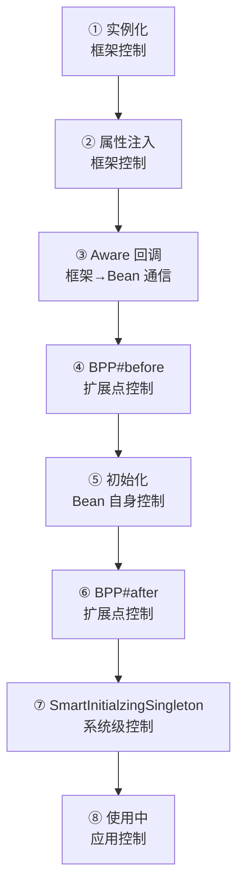
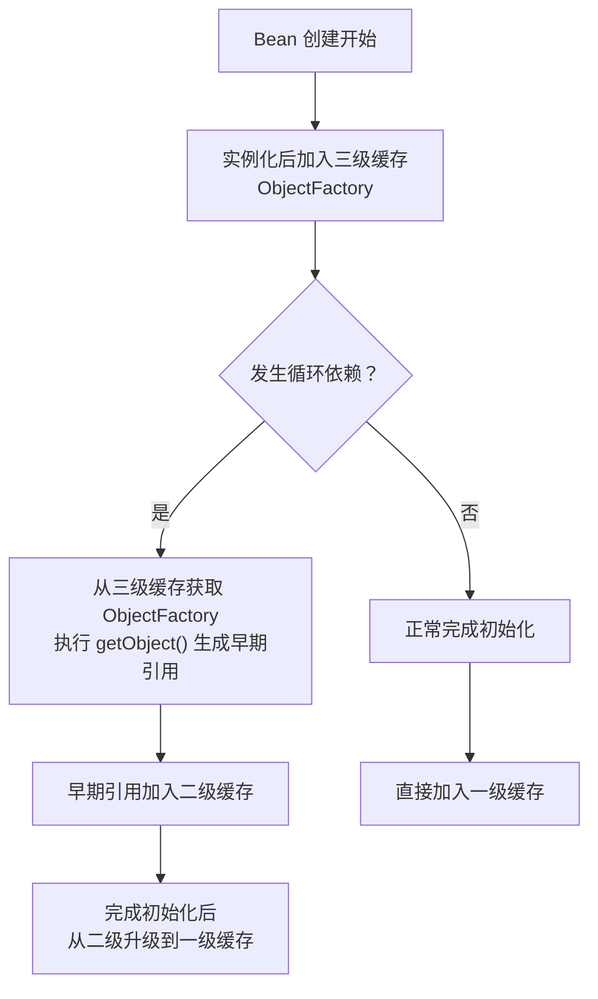

# Bean 生命周期与循环依赖的设计哲学

> **一句话设计哲学**：Spring 通过 **"分层控制 + 延迟决策"** 的架构设计，在保证功能完整性的同时，实现了对象管理的**性能优化与可扩展性**的完美平衡。

> 📖 **边界声明**：本文聚焦"**Spring Bean 生命周期和循环依赖解决方案的设计动机与架构原理**"，以下主题请见对应专题：
>
> - Bean 生命周期的完整技术细节与源码实现 → [Bean生命周期与循环依赖](@spring-核心基础-Bean生命周期与循环依赖)
> - Spring 容器启动流程与扩展点机制 → [Spring扩展点详解](@spring-核心基础-Spring扩展点详解)
> - IoC 与 DI 的技术原理 → [IoC与DI](@spring-核心基础-IoC与DI)

---

## 1. 设计背景：为什么需要 Bean 生命周期管理？

### 1.1 传统对象管理的痛点

在 Spring 出现之前，Java 应用的对象管理存在以下问题：

```java
// 传统方式：手动管理对象生命周期
public class OrderService {
    private UserService userService;
    
    public OrderService() {
        this.userService = new UserService(); // 硬编码依赖
    }
    
    public void init() {
        // 手动初始化逻辑
        userService.init();
    }
    
    public void destroy() {
        // 手动清理逻辑
        userService.close();
    }
}
```

**问题分析**：

- **依赖硬编码**：对象间耦合度高，难以测试和替换
- **生命周期分散**：初始化、销毁逻辑分散在各处，难以统一管理
- **配置复杂**：每个对象都需要手动配置，代码重复度高
- **扩展困难**：难以实现 AOP、事务等横切关注点

### 1.2 Spring 的设计目标

Spring 的设计目标是为企业级应用提供**标准化的对象管理框架**：

**核心设计原则**（每条原则 Spring 都有对应的兑现机制，不是空口号）：

1. **控制反转（IoC）**：将对象创建的控制权从应用代码转移到框架（→ 兑现机制：`ApplicationContext` / `DefaultListableBeanFactory` 容器持有所有 Bean 的生杀大权）
2. **依赖注入（DI）**：通过配置声明依赖关系，而非硬编码（→ 兑现机制：`@Autowired` 注解 + `AutowiredAnnotationBeanPostProcessor` 反射填充字段）
3. **生命周期管理**：提供统一的对象创建、初始化、销毁流程（→ 兑现机制：`AbstractAutowireCapableBeanFactory#doCreateBean` 编排的 8 步标准流程）
4. **可扩展性**：支持自定义扩展点，满足不同业务需求（→ 兑现机制：`BeanPostProcessor` / `BeanFactoryPostProcessor` 链，框架自身能力也走这条赛道，见 §2.2）

---

## 2. Bean 生命周期的架构设计

### 2.1 为什么是 8 步生命周期？

Spring 的 8 步生命周期设计体现了**"分层控制，责任分离"**的架构思想：



**设计哲学解析**：

#### 分层控制架构

| 控制层级 | 生命周期步骤 | 具体做的事（可观测动作） | 设计意图 |
| :-- | :-- | :-- | :-- |
| **框架层** | ①~③ | 反射 `Constructor#newInstance()` 创建对象 → `@Autowired` / `@Value` 字段填充（产品视角当作框架原生能力；技术上由扩展层的 `AutowiredAnnotationBeanPostProcessor` 兑现，详见 §2.2）→ 回调 `BeanNameAware` / `BeanFactoryAware` / `BeanClassLoaderAware` 三个核心 Aware | 提供标准化基础设施 |
| **扩展层** | ④~⑥ | BPP 链 `postProcessBeforeInitialization`（`CommonAnnotationBeanPostProcessor` 在此回调 `@PostConstruct`）→ `InitializingBean#afterPropertiesSet` / `init-method` → BPP 链 `postProcessAfterInitialization`（AOP 代理在此包装） | 支持框架功能扩展 |
| **系统层** | ⑦ | `SmartInitializingSingleton#afterSingletonsInstantiated` 回调——所有单例 Bean 都就位后才触发，用于全局协调（如 `@EventListener` 批量注册） | 处理系统级依赖关系 |
| **应用层** | ⑧ | 业务方法被调用（如 `userService.createOrder(...)`） | 开发者专注业务逻辑 |

#### 责任分离的好处

1. **框架稳定性**：基础流程由框架保证，不会因业务代码变化而破坏
2. **扩展灵活性**：通过扩展点支持各种定制需求
3. **职责清晰**：每个层级只关注自己的职责范围
4. **可测试性**：可以单独测试每个扩展点的功能

### 2.2 扩展点机制的设计智慧

Spring 通过 `BeanPostProcessor`（后文简称 **BPP**）这个"统一扩展点"，实现了**"框架提供骨架，业务填充血肉"**的设计：

```java
// 框架提供的扩展点接口
public interface BeanPostProcessor {
    // 初始化前回调
    Object postProcessBeforeInitialization(Object bean, String beanName);
    // 初始化后回调
    Object postProcessAfterInitialization(Object bean, String beanName);
}
```

#### 产品视角：Spring "默认就能用" 的能力，全部是通过 BPP 兑现的

> **关键认知**：Spring 自己的"开箱即用"功能（你每天在用的 `@Autowired`、`@Transactional`、`@Async`、AOP……）**不是硬编码在容器里**，而是 Spring 以**开发者身份**预置了一批 BPP 实现。**框架自身和你写的扩展走的是同一条赛道**——这才是"扩展点"最深层的含义。

以下是 Spring / Spring Boot **默认启用**的 BPP 清单，按"解决了什么业务痛点"分类组织。这张表也是你日常开发中"为什么加个注解就能生效"的根源：

##### ① 注解驱动开发：让开发者从 XML 解放

| 你在代码里写的 | 背后兜底的 BPP | 做了什么 | 解决的业务痛点 |
| :-- | :-- | :-- | :-- |
| `@Autowired` `@Value` `@Inject` | `AutowiredAnnotationBeanPostProcessor` | 扫描字段/构造器/Setter，按类型从容器找依赖注入 | 不用再写 XML `<property ref="">` |
| `@Resource` `@PostConstruct` `@PreDestroy` | `CommonAnnotationBeanPostProcessor` | 处理 JSR-250 标准注解 | 兼容 JavaEE 标准 + 提供生命周期钩子 |
| `@PersistenceContext` `@PersistenceUnit` | `PersistenceAnnotationBeanPostProcessor` | 注入 JPA 的 `EntityManager` | 不用手写 JPA 样板代码 |

> 📎 `@EventListener` 也是注解驱动的典型能力，但它走的不是 BPP 赛道，见下文 ⑤ 小节的旁注。

##### ② 横切关注点：让业务代码保持"纯净"

| 你在代码里写的 | 背后兜底的 BPP | 做了什么 | 解决的业务痛点 |
| :-- | :-- | :-- | :-- |
| `@Aspect` `@Before` `@Around` 等 | `AnnotationAwareAspectJAutoProxyCreator` | 扫描切面，把目标 Bean 替换为 JDK/CGLIB 代理 | 日志、监控、鉴权不再污染业务代码 |
| `@Transactional` | `InfrastructureAdvisorAutoProxyCreator` + 事务 `Advisor` | 为带注解的方法创建事务代理 | 事务管理从模板代码（`try/commit/rollback`）降级为一个注解 |
| `@Cacheable` `@CachePut` `@CacheEvict` | 同上家族 + 缓存 `Advisor` | 为方法加缓存代理 | 缓存读写从"手写 if-else"降级为一个注解 |
| `@Async` | `AsyncAnnotationBeanPostProcessor` | 把目标方法包装成线程池异步执行 | 异步化从"new Thread / 自建线程池"降级为一个注解 |
| `@Scheduled` | `ScheduledAnnotationBeanPostProcessor` | 把方法注册到 `TaskScheduler` | 定时任务从 `Quartz` 配置降级为一个注解 |
| `@Validated`（方法级） | `MethodValidationPostProcessor` | 方法入参校验代理 | 参数校验从手写 `if` 降级为注解 |

##### ③ 上下文感知：让 Bean 能"看见"它所处的容器

| 你实现的接口 | 背后兜底的 BPP | 注入了什么 | 解决的业务痛点 |
| :-- | :-- | :-- | :-- |
| `ApplicationContextAware` `EnvironmentAware` `ResourceLoaderAware` 等 | `ApplicationContextAwareProcessor` | 把容器、环境、资源加载器塞给 Bean | 让 Bean 在需要时能"找到"容器（如动态查 Bean、读配置） |
| `ServletContextAware` `ServletConfigAware` | `ServletContextAwareProcessor`（仅 Web 环境） | 把 Servlet 上下文塞给 Bean | Web 场景下不用硬找 `ServletContext` |
| `ImportAware` | `ImportAwareBeanPostProcessor` | 告诉 `@Configuration` 类"是谁通过 `@Import` 引入了我" | Spring Boot 的很多 `@Enable*` 注解靠它传参 |

##### ④ 配置与资源绑定：让 `application.yml` 自动映射到 Bean

| 你在代码里写的 | 背后兜底的 BPP | 做了什么 | 解决的业务痛点 |
| :-- | :-- | :-- | :-- |
| `@ConfigurationProperties(prefix="xxx")` | `ConfigurationPropertiesBindingPostProcessor`（Boot 专属） | 把配置文件 key 绑定到 Bean 字段 | 不用再写 `@Value` 逐个注入 |
| 实现 `WebServerFactoryCustomizer` | `WebServerFactoryCustomizerBeanPostProcessor`（Boot 专属） | 在 Web 服务器启动前调用所有 Customizer | 定制内嵌 Tomcat/Undertow 降级为"写一个 Bean" |
| `schema.sql` / `data.sql` | `DataSourceInitializerPostProcessor`（Boot 2.4 及以前）→ `DataSourceScriptDatabaseInitializer`（Boot 2.5+，**走 `InitializingBean` 非 BPP**） | `DataSource` 初始化后自动执行 SQL | 启动即准备好数据库 |

##### ⑤ 生命周期与事件集成：让 Bean 自动接入容器"广播网"

| 场景 | 背后兜底的处理器 | 做了什么 | 归属的扩展赛道 |
| :-- | :-- | :-- | :-- |
| Bean 实现了 `ApplicationListener` | `ApplicationListenerDetector` | 实例化后自动注册到事件广播器，不用手工 `addApplicationListener` | ✅ BPP（`MergedBeanDefinitionPostProcessor`） |
| JSR-303 Bean Validation 集成 | `BeanValidationPostProcessor` | 初始化后对 Bean 属性做 `@NotNull` `@Min` 等校验 | ✅ BPP |
| `@EventListener` 方法扫描 | `EventListenerMethodProcessor` | 在"所有单例就位"后回调，扫描方法并注册为监听器 | ⚠️ **非 BPP**，走 `SmartInitializingSingleton`（对应 §2.1 第 ⑦ 步"系统层"） |

!!! note "旁注：`@EventListener` 走的是另一条'Spring 官方扩展'赛道"
    严格来说 `EventListenerMethodProcessor` 实现的是 `SmartInitializingSingleton` 而非 `BeanPostProcessor`——它等**所有单例都实例化完**才启动扫描，更适合"需要看到完整 Bean 全景"的增强任务。这**反而佐证了本节的核心立论**："Spring 自身能力都走官方扩展点"——只不过用了另一条赛道，和 BPP 并列构成 Spring 的扩展点矩阵。

#### 这张清单背后的产品逻辑

把上面五类能力串起来看，会发现 Spring 的产品策略非常一致：

| 开发者痛点 | 传统做法 | Spring 的"一键兑现" | 内部实现 |
| :-- | :-- | :-- | :-- |
| 装配依赖 | 手写 `new` + XML ref | 加 `@Autowired` | BPP |
| 事务管理 | `try/commit/rollback` 模板 | 加 `@Transactional` | BPP（AOP 代理） |
| 异步调用 | 自建线程池 + `Future` | 加 `@Async` | BPP（AOP 代理） |
| 定时任务 | 引 Quartz + XML | 加 `@Scheduled` | BPP |
| 配置映射 | 逐个读取 `Properties` | 加 `@ConfigurationProperties` | BPP |
| 事件广播 | 自建观察者 | 加 `@EventListener` | BPP |

**产品洞察**：

- **注解是承诺，BPP 是兑现**：Spring 对开发者的承诺（"加个注解就能工作"）100% 由 BPP 兜底。没有 BPP，所有这些注解都只是"被 JVM 忽略的元数据"
- **框架自身不享有特权**：Spring 把"实现 `@Autowired`"和"你实现自定义注解"放在**同一条赛道**上——你完全可以照搬 `AutowiredAnnotationBeanPostProcessor` 的模式写自己的 BPP，实现任何注解驱动的能力
- **"移除一个能力" = "不注册对应的 BPP"**：这让 Spring 具有极强的可裁剪性。`@EnableAsync` / `@EnableTransactionManagement` / `@EnableCaching` 这类开关注解的本质就是**"控制要不要注册 `AsyncAnnotationBeanPostProcessor` / 事务代理创建器 / 缓存代理创建器"**——能力按需上下架，零成本裁剪

!!! tip "这也是 Spring Boot 'Starter' 能成立的根本原因"
    你引入 `spring-boot-starter-data-jpa`，其实引入的是一堆"自动注册的 BPP"（JPA 注解处理器、事务代理创建器、连接池初始化器等）。Starter 的本质 = **一组打包好的 BPP + 它们的触发条件**。理解了 BPP，就理解了 Spring Boot 生态"开箱即用"的底层机制。

#### 设计优势回顾

- **非侵入式**：Bean 本身不需要实现特定接口，一个 POJO 就能被增强
- **可组合**：多个 BPP 按 `Ordered` 排序依次生效，彼此独立可叠加
- **能力同构**：框架内置能力与用户扩展能力使用**同一套机制**，天然支持无限扩展
- **按需启用**：通过 `@EnableTransactionManagement` / `@EnableAsync` 这类开关注解，按需注册对应 BPP，零成本裁剪

> 📖 BPP 的完整接口族、执行顺序、源码实现细节详见 [Bean生命周期与循环依赖](@spring-核心基础-Bean生命周期与循环依赖) 与 [Spring扩展点详解](@spring-核心基础-Spring扩展点详解)，本文从产品视角展开，不重复源码层解析。

---

## 3. 循环依赖解决方案的架构创新

### 3.1 为什么会出现循环依赖？——从开发者视角看 Spring 的折中哲学

#### 开发者视角：循环依赖是"写着写着就出现了"

在真实的企业项目中，几乎没有人会"**故意设计**"循环依赖。它通常是这样悄悄冒出来的：

```java
// 📅 项目初期：两个独立的业务服务，依赖图无环
@Service
public class OrderService {
    @Autowired private OrderRepository orderRepo;
    public void createOrder(Order o) { orderRepo.save(o); }
}

@Service
public class UserService {
    @Autowired private UserRepository userRepo;
    public User getUser(Long id) { return userRepo.findById(id); }
}

// 📅 一个月后：产品提需求——"下订单时要同步更新用户积分"
@Service
public class OrderService {
    @Autowired private OrderRepository orderRepo;
    @Autowired private UserService userService;   // ← 新增依赖，此时还没环
    public void createOrder(Order o) {
        orderRepo.save(o);
        userService.addPoints(o.getUserId(), o.getAmount());
    }
}

// 📅 又一个月后：产品提需求——"查询用户详情要带最近订单"
@Service
public class UserService {
    @Autowired private UserRepository userRepo;
    @Autowired private OrderService orderService;   // ← 这一行悄悄让环闭合了
    public UserDetail getUserDetail(Long id) {
        User u = userRepo.findById(id);
        List<Order> recent = orderService.findRecentByUser(id);
        return UserDetail.of(u, recent);
    }
}
// 💥 环已形成：OrderService ⇄ UserService
// ⚠️ 但开发者可能根本没意识到——单次 PR 的 Git diff 只显示"新增一行 @Autowired"，
//    看不到"整张依赖图的拓扑结构发生了质变"
```

**关键洞察**：循环依赖**不是设计阶段的产物，而是业务演进的副产物**。它出现的根源完全是"工程现实"而非"开发者水平"：

1. **业务边界随需求动态调整**：产品需求把原本独立的服务织到了一起，这是需求演进的必然
2. **Code Review 难以察觉**：单次 PR 只能看到"增加一条依赖"，看不到"整张依赖图拓扑变化"
3. **IDE 与编译器无警告**：Java 类型系统不理解 Spring 的 DI 关系，环对编译器完全隐身
4. **直到启动才暴露**：Spring Boot 2.5 及以前靠 Framework 核心默认值 `allowCircularReferences=true` 静默兜底让它潜伏，Spring Boot 2.6+ / 3.x 才在启动期直接暴露（`spring.main.allow-circular-references` 这个配置项本身就是 Boot 2.6 才引入的）

#### 开发者痛点画像：Spring 必须兼容的三类真实场景

Spring 的设计必须兼容**现实中完全不同的开发水平与项目状态**——这才是三级缓存存在的根本动机。下表是 Spring 面对的真实用户群体：

| 开发者画像 | 项目状态 | 遇到循环依赖时的真实反应 | 对 Spring 的诉求 |
| :-- | :-- | :-- | :-- |
| **初级开发者**（入行 1~2 年） | 小型业务系统 / 学习项目 | "啥叫循环依赖？我不过是写了两个 `@Autowired` 啊……" | 要么**自动解掉**让 TA 先跑起来，要么**给清晰报错信息**指引修复方向 |
| **中级开发者**（3~5 年） | 快速迭代的业务中台 | "我知道该重构，但这周要上线 3 个需求、下周要复盘，真没排期" | 提供 `@Lazy` 这类**小创口手段**；在默认配置下**兜底**让交付不中断 |
| **高级开发者 / 架构师**（5 年+） | 十万行级遗留系统 / 多团队协作 | "这个环已经存在 3 年了，拆它需要协调 5 个团队、动 80 个类" | 允许通过**配置开关兜底**，把重构作为长期演进，而不是阻塞启动的硬门槛 |

**三类画像的共同点**：都**不希望**"有环就立刻启动失败"——那样会把**架构债务的账单**（往往是团队级、甚至组织级的问题）**全部压给当前这次提交的开发者**，既不公平，也不现实。Spring 必须为所有这些场景提供解法。

#### Spring 的折中哲学：不禁止、不放任、引导演进

面对上述现实，Spring 在"纯粹主义"和"放任主义"之间走了一条**中间路线**——这也是整个三级缓存设计的**产品定位**：

| 设计立场 | 具体做法 | 代价 | Spring 的态度 |
| :-- | :-- | :-- | :-- |
| ❌ **纯粹主义** | 有环就启动失败，强制开发者重构 | 把架构债务的账单塞给当前 PR，交付中断；遗留系统升级 Spring 版本极其困难 | 拒绝——会把 Spring 挤出企业市场 |
| ❌ **放任主义** | 完全不管，运行时 NPE 开发者自己处理 | 问题晚暴露，排查成本极高；开发者甚至不知道项目存在环 | 拒绝——违背框架"让开发变简单"的承诺 |
| ✅ **Spring 的折中** | **能自动解的尽量解**（单例 + 字段 / Setter 注入）<br>**能警告的警告**（Spring 6 默认失败 + `@Lazy` 引导）<br>**能给逃生通道的给通道**（`allow-circular-references` 开关） | 框架实现复杂度上升（三级缓存、`ObjectFactory`、早期引用……） | ✅ 承担复杂度，把**选择权**还给开发者，允许按团队节奏演进 |

**这才是三级缓存真正的设计动机**——它不是为了炫技，而是为了**让不同水平、不同状态的项目都能先在 Spring 上跑起来**，然后通过版本演进（Spring 5 默认兜底 → Spring 6 默认失败）**温和引导**开发者走向更健康的架构。

!!! tip "折中不是妥协，是产品智慧"
    一个框架如果只服务"理想开发者"和"绿地项目"，它的生态永远长不大。Spring 之所以能成为企业级 Java 的事实标准，**兼容现实**的折中设计功不可没：它**不惩罚**身处遗留系统的开发者，也**不纵容**架构腐化——通过默认值的演进（5.x 默认兜底、6.x 默认失败），让框架**随生态一起成长**。三级缓存每一层的存在，都可以反推回"为了让某一类真实场景能跑起来"。

#### 折中方案的精确边界：哪些能解、哪些不能

Spring 的"默认兜底"并非万能，它的边界就是**当前设计能优雅覆盖的那一小块**。理解这张表，就理解了 Spring 折中哲学的**精确半径**：

| 场景 | Spring 默认能解吗？ | 根本原因 | 开发者该怎么办 |
| :-- | :-- | :-- | :-- |
| **Setter / 字段注入 + 单例** | ✅ 能（三级缓存兜底） | 实例化与属性注入解耦——Bean 先 `new` 出半成品，再慢慢填字段，可把"半成品引用"暴露给环上另一方 | 可依赖兜底，但长期应重构消除环 |
| **构造器注入 + 单例** | ❌ 不能 | 构造器参数必须在 `new` 时就备好，双方都卡在"还没 `new` 出来"的阶段，没有半成品可暴露 | 强制重构，或把其中一方改为字段注入 + `@Lazy` |
| **Prototype 作用域 Bean 循环** | ❌ 不能 | Prototype 不走单例缓存体系，每次 `getBean` 都新建，无法提前暴露早期引用 | 改单例；或用 `ObjectProvider` / `@Lookup` 延迟获取 |
| **`@Async` / `@Transactional` 代理 + 循环** | ⚠️ Spring 5 能，Spring 6 默认失败 | 代理包装时机与三级缓存 `getEarlyBeanReference` 的时序冲突 | 用 `@Lazy` 或重构，不推荐打开兜底开关 |
| **`@Lazy` 标注其一** | ✅ 能 | 被 `@Lazy` 方注入的是代理，真正调用方法时才解析真身，从"注入时刻"绕开环 | 应急场景可用，不建议作为长期架构 |

**边界表的另一面——Spring 引导开发者走的"三层阶梯"**：

1. **底线（保命）**：默认兜底 + 配置开关，确保遗留系统能跑、能升级
2. **中线（修补）**：`@Lazy` 做小创口手术，最小改动解环（见 §5.2）
3. **高线（根治）**：接口分离 + 事件解耦，从架构层消除环（见 §5.3）

这三层是**可选的演进路径**而非"必须全部做到"——初级团队从底线起步就好，成熟团队向高线迈进，**Spring 不逼任何人跳级**。

#### 补充：图论视角的技术本质

从计算机科学视角，循环依赖的本质就是：

```txt
依赖图：OrderService ──▶ UserService
             ▲                │
             └────────────────┘
图论定义：有向图存在强连通分量（SCC），无法进行拓扑排序
```

无环依赖图可以通过**拓扑排序**唯一确定创建顺序（先创建被依赖方、再创建依赖方）；有环时每个顶点都在"等待对方先完成"，形成死锁。Spring 三级缓存的技术本质，是**给环上节点发放一张"半成品临时通行证"**，让拓扑排序算法在存在环的情况下仍能推进——但代价是"半成品"必须是**线程可见的对象引用**（所以构造器注入无解、Prototype 无解）。

> 📌 如果你更想从源码链路理解三级缓存的实现（`singletonObjects` / `earlySingletonObjects` / `singletonFactories` 如何配合），详见 [Bean生命周期与循环依赖](@spring-核心基础-Bean生命周期与循环依赖)；本文继续从产品视角展开。

### 3.2 三级缓存架构的设计突破

Spring 的三级缓存设计体现了**"空间换时间 + 延迟决策"**的优化思想：

#### 三级缓存的数据结构

```java
// Spring 源码中的三级缓存（简化版）
public class DefaultSingletonBeanRegistry {
    // 一级缓存：完整 Bean
    private final Map<String, Object> singletonObjects = new ConcurrentHashMap<>();
    
    // 二级缓存：早期暴露的 Bean（解决循环依赖）
    private final Map<String, Object> earlySingletonObjects = new ConcurrentHashMap<>();
    
    // 三级缓存：ObjectFactory（延迟生成代理）
    private final Map<String, ObjectFactory<?>> singletonFactories = new HashMap<>();
}
```

#### 缓存升级流程



#### 为什么是三级缓存而非二级？

这是三级缓存最该追问的一句——如果只保留二级缓存（一级完整 Bean + 二级早期引用），**Spring 会直接丢失一个关键能力：循环依赖 Bean 也能被 AOP 代理**。

**两级缓存方案的两难困境**：

| 二级缓存的填法 | 能解普通循环依赖？ | 能支持循环依赖 + AOP 代理？ | 代理成本 |
| :-- | :-- | :-- | :-- |
| 放"未初始化完的裸对象" | ✅ | ❌ 环上另一方拿到的是**裸对象**，事务/切面全失效 | 无 |
| 放"提前创建好的代理对象" | ✅ | ✅ | ❌ **每个 Bean** 都要预付代理创建成本——绝大多数不发生循环依赖的 Bean 也被迫支付 |

**三级缓存的破局**：第三级存 `ObjectFactory`（一个"**延迟生成器**"），它只是一个 lambda，放进 Map 几乎零成本。只有**真的发生循环依赖、真的被环上另一方引用时**，才触发 `getObject()` 调用 `SmartInstantiationAwareBeanPostProcessor#getEarlyBeanReference`——**此刻才判断需不需要代理**，并决定返回裸对象还是代理。

**结论**：三级缓存 = **用一层空间（ObjectFactory）换"按需支付代理成本"的能力**，既解了循环依赖、又保住了 AOP 代理、还避免了所有 Bean 预付代理成本。这是典型的"空间换性能 + 延迟决策"组合拳。

### 3.3 ObjectFactory 的延迟决策智慧

**核心创新**：通过 `ObjectFactory` 把"是否代理 / 何时代理"的决策**推迟到被需要的那一刻**：

```java
// Spring 的做法：放一个 lambda 进三级缓存，不做任何判断
ObjectFactory<?> factory = () -> {
    // 只有被环上另一方提前引用时，这里才会被执行
    // getEarlyBeanReference 内部会让 AbstractAutoProxyCreator 决定是否返回代理
    return getEarlyBeanReference(beanName, mbd, bean);
};
singletonFactories.put(beanName, factory);
```

**两条真实执行路径**：

| 路径 | 触发条件 | `ObjectFactory#getObject()` 是否被调用 | 代理生成时机 | 最终进入哪一级缓存 |
| :-- | :-- | :-- | :-- | :-- |
| **常规路径** | Bean 创建期间无人提前引用它 | ❌ 从未调用 | 初始化完成后（`postProcessAfterInitialization`）一次性包装 | 直接进一级缓存 |
| **循环依赖路径** | 环上另一方在它完成初始化前来取它 | ✅ 被触发 | **提前**通过 `getEarlyBeanReference` 生成代理 | 先进二级缓存 → 本体初始化完成后升级到一级 |

**设计收益**：

- **常规路径零额外开销**：`ObjectFactory` 只是一个 lambda，若未被取出就随 Bean 完成生命周期一并丢弃
- **循环依赖路径按需付费**：真发生循环引用时才走 `getEarlyBeanReference`——这也正是 `SmartInstantiationAwareBeanPostProcessor` 这个子接口存在的原因：它专门为"早期引用"这个时机暴露钩子
- **与 AOP 的优雅协作**：`AbstractAutoProxyCreator` 同时实现了 `getEarlyBeanReference`（循环路径）和 `postProcessAfterInitialization`（常规路径），两条路径通过 `earlyProxyReferences` 去重，确保**同一个 Bean 只被代理一次**

### 3.4 Spring 6 的设计演进：从"容错"到"严谨"

**版本演进背后的架构思考**：

| 版本 | 设计哲学 | 默认行为（可观测变化） | 适用场景 |
| :-- | :-- | :-- | :-- |
| **Spring 5 / Boot 2.5 及以前** | 容错性优先 | **没有 `spring.main.allow-circular-references` 这个配置项**（Boot 2.6 才引入）；Framework 核心 `AbstractAutowireCapableBeanFactory.allowCircularReferences` 默认 `true`，循环依赖自动走三级缓存兜底 | 遗留系统迁移 |
| **Spring 6 / Boot 2.6+ / Boot 3.x** | 严谨性优先 | Boot 新增 `spring.main.allow-circular-references`，**默认 `false`**，`SpringApplication` 在启动时反向覆写 Framework 默认值为 `false`，启动期直接失败 | 新项目、云原生 |

**Spring 6 启动失败时的典型异常**（升级后读者最可能在控制台看到的真实信息）：

```txt
***************************
APPLICATION FAILED TO START
***************************

Description:

The dependencies of some of the beans in the application context form a cycle:

┌─────┐
|  orderService defined in file [...OrderService.class]
↑     ↓
|  userService defined in file [...UserService.class]
└─────┘

Action:

Relying upon circular references is discouraged and they are prohibited by default.
Update your application to remove the dependency cycle between beans.
As a last resort, it may be possible to break the cycle automatically by setting
spring.main.allow-circular-references to true.
```

**从 Boot 2.6+ 升级遇到这个错误时的三种修复手段**（按推荐度排序）：

| 手段 | 操作 | 推荐度 | 代价 |
| :-- | :-- | :-- | :-- |
| **① 重构依赖** | 抽公共接口 / 发事件 / 拆服务，消除环（见 §5.3） | ⭐⭐⭐⭐⭐ | 一次性改造，长期收益 |
| **② 加 `@Lazy`** | 在环上一方的注入点加 `@Lazy`（见 §5.2） | ⭐⭐⭐ | 改动小，但掩盖了架构问题 |
| **③ 打开兜底开关**（逃生舱） | `spring.main.allow-circular-references=true` | ⭐ | 0 成本，但回到 Spring 5 兜底模式，违背 Spring 6 设计导向 |

**技术依据**：

- **构造器注入**：Spring 官方首推——循环依赖在容器启动期（`BeanCurrentlyInCreationException`）即刻暴露，而非运行到生产后才 NPE
- **架构健康度**：循环依赖通常是设计边界不清的信号，Spring 6 把它从"可关闭的警告"升级为"强制暴露"
- **云原生友好**：Kubernetes 滚动更新、Serverless 冷启动要求启动快且可预测，兜底机制引入的不确定性成本变高

---

## 4. 架构设计的权衡与决策

### 4.1 性能 vs 功能的权衡

Spring 在循环依赖解决方案中体现了精妙的权衡：

**权衡矩阵**（二级缓存拆成两种填法，才能看清"为什么非得上三级"）：

| 设计方案 | 性能开销 | 功能完整性 | 实现复杂度 |
| :-- | :-- | :-- | :-- |
| **禁止循环依赖** | ✅ 最优 | ❌ 功能受限 | ✅ 简单 |
| **二级缓存（放裸对象）** | ✅ 低 | ❌ 环上另一方拿到裸对象，AOP / `@Transactional` 失效 | ⚠️ 中等 |
| **二级缓存（放预创建代理）** | ❌ 高（所有 Bean 预付代理成本） | ✅ 完整 | ⚠️ 中等 |
| **三级缓存（`ObjectFactory` 延迟决策）** | ✅ 按需付费 | ✅ 完整 | ❌ 复杂 |

**Spring 的选择**：接受**实现复杂度**的代价，换取**性能优化**和**功能完整性**的最佳平衡。

### 4.2 扩展性 vs 稳定性的权衡

乍看 `BeanPostProcessor` 只暴露两个方法（`postProcessBeforeInitialization` / `postProcessAfterInitialization`），非常"精简"。但深入源码会发现，Spring 其实按**"时机精细度"** 把 BPP 分成了一个**分层暴露的家族**：

```java
// 根接口：最常用的两个时机（初始化前后），覆盖约 80% 的扩展场景
public interface BeanPostProcessor {
    Object postProcessBeforeInitialization(Object bean, String beanName);
    Object postProcessAfterInitialization(Object bean, String beanName);
}

// 子接口：需要更细时机时，按需继承更精细的契约
public interface InstantiationAwareBeanPostProcessor extends BeanPostProcessor {
    Object postProcessBeforeInstantiation(Class<?> beanClass, String beanName);
    boolean postProcessAfterInstantiation(Object bean, String beanName);
    PropertyValues postProcessProperties(PropertyValues pvs, Object bean, String beanName);
}

public interface SmartInstantiationAwareBeanPostProcessor
        extends InstantiationAwareBeanPostProcessor {
    Object getEarlyBeanReference(Object bean, String beanName);   // 循环依赖早期引用
    Constructor<?>[] determineCandidateConstructors(Class<?> beanClass, String beanName);
}
```

**Spring BPP 家族实际暴露的全部时机清单**：

| 子接口 | 暴露的新时机 | 谁在用 |
| :-- | :-- | :-- |
| `BeanPostProcessor`（根） | 初始化前 + 初始化后 | `ApplicationContextAwareProcessor` 等通用增强 |
| `InstantiationAwareBeanPostProcessor` | 实例化前 + 实例化后 + 属性注入 | AOP 代理创建的入口 |
| `SmartInstantiationAwareBeanPostProcessor` | 早期引用生成 + 候选构造器选择 | 循环依赖解析、`@Autowired` 构造器推断 |
| `MergedBeanDefinitionPostProcessor` | BeanDefinition 合并后 | 注解元数据提前缓存（如 `AutowiredAnnotationBeanPostProcessor`） |
| `DestructionAwareBeanPostProcessor` | 销毁前 | `@PreDestroy` 处理 |

**设计智慧：不是"只给 2 个钩子"，而是"分层揭露"**——

- **入门姿势只看到 2 个方法**：90% 的用户扩展（日志 BPP、监控 BPP）只需实现根接口，心智负担极低
- **需要精细时机的高阶场景按需继承**：AOP、循环依赖、注解元数据缓存这些"框架级能力"按需实现子接口，不污染简单场景
- **扩展点总数有上限**：Spring 精心设计了 5 个子接口 + 根接口覆盖 Bean 全部生命周期时机——**既不过度扩展**（导致框架复杂度失控），**也不欠扩展**（导致能力天花板过低）

---

## 5. 从设计哲学看最佳实践

### 5.1 构造器注入：启动期强制暴露依赖问题

**设计依据**：循环依赖从"运行时偶发"升级为"启动期必然失败"

```java
// 推荐：构造器注入（循环依赖在容器启动期即刻暴露）
@Service
public class OrderService {
    private final UserService userService;

    // ⚠️ Java 编译器看不见 Spring 的依赖关系，不会报编译错误
    // ⭐ 但若 UserService 也通过构造器依赖 OrderService，Spring 容器启动时会抛：
    //    BeanCurrentlyInCreationException:
    //    Requested bean is currently in creation: Is there an unresolvable circular reference?
    // ⭐ Spring 6 默认把这个错误从"可关闭"升级为"强制暴露"，杜绝上线后 NPE
    public OrderService(UserService userService) {
        this.userService = userService;
    }
}
```

**为什么"启动期失败"比"运行时偶发"好**：

- **问题暴露前移**：启动阶段就能发现，CI/CD 流水线即可拦截，不会流到生产环境
- **fail-fast 原则**：依赖图有环是架构级问题，任何兜底都只是推迟暴露时机
- **对比字段注入**：`@Autowired` 字段注入 + 循环依赖，Spring 5 默认兜底"静默通过"，等到某个 Bean 的方法真正被调用时才可能以 NPE 形式爆炸——难以排查

### 5.2 @Lazy 注解：用代理绕开"注入时刻"的环

**设计哲学**：让依赖关系显式化 + 把"依赖解析时机"从"注入时"推到"首次调用时"

```java
// 显式声明延迟依赖
@Service
public class OrderService {
    @Lazy
    @Autowired
    private UserService userService;
    // ⭐ 注入进来的不是真正的 UserService，而是一个**延迟代理**
    //    （接口类型 → JDK 动态代理；类类型 → CGLIB，由 ProxyFactory 按目标类型自动选）
    // Spring 通过 ContextAnnotationAutowireCandidateResolver.buildLazyResolutionProxy()
    // 在注入时就生成一个"空壳代理"塞给字段
    // 代理内部持有 BeanFactory 引用，但不立即查找真 Bean

    public void createOrder() {
        userService.getUser(1L);   // ← 这一刻代理才去容器 getBean("userService") 解析真身
    }
}
```

**为什么能解环**：

- **注入阶段**：`OrderService` 创建时，`UserService` 字段立刻被填一个"空壳代理"——**此刻不查询 UserService 真身**，天然避开了"循环依赖解析死锁"
- **使用阶段**：代理首次被调用时才去容器 `getBean("userService")`——此时容器早已完成启动，`UserService` 已是完整实例，自然能拿到

**权衡**：

- ✅ 最小代码改动解环，适合遗留系统应急
- ❌ 多一层代理，微小性能成本（通常可忽略）
- ❌ 掩盖了"依赖图有环"这个架构信号——长期不推荐依赖它，真正健康的做法见 §5.3

### 5.3 事件驱动解耦：从根源消除环

**设计原则**：把"A 主动调用 B，B 主动调用 A"的双向依赖，改造为"A 发事件，B 订阅事件"的单向广播

#### 循环依赖的典型场景

```java
// ❌ 坏味道：订单服务和用户服务互相调用
@Service
public class OrderService {
    @Autowired private UserService userService;

    public void createOrder(Order order) {
        // ... 创建订单
        userService.addOrderToHistory(order);   // 订单 → 用户
    }
}

@Service
public class UserService {
    @Autowired private OrderService orderService;

    public void refreshUserStats(Long userId) {
        // ... 刷新用户统计
        List<Order> orders = orderService.findByUser(userId);   // 用户 → 订单
    }
}
// 结果：OrderService ⇄ UserService 构成循环依赖
```

#### 用事件解耦后

```java
// ✅ 好姿势：订单服务只发事件，不知道谁会响应
@Service
public class OrderService {
    @Autowired private ApplicationEventPublisher publisher;

    public void createOrder(Order order) {
        // ... 创建订单
        publisher.publishEvent(new OrderCreatedEvent(order));   // 广播，不指名道姓
    }
}

@Service
public class UserService {

    @EventListener
    public void onOrderCreated(OrderCreatedEvent event) {
        // 响应事件，把订单加入用户历史
        // UserService 可以保留对 OrderService 的单向依赖（用于查询），但反向依赖消失了
    }

    public void refreshUserStats(Long userId) {
        // 这里仍可依赖 OrderService
    }
}
// 结果：UserService → OrderService（单向），环被打破
```

#### 为什么这种方案最健康

- **符合 DIP**：高层模块（用户管理）不依赖低层模块（订单创建的实现细节）
- **天然异步友好**：`@EventListener` + `@Async` 即可把强一致依赖改为最终一致，支撑系统扩展
- **可测试性**：测试 `OrderService.createOrder()` 不再需要 `UserService`，只需验证"事件是否被发布"
- **符合微服务演进方向**：单体内的 `ApplicationEventPublisher`，天然可升级为 Kafka / RocketMQ 的跨服务广播

---

## 6. 总结：Spring 的架构设计智慧

### 6.1 核心设计原则

1. **分层控制**：不同层级关注不同职责，降低复杂度
2. **延迟决策**：只有在真正需要时才支付性能代价
3. **扩展点设计**：在关键路径提供可控的扩展能力
4. **显式优于隐式**：让依赖关系和设计意图清晰可见

### 6.2 架构启示

Spring Bean 生命周期和循环依赖的解决方案体现了**优秀框架设计的共同特征**：

- **解决真问题**：基于实际开发中的痛点设计解决方案
- **平衡各种约束**：在性能、功能、复杂度之间找到最佳平衡点
- **支持演进**：设计允许随着技术发展而演进（如 Spring 5→6）
- **引导最佳实践**：通过设计鼓励开发者使用更好的编码模式

**一句话总结**：
> Spring 通过精妙的**分层架构和延迟决策机制**，在对象管理这个基础但复杂的问题上，实现了**功能完整性、性能优化、可扩展性**的三重目标，为企业级应用开发提供了坚实的技术基础。

---

## 7. 延伸阅读

> 📖 技术实现细节详见：[Bean生命周期与循环依赖](@spring-核心基础-Bean生命周期与循环依赖)
>
> 📖 扩展点机制详解：[Spring扩展点详解](@spring-核心基础-Spring扩展点详解)
>
> 📖 实战应用案例：[Spring实战应用题](@spring-测试与实战-Spring实战应用题)
