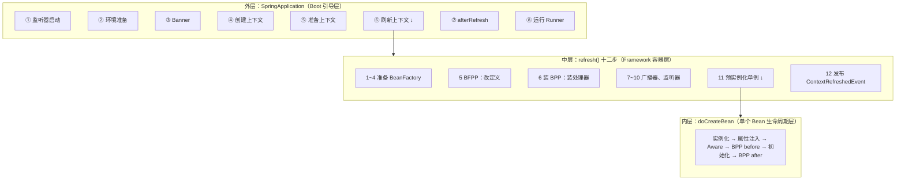
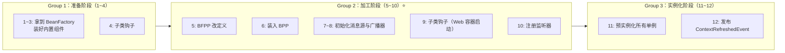
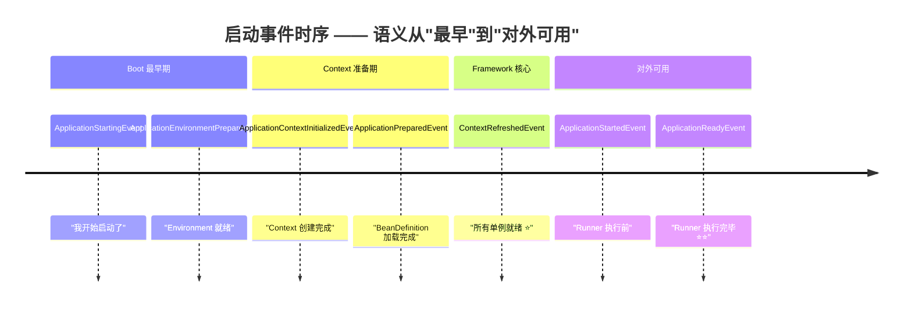
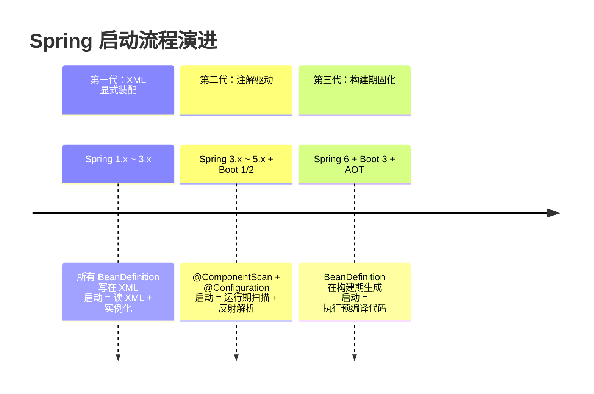

# Spring 容器启动流程的设计哲学

> **一句话设计哲学**：Spring 通过 **"分层引导 + 顺序约束 + 按需扩展"** 的启动设计，把一件极其复杂的事（从一行 `main` 跑到一个能对外服务的容器）拆成**可预测、可扩展、可演进**的标准流程，让不同规模、不同演进阶段的项目都能在同一条启动骨架上跑起来。

> 📖 **边界声明**：本文聚焦"**Spring 容器启动流程的设计动机、架构选择与演进哲学**"，以下主题请见对应专题：
>
> - 启动流程的完整技术时序、十二步 `refresh()` 的源码链路、典型启动异常的源码定位 → [Spring容器启动流程深度解析](@spring-核心基础-Spring容器启动流程深度解析)
> - `BeanFactoryPostProcessor` / `BeanPostProcessor` / `ApplicationContextInitializer` 等扩展点的使用方式与代码示例 → [Spring扩展点详解](@spring-核心基础-Spring扩展点详解)
> - 单个 Bean 的生命周期设计哲学（与本文互为姊妹篇） → [Bean生命周期与循环依赖的设计哲学](@spring-设计哲学-Bean生命周期与循环依赖)
> - 启动性能调优、AOT / Native Image 构建实战 → [启动与并发优化](@spring-进阶与调优-启动与并发优化)

---

## 1. 设计背景：为什么需要"标准化启动流程"？

### 1.1 传统 Java 应用启动的痛点

在 Spring / Spring Boot 出现之前，一个企业级 Java 应用从 `main` 跑起来要干的事，大概长这样：

```java
// 传统方式：把"启动"和"业务装配"搅在一起
public class Application {
    public static void main(String[] args) throws Exception {
        // ① 读配置
        Properties props = new Properties();
        props.load(new FileInputStream("config.properties"));

        // ② 初始化日志
        LogManager.getLogManager().readConfiguration(
            new FileInputStream("logging.properties"));

        // ③ 建数据源（还得处理连接泄漏）
        DataSource ds = new DruidDataSource();
        ((DruidDataSource) ds).setUrl(props.getProperty("db.url"));
        ((DruidDataSource) ds).setUsername(props.getProperty("db.user"));
        ((DruidDataSource) ds).init();

        // ④ 建业务对象（手动组装依赖）
        UserRepository userRepo = new UserRepository(ds);
        OrderRepository orderRepo = new OrderRepository(ds);
        UserService userService = new UserService(userRepo);
        OrderService orderService = new OrderService(orderRepo, userService);

        // ⑤ 启动 Web 容器
        Tomcat tomcat = new Tomcat();
        tomcat.setPort(8080);
        tomcat.addServlet("/", "orderServlet", new OrderServlet(orderService));
        tomcat.start();

        // ⑥ 注册关闭钩子
        Runtime.getRuntime().addShutdownHook(new Thread(() -> {
            tomcat.stop();
            ((DruidDataSource) ds).close();
        }));

        tomcat.getServer().await();
    }
}
```

**问题画像**：

- **顺序错乱易踩坑**：必须日志先于数据源、数据源先于 Service、Service 先于 Servlet——任何一步错位都要调一下午
- **扩展点散落**：想在"数据源建好之后、Servlet 启动之前"插个脚（比如做数据预热），没有统一的插入点
- **生命周期耦合**：启动逻辑和业务逻辑、关闭逻辑混在一起，一旦应用规模增长，`main` 方法会变成几百行的"上帝方法"
- **能力不可复用**：每个项目都要重写一遍"读配置 → 初始化 → 装配 → 启动 Web → 注册钩子"的流程，造轮子成本极高
- **版本迁移无保障**：Tomcat 8 升到 9、Druid 升版本，都需要手工改 `main`，没有框架层的兼容缓冲

### 1.2 Spring 的设计目标：把"启动"做成一个产品

Spring 的核心产品洞察是——**"启动"本身就是一个值得被抽象的横切关注点**。所有企业级应用的启动流程，本质都在做同样几件事：**读环境 → 选容器 → 装配 → 刷新 → 对外可用 → 优雅关闭**。既然如此，就该有一套标准流程承载它。

**核心设计目标**（每条目标都有对应的兑现机制，不是空口号）：

1. **标准化流程**：把启动拆成可预测的固定步骤（→ 兑现机制：`SpringApplication.run()` 的 8 步引导 + `AbstractApplicationContext.refresh()` 的 12 步刷新）
2. **可扩展**：在关键节点预留扩展点，让业务无需改框架就能介入（→ 兑现机制：`ApplicationContextInitializer` / `BeanFactoryPostProcessor` / `BeanPostProcessor` / `SmartLifecycle` 等 9+ 扩展点）
3. **生态兼容**：通过 SPI 机制让第三方库无侵入地挂载到启动流程（→ 兑现机制：`SpringFactoriesLoader` 读 `META-INF/spring.factories` / `.imports`）
4. **可演进**：同一套骨架支持从 XML 时代到注解时代、从 JVM 到 Native Image 的平滑升级（→ 兑现机制：`ApplicationContextFactory` 抽象、AOT 构建期改写、默认值演进策略）

> 📌 这四个目标彼此独立又相互支撑：没有标准化，扩展点没有统一挂点；没有 SPI，生态无法繁荣；没有"骨架 + 演进"，Spring 早该死在 XML 时代。

---

## 2. 启动流程的架构设计：为什么是"三层嵌套"？

### 2.1 从产品视角看启动流程的分层

Spring 的启动流程不是一条扁平的流水线，而是**三层嵌套**的结构。这个分层**不是技术上的偶然**，而是一个深思熟虑的**产品分工**：



**设计哲学解析**：

#### 三层各自的职责边界

| 分层 | 职责范围 | 具体做的事（产品视角） | 谁在用这一层 |
| :-- | :-- | :-- | :-- |
| **外层**（Boot 引导层） | 做"启动一个应用"这件事 | 推断 Web 类型、读配置、选容器、发 Boot 事件、跑 Runner | **Spring Boot** 独有，Framework 用户直接用 `new ClassPathXmlApplicationContext` 时会跳过这层 |
| **中层**（Framework 容器层） | 做"刷新一个 IoC 容器"这件事 | 加载 BeanDefinition、执行 BFPP/BPP、实例化单例、发容器事件 | **Spring Framework 核心**，所有 `ApplicationContext` 实现的共同骨架 |
| **内层**（Bean 生命周期层） | 做"创建一个 Bean"这件事 | 反射实例化、属性注入、Aware 回调、初始化、代理包装 | 每一次 `getBean()` 都会触发 |

> 📖 内层的设计哲学详见姊妹篇 [Bean生命周期与循环依赖的设计哲学](@spring-设计哲学-Bean生命周期与循环依赖)。本文专注外层与中层。

#### 为什么必须分三层？产品洞察

1. **关注点分离**：Boot 的"引导逻辑"（推断 Web 类型、跑 Runner）与 Framework 的"容器刷新"在职责上完全不同，不该混在一起。你可以**单独使用 Framework 层**（`new AnnotationConfigApplicationContext(MyConfig.class)`）而不引入 Boot——这就是分层的直接收益
2. **独立演进**：Spring Framework 6 和 Spring Boot 3 可以**各自独立发布小版本**，因为三层之间只通过稳定契约（`ApplicationContext` / `BeanFactory` 接口）通信
3. **扩展点分层暴露**：不同扩展点挂在不同层，精确匹配业务需求的**精细度**——想介入"启动前做点事"挂外层，想介入"容器刷新时改 BeanDefinition"挂中层，想介入"每个 Bean 初始化时做增强"挂内层
4. **故障隔离**：启动失败时看异常抛在哪一层，立刻就能判断大方向——外层失败多半是 Boot 引导问题（SPI、Environment），中层失败多半是 BeanDefinition 或 BFPP/BPP 问题，内层失败多半是 Bean 自身构造或依赖问题

!!! tip "分层的产品红利：Starter 机制的前提"
    `spring-boot-starter-xxx` 能成立的根本原因，就是三层结构提供了清晰的挂载点：Starter 只需要在"Framework 中层"注册若干 BPP/BFPP/自动配置类，不用也不能去动 Boot 外层。这种"**大家都在同一层玩**"的纪律性，是 Spring 生态能繁荣的工程基础。

### 2.2 八步引导与十二步刷新的设计智慧

#### 为什么引导层是 8 步？

Boot 外层的 8 步设计，对应了"启动一个应用"的**完整产品生命周期**：

| 引导步骤 | 产品视角：这一步解决什么问题 | 设计意图 |
| :-- | :-- | :-- |
| ① 监听器启动 | "让所有关注启动的人提前知道——火车要发车了" | 提供最早的通知通道，DevTools / 监控埋点靠它 |
| ② 环境准备 | "读齐所有配置来源并排好优先级" | 把"命令行 / 环境变量 / 配置文件"的混乱合并成一个有序 `Environment` |
| ③ Banner | "让用户一眼看到'启动了、是哪个版本'" | 研发体感 + 故障定位第一眼信息 |
| ④ 创建上下文 | "根据 classpath 自动选对容器（Servlet / Reactive / None）" | 免配置地适配三类应用形态 |
| ⑤ 准备上下文 | "应用 `Initializer`、注册主配置类——给容器交付一个'准备就绪'的壳" | 为 refresh 提供前置条件 |
| ⑥ **刷新上下文** | **"把壳变成一个活的 IoC 容器"** | **核心步骤，委托给 Framework 层** |
| ⑦ afterRefresh | "refresh 刚完成，在 Runner 跑之前留一个钩子" | 预留给未来扩展（目前默认空实现） |
| ⑧ 运行 Runner + 宣告 Ready | "最后一次业务初始化机会 + 对外宣告'我能干活了'" | 把"容器可用"和"应用可用"分开，提供清晰的就绪信号 |

**设计洞察**：8 步的**第 ⑥ 步是真正干活的**，其他 7 步都是 Boot 为 Framework 容器提供的"引导服务"——相当于把 Framework 的 `refresh()` 包装进一个"有仪式感的流程"中。这和操作系统 `init` 进程启动其他进程的逻辑如出一辙：内核只管"怎么调度进程"，`init` 管"在什么时机启动哪些进程"。

#### 为什么刷新层是 12 步？

`refresh()` 的 12 步是 Spring 整个启动流程的**心脏**。这 12 步表面上是"流水账"，实际上是**三组顺序约束**的具象化：



**三组顺序约束**：

| 顺序约束 | 产品视角：为什么这么排 |
| :-- | :-- |
| **先改定义 → 再装处理器 → 最后实例化** | 想象一条生产线：先改设计图（BFPP）、再上流水线工人（BPP 注册）、最后才开始量产（实例化单例）——任何一步提前都会产出次品 |
| **监听器注册 → 预实例化单例** | 单例创建过程中会发事件（`ContextRefreshedEvent` 除外），监听器必须先就位才能接住 |
| **所有 Bean 就绪 → 发布 ContextRefreshedEvent** | `ContextRefreshedEvent` 是向整个应用宣告"容器 OK"，订阅方必须能访问任何 Bean |

!!! note "'顺序'本身就是一种产品设计"
    很多框架（Guice、Dagger）的装配过程是"**一次性**"的——读完配置直接 `new` 对象、注入依赖，中间没有明显的阶段划分。Spring 偏偏把过程拆成 12 个明确的阶段，每个阶段都有对外的扩展点名字（`BeanFactoryPostProcessor` / `BeanPostProcessor` / `ApplicationListener`）。这是**更贵的设计**（实现复杂度高），但换来了**更强的可编程性**：业务能在 12 个不同阶段精确介入，这是 Spring 生态百花齐放的根本原因。

---

## 3. SPI 与扩展点矩阵：Spring 如何兑现"开箱即用 + 按需扩展"

### 3.1 产品视角：启动期的扩展点才是 Spring 的"第二张赛道"

姊妹篇 [Bean生命周期与循环依赖的设计哲学](@spring-设计哲学-Bean生命周期与循环依赖) §2.2 讲过：Spring 的"开箱即用"能力 100% 由 `BeanPostProcessor` 兜底，框架自身走的是和用户扩展**同一条赛道**。那是 **Bean 生命周期赛道**。

**启动流程有另一条同样重要的赛道：启动期扩展点**。`BeanPostProcessor` 只能介入"单个 Bean 的创建"，而以下场景它完全够不着：

- "我想在 Spring 读配置文件**之前**偷偷塞一个 `PropertySource` 进去"
- "我想在容器开始实例化 Bean **之前**，扫一遍所有的 `BeanDefinition` 把前缀带 `legacy.` 的全改名"
- "我想在容器刷新**最末尾**，检查是否所有必需的配置项都绑定成功了"
- "我的库是第三方 jar，用户没 `@Import` 我的类，但我想在他启动时自动挂上"

这些需求都不属于"单个 Bean 的生命周期"，而属于**"容器启动流程"**——Spring 为此设计了另一套扩展点。

### 3.2 启动期扩展点全景清单

以下是启动流程各个阶段暴露的**全部官方扩展点**，按"介入时机从早到晚"排序。这张表是你理解"Spring 和 Spring Boot 到底能扩展到什么程度"的根本地图：

#### ① 最早期：Boot 引导前/引导中

| 扩展点 | 介入时机 | 能做的事 | 典型使用者 |
| :-- | :-- | :-- | :-- |
| `BootstrapRegistryInitializer`（Boot 2.4+） | `SpringApplication` 构造 | 注册早期基础设施（在 `Environment` 还没建时就能用） | Spring Cloud Config 客户端（要比 Environment 更早拿到配置服务器地址） |
| `SpringApplicationRunListener` | `run()` 第 ① 步 | 贯穿整个 Boot 8 步生命周期的监听器（发事件） | `EventPublishingRunListener` 把 Boot 事件桥接到容器广播器 |
| `EnvironmentPostProcessor` | `run()` 第 ② 步 | 动态调整 Environment / PropertySource | `ConfigDataEnvironmentPostProcessor`（加载 application.yml） |
| `ApplicationContextInitializer` | `run()` 第 ⑤ 步 | 修改 ApplicationContext 配置（添加 PropertySource、切换开关） | `ConfigurationWarningsApplicationContextInitializer` |

#### ② 容器刷新期：refresh() 内部

| 扩展点 | 介入时机 | 能做的事 | 典型使用者 |
| :-- | :-- | :-- | :-- |
| `BeanDefinitionRegistryPostProcessor`（BDRPP） | refresh 第 5 步 | **动态注册新的 BeanDefinition** | `ConfigurationClassPostProcessor`（展开 `@Configuration`）、MyBatis `MapperScannerConfigurer` |
| `BeanFactoryPostProcessor`（BFPP） | refresh 第 5 步 | **修改已有的 BeanDefinition** | `PropertySourcesPlaceholderConfigurer`（占位符替换） |
| `BeanPostProcessor`（BPP） | refresh 第 11 步每个 Bean 创建时 | 干预单个 Bean 的初始化前后 | `AutowiredAnnotationBeanPostProcessor` / AOP 代理创建器 |
| `SmartInitializingSingleton` | refresh 第 11 步末尾 | 所有单例创建完毕后的全局钩子 | `EventListenerMethodProcessor`（扫描并注册 `@EventListener` 方法） |
| `ApplicationListener` / `@EventListener` | refresh 第 12 步发事件时 | 订阅 `ContextRefreshedEvent` 等容器事件 | Spring Cloud 启动钩子、缓存预热逻辑 |
| `SmartLifecycle` | refresh 第 12 步 `finishRefresh` | 启停带生命周期的组件 | MQ 消费者、`TaskScheduler`、定时任务 |

#### ③ 启动完成后：Boot 尾声

| 扩展点 | 介入时机 | 能做的事 | 典型使用者 |
| :-- | :-- | :-- | :-- |
| `ApplicationRunner` / `CommandLineRunner` | `run()` 第 ⑧ 步 | 最后一次启动钩子（抛异常会中断启动，适合"必须成功才能对外服务"的初始化） | 数据预热、灰度开关注册、启动校验 |

### 3.3 这张清单背后的产品逻辑

把三类扩展点串起来看，Spring 的产品策略依然和 Bean 生命周期赛道一致：**框架自身的能力全部走官方扩展点**，不享有特权。

| 能力 | 走的是哪条赛道 | Spring 自身的哪个类在做 |
| :-- | :-- | :-- |
| 加载 `application.yml` | `EnvironmentPostProcessor` | `ConfigDataEnvironmentPostProcessor` |
| 展开 `@Configuration` / `@ComponentScan` / `@Import` | `BeanDefinitionRegistryPostProcessor` | `ConfigurationClassPostProcessor` |
| 把 Boot 事件桥接到容器广播器 | `SpringApplicationRunListener` | `EventPublishingRunListener` |
| 启动内嵌 Tomcat / Netty | `SmartLifecycle` | `WebServerStartStopLifecycle` |
| 扫描并注册 `@EventListener` 方法 | `SmartInitializingSingleton` | `EventListenerMethodProcessor` |
| 处理 `@AutoConfiguration` 的按需启用 | `BeanDefinitionRegistryPostProcessor` + `@Conditional` | `AutoConfigurationImportSelector` |

**产品洞察**：

- **每一个扩展点都有明确的"时机定位"**：扩展点不是越多越好，而是**每个都精准对应一个独一无二的时机**。你在实现自定义 Starter 时，只需要按"我想介入哪个时机"去选点，不用担心选错
- **扩展点的粒度精心设计**：有"全局级"（`ApplicationContextInitializer`）、"BeanDefinition 级"（BFPP）、"单 Bean 级"（BPP）、"事件级"（`ApplicationListener`）——粒度匹配需求，不多不少
- **"移除一个能力" = "不加载对应的 SPI"**：Spring Boot 的"零配置"和"无侵入"承诺，本质上都是通过**"不提供 SPI 就等于关闭能力"**来兑现的。这让 Spring Boot Starter 天然支持"按需裁剪"——不引 `spring-boot-starter-web`，`EmbeddedServletContainerAutoConfiguration` 根本不会被加载，Web 能力自动不存在

!!! tip "Starter = 一组打包好的启动期 SPI + 运行期 BPP"
    在姊妹篇里我们说"Starter = 一组打包好的 BPP + 触发条件"。这里要补全一半：**Starter 本质上是'启动期扩展点 + 运行期 BPP' 的组合拳**。以 `spring-boot-starter-data-jpa` 为例：它在 `META-INF/spring/org.springframework.boot.autoconfigure.AutoConfiguration.imports` 里登记自动配置类（启动期加载）、自动配置类里用 `@Bean` 注册 `JpaRepositoriesRegistrar`（BDRPP，动态注册 Repository）、注册 `PersistenceAnnotationBeanPostProcessor`（BPP，运行期处理 `@PersistenceContext`）——三条扩展赛道齐上阵，共同兑现"引个依赖就能用 JPA"的承诺。

### 3.4 SPI：生态繁荣的发动机

上面所有扩展点能成立，都依赖一个底层机制：**`SpringFactoriesLoader`**——Spring 自研的 SPI 机制。

#### 为什么 Spring 不直接用 JDK `ServiceLoader`？

JDK 原生的 `ServiceLoader` 设计于 Java 6，面对 Spring 的需求有几个硬伤：

| 需求 | JDK `ServiceLoader` | `SpringFactoriesLoader` |
| :-- | :-- | :-- |
| 按接口类型加载实现类 | ✅ 支持 | ✅ 支持 |
| 一个配置文件登记多个接口 | ❌ 不支持（每个接口一个文件） | ✅ 支持（`spring.factories` 一个文件登记所有） |
| 构造器注入参数 | ❌ 只支持无参构造 | ✅ 支持传入 `BootstrapContext` / `SpringApplication` 等上下文 |
| 懒加载 / 条件加载 | ❌ 调用 `iterator()` 就全部实例化 | ✅ 先读类名，后按需实例化 |
| 跨 jar 合并 | ⚠️ 靠 classpath 扫描 | ✅ 同样靠 classpath，但有统一入口和缓存 |

#### Boot 2 → Boot 3 的 SPI 演进：产品决策背后的深思

| 版本 | SPI 文件设计 | 背后的产品考量 |
| :-- | :-- | :-- |
| Boot 2.x | **所有扩展点写在同一个** `META-INF/spring.factories` | 简单统一，但文件越来越臃肿；IDE 补全不友好；构建期工具难以静态分析 |
| **Boot 2.7 过渡** | 新增 `META-INF/spring/org.springframework.boot.autoconfigure.AutoConfiguration.imports`（每行一个类名） | 把"自动配置"从通用 SPI 中**剥离**，为 AOT 铺路 |
| **Boot 3.0 强制切换** | `@AutoConfiguration` 必须走 `.imports`，`spring.factories` 里的 `EnableAutoConfiguration=...` **不再生效** | **自动配置 = 构建期可静态分析**，Native Image 可提前扫描；其他扩展点继续走 `spring.factories`（它们通常需要动态参数） |

**产品洞察**：Boot 3 拆分 SPI 文件**不是为了"变化而变化"**，而是为 **AOT / Native Image** 做的关键铺垫——`.imports` 文件格式简单到**纯文本按行 split 就能解析**，构建期工具可以在**不启动 JVM** 的情况下就把自动配置图谱算出来，这是运行时秒级启动降到毫秒级的前置条件。

!!! warning "升级 Boot 3 最常见的启动失败"
    现象：升级后自定义 Starter 的 `@AutoConfiguration` 类完全不加载。
    **根因**：老代码把自动配置注册在 `META-INF/spring.factories` 的 `EnableAutoConfiguration` 键下——这是 Boot 2 的做法，Boot 3 停止读取该键。
    **修复**：新建 `META-INF/spring/org.springframework.boot.autoconfigure.AutoConfiguration.imports`，每行一个配置类全限定名。
    **深层理解**：这次改动**不是 Bug**，而是 Spring 为 AOT 时代做出的**主动设计升级**——产品演进有时需要轻微的兼容破坏来换取未来十年的空间。

> 📖 SPI 文件格式、各扩展点的代码示例详见 [Spring容器启动流程深度解析](@spring-核心基础-Spring容器启动流程深度解析) §5 与 [Spring扩展点详解](@spring-核心基础-Spring扩展点详解)。

---

## 4. 启动事件时序：产品视角的"就绪语义"分层

### 4.1 为什么要分这么多事件？

Boot 启动期发了**五个** `SpringApplicationEvent`，加上 Framework 层的 `ContextRefreshedEvent`，共六个关键事件。初学者常问："为什么不合并？发一个 `ApplicationStartedEvent` 不就够了？"

**因为"启动完成"本身就不是单一概念**。同一个"启动完成"，对不同订阅者的含义完全不同：

| 订阅者角色 | 它关心的"启动完成"是什么意思 |
| :-- | :-- |
| **开发者的日志框架** | "我要尽早输出日志，甚至在配置还没读完的时候" |
| **配置中心客户端** | "Environment 就绪了，我可以把远程配置合并进去" |
| **动态 BeanDefinition 注册器** | "ApplicationContext 准备好了，但还没实例化任何 Bean——此刻正好改定义" |
| **`@EventListener` 业务监听器** | "容器已经把所有 Bean 都创建好了，我可以开始响应业务事件" |
| **数据库预热任务** | "容器 OK，让我先跑完预热再对外接流量" |
| **服务发现注册** | "所有初始化完成、所有 Runner 执行完毕，现在可以对外宣告'我能处理请求'了" |

如果 Spring 只发一个事件，上面这些订阅者要么**太早被唤醒**（拿不到需要的资源），要么**太晚被唤醒**（错过介入时机）。于是 Spring 把"启动完成"**精细拆分成 6 个语义明确的时机**，每个订阅者选最匹配自己的那一个。

### 4.2 六个事件的产品语义



#### 三个最关键时机的选择指南

| 时机 | 业务上的含义 | 推荐用于 |
| :-- | :-- | :-- |
| **`ContextRefreshedEvent`** | 容器里的所有 Bean 都实例化好了 | **容器内部**的初始化逻辑：预热缓存、加载字典表、校验配置完整性 |
| `ApplicationStartedEvent` | 容器 OK 且 `afterRefresh` 钩子跑完，但 Runner 还没跑 | 中间时机，实际使用较少 |
| **`ApplicationReadyEvent`** | 所有 `ApplicationRunner` / `CommandLineRunner` 都跑完了 | **对外宣告**的逻辑：注册服务发现、打开灰度开关、通知监控系统 |

!!! warning "最容易踩的坑：用 `ContextRefreshedEvent` 做对外宣告"
    很多人把"注册服务发现"写在 `@EventListener(ContextRefreshedEvent.class)` 里，结果上线后发现：**应用端口虽已监听，但 `CommandLineRunner` 还在做数据预热**，此时流量进来会遇到"服务能连上但业务查不到数据"的诡异现象。
    **正确做法**：对外宣告一律用 `ApplicationReadyEvent`。这也是 Spring Cloud 把服务注册动作放在 `ApplicationReadyEvent` 监听器里的根本原因。

### 4.3 事件分层背后的产品哲学

**事件数量不是越少越好，而是"恰好匹配需求维度"**。Spring 的事件设计遵循一个产品原则：

> **每个事件对应一个"订阅者会真实选择的时机"**——没有"可有可无"的事件。

反例是 JavaEE CDI 的 `@Observes` 机制，只有三个通用事件（`Startup` / `Shutdown` / 业务事件），粒度太粗，很多启动期场景无法精确订阅，导致框架层要大量使用"**在奇怪的地方加初始化代码**"的反模式。Spring 以"多几个事件"的代价，换来了生态的精细分层能力——**这是典型的"看似复杂，实则简单"**。

---

## 5. 启动流程的演进哲学：从"运行期灵活"到"构建期确定"

### 5.1 Spring 启动流程的三次产品演进

Spring Framework 从 2003 年发布至今，启动流程经历了三次大的范式演进：



| 代际 | 启动方式 | 启动耗时 | 灵活性 | 典型场景 |
| :-- | :-- | :-- | :-- | :-- |
| **第一代 XML** | 读 XML → 建 Bean | 慢（IO + 解析） | ✅ 配置即修改，无需重编译 | 遗留企业应用 |
| **第二代 注解** | 扫描 classpath → 反射解析注解 → 建 Bean | 中等（2~10s） | ✅ 约定优于配置 | 绝大多数现代 Spring 应用 |
| **第三代 AOT** | 执行预生成的 `ApplicationContextInitializer` | **极快（~100ms）** | ❌ 构建期决定，运行期几乎无法改 | Serverless、K8s 秒级扩容 |

### 5.2 三代演进的共同骨架：为什么 Spring 能活这么久

仔细看会发现：**三代演进没有改变启动流程的骨架**——仍然是"环境 → 上下文 → 刷新 → 事件 → 可用"。变的只是**"BeanDefinition 从哪来"**：

- 第一代：从 XML 来
- 第二代：从注解扫描来
- 第三代：从构建期生成的 Java 代码来

**产品洞察**：Spring 的启动流程设计了一个**足够通用的骨架**，使得"数据源变化"不影响"处理流程"——这是一个极其成功的**抽象**。对比那些把"XML 解析"硬编码到启动流程里的旧框架（Struts 1、早期 Hibernate），它们在注解时代就死了。

#### AOT 带来的扩展点行为变化：产品演进的代价

"从运行期灵活到构建期确定"不是没有代价的。AOT 模式下一些扩展点**执行时机发生变化**：

| 扩展点 | JVM 模式 | AOT 模式 | 变化原因 |
| :-- | :-- | :-- | :-- |
| `BeanDefinitionRegistryPostProcessor` | 运行期注册新 BeanDefinition | **构建期执行一次**，运行期不再调用 | BeanDefinition 在构建期已固化，运行期无法动态修改 |
| `@Configuration(proxyBeanMethods=true)` | 运行期 CGLIB 代理 | **强制 Lite 模式**（`proxyBeanMethods=false`） | Native Image 禁止运行时字节码生成 |
| 运行时反射 | `setAccessible(true)` 即可 | 需要提前声明 `RuntimeHints` | 构建期必须知道所有反射目标 |
| `@Conditional` | 运行期评估 | **构建期评估**，结果编译进二进制 | 条件分支已在编译时确定 |
**产品哲学**：Spring 6 没有回避这些变化，而是**明确告知开发者**——"**在 AOT 模式下，灵活性是要付费的，付的费就是'某些扩展点的动态能力会被牺牲'**"。Spring 给出的选择是：

| 开发者画像 | 推荐路径 |
| :-- | :-- |
| **传统企业应用**（启动慢点不要紧） | 继续用 JVM 模式，享受全部运行期灵活性 |
| **Serverless / K8s 秒级扩容** | 切 AOT 模式，接受扩展点约束，换取极致启动速度 |
| **两者都要** | 写代码时遵守"AOT 友好"规范（不用运行时反射、不用动态 BeanDefinition 注册），保持将来切换自由 |

这又是一个典型的 Spring 风格的**折中哲学**——**不强迫开发者跳级，也不阻挡演进**，让不同需求的项目在同一套骨架上各取所需。

> 📖 AOT 的构建配置、`RuntimeHints` 声明、Native Image 构建命令详见 [启动与并发优化](@spring-进阶与调优-启动与并发优化)。

---

## 6. 架构设计的权衡与决策

### 6.1 启动流程的核心权衡矩阵

Spring 在启动流程设计上做了很多隐性权衡，把这些权衡摆到台面上，就能看清 Spring 的设计品味：

| 设计决策 | 选 A 的代价 | 选 B 的代价 | Spring 的选择与理由 |
| :-- | :-- | :-- | :-- |
| **启动步数多还是少** | 步数少：简单但难扩展 | 步数多：复杂但精细可介入 | **选 B**：可编程性 > 实现简洁，换来生态繁荣 |
| **扩展点"大而全"还是"精而准"** | 大而全：学习成本低 | 精而准：每点都有明确时机 | **选 B**：匹配需求维度，避免"扩展点选错" |
| **SPI 用 JDK 原生还是自研** | JDK：零依赖 | 自研：功能强 | **选 B**：支持参数注入、懒加载、按键分组，为复杂扩展打底 |
| **BeanDefinition 运行期建还是构建期建** | 运行期：灵活 | 构建期：快但僵 | **给选择权**：JVM 模式运行期、AOT 模式构建期，开发者按场景选 |
| **启动事件发 1 个还是 N 个** | 1 个：简单 | N 个：语义精细 | **选 N（6 个）**：每个都有独一无二的时机，不合并 |
| **失败策略**：立即失败还是兜底继续 | 立即失败：严谨但伤兼容 | 兜底继续：宽容但埋雷 | **默认值演进**：Boot 2.1+ 默认禁止 BeanDefinition 覆盖、Boot 2.6+ 默认禁止循环依赖——**逐步引导开发者走向严谨** |

### 6.2 扩展性 vs 稳定性：Spring 的独特解法

框架设计永恒的矛盾是"扩展性 vs 稳定性"——扩展点越多，框架演进时越容易破坏现有扩展。Spring 的解法有三层：

1. **分层暴露接口**：`BeanPostProcessor` 根接口只有 2 个方法（覆盖 80% 场景），高阶场景通过子接口（`InstantiationAwareBeanPostProcessor` / `SmartInstantiationAwareBeanPostProcessor`）按需扩展——**简单场景心智负担低，复杂场景按需解锁**
2. **扩展点只增不删**：从 Spring 1 到 Spring 6，**几乎没有扩展点被删除**，只有新增。老扩展代码升级 20 年还能跑
3. **默认行为演进**：能力不删，但默认值会随时代演进（如循环依赖从默认允许 → 默认禁止）。通过**配置开关**给老项目留逃生通道，通过**默认值变化**引导新项目走健康架构

这套组合拳让 Spring 既能拥抱新范式（AOT、响应式、虚拟线程），又不会把老代码逼到绝境——**这是它能成为企业级 Java 事实标准的根本产品能力**。

---

## 7. 从设计哲学看最佳实践

### 7.1 选对扩展点：匹配介入时机

**设计依据**：每个启动期扩展点都对应一个独一无二的时机，选错时机的扩展要么做不到、要么带来副作用。

```java
// ❌ 错误：在 @Bean 方法里读配置，期望覆盖 application.yml
@Configuration
public class BadExample {
    @Bean
    public DataSource dataSource(Environment env) {
        // 此时 application.yml 已读完，想"动态塞进去"已经来不及
        // 想覆盖某些属性只能用 @Primary 或条件化，很别扭
        return DataSourceBuilder.create()
            .url(env.getProperty("db.url"))
            .build();
    }
}

// ✅ 正确：用 EnvironmentPostProcessor，在配置读完前介入
public class CustomEnvironmentPostProcessor implements EnvironmentPostProcessor {
    @Override
    public void postProcessEnvironment(ConfigurableEnvironment env,
                                       SpringApplication app) {
        // 在 application.yml 被读完之后、ApplicationContext 建立之前介入
        // 想塞什么 PropertySource 就塞什么，优先级完全可控
        env.getPropertySources().addFirst(
            new MapPropertySource("custom", Map.of("db.url", fetchFromVault())));
    }
}
// 注册到 META-INF/spring.factories:
// org.springframework.boot.env.EnvironmentPostProcessor=com.example.CustomEnvironmentPostProcessor
```

**扩展点选择对照表**：

| 你想做的事 | 推荐扩展点 | 为什么 |
| :-- | :-- | :-- |
| 动态修改 / 追加配置源 | `EnvironmentPostProcessor` | 在 application.yml 读完后、Context 建立前的唯一时机 |
| 动态注册 BeanDefinition | `BeanDefinitionRegistryPostProcessor` | refresh 第 5 步，晚了就被冻结 |
| 修改已有 BeanDefinition 的元数据 | `BeanFactoryPostProcessor` | refresh 第 5 步，和 BDRPP 并列 |
| 干预每个 Bean 的创建 | `BeanPostProcessor` | refresh 第 11 步每个 Bean 都过一遍 |
| 所有 Bean 就绪后做全局检查 | `SmartInitializingSingleton` 或监听 `ContextRefreshedEvent` | refresh 第 11 步末尾 / 第 12 步 |
| 对外宣告"应用可用" | `ApplicationReadyEvent` | Runner 也执行完毕后的唯一信号 |

### 7.2 区分容器就绪与应用就绪

**设计哲学**：Spring 精细区分了六个启动事件，开发者不该"把六个拧成一个用"。

```java
@Component
public class GoodReadinessListener {

    // ✅ 容器内部初始化：用 ContextRefreshedEvent
    //    此时所有 Bean 就绪，但 Runner 还没跑，不对外可见
    @EventListener
    public void onContextRefreshed(ContextRefreshedEvent event) {
        // 适合：预热缓存、加载字典表、启动定时任务
        cacheService.warmup();
    }

    // ✅ 对外宣告：用 ApplicationReadyEvent
    //    此时所有 Runner 已跑完，应用真正可处理流量
    @EventListener
    public void onApplicationReady(ApplicationReadyEvent event) {
        // 适合：注册服务发现、打开灰度开关、通知监控
        serviceDiscovery.register();
        featureToggle.enableGray();
    }
}
```

**为什么"两者分开"是最佳实践**：

- **容器就绪 ≠ 应用就绪**：Runner 里的数据预热失败会导致启动终止，若在 `ContextRefreshedEvent` 就注册服务发现，会短暂把"有问题的实例"暴露给流量
- **符合 Kubernetes 探针语义**：K8s 的 `readinessProbe` 判断"能否接流量"——对标的正是 `ApplicationReadyEvent`；而 `livenessProbe` 判断"容器是否活着"——对标的是容器启动成功即可

### 7.3 为 AOT 时代保留选择权

**设计哲学**：即使当前不打算切 AOT，写代码时遵守 AOT 友好规范，未来切换成本为零。

```java
// ❌ AOT 不友好：运行时动态注册 BeanDefinition
public class LegacyStyle implements BeanDefinitionRegistryPostProcessor {
    @Override
    public void postProcessBeanDefinitionRegistry(BeanDefinitionRegistry registry) {
        // AOT 模式下只在构建期执行一次，运行期不再被调用
        // 如果这里的逻辑依赖运行期参数（如读环境变量决定注册哪些 Bean），AOT 下行为会错
        if (System.getenv("FEATURE_X_ENABLED") != null) {
            registry.registerBeanDefinition("featureX", new RootBeanDefinition(FeatureX.class));
        }
    }
}

// ✅ AOT 友好：用 @Conditional + 构建期可静态分析
@Configuration
public class ModernStyle {
    @Bean
    @ConditionalOnProperty("feature.x.enabled")   // 构建期可评估，AOT 下直接编译进二进制
    public FeatureX featureX() {
        return new FeatureX();
    }
}
```

**AOT 友好的三条准则**：

1. **条件注解优于运行时判断**：`@ConditionalOnXxx` 在 AOT 构建期评估，运行期零开销
2. **静态 `@Import` 优于动态 `BeanDefinitionRegistryPostProcessor`**：所有依赖图在构建期可静态分析
3. **构造器注入 + `ObjectProvider<T>` 优于 `ApplicationContextAware.getBean`**：动态 `getBean` 在 AOT 下需要额外声明 `RuntimeHints`，不如显式注入依赖

> 📖 完整的 AOT 迁移指南、`RuntimeHints` 声明方式详见 [启动与并发优化](@spring-进阶与调优-启动与并发优化)。

---

## 8. 总结：Spring 启动流程的架构智慧

### 8.1 核心设计原则

1. **分层引导**：外层 Boot 引导 + 中层 Framework 刷新 + 内层 Bean 生命周期，各司其职
2. **顺序约束**：先改定义 → 再装处理器 → 最后实例化，顺序本身就是产品契约
3. **扩展点精细化**：每个扩展点对应独一无二的时机，不堆砌、不合并
4. **事件时机分层**：六个启动事件精准匹配"订阅者会真实选择的时机"
5. **默认值演进**：能力不删、默认值渐进收紧，引导演进而非强制重写

### 8.2 架构启示

Spring 容器启动流程的设计体现了**优秀框架设计的共同特征**：

- **骨架稳定、数据源可替换**：XML / 注解 / AOT 三代演进共用同一套启动骨架，换的只是"BeanDefinition 从哪来"——这是能活 20+ 年的根本原因
- **扩展点就是产品承诺**：框架自身能力全部走官方扩展点，不享有特权。你能用同一套机制做到 Spring 自己做的所有事
- **复杂度换灵活性**：12 步 refresh 和 6 个启动事件看似复杂，实际上把"在不同时机介入"这件事**彻底显式化**——这是复杂度投资，不是浪费
- **演进靠默认值，不靠 breaking change**：Spring 6、Boot 3 几乎没有大破大立，靠"默认值演进 + 新扩展点共存"温和引导

**一句话总结**：

> Spring 通过**分层引导、顺序约束、精细扩展点**，把"启动一个应用"这件看似简单的事，做成了一个可预测、可扩展、可演进的产品平台——让同一套启动骨架**同时承载 20 年前的 XML 遗产和明天的 Native Image 未来**。

---

## 9. 延伸阅读

> 📖 技术实现细节详见：[Spring容器启动流程深度解析](@spring-核心基础-Spring容器启动流程深度解析)
>
> 📖 扩展点机制详解：[Spring扩展点详解](@spring-核心基础-Spring扩展点详解)
>
> 📖 姊妹篇（内层视角）：[Bean生命周期与循环依赖的设计哲学](@spring-设计哲学-Bean生命周期与循环依赖)
>
> 📖 自动配置原理：[SpringBoot自动配置原理](@spring-核心基础-SpringBoot自动配置原理)
>
> 📖 启动性能优化与 AOT 实战：[启动与并发优化](@spring-进阶与调优-启动与并发优化)
