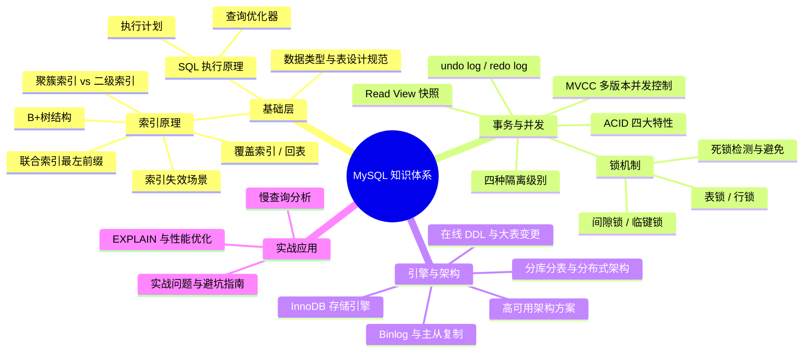
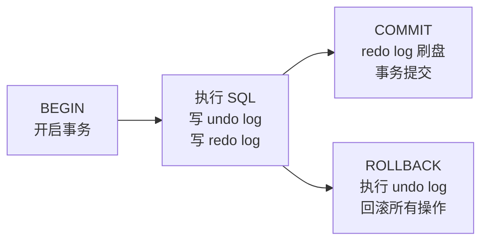

# MySQL 核心知识体系概览

> **学习目标**：从"会写 SQL"升级到"理解原理 → 能排查慢查询 → 能做架构设计决策"
>
> **检验标准**：学完每个模块后，能口述"这个技术解决了什么问题？不用它会怎样？工作中有哪些坑？"

---

## 整体知识地图

---

## 一、基础层：表设计与索引

### 为什么要从表设计开始？

良好的表设计是高性能数据库的基础。错误的数据类型选择、不合理的表结构设计，会在后期导致严重的性能问题和维护困难。

### 核心概念速览

| 概念 | 核心一句话 | 详细文档 |
|------|-----------|---------|
| **数据类型选择** | 选择合适的数据类型节省存储空间，提升查询性能 | [01-数据类型与表设计规范.md](./01-数据类型与表设计规范.md) |
| **表设计规范** | 遵循三范式，合理设计主键、外键和约束 | [01-数据类型与表设计规范.md](./01-数据类型与表设计规范.md) |
| **B+ 树索引** | 非叶子节点不存数据，层数少，IO 少；叶子节点链表，范围查询高效 | [02-索引详解.md](./02-索引详解.md) |
| **聚簇索引** | 叶子节点存完整行数据，每表只有一个，主键索引就是聚簇索引 | [02-索引详解.md](./02-索引详解.md) |
| **二级索引** | 叶子节点存索引值+主键，查询需要回表（除非覆盖索引） | [02-索引详解.md](./02-索引详解.md) |
| **覆盖索引** | 查询列全在索引中，无需回表，EXPLAIN 显示 `Using index` | [02-索引详解.md](./02-索引详解.md) |
| **联合索引** | 按最左前缀原则排序，跳过最左列则索引失效 | [02-索引详解.md](./02-索引详解.md) |

### 一句话描述

| MySQL 概念 | 一句话描述 |
|-----------|---------|
| 数据类型选择 | 选择合适的容器装东西，既节省空间又方便取用 |
| 表设计规范 | 设计合理的仓库货架，让存取货物更高效 |
| 全表扫描 | 在图书馆逐本翻书找内容 |
| B+ 树索引 | 图书馆的分类目录（先找大类，再找小类） |
| 聚簇索引 | 书架上的书按编号排列，找到编号就找到书 |
| 二级索引 | 按作者名排列的目录，找到作者名后给你书的编号，再去书架取书 |
| 覆盖索引 | 目录里直接写了你要的信息，不用去书架取书 |

---

## 二、SQL 执行与优化

### 为什么要理解 SQL 执行原理？

不了解 SQL 是如何被执行的，就无法真正理解为什么某些写法高效、某些写法低效。查询优化器的工作原理是性能优化的基础。

### 核心概念速览

| 概念 | 核心一句话 | 详细文档 |
|------|-----------|---------|
| **查询优化器** | MySQL 的"大脑"，负责选择最优执行计划 | [03-SQL执行原理与查询优化器.md](./03-SQL执行原理与查询优化器.md) |
| **执行计划** | 优化器选择的查询执行路径，决定查询性能 | [03-SQL执行原理与查询优化器.md](./03-SQL执行原理与查询优化器.md) |
| **EXPLAIN** | 查看执行计划的工具，重点看 type、key、Extra | [04-EXPLAIN与性能优化.md](./04-EXPLAIN与性能优化.md) |
| **慢查询日志** | 记录超过阈值的 SQL，用 mysqldumpslow 分析 | [04-EXPLAIN与性能优化.md](./04-EXPLAIN与性能优化.md) |
| **深分页优化** | 延迟关联：先用覆盖索引查主键，再 JOIN 获取完整数据 | [04-EXPLAIN与性能优化.md](./04-EXPLAIN与性能优化.md) |

### SQL 执行流程

---

## 三、事务与并发控制

### 为什么要深入理解事务？

高并发下出现幻读、脏读，线上死锁报警，`@Transactional` 加了但事务不回滚——这些问题的根源都是对事务和并发控制理解不足。

### 核心概念速览

| 概念 | 核心一句话 | 详细文档 |
|------|-----------|---------|
| **ACID** | 原子性靠 undo log，持久性靠 redo log，隔离性靠 MVCC+锁 | [05-事务与ACID.md](./05-事务与ACID.md) |
| **undo log** | 记录操作的逆操作，支持事务回滚，保证原子性 | [05-事务与ACID.md](./05-事务与ACID.md) |
| **redo log** | 记录数据页变更，支持崩溃恢复，保证持久性（WAL 机制） | [05-事务与ACID.md](./05-事务与ACID.md) |
| **隔离级别** | MySQL 默认可重复读（RR），RC 无间隙锁并发更高 | [06-MVCC与隔离级别.md](./06-MVCC与隔离级别.md) |
| **MVCC** | 读不加锁，通过 undo log 版本链 + Read View 读取历史版本 | [06-MVCC与隔离级别.md](./06-MVCC与隔离级别.md) |
| **Read View** | RR 事务开始时生成一次；RC 每次 SELECT 都生成新的 | [06-MVCC与隔离级别.md](./06-MVCC与隔离级别.md) |
| **记录锁** | 锁定具体的行，精确 | [07-锁机制与死锁.md](./07-锁机制与死锁.md) |
| **间隙锁** | 锁定索引间隙，防止插入，只在 RR 级别存在 | [07-锁机制与死锁.md](./07-锁机制与死锁.md) |
| **临键锁** | 记录锁 + 间隙锁，RR 级别范围查询默认加 | [07-锁机制与死锁.md](./07-锁机制与死锁.md) |
| **死锁** | 循环等待，InnoDB 自动检测并回滚代价小的事务 | [07-锁机制与死锁.md](./07-锁机制与死锁.md) |

### 事务生命周期

---

## 四、存储引擎与架构

### 为什么要理解存储引擎？

InnoDB 是 MySQL 的默认存储引擎，理解其内部机制有助于优化数据库性能和解决复杂问题。

### 核心概念速览

| 概念 | 核心一句话 | 详细文档 |
|------|-----------|---------|
| **InnoDB 架构** | 缓冲池、Change Buffer、双写缓冲区等核心组件 | [08-InnoDB存储引擎深度剖析.md](./08-InnoDB存储引擎深度剖析.md) |
| **Binlog** | 记录所有数据变更，用于主从复制和数据恢复 | [09-Binlog与主从复制.md](./09-Binlog与主从复制.md) |
| **主从复制** | 基于 Binlog 的数据同步，支持读写分离和高可用 | [09-Binlog与主从复制.md](./09-Binlog与主从复制.md) |
| **在线 DDL** | 不锁表的情况下修改表结构，支持大表变更 | [10-在线DDL与大表变更.md](./10-在线DDL与大表变更.md) |
| **高可用架构** | 主从、MHA、MGR 等方案保证服务连续性 | [11-高可用架构方案.md](./11-高可用架构方案.md) |
| **分库分表** | 水平拆分解决单表数据量过大问题 | [12-分库分表与分布式架构.md](./12-分库分表与分布式架构.md) |

---

## 五、实战应用与避坑

### 为什么要学习实战经验？

理论知识需要结合实际场景才能发挥最大价值。了解常见坑点和最佳实践可以避免重复踩坑。

### 核心概念速览

| 概念 | 核心一句话 | 详细文档 |
|------|-----------|---------|
| **实战避坑** | 字符集、时间时区、大表操作、事务失效、连接池、类型选择等常见坑 | [13-实战问题与避坑指南.md](./13-实战问题与避坑指南.md) |
| **性能监控** | 监控关键指标，及时发现和解决性能问题 | [13-实战问题与避坑指南.md](./13-实战问题与避坑指南.md) |
| **最佳实践** | 遵循 MySQL 使用的最佳实践，提升系统稳定性 | [13-实战问题与避坑指南.md](./13-实战问题与避坑指南.md) |

---

## 面试与实战问题速查

### 高频面试问题

| 问题 | 关键答案 | 实战关联 |
|------|---------|---------|
| 为什么用 B+ 树？ | 非叶子节点不存数据，层数少，IO 少；叶子节点链表，支持范围查询 | 影响索引设计和查询性能 |
| 什么是回表？如何避免？ | 二级索引查到主键后再查聚簇索引；用覆盖索引避免 | 避免回表可显著提升查询性能 |
| 联合索引最左前缀是什么？ | 联合索引按最左列排序，跳过最左列则无法利用有序性 | 影响索引设计和查询优化 |
| 哪些情况索引失效？ | 函数、类型转换、前缀通配符、OR 非索引列、不满足最左前缀 | 常见性能问题根源 |
| ACID 如何实现？ | 原子性靠 undo log，持久性靠 redo log，隔离性靠 MVCC+锁 | 事务可靠性的基础保障 |
| MVCC 原理？ | undo log 版本链 + Read View，读不加锁，通过快照读历史版本 | 高并发场景下的性能关键 |
| RC 和 RR 的区别？ | Read View 生成时机不同：RC 每次 SELECT 生成，RR 事务开始时生成一次 | 影响并发性能和隔离级别选择 |
| 间隙锁是什么？ | 锁定索引间隙，防止幻读，只在 RR 级别存在 | 死锁和并发问题的常见原因 |
| 如何排查死锁？ | `SHOW ENGINE INNODB STATUS` 查看最近死锁信息 | 线上问题排查必备技能 |
| EXPLAIN type=ALL 怎么办？ | 检查索引是否建立、是否失效（函数/类型转换/通配符等） | 性能优化的基础诊断工具 |

### 实战问题诊断

| 问题现象 | 根本原因 | 解决方案 | 关联知识点 |
|---------|---------|---------|---------|
| 明明建了索引，查询还是慢 | 索引失效（函数、类型转换等） | EXPLAIN 分析，修复失效原因 | 索引原理、执行计划 |
| 高并发下出现幻读 | 隔离级别理解不足 | 使用 `SELECT ... FOR UPDATE`（当前读+间隙锁） | 隔离级别、锁机制 |
| 线上死锁报警 | 不了解间隙锁的加锁范围 | 固定加锁顺序，缩短事务，考虑降级到 RC | 锁机制、死锁检测 |
| 大表查询慢 | 没有覆盖索引，大量回表 | 建立覆盖索引，只 SELECT 需要的列 | 索引设计、覆盖索引 |
| 深分页接口超时 | 大偏移量扫描大量数据后丢弃 | 延迟关联优化 | 查询优化、执行计划 |
| 批量更新锁等待超时 | 大事务长时间持有行锁 | 分批处理，每批单独事务 | 事务管理、锁机制 |
| 主从复制延迟 | 从库跟不上主库写入速度 | 优化从库配置，使用并行复制 | 主从复制、高可用架构 |
| 表空间不断增长 | 未及时清理无用数据或优化存储 | 定期清理，使用在线 DDL 优化表结构 | 存储引擎、表维护 |