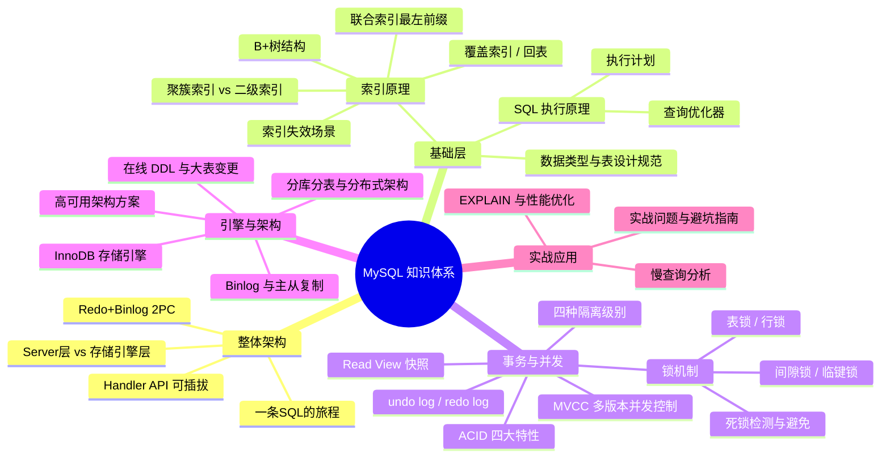

# MySQL 核心知识体系概览

> **学习目标**：从"会写 SQL"升级到"理解原理 → 能排查慢查询 → 能做架构设计决策"
>
> **检验标准**：学完每个模块后，能口述"这个技术解决了什么问题？不用它会怎样？工作中有哪些坑？"

---

## 整体知识地图

---

## 知识点导航

| # | 知识点 | 核心一句话 | 详细文档 |
| :--- | :--- | :--- | :--- |
| 00 | **MySQL 整体架构** | Server 层懂 SQL、引擎层管数据，`handler` 解耦两层；Redo+Binlog 2PC 保证崩溃一致 | [MySQL整体架构](@mysql-MySQL整体架构) |
| 01 | **数据类型与表设计** | 选择合适的数据类型节省空间，遵循三范式合理设计主键和约束 | [数据类型与表设计规范](@mysql-数据类型与表设计规范) |
| 02 | **索引详解**| 02 | **索引详解** | B+树非叶子节点不存数据，层数少 IO 少；叶子节点链表支持范围查询 | [索引详解](@mysql-索引详解) |
| 03 | **SQL 执行与性能优化** | SQL 执行全链路、查询优化器、EXPLAIN 分析、Join 算法、慢查询排查 | [SQL执行与性能优化](@mysql-SQL执行与性能优化) |
| 04 | **事务与并发控制** | ACID 四大特性、undo/redo log、四种隔离级别、MVCC 原理、Read View | [事务与并发控制](@mysql-事务与并发控制) |
| 05 | **锁机制与死锁** | 记录锁精确锁行，间隙锁防幻读，死锁自动检测回滚代价小的事务 | [锁机制与死锁](@mysql-锁机制与死锁) |
| 06 | **InnoDB 存储引擎** | 缓冲池、Change Buffer、双写缓冲区等核心组件 | [InnoDB存储引擎深度剖析](@mysql-InnoDB存储引擎深度剖析) |
| 07 | **Binlog 与主从复制** | 记录所有数据变更，用于主从复制和数据恢复 | [Binlog与主从复制](@mysql-Binlog与主从复制) |
| 08 | **在线 DDL 与大表变更** | 不锁表的情况下修改表结构，支持大表变更 | [在线DDL与大表变更](@mysql-在线DDL与大表变更) |
| 09 | **高可用架构方案** | 主从、MHA、MGR 等方案保证服务连续性 | [高可用架构方案](@mysql-高可用架构方案) |
| 10 | **分库分表与分布式架构** | 水平拆分解决单表数据量过大问题 | [分库分表与分布式架构](@mysql-分库分表与分布式架构) |
| 11 | **实战问题与避坑指南** | 字符集、时间时区、大表操作、事务失效、连接池等常见坑 | [实战问题与避坑指南](@mysql-实战问题与避坑指南) |
| 12 | **MySQL 8.0 与 8.4 新特性精讲** | CTE / 窗口函数 / 直方图 / Invisible Index / Instant DDL / LTS 版本差异 | [MySQL8.0与8.4新特性精讲](@mysql-MySQL8.0与8.4新特性精讲) |

---

## 高频问题索引

| 问题 | 详见 |
| :--- | :--- |
| MySQL 是怎么分层的？一条 SQL 经过哪些组件？ | [MySQL整体架构](@mysql-MySQL整体架构) |
| 为什么既要 Redo 又要 Binlog？2PC 如何保证一致？ | [MySQL整体架构](@mysql-MySQL整体架构) |
| 为什么用 B+ 树？什么是回表？如何避免？ | [索引详解](@mysql-索引详解) |
| 联合索引最左前缀是什么？哪些情况索引失效？ | [索引详解](@mysql-索引详解) |
| EXPLAIN type=ALL 怎么办？深分页如何优化？ | [SQL执行与性能优化](@mysql-SQL执行与性能优化) |
| ACID 如何实现？MVCC 原理？ | [事务与并发控制](@mysql-事务与并发控制) |
| RC 和 RR 的区别？间隙锁是什么？ | [事务与并发控制](@mysql-事务与并发控制) / [锁机制与死锁](@mysql-锁机制与死锁) |
| 如何排查死锁？高并发下出现幻读怎么办？ | [锁机制与死锁](@mysql-锁机制与死锁) |
| 主从复制延迟怎么办？大表查询慢怎么优化？ | [实战问题与避坑指南](@mysql-实战问题与避坑指南) |
| MySQL 5.7 / 8.0 / 8.4 如何选型？LTS 和 Innovation 差别？ | [MySQL8.0与8.4新特性精讲](@mysql-MySQL8.0与8.4新特性精讲) |
| CTE / 窗口函数 / Instant DDL 是什么？什么时候用？ | [MySQL8.0与8.4新特性精讲](@mysql-MySQL8.0与8.4新特性精讲) |

---

## 一句话口诀

> 表设计选对类型，索引用好 B+ 树，EXPLAIN 看执行计划，事务靠 undo/redo log，并发靠 MVCC + 锁，架构靠主从 + 分片。
