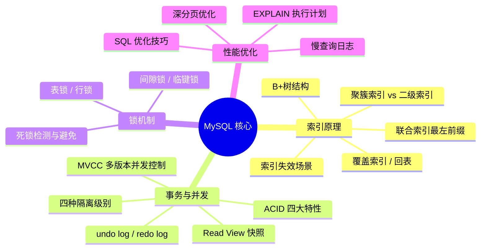
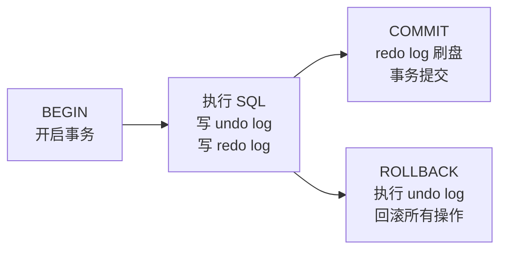

# MySQL 索引、事务与性能优化

> **学习目标**：从"会写 SQL"升级到"理解原理 → 能排查慢查询 → 能做索引设计决策"
>
> **检验标准**：学完每个模块后，能口述"这个技术解决了什么问题？不用它会怎样？工作中有哪些坑？"

---

## 整体知识地图

---

## 一、索引原理

### 为什么要深入理解索引？

明明建了索引，查询还是很慢——这是线上最常见的性能问题。根本原因是**索引失效**，而不理解 B+ 树的排序规则，就无法判断索引是否会生效。

### 核心概念速览

| 概念 | 核心一句话 | 详细文档 |
|------|-----------|---------|
| **B+ 树** | 非叶子节点不存数据，层数少，IO 少；叶子节点链表，范围查询高效 | [01-索引原理与B+树.md](./01-索引原理与B+树.md) |
| **聚簇索引** | 叶子节点存完整行数据，每表只有一个，主键索引就是聚簇索引 | [02-聚簇索引与覆盖索引.md](./02-聚簇索引与覆盖索引.md) |
| **二级索引** | 叶子节点存索引值+主键，查询需要回表（除非覆盖索引） | [02-聚簇索引与覆盖索引.md](./02-聚簇索引与覆盖索引.md) |
| **覆盖索引** | 查询列全在索引中，无需回表，EXPLAIN 显示 `Using index` | [02-聚簇索引与覆盖索引.md](./02-聚簇索引与覆盖索引.md) |
| **联合索引** | 按最左前缀原则排序，跳过最左列则索引失效 | [03-联合索引与索引失效.md](./03-联合索引与索引失效.md) |
| **索引失效** | 函数、类型转换、前缀通配符、OR 非索引列等会导致失效 | [03-联合索引与索引失效.md](./03-联合索引与索引失效.md) |

### 一句话描述

| MySQL 概念 | 一句话描述 |
|-----------|---------|
| 全表扫描 | 在图书馆逐本翻书找内容 |
| B+ 树索引 | 图书馆的分类目录（先找大类，再找小类） |
| 聚簇索引 | 书架上的书按编号排列，找到编号就找到书 |
| 二级索引 | 按作者名排列的目录，找到作者名后给你书的编号，再去书架取书 |
| 覆盖索引 | 目录里直接写了你要的信息，不用去书架取书 |

---

## 二、事务与 MVCC

### 为什么要深入理解事务？

高并发下出现幻读、脏读，线上死锁报警，`@Transactional` 加了但事务不回滚——这些问题的根源都是对事务和 MVCC 理解不足。

### 核心概念速览

| 概念 | 核心一句话 | 详细文档 |
|------|-----------|---------|
| **ACID** | 原子性靠 undo log，持久性靠 redo log，隔离性靠 MVCC+锁 | [04-事务与ACID.md](./04-事务与ACID.md) |
| **undo log** | 记录操作的逆操作，支持事务回滚，保证原子性 | [04-事务与ACID.md](./04-事务与ACID.md) |
| **redo log** | 记录数据页变更，支持崩溃恢复，保证持久性（WAL 机制） | [04-事务与ACID.md](./04-事务与ACID.md) |
| **隔离级别** | MySQL 默认可重复读（RR），RC 无间隙锁并发更高 | [05-MVCC与隔离级别.md](./05-MVCC与隔离级别.md) |
| **MVCC** | 读不加锁，通过 undo log 版本链 + Read View 读取历史版本 | [05-MVCC与隔离级别.md](./05-MVCC与隔离级别.md) |
| **Read View** | RR 事务开始时生成一次；RC 每次 SELECT 都生成新的 | [05-MVCC与隔离级别.md](./05-MVCC与隔离级别.md) |

### 事务生命周期

---

## 三、锁机制

### 为什么要理解锁？

不了解间隙锁，RR 隔离级别下一个范围查询可能锁住大量间隙，导致其他事务大量等待；不了解死锁产生原因，就无法从根本上避免死锁。

### 核心概念速览

| 概念 | 核心一句话 | 详细文档 |
|------|-----------|---------|
| **记录锁** | 锁定具体的行，精确 | [06-锁机制与死锁.md](./06-锁机制与死锁.md) |
| **间隙锁** | 锁定索引间隙，防止插入，只在 RR 级别存在 | [06-锁机制与死锁.md](./06-锁机制与死锁.md) |
| **临键锁** | 记录锁 + 间隙锁，RR 级别范围查询默认加 | [06-锁机制与死锁.md](./06-锁机制与死锁.md) |
| **死锁** | 循环等待，InnoDB 自动检测并回滚代价小的事务 | [06-锁机制与死锁.md](./06-锁机制与死锁.md) |

---

## 四、性能优化

### 为什么要学 EXPLAIN？

不会用 EXPLAIN，就无法判断 SQL 是否高效，只能靠"感觉"优化。EXPLAIN 是 MySQL 性能优化的必备工具。

### 核心概念速览

| 概念 | 核心一句话 | 详细文档 |
|------|-----------|---------|
| **EXPLAIN** | 重点看 type（ALL 是全表扫描）、key（索引）、Extra（Using index 最好） | [07-EXPLAIN与性能优化.md](./07-EXPLAIN与性能优化.md) |
| **慢查询日志** | 记录超过阈值的 SQL，用 mysqldumpslow 分析 | [07-EXPLAIN与性能优化.md](./07-EXPLAIN与性能优化.md) |
| **深分页优化** | 延迟关联：先用覆盖索引查主键，再 JOIN 获取完整数据 | [07-EXPLAIN与性能优化.md](./07-EXPLAIN与性能优化.md) |
| **实战避坑** | 字符集、时间时区、大表操作、事务失效、连接池、类型选择等 20 个常见坑 | [08-实战问题与避坑指南.md](./08-实战问题与避坑指南.md) |

---

## 高频面试速查

| 问题 | 关键答案 |
|------|---------|
| 为什么用 B+ 树？ | 非叶子节点不存数据，层数少，IO 少；叶子节点链表，支持范围查询 |
| 什么是回表？如何避免？ | 二级索引查到主键后再查聚簇索引；用覆盖索引避免 |
| 联合索引最左前缀是什么？ | 联合索引按最左列排序，跳过最左列则无法利用有序性 |
| 哪些情况索引失效？ | 函数、类型转换、前缀通配符、OR 非索引列、不满足最左前缀 |
| ACID 如何实现？ | 原子性靠 undo log，持久性靠 redo log，隔离性靠 MVCC+锁 |
| MVCC 原理？ | undo log 版本链 + Read View，读不加锁，通过快照读历史版本 |
| RC 和 RR 的区别？ | Read View 生成时机不同：RC 每次 SELECT 生成，RR 事务开始时生成一次 |
| 间隙锁是什么？ | 锁定索引间隙，防止幻读，只在 RR 级别存在 |
| 如何排查死锁？ | `SHOW ENGINE INNODB STATUS` 查看最近死锁信息 |
| EXPLAIN type=ALL 怎么办？ | 检查索引是否建立、是否失效（函数/类型转换/通配符等） |

---

## 常见问题速查

| 问题现象 | 根本原因 | 解决方案 |
|---------|---------|---------|
| 明明建了索引，查询还是慢 | 索引失效（函数、类型转换等） | EXPLAIN 分析，修复失效原因 |
| 高并发下出现幻读 | 隔离级别理解不足 | 使用 `SELECT ... FOR UPDATE`（当前读+间隙锁） |
| 线上死锁报警 | 不了解间隙锁的加锁范围 | 固定加锁顺序，缩短事务，考虑降级到 RC |
| 大表查询慢 | 没有覆盖索引，大量回表 | 建立覆盖索引，只 SELECT 需要的列 |
| 深分页接口超时 | 大偏移量扫描大量数据后丢弃 | 延迟关联优化 |
| 批量更新锁等待超时 | 大事务长时间持有行锁 | 分批处理，每批单独事务 |