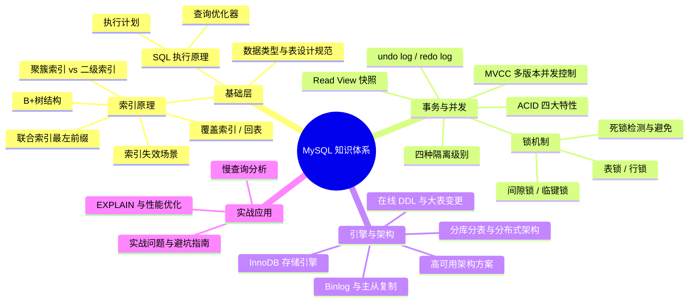

# MySQL 核心知识体系概览

> **学习目标**：从"会写 SQL"升级到"理解原理 → 能排查慢查询 → 能做架构设计决策"
>
> **检验标准**：学完每个模块后，能口述"这个技术解决了什么问题？不用它会怎样？工作中有哪些坑？"

---

## 整体知识地图

---

## 知识点导航

| # | 知识点 | 核心一句话 | 详细文档 |
|---|--------|-----------|---------|
| 01 | **数据类型与表设计** | 选择合适的数据类型节省空间，遵循三范式合理设计主键和约束 | [01-数据类型与表设计规范.md](./01-数据类型与表设计规范.md) |
| 02 | **索引详解** | B+树非叶子节点不存数据，层数少 IO 少；叶子节点链表支持范围查询 | [02-索引详解.md](./02-索引详解.md) |
| 03 | **SQL 执行原理与查询优化器** | MySQL 的"大脑"，负责选择最优执行计划 | [03-SQL执行原理与查询优化器.md](./03-SQL执行原理与查询优化器.md) |
| 04 | **EXPLAIN 与性能优化** | 查看执行计划的工具，重点看 type、key、Extra | [04-EXPLAIN与性能优化.md](./04-EXPLAIN与性能优化.md) |
| 05 | **事务与 ACID** | 原子性靠 undo log，持久性靠 redo log，隔离性靠 MVCC+锁 | [05-事务与ACID.md](./05-事务与ACID.md) |
| 06 | **MVCC 与隔离级别** | 读不加锁，通过 undo log 版本链 + Read View 读取历史版本 | [06-MVCC与隔离级别.md](./06-MVCC与隔离级别.md) |
| 07 | **锁机制与死锁** | 记录锁精确锁行，间隙锁防幻读，死锁自动检测回滚代价小的事务 | [07-锁机制与死锁.md](./07-锁机制与死锁.md) |
| 08 | **InnoDB 存储引擎** | 缓冲池、Change Buffer、双写缓冲区等核心组件 | [08-InnoDB存储引擎深度剖析.md](./08-InnoDB存储引擎深度剖析.md) |
| 09 | **Binlog 与主从复制** | 记录所有数据变更，用于主从复制和数据恢复 | [09-Binlog与主从复制.md](./09-Binlog与主从复制.md) |
| 10 | **在线 DDL 与大表变更** | 不锁表的情况下修改表结构，支持大表变更 | [10-在线DDL与大表变更.md](./10-在线DDL与大表变更.md) |
| 11 | **高可用架构方案** | 主从、MHA、MGR 等方案保证服务连续性 | [11-高可用架构方案.md](./11-高可用架构方案.md) |
| 12 | **分库分表与分布式架构** | 水平拆分解决单表数据量过大问题 | [12-分库分表与分布式架构.md](./12-分库分表与分布式架构.md) |
| 13 | **实战问题与避坑指南** | 字符集、时间时区、大表操作、事务失效、连接池等常见坑 | [13-实战问题与避坑指南.md](./13-实战问题与避坑指南.md) |

---

## 高频问题索引

| 问题 | 详见 |
|------|------|
| 为什么用 B+ 树？什么是回表？如何避免？ | [索引详解](./02-索引详解.md) |
| 联合索引最左前缀是什么？哪些情况索引失效？ | [索引详解](./02-索引详解.md) |
| EXPLAIN type=ALL 怎么办？深分页如何优化？ | [EXPLAIN与性能优化](./04-EXPLAIN与性能优化.md) |
| ACID 如何实现？MVCC 原理？ | [事务与ACID](./05-事务与ACID.md) / [MVCC与隔离级别](./06-MVCC与隔离级别.md) |
| RC 和 RR 的区别？间隙锁是什么？ | [MVCC与隔离级别](./06-MVCC与隔离级别.md) / [锁机制与死锁](./07-锁机制与死锁.md) |
| 如何排查死锁？高并发下出现幻读怎么办？ | [锁机制与死锁](./07-锁机制与死锁.md) |
| 主从复制延迟怎么办？大表查询慢怎么优化？ | [实战问题与避坑指南](./13-实战问题与避坑指南.md) |

---

## 一句话口诀

> 表设计选对类型，索引用好 B+ 树，EXPLAIN 看执行计划，事务靠 undo/redo log，并发靠 MVCC + 锁，架构靠主从 + 分片。
