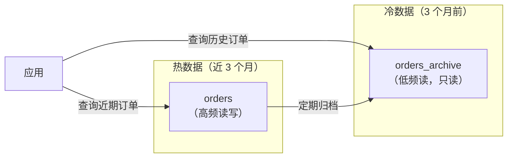

# 数据类型与表设计规范

> **核心问题**：如何选择合适的数据类型？表结构设计有哪些坑？如何在范式和性能之间取得平衡？

---

## 1. 类比：表设计就像定制服装

想象你在做一件**定制西装**——布料（数据类型）、尺寸（字段长度）、款式（范式 / 反范式）、扣子（主键 / 索引）每一项都要量体裁衣。做得好穿十年不用改，做得差三个月就得拆了重做：

| 场景 | ❌ 均码（踩坑写法） | ✅ 定制（推荐写法） | 对应原则 |
| :-- | :-- | :-- | :-- |
| **存身高体重** | `BIGINT` 无脑顶上 | 身高 `SMALLINT`（0~65535 cm）、体重 `DECIMAL(5,2)` | 能用小类型不用大类型 |
| **存账户余额** | `FLOAT`（精度丢失：0.1 + 0.2 ≠ 0.3） | `DECIMAL(10,2)` 或 `INT`（单位：分） | 金额绝对不用浮点 |
| **存手机号 / MD5** | `VARCHAR(255)` 一刀切 | `CHAR(11)` / `CHAR(32)`（定长） | 定长用 CHAR，变长用 VARCHAR |
| **存用户主键** | `VARCHAR(36)` 放 UUID（随机插入、页分裂） | 单库 `BIGINT AUTO_INCREMENT`、分布式用雪花 / UUIDv7 | 主键趋势递增，不用随机字符串 |
| **存 emoji 昵称** | `CHARSET=utf8`（残缺 3 字节 UTF-8，存不下 😂） | `CHARSET=utf8mb4`（真 4 字节 UTF-8） | utf8mb4 是唯一正确答案 |

**一句话**：数据类型选得越精确，**存储越省、索引越快、后期 DDL 成本越低**。下文每一节都是在讲「哪些场景该选哪把尺」。

---

## 2. 它解决了什么问题？

糟糕的表设计是性能问题的根源之一。合理的数据类型选择和表结构设计能：

- 减少存储空间，提升 Buffer Pool 命中率
- 避免隐式类型转换导致的索引失效
- 降低后期 DDL 变更的成本

---

## 3. 数值类型选择

### 3.1 整数类型

| 类型 | 字节 | 范围（有符号） | 适用场景 |
| :-- | :-- | :-- | :-- |
| TINYINT | 1 | -128 ~ 127 | 状态、枚举（0/1/2） |
| SMALLINT | 2 | -32768 ~ 32767 | 小范围数值 |
| MEDIUMINT | 3 | -8388608 ~ 8388607 | 中等范围 |
| INT | 4 | -21亿 ~ 21亿 | 常规 ID、计数 |
| BIGINT | 8 | ±9.2×10¹⁸ | 雪花 ID、大计数 |

!!! note "📖 术语家族：`整数类型族`"
    **字面义**：整数按字节数递进，从 1 字节的 `TINYINT` 到 8 字节的 `BIGINT`，范围逐级扩大。
    **在 MySQL 中的含义**：按**最小够用**原则选型，能用 1 字节绝不用 8 字节——索引、Buffer Pool、网络传输、Binlog 体积全部直接减半。
    **同家族成员**：

    | 成员 | 字节 | 范围（UNSIGNED） | 典型用途 |
    | :-- | :--: | :--: | :-- |
    | `TINYINT` | 1 | 0 ~ 255 | 状态码、布尔值、枚举（0/1/2/3）|
    | `SMALLINT` | 2 | 0 ~ 65535 | 小范围计数、年龄、端口号 |
    | `MEDIUMINT` | 3 | 0 ~ 1677万 | 中等规模计数（少用）|
    | `INT` | 4 | 0 ~ 42亿 | 常规自增 ID、普通计数 |
    | `BIGINT` | 8 | 0 ~ 1.8×10¹⁹ | 雪花 ID、分布式主键、大计数 |

    **修饰符**：`UNSIGNED`（无符号，范围翻倍）、`ZEROFILL`（前导补 0，MySQL 8.0.17 已弃用）。  
    **命名规律**：`[前缀]INT` = “字节数递进的整数家族”，选型时只看一件事——**实际最大值落在哪个区间**。

```sql
-- ✅ 状态字段用 TINYINT，节省空间
status TINYINT UNSIGNED NOT NULL DEFAULT 0 COMMENT '0:待处理 1:处理中 2:完成 3:失败'

-- ✅ 普通业务 ID 用 INT（21亿够用），高并发/分布式用 BIGINT
id INT UNSIGNED NOT NULL AUTO_INCREMENT

-- ❌ 不要用 INT(11)，括号里的数字只影响显示宽度，不影响存储范围
-- MySQL 8.0.17 已废弃整数显示宽度
```

### 3.2 浮点与精确数值

```sql
-- ❌ 金额绝对不能用 FLOAT/DOUBLE（浮点精度问题）
price FLOAT  -- 0.1 + 0.2 ≠ 0.3

-- ✅ 金额用 DECIMAL（精确小数）
price DECIMAL(10, 2)  -- 最多 10 位，2 位小数，最大 99999999.99

-- ✅ 或者用 INT 存分（单位：分），避免小数
price_fen INT UNSIGNED NOT NULL DEFAULT 0 COMMENT '单位：分'
```

---

## 4. 字符串类型选择

### 4.1 CHAR vs VARCHAR

| 对比项 | CHAR | VARCHAR |
| :-- | :-- | :-- |
| 存储方式 | 固定长度，不足补空格 | 变长，额外 1~2 字节存长度 |
| 适用场景 | 定长字符串（MD5、手机号） | 变长字符串（姓名、地址） |
| 性能 | 读取快（无需解析长度） | 存储效率高 |

!!! note "📖 术语家族：`字符串类型族`"
    **字面义**：按**存储方式**（定长 vs 变长）和**最大长度**（字节数递进）划分的字符串家族。
    **在 MySQL 中的含义**：CHAR 系为定长存储，VARCHAR/TEXT 系为变长存储；TEXT / BLOB 超过 `max_inline_blob_size` 的部分会被拆到**溢出页**，每次读取多一次 IO。
    **同家族成员**：

    | 成员 | 存储方式 | 最大长度 | 典型用途 |
    | :-- | :-- | :-- | :-- |
    | `CHAR(N)` | 定长，不足补空格 | 255 字符 | MD5、手机号、国家码等定长字段 |
    | `VARCHAR(N)` | 变长 + 1~2 字节长度前缀 | 65535 字节（行级限制）| 姓名、地址等变长字段 |
    | `TINYTEXT` | 变长，存到页外 | 255 字节 | 少用 |
    | `TEXT` | 变长，存到页外 | 64 KB | 短文章、评论 |
    | `MEDIUMTEXT` | 变长，存到页外 | 16 MB | 文章正文 |
    | `LONGTEXT` | 变长，存到页外 | 4 GB | 大文档 |
    | `TINYBLOB` / `BLOB` / `MEDIUMBLOB` / `LONGBLOB` | 二进制变长 | 同上 | 图片、文件（尽量外放 OSS）|
    | `JSON` | 变长，二进制格式 | 4 GB | 半结构化数据 |

    **命名规律**：`[TINY/MEDIUM/LONG]TEXT` = “长度逐级扩大 16 倍的变长存储”。**选型铁律**：定长用 `CHAR`、短变长用 `VARCHAR`、超过 1000 字符才考虑 `TEXT`，**绝不通用 `VARCHAR(255)` 一刀切**（排序 / 临时表按最大长度分配内存）。

```sql
-- ✅ 定长字段用 CHAR
md5_hash CHAR(32) NOT NULL
phone CHAR(11) NOT NULL
username VARCHAR(50) NOT NULL
address VARCHAR(200)

-- ❌ 不要用 VARCHAR(255) 一刀切，长度影响内存分配（排序时按最大长度分配）
```

### 4.2 TEXT 类型的坑

```sql
-- ❌ 不要在 TEXT 列上建索引（需要指定前缀长度，效果差）
-- ❌ TEXT 列不能有默认值
-- ❌ TEXT 列超过 max_inline_blob_size 时，数据存储在溢出页，增加 IO

-- ✅ 如果内容不超过 1000 字符，用 VARCHAR
content VARCHAR(1000)

-- ✅ 确实需要存大文本，考虑将 TEXT 列拆分到单独的表（冷热分离）
CREATE TABLE article_content (
    article_id INT UNSIGNED NOT NULL,
    content MEDIUMTEXT,
    PRIMARY KEY (article_id)
);
```

---

## 5. 时间类型选择

| 类型 | 字节 | 范围 | 时区 | 适用场景 |
| :-- | :--: | :-- | :-- | :-- |
| DATETIME | 8 | 1000-01-01 ~ 9999-12-31 | 不转换 | 业务时间（推荐） |
| TIMESTAMP | 4 | 1970-01-01 ~ 2038-01-19 | 自动转换 | 记录操作时间 |
| DATE | 3 | 1000-01-01 ~ 9999-12-31 | - | 只需日期 |
| INT | 4 | Unix 时间戳 | 不转换 | 需要时间计算 |

```sql
-- ✅ 推荐：DATETIME，范围大，无时区问题
create_time DATETIME NOT NULL DEFAULT CURRENT_TIMESTAMP
update_time DATETIME NOT NULL DEFAULT CURRENT_TIMESTAMP ON UPDATE CURRENT_TIMESTAMP

-- ⚠️ TIMESTAMP 的 2038 年问题：2038-01-19 03:14:07 后溢出
-- 如果系统会运行到 2038 年后，不要用 TIMESTAMP

-- ⚠️ TIMESTAMP 会随时区变化，跨时区系统慎用
```

---

## 6. utf8 vs utf8mb4

```sql
-- ❌ MySQL 的 utf8 是残缺的 UTF-8，只支持 3 字节，不支持 emoji
-- 存储 emoji 会报错或被截断

-- ✅ 必须用 utf8mb4（真正的 UTF-8，支持 4 字节字符）
CREATE TABLE users (
    ...
) ENGINE=InnoDB DEFAULT CHARSET=utf8mb4 COLLATE=utf8mb4_unicode_ci;

-- 排序规则选择：
-- utf8mb4_unicode_ci：基于 Unicode 标准，准确但稍慢
-- utf8mb4_general_ci：简化算法，快但部分语言排序不准确
-- utf8mb4_0900_ai_ci：MySQL 8.0 默认，最新 Unicode 9.0 标准（推荐）
```

---

## 7. 主键设计

### 7.1 自增 ID vs UUID vs 雪花 ID

| 类型 | 优点 | 缺点 | 适用场景 |
| :-- | :-- | :-- | :-- |
| **自增 INT/BIGINT**（推荐） | 顺序插入，无页分裂，索引紧凑 | 单点生成，可被猜测 | 单库单表 |
| **UUID** | 全局唯一，分布式友好 | 随机插入，大量页分裂，性能差，36 字节 | 不推荐 |
| **雪花 ID** | 全局唯一，趋势递增，64 位 | 依赖时钟，需要额外组件 | 分布式系统 |
| **有序 UUID（UUIDv7）** | 全局唯一，时间有序 | MySQL 8.0.31+ 才支持 | 新系统 |

```sql
-- ✅ 单库：自增主键
id BIGINT UNSIGNED NOT NULL AUTO_INCREMENT PRIMARY KEY

-- ✅ 分布式：雪花 ID（应用层生成，趋势递增）
id BIGINT UNSIGNED NOT NULL PRIMARY KEY COMMENT '雪花 ID'

-- ❌ 不要用 UUID 做主键
id VARCHAR(36) NOT NULL PRIMARY KEY  -- 随机插入，性能差
```

!!! note "📖 术语家族：`分布式 ID 族`"
    **字面义**：解决**跨机器 / 跨库 唯一 ID 生成**的一类算法家族。
    **在 MySQL 中的含义**：主键选型直接决定 B+ 树**插入性能**——趋势递增的 ID 顺序写入 B+ 树右端（无页分裂、索引紧凑），随机 ID 在中间插入引发**大量页分裂 + 磁盘随机 IO**。
    **同家族成员**：

    | 成员 | 有序性 | 长度 | 典型用途 |
    | :-- | :-- | :-- | :-- |
    | `AUTO_INCREMENT` | 严格递增 | 4~8 字节 | 单库单表 |
    | `UUID v1`（基于 MAC + 时间）| 时间有序但暴露 MAC | 36 字符 | 少用 |
    | `UUID v4`（随机）| **完全随机** | 36 字符 | ❌ 不要做主键 |
    | `UUID v7`（时间有序）| 时间有序 | 36 字符 | MySQL 8.0.31+ 推荐 |
    | `Snowflake`（雪花）| 趋势递增 | 64 位（BIGINT）| 分布式主流 |
    | `Leaf`（美团）/ `TinyID`（滔滔）| 趋势递增 | 64 位 | 号段模式，DB 发号 |

    **命名规律**：**有序 vs 随机**是选型的唯一关键——趋势递增的都能做主键，纯随机的（UUID v4）只能做业务可阴码、不能当聚簇索引键。

> 📖 为什么 UUID v4 做主键会导致“大量页分裂”、而自增主键“索引紧凑”——底层是 InnoDB 聚簇索引 B+ 树的页结构与页分裂机制，详见 [InnoDB存储引擎深度剖析](@mysql-InnoDB存储引擎深度剖析)，本文不再展开。

---

## 8. 三大范式与反范式

| 范式 | 要求 | 解决的问题 |
| :-- | :-- | :-- |
| **第一范式（1NF）** | 每列不可再分（原子性） | 消除重复列 |
| **第二范式（2NF）** | 非主键列完全依赖主键 | 消除部分依赖 |
| **第三范式（3NF）** | 非主键列不依赖其他非主键列 | 消除传递依赖 |

### 8.1 何时反范式？

```sql
-- 范式设计（3NF）：查询需要 JOIN
SELECT o.id, o.amount, u.name, u.phone
FROM orders o JOIN users u ON o.user_id = u.id;

-- 反范式设计：冗余用户信息到订单表，避免 JOIN
ALTER TABLE orders ADD COLUMN user_name VARCHAR(50);
ALTER TABLE orders ADD COLUMN user_phone CHAR(11);

-- 适用场景：
-- ✅ 历史快照（下单时的用户名，即使用户改名也不影响历史订单）
-- ✅ 高频查询，JOIN 成为性能瓶颈
-- ❌ 数据频繁变更（冗余数据难以保持一致）
```

---

## 9. 表设计规范

### 9.1 必备字段

```sql
CREATE TABLE orders (
    id          BIGINT UNSIGNED NOT NULL AUTO_INCREMENT COMMENT '主键',
    -- 业务字段...
    create_time DATETIME NOT NULL DEFAULT CURRENT_TIMESTAMP COMMENT '创建时间',
    update_time DATETIME NOT NULL DEFAULT CURRENT_TIMESTAMP ON UPDATE CURRENT_TIMESTAMP COMMENT '更新时间',
    is_deleted  TINYINT UNSIGNED NOT NULL DEFAULT 0 COMMENT '软删除：0正常 1已删除',
    PRIMARY KEY (id),
    INDEX idx_create_time (create_time)
) ENGINE=InnoDB DEFAULT CHARSET=utf8mb4 COLLATE=utf8mb4_unicode_ci COMMENT='订单表';
```

### 9.2 字段设计原则

```txt
-- ✅ 所有字段加 NOT NULL + DEFAULT（避免 NULL 的坑）
-- NULL 值在索引中占用额外空间，COUNT(*) 和 COUNT(col) 结果不同，比较时需要 IS NULL

-- ✅ 枚举值用 TINYINT，不要用 ENUM 类型
-- ENUM 修改枚举值需要 ALTER TABLE，而 TINYINT 只需修改代码

-- ✅ 金额用 DECIMAL 或 INT（分）
-- ✅ 状态字段加注释，说明每个值的含义
-- ✅ 外键关系在应用层维护，不要在数据库层加外键约束（影响性能，分库分表不支持）
```

### 9.3 索引设计规范

> 📖 索引数据结构、联合索引最左前缀、覆盖索引、EXPLAIN 读法等**机制层**内容详见 [索引详解](@mysql-索引详解)，本文只讲**命名与数量规范**，不重复展开。

```txt
-- ✅ 命名规范
-- 主键：pk_字段名
-- 唯一索引：uk_字段名
-- 普通索引：idx_字段名

-- ✅ 单表索引不超过 5 个（每个索引都有维护成本）
-- ✅ 联合索引：区分度高的列放前面
-- ✅ 频繁查询的列建索引，但低区分度列（如 status）单独建索引效果差

-- ❌ 不要对频繁更新的列建索引（更新时需要维护索引）
-- ❌ 不要建冗余索引（如已有 (a,b)，不需要再建 (a)）
```

---

## 10. JSON 类型与虚拟列

MySQL 5.7+ 支持 JSON 类型，适合存储半结构化数据：

```sql
-- 存储 JSON
CREATE TABLE products (
    id INT UNSIGNED NOT NULL AUTO_INCREMENT,
    name VARCHAR(100) NOT NULL,
    attributes JSON,  -- 存储不固定的属性
    PRIMARY KEY (id)
);

-- 查询 JSON 字段
SELECT name, attributes->>'$.color' AS color
FROM products
WHERE attributes->>'$.brand' = 'Apple';

-- 虚拟列 + 索引（对 JSON 字段建索引）
ALTER TABLE products
ADD COLUMN brand VARCHAR(50) GENERATED ALWAYS AS (attributes->>'$.brand') VIRTUAL,
ADD INDEX idx_brand (brand);

-- 现在可以走索引查询
SELECT * FROM products WHERE brand = 'Apple';
```

> **JSON 类型的注意事项**：JSON 列不能有默认值；JSON 文档整体更新（无法只更新某个字段）；不要把 JSON 当关系型数据用，频繁查询的字段应该单独建列。

---

## 11. 大表设计：冷热分离



```sql
-- 定期将冷数据归档
INSERT INTO orders_archive
SELECT * FROM orders WHERE create_time < DATE_SUB(NOW(), INTERVAL 3 MONTH);

DELETE FROM orders WHERE create_time < DATE_SUB(NOW(), INTERVAL 3 MONTH);
-- 注意：分批删除，避免大事务
```

> 📖 **延伸阅读**：
>
> - 当冷热分离无法满足、数据量继续膨胀时，下一步是**分库分表** → [分库分表与分布式架构](@mysql-分库分表与分布式架构)
> - 大批量 `DELETE` 引发的锁争用 / Binlog 膨胀 / 主从延迟等实战踩坑 → [实战问题与避坑指南](@mysql-实战问题与避坑指南)

---

## 12. 常见问题

**Q：为什么不推荐使用 NULL？**

> NULL 有很多坑：① 索引中 NULL 值需要额外空间；② `COUNT(col)` 不统计 NULL，容易出 bug；③ `NULL != NULL`，比较时必须用 `IS NULL`；④ 与 NULL 做运算结果都是 NULL。建议所有字段加 `NOT NULL DEFAULT ''` 或 `NOT NULL DEFAULT 0`。

**Q：DATETIME 和 TIMESTAMP 如何选择？**

> 推荐 DATETIME：范围更大（不受 2038 年限制），不受时区影响，语义清晰。TIMESTAMP 的自动时区转换在跨时区系统中容易出问题。

**Q：为什么不推荐在数据库层加外键约束？**

> 外键约束在写操作时需要检查关联表，影响写入性能；分库分表后外键无法跨库；级联删除/更新容易误操作。建议在应用层维护数据一致性，数据库只做存储。

**Q：表字段越少越好吗？**

> 不是绝对的。字段太少需要频繁 JOIN，字段太多（宽表）则每次查询传输数据量大。合理的做法是：高频查询的字段放在主表，低频/大字段（如详情、备注）拆分到扩展表，实现冷热分离。

---

## 13. 一句话口诀

> ⭐ **表设计五句口诀**（按执行顺序记忆）：
>
> 1. **类型**：能用小类型不用大类型——`TINYINT` 能装就别上 `INT`，`INT` 够用就别上 `BIGINT`。
> 2. **金额**：金额用 `DECIMAL` 或 `INT`（单位：分），**绝对不用 `FLOAT` / `DOUBLE`**。
> 3. **字符集**：`utf8mb4` + `utf8mb4_0900_ai_ci` 是唯一正确答案，老项目 `utf8` 一律视为残缺。
> 4. **主键**：单库自增、分布式雪花 / UUIDv7，**任何情况下都不用 `VARCHAR(36)` 存 UUID 做主键**。
> 5. **字段**：所有字段 `NOT NULL` + `DEFAULT` + `COMMENT`，外键约束在应用层维护，枚举用 `TINYINT` 不用 `ENUM`。
