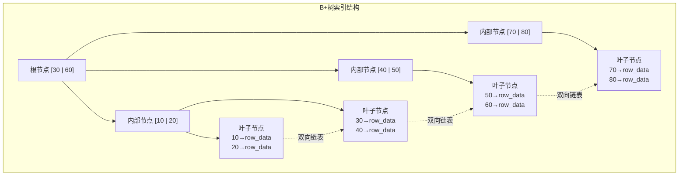

# 索引原理与 B+ 树

> **核心问题**：为什么 MySQL 选择 B+ 树作为索引结构？它解决了什么问题？

---

## 它解决了什么问题？

没有索引时，查询一条数据需要**全表扫描**，时间复杂度 O(n)。数据量越大越慢，百万级数据查询可能需要数秒。索引通过**预先排好序的数据结构**，将查询复杂度降到 O(log n)。

---

## 为什么选 B+ 树？

| 对比项 | B+ 树 | 哈希表 | 普通 B 树 |
|--------|-------|--------|----------|
| 范围查询 | ✅ 叶子节点链表，高效 | ❌ 不支持 | ⚠️ 需要回溯 |
| 等值查询 | ✅ O(log n) | ✅ O(1) | ✅ O(log n) |
| 排序 | ✅ 叶子节点有序 | ❌ 不支持 | ❌ 需要额外排序 |
| 磁盘 IO | ✅ 非叶子节点不存数据，层数少 | - | ⚠️ 层数更多 |

> **B+ 树 vs B 树的关键差异**：B+ 树非叶子节点只存键值不存数据，同样大小的磁盘页能存更多键值，树的层数更少，磁盘 IO 次数更少。**一棵高度为 3 的 B+ 树，可以存储约 2000 万条数据，只需 3 次磁盘 IO。**

---

## B+ 树结构图

**关键特点**：叶子节点通过**双向链表**连接，范围查询（如 `WHERE id BETWEEN 10 AND 50`）只需找到起点，然后顺序遍历链表，无需多次回溯树根。

---

## 生活类比

| MySQL 概念 | 生活类比 |
|-----------|---------|
| 全表扫描 | 在图书馆逐本翻书找内容 |
| B+ 树索引 | 图书馆的分类目录（先找大类，再找小类） |
| 叶子节点链表 | 目录页之间有"下一页"指针，翻页很快 |

---

## 面试高频问题

**Q：B+ 树相比 B 树有什么优势？为什么 MySQL 选择 B+ 树？**

> B+ 树非叶子节点不存数据，同样大小的磁盘页能存更多键值，树的层数更少，磁盘 IO 次数更少；叶子节点通过链表连接，范围查询只需顺序遍历，无需回溯。一棵高度为 3 的 B+ 树可存约 2000 万条数据，只需 3 次 IO。

**Q：为什么不用哈希表做索引？**

> 哈希表只支持等值查询，不支持范围查询和排序，而数据库中 `BETWEEN`、`ORDER BY`、`LIKE 'xxx%'` 等操作非常常见，B+ 树能全部支持。