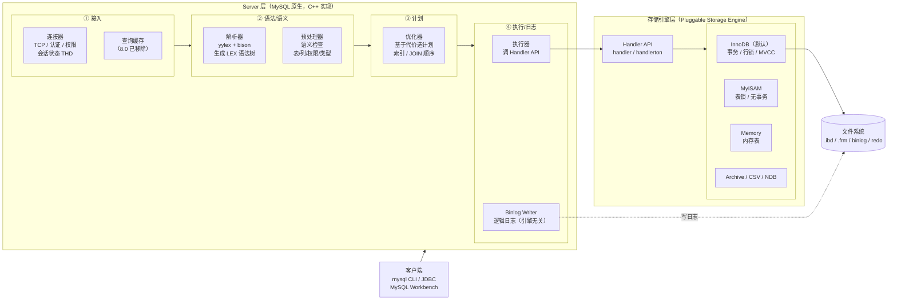
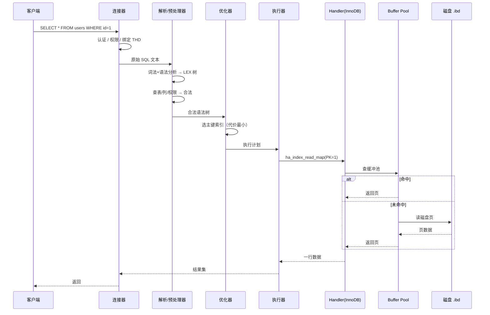
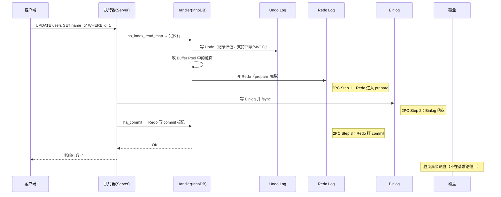

# MySQL 整体架构 —— Server 层 × 存储引擎层的双层模型

!!! info "**MySQL 整体架构 一句话口诀**"
    MySQL 是一个 C++ 写的、**"Server 层 + 存储引擎层"双层架构**的关系型数据库。

    **Server 层**（连接器 / 解析器 / 优化器 / 执行器 / Binlog）负责"懂 SQL"；**存储引擎层**（默认 InnoDB）负责"管数据"。

    两层之间通过 **Handler API**（`handler` 抽象类）解耦——Server 层只 `ha_index_next` 要下一行，不碰数据文件。

    一条 SQL 的旅程 = **连接 → 解析 → 优化 → 执行器调 Handler → 引擎读写页 → 返回结果**。

    崩溃恢复靠 **Redo + Binlog 的 2PC**——这是双层日志不冲突、主从不分裂的唯一原因。

> 📖 **边界声明**：本文聚焦「MySQL 作为一个**进程**的整体骨架——分了哪几层、每层干什么、一条 SQL 在层与层之间怎么流转、源码对应哪些模块」。以下主题请看对应专题文档，本文不展开：
>
> - InnoDB 存储引擎内部的 Buffer Pool / Redo / Undo / 双写缓冲 → [InnoDB存储引擎深度剖析](@mysql-InnoDB存储引擎深度剖析)
> - 优化器如何选择执行计划、EXPLAIN 各字段含义、Join 算法 → [SQL执行与性能优化](@mysql-SQL执行与性能优化)
> - 事务 ACID / 四种隔离级别 / MVCC / Read View → [事务与并发控制](@mysql-事务与并发控制)
> - 行锁 / 间隙锁 / 临键锁 / 死锁检测 → [锁机制与死锁](@mysql-锁机制与死锁)
> - Binlog 三种格式 / 主从复制流程 / 半同步 → [Binlog与主从复制](@mysql-Binlog与主从复制)
> - 生产部署 / 参数调优 / 连接池大小 → [实战问题与避坑指南](@mysql-实战问题与避坑指南)

---

## 1. 为什么要先看"整体架构"

很多人学 MySQL，上来就啃 B+ 树、啃 MVCC、啃间隙锁，结果**树看清了但森林没看见**：不知道优化器是何时介入的、不知道 Binlog 是谁写的、不知道 `SELECT` 和 `UPDATE` 走的路径差在哪。

先打个比方建立直觉——**MySQL ≈ 一家"翻译社 + 档案馆"的合体**：

- **前台（Server 层）**懂中英日法的语法，帮你把需求翻成"取哪份档案的第几页"
- **后台（存储引擎层）**只管档案的存取搬运，但不管你说的是哪国话
- 两层之间通过"取件小票"（**Handler API**）交接——前台不关心后台是纸质档案还是电子档案，后台也不关心前台接的是什么语言的客户

先把架构骨架搞清楚，后续所有细节都能"挂"到这张图上：

- 看到 Redo/Undo 时，知道它是**引擎层**的日志
- 看到 Binlog 时，知道它是**Server 层**的日志
- 看到查询缓存、SQL 解析、权限校验时，知道它们在**Server 层**
- 看到行锁、缓冲池、脏页刷盘时，知道它们在**引擎层**

这就是本文的唯一目标：**建立一张可以挂载所有后续知识点的骨架图**。

---

## 2. 一张图看懂 MySQL 双层架构



**关键观察**：

1. **Server 层只做"SQL 解释和计划"，不碰数据文件**——它把 SQL 翻译成"读哪个表、哪一行"的 API 调用，数据实际读写全部甩给引擎层。
2. **存储引擎层可插拔**——同一个 MySQL 实例，不同表可以用不同引擎（`CREATE TABLE ... ENGINE=InnoDB / MyISAM / Memory`），这是 MySQL 的招牌设计。
3. **两份日志分属两层**——Binlog 是 Server 层写的（所有引擎都写），Redo/Undo 是 InnoDB 自己写的（别的引擎没有）。崩溃恢复必须靠**两层协作**——这就是 §6 要讲的 2PC。

---

## 3. Server 层：MySQL 的"大脑"

Server 层用 C++ 实现，源码在 MySQL 源码树的 `sql/` 目录下，各组件对应关系：

| 组件 | 源码核心文件 | 入口类 / 函数 | 职责一句话 |
| :-- | :-- | :-- | :-- |
| 连接器 | `sql/sql_connect.cc` | `THD`（Thread Handle）、`handle_connection` | 每连接一个 `THD`，承载会话状态 |
| 查询缓存 | `sql/sql_cache.cc` | `Query_cache`（8.0 删除） | SQL 字符串匹配命中直接返回 |
| 解析器 | `sql/sql_lex.cc` / `sql/sql_yacc.yy` | `LEX`、`MYSQLlex`、`MYSQLparse` | SQL 文本 → 语法树 `LEX` |
| 预处理器 | `sql/sql_resolver.cc` | `Query_block::prepare` | 检查表/列存在、权限、类型 |
| 优化器 | `sql/sql_optimizer.cc` | `JOIN::optimize` | 基于代价选择访问路径与 JOIN 顺序 |
| 执行器 | `sql/sql_executor.cc` | `JOIN::exec` / `handler::ha_*` | 调用 Handler API 真正执行 |
| Binlog | `sql/binlog.cc` | `MYSQL_BIN_LOG::write_event` | 记录所有数据变更（逻辑日志） |

### 3.1 连接器：TCP 背后的 `THD`

一个客户端连上来，Server 层就分配一个 **`THD`**（Thread Handle）对象，把**会话级状态**全装进去——当前数据库、事务状态、字符集、是否 autocommit、`last_insert_id`、临时表……

!!! note "📖 术语家族：`THD`（Thread Descriptor / Session Handle）"
    **字面义**：`THD` = **Thread Handle / Thread Descriptor**，"一条会话的全部上下文"。
    **在 MySQL 中的含义**：每个客户端连接对应一个 `THD` 实例，在 Server 层所有函数签名里都看得到它（`THD *thd` 几乎是万能首参数）。你可以把它当成"MySQL 版本的 `HttpServletRequest` + `Session`"的合体。
    **同家族 / 相关成员**：

    | 成员 | 作用 | 源码位置 |
    | :-- | :-- | :-- |
    | `THD` | 会话总上下文：状态、事务、变量、语句、错误码 | `sql/sql_class.h` |
    | `Security_context` | 当前用户、权限、host | `sql/auth/sql_security_ctx.h` |
    | `Protocol` | 与客户端通信的协议层（文本/二进制/X 协议） | `sql/protocol_classic.cc` |
    | `Query_arena` | 当前语句的内存分配域 | `sql/sql_class.h` |

    **命名规律**：`THD::*` 系列方法都是**"这条会话/这次请求里"**的操作；看到源码里 `thd->xxx`，几乎都是在读会话态。

**验证方式**：`SHOW PROCESSLIST` 看到的每一行，背后就是一个 `THD`。

### 3.2 查询缓存：8.0 里彻底消失的历史遗迹

5.7 及以前有一个**极具争议**的 `Query Cache`——SQL 原文做 key、结果集做 value。看上去很美，但实际使用率极低：

| 问题 | 技术原因 |
| :-- | :-- |
| 任何 DML 都让整表缓存失效 | `invalidate_table` 按表级粒度清 |
| SQL 多一个空格就不命中 | key 是原始字符串 hash，不规范化 |
| 高并发下锁争用严重 | 全局互斥锁 `query_cache_lock` |

**结论**：`MySQL 8.0`已彻底移除（`query_cache_*` 参数全部废弃）。今天看到老教材讲查询缓存，**知道有过这么个东西、已经死了**就够了。

### 3.3 解析器 + 预处理器：SQL → 语法树

解析器是**纯文本处理**，不认表、不认列，只按 SQL 语法规则分词 + 构树：

```txt
SELECT name FROM users WHERE id = 1
        │         │         │
     SELECT_LEX   TABLE_LIST  Item_func_eq
                              ├── Item_field(id)
                              └── Item_int(1)
```

生成的 `LEX` 结构塞满了 `Query_block`、`TABLE_LIST`、`Item` 各种子树。

!!! note "📖 术语家族：`Item`（SQL 表达式节点）"
    **字面义**：`Item` = "一个表达式/一个值"——MySQL 源码里表达式树节点的基类。
    **在 MySQL 中的含义**：只要是 SQL 里"能算出一个值的东西"（字段引用、常量、函数调用、比较运算、子查询），在源码里都是一个 `Item` 子类。
    **同家族成员**：

    | 成员 | 对应 SQL | 源码位置 |
    | :-- | :-- | :-- |
    | `Item_field` | 字段引用，如 `users.name` | `sql/item.h` |
    | `Item_int` / `Item_string` / `Item_null` | 字面量 | `sql/item.h` |
    | `Item_func_eq` / `Item_func_lt` / `Item_cond_and` | 比较/逻辑运算 | `sql/item_cmpfunc.h` |
    | `Item_sum_sum` / `Item_sum_count` | 聚合函数 | `sql/item_sum.h` |
    | `Item_subselect` | 子查询 | `sql/item_subselect.h` |

    **命名规律**：`Item_<类型>` → 字面量类；`Item_func_<运算>` → 函数/运算符；`Item_sum_<聚合>` → 聚合函数；`Item_cond_<逻辑>` → 复合条件。看到 `Item_` 前缀就知道是"SQL 表达式树里的一个节点"。

**预处理器**（`Query_block::prepare`）随后做语义检查：

- 表、列是否存在？→ 查 `Data Dictionary`
- 当前用户有没有权限？→ 查 `Security_context`
- 类型是否兼容？→ 固化 `Item` 的类型

走完这一步，才有了一棵**语义正确**的查询树，才能交给优化器。

### 3.4 优化器：MySQL 最值钱的部分

优化器要回答三个问题：

1. **选哪个索引？**（同一个表可能有多个可用索引）
2. **多表 JOIN 先连哪个？**（N 表 JOIN 有 N! 种顺序）
3. **用什么 Join 算法？**（Nested Loop / Block Nested Loop / Hash Join）

判据是**代价模型**——估算每种方案的 IO + CPU 代价，选最小的。细节见 [SQL执行与性能优化](@mysql-SQL执行与性能优化)，本文只强调一个**架构事实**：

!!! tip "优化器的输入是统计信息，不是真实数据"
    优化器做决定时**不读数据行**，只读 `INFORMATION_SCHEMA.STATISTICS`、直方图、索引基数（Cardinality）。所以**统计信息不准 = 执行计划跑偏**，这就是为什么大表变更后要 `ANALYZE TABLE`。

### 3.5 执行器 + Binlog：调 Handler、写日志

优化器输出执行计划后，执行器（`JOIN::exec`）按计划**调 Handler API**——也就是 §4 的存储引擎接口。执行过程中每产生一个变更（INSERT/UPDATE/DELETE），都会**通过 `binlog_cache` 攒起来**，等事务 commit 时统一写入 Binlog 文件。

**为什么 Binlog 是 Server 层的？**——因为它要支持**所有引擎**（包括 MyISAM），所以它不能依赖 InnoDB 的内部结构，必须做成**引擎无关的逻辑日志**。

---

## 4. 存储引擎层：Handler API 与可插拔设计

### 4.1 Handler API：MySQL 招牌设计

MySQL 把"怎么存数据、怎么读数据"的所有细节抽象成一个 C++ 虚基类 `handler`（`sql/handler.h`），所有存储引擎都必须实现它。Server 层拿到的永远是 `handler*` 指针，不关心具体是谁。

!!! note "📖 术语家族：`handler` / `handlerton`（存储引擎抽象）"
    **字面义**：`handler` = "处理器"；`handlerton` = "handler ton"（ton 意为"重量级总体"），即"某个引擎的全局单例"。
    **在 MySQL 中的含义**：`handler` 是**每张表一个**的操作句柄（做增删改查），`handlerton` 是**每个引擎一个**的全局描述符（登记引擎能力、创建 handler 实例）。
    **同家族成员**：

    | 成员 | 作用 | 源码位置 |
    | :-- | :-- | :-- |
    | `handler` | 表级操作接口：`ha_open` / `ha_index_read` / `ha_write_row` / `ha_update_row` / `ha_commit` | `sql/handler.h` |
    | `handlerton` | 引擎级全局单例：注册、事务回调、恢复、XA | `sql/handler.h` |
    | `ha_innobase` | InnoDB 对 `handler` 的实现 | `storage/innobase/handler/ha_innodb.cc` |
    | `ha_myisam` | MyISAM 对 `handler` 的实现 | `storage/myisam/ha_myisam.cc` |

    **命名规律**：`ha_<引擎名>` = 该引擎的 handler 实现；`handlerton` 是单例，整个进程每个引擎只有一个。

### 4.2 Handler API 核心方法（理解 SQL → 存储的桥梁）

| API（简化名） | 什么时候调 | 做什么 |
| :-- | :-- | :-- |
| `ha_open` | 打开表 | 引擎做自己的初始化（如 InnoDB 打开 `.ibd`） |
| `ha_index_init` + `ha_index_read_map` | 索引查询 | 按索引找到起始位置 |
| `ha_index_next` | 取下一行 | 游标前进 |
| `ha_rnd_next` | 全表扫描 | 按主键顺序遍历 |
| `ha_write_row` | `INSERT` | 插入一行 |
| `ha_update_row` | `UPDATE` | 更新一行 |
| `ha_delete_row` | `DELETE` | 删除一行 |
| `ha_commit` / `ha_rollback` | 事务结束 | 引擎内部提交/回滚 |

**关键认知**：Server 层的执行器**不写 for 循环**读数据——它说"给我下一行"（`ha_index_next`），拿到就处理，**循环控制权在 Server 层，数据提取权在引擎层**。这是 MySQL 能支持多种引擎的根本原因。

### 4.3 常见引擎对比

| 引擎 | 事务 | 锁粒度 | 崩溃恢复 | 典型场景 |
| :-- | :-- | :-- | :-- | :-- |
| **InnoDB**（默认） | ✅ | 行锁 | ✅（Redo/Undo） | **99% 生产场景** |
| MyISAM | ❌ | 表锁 | ❌ | 老的只读表 / 全文索引（8.0 前） |
| Memory | ❌ | 表锁 | ❌（重启丢） | 临时表、中间表 |
| Archive | ❌ | 行锁 | ❌ | 归档只读 |
| NDB | ✅ | 行锁 | ✅ | MySQL Cluster 分布式 |

!!! warning "'选引擎'这个话题在今天 = 不用选"
    InnoDB 从 5.5 起就是默认引擎，8.0 起连**系统表**（`mysql.user` 等）都切到了 InnoDB。**今天新建表就是 InnoDB，除非有极端特殊的只读场景**——把这个判断反过来用可以帮你在面试里快速识别老派教材和过时答案。

---

## 5. 一条 SQL 的完整旅程

### 5.1 `SELECT` 查询旅程



### 5.2 `UPDATE` 变更旅程（包含 2PC，§6 展开）



**这张图就是面试里"一条更新 SQL 的完整流程"的标准答案骨架**，每一步的细节都可以在对应专题文档里深挖：

- Undo Log / 版本链 → [事务与并发控制](@mysql-事务与并发控制) §MVCC
- Redo Log / 双写缓冲 / 脏页刷盘 → [InnoDB存储引擎深度剖析](@mysql-InnoDB存储引擎深度剖析)
- Binlog 格式 / 主从 → [Binlog与主从复制](@mysql-Binlog与主从复制)

---

## 6. 崩溃恢复：Redo + Binlog 的 2PC

### 6.1 为什么非要 2PC？

两份日志分属两层（Redo 在引擎层、Binlog 在 Server 层），如果**单份日志**提交：

| 场景 | 后果 |
| :-- | :-- |
| 只写 Redo，不写 Binlog | 主库恢复 OK，但**从库收不到这条变更 → 主从不一致** |
| 只写 Binlog，不写 Redo | 从库收到了，但**主库重启丢这条 → 主从不一致** |

**唯一的解**：让两份日志**原子性落盘**——要么都生效、要么都不生效。这就是 MySQL 内部 2PC 的由来。

### 6.2 2PC 三阶段（标准流程）


### 6.3 崩溃恢复的判定逻辑

重启时扫描 Redo，每条 prepare 记录都要做一次"对账"：

| Redo 状态 | Binlog 中能找到这个事务？ | 重启后 |
| :-- | :-- | :-- |
| `commit` | — | **前滚**（已提交） |
| `prepare` | ✅ 找得到 | **前滚**（相当于 commit，Binlog 都写了就必须生效） |
| `prepare` | ❌ 找不到 | **回滚**（Binlog 没写，没外传，安全回滚） |

!!! warning "这条对账规则是 MySQL 主从一致性的基石"
    任何破坏这条规则的配置（如 `innodb_flush_log_at_trx_commit=0/2` + `sync_binlog=0`）都会在断电后让"主库认为提交了 / 从库没收到"，留下静默数据不一致——生产库必须 `innodb_flush_log_at_trx_commit=1 & sync_binlog=1`（双 1 配置）。

---

## 7. 不理解分层架构会踩的坑

双层架构与 2PC 的分工看似抽象，但一旦理解错层次，很容易在生产环境留下**静默隐患**——这类坑的共同特点是：**MySQL 不会立即报错，错误以数据不一致、偶发慢查询、kill 无效等形式滞后出现**。

### 7.1 坑 1：以为 Query Cache 还能用，8.0 启动失败

- **现象**：从 5.7 迁到 8.0，配置文件沿用 `query_cache_size=128M` / `query_cache_type=1`，mysqld 启动直接报 `unknown variable 'query_cache_size'`。
- **根因**：§3.2 讲过的 `Query_cache`（`sql/sql_cache.cc`）在 8.0 已彻底移除，所有 `query_cache_*` 参数一并废弃。这是**Server 层组件级别**的删除，不是"默认关闭"。
- **解决**：删除配置文件里所有 `query_cache_*` 行；若业务确实依赖 SQL 层缓存，请在应用层走 Redis 做短 TTL 热点缓存——生产调优细节见 [实战问题与避坑指南](@mysql-实战问题与避坑指南)。

### 7.2 坑 2：为提升 TPS 改"双 1"，断电后主从静默分裂

- **现象**：压测时为冲 TPS 把 `innodb_flush_log_at_trx_commit=2` + `sync_binlog=0`，生产运行数月相安无事；某次机房断电后从库报 1062 主键冲突，一查主从数据已分叉。
- **根因**：这两个参数直接破坏了 §6.3 的 2PC 对账规则——Redo 的 commit 记录**还在 OS Page Cache 没 fsync**，Binlog 也**积攒在内核缓冲区**，断电时主库认为"事务已提交"却连 Redo prepare 都没落盘，从库永远收不到 dump 事件；主库重启 crash recovery 时看到 Redo 无 commit 标记会回滚，**主库回滚、从库没收到 → 两边都没这条事务**，但在断电前业务已经读过这条事务的结果，静默不一致由此产生。
- **解决**：生产库死守"双 1"（`innodb_flush_log_at_trx_commit=1 & sync_binlog=1`）；想提升 TPS 走**组提交**（`binlog_group_commit_sync_delay`）或**写放大优化**（增大 `innodb_log_file_size`），不碰持久性参数——完整调优流程见 [实战问题与避坑指南](@mysql-实战问题与避坑指南)。

### 7.3 坑 3：`kill query` 对 MyISAM 表不生效

- **现象**：慢查询卡住业务，DBA `SHOW PROCESSLIST` 找到线程 ID 后 `KILL QUERY 12345`，语句仍执行到自然结束。
- **根因**：§4.1 讲过 Handler 可插拔——`kill` 信号由 Server 层设置 `THD::killed` 标志位，但**是否响应取决于引擎自己 `ha_*` 方法里轮询这个标志的频率**。MyISAM 在做 `REPAIR TABLE` 或批量 `UPDATE` 时持有**表级写锁**且极少检查 `killed` 标志，导致 kill 形同虚设；InnoDB 的 `ha_innobase::general_fetch` 等核心循环每次都会查 `trx_is_interrupted`，所以响应及时。
- **解决**：MyISAM 场景用 `KILL CONNECTION <id>` 直接断连接（一定生效）；长期方案是把 MyISAM 表迁移到 InnoDB——MySQL 8.0 已经把系统表全切到 InnoDB，业务表没理由留 MyISAM。

### 7.4 坑 4：大表批量导入后 EXPLAIN 走错索引

- **现象**：给订单表批量导入 500 万行后，同一条 `WHERE user_id=? AND status=?` 查询从 10ms 劣化到 3s，`EXPLAIN` 显示走了低区分度的 `idx_status` 而非高区分度的 `idx_user_id`。
- **根因**：§3.4 `!!! tip` 明确指出——**优化器做决定时不读数据行，只读统计信息**（`INFORMATION_SCHEMA.STATISTICS` 的 Cardinality、直方图）。InnoDB 默认开启 `innodb_stats_auto_recalc`，但触发阈值是**累计改动行数超过表行数的 10%**；500 万行一次性导入时统计信息采样瞬间可能还未完成，优化器拿到的仍是旧 Cardinality，于是把 `status` 的区分度估算得远高于实际值。
- **解决**：大批量 DML 后**手动** `ANALYZE TABLE orders`（纯元数据操作，不锁表）；长期方案是对倾斜列建**直方图**（`ANALYZE TABLE ... UPDATE HISTOGRAM ON status WITH 100 BUCKETS`），给优化器补上分布形状信息——详细排查流程见 [SQL执行与性能优化](@mysql-SQL执行与性能优化)。

---

## 8. 源码模块地图（按 MySQL 源码树）

方便你后续读源码时按图索骥：

```txt
mysql-server/
├── sql/                    ← Server 层（本文 §3）
│   ├── sql_parse.cc         ← 命令分派总入口 dispatch_command
│   ├── sql_lex.cc           ← 词法分析
│   ├── sql_yacc.yy          ← 语法分析（bison）
│   ├── sql_resolver.cc      ← 预处理（语义检查）
│   ├── sql_optimizer.cc     ← 优化器
│   ├── sql_executor.cc      ← 执行器
│   ├── handler.cc           ← Handler API 基类
│   ├── binlog.cc            ← Binlog 写入
│   └── sql_class.h          ← THD 定义
│
├── storage/                 ← 存储引擎层（本文 §4）
│   ├── innobase/             ← InnoDB（详见 InnoDB 专题）
│   │   ├── handler/ha_innodb.cc  ← handler 实现
│   │   ├── buf/                  ← Buffer Pool
│   │   ├── log/                  ← Redo Log
│   │   ├── trx/                  ← 事务 / Undo
│   │   └── btr/                  ← B+ 树
│   ├── myisam/               ← MyISAM
│   ├── heap/                 ← Memory
│   └── archive/              ← Archive
│
├── mysys/                   ← 跨平台底层（文件 IO / 线程 / 内存池）
├── strings/                 ← 字符集 / 编码转换
└── vio/                     ← 网络虚拟 IO 层（含 SSL / 共享内存）
```

---

## 9. 关键版本的架构演进

| 版本 | 架构变化 | 影响 |
| :-- | :-- | :-- |
| 5.5（2010） | InnoDB 成为**默认引擎** | 结束 MyISAM 时代 |
| 5.6 | 在线 DDL、GTID 复制 | 运维友好性起飞 |
| 5.7 | JSON 类型、虚拟列 | 半结构化支持 |
| **8.0**（2018） | **移除 Query Cache**、Data Dictionary 全部迁进 InnoDB（不再用 `.frm`）、默认字符集 `utf8mb4`、支持 CTE / 窗口函数 / 直方图 / Invisible Index | **真正意义上的现代 MySQL** |
| 8.4 LTS（2024） | 默认认证插件改为 `caching_sha2_password`、mysql_native_password 彻底移除、克隆插件增强 | LTS 长期维护版 |

!!! tip "8.0 以前 vs 以后 是两个 MySQL"
    不要拿 5.7 的经验直接套到 8.0 + 生产环境——Data Dictionary、字符集默认、认证插件、Instant DDL 这几个变动都是运维级影响。详见 [MySQL8.0与8.4新特性精讲](@mysql-MySQL8.0与8.4新特性精讲)。

---

## 10. 常见问题 Q&A

**Q1：为什么 MySQL 既有 Redo 又有 Binlog？只留一个不行吗？**

> **结论**：分层的必然结果——Redo 是 InnoDB 私有、Binlog 是 Server 层公有。
>
> Redo 是**物理日志**（"第 N 号页 offset M 改成 X"），只在 InnoDB 里有意义；Binlog 是**逻辑日志**（"给 id=1 的行 SET name='x'"），要让主从复制、MyISAM 也能用，必须做成引擎无关。两者不能合并，因为服务的层次不同。

**Q2：为什么 8.0 移除了 Query Cache？**

> **结论**：收益极小、代价极大。
>
> 任何表的任何 DML 都让相关缓存全部失效（表级粒度），OLTP 场景写多读少时命中率极低；而维护缓存需要全局互斥锁，并发越高竞争越惨。**典型的"看上去很美"功能**——Oracle 官方直接删了。

**Q3：Handler API 是怎么做到"同一条 SQL 换引擎就能跑"的？**

> **结论**：C++ 虚函数 + `handlerton` 注册表。
>
> Server 层在建表时按 `ENGINE=xxx` 查 `handlerton` 注册表，拿到对应引擎的 `create_handler` 工厂方法，new 出一个 `handler` 子类实例（如 `ha_innobase`），之后所有 `ha_*` 调用都通过虚函数分派到引擎自己的实现。MyISAM 没有事务，它的 `ha_commit` 就是空实现，Server 层不用管。

**Q4：`SHOW ENGINE INNODB STATUS` 和 `SHOW STATUS` 为什么输出差这么多？**

> **结论**：分层的可观测性差异。
>
> `SHOW STATUS` 是 **Server 层**的通用监控项（线程、连接、慢查询、Binlog 位点……）；`SHOW ENGINE INNODB STATUS` 是 **InnoDB 自己**暴露的深度内部状态（Buffer Pool 命中率、Redo LSN、当前事务、最近死锁）。两者来自不同层，字段自然不同。

**Q5：一条 SQL 从客户端到返回，大概经过哪些线程 / 进程切换？**

> **结论**：MySQL 是**单进程多线程**模型。
>
> - 主进程起来后由 `accept` 线程监听端口
> - 每个新连接默认分配一个 **专属工作线程**（或走线程池 Thread Pool 复用）持有 `THD`
> - 该线程**同步**走完连接器→解析器→优化器→执行器→Handler→返回
> - 后台有多个辅助线程：`InnoDB Master Thread`（刷脏页）、`Page Cleaner`、`IO Thread`、`Purge Thread`（清理过期 Undo）
>
> 所以同一条 SQL 全程在**一个用户线程**里执行，中途**不切线程**，只与后台线程**通过 Buffer Pool 共享状态**。

---

## 11. 一句话口诀

> **Server 层懂 SQL、引擎层管数据，`handler` 把两层解耦；Redo/Undo 是 InnoDB 私有、Binlog 是 Server 公有，2PC 是它俩能共存的唯一原因。**
