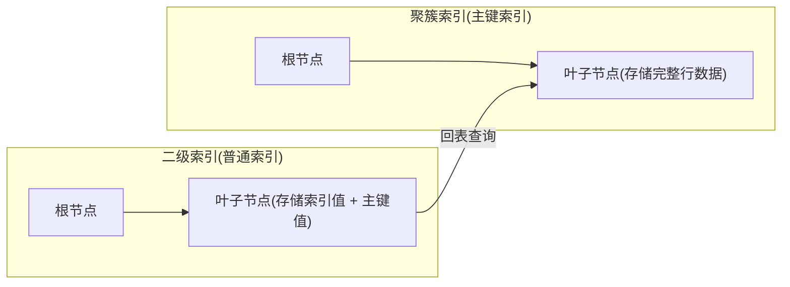

# 索引详解：从原理到优化

> **核心问题**：为什么建了索引还是慢？索引在什么情况下会失效？如何设计高效的索引？

---

## 它解决了什么问题？

索引失效是线上慢查询最常见的原因。通过深入理解B+树的底层结构和MySQL的索引机制，我发现很多性能问题源于对索引的误解。本章将从基础概念讲起，逐步深入底层原理，帮助你：

- 理解B+树如何加速查询
- 掌握聚簇索引和二级索引的区别，避免回表
- 设计合理的联合索引，减少索引数量
- 快速判断SQL是否会走索引
- 用EXPLAIN验证索引是否生效

---

## 索引基础：B+树的数据结构

在学习索引前，先想想：为什么MySQL用B+树而不是红黑树或哈希表？B+树的优势在于：

- **磁盘友好**：B+树节点大小等于磁盘页（16KB），每次IO读取一个节点，减少磁盘访问次数
- **范围查询高效**：叶子节点用双向链表连接，支持快速范围扫描
- **高度平衡**：树高通常3-4层，即使千万数据也能快速定位

### 索引的进化：从二叉树到B+树

虽然平衡二叉树（AVL）或红黑树的搜索效率是O(log n)，但它们并不适合数据库，因为：
- 树太高：每一层都可能是一次磁盘寻道
- 局部性差：逻辑上相邻的节点在物理磁盘上可能相隔很远

### 为什么选B+树？

| 对比项 | B+树 | 哈希表 | 普通B树 |
|--------|------|--------|---------|
| 范围查询 | ✅ 叶子节点链表，高效 | ❌ 不支持 | ⚠️ 需要回溯 |
| 等值查询 | ✅ O(log n) | ✅ O(1) | ✅ O(log n) |
| 排序 | ✅ 叶子节点有序 | ❌ 不支持 | ❌ 需要额外排序 |
| 磁盘IO | ✅ 非叶子节点不存数据，层数少 | - | ⚠️ 层数更多 |

> **B+树vs B树的关键差异**：B+树非叶子节点只存键值不存数据，同样大小的磁盘页能存更多键值，树的层数更少，磁盘IO次数更少。**一棵高度为3的B+树，可以存储约2000万条数据，只需3次磁盘IO。**
> **磁盘IO特性与B+树的完美匹配**：磁盘的随机读取很慢（每次寻道需要几毫秒），但连续读取速度快（每秒可达数百MB）。B+树叶子节点连续存储在磁盘上，通过双向链表连接，范围查询时只需顺序读取连续的磁盘块，大大提升性能。这就是为什么B+树比红黑树更适合数据库——它充分利用了磁盘的顺序读取优势，而不是频繁随机寻道。


**关键特点**：叶子节点通过**双向链表**连接，范围查询（如`WHERE id BETWEEN 10 AND 50`）只需找到起点，然后顺序遍历链表，无需多次回溯树根。


### 一句话描述

| MySQL概念 | 一句话描述 |
|----------|-----------|
| 全表扫描 | 在图书馆逐本翻书找内容 |
| B+树索引 | 图书馆的分类目录（先找大类，再找小类） |
| 叶子节点链表 | 目录页之间有"下一页"指针，翻页很快 |

> **我的发现**：B+树的设计完美匹配磁盘特性。根节点常驻内存，中间节点按需加载，真正实现了"少量IO，多量数据"的目标。

---

## 聚簇索引 vs 二级索引

InnoDB的索引分为两种：聚簇索引（主键索引）和二级索引（普通索引）。细小的话可能会发现查询有时快有时慢，后来才明白是回表在作怪。



| 对比项 | 聚簇索引 | 二级索引 |
|--------|---------|---------|
| 叶子节点存储 | 完整行数据 | 索引列值 + 主键值 |
| 数量 | 每表只有一个 | 可以有多个 |
| 查询效率 | 直接获取数据，无需回表 | 需要**回表**查询（除非覆盖索引） |

### 什么是回表？

通过二级索引查询时，先在二级索引B+树中找到主键值，再拿主键去聚簇索引中查完整数据，这个**二次查询**的过程叫做**回表**。

```sql
-- 假设 name 字段有普通索引
SELECT * FROM user WHERE name = 'Tom';
-- 执行过程：
-- 1. 在 name 索引树中找到 name='Tom' 对应的主键 id=5
-- 2. 拿 id=5 去主键索引树中查完整行数据（回表）
-- 3. 返回结果
```

> **底层原理**：二级索引不存行地址而存主键的原因是：如果存行地址，当数据行移动（如页分裂）时，所有二级索引都要更新，维护成本极高。存主键后，数据移动只需更新聚簇索引，二级索引不受影响。

---

## 覆盖索引：避免回表的利器

**覆盖索引**：查询的列全部在索引中，无需回表。EXPLAIN中`Extra`列显示`Using index`。

```sql
-- 建立联合索引：INDEX(name, age)

-- ✅ 覆盖索引，无需回表
SELECT name, age FROM user WHERE name = 'Tom';
-- 查询列 name、age 都在索引中，直接从索引返回

-- ❌ 需要回表
SELECT * FROM user WHERE name = 'Tom';
-- SELECT * 包含了索引之外的列，必须回表
```

> **我的思考**：覆盖索引让我意识到，索引不仅是查找工具，更是数据存储结构。合理设计索引能让查询直接在索引层完成，避免磁盘IO。

---

## 联合索引最左前缀原则

联合索引`(a, b, c)`在B+树中按a→b→c的顺序排列。如果跳过最左列，相当于在按姓氏排序的电话簿里按名字查找，无法利用有序性。

```sql
-- 建立联合索引：INDEX(a, b, c)

-- ✅ 能走索引
WHERE a = 1
WHERE a = 1 AND b = 2
WHERE a = 1 AND b = 2 AND c = 3
WHERE a = 1 AND b > 2          -- a 走索引，b 范围查询后 c 不走

-- ❌ 不能走索引
WHERE b = 2                    -- 跳过了 a
WHERE b = 2 AND c = 3          -- 跳过了 a
WHERE c = 3                    -- 跳过了 a、b
```

> **为什么有最左前缀限制**：联合索引的排序规则决定了查询必须从最左列开始。跳过a直接查b，B+树无法利用有序性，只能全表扫描。

---

## 索引失效的5大场景

通过线上排查慢查询，我总结出索引失效的常见原因：

### ❌ 场景1：对索引列使用函数

```sql
-- ❌ 函数破坏了索引的有序性
WHERE YEAR(create_time) = 2024

-- ✅ 改为范围查询
WHERE create_time >= '2024-01-01' AND create_time < '2025-01-01'
```

### ❌ 场景2：隐式类型转换

```sql
-- ❌ phone 是 varchar，传入数字，MySQL 自动转换相当于加了函数
WHERE phone = 13800138000

-- ✅ 类型匹配
WHERE phone = '13800138000'
```

> **底层原因**：类型转换时MySQL执行`CAST(phone AS SIGNED)`，隐式函数破坏索引有序性。

### ❌ 场景3：LIKE前缀通配符

```sql
-- ❌ 前缀通配符，无法利用B+树的有序性
WHERE name LIKE '%Tom%'
WHERE name LIKE '%Tom'

-- ✅ 后缀通配符可以走索引
WHERE name LIKE 'Tom%'
```

### ❌ 场景4：OR条件中有非索引列

```sql
-- ❌ name 无索引，整个OR条件退化为全表扫描
WHERE id = 1 OR name = 'Tom'

-- ✅ 两个条件都有索引才能走索引
-- 或者改用 UNION ALL
SELECT * FROM user WHERE id = 1
UNION ALL
SELECT * FROM user WHERE name = 'Tom'
```

### ❌ 场景5：联合索引不满足最左前缀

```sql
-- 索引：INDEX(a, b, c)
-- ❌ 跳过最左列a
WHERE b = 2 AND c = 3
```

---

## 主键设计建议

主键选择影响整个表的性能。我曾经用UUID做主键，结果写入性能惨不忍睹，后来才明白页分裂的危害。

| 主键类型 | 优点 | 缺点 |
|---------|------|------|
| **自增整数**（推荐） | 顺序插入，页分裂少，索引紧凑 | 可能被猜测到数量 |
| UUID | 全局唯一，分布式友好 | 随机插入，大量页分裂，索引膨胀，性能差 |
| 雪花ID | 全局唯一，趋势递增 | 需要额外组件生成 |

> **为什么UUID性能差**：UUID是随机值，每次插入都可能插到B+树中间，导致频繁**页分裂**（满页拆成两个页），产生碎片，索引文件膨胀，查询性能下降。

---

## InnoDB vs MyISAM

| 对比项 | InnoDB | MyISAM |
|--------|--------|--------|
| 事务支持 | ✅ 支持 | ❌ 不支持 |
| 锁粒度 | 行锁 | 表锁 |
| 外键 | ✅ 支持 | ❌ 不支持 |
| 崩溃恢复 | ✅ redo log 自动恢复 | ❌ 需手动修复 |
| 适用场景 | 高并发写入、事务场景 | 读多写少（已逐渐淘汰） |

> **我的发现**：MyISAM的表级锁在高并发下成为瓶颈，而InnoDB的行锁和MVCC让并发性能提升数倍。

---

## EXPLAIN执行计划

EXPLAIN是调试索引的利器。通过分析执行计划，我能快速定位性能瓶颈。

📊 核心字段速查表

| 字段 | 含义 | 调优关注点 |
| :--- | :--- | :--- |
| **id** | 查询序列号 | id相同执行顺序由上至下；id不同，值越大优先级越高。 |
| **select_type** | 查询类型 | 区分SIMPLE、PRIMARY、SUBQUERY等。 |
| **type** | **连接类型** | **最核心指标**。判断是否走索引。 |
| **possible_keys** | 可能用到的索引 | 优化器预估可能会用到的索引。 |
| **key** | **实际使用的索引** | 如果为NULL，说明没走索引。 |
| **key_len** | 索引长度 | 字节数。判断联合索引是否充分利用。 |
| **rows** | 预估扫描行数 | 扫描行数越少，性能越好。 |
| **Extra** | **额外信息** | 包含回表、文件排序、临时表等关键细节。 |

### 🎯 type：连接类型 (从优到差)

1. **`system` / `const`**: 查询命中主键或唯一索引，仅需读取一行数据。
2. **`eq_ref`**: 多表关联时，关联条件是主键或唯一索引，性能极佳。
3. **`ref`**: 使用了非唯一索引。
4. **`range`**: **范围扫描**。使用了`>`, `<`, `between`, `in`等操作。
5. **`index`**: **全索引扫描**。遍历索引树但避开数据页，通常因覆盖索引。
6. **`ALL`**: **全表扫描**。性能最差，必须优化。

### 🔍 Extra：必须警惕的"暗号"

* ✅ **`Using index`**: 极好。使用了**覆盖索引**，无需回表。
* ✅ **`Using index condition`**: 很好。索引下推，在存储引擎层过滤数据。
* ⚠️ **`Using where`**: 正常。Server层再过滤数据。
* ❌ **`Using filesort`**: **危险**。无法利用索引排序，需额外排序。
* ❌ **`Using temporary`**: **极度危险**。使用了临时表，IO开销巨大。

---

## 索引设计原则

| 原则 | 说明 |
|------|------|
| **区分度高的列放前面** | 性别（区分度低）不适合单独建索引 |
| **覆盖查询的列** | 把WHERE + SELECT的列都放进联合索引 |
| **避免冗余索引** | `(a)` 和 `(a, b)`同时存在，前者冗余 |
| **索引不是越多越好** | 每个索引都要维护，写操作变慢 |

> **我的思考**：索引设计是权衡的艺术。过多索引影响写入，过少索引影响查询。通过监控慢查询，我逐渐掌握了平衡之道。

---

## 常见问题

**Q：聚簇索引和二级索引的区别？什么是回表？如何避免回表？**

> 聚簇索引叶子节点存完整行数据，二级索引叶子节点存索引值+主键。通过二级索引查询时，先找到主键，再去聚簇索引查完整数据，这就是回表。避免回表：使用**覆盖索引**（查询列全在索引中）。

**Q：联合索引的最左前缀原则是什么？为什么有这个限制？**

> 联合索引`(a, b, c)`按a→b→c顺序排列，查询必须从最左列开始，否则无法利用有序性。就像按姓氏排序的电话簿，跳过姓氏直接按名字查，只能逐页翻。

**Q：哪些情况会导致索引失效？**

> ① 对索引列使用函数；② 隐式类型转换；③ LIKE前缀通配符；④ OR条件中有非索引列；⑤ 联合索引不满足最左前缀。

**Q：为什么推荐用自增主键而不是UUID？**

> UUID是随机值，插入时导致频繁页分裂，索引碎片多，性能差。自增主键顺序插入，页分裂少，索引紧凑，查询性能好。

**Q：B+树相比B树有什么优势？为什么MySQL选择B+树？**

> B+树非叶子节点不存数据，同样大小的磁盘页能存更多键值，树的层数更少，磁盘IO次数更少；叶子节点通过链表连接，范围查询只需顺序遍历，无需回溯。一棵高度为3的B+树可存约2000万条数据，只需3次IO。

**Q：为什么不用哈希表做索引？**

> 哈希表只支持等值查询，不支持范围查询和排序，而数据库中BETWEEN、ORDER BY、LIKE 'xxx%'等操作非常常见，B+树能全部支持。</content>
<parameter name="filePath">/home/ningx/projects/b1tzer.github.io/docs/03-mysql/索引详解.md