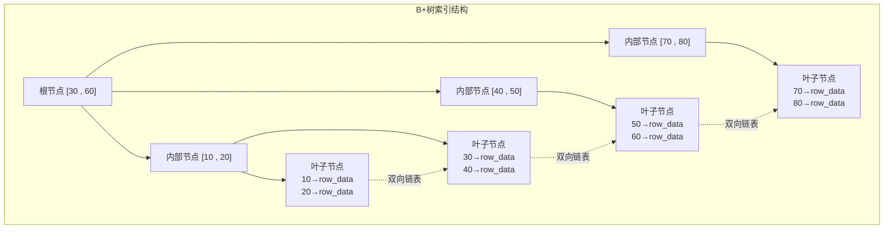
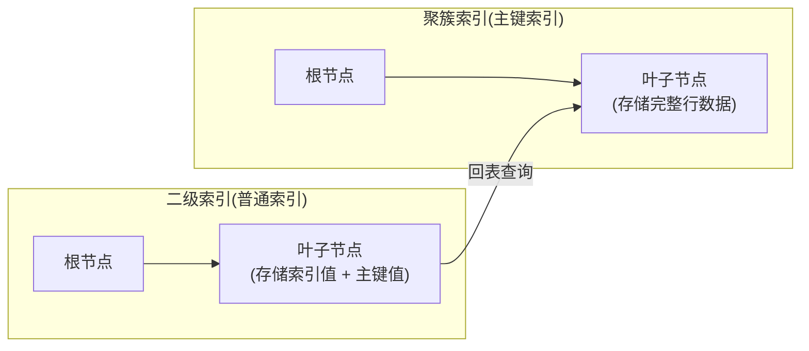

# 索引详解：从原理到优化

!!! info "**索引详解 一句话口诀**"
    **聚簇索引叶子放行数据，二级索引叶子只放主键**——拆解"回表 / 覆盖索引 / 索引下推"所有问题的根源。

    **联合索引 `(a,b,c)` 按 a→b→c 排序，跳过最左就失效**——"最左前缀"本质是 B+ 树叶子排序规则的物理后果。

    **范围查询后的列不走索引**——`WHERE a=1 AND b>2 AND c=3` 中 c 不可用，因为 b 的范围破坏了后续有序性。

    **5 大失效场景的共性是"破坏有序性"**——函数 / 隐式转换 / 前缀通配符 / OR 包非索引列 / 跳过最左，本质都是让 B+ 树没法走二分。

    **聚簇索引推荐自增整数主键**——UUID 随机插入的页分裂成本远高于"可被猜测数量"的安全成本。

<!-- -->

> 📖 **边界声明**：本文聚焦 **B+ 树结构 / 聚簇与二级索引 / 覆盖索引 / 最左前缀 / 索引失效 / 主键设计** 等机制级内容，以下主题请见对应专题：
>
> - EXPLAIN 字段详解 / SQL 二次优化案例 → [SQL执行与性能优化](@mysql-SQL执行与性能优化)
> - 索引页物理结构 / Change Buffer / Buffer Pool → [InnoDB存储引擎深度剖析](@mysql-InnoDB存储引擎深度剖析)
> - 索引线上踩坑（深分页 / 大 IN / 燎原型索引）→ [实战问题与避坑指南](@mysql-实战问题与避坑指南)
> - 主键选型铁律（自增 / 雪花 / UUIDv7）→ [数据类型与表设计规范](@mysql-数据类型与表设计规范)

---

## 1. 类比：索引就像图书馆的目录

想象你在一个百万册图书的图书馆找一本书。**没有目录**，你得逐本翻阅（全表扫描，O(N)）；有了**分类目录**（B+ 树索引），你先在目录里按"总类 → 学科 → 书名"三级定位到书架编号（3 次 IO），再去取书——**千万级数据也只需 3~4 次磁盘 IO**。

| 图书馆场景 | MySQL 对应 | 关键原理 |
| :-- | :-- | :-- |
| **目录分层放**（总类→学科→书名） | B+ 树非叶子节点只存键、不存数据 | 同样大小的页能装更多键，树更矮 |
| **目录按字母排序** | B+ 树叶子节点有序 | 支持范围查询、排序不用二次排 |
| **目录页之间有"下一页"指针** | 叶子节点双向链表 | `BETWEEN` / `ORDER BY` 顺序扫描 |
| **书架编号=目录页主字段** | 聚簇索引叶子=完整行数据 | 主键查询不用回表 |
| **书签记"书名→书架编号"** | 二级索引叶子=索引值+主键 | 查完二级索引要"回表"取完整行 |
| **部分目录页本身带摘要** | 覆盖索引 | 只要查询列都在索引里，连书都不用取 |

**一句话**：索引是**用空间换时间**的数据结构——多维护一份 B+ 树，查询从 O(N) 降到 O(log N)。下文每一节都在讲「这棵 B+ 树到底长什么样、什么时候用得上、什么时候白建了」。

---

## 2. 它解决了什么问题？

索引失效是线上慢查询最常见的原因。通过深入理解 B+ 树的底层结构和 MySQL 的索引机制，可以发现很多性能问题源于对索引的误解。本章将从基础概念讲起，逐步深入底层原理，帮助你：

- 理解 B+ 树如何加速查询
- 掌握聚簇索引和二级索引的区别，避免回表
- 设计合理的联合索引，减少索引数量
- 快速判断 SQL 是否会走索引
- 用 `EXPLAIN` 验证索引是否生效

### 2.1 没有索引 vs 有索引：一张表看清差距

假设 `orders` 表有 1000 万行、`user_id` 列在业务上仅重复 ≤ 10 次：

```sql
-- ❌ 无索引：全表扫描
SELECT * FROM orders WHERE user_id = 12345;
```

```sql
-- EXPLAIN 输出（未建索引）
+----+-------+------+---------+---------+----------+-------------+
| id | type  | key  | key_len | rows    | filtered | Extra       |
+----+-------+------+---------+---------+----------+-------------+
|  1 | ALL   | NULL | NULL    | 9823451 |    10.00 | Using where |
+----+-------+------+---------+---------+----------+-------------+
-- 实测耗时：~4.2 s，扫描近千万行
```

```sql
-- ✅ 建索引后：走 B+ 树
ALTER TABLE orders ADD INDEX idx_user (user_id);
SELECT * FROM orders WHERE user_id = 12345;
```

```sql
-- EXPLAIN 输出（已建索引）
+----+------+----------+---------+------+----------+-------+
| id | type | key      | key_len | rows | filtered | Extra |
+----+------+----------+---------+------+----------+-------+
|  1 | ref  | idx_user | 4       |   10 |   100.00 | NULL  |
+----+------+----------+---------+------+----------+-------+
-- 实测耗时：~1.5 ms，定位 10 行
```

| 对比项 | 无索引 | 有索引（B+ 树） |
| :-- | :-- | :-- |
| `type` | `ALL`（全表扫描） | `ref`（索引查找） |
| 扫描行数 | ~1000 万 | ~10 |
| 耗时 | ~4200 ms | ~1.5 ms |
| 量级 | O(N) | O(log N) |

**3 个数量级的差距**——这就是索引存在的意义。但别高兴太早：索引也有代价——每次 `INSERT/UPDATE/DELETE` 都要维护 B+ 树，**索引不是越多越好**（详见 §11 设计原则）。下文每一节都在回答同一个问题：**这棵 B+ 树到底什么时候用得上、什么时候白建了**。

---

## 3. 索引基础：B+树的数据结构

在学习索引前，先想想：为什么MySQL用B+树而不是红黑树或哈希表？B+树的优势在于：

- **磁盘友好**：B+树节点大小等于磁盘页（16KB），每次IO读取一个节点，减少磁盘访问次数
- **范围查询高效**：叶子节点用双向链表连接，支持快速范围扫描
- **高度平衡**：树高通常3-4层，即使千万数据也能快速定位

### 3.1 索引的进化：从二叉树到B+树

虽然平衡二叉树（AVL）或红黑树的搜索效率是O(log n)，但它们并不适合数据库，因为：

- 树太高：每一层都可能是一次磁盘寻道
- 局部性差：逻辑上相邻的节点在物理磁盘上可能相隔很远

### 3.2 为什么选B+树？

| 对比项 | B+树 | 哈希表 | 普通B树 |
| :--- | :--- | :--- | :--- |
| 范围查询 | ✅ 叶子节点链表，高效 | ❌ 不支持 | ⚠️ 需要回溯 |
| 等值查询 | ✅ O(log n) | ✅ O(1) | ✅ O(log n) |
| 排序 | ✅ 叶子节点有序 | ❌ 不支持 | ❌ 需要额外排序 |
| 磁盘IO | ✅ 非叶子节点不存数据，层数少 | - | ⚠️ 层数更多 |

!!! note "📖 术语家族：`MySQL 索引结构族`"
    **字面义**：按**数据结构类型**划分的索引家族——不同结构决定了支持哪些查询模式。
    **在 MySQL 中的含义**：InnoDB 默认用 B+ 树（覆盖 99% 场景），Memory 引擎可选 Hash，全文检索用 FULLTEXT（倒排索引），空间数据用 R-Tree。**能不能走索引、走什么索引，本质看查询模式与结构的匹配度**。
    **同家族成员**：

    | 成员 | 数据结构 | 支持查询 | 典型用途 |
    | :-- | :-- | :-- | :-- |
    | `BTREE` | B+ 树（多叉平衡树，叶子双向链表） | 等值、范围、排序、`LIKE 'x%'` | InnoDB 默认，99% 场景 |
    | `HASH` | 哈希表 | **只支持**等值 `=` / `IN` | Memory 引擎；InnoDB 的**自适应哈希索引 AHI**（内部优化） |
    | `FULLTEXT` | 倒排索引（词→文档列表） | `MATCH() AGAINST()` 全文检索 | 长文本模糊搜索（InnoDB 5.6+ 支持）|
    | `SPATIAL`（R-Tree）| R 树（空间索引）| `ST_Contains` / `ST_Intersects` 等 | GEOMETRY 空间字段 |

    **命名规律**：`CREATE INDEX ... USING <类型>` 显式指定结构；未指定时 InnoDB 一律走 BTREE。**选型铁律**：除非做全文检索或空间查询，其它场景**无脑 BTREE**——Hash 不支持范围与排序、AHI 由引擎自动管理不用手动建。

> **B+树vs B树的关键差异**：B+树非叶子节点只存键值不存数据，同样大小的磁盘页能存更多键值，树的层数更少，磁盘IO次数更少。**一棵高度为3的B+树，可以存储约2000万条数据，只需3次磁盘IO。**
> **磁盘IO特性与B+树的完美匹配**：磁盘的随机读取很慢（每次寻道需要几毫秒），但连续读取速度快（每秒可达数百MB）。B+树叶子节点连续存储在磁盘上，通过双向链表连接，范围查询时只需顺序读取连续的磁盘块，大大提升性能。这就是为什么B+树比红黑树更适合数据库——它充分利用了磁盘的顺序读取优势，而不是频繁随机寻道。


**关键特点**：叶子节点通过**双向链表**连接，范围查询（如`WHERE id BETWEEN 10 AND 50`）只需找到起点，然后顺序遍历链表，无需多次回溯树根。



### 3.3 一句话描述

| MySQL概念 | 一句话描述 |
| :--- | :--- |
| 全表扫描 | 在图书馆逐本翻书找内容 |
| B+树索引 | 图书馆的分类目录（先找大类，再找小类） |
| 叶子节点链表 | 目录页之间有"下一页"指针，翻页很快 |

> **我的发现**：B+树的设计完美匹配磁盘特性。根节点常驻内存，中间节点按需加载，真正实现了"少量IO，多量数据"的目标。

---

## 4. 聚簇索引 vs 二级索引

InnoDB的索引分为两种：聚簇索引（主键索引）和二级索引（普通索引）。细小的话可能会发现查询有时快有时慢，后来才明白是回表在作怪。



| 对比项 | 聚簇索引 | 二级索引 |
| :--- | :--- | :--- |
| 叶子节点存储 | 完整行数据 | 索引列值 + 主键值 |
| 数量 | 每表只有一个 | 可以有多个 |
| 查询效率 | 直接获取数据，无需回表 | 需要**回表**查询（除非覆盖索引） |

### 4.1 什么是回表？

通过二级索引查询时，先在二级索引B+树中找到主键值，再拿主键去聚簇索引中查完整数据，这个**二次查询**的过程叫做**回表**。

```sql
-- 假设 name 字段有普通索引
SELECT * FROM user WHERE name = 'Tom';
-- 执行过程：
-- 1. 在 name 索引树中找到 name='Tom' 对应的主键 id=5
-- 2. 拿 id=5 去主键索引树中查完整行数据（回表）
-- 3. 返回结果
```

> **底层原理**：二级索引不存行地址而存主键的原因是：如果存行地址，当数据行移动（如页分裂）时，所有二级索引都要更新，维护成本极高。存主键后，数据移动只需更新聚簇索引，二级索引不受影响。

---

## 5. 覆盖索引：避免回表的利器

**覆盖索引**：查询的列全部在索引中，无需回表。EXPLAIN中`Extra`列显示`Using index`。

```sql
-- 建立联合索引：INDEX(name, age)

-- ✅ 覆盖索引，无需回表
SELECT name, age FROM user WHERE name = 'Tom';
-- 查询列 name、age 都在索引中，直接从索引返回

-- ❌ 需要回表
SELECT * FROM user WHERE name = 'Tom';
-- SELECT * 包含了索引之外的列，必须回表
```

> **我的思考**：覆盖索引让我意识到，索引不仅是查找工具，更是数据存储结构。合理设计索引能让查询直接在索引层完成，避免磁盘IO。

### 5.1 索引下推（ICP）：在索引层就干完过滤

**索引下推**（Index Condition Pushdown，**ICP**，MySQL 5.6+ 默认开启）是覆盖索引的"亲兄弟"——当**查询列必须回表**但 **WHERE 里有多个联合索引列**时，ICP 让 MySQL **在引擎层用索引里的列先过滤一遍**，再拿剩下的主键去回表。

**反例（无 ICP，传统流程）**：

```sql
-- 联合索引：INDEX(city, age)
SELECT * FROM user WHERE city = 'BJ' AND age > 30;
```

1. 引擎层：按 `city='BJ'` 在二级索引扫出 **10 万**条匹配主键
2. **全部回表** 拿到完整行
3. Server 层：在 10 万行里按 `age > 30` 过滤剩 **1 万**

**→ 10 万次回表、其中 9 万是白做的**：

**正例（ICP 开启）**：

1. 引擎层：按 `city='BJ'` 定位后，**顺手在索引里继续判断 `age > 30`**
2. 只把过滤后的 **1 万**条主键拿去回表
3. Server 层直接返回

**→ 回表次数 10 万 → 1 万，减少 90%**：

**识别方式**：`EXPLAIN` 的 `Extra` 列出现 `Using index condition` 即为 ICP 生效。

!!! tip "覆盖索引 vs 索引下推 一句话区分"
    **覆盖索引**：查询列全在索引里，**根本不回表**（`Using index`）
    **索引下推**：查询列不全在索引里，但 **WHERE 条件能在索引层先过滤**，减少回表次数（`Using index condition`）

> 📖 线上慢查询中 ICP 失效的排查流程（如子查询、函数、`LIKE '%x'` 会禁用 ICP）详见 [SQL执行与性能优化](@mysql-SQL执行与性能优化)。

---

## 6. 联合索引最左前缀原则

联合索引`(a, b, c)`在B+树中按a→b→c的顺序排列。如果跳过最左列，相当于在按姓氏排序的电话簿里按名字查找，无法利用有序性。

```sql
-- 建立联合索引：INDEX(a, b, c)

-- ✅ 能走索引
WHERE a = 1
WHERE a = 1 AND b = 2
WHERE a = 1 AND b = 2 AND c = 3
WHERE a = 1 AND b > 2          -- a 走索引，b 范围查询后 c 不走

-- ❌ 不能走索引
WHERE b = 2                    -- 跳过了 a
WHERE b = 2 AND c = 3          -- 跳过了 a
WHERE c = 3                    -- 跳过了 a、b
```

> **为什么有最左前缀限制**：联合索引的排序规则决定了查询必须从最左列开始。跳过a直接查b，B+树无法利用有序性，只能全表扫描。

---

## 7. 索引失效的5大场景

通过线上排查慢查询，我总结出索引失效的常见原因：

### 7.1 ❌ 对索引列使用函数

```sql
-- ❌ 函数破坏了索引的有序性
WHERE YEAR(create_time) = 2024

-- ✅ 改为范围查询
WHERE create_time >= '2024-01-01' AND create_time < '2025-01-01'
```

### 7.2 ❌ 隐式类型转换

```sql
-- ❌ phone 是 varchar，传入数字，MySQL 自动转换相当于加了函数
WHERE phone = 13800138000

-- ✅ 类型匹配
WHERE phone = '13800138000'
```

> **底层原因**：类型转换时MySQL执行`CAST(phone AS SIGNED)`，隐式函数破坏索引有序性。

### 7.3 ❌ LIKE前缀通配符

```sql
-- ❌ 前缀通配符，无法利用B+树的有序性
WHERE name LIKE '%Tom%'
WHERE name LIKE '%Tom'

-- ✅ 后缀通配符可以走索引
WHERE name LIKE 'Tom%'
```

### 7.4 ❌ OR条件中有非索引列

```sql
-- ❌ name 无索引，整个OR条件退化为全表扫描
WHERE id = 1 OR name = 'Tom'

-- ✅ 两个条件都有索引才能走索引
-- 或者改用 UNION ALL
SELECT * FROM user WHERE id = 1
UNION ALL
SELECT * FROM user WHERE name = 'Tom'
```

### 7.5 ❌ 联合索引不满足最左前缀

```sql
-- 索引：INDEX(a, b, c)
-- ❌ 跳过最左列a
WHERE b = 2 AND c = 3
```

---

## 8. 主键设计：为什么它是索引原理的一部分

主键设计本质上**就是聚簇索引设计**——聚簇索引叶子存完整行数据，而叶子按主键值物理有序排列。**主键的写入模式直接决定 B+ 树的页分裂频率**。

### 8.1 顺序插入 vs 随机插入：页分裂的由来

```txt
自增整数主键（1, 2, 3, 4, ...）：
  每次 INSERT 都追加到 B+ 树最右侧的叶子页
  → 页写满了，只需申请新页挂到链表右侧
  → 零页分裂、索引紧凑

UUID 主键（随机值）：
  每次 INSERT 都可能落在 B+ 树中间的任意位置
  → 目标页已满时必须"页分裂"（一页拆成两页）
  → 产生大量内部碎片、索引膨胀 2~3 倍、写放大
```

### 8.2 索引角度的主键选型原则

| 原则 | 技术依据 |
| :-- | :-- |
| 主键必须**单调递增或趋势递增** | 保证 B+ 树顺序插入，避免页分裂 |
| 主键必须**尽量短**（`BIGINT` 8B < `CHAR(36)` 36B） | 所有二级索引叶子都存主键副本，主键越短二级索引越小 |
| 主键必须**非 NULL 且唯一** | InnoDB 无显式主键时会内部生成 6 字节 `ROW_ID`，但无法利用业务语义 |

> 📖 **选型铁律**（自增 / 雪花 / UUIDv7 / Leaf / TinyID 的业务场景对比、分布式 ID 生成器搭建）详见 [数据类型与表设计规范](@mysql-数据类型与表设计规范) §主键设计，本文不重复展开。

---

## 9. InnoDB vs MyISAM：索引存储模型的本质差异

从**索引**角度看，两者最根本的差异是**数据与索引是否合一**：

| 索引特性 | InnoDB | MyISAM |
| :-- | :-- | :-- |
| 索引组织方式 | **索引即数据**（聚簇索引叶子=完整行） | **索引与数据分离**（索引叶子=行地址指针） |
| 主键索引 | 叶子存行数据，主键查询不回表 | 叶子存行地址，查完主键索引再去 `.MYD` 文件取行 |
| 二级索引叶子存储 | 索引值 + **主键值**（需回表） | 索引值 + **行地址**（直接定位） |
| 表级数据移动成本 | 低（只改聚簇索引） | 高（所有索引都存地址，行移动需全量更新） |

**关键推论**：MyISAM 的"索引与数据分离"模型让二级索引查询不需要回表，单纯看查询速度反而可能更快；但**行移动成本极高**（所有索引都要改地址）、**无事务无崩溃恢复**、**表级锁**三个硬伤让它在 OLTP 场景下完败给 InnoDB——MySQL 8.0 起连系统表都迁到了 InnoDB，业务表没有理由再用 MyISAM。

> 📖 引擎选型的完整对比（事务、锁粒度、崩溃恢复、适用场景）见 [MySQL整体架构 §4.3](@mysql-MySQL整体架构)，本文只强调索引角度的差异。

---

## 10. EXPLAIN 执行计划（速查版）

> 📖 **字段详解 / 线上调优案例 见** [SQL执行与性能优化](@mysql-SQL执行与性能优化) `EXPLAIN` 章节。本处只给两张最常用的"老马警示表"。

**`type` 从优到差**：
`system`/`const` → `eq_ref` → `ref` → `range` → `index` → `ALL`（看到 `ALL` 即报警）。

**`Extra` 必警惕的 4 个暗号**：

| 标志 | 判定 | 处置 |
| :-- | :-- | :-- |
| `Using index` | ✅ 覆盖索引，最优 | 保持 |
| `Using index condition` | ✅ 索引下推（ICP） | 保持 |
| `Using where` | ⚠️ Server 层再过滤 | 正常 |
| `Using filesort` | ❌ 没走索引排序 | 追索引或改 SQL |
| `Using temporary` | ❌ 用了临时表 | 立刻优化 |

---

## 11. 索引设计原则

| 原则 | 说明 |
| :--- | :--- |
| **区分度高的列放前面** | 性别（区分度低）不适合单独建索引 |
| **覆盖查询的列** | 把WHERE + SELECT的列都放进联合索引 |
| **避免冗余索引** | `(a)` 和 `(a, b)`同时存在，前者冗余 |
| **索引不是越多越好** | 每个索引都要维护，写操作变慢 |

> **我的思考**：索引设计是权衡的艺术。过多索引影响写入，过少索引影响查询。通过监控慢查询，我逐渐掌握了平衡之道。

---

## 12. 常见问题

**Q：聚簇索引和二级索引的区别？什么是回表？如何避免回表？**

> 聚簇索引叶子节点存完整行数据，二级索引叶子节点存索引值+主键。通过二级索引查询时，先找到主键，再去聚簇索引查完整数据，这就是回表。避免回表：使用**覆盖索引**（查询列全在索引中）。

**Q：联合索引的最左前缀原则是什么？为什么有这个限制？**

> 联合索引`(a, b, c)`按a→b→c顺序排列，查询必须从最左列开始，否则无法利用有序性。就像按姓氏排序的电话簿，跳过姓氏直接按名字查，只能逐页翻。

**Q：哪些情况会导致索引失效？**

> ① 对索引列使用函数；② 隐式类型转换；③ LIKE前缀通配符；④ OR条件中有非索引列；⑤ 联合索引不满足最左前缀。

**Q：为什么推荐用自增主键而不是UUID？**

> UUID是随机值，插入时导致频繁页分裂，索引碎片多，性能差。自增主键顺序插入，页分裂少，索引紧凑，查询性能好。

**Q：B+树相比B树有什么优势？为什么MySQL选择B+树？**

> B+树非叶子节点不存数据，同样大小的磁盘页能存更多键值，树的层数更少，磁盘IO次数更少；叶子节点通过链表连接，范围查询只需顺序遍历，无需回溯。一棵高度为3的B+树可存约2000万条数据，只需3次IO。

**Q：为什么不用哈希表做索引？**

> 哈希表只支持等值查询，不支持范围查询和排序，而数据库中BETWEEN、ORDER BY、LIKE 'xxx%'等操作非常常见，B+树能全部支持。

---

## 13. 一句话口诀

> **索引是 B+ 树 + 空间换时间**——聚簇索引叶子即行数据、二级索引叶子存主键，一切"回表 / 覆盖 / ICP"的问题都由此衍生；**凡破坏有序性的查询都不走索引**——函数、隐式转换、前缀通配符、OR 杂糅、跳过最左，五大失效场景本质同根；**主键设计就是聚簇索引设计**，单调递增＋尽量短是铁律。
