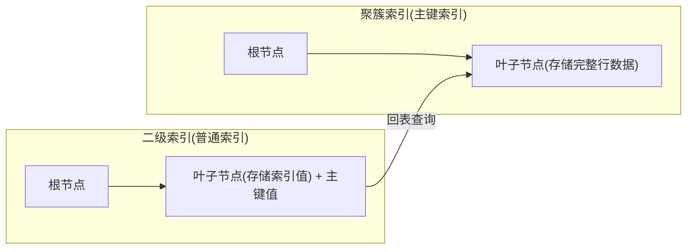
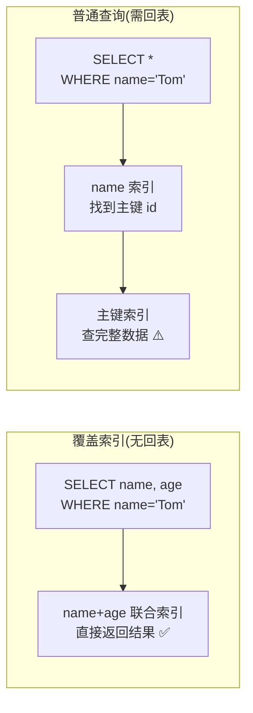

# 聚簇索引与覆盖索引

> **核心问题**：为什么二级索引查询需要"回表"？如何避免回表提升性能？

---

## 它解决了什么问题？

理解聚簇索引和二级索引的区别，能帮你：
- 解释为什么 `SELECT *` 比 `SELECT id, name` 慢
- 设计出能避免回表的覆盖索引
- 理解为什么主键推荐用自增整数而不是 UUID

---

## 聚簇索引 vs 二级索引



| 对比项 | 聚簇索引 | 二级索引 |
|--------|---------|---------| 
| 叶子节点存储 | 完整行数据 | 索引列值 + 主键值 |
| 数量 | 每表只有一个 | 可以有多个 |
| 查询 | 直接获取数据 | 需要**回表**查询（除非覆盖索引） |

---

## 什么是回表？

通过二级索引查询时，先在二级索引 B+ 树中找到主键值，再拿主键去聚簇索引中查完整数据，这个**二次查询**的过程叫做**回表**。

```sql
-- 假设 name 字段有普通索引
SELECT * FROM user WHERE name = 'Tom';
-- 执行过程：
-- 1. 在 name 索引树中找到 name='Tom' 对应的主键 id=5
-- 2. 拿 id=5 去主键索引树中查完整行数据（回表）
-- 3. 返回结果
```

> **为什么二级索引存主键而不是行地址**：如果存行地址，当数据行移动（如页分裂）时，所有二级索引都要更新，维护成本极高。存主键后，数据移动只需更新聚簇索引，二级索引不受影响。

---

## 覆盖索引：避免回表的利器

**覆盖索引**：查询的列全部在索引中，无需回表。EXPLAIN 中 `Extra` 列显示 `Using index`。

```sql
-- 建立联合索引：INDEX(name, age)

-- ✅ 覆盖索引，无需回表
SELECT name, age FROM user WHERE name = 'Tom';
-- 查询列 name、age 都在索引中，直接从索引返回

-- ❌ 需要回表
SELECT * FROM user WHERE name = 'Tom';
-- SELECT * 包含了索引之外的列，必须回表
```



---

## 主键设计建议

| 主键类型 | 优点 | 缺点 |
|---------|------|------|
| **自增整数**（推荐） | 顺序插入，页分裂少，索引紧凑 | 可能被猜测到数量 |
| UUID | 全局唯一，分布式友好 | 随机插入，大量页分裂，索引膨胀，性能差 |
| 雪花 ID | 全局唯一，趋势递增 | 需要额外组件生成 |

> **为什么 UUID 作为主键性能差**：UUID 是随机值，每次插入都可能插到 B+ 树的中间位置，导致频繁的**页分裂**（将一个满页拆成两个页），产生大量碎片，索引文件膨胀，查询性能下降。

---

## InnoDB vs MyISAM

| 对比项 | InnoDB | MyISAM |
|--------|--------|--------|
| 事务支持 | ✅ 支持 | ❌ 不支持 |
| 锁粒度 | 行锁 | 表锁 |
| 外键 | ✅ 支持 | ❌ 不支持 |
| 崩溃恢复 | ✅ redo log 自动恢复 | ❌ 需手动修复 |
| 适用场景 | 高并发写入、事务场景 | 读多写少（已逐渐淘汰） |

> **结论**：现代 MySQL 项目几乎都应使用 InnoDB，MyISAM 已逐渐被淘汰。

---

## 常见问题

**Q：聚簇索引和二级索引的区别？什么是回表？如何避免回表？**

> 聚簇索引叶子节点存完整行数据，二级索引叶子节点存索引值+主键。通过二级索引查询时，先找到主键，再去聚簇索引查完整数据，这就是回表。避免回表：使用**覆盖索引**（查询列全在索引中）。

**Q：为什么推荐用自增主键而不是 UUID？**

> UUID 是随机值，插入时会导致频繁页分裂，索引碎片多，性能差。自增主键顺序插入，页分裂少，索引紧凑，查询性能好。

**Q：解释为什么 `SELECT *` 比 `SELECT id, name` 慢？**

> 从数据库架构和底层执行逻辑来看，SELECT * 慢于指定字段查询，主要并非因为“打字多”，而是涉及到磁盘 I/O、内存带宽以及索引利用率的深度差异。
1. 索引覆盖 (Index Covering)：如果查询的 id, name 已经在某个辅助索引（Secondary Index）中包含了，MySQL 可以直接从索引树中返回数据，无需访问表数据文件。SELECT 绝大多数情况下，由于索引不包含所有列，引擎必须执行*回表（Lookup）**操作。辅助索引树中只存主键值。回表意味着根据主键再去聚簇索引（Clustered Index）中查找整行记录，又增加了额外的随机磁盘 I/O。
2. I/O 与内存开销 (I/O & Memory Overhead)：数据库是以 Page（页，默认 16KB） 为单位加载数据的。SELECT * 会获取包括 TEXT、BLOB 等大字段在内的所有数据。单行数据变大，意味着一个 Page 能容纳的行数变少。加载同样行数的数据，SELECT * 需要从磁盘读取更多的 Page，消耗更多的 I/O 带宽和 Buffer Pool 缓存空间。
3. 网络传输与序列化 (Network & Serialization)：更多的字段意味着更大的网络数据包（Payload）。对于分布式系统或高并发场景，网络带宽往往是瓶颈。CPU 消耗： 应用程序在接收数据后，需要对结果集进行反序列化（Deserialization）。字段越多，CPU 解析并映射到对象（ORM）上的开销就越大。
4. 优化器失去优化空间: 使用 SELECT * 会让数据库优化器（Optimizer）变得保守, 在执行 ORDER BY 时，如果字段过多，内存中的 sort_buffer 可能装不下，导致数据库不得不使用磁盘临时表进行文件排序（Filesort），性能大幅下降。