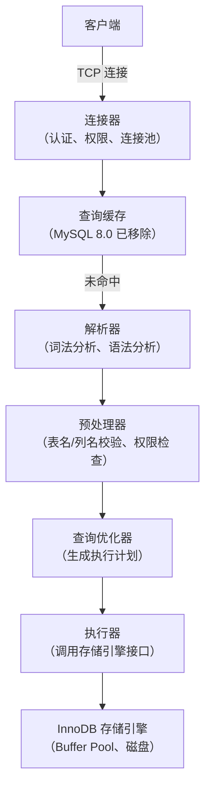
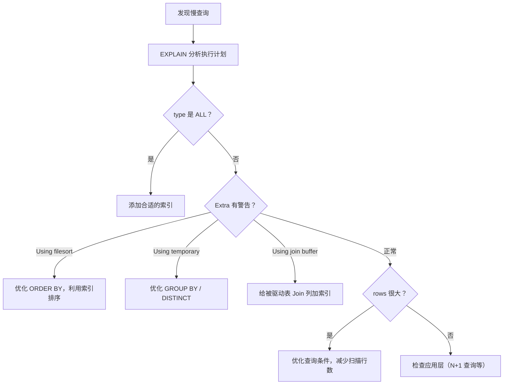

# SQL 执行与性能优化

!!! info "**SQL 执行与性能优化 一句话口诀**"
    **SQL 走四层：连接器 → 解析器 → 优化器 → 执行器**——8.0 已删除查询缓存，出问题先定位哪层。

    **优化器选索引靠 Cardinality，统计信息过期就会选错**——`ANALYZE TABLE` / `FORCE INDEX` / 覆盖索引是三张底牌。

    **EXPLAIN 看五列**：`type`（访问类型）/ `key`（真走索引）/ `key_len`（联合索引用多长）/ `rows`（扫描行）/ `Extra`（暗号）。

    **Join 原则：小表驱动大表 + 被驱动表走索引**——NLJ 要索引，没索引就退化 BNL（8.0.18+ 改走 Hash Join）。

    **深分页用延迟关联**：先走覆盖索引查主键，再 JOIN 回表拿数据，避免大 offset 扫后丢弃。

<!-- -->

> 📖 **边界声明**：本文聚焦 **SQL 执行链路 / 优化器代价模型 / EXPLAIN 字段 / Join 算法 / 慢查询排查**，以下主题请见对应专题：
>
> - 索引结构与失效原理 → [索引详解](@mysql-索引详解)
> - 缓冲池 / Change Buffer / 索引下推物理层实现 → [InnoDB存储引擎深度剖析](@mysql-InnoDB存储引擎深度剖析)
> - 线上慢 SQL 实战案例（N+1 / 大 IN / 燎原型 SQL）→ [实战问题与避坑指南](@mysql-实战问题与避坑指南)

---

## 1. 类比：SQL 执行像餐厅下单

你在餐厅点一份"半糖铁观音奋斗大杯波霸长岛冰茶"（多表 JOIN 的复杂 SQL）——亲眼见证设计给人的骚操：

| 餐厅环节 | MySQL 对应 | 关键点 |
| :-- | :-- | :-- |
| **门口领位员**验班、带位 | 连接器 认证 / 权限 / 绑 THD | 不负责點菜，只负责让你进店 |
| **服务生**听懂你的點菜词（不管做不做得出来） | 解析器 词法/语法 分析 | 只管语法对不对，不管菜有没有 |
| **领班**查后厨有没有材料、巴台有没有杆子、你有没有克位 | 预处理器 查表/列/权限 | 语义校验，不做就变「报错给你」 |
| **主厨**规划办菜顺序：这菜最快 / 那菜先做 | 优化器 代价模型 选计划 | 指挥走哪条索引、谁 Join 谁 |
| **小工**逐个切菜、炒菜、传菜 | 执行器 调 Handler API | 几步执行，输出结果 |
| **小工**把菜拿到备菜区，再交给服务员 | 存储引擎 读写页 | Buffer Pool / 磁盘 |

**关键认知**：同一道菜可以有**很多种做法**——老师傅会按“哪种最快”选，但前提是他“猜出来哪条索引压力小”。这个“猜”就是**代价模型 + 统计信息**的职责——统计信息一旦过期，老师傅就会猜错，走的计划就很慢。下文每一节都在围绕“代价模型怎么算 / 怎么看 / 怎么干预”。

---

## 2. 它解决了什么问题？

理解 SQL 执行原理和性能优化工具，能帮助你：

- 知道 SQL 在哪个环节出了问题（连接层、解析层、优化层、执行层）
- 理解优化器为什么选择某个索引，以及如何干预
- 掌握 Join 的底层算法，写出高效的多表查询
- 用 EXPLAIN 分析执行计划，找到真正的性能瓶颈
- 掌握常见的 SQL 优化手段

---

## 3. SQL 执行全链路



### 3.1 各层职责

| 层次 | 职责 | 常见问题 |
| :--- | :--- | :--- |
| **连接器** | 认证用户、管理连接、分配权限 | 连接数过多（`Too many connections`） |
| **解析器** | 词法/语法分析，生成语法树 | SQL 语法错误 |
| **预处理器** | 验证表名列名是否存在，检查权限 | 表不存在、列名错误 |
| **优化器** | 选择最优执行计划（索引选择、Join 顺序） | 选错索引、执行计划不优 |
| **执行器** | 按执行计划调用存储引擎接口 | 权限不足 |

---

## 4. 查询优化器：代价模型

优化器的目标是找到**代价最小**的执行计划。代价 = IO 代价 + CPU 代价。

### 4.1 统计信息

优化器依赖统计信息做决策：

```sql
-- 查看表的统计信息
SHOW TABLE STATUS LIKE 'user'\G

-- 查看索引的统计信息（Cardinality：索引列的唯一值数量）
SHOW INDEX FROM user;

-- 手动更新统计信息（统计信息过期时优化器可能选错索引）
ANALYZE TABLE user;
```

**Cardinality（基数）**：索引列唯一值的数量。基数越高，索引区分度越好，优化器越倾向于使用该索引。

### 4.2 优化器选错索引的场景

```sql
-- 场景：明明有更好的索引，优化器却选了全表扫描
SELECT * FROM orders WHERE status = 1 ORDER BY create_time;

-- 原因：优化器估算走索引后需要大量回表，代价比全表扫描还高

-- 解决方案1：强制指定索引
SELECT * FROM orders FORCE INDEX(idx_create_time) WHERE status = 1 ORDER BY create_time;

-- 解决方案2：更新统计信息
ANALYZE TABLE orders;

-- 解决方案3：优化索引设计（覆盖索引避免回表）
ALTER TABLE orders ADD INDEX idx_status_time(status, create_time);
```

---

## 5. EXPLAIN 执行计划分析

### 5.1 EXPLAIN 关键字段

```sql
EXPLAIN SELECT * FROM user WHERE name = 'Tom' AND age > 18;
```

| 字段 | 含义 | 重点关注值 |
| :--- | :--- | :--- |
| **type** | 访问类型（性能从好到差） | `system > const > eq_ref > ref > range > index > ALL` |
| **key** | 实际使用的索引 | NULL 表示未使用索引 |
| **key_len** | 索引使用的字节数 | 越长说明使用了更多索引列 |
| **rows** | 预估扫描行数 | 越小越好 |
| **Extra** | 额外信息 | `Using index`（覆盖索引）、`Using filesort`（需优化）、`Using temporary`（需优化） |

!!! note "📖 术语家族：`EXPLAIN 输出字段族`"
    **字面义**：`EXPLAIN` = "解释"——告诉你优化器打算怎么跑这条 SQL。输出的**每一列都是诊断信号**，不是装饰。
    **在 MySQL 中的含义**：每一行 EXPLAIN 输出对应执行计划中的一个**访问节点**（一张表/一个子查询/一个UNION分支），各字段从"访问什么数据"、"用什么方式访问"、"访问代价多大"、"额外做了什么"四个角度描述。
    **同家族成员**：

    | 成员 | 读法 | 重点用法 |
    | :-- | :-- | :-- |
    | `id` | 查询形态 | 多表/子查询时 id 越大越先执行；id 相同按顺序 |
    | `select_type` | 查询类型 | `SIMPLE`/`PRIMARY`/`SUBQUERY`/`DERIVED`/`UNION` |
    | `table` | 访问的表 | 只有 `<derivedN>` 是派生表（子查询临时表）|
    | `partitions` | 命中的分区 | 仅分区表需看 |
    | `type` 🔥 | **访问类型**（性能从优到差）| `system`/`const`/`eq_ref`/`ref`/`range`/`index`/`ALL`——看到 `ALL` 就要优化 |
    | `possible_keys` | 优化器考虑的索引 | 仅供诊断用，不等于实际用 |
    | `key` 🔥 | **实际使用的索引** | NULL = 没走索引 |
    | `key_len` | **用了索引的多少个字节** | 联合索引用来判断走了几个列 |
    | `ref` | 与索引比较的列/常量 | `const`/`func`/表.列 |
    | `rows` 🔥 | **预估扫描行数** | 越小越好；和实际相差过大说明统计信息过期 |
    | `filtered` | 满足条件的行占扫描行比例 | 小且 rows 大 = 劳而无功 |
    | `Extra` 🔥 | **额外行为** | 看到 `Using filesort`/`Using temporary` 立刻优化 |

    **命名规律**：带 🔥 的四列（`type` / `key` / `rows` / `Extra`）是**优先级最高的四张诊断牌**——看 EXPLAIN 先刷这四列，其它是辅助证据。**作为该家族的源头文档**，后续其它文档涉及 EXPLAIN 字段时通过 `📖` 引用本节。

### 5.2 type 类型详解

```txt
system      → 表只有一行（系统表）
const       → 主键或唯一索引等值查询，最多一行（最优）
eq_ref      → JOIN 时使用主键或唯一索引
ref         → 普通索引等值查询
range       → 索引范围查询（BETWEEN、>、<、IN）
index       → 全索引扫描（比 ALL 好，但仍需关注）
ALL         → 全表扫描（⚠️ 需要优化）
```


### 5.3 Extra 字段含义

| Extra 值 | 含义 | 是否需要优化 |
| :--- | :--- | :--- |
| `Using index` | 覆盖索引，无需回表 | ✅ 很好 |
| `Using where` | 在索引扫描后还需过滤 | ⚠️ 可接受 |
| `Using filesort` | 需要额外排序（无法利用索引排序） | ⚠️ 需优化 |
| `Using temporary` | 使用了临时表（GROUP BY、DISTINCT 等） | ⚠️ 需优化 |
| `Using index condition` | 索引下推（ICP），减少回表次数 | ✅ 较好 |

---

## 6. Join 算法

### 6.1 Nested Loop Join（NLJ，嵌套循环）

最基础的 Join 算法，适合驱动表数据量小、被驱动表有索引的场景：

```txt
for each row in 驱动表（小表）:
    for each row in 被驱动表（大表，走索引）:
        if 满足 Join 条件:
            输出结果
```

```sql
-- 驱动表是小表，被驱动表走索引，性能好
SELECT * FROM orders o JOIN users u ON o.user_id = u.id
WHERE o.status = 1;
-- orders 是驱动表（有 WHERE 过滤），users.id 是主键（索引），NLJ 效率高
```

### 6.2 Block Nested Loop Join（BNL，块嵌套循环）

当被驱动表**没有索引**时，NLJ 退化为全表扫描，性能极差。BNL 通过 Join Buffer 优化：

```txt
将驱动表数据分批加载到 Join Buffer（内存）
for each batch in Join Buffer:
    全表扫描被驱动表，与 Join Buffer 中的数据批量匹配
```

- Join Buffer 大小由 `join_buffer_size` 控制（默认 256KB）
- 减少了被驱动表的全表扫描次数（从 N 次减少到 N/batch_size 次）
- **EXPLAIN 中 Extra 显示 `Using join buffer (Block Nested Loop)`，说明被驱动表缺少索引，需要优化**

### 6.3 Hash Join（MySQL 8.0.18+）

```txt
1. 将小表（Build 阶段）加载到内存哈希表
2. 扫描大表（Probe 阶段），用 Join 条件在哈希表中查找匹配行
```

- 比 BNL 更高效，时间复杂度 O(n+m) vs BNL 的 O(n*m)
- 适合大表 Join 且无索引的场景
- MySQL 8.0.18+ 自动使用，替代了 BNL

### 6.4 Join 优化原则

```sql
-- ✅ 小表驱动大表（MySQL 优化器通常会自动选择，但可以用 STRAIGHT_JOIN 强制）
SELECT * FROM small_table s STRAIGHT_JOIN large_table l ON s.id = l.sid;

-- ✅ 被驱动表的 Join 列必须有索引
ALTER TABLE orders ADD INDEX idx_user_id(user_id);

-- ❌ 避免超过 3 张表的 Join（复杂度指数级增长）
-- 拆分为多次查询或在应用层做关联
```

---

## 7. 子查询优化

### 7.1 IN 子查询的陷阱

```sql
-- ❌ 可能很慢：子查询每次都执行
SELECT * FROM orders WHERE user_id IN (
    SELECT id FROM users WHERE city = '北京'
);

-- ✅ 改为 JOIN（优化器通常会自动转换，但显式写出更清晰）
SELECT o.* FROM orders o
JOIN users u ON o.user_id = u.id
WHERE u.city = '北京';
```

MySQL 5.6+ 优化器会自动将 IN 子查询转换为 Semi-Join，性能已大幅改善。但复杂子查询仍建议手动改写为 JOIN。

### 7.2 EXISTS vs IN

```sql
-- 外表小、内表大：用 EXISTS（外表驱动，内表走索引）
SELECT * FROM users u WHERE EXISTS (
    SELECT 1 FROM orders o WHERE o.user_id = u.id
);

-- 外表大、内表小：用 IN（内表先执行，结果集小）
SELECT * FROM orders WHERE user_id IN (
    SELECT id FROM users WHERE vip_level = 5
);
```

---

## 8. 常见优化案例

> 📖 **索引失效的 5 大场景（函数 / 隐式转换 / LIKE 前缀 / OR / 最左前缀）** 和 **覆盖索引基础案例** 已在 [索引详解](@mysql-索引详解) 系统展开，本章只保留与 **EXPLAIN / Extra / Join / 分页** 强相关的案例。

### 8.1 案例1：ORDER BY 导致文件排序

```sql
-- ❌ 问题 SQL：排序字段不在索引中
SELECT * FROM user WHERE status = 1 ORDER BY create_time DESC;
-- EXPLAIN 显示 Extra=Using filesort

-- ✅ 优化后：建立联合索引 INDEX(status, create_time)
-- EXPLAIN 显示 Extra=Using index condition（无 filesort）
```

### 8.2 案例2：大偏移量分页优化

```sql
-- ❌ 深分页，offset 很大时性能极差（需要扫描并丢弃大量数据）
SELECT * FROM orders ORDER BY id LIMIT 1000000, 10;

-- ✅ 延迟关联：先用覆盖索引查主键，再 JOIN 获取完整数据
SELECT o.* FROM orders o
INNER JOIN (
    SELECT id FROM orders ORDER BY id LIMIT 1000000, 10
) t ON o.id = t.id;
```

---

## 9. SQL 优化技巧汇总

| 优化方向 | 具体做法 |
| :--- | :--- |
| **避免全表扫描** | 给 WHERE 条件列建索引，避免索引失效 |
| **避免回表** | 使用覆盖索引，SELECT 只查需要的列 |
| **避免文件排序** | ORDER BY 的列加入联合索引 |
| **减少扫描行数** | 精确查询条件，避免 `SELECT *` |
| **分页优化** | 大偏移量分页用延迟关联（先查主键，再 JOIN） |
| **批量操作** | 批量 INSERT 比逐条 INSERT 快 10 倍以上 |

---

## 10. 慢查询分析

### 10.1 开启慢查询日志

```sql
-- 查看慢查询配置
SHOW VARIABLES LIKE 'slow_query%';
SHOW VARIABLES LIKE 'long_query_time';

-- 开启慢查询日志（超过 1 秒的查询记录）
SET GLOBAL slow_query_log = ON;
SET GLOBAL long_query_time = 1;
SET GLOBAL slow_query_log_file = '/var/log/mysql/slow.log';

-- 记录未走索引的查询（开发环境有用）
SET GLOBAL log_queries_not_using_indexes = ON;
```

### 9.2 pt-query-digest 分析

```bash
# 分析慢查询日志，按总耗时排序
pt-query-digest /var/log/mysql/slow.log

# 输出示例：
# Rank  Query ID    Response time  Calls  R/Call  Item
#    1  0xABC...    120.0000 45.2%   1000  0.1200  SELECT orders WHERE...
```

### 9.3 慢查询排查步骤



---

## 11. 常见问题

**Q：优化器为什么会选错索引？如何解决？**

> 优化器基于统计信息估算代价，统计信息不准确时会选错。解决方案：① `ANALYZE TABLE` 更新统计信息；② `FORCE INDEX` 强制指定索引；③ 优化索引设计（如覆盖索引减少回表代价）。

**Q：小表驱动大表是什么意思？为什么这样更快？**

> Join 时用数据量小的表作为驱动表（外层循环），大表作为被驱动表（内层循环，走索引）。驱动表每行都要对被驱动表做一次索引查找，驱动表越小，索引查找次数越少，性能越好。

**Q：EXPLAIN 中最重要的字段是什么？type=ALL 意味着什么？**

> 最重要的是 `type`、`key`、`rows`、`Extra`。`type=ALL` 表示全表扫描，是性能最差的访问方式，需要检查索引是否建立或是否失效。

**Q：EXPLAIN 中看到 `Using filesort` 怎么办？**

> `Using filesort` 表示无法利用索引排序，需要额外的排序操作。解决方案：建立包含 ORDER BY 列的索引，且索引列顺序与 ORDER BY 一致；注意 WHERE 条件列和 ORDER BY 列的联合索引设计。

**Q：如何优化深分页查询？**

> 使用延迟关联：先用覆盖索引查出主键列表（速度快），再用主键 JOIN 获取完整数据，避免大偏移量扫描大量数据后丢弃。

**Q：什么情况下 IN 子查询会很慢？**

> MySQL 5.5 及以前，IN 子查询不会被优化，每次外层查询都执行一次子查询，复杂度 O(n*m)。MySQL 5.6+ 已优化为 Semi-Join。但如果子查询结果集很大（超过几万行），仍建议改写为 JOIN。
