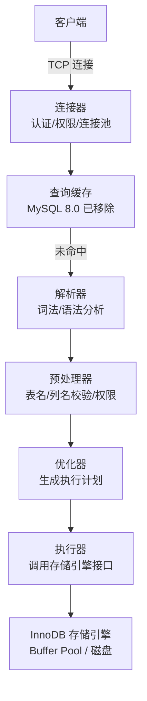

# SQL 执行与性能优化

!!! info "**SQL 执行与性能优化 一句话口诀**"
    **SQL 走四层：连接器 → 解析器 → 优化器 → 执行器**——8.0 已删除查询缓存，出问题先定位哪层。

    **优化器选索引靠 Cardinality，统计信息过期就会选错**——`ANALYZE TABLE` / `FORCE INDEX` / 覆盖索引是三张底牌。

    **EXPLAIN 看五列**：`type`（访问类型）/ `key`（真走索引）/ `key_len`（联合索引用多长）/ `rows`（扫描行）/ `Extra`（暗号）。

    **Join 原则：小表驱动大表 + 被驱动表走索引**——NLJ 要索引，没索引就退化 BNL（8.0.18+ 改走 Hash Join）。

    **深分页用延迟关联**：先走覆盖索引查主键，再 JOIN 回表拿数据，避免大 offset 扫后丢弃。

<!-- -->

> 📖 **边界声明**：本文聚焦 **SQL 执行链路 / 优化器代价模型 / EXPLAIN 字段 / Join 算法 / 慢查询排查**，以下主题请见对应专题：
>
> - 索引结构与失效原理 → [索引详解](@mysql-索引详解)
> - 缓冲池 / Change Buffer / 索引下推物理层实现 → [InnoDB存储引擎深度剖析](@mysql-InnoDB存储引擎深度剖析)
> - 线上慢 SQL 实战案例（N+1 / 大 IN / 燎原型 SQL）→ [实战问题与避坑指南](@mysql-实战问题与避坑指南)

---

## 1. 类比：SQL 执行像餐厅下单

你在餐厅点一份招牌菜（一条稍复杂的多表 JOIN SQL），从进门到菜上桌，会经过 6 个岗位的流水线——MySQL 执行 SQL 的过程几乎一模一样：

| 餐厅环节 | MySQL 对应 | 关键点 |
| :-- | :-- | :-- |
| **门口领位员**查预订、带位 | 连接器：认证 / 权限 / 分配 `THD` | 只决定你进不进得了店，不点菜 |
| **服务生**听懂你的点菜口令 | 解析器：词法 / 语法分析，生成 AST | 只管你说的话语法对不对 |
| **领班**去后厨核对：这菜单上有没有、材料够不够、你有没有资格点 | 预处理器：表名 / 列名 / 权限校验 | 语义校验，校验失败立刻报错 |
| **主厨**规划做菜顺序：先炖哪道、后炒哪道最省时 | 优化器：代价模型选执行计划 | 选走哪条索引、谁 Join 谁 |
| **厨师团队**按顺序切配、烹饪、装盘 | 执行器：调用 Handler API | 逐步执行、汇聚结果 |
| **传菜员**从后厨取菜端上桌 | 存储引擎：读写数据页 | Buffer Pool / 磁盘 IO |

**关键认知**：同一道菜可以有**多种做法**，主厨会按"哪种最快"选——但前提是他"猜得准哪条索引压力最小"，这个"猜"就是**代价模型 + 统计信息**的职责。统计信息一旦过期，主厨就会猜错、走的计划就慢。本文每一节都在围绕"**代价模型怎么算 / 怎么看 / 怎么干预**"展开。

---

## 2. 它解决了什么问题？

理解 SQL 执行原理和性能优化工具，能帮助你：

- 知道 SQL 在哪个环节出了问题（连接层、解析层、优化层、执行层）
- 理解优化器为什么选择某个索引，以及如何干预
- 掌握 Join 的底层算法，写出高效的多表查询
- 用 EXPLAIN 分析执行计划，找到真正的性能瓶颈
- 掌握常见的 SQL 优化手段

---

## 3. SQL 执行全链路

!!! note "📖 术语家族：`MySQL SQL 执行链路`"
    **字面义**：SQL 从客户端进入、到结果返回客户端，沿途经过的 6 个固定岗位的流水线。
    **在 MySQL 中的含义**：Server 层 4 个岗位（`Connector` / `Parser` / `Preprocessor` / `Optimizer` / `Executor`）+ 存储引擎层 1 个岗位（`Handler API → InnoDB`），构成 MySQL 执行 SQL 的完整链路。
    **同家族成员**：

    | 成员 | 职责 | 源码位置 |
    | :-- | :-- | :-- |
    | `Connector`（连接器） | 认证、权限分配、THD 会话上下文 | `sql/sql_connect.cc` |
    | `Parser`（解析器） | 词法/语法分析，输出 `LEX` 语法树 | `sql/sql_parse.cc`、`sql/sql_yacc.yy` |
    | `Preprocessor`（预处理器） | 表/列存在性、权限校验，视图展开 | `sql/sql_resolver.cc` |
    | `Optimizer`（优化器） | 代价模型选执行计划，生成 `JOIN` 对象 | `sql/sql_optimizer.cc`、`JOIN::optimize()` |
    | `Executor`（执行器） | 调 `handler::index_read` 等引擎接口 | `sql/sql_executor.cc` |
    | `Storage Engine`（存储引擎） | 真正读写页、管理 Buffer Pool | `storage/innobase/` |

    **命名规律**：Server 层的 5 个组件都是**名词化的角色**（`-or` 后缀：Connect-**or** / Pars-**er** / Optimiz-**er** / Execut-**or**），表示"**看着 `THD` 上下文干活的人**"；数据结构名用 **去 `-or`/`-er`** 的原形（`LEX` 语法树、`JOIN` 执行对象、`THD` 会话）。看到以 `-or`/`-er` 结尾的类名就知道它在做动作、其他名词都是状态。**作为该家族的源头文档**，后续文档涉及某一层时以 `📖` 引用本节。

### 3.1 各层职责



| 层次 | 职责 | 常见问题 |
| :--- | :--- | :--- |
| **连接器** | 认证用户、管理连接、分配权限 | 连接数过多（`Too many connections`） |
| **解析器** | 词法/语法分析，生成语法树 | SQL 语法错误 |
| **预处理器** | 验证表名列名是否存在，检查权限 | 表不存在、列名错误 |
| **优化器** | 选择最优执行计划（索引选择、Join 顺序） | 选错索引、执行计划不优 |
| **执行器** | 按执行计划调用存储引擎接口 | 权限不足 |

---

## 4. 查询优化器：代价模型

优化器的目标是找到**代价最小**的执行计划。代价 = IO 代价 + CPU 代价。

### 4.1 统计信息

优化器依赖统计信息做决策：

```sql
-- 查看表的统计信息
SHOW TABLE STATUS LIKE 'user'\G

-- 查看索引的统计信息（Cardinality：索引列的唯一值数量）
SHOW INDEX FROM user;

-- 手动更新统计信息（统计信息过期时优化器可能选错索引）
ANALYZE TABLE user;
```

**Cardinality（基数）**：索引列唯一值的数量。基数越高，索引区分度越好，优化器越倾向于使用该索引。

### 4.2 优化器选错索引的场景

```sql
-- 场景：明明有更好的索引，优化器却选了全表扫描
SELECT * FROM orders WHERE status = 1 ORDER BY create_time;
-- 原因：优化器估算走索引后需要大量回表，代价比全表扫描还高
```

**机制角度的三种干预手段**（本文只给出 SQL 示例，工程侧的"选型流程 / 压测对比"见实战篇）：

| 手段 | SQL / 动作 | 生效层 |
| :-- | :-- | :-- |
| 更新统计信息 | `ANALYZE TABLE orders;` | 让优化器**重估** Cardinality |
| 强制指定索引 | `SELECT ... FORCE INDEX(idx_create_time) ...` | **绕过**优化器决策 |
| 优化索引设计 | `ALTER TABLE orders ADD INDEX idx_status_time(status, create_time);` | 提供**更优**候选项 |

> 📖 线上"优化器选错索引"的完整排查清单（如何确认真选错、直方图 `ANALYZE TABLE ... UPDATE HISTOGRAM` 何时用、`FORCE INDEX` 的副作用）见 [实战问题与避坑指南](@mysql-实战问题与避坑指南)。

### 4.3 Optimizer Trace：透视优化器决策的黄金工具

当 `EXPLAIN` 告诉你"优化器选了 A 索引"却无法告诉你"为什么不选 B"时，**Optimizer Trace**（MySQL 5.6+）能把整个代价估算过程以 JSON 形式吐出来——每条候选索引的估算代价、`rows` 估算来源、Join 顺序枚举过程、ICP 是否启用，全部可见。

```sql
-- 1. 开启 Optimizer Trace（会话级）
SET optimizer_trace = 'enabled=on';
SET optimizer_trace_max_mem_size = 1000000;  -- 避免 trace 被截断

-- 2. 执行目标 SQL
SELECT * FROM orders WHERE status = 1 ORDER BY create_time LIMIT 10;

-- 3. 读取 trace
SELECT * FROM information_schema.OPTIMIZER_TRACE\G

-- 4. 关闭
SET optimizer_trace = 'enabled=off';
```

**trace 关键字段**：

| JSON 节点 | 看什么 |
| :-- | :-- |
| `rows_estimation` | 每个候选访问路径预估扫描的行数——**与 `EXPLAIN` 的 `rows` 对应** |
| `considered_access_paths` | 优化器枚举了哪些访问路径（全表、各个索引、range 扫描），每个路径的 `cost` 对比 |
| `chosen` | 最终选中的路径 + 被淘汰的路径及淘汰原因 |
| `attached_conditions_summary` | WHERE 条件被如何拆解（下推到索引 / 留在 Server 层） |

!!! tip "一句话用法"
    **`EXPLAIN` 看结论，`OPTIMIZER_TRACE` 看推理**。线上选错索引时，先看 trace 的 `rows_estimation`：如果估算值与真实值相差 10 倍以上，99% 是统计信息过期——立即 `ANALYZE TABLE`。

---

## 5. EXPLAIN 执行计划分析

### 5.1 EXPLAIN 关键字段

```sql
EXPLAIN SELECT * FROM user WHERE name = 'Tom' AND age > 18;
```

| 字段 | 含义 | 重点关注值 |
| :--- | :--- | :--- |
| **type** | 访问类型（性能从好到差） | `system > const > eq_ref > ref > range > index > ALL` |
| **key** | 实际使用的索引 | NULL 表示未使用索引 |
| **key_len** | 索引使用的字节数 | 越长说明使用了更多索引列 |
| **rows** | 预估扫描行数 | 越小越好 |
| **Extra** | 额外信息 | `Using index`（覆盖索引）、`Using filesort`（需优化）、`Using temporary`（需优化） |

!!! note "📖 术语家族：`EXPLAIN 输出字段族`"
    **字面义**：`EXPLAIN` = "解释"——告诉你优化器打算怎么跑这条 SQL。输出的**每一列都是诊断信号**，不是装饰。
    **在 MySQL 中的含义**：每一行 EXPLAIN 输出对应执行计划中的一个**访问节点**（一张表/一个子查询/一个UNION分支），各字段从"访问什么数据"、"用什么方式访问"、"访问代价多大"、"额外做了什么"四个角度描述。
    **同家族成员**：

    | 成员 | 读法 | 重点用法 |
    | :-- | :-- | :-- |
    | `id` | 查询形态 | 多表/子查询时 id 越大越先执行；id 相同按顺序 |
    | `select_type` | 查询类型 | `SIMPLE`/`PRIMARY`/`SUBQUERY`/`DERIVED`/`UNION` |
    | `table` | 访问的表 | 只有 `<derivedN>` 是派生表（子查询临时表）|
    | `partitions` | 命中的分区 | 仅分区表需看 |
    | `type` 🔥 | **访问类型**（性能从优到差）| `system`/`const`/`eq_ref`/`ref`/`range`/`index`/`ALL`——看到 `ALL` 就要优化 |
    | `possible_keys` | 优化器考虑的索引 | 仅供诊断用，不等于实际用 |
    | `key` 🔥 | **实际使用的索引** | NULL = 没走索引 |
    | `key_len` | **用了索引的多少个字节** | 联合索引用来判断走了几个列 |
    | `ref` | 与索引比较的列/常量 | `const`/`func`/表.列 |
    | `rows` 🔥 | **预估扫描行数** | 越小越好；和实际相差过大说明统计信息过期 |
    | `filtered` | 满足条件的行占扫描行比例 | 小且 rows 大 = 劳而无功 |
    | `Extra` 🔥 | **额外行为** | 看到 `Using filesort`/`Using temporary` 立刻优化 |

    **命名规律**：带 🔥 的四列（`type` / `key` / `rows` / `Extra`）是**优先级最高的四张诊断牌**——看 EXPLAIN 先刷这四列，其它是辅助证据。**作为该家族的源头文档**，后续其它文档涉及 EXPLAIN 字段时通过 `📖` 引用本节。

### 5.2 type 类型详解

```txt
system      → 表只有一行（系统表）
const       → 主键或唯一索引等值查询，最多一行（最优）
eq_ref      → JOIN 时使用主键或唯一索引
ref         → 普通索引等值查询
range       → 索引范围查询（BETWEEN、>、<、IN）
index       → 全索引扫描（比 ALL 好，但仍需关注）
ALL         → 全表扫描（⚠️ 需要优化）
```


### 5.3 Extra 字段含义

| Extra 值 | 含义 | 是否需要优化 |
| :--- | :--- | :--- |
| `Using index` | 覆盖索引，无需回表 | ✅ 很好 |
| `Using where` | 在索引扫描后还需过滤 | ⚠️ 可接受 |
| `Using filesort` | 需要额外排序（无法利用索引排序） | ⚠️ 需优化 |
| `Using temporary` | 使用了临时表（GROUP BY、DISTINCT 等） | ⚠️ 需优化 |
| `Using index condition` | 索引下推（ICP），减少回表次数 | ✅ 较好 |

---

## 6. Join 算法

!!! note "📖 术语家族：`MySQL Join 算法`"
    **字面义**：把两张表按匹配条件拼成一张的算法。
    **在 MySQL 中的含义**：优化器根据"**被驱动表 Join 列是否有索引**"和"**MySQL 版本**"，在 3 种循环算法 + 2 种 Semi/Anti-Join 转换之间选择。
    **同家族成员**：

    | 成员 | 触发条件 | 时间复杂度 | 源码依据 |
    | :-- | :-- | :-- | :-- |
    | `NLJ`（Nested Loop Join） | 被驱动表 Join 列**有索引** | O(N·log M) | `sql/sql_executor.cc::do_select()` |
    | `BNL`（Block Nested Loop） | 被驱动表 Join 列**无索引**，MySQL ≤ 8.0.17 默认 | O(N·M) | `join_buffer_size` 控制 |
    | `Hash Join` | 被驱动表 Join 列**无索引**，MySQL **8.0.18+** 默认 | O(N+M) | `sql/hash_join_iterator.cc` |
    | `Semi-Join` | `IN` / `EXISTS` 子查询被优化器转换，仅判**存在性**（不重复、不带子查询列） | 取决于策略 | MySQL 5.6+ 自动转换 |
    | `Anti-Join` | `NOT IN` / `NOT EXISTS` 子查询被转换，仅判**不存在性** | 取决于策略 | MySQL 8.0.17+ 显式支持 |

    **命名规律**：Join 算法名前缀都是"**循环/连接方式**"（Nested / Block Nested / Hash），后缀固定为 `Join`；Semi/Anti 不是并列第 4、5 种算法，而是 `IN`/`NOT IN` 子查询**被改写**后最终仍用 NLJ/BNL/Hash 执行，只是**语义**上只判存在/不存在。

### 6.1 Nested Loop Join（NLJ，嵌套循环）

最基础的 Join 算法，适合驱动表数据量小、被驱动表有索引的场景：

```txt
for each row in 驱动表（小表）:
    for each row in 被驱动表（大表，走索引）:
        if 满足 Join 条件:
            输出结果
```

```sql
-- 驱动表是小表，被驱动表走索引，性能好
SELECT * FROM orders o JOIN users u ON o.user_id = u.id
WHERE o.status = 1;
-- orders 是驱动表（有 WHERE 过滤），users.id 是主键（索引），NLJ 效率高
```

### 6.2 Block Nested Loop Join（BNL，块嵌套循环）

当被驱动表**没有索引**时，NLJ 退化为全表扫描，性能极差。BNL 通过 Join Buffer 优化：

```txt
将驱动表数据分批加载到 Join Buffer（内存）
for each batch in Join Buffer:
    全表扫描被驱动表，与 Join Buffer 中的数据批量匹配
```

- Join Buffer 大小由 `join_buffer_size` 控制（默认 256KB）
- 减少了被驱动表的全表扫描次数（从 N 次减少到 N/batch_size 次）
- **EXPLAIN 中 Extra 显示 `Using join buffer (Block Nested Loop)`，说明被驱动表缺少索引，需要优化**

### 6.3 Hash Join（MySQL 8.0.18+）

```txt
1. 将小表（Build 阶段）加载到内存哈希表
2. 扫描大表（Probe 阶段），用 Join 条件在哈希表中查找匹配行
```

- 比 BNL 更高效，时间复杂度 O(n+m) vs BNL 的 O(n*m)
- 适合大表 Join 且无索引的场景
- MySQL 8.0.18+ 自动使用，替代了 BNL

### 6.4 Join 优化原则

```sql
-- ✅ 小表驱动大表（MySQL 优化器通常会自动选择，但可以用 STRAIGHT_JOIN 强制）
SELECT * FROM small_table s STRAIGHT_JOIN large_table l ON s.id = l.sid;

-- ✅ 被驱动表的 Join 列必须有索引
ALTER TABLE orders ADD INDEX idx_user_id(user_id);

-- ❌ 避免超过 3 张表的 Join（复杂度指数级增长）
-- 拆分为多次查询或在应用层做关联
```

---

## 7. 不理解底层会踩的坑

深度理解优化器机制后，才能识别这几个**看起来正常、实际踩坑**的场景——它们不是 SQL 写错，而是**优化器的隐性决策**在悄悄拖慢查询。

### 7.1 坑一：统计信息过期导致"突然选错索引"

```sql
-- 凌晨批量导入 500 万新订单后，线上 SQL 突然从 10ms 恶化到 5s
SELECT * FROM orders WHERE status = 1 AND city = 'BJ' ORDER BY create_time LIMIT 20;
```

**根因链**：

1. MySQL 的 Cardinality 估算基于**随机页采样**（`innodb_stats_persistent_sample_pages`，默认 20 页）
2. 大批量新增 / 删除后，**样本分布严重偏离真实分布**，优化器以为 `city='BJ'` 只有 1% 的数据、实际是 30%
3. 优化器选了 `idx_city` 单列索引，回表 150 万行后再排序

**识别方式**：

- `EXPLAIN` 的 `rows` 列与 `COUNT(*)` 的真实值**相差 ≥ 10 倍** → 统计信息过期
- `OPTIMIZER_TRACE` 的 `rows_estimation` 节点异常小

**处置**：`ANALYZE TABLE orders;` 立刻重新采样；频繁写入场景设置 `innodb_stats_auto_recalc = ON` + 提高 `innodb_stats_persistent_sample_pages` 到 100+。

### 7.2 坑二：BNL 被静默触发，线上 CPU 飙高

```sql
-- 开发同学给新表 order_log 忘记建索引
SELECT * FROM orders o JOIN order_log l ON o.id = l.order_id WHERE o.status = 1;
```

**根因链**：

1. `order_log.order_id` 无索引
2. MySQL ≤ 8.0.17：**静默**退化为 BNL，`EXPLAIN` 的 `Extra` 出现 `Using join buffer (Block Nested Loop)`——**SQL 本身不会报错、不会变慢警告**
3. 驱动表扫出 10 万行，BNL 把 10 万行分批塞进 `join_buffer`，对 `order_log` 做 N 次**全表扫描**，CPU 100%

**识别方式**：`EXPLAIN` 的 `Extra` 含 `Using join buffer`——**不论是 `(Block Nested Loop)` 还是 `(hash join)`，都是被驱动表缺索引的红灯**。

**处置**：

- 短期：给被驱动表 Join 列加索引（NLJ 恢复）
- 长期：MySQL 升级到 8.0.18+，即便漏加索引，至少自动走 Hash Join，复杂度从 O(N·M) 降到 O(N+M)

### 7.3 坑三：WHERE 条件顺序"看起来应该走索引"却不走

```sql
-- INDEX(a, b, c)，看起来三列都用上了
SELECT * FROM t WHERE a = 1 AND b > 100 AND c = 5;
```

**根因**：`b > 100` 是**范围查询**，破坏了 `c` 列在索引中的有序性——优化器只能用到 `(a, b)` 前缀，`c = 5` 退化为**回表后过滤**。`key_len` 会明显短于"(a, b, c) 全部用上"时的字节数。

**识别方式**：`EXPLAIN` 的 `key_len` 对比"理论全部命中"的长度——短于预期即说明后续列未真正走索引。

**处置**：调整联合索引顺序为 `(a, c, b)`（等值列前置、范围列后置），或把 `c = 5` 改写为覆盖索引。

> 📖 索引失效的剩余 4 大场景（函数、隐式转换、前缀通配、OR 杂糅）已在 [索引详解](@mysql-索引详解) §7 系统展开，本文聚焦"优化器机制层面"的坑，不重复。

---

## 8. 子查询优化

### 8.1 IN 子查询的陷阱

```sql
-- ❌ 可能很慢：子查询每次都执行
SELECT * FROM orders WHERE user_id IN (
    SELECT id FROM users WHERE city = '北京'
);

-- ✅ 改为 JOIN（优化器通常会自动转换，但显式写出更清晰）
SELECT o.* FROM orders o
JOIN users u ON o.user_id = u.id
WHERE u.city = '北京';
```

MySQL 5.6+ 优化器会自动将 IN 子查询转换为 Semi-Join，性能已大幅改善。但复杂子查询仍建议手动改写为 JOIN。

### 8.2 EXISTS vs IN

```sql
-- 外表小、内表大：用 EXISTS（外表驱动，内表走索引）
SELECT * FROM users u WHERE EXISTS (
    SELECT 1 FROM orders o WHERE o.user_id = u.id
);

-- 外表大、内表小：用 IN（内表先执行，结果集小）
SELECT * FROM orders WHERE user_id IN (
    SELECT id FROM users WHERE vip_level = 5
);
```

---

## 9. 机制层典型案例

> 📖 **索引失效的 5 大场景（函数 / 隐式转换 / LIKE 前缀 / OR / 最左前缀）** 和 **覆盖索引基础案例** 已在 [索引详解](@mysql-索引详解) 系统展开；线上实战案例（N+1 查询、大 IN 列表炸库、燎原型 SQL）见 [实战问题与避坑指南](@mysql-实战问题与避坑指南)。本章只保留**从优化器机制角度解释"为什么这样写更快"**的两个经典案例。

### 9.1 案例 1：ORDER BY 文件排序 —— 索引的"顺序"本是现成的

```sql
-- ❌ 问题 SQL：排序字段不在索引中
SELECT * FROM user WHERE status = 1 ORDER BY create_time DESC;
-- EXPLAIN 显示 Extra=Using filesort

-- ✅ 优化后：建立联合索引 INDEX(status, create_time)
-- EXPLAIN 显示 Extra=Using index condition（无 filesort）
```

**机制解释**：B+ 树的叶子节点**天然按索引列升序链接**。`INDEX(status, create_time)` 在 `status=1` 的等值过滤后，`create_time` 在该子区间内是**物理有序**的——MySQL 直接**顺序遍历叶子链表**即可得到排好序的结果，零排序开销。没有这个联合索引时，MySQL 必须把所有 `status=1` 的行**装进排序缓冲区**（`sort_buffer_size`）做归并排序，`Using filesort` 本质是"缓冲区放不下就落盘排序"的警报。

### 9.2 案例 2：深分页延迟关联 —— 用覆盖索引减少回表次数

```sql
-- ❌ 深分页，offset 很大时性能极差（需要扫描并丢弃大量数据）
SELECT * FROM orders ORDER BY id LIMIT 1000000, 10;

-- ✅ 延迟关联：先用覆盖索引查主键，再 JOIN 获取完整数据
SELECT o.* FROM orders o
INNER JOIN (
    SELECT id FROM orders ORDER BY id LIMIT 1000000, 10
) t ON o.id = t.id;
```

**机制解释**：`SELECT *` + `LIMIT 1000000, 10` 的执行动作是"**扫描前 1,000,010 行完整行数据、丢弃前 1,000,000 行、返回后 10 行**"——**前 100 万行的回表全是白做**（InnoDB 要把每一行的所有列字段从聚簇索引的叶子页读出）。延迟关联先让内层子查询在**覆盖索引 `PRIMARY`** 上走（叶子即主键值、无需回表），扫完 1,000,010 个主键只要 1/10 的代价；外层只对最终 10 行做回表。**回表次数从 1,000,010 降到 10**，这是"回表代价 × 行数"的直接节省。

> 📖 分页优化的完整工程方案（基于游标的 seek method、业务层"只显示前 100 页"、`Keyset Pagination` 模式）见 [实战问题与避坑指南](@mysql-实战问题与避坑指南)。

---

## 10. SQL 优化技巧汇总

> 📖 **完整 checklist（18 条优化清单、配置参数建议、压测对比数据）** 见 [实战问题与避坑指南](@mysql-实战问题与避坑指南)。本文作为深度源码型文档，只从**优化器机制**角度归纳六条"为什么要这样做"的硬核规则：

| 优化方向 | 底层机制依据 |
| :-- | :-- |
| **避免全表扫描** | `type=ALL` 意味着优化器认为走索引代价更高——要么没索引，要么统计信息过期；先修根因再谈干预 |
| **避免回表** | 二级索引叶子存主键、不存完整行；回表 = 多一次 B+ 树查找。覆盖索引让叶子即结果 |
| **避免文件排序** | B+ 树叶子天然有序，联合索引的"等值列+排序列"组合让 ORDER BY 零成本 |
| **减少扫描行数** | `EXPLAIN rows` 是代价模型核心输入；`SELECT *` 让覆盖索引失效、强制回表 |
| **分页优化** | 深分页的代价 = 回表次数 × 行数，延迟关联把回表次数从 offset+limit 降到 limit |
| **批量操作** | 逐条 INSERT 每次都要过连接器→解析器→优化器→执行器→刷 redo log；批量 INSERT 复用前 4 层 + 合并 WAL 刷盘 |

---

## 11. 慢查询日志：MySQL 内部的写入机制

**写入机制**：当 SQL 执行耗时超过 `long_query_time`（默认 10s，线上一般设 1s）时，MySQL 在 SQL 返回给客户端**之前**把 `THD` 里的执行统计（耗时、扫描行数、Lock time、返回行数、full_scan 标志等）追加写入 `slow_query_log_file`。这是**同步写**——慢日志本身的 IO 也会计入这条 SQL 的耗时，因此生产环境 `long_query_time` 不能设得过低，否则大量 1~10ms 的查询反而因频繁写日志进一步恶化。

```sql
-- 查看 / 开启慢查询
SHOW VARIABLES LIKE 'slow_query%';
SHOW VARIABLES LIKE 'long_query_time';

SET GLOBAL slow_query_log = ON;
SET GLOBAL long_query_time = 1;
SET GLOBAL slow_query_log_file = '/var/log/mysql/slow.log';

-- 记录未走索引的查询（开发环境开启，生产慎用——可能刷屏）
SET GLOBAL log_queries_not_using_indexes = ON;
```

> 📖 **线上慢查询排查流程图、`pt-query-digest` 用法、按 QPS / R-Call 聚合分析** 见 [实战问题与避坑指南](@mysql-实战问题与避坑指南)。本文只讲 MySQL 内部的写入机制，不展开运维工具链。

---

## 12. 常见问题

**Q：优化器为什么会选错索引？如何解决？**

> 优化器基于统计信息估算代价，统计信息不准确时会选错。解决方案：① `ANALYZE TABLE` 更新统计信息；② `FORCE INDEX` 强制指定索引；③ 优化索引设计（如覆盖索引减少回表代价）。

**Q：小表驱动大表是什么意思？为什么这样更快？**

> Join 时用数据量小的表作为驱动表（外层循环），大表作为被驱动表（内层循环，走索引）。驱动表每行都要对被驱动表做一次索引查找，驱动表越小，索引查找次数越少，性能越好。

**Q：EXPLAIN 中最重要的字段是什么？type=ALL 意味着什么？**

> 最重要的是 `type`、`key`、`rows`、`Extra`。`type=ALL` 表示全表扫描，是性能最差的访问方式，需要检查索引是否建立或是否失效。

**Q：EXPLAIN 中看到 `Using filesort` 怎么办？**

> `Using filesort` 表示无法利用索引排序，需要额外的排序操作。解决方案：建立包含 ORDER BY 列的索引，且索引列顺序与 ORDER BY 一致；注意 WHERE 条件列和 ORDER BY 列的联合索引设计。

**Q：如何优化深分页查询？**

> 使用延迟关联：先用覆盖索引查出主键列表（速度快），再用主键 JOIN 获取完整数据，避免大偏移量扫描大量数据后丢弃。

**Q：什么情况下 IN 子查询会很慢？**

> MySQL 5.5 及以前，IN 子查询不会被优化，每次外层查询都执行一次子查询，复杂度 O(n*m)。MySQL 5.6+ 已优化为 Semi-Join。但如果子查询结果集很大（超过几万行），仍建议改写为 JOIN。

> 📖 **排查题 / 选型题 / 调优题**（"线上突然选错索引怎么办"、"EXISTS vs IN 在具体业务中如何选"、"深分页业务层还有什么替代方案"）已归入 [实战问题与避坑指南](@mysql-实战问题与避坑指南)，本文专注"源码机制"题。

---

## 13. 一句话口诀

> **SQL 走四层：连接器 → 解析器 → 优化器 → 执行器**——8.0 删除了查询缓存，出问题先按层定位；**优化器靠代价模型选计划，代价模型靠统计信息喂数据**——`ANALYZE TABLE` / `FORCE INDEX` / 覆盖索引是三张干预底牌，选错索引的根因 90% 是统计信息过期；**`EXPLAIN` 看结论、`OPTIMIZER_TRACE` 看推理**，`type` / `key` / `key_len` / `rows` / `Extra` 五列是刷牌顺序；**Join 算法三兄弟：NLJ（有索引）/ BNL（无索引·旧）/ Hash Join（无索引·8.0.18+）**，`Extra` 里出现 `Using join buffer` 无论哪种都是红灯；**深分页慢的不是 LIMIT、是回表**，延迟关联用覆盖索引把回表次数从百万降到十。
