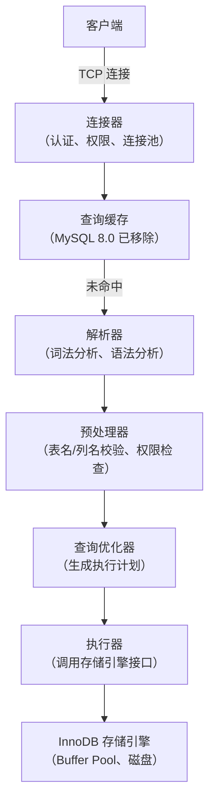
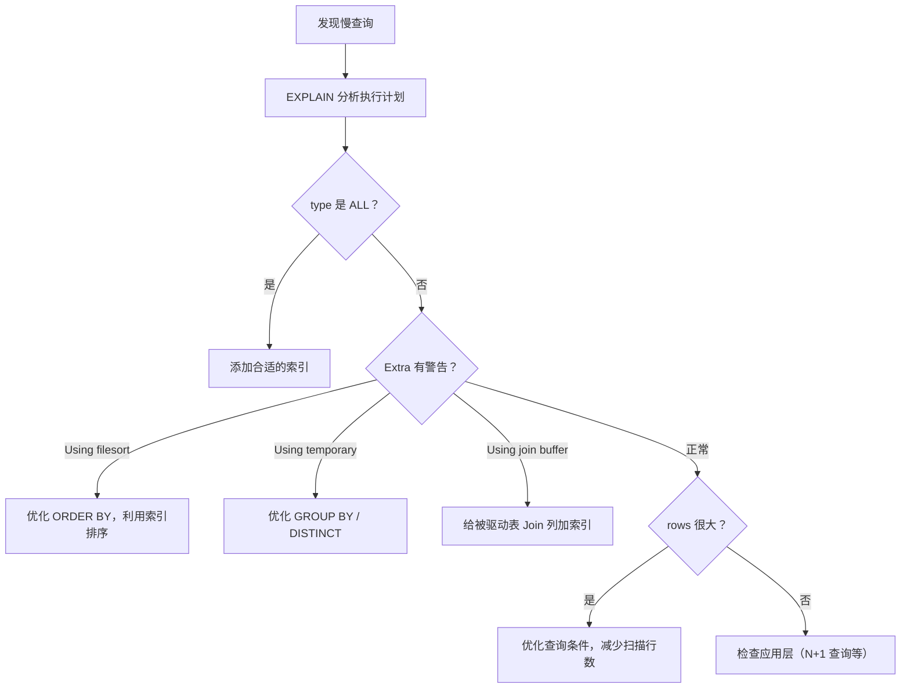

# SQL 执行原理与查询优化器

> **核心问题**：一条 SQL 是如何被执行的？查询优化器是如何选择执行计划的？为什么有时候优化器选错了索引？

---

## 它解决了什么问题？

理解 SQL 执行原理，能帮助你：

- 知道 SQL 在哪个环节出了问题（连接层、解析层、优化层、执行层）
- 理解优化器为什么选择某个索引，以及如何干预
- 掌握 Join 的底层算法，写出高效的多表查询
- 分析慢查询，找到真正的性能瓶颈

---

## SQL 执行全链路



### 各层职责

| 层次 | 职责 | 常见问题 |
|------|------|---------|
| **连接器** | 认证用户、管理连接、分配权限 | 连接数过多（`Too many connections`） |
| **解析器** | 词法/语法分析，生成语法树 | SQL 语法错误 |
| **预处理器** | 验证表名列名是否存在，检查权限 | 表不存在、列名错误 |
| **优化器** | 选择最优执行计划（索引选择、Join 顺序） | 选错索引、执行计划不优 |
| **执行器** | 按执行计划调用存储引擎接口 | 权限不足 |

---

## 查询优化器：代价模型

优化器的目标是找到**代价最小**的执行计划。代价 = IO 代价 + CPU 代价。

### 统计信息

优化器依赖统计信息做决策：

```sql
-- 查看表的统计信息
SHOW TABLE STATUS LIKE 'user'\G

-- 查看索引的统计信息（Cardinality：索引列的唯一值数量）
SHOW INDEX FROM user;

-- 手动更新统计信息（统计信息过期时优化器可能选错索引）
ANALYZE TABLE user;
```

**Cardinality（基数）**：索引列唯一值的数量。基数越高，索引区分度越好，优化器越倾向于使用该索引。

### 优化器选错索引的场景

```sql
-- 场景：明明有更好的索引，优化器却选了全表扫描
SELECT * FROM orders WHERE status = 1 ORDER BY create_time;

-- 原因：优化器估算走索引后需要大量回表，代价比全表扫描还高

-- 解决方案1：强制指定索引
SELECT * FROM orders FORCE INDEX(idx_create_time) WHERE status = 1 ORDER BY create_time;

-- 解决方案2：更新统计信息
ANALYZE TABLE orders;

-- 解决方案3：优化索引设计（覆盖索引避免回表）
ALTER TABLE orders ADD INDEX idx_status_time(status, create_time);
```

---

## Join 算法

### Nested Loop Join（NLJ，嵌套循环）

最基础的 Join 算法，适合驱动表数据量小、被驱动表有索引的场景：

```
for each row in 驱动表（小表）:
    for each row in 被驱动表（大表，走索引）:
        if 满足 Join 条件:
            输出结果
```

```sql
-- 驱动表是小表，被驱动表走索引，性能好
SELECT * FROM orders o JOIN users u ON o.user_id = u.id
WHERE o.status = 1;
-- orders 是驱动表（有 WHERE 过滤），users.id 是主键（索引），NLJ 效率高
```

### Block Nested Loop Join（BNL，块嵌套循环）

当被驱动表**没有索引**时，NLJ 退化为全表扫描，性能极差。BNL 通过 Join Buffer 优化：

```
将驱动表数据分批加载到 Join Buffer（内存）
for each batch in Join Buffer:
    全表扫描被驱动表，与 Join Buffer 中的数据批量匹配
```

- Join Buffer 大小由 `join_buffer_size` 控制（默认 256KB）
- 减少了被驱动表的全表扫描次数（从 N 次减少到 N/batch_size 次）
- **EXPLAIN 中 Extra 显示 `Using join buffer (Block Nested Loop)`，说明被驱动表缺少索引，需要优化**

### Hash Join（MySQL 8.0.18+）

```
1. 将小表（Build 阶段）加载到内存哈希表
2. 扫描大表（Probe 阶段），用 Join 条件在哈希表中查找匹配行
```

- 比 BNL 更高效，时间复杂度 O(n+m) vs BNL 的 O(n*m)
- 适合大表 Join 且无索引的场景
- MySQL 8.0.18+ 自动使用，替代了 BNL

### Join 优化原则

```sql
-- ✅ 小表驱动大表（MySQL 优化器通常会自动选择，但可以用 STRAIGHT_JOIN 强制）
SELECT * FROM small_table s STRAIGHT_JOIN large_table l ON s.id = l.sid;

-- ✅ 被驱动表的 Join 列必须有索引
ALTER TABLE orders ADD INDEX idx_user_id(user_id);

-- ❌ 避免超过 3 张表的 Join（复杂度指数级增长）
-- 拆分为多次查询或在应用层做关联
```

---

## 子查询优化

### IN 子查询的陷阱

```sql
-- ❌ 可能很慢：子查询每次都执行
SELECT * FROM orders WHERE user_id IN (
    SELECT id FROM users WHERE city = '北京'
);

-- ✅ 改为 JOIN（优化器通常会自动转换，但显式写出更清晰）
SELECT o.* FROM orders o
JOIN users u ON o.user_id = u.id
WHERE u.city = '北京';
```

MySQL 5.6+ 优化器会自动将 IN 子查询转换为 Semi-Join，性能已大幅改善。但复杂子查询仍建议手动改写为 JOIN。

### EXISTS vs IN

```sql
-- 外表小、内表大：用 EXISTS（外表驱动，内表走索引）
SELECT * FROM users u WHERE EXISTS (
    SELECT 1 FROM orders o WHERE o.user_id = u.id
);

-- 外表大、内表小：用 IN（内表先执行，结果集小）
SELECT * FROM orders WHERE user_id IN (
    SELECT id FROM users WHERE vip_level = 5
);
```

---

## 慢查询分析

### 开启慢查询日志

```sql
-- 查看慢查询配置
SHOW VARIABLES LIKE 'slow_query%';
SHOW VARIABLES LIKE 'long_query_time';

-- 开启慢查询日志（超过 1 秒的查询记录）
SET GLOBAL slow_query_log = ON;
SET GLOBAL long_query_time = 1;
SET GLOBAL slow_query_log_file = '/var/log/mysql/slow.log';

-- 记录未走索引的查询（开发环境有用）
SET GLOBAL log_queries_not_using_indexes = ON;
```

### pt-query-digest 分析

```bash
# 分析慢查询日志，按总耗时排序
pt-query-digest /var/log/mysql/slow.log

# 输出示例：
# Rank  Query ID    Response time  Calls  R/Call  Item
#    1  0xABC...    120.0000 45.2%   1000  0.1200  SELECT orders WHERE...
```

### 慢查询排查步骤



---

## 常见问题

**Q：优化器为什么会选错索引？如何解决？**

> 优化器基于统计信息估算代价，统计信息不准确时会选错。解决方案：① `ANALYZE TABLE` 更新统计信息；② `FORCE INDEX` 强制指定索引；③ 优化索引设计（如覆盖索引减少回表代价）。

**Q：小表驱动大表是什么意思？为什么这样更快？**

> Join 时用数据量小的表作为驱动表（外层循环），大表作为被驱动表（内层循环，走索引）。驱动表每行都要对被驱动表做一次索引查找，驱动表越小，索引查找次数越少，性能越好。

**Q：EXPLAIN 中看到 `Using filesort` 怎么办？**

> `Using filesort` 表示无法利用索引排序，需要额外的排序操作。解决方案：建立包含 ORDER BY 列的索引，且索引列顺序与 ORDER BY 一致；注意 WHERE 条件列和 ORDER BY 列的联合索引设计。

**Q：什么情况下 IN 子查询会很慢？**

> MySQL 5.5 及以前，IN 子查询不会被优化，每次外层查询都执行一次子查询，复杂度 O(n*m)。MySQL 5.6+ 已优化为 Semi-Join。但如果子查询结果集很大（超过几万行），仍建议改写为 JOIN。
